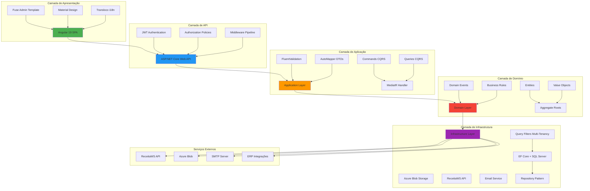
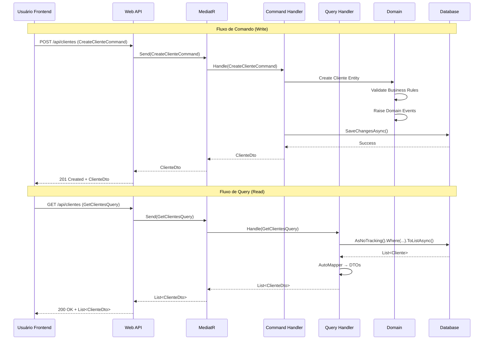
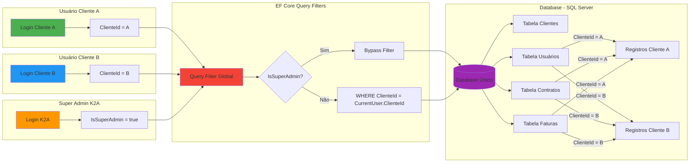
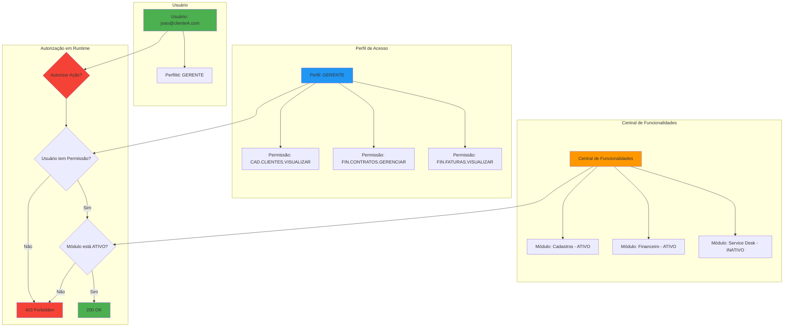
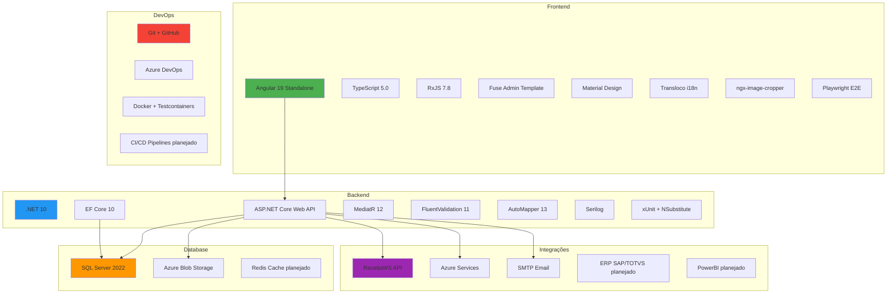

# ANEXO 1 - Diagrama de Arquitetura Técnica

**Projeto:** IControlIT - Refatoração
**Data:** 2026-01-14
**Versão:** 1.0

---

## 1. Arquitetura Clean Architecture + CQRS

---

## 2. Fluxo CQRS (Commands e Queries)

---

## 3. Multi-Tenancy - Row-Level Security

**Explicação:**
- **1 banco de dados** substituiu **18 bancos físicos** do legado
- **Isolamento lógico** via `ClienteId` em todas as tabelas
- **EF Core Query Filters** aplicam `WHERE ClienteId = X` automaticamente
- **Super Admin K2A** tem bypass (`IsSuperAdmin = true`)
- **Cliente A NÃO vê dados do Cliente B** (isolamento 100%)

---

## 4. RBAC - Sistema de Permissões

**Fluxo de Autorização:**
1. Usuário tenta acessar `/api/contratos` (GET)
2. Sistema verifica se usuário tem permissão `FIN.CONTRATOS.VISUALIZAR`
3. Sistema verifica se módulo "Financeiro" está ATIVO para o cliente
4. Se ambos OK → 200 OK, senão → 403 Forbidden

---

## 5. Stack Tecnológica Completa

---

## 6. Benefícios da Arquitetura

### **vs. Sistema Legado:**

| Aspecto | Legado | Novo Sistema |
|---------|--------|--------------|
| **Arquitetura** | Monolítica | Clean Architecture + CQRS |
| **Bancos de Dados** | 18 físicos | 1 lógico (Row-Level Security) |
| **Multi-Tenancy** | Separação física | Isolamento lógico (EF Core) |
| **RBAC** | Permissões hardcoded | RBAC granular + Central Funcionalidades |
| **i18n** | Não suportado | pt-BR, en-US, es-ES (Transloco) |
| **API Externa** | Nenhuma | ReceitaWS, Azure Blob |
| **Testes** | Manuais | Unitários + E2E (Playwright) |
| **Auditoria** | Logs simples | Domain Events + LGPD (7 anos) |
| **Onboarding Cliente** | 3-5 dias (manual DBA) | < 5 minutos (API) |

---

## 7. Segurança em Camadas

```mermaid
graph TD
    subgraph "Camadas de Segurança"
        S1[1. HTTPS TLS 1.3]
        S2[2. JWT Access Token 15min]
        S3[3. JWT Refresh Token 7 dias]
        S4[4. RBAC Permissões Granulares]
        S5[5. Multi-Tenancy Query Filters]
        S6[6. FluentValidation Input]
        S7[7. SQL Injection Protection EF Core]
        S8[8. CORS Policies]
        S9[9. Rate Limiting planejado]
        S10[10. Domain Events Auditoria]
    end

    S1 --> S2
    S2 --> S3
    S3 --> S4
    S4 --> S5
    S5 --> S6
    S6 --> S7
    S7 --> S8
    S8 --> S9
    S9 --> S10

    style S1 fill:#4CAF50
    style S5 fill:#F44336
    style S10 fill:#2196F3
```

---

## 8. Padrões de Projeto Implementados

- ✅ **Clean Architecture** (separação de responsabilidades)
- ✅ **CQRS** (Commands vs. Queries)
- ✅ **Domain-Driven Design** (Entities, Value Objects, Aggregates)
- ✅ **Repository Pattern** (abstração de acesso a dados)
- ✅ **Dependency Injection** (IoC Container)
- ✅ **Mediator Pattern** (MediatR)
- ✅ **Event Sourcing** (Domain Events)
- ✅ **Unit of Work** (DbContext SaveChanges)
- ✅ **Specification Pattern** (Query Filters)
- ✅ **DTO Pattern** (AutoMapper)

---

**Conclusão:**

A arquitetura implementada é **moderna, escalável, segura e testável**. Substitui um sistema monolítico legado por uma solução baseada em padrões de mercado (Clean Architecture, CQRS, DDD) com isolamento multi-tenancy robusto e RBAC granular.

**Tempo de implementação:** 3 meses (Fases 1-2)
**Status:** ✅ Fundação técnica completa e validada
