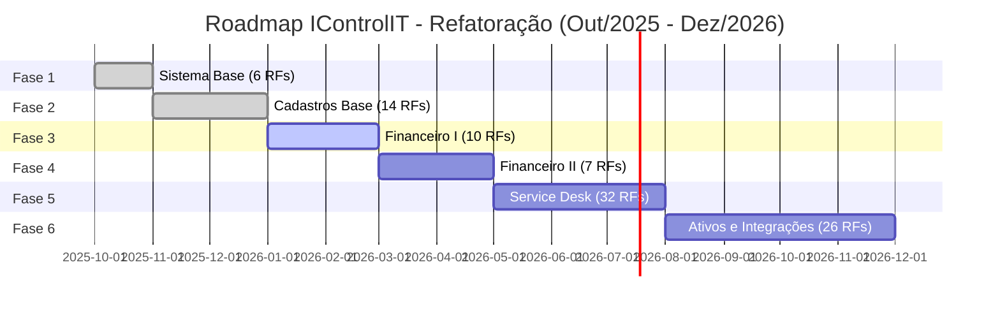
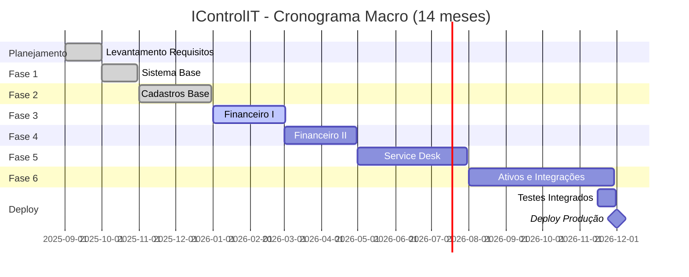

# ANEXO 2 - Roadmap Detalhado (Fases 3-6)

**Projeto:** IControlIT - Refatoração
**Data:** 2026-01-14
**Versão:** 1.0

---

## Visão Geral do Projeto

---

## Status Consolidado

| Fase | EPICs | RFs | Status | Duração | Conclusão |
|------|-------|-----|--------|---------|-----------|
| **Fase 1** | 2 EPICs | 6 RFs | ✅ **CONCLUÍDA** | 1 mês | Dez/2025 |
| **Fase 2** | 3 EPICs | 14 RFs | ✅ **CONCLUÍDA** | 2 meses | Dez/2025 |
| **Fase 3** | 1 EPIC | 10 RFs | 🔄 **EM ANDAMENTO** | 2 meses | Fev/2026 |
| **Fase 4** | 1 EPIC | 7 RFs | ⏳ **PLANEJADA** | 2 meses | Abr/2026 |
| **Fase 5** | 1 EPIC | 32 RFs | ⏳ **PLANEJADA** | 3 meses | Jul/2026 |
| **Fase 6** | 3 EPICs | 26 RFs | ⏳ **PLANEJADA** | 4 meses | Nov/2026 |
| **TOTAL** | **11 EPICs** | **95 RFs** | **21% concluído** | **14 meses** | **Nov/2026** |

---

## FASE 1 - Sistema Base ✅ CONCLUÍDA

**Duração:** 1 mês (Out/2025)
**Status:** ✅ 100% implementado e validado

### EPIC001 - SYS - Sistema Infraestrutura

| RF | Nome | Complexidade | Status |
|----|------|--------------|--------|
| **RF001** | Parâmetros e Configurações | Média | ✅ DONE |
| **RF003** | Logs, Monitoramento, Observabilidade | Alta | ✅ DONE |
| **RF004** | Auditoria e Logs Sistema | Alta | ✅ DONE |
| **RF005** | i18n, Orçamento, Provisão | Alta | ✅ DONE |
| **RF006** | Gestão de Clientes (Multi-Tenancy) | Crítica | ✅ DONE |
| **RF007** | Login e Autenticação | Alta | ✅ DONE |

### EPIC002 - CAD - Cadastros Sistema

| RF | Nome | Complexidade | Status |
|----|------|--------------|--------|
| **RF012** | Gestão de Usuários | Alta | ✅ DONE |
| **RF013** | Gestão de Perfis de Acesso (RBAC) | Alta | ✅ DONE |

**Entregas Fase 1:**
- ✅ Multi-tenancy SaaS (Row-Level Security)
- ✅ Autenticação JWT + Refresh Token
- ✅ RBAC granular por funcionalidade
- ✅ i18n (pt-BR, en-US, es-ES)
- ✅ Auditoria LGPD (Domain Events + 7 anos retenção)
- ✅ Logs estruturados (Serilog)

---

## FASE 2 - Cadastros Base ✅ CONCLUÍDA

**Duração:** 2 meses (Nov-Dez/2025)
**Status:** ✅ 100% implementado e validado

### EPIC003 - CAD - Cadastros Base

| RF | Nome | Complexidade | Status |
|----|------|--------------|--------|
| **RF015** | Gestão Locais/Endereços | Média | ✅ DONE |
| **RF016** | Gestão Categorias de Ativos | Baixa | ✅ DONE |
| **RF018** | Gestão de Cargos | Baixa | ✅ DONE |
| **RF019** | Gestão de Tipos de Ativos | Média | ✅ DONE |
| **RF020** | Gestão de Documentos e Anexos | Média | ✅ DONE |
| **RF022** | Gestão de Fornecedores | Média | ✅ DONE |
| **RF043** | Gestão de Endereços Entrega | Baixa | ✅ DONE |
| **RF047** | Gestão de Tipos Consumidores | Baixa | ✅ DONE |

### EPIC004 - TPL - Templates

| RF | Nome | Complexidade | Status |
|----|------|--------------|--------|
| **RF051** | Gestão de Templates | Média | ✅ DONE |
| **RF052** | Gestão de Tipos Templates | Baixa | ✅ DONE |

### EPIC005 - NOT - Notificações

| RF | Nome | Complexidade | Status |
|----|------|--------------|--------|
| **RF048** | Gestão de Notificações Usuários | Alta | ✅ DONE |
| **RF059** | Gestão de Regras Notificações | Alta | ✅ DONE |
| **RF060** | Gestão de Disparos Agendados | Alta | ✅ DONE |
| **RF083** | Central de Módulos | Alta | ✅ DONE |

**Entregas Fase 2:**
- ✅ 14 RFs de cadastros fundamentais
- ✅ Sistema de notificações (email, push, in-app)
- ✅ Central de Funcionalidades (controle de módulos ativos)
- ✅ Templates customizáveis

---

## FASE 3 - Financeiro I (Base Contábil) 🔄 EM ANDAMENTO

**Duração:** 2 meses (Jan-Fev/2026)
**Status:** 🔄 0% implementado (iniciando)
**Previsão Conclusão:** Fev/2026

### EPIC006 - FIN - Financeiro Base

| RF | Nome | Complexidade | Prioridade | Status |
|----|------|--------------|------------|--------|
| **RF017** | Hierarquia Corporativa | Alta | P0 | ⏳ TODO |
| **RF023** | Gestão de Contratos | Crítica | P0 | ⏳ TODO |
| **RF024** | Gestão de Departamentos | Média | P1 | ⏳ TODO |
| **RF026** | Gestão de Faturas | Crítica | P0 | ⏳ TODO |
| **RF030** | Gestão de Parâmetros Faturamento | Alta | P1 | ⏳ TODO |
| **RF031** | Gestão de Plano de Contas | Alta | P0 | ⏳ TODO |
| **RF032** | Gestão de Notas Fiscais Faturas | Alta | P0 | ⏳ TODO |
| **RF089** | Conciliação e Auditoria Faturas | Crítica | P0 | ⏳ TODO |
| **RF090** | Medição Faturamento Contratos | Alta | P1 | ⏳ TODO |
| **RF097** | Auditoria de Faturas | Alta | P1 | ⏳ TODO |

**Entregas Fase 3:**
- ⏳ CRUD de Contratos (tarifas, SLAs, vigência, índices reajuste)
- ⏳ Gestão de Faturas (captura, importação, anexos)
- ⏳ Auditoria automática de conformidade (cruzamento Fatura × Contrato × Inventário)
- ⏳ Hierarquia Corporativa (CNPJ, filiais, centros de custo)
- ⏳ Plano de Contas Contábil
- ⏳ Conciliação de Notas Fiscais

**Impacto:** Sistema passa a ter **processos de negócio** (não apenas cadastros)

---

## FASE 4 - Financeiro II (Processos) ⏳ PLANEJADA

**Duração:** 2 meses (Mar-Abr/2026)
**Status:** ⏳ 0% implementado
**Previsão Conclusão:** Abr/2026

### EPIC007 - FIN - Financeiro Processos

| RF | Nome | Complexidade | Prioridade | Status |
|----|------|--------------|------------|--------|
| **RF025** | Gestão de Ativos | Alta | P0 | ⏳ TODO |
| **RF036** | Gestão de Custos Fixos | Média | P1 | ⏳ TODO |
| **RF037** | Gestão de Custos por Ativo | Alta | P1 | ⏳ TODO |
| **RF042** | Gestão de Notas Fiscais Estoque | Média | P2 | ⏳ TODO |
| **RF055** | Gestão de Rateio | Crítica | P0 | ⏳ TODO |
| **RF057** | Gestão de Itens Rateio | Alta | P0 | ⏳ TODO |
| **RF094** | Auditoria de Custos e Compliance | Alta | P1 | ⏳ TODO |

**Entregas Fase 4:**
- ⏳ Sistema de Rateio (regras automáticas, multi-critério)
- ⏳ Gestão de Ativos (ciclo de vida, depreciação)
- ⏳ Custos Fixos e Variáveis
- ⏳ Auditoria de Custos
- ⏳ Relatórios: Orçamento vs. Realizado, Custos por Ativo, Mapa de Contas

**Impacto:** Sistema passa a ter **processos financeiros completos**

---

## FASE 5 - Service Desk ⏳ PLANEJADA

**Duração:** 3 meses (Mai-Jul/2026)
**Status:** ⏳ 0% implementado
**Previsão Conclusão:** Jul/2026

### EPIC008 - SD - Service Desk

| RF | Nome | Complexidade | Prioridade | Status |
|----|------|--------------|------------|--------|
| **RF021** | Catálogo de Serviços | Média | P1 | ⏳ TODO |
| **RF027** | Gestão de Aditivos Contratos | Alta | P1 | ⏳ TODO |
| **RF028** | Gestão de SLA Operações | Alta | P0 | ⏳ TODO |
| **RF029** | Gestão de SLA Serviços | Alta | P0 | ⏳ TODO |
| **RF033** | Gestão de Chamados | Crítica | P0 | ⏳ TODO |
| **RF038** | Gestão de SLA Solicitações | Alta | P0 | ⏳ TODO |
| **RF044** | Gestão de KPIs | Alta | P1 | ⏳ TODO |
| **RF045** | Gestão de Volumetria | Média | P2 | ⏳ TODO |
| **RF049** | Gestão de Políticas Consumidores | Média | P2 | ⏳ TODO |
| **RF053** | Gestão de Solicitações | Alta | P0 | ⏳ TODO |
| **RF056** | Gestão de Filas Atendimento | Alta | P1 | ⏳ TODO |
| **RF061** | Gestão Ordens Serviço | Alta | P0 | ⏳ TODO |
| **RF062** | Gestão Fornecedores Parceiros | Média | P2 | ⏳ TODO |
| **RF069** | Configuração SLA Chamados | Alta | P0 | ⏳ TODO |
| **RF070** | Base Conhecimento | Média | P2 | ⏳ TODO |
| **RF071** | Pesquisa Satisfação | Baixa | P3 | ⏳ TODO |
| **RF072** | Escalação Automática | Alta | P1 | ⏳ TODO |
| **RF073** | Gestão de Chamados e SLA | Alta | P0 | ⏳ TODO |
| **RF074** | Gestão de Chamados Tickets | Alta | P0 | ⏳ TODO |
| **RF078** | Integração ERPs | Crítica | P0 | ⏳ TODO |
| **RF079** | Gestão Políticas Compliance | Média | P2 | ⏳ TODO |
| **RF080** | Gestão Termos Aceite LGPD | Alta | P1 | ⏳ TODO |
| **RF081** | Termos de Responsabilidade | Média | P2 | ⏳ TODO |
| **RF082** | Termos de Responsabilidade (dup) | Média | P2 | ⏳ TODO |
| **RF092** | Garantias Seguros Contratuais | Baixa | P3 | ⏳ TODO |
| **RF093** | Indicadores Performance Compliance | Alta | P1 | ⏳ TODO |
| **RF099** | Dashboards e KPIs | Alta | P1 | ⏳ TODO |
| **RF100** | Dashboards e KPIs (dup) | Alta | P1 | ⏳ TODO |
| **RF103** | Relatórios e Volumetria | Média | P2 | ⏳ TODO |
| **RF110** | Cache Distribuído Performance | Alta | P1 | ⏳ TODO |
| **RF111** | Backup Recuperação DR | Crítica | P0 | ⏳ TODO |
| **RF112** | Jobs e Tarefas Agendadas | Alta | P1 | ⏳ TODO |

**Entregas Fase 5:**
- ⏳ Sistema de Chamados (abertura, triagem, atendimento, fechamento)
- ⏳ Gestão de SLAs (configuração, medição, alertas)
- ⏳ Ordens de Serviço (field service)
- ⏳ Catálogo de Serviços
- ⏳ Base de Conhecimento
- ⏳ Integração ERP (SAP, TOTVS)
- ⏳ Dashboards e KPIs operacionais
- ⏳ Pesquisa de Satisfação

**Impacto:** Sistema passa a ter **gestão completa de Service Desk**

---

## FASE 6 - Ativos, Auditoria e Integrações ⏳ PLANEJADA

**Duração:** 4 meses (Ago-Nov/2026)
**Status:** ⏳ 0% implementado
**Previsão Conclusão:** Nov/2026

### EPIC009 - AST - Ativos e Inventário

| RF | Nome | Complexidade | Prioridade | Status |
|----|------|--------------|------------|--------|
| **RF041** | Gestão de Estoque Aparelhos | Alta | P1 | ⏳ TODO |
| **RF046** | Gestão de Grupos Troncos | Média | P2 | ⏳ TODO |
| **RF050** | Gestão Linhas Chips SIM | Alta | P0 | ⏳ TODO |
| **RF068** | Inventário Cíclico Auditoria Estoque | Alta | P1 | ⏳ TODO |

### EPIC010 - AUD - Auditoria Avançada

| RF | Nome | Complexidade | Prioridade | Status |
|----|------|--------------|------------|--------|
| **RF034** | Gestão de Itens Auditoria | Alta | P1 | ⏳ TODO |
| **RF035** | Gestão de Resumos Auditoria | Média | P2 | ⏳ TODO |
| **RF039** | Gestão de Bilhetes | Alta | P1 | ⏳ TODO |
| **RF040** | Gestão de Troncos | Média | P2 | ⏳ TODO |
| **RF054** | Gestão de Lotes Auditoria | Alta | P1 | ⏳ TODO |
| **RF095** | Auditoria Acesso Segurança | Alta | P1 | ⏳ TODO |
| **RF096** | Auditoria Mudanças Dados | Alta | P1 | ⏳ TODO |
| **RF098** | Auditoria Logs Sistema | Média | P2 | ⏳ TODO |

### EPIC011 - INT - Integrações

| RF | Nome | Complexidade | Prioridade | Status |
|----|------|--------------|------------|--------|
| **RF075** | Roaming Internacional | Média | P2 | ⏳ TODO |
| **RF076** | Manutenção Preventiva e Corretiva | Média | P2 | ⏳ TODO |
| **RF077** | Ordens Serviço Atendimento | Alta | P1 | ⏳ TODO |
| **RF087** | Integrações e APIs Externas | Crítica | P0 | ⏳ TODO |
| **RF091** | Anexos Documentos Contratuais | Baixa | P3 | ⏳ TODO |
| **RF101** | Dashboards Executivos Operacionais | Alta | P0 | ⏳ TODO |
| **RF102** | Relatórios e Análises | Alta | P0 | ⏳ TODO |
| **RF105** | Integração Operadoras Telecom | Alta | P1 | ⏳ TODO |
| **RF108** | CAPTCHA MFA Contestação | Média | P2 | ⏳ TODO |
| **RF109** | Gestão Documentos Originais Digitalização | Média | P2 | ⏳ TODO |
| **RF113** | Automação RPA e Bots | Crítica | P0 | ⏳ TODO |
| **RF114** | RPA Email Cache BI | Alta | P1 | ⏳ TODO |
| **RF115** | Refactoring Débito Técnico | Baixa | P3 | ⏳ TODO |

**Entregas Fase 6:**
- ⏳ Gestão de Inventário (linhas, chips, estoque)
- ⏳ Auditoria de Bilhetes Telecom
- ⏳ Integração com Operadoras (Vivo, Claro, TIM, Oi)
- ⏳ RPA - Captura automática de faturas (bots)
- ⏳ PowerBI Integration (dashboards customizáveis)
- ⏳ Relatórios executivos (PDF, Excel, PPT com AI)
- ⏳ Integração ERP completa (bidirectional)

**Impacto:** Sistema passa a ter **automação robusta + IA preditiva**

---

## Cronograma Macro

---

## Priorização de RFs

### **P0 - Críticos (MVP Produção):**
- RF006, RF007, RF013, RF023, RF026, RF031, RF032, RF089 (Contratos + Faturas + Auditoria)
- RF033, RF053, RF061, RF073, RF074 (Service Desk core)
- RF087, RF113 (Integrações + RPA)

### **P1 - Alta Prioridade:**
- RF017, RF024, RF030, RF055, RF057 (Financeiro completo)
- RF028, RF029, RF038, RF069 (SLAs)
- RF101, RF102 (Dashboards + BI)

### **P2 - Média Prioridade:**
- RF036, RF037, RF042 (Custos)
- RF044, RF045, RF103 (Relatórios)
- RF050, RF068 (Inventário)

### **P3 - Baixa Prioridade (Nice-to-have):**
- RF071 (Pesquisa Satisfação)
- RF092 (Garantias)
- RF115 (Refactoring)

---

## Marcos de Validação

| Marco | Data | Critério | Liberação Acesso |
|-------|------|----------|------------------|
| **M1: MVP Cadastros** | ✅ Dez/2025 | Fases 1-2 completas | ❌ Não (apenas infraestrutura) |
| **M2: MVP Financeiro** | Fev/2026 | Fase 3 completa | ✅ **Sim (K2A interna)** |
| **M3: MVP Service Desk** | Jul/2026 | Fase 5 completa | ✅ **Sim (Clientes piloto)** |
| **M4: MVP Produção** | Nov/2026 | Fases 1-6 completas | ✅ **Sim (Todos os clientes)** |

---

## Estimativas de Esforço

| Fase | RFs | Complexidade Média | Person-Months | Equipe | Duração |
|------|-----|-------------------|---------------|--------|---------|
| Fase 1 | 8 | Alta | 2 PM | 2 devs | 1 mês |
| Fase 2 | 14 | Média | 4 PM | 2 devs | 2 meses |
| Fase 3 | 10 | Alta | 4 PM | 2 devs | 2 meses |
| Fase 4 | 7 | Alta | 4 PM | 2 devs | 2 meses |
| Fase 5 | 32 | Média-Alta | 6 PM | 2 devs | 3 meses |
| Fase 6 | 26 | Alta | 8 PM | 2 devs | 4 meses |
| **Total** | **97 RFs** | **Média-Alta** | **28 PM** | **2 devs** | **14 meses** |

---

## Riscos e Mitigação

| Risco | Probabilidade | Impacto | Mitigação |
|-------|--------------|---------|-----------|
| Integração ERP complexa | Alta | Alto | Iniciar POC em Fase 4 |
| RPA falha em portais fornecedores | Média | Alto | Fallback manual + monitoramento |
| Performance com grande volume | Média | Médio | Cache Redis + Query optimization |
| Mudanças de escopo | Alta | Alto | Contrato de mudança formal |
| Dependência de APIs externas | Média | Médio | Fallback + retry policy |

---

**Conclusão:**

Roadmap prevê **14 meses de desenvolvimento** (Out/2025 - Nov/2026) com **97 RFs** distribuídos em **6 fases** incrementais.

**Status atual:** 21% concluído (Fases 1-2), Fase 3 iniciando em Jan/2026.

**Liberação de acesso:** Recomendada após Fase 3 (Fev/2026) quando sistema terá **processos de negócio úteis** (Contratos + Faturas + Auditoria).
