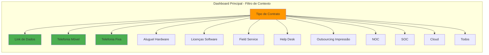
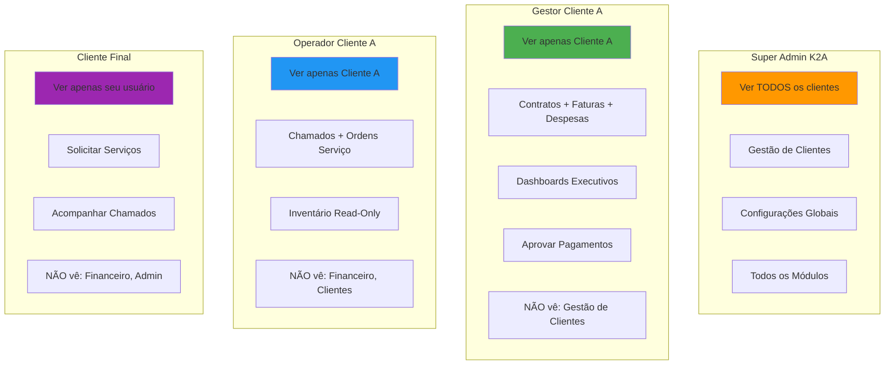
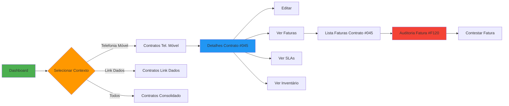

# ANEXO 3 - Protótipo de Menu Matricial

**Projeto:** IControlIT - Refatoração
**Data:** 2026-01-14
**Versão:** 1.0

---

## 1. Estrutura Matricial (Conceito)

```
┌─────────────────────────────────────────────────────────────────────┐
│                      VETOR HORIZONTAL                                │
│     Link    Telefonia  Telefonia   Hardware  Software  Field   ...  │
│     Dados     Móvel      Fixa                           Service      │
├─────────────────────────────────────────────────────────────────────┤
│ V  Gestão de Contratos       ●         ●         ●         ●         │
│ E  Gestão de Inventário      ●         ●         ●         ●         │
│ T  Gestão de Faturas         ●         ●         ●         ●         │
│ O  Gestão de Despesas        ●         ●         ●         ●         │
│ R  Gestão de Pagamentos      ●         ●         ●         ●         │
│    Gestão de Ativos          ●         ●         ●         ●         │
│ V  Gestão de Pedidos         ●         ●         ●         ●         │
│ E  Help Desk                 ●         ●         ●         ●         │
│ R                                                                     │
│ T                                                                     │
│ I                                                                     │
│ C                                                                     │
│ A                                                                     │
│ L                                                                     │
└─────────────────────────────────────────────────────────────────────┘
```

**Cada intersecção (●) representa um contexto específico:**
- Ex: "Gestão de Contratos × Telefonia Móvel" → Contratos de telefonia móvel
- Ex: "Gestão de Faturas × Link Dados" → Faturas de links de dados

---

## 2. Menu Lateral (Vetor Vertical) - Estrutura Final

```mermaid
graph TD
    ROOT[IControlIT]

    ROOT --> MOD1[1. Gestão de Contratos]
    ROOT --> MOD2[2. Gestão de Inventário]
    ROOT --> MOD3[3. Gestão de Faturas]
    ROOT --> MOD4[4. Gestão de Despesas]
    ROOT --> MOD5[5. Gestão de Pagamentos]
    ROOT --> MOD6[6. Gestão de Ativos]
    ROOT --> MOD7[7. Gestão de Pedidos / Help Desk]
    ROOT --> MOD8[8. Relatórios e Dashboards]
    ROOT --> MOD9[9. Cadastros]
    ROOT --> MOD10[10. Configurações]

    MOD1 --> M1S1[Cadastro de Contratos]
    MOD1 --> M1S2[Tarifas e Custos]
    MOD1 --> M1S3[SLAs]
    MOD1 --> M1S4[Vigência e Reajustes]
    MOD1 --> M1S5[Documentos Digitalizados]
    MOD1 --> M1S6[Alertas de Vencimento]
    MOD1 --> M1S7[Verbas do Contrato]

    MOD2 --> M2S1[Cadastro de Itens]
    MOD2 --> M2S2[Associação Contratos]
    MOD2 --> M2S3[Associação Usuários]
    MOD2 --> M2S4[Associação Centros Custo]
    MOD2 --> M2S5[Associação CNPJ]
    MOD2 --> M2S6[Estoque Disponível]

    MOD3 --> M3S1[Captura de Faturas RPA]
    MOD3 --> M3S2[Importação Manual]
    MOD3 --> M3S3[Auditoria Automática]
    MOD3 --> M3S4[Contestação]
    MOD3 --> M3S5[Relatório de Conformidade]
    MOD3 --> M3S6[Conciliação com NF]

    MOD4 --> M4S1[Rateio Automático]
    MOD4 --> M4S2[Regras de Rateio]
    MOD4 --> M4S3[Relatório de Rateio]
    MOD4 --> M4S4[Integração ERP]
    MOD4 --> M4S5[Orçamento vs Realizado]
    MOD4 --> M4S6[Custos por Contrato/Ativo]

    MOD5 --> M5S1[Kit de Pagamentos]
    MOD5 --> M5S2[Workflow Aprovação]
    MOD5 --> M5S3[Provisão de Pagamentos]
    MOD5 --> M5S4[Mapa de Contas por Ativo]
    MOD5 --> M5S5[Integração Financeiro]

    MOD6 --> M6S1[Ciclo de Vida]
    MOD6 --> M6S2[Termos Responsabilidade]
    MOD6 --> M6S3[Termos Devolução]
    MOD6 --> M6S4[Depreciação]
    MOD6 --> M6S5[Inventário Cíclico]

    MOD7 --> M7S1[Cadastro Fornecedores]
    MOD7 --> M7S2[Chamados e Tickets]
    MOD7 --> M7S3[Ordens de Serviço]
    MOD7 --> M7S4[SLAs Operacionais]
    MOD7 --> M7S5[Base Conhecimento]
    MOD7 --> M7S6[Pesquisa Satisfação]

    MOD8 --> M8S1[Dashboards Customizáveis]
    MOD8 --> M8S2[PowerBI Integration]
    MOD8 --> M8S3[Relatórios Padrão]
    MOD8 --> M8S4[Relatórios Customizados]
    MOD8 --> M8S5[Exportação Excel/PDF/PPT]

    MOD9 --> M9S1[Clientes]
    MOD9 --> M9S2[Usuários]
    MOD9 --> M9S3[Fornecedores]
    MOD9 --> M9S4[Locais e Endereços]
    MOD9 --> M9S5[Categorias e Tipos]
    MOD9 --> M9S6[Departamentos]

    MOD10 --> M10S1[Perfis de Acesso]
    MOD10 --> M10S2[Parâmetros Sistema]
    MOD10 --> M10S3[Templates]
    MOD10 --> M10S4[Notificações]
    MOD10 --> M10S5[Auditoria e Logs]

    style ROOT fill:#2196F3
    style MOD1 fill:#4CAF50
    style MOD3 fill:#4CAF50
    style MOD4 fill:#4CAF50
    style MOD7 fill:#4CAF50
```



---

## 3. Menu Horizontal (Vetor Horizontal) - Tipos de Contratos



**Comportamento:**
- Usuário seleciona tipo de contrato no dashboard inicial
- Todos os módulos (Contratos, Faturas, Inventário, etc.) são filtrados automaticamente
- Opção "Todos" exibe visão consolidada multi-contratos
- Cliente pode configurar quais tipos são visíveis (Central de Funcionalidades)

---

## 4. Wireframe - Menu Completo

```
┌─────────────────────────────────────────────────────────────────────────────────┐
│ IControlIT                        [Filtro: Telefonia Móvel ▼]  [PT-BR ▼]  [User]│
├─────────────┬───────────────────────────────────────────────────────────────────┤
│             │                                                                     │
│ MENU        │  ┌─────────────────────────────────────────────────────────────┐  │
│             │  │  Dashboard - Telefonia Móvel                                 │  │
│ ●  Home     │  ├─────────────────────────────────────────────────────────────┤  │
│             │  │                                                               │  │
│ 1. Contratos│  │  📊 Total Contratos: 15 ativos                               │  │
│    └ Lista  │  │  💰 Custo Mensal: R$ 125.450,00                              │  │
│    └ Novo   │  │  📱 Linhas Ativas: 1.243                                     │  │
│    └ SLAs   │  │  ⚠️  Alertas: 3 contratos vencendo em 30 dias                │  │
│    └ Verbas │  │                                                               │  │
│             │  │  ┌──────────────┬──────────────┬──────────────┐              │  │
│ 2. Inventár.│  │  │ Contratos    │ Faturas      │ Chamados     │              │  │
│    └ Itens  │  │  │ Vigentes: 15 │ Pendentes: 3 │ Abertos: 7   │              │  │
│    └ Assoc. │  │  └──────────────┴──────────────┴──────────────┘              │  │
│    └ Estoque│  │                                                               │  │
│             │  │  [Gráfico de Consumo]  [Top 5 Gastos]  [SLA Compliance]      │  │
│ 3. Faturas  │  │                                                               │  │
│    └ Captura│  └─────────────────────────────────────────────────────────────┘  │
│    └ Auditor│                                                                     │
│    └ Contest│                                                                     │
│    └ Concil.│                                                                     │
│             │                                                                     │
│ 4. Despesas │                                                                     │
│    └ Rateio │                                                                     │
│    └ Orç vs │                                                                     │
│    └ Custos │                                                                     │
│             │                                                                     │
│ 5. Pagament.│                                                                     │
│ 6. Ativos   │                                                                     │
│ 7. Help Desk│                                                                     │
│ 8. Relatóri.│                                                                     │
│ 9. Cadastros│                                                                     │
│10. Config.  │                                                                     │
│             │                                                                     │
└─────────────┴─────────────────────────────────────────────────────────────────┘
```

---

## 5. Mockup - Gestão de Contratos (Exemplo)

```
┌─────────────────────────────────────────────────────────────────────────────────┐
│ IControlIT > Contratos > Lista                [Telefonia Móvel ▼]  [PT-BR ▼]    │
├─────────────────────────────────────────────────────────────────────────────────┤
│                                                                                   │
│  🔍 Buscar contratos...     [Status: Todos ▼]  [Vigência ▼]    [+ Novo Contrato]│
│                                                                                   │
│  ┌─────┬───────────────┬────────────┬──────────┬───────────┬────────┬────────┐  │
│  │ Nº  │ Fornecedor    │ Vigência   │ Valor    │ SLA       │ Status │ Ações  │  │
│  ├─────┼───────────────┼────────────┼──────────┼───────────┼────────┼────────┤  │
│  │ 001 │ Vivo          │ 01/01/2024 │ R$ 45k   │ 99.5%     │ ✅ Ativo│ ⚙️ ✏️ 📄│  │
│  │     │               │ 31/12/2026 │          │ ✅ OK      │        │        │  │
│  ├─────┼───────────────┼────────────┼──────────┼───────────┼────────┼────────┤  │
│  │ 002 │ Claro         │ 15/03/2023 │ R$ 38k   │ 98.0%     │ ⚠️ Venc.│ ⚙️ ✏️ 📄│  │
│  │     │               │ 14/03/2026 │          │ ⚠️ Baixo   │ 45 dias│        │  │
│  ├─────┼───────────────┼────────────┼──────────┼───────────┼────────┼────────┤  │
│  │ 003 │ TIM           │ 01/06/2024 │ R$ 42k   │ 99.8%     │ ✅ Ativo│ ⚙️ ✏️ 📄│  │
│  │     │               │ 31/05/2027 │          │ ✅ Excelen.│        │        │  │
│  └─────┴───────────────┴────────────┴──────────┴───────────┴────────┴────────┘  │
│                                                                                   │
│  📊 Total: 15 contratos  |  💰 Soma Mensal: R$ 125k  |  ⚠️ 3 vencendo <60 dias   │
│                                                                                   │
└─────────────────────────────────────────────────────────────────────────────────┘
```

**Ações disponíveis:**
- ⚙️ Menu ações (Visualizar, Editar, Inativar, Aditivos, Histórico)
- ✏️ Editar diretamente
- 📄 Ver documentos digitalizados

---

## 6. Mockup - Gestão de Faturas (Exemplo)

```
┌─────────────────────────────────────────────────────────────────────────────────┐
│ IControlIT > Faturas > Auditoria Automática    [Telefonia Móvel ▼]  [PT-BR ▼]   │
├─────────────────────────────────────────────────────────────────────────────────┤
│                                                                                   │
│  📅 Competência: [Jan/2026 ▼]    [🔄 Executar Auditoria]    [📥 Exportar Excel] │
│                                                                                   │
│  ┌───────────────────────────────────────────────────────────────────────────┐  │
│  │ RESUMO DA AUDITORIA - Jan/2026                                            │  │
│  ├───────────────────────────────────────────────────────────────────────────┤  │
│  │ ✅ Conformes: 12 faturas (R$ 98.450,00)                                   │  │
│  │ ⚠️  Divergências: 3 faturas (R$ 27.000,00)                                │  │
│  │ 🔴 Erros Críticos: 1 fatura (R$ 12.500,00)                                │  │
│  │                                                                            │  │
│  │ 💡 Economia Identificada: R$ 8.320,00                                     │  │
│  └───────────────────────────────────────────────────────────────────────────┘  │
│                                                                                   │
│  ┌─────┬───────────┬──────────────┬────────────┬─────────┬──────────┬────────┐  │
│  │ ID  │ Fornecedor│ Competência  │ Valor      │ Status  │ Divergênc│ Ação   │  │
│  ├─────┼───────────┼──────────────┼────────────┼─────────┼──────────┼────────┤  │
│  │ F001│ Vivo      │ Jan/2026     │ R$ 45.200  │ ✅ OK   │ -        │ ✔️      │  │
│  ├─────┼───────────┼──────────────┼────────────┼─────────┼──────────┼────────┤  │
│  │ F002│ Claro     │ Jan/2026     │ R$ 38.320  │ ⚠️ Divg.│ 18 linhas│ 🔍 ✏️   │  │
│  │     │           │              │            │         │ inativas │        │  │
│  │     │           │              │            │         │ faturadas│        │  │
│  ├─────┼───────────┼──────────────┼────────────┼─────────┼──────────┼────────┤  │
│  │ F003│ TIM       │ Jan/2026     │ R$ 12.500  │ 🔴 Erro │ Faturado │ ⚠️ 📧   │  │
│  │     │           │              │            │         │ fora     │        │  │
│  │     │           │              │            │         │ contrato │        │  │
│  └─────┴───────────┴──────────────┴────────────┴─────────┴──────────┴────────┘  │
│                                                                                   │
│  🤖 IA Preditiva: "Padrão de faturamento de linhas inativas detectado (Claro).   │
│      Recomenda-se revisão de inventário antes de pagamento."                     │
│                                                                                   │
└─────────────────────────────────────────────────────────────────────────────────┘
```

**Ações disponíveis:**
- ✔️ Aprovar fatura
- 🔍 Detalhar divergência
- ✏️ Contestar fatura
- ⚠️ Escalar para gestor
- 📧 Enviar notificação fornecedor

---

## 7. Adaptação por Perfil de Usuário



**Controle de Visibilidade:**
- Menu lateral **adapta-se automaticamente** ao perfil RBAC do usuário
- Módulos inativos (Central de Funcionalidades) ficam **ocultos**
- Multi-tenancy garante que usuários **só veem dados do seu cliente**

---

## 8. Tela Inicial - Dashboard Configurável

```
┌─────────────────────────────────────────────────────────────────────────────────┐
│ IControlIT - Dashboard                          [Todos Contratos ▼]  [PT-BR ▼]  │
├─────────────────────────────────────────────────────────────────────────────────┤
│                                                                                   │
│  ┌──────────────────────────────────────────────────────────────────────────┐   │
│  │  Filtros Rápidos (Vetor Horizontal)                                      │   │
│  │  [📡 Link Dados]  [📱 Tel. Móvel]  [☎️ Tel. Fixa]  [🖥️ Hardware]  [Todos]│   │
│  └──────────────────────────────────────────────────────────────────────────┘   │
│                                                                                   │
│  ┌─────────────────┬─────────────────┬─────────────────┬─────────────────┐      │
│  │ 💰 Custo Mensal │ 📊 Contratos    │ 📄 Faturas      │ 🎫 Chamados     │      │
│  │ R$ 235.420,00   │ 45 ativos       │ 8 pendentes     │ 12 abertos      │      │
│  │ ↗️ +3.2% vs mês │ 3 vencendo      │ 2 divergências  │ 2 críticos      │      │
│  └─────────────────┴─────────────────┴─────────────────┴─────────────────┘      │
│                                                                                   │
│  ┌───────────────────────────────────┬───────────────────────────────────────┐  │
│  │ Gráfico: Custos por Tipo Contrato│ Gráfico: SLA Compliance              │  │
│  │                                   │                                       │  │
│  │ [Gráfico Pizza aqui]              │ [Gráfico Barra aqui]                 │  │
│  │                                   │                                       │  │
│  └───────────────────────────────────┴───────────────────────────────────────┘  │
│                                                                                   │
│  ┌─────────────────────────────────────────────────────────────────────────┐    │
│  │ ⚠️  Alertas e Notificações                                               │    │
│  ├─────────────────────────────────────────────────────────────────────────┤    │
│  │ 🔴 Contrato #045 (Vivo) vence em 15 dias                                │    │
│  │ ⚠️  Fatura #F120 (Claro) com divergência: R$ 2.300,00 a mais            │    │
│  │ 🔴 Chamado #CH089 (Crítico) SLA expirando em 2 horas                    │    │
│  │ ✅ 18 faturas aprovadas automaticamente (conformidade 100%)              │    │
│  └─────────────────────────────────────────────────────────────────────────┘    │
│                                                                                   │
│  [⚙️ Personalizar Dashboard]  [📥 Exportar Relatório]  [🔄 Atualizar]           │
│                                                                                   │
└─────────────────────────────────────────────────────────────────────────────────┘
```

**Configurações Disponíveis:**
- Arrastar/soltar widgets
- Escolher métricas exibidas
- Salvar layouts por perfil de usuário
- Agendar envio de relatórios (email automático)

---

## 9. Navegação Intuitiva



**Princípios de UX:**
- ✅ Máximo 3 cliques para qualquer ação
- ✅ Breadcrumb sempre visível
- ✅ Busca global (Ctrl+K)
- ✅ Ações contextuais no menu ⚙️
- ✅ Filtros persistem durante navegação

---

## 10. Responsividade Multi-Dispositivo

```
Desktop (1920x1080)           Tablet (768x1024)         Mobile (375x667)
┌───────────────────┐        ┌──────────────┐          ┌─────────┐
│ Menu  │  Conteúdo │        │ ☰  Conteúdo  │          │ ☰       │
│ Lat.  │           │        │              │          │ Content │
│       │           │        │              │          │         │
│       │           │        │              │          │         │
└───────────────────┘        └──────────────┘          └─────────┘

Menu fixo lateral            Menu colapsável           Menu hambúrguer
Tabelas completas            Tabelas simplificadas     Cards verticais
Gráficos lado a lado         Gráficos empilhados       Gráficos mínimos
```

---

## Conclusão

**Menu matricial** oferece:
- ✅ Navegação intuitiva por **processo de negócio** (Vetor Vertical)
- ✅ Filtro contextual por **tipo de contrato** (Vetor Horizontal)
- ✅ Adaptação automática por **perfil RBAC**
- ✅ Isolamento multi-tenancy **transparente** para usuário
- ✅ Dashboards **configuráveis** por cliente
- ✅ Experiência **consistente** em todos os módulos

**Diferença vs. Sistema Legado:**
- ❌ Legado: Menu genérico, navegação confusa, sem contexto
- ✅ Novo: Menu orientado a processo, filtro inteligente, UX moderna

**Implementação:**
- Fase 3: Primeiro módulo completo (Contratos + Faturas)
- Fase 4: Expansão para Despesas e Pagamentos
- Fase 5: Service Desk completo
- Fase 6: Menu final consolidado
