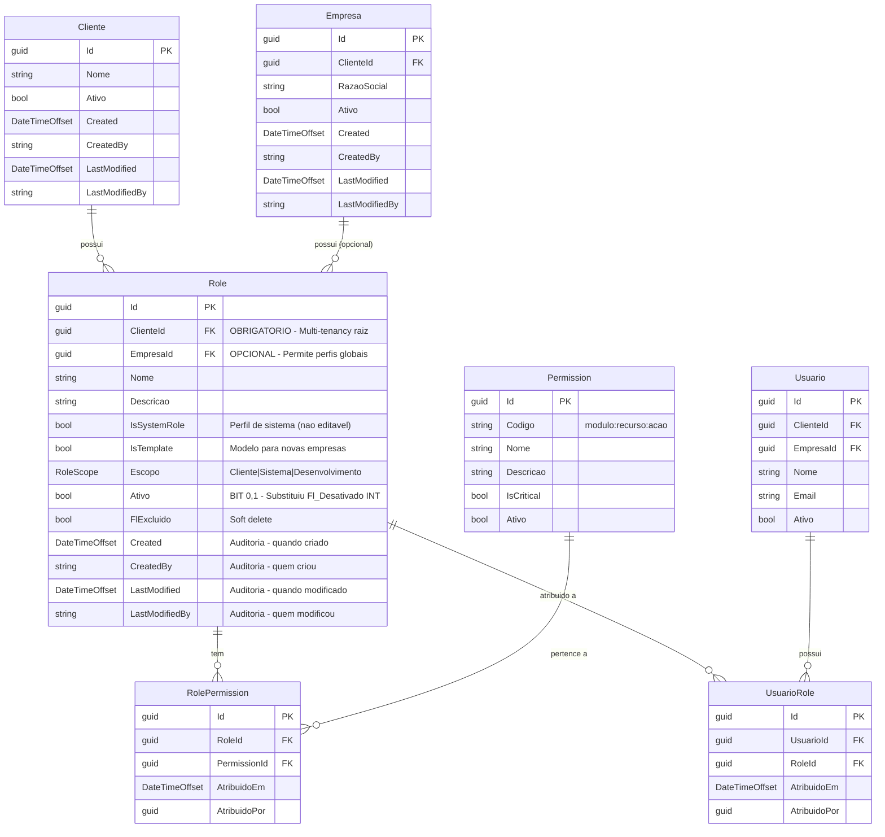

# Modelo de Dados - RF013

**Versao:** 2.0
**Data:** 2025-12-27
**RF Relacionado:** [RF013 - Gestao de Perfis de Acesso](./RF013.md)
**Banco de Dados:** SQL Server / Entity Framework Core

**CHANGELOG v2.0**:
- Adicionados campos de auditoria (BaseAuditableEntity): Created, CreatedBy, LastModified, LastModifiedBy
- Substituído Fl_Desativado INT (1,2) por Fl_Ativo BIT (0,1) conforme MELHORIAS.md
- Adicionado suporte completo a multi-tenancy (ClienteId, EmpresaId)
- Incluídas navegação e relacionamentos completos

---

## 1. Diagrama de Entidades Relacionamento (ER)



---

## 2. Entidades

### 2.1 Tabela: Role (Perfil de Acesso)

**Descricao:** Tabela principal que armazena os perfis/roles de acesso do sistema com controle de permissões granulares.

#### Campos

| Campo | Tipo | Nulo | Default | Descricao |
|-------|------|------|---------|-----------|
| Id | UNIQUEIDENTIFIER | NAO | NEWID() | Chave primaria (GUID) |
| ClienteId | UNIQUEIDENTIFIER | NAO | - | FK para Cliente (multi-tenancy RAIZ - obrigatorio) |
| EmpresaId | UNIQUEIDENTIFIER | SIM | NULL | FK para Empresa (opcional - permite perfis globais do cliente) |
| Nome | NVARCHAR(100) | NAO | - | Nome do perfil (ex: "Administrador", "Gestor Financeiro") |
| Descricao | NVARCHAR(500) | SIM | NULL | Descricao/finalidade do perfil |
| IsSystemRole | BIT | NAO | 0 | Indica se e perfil de sistema (nao editavel, mas deletavel) |
| IsTemplate | BIT | NAO | 0 | Indica se e modelo para criacao automatica em novas empresas |
| Escopo | INT | NAO | 0 | Enum RoleScope: 0=Cliente, 1=Sistema, 2=Desenvolvimento |
| Ativo | BIT | NAO | 1 | Status ativo/inativo (MELHORIA: substituiu Fl_Desativado INT) |
| FlExcluido | BIT | NAO | 0 | Soft delete (false=ativo, true=excluido) |
| DataDelecao | DATETIME2 | SIM | NULL | Data/hora da exclusao logica |
| Created | DATETIMEOFFSET | NAO | SYSDATETIMEOFFSET() | AUDITORIA: Data/hora UTC de criacao |
| CreatedBy | NVARCHAR(450) | SIM | NULL | AUDITORIA: ID do usuario que criou |
| LastModified | DATETIMEOFFSET | NAO | SYSDATETIMEOFFSET() | AUDITORIA: Data/hora UTC da ultima modificacao |
| LastModifiedBy | NVARCHAR(450) | SIM | NULL | AUDITORIA: ID do usuario que modificou |

#### Indices

| Nome | Colunas | Tipo | Descricao |
|------|---------|------|-----------|
| PK_Role | Id | CLUSTERED | Chave primaria |
| IX_Role_ClienteId | ClienteId | NONCLUSTERED | Performance em queries multi-tenant raiz |
| IX_Role_EmpresaId | EmpresaId | NONCLUSTERED | Performance em queries por empresa |
| IX_Role_Nome_ClienteId | Nome, ClienteId | NONCLUSTERED | Busca rapida + unicidade |
| IX_Role_Ativo | Ativo | NONCLUSTERED | Filtro de perfis ativos |
| IX_Role_IsSystemRole | IsSystemRole | NONCLUSTERED | Filtro de perfis de sistema |
| IX_Role_FlExcluido | FlExcluido | NONCLUSTERED | Queries que excluem deletados |

#### Constraints

| Nome | Tipo | Definicao | Descricao |
|------|------|-----------|-----------|
| PK_Role | PRIMARY KEY | Id | Chave primaria |
| FK_Role_Cliente | FOREIGN KEY | ClienteId REFERENCES Cliente(Id) | Multi-tenancy raiz OBRIGATORIO |
| FK_Role_Empresa | FOREIGN KEY | EmpresaId REFERENCES Empresa(Id) | Multi-tenancy por empresa (opcional) |
| UQ_Role_Nome_ClienteId | UNIQUE | (Nome, ClienteId) WHERE FlExcluido = 0 | Nome unico por cliente (exceto deletados) |
| CHK_Role_Escopo | CHECK | Escopo IN (0, 1, 2) | Valores validos de RoleScope |

---

### 2.2 Tabela: Permission (Permissao)

**Descricao:** Catalogo centralizado de permissoes granulares do sistema.

#### Campos

| Campo | Tipo | Nulo | Default | Descricao |
|-------|------|------|---------|-----------|
| Id | UNIQUEIDENTIFIER | NAO | NEWID() | Chave primaria (GUID) |
| Codigo | NVARCHAR(100) | NAO | - | Codigo unico formato: modulo:recurso:acao |
| Nome | NVARCHAR(200) | NAO | - | Nome amigavel da permissao |
| Descricao | NVARCHAR(500) | SIM | NULL | Descricao detalhada |
| IsCritical | BIT | NAO | 0 | Indica se e permissao critica (auditoria extra) |
| Ativo | BIT | NAO | 1 | Status ativo/inativo |
| Created | DATETIMEOFFSET | NAO | SYSDATETIMEOFFSET() | AUDITORIA: Data/hora de criacao |
| CreatedBy | NVARCHAR(450) | SIM | NULL | AUDITORIA: Usuario criador |
| LastModified | DATETIMEOFFSET | NAO | SYSDATETIMEOFFSET() | AUDITORIA: Data/hora modificacao |
| LastModifiedBy | NVARCHAR(450) | SIM | NULL | AUDITORIA: Usuario modificador |

#### Indices

| Nome | Colunas | Tipo | Descricao |
|------|---------|------|-----------|
| PK_Permission | Id | CLUSTERED | Chave primaria |
| UQ_Permission_Codigo | Codigo | UNIQUE | Codigo de permissao unico |
| IX_Permission_IsCritical | IsCritical | NONCLUSTERED | Filtro de permissoes criticas |
| IX_Permission_Ativo | Ativo | NONCLUSTERED | Filtro de permissoes ativas |

#### Constraints

| Nome | Tipo | Definicao | Descricao |
|------|------|-----------|-----------|
| PK_Permission | PRIMARY KEY | Id | Chave primaria |
| UQ_Permission_Codigo | UNIQUE | Codigo | Codigo unico de permissao |
| CHK_Permission_Codigo_Format | CHECK | Codigo LIKE '%:%:%' | Valida formato modulo:recurso:acao |

---

### 2.3 Tabela: RolePermission (Relacionamento Perfil x Permissao)

**Descricao:** Tabela de relacionamento many-to-many entre roles e permissions.

#### Campos

| Campo | Tipo | Nulo | Default | Descricao |
|-------|------|------|---------|-----------|
| Id | UNIQUEIDENTIFIER | NAO | NEWID() | Chave primaria (GUID) |
| RoleId | UNIQUEIDENTIFIER | NAO | - | FK para Role |
| PermissionId | UNIQUEIDENTIFIER | NAO | - | FK para Permission |
| AtribuidoEm | DATETIMEOFFSET | NAO | SYSDATETIMEOFFSET() | Data/hora da atribuicao |
| AtribuidoPor | UNIQUEIDENTIFIER | SIM | NULL | ID do usuario que atribuiu |

#### Indices

| Nome | Colunas | Tipo | Descricao |
|------|---------|------|-----------|
| PK_RolePermission | Id | CLUSTERED | Chave primaria |
| IX_RolePermission_RoleId | RoleId | NONCLUSTERED | Performance em queries por role |
| IX_RolePermission_PermissionId | PermissionId | NONCLUSTERED | Performance em queries por permission |
| UQ_RolePermission_Role_Permission | RoleId, PermissionId | UNIQUE | Impede duplicacao |

#### Constraints

| Nome | Tipo | Definicao | Descricao |
|------|------|-----------|-----------|
| PK_RolePermission | PRIMARY KEY | Id | Chave primaria |
| FK_RolePermission_Role | FOREIGN KEY | RoleId REFERENCES Role(Id) ON DELETE CASCADE | Relacionamento com Role |
| FK_RolePermission_Permission | FOREIGN KEY | PermissionId REFERENCES Permission(Id) ON DELETE CASCADE | Relacionamento com Permission |
| UQ_RolePermission_Role_Permission | UNIQUE | (RoleId, PermissionId) | Impede duplicacao de atribuicao |

---

### 2.4 Tabela: UsuarioRole (Relacionamento Usuario x Perfil)

**Descricao:** Tabela de relacionamento entre usuarios e perfis (many-to-many).

#### Campos

| Campo | Tipo | Nulo | Default | Descricao |
|-------|------|------|---------|-----------|
| Id | UNIQUEIDENTIFIER | NAO | NEWID() | Chave primaria (GUID) |
| UsuarioId | UNIQUEIDENTIFIER | NAO | - | FK para Usuario |
| RoleId | UNIQUEIDENTIFIER | NAO | - | FK para Role |
| AtribuidoEm | DATETIMEOFFSET | NAO | SYSDATETIMEOFFSET() | Data/hora da atribuicao |
| AtribuidoPor | UNIQUEIDENTIFIER | SIM | NULL | ID do usuario que atribuiu |

#### Indices

| Nome | Colunas | Tipo | Descricao |
|------|---------|------|-----------|
| PK_UsuarioRole | Id | CLUSTERED | Chave primaria |
| IX_UsuarioRole_UsuarioId | UsuarioId | NONCLUSTERED | Performance em queries por usuario |
| IX_UsuarioRole_RoleId | RoleId | NONCLUSTERED | Performance em queries por role |
| UQ_UsuarioRole_Usuario_Role | UsuarioId, RoleId | UNIQUE | Impede duplicacao |

#### Constraints

| Nome | Tipo | Definicao | Descricao |
|------|------|-----------|-----------|
| PK_UsuarioRole | PRIMARY KEY | Id | Chave primaria |
| FK_UsuarioRole_Usuario | FOREIGN KEY | UsuarioId REFERENCES Usuario(Id) ON DELETE CASCADE | Relacionamento com Usuario |
| FK_UsuarioRole_Role | FOREIGN KEY | RoleId REFERENCES Role(Id) ON DELETE CASCADE | Relacionamento com Role |
| UQ_UsuarioRole_Usuario_Role | UNIQUE | (UsuarioId, RoleId) | Impede duplicacao de atribuicao |

---

## 3. Relacionamentos

| Tabela Origem | Cardinalidade | Tabela Destino | Descricao |
|---------------|---------------|----------------|-----------|
| Cliente | 1:N | Role | Cliente possui muitos perfis (multi-tenancy raiz) |
| Empresa | 1:N | Role | Empresa pode ter perfis especificos (opcional) |
| Role | N:M | Permission | Role possui multiplas permissions (via RolePermission) |
| Permission | N:M | Role | Permission pertence a multiplos roles (via RolePermission) |
| Usuario | N:M | Role | Usuario pode ter multiplos roles (via UsuarioRole) |
| Role | N:M | Usuario | Role pode estar atribuido a multiplos usuarios (via UsuarioRole) |

---

## 4. DDL - SQL Server

```sql
-- =============================================
-- RF013 - Gestao de Perfis de Acesso (RBAC)
-- Modelo de Dados v2.0
-- Data: 2025-12-27
-- Melhorias Aplicadas:
-- - BaseAuditableEntity (Created, CreatedBy, LastModified, LastModifiedBy)
-- - Fl_Ativo BIT (0,1) ao inves de Fl_Desativado INT (1,2)
-- - Multi-tenancy completo (ClienteId obrigatorio, EmpresaId opcional)
-- =============================================

-- ---------------------------------------------
-- Tabela: Role (Perfil de Acesso)
-- ---------------------------------------------
CREATE TABLE [dbo].[Role] (
    [Id] UNIQUEIDENTIFIER NOT NULL DEFAULT NEWID(),
    [ClienteId] UNIQUEIDENTIFIER NOT NULL,
    [EmpresaId] UNIQUEIDENTIFIER NULL,
    [Nome] NVARCHAR(100) NOT NULL,
    [Descricao] NVARCHAR(500) NULL,
    [IsSystemRole] BIT NOT NULL DEFAULT 0,
    [IsTemplate] BIT NOT NULL DEFAULT 0,
    [Escopo] INT NOT NULL DEFAULT 0, -- 0=Cliente, 1=Sistema, 2=Desenvolvimento
    [Ativo] BIT NOT NULL DEFAULT 1,  -- MELHORIA: BIT ao inves de INT
    [FlExcluido] BIT NOT NULL DEFAULT 0,
    [DataDelecao] DATETIME2 NULL,

    -- AUDITORIA (BaseAuditableEntity)
    [Created] DATETIMEOFFSET NOT NULL DEFAULT SYSDATETIMEOFFSET(),
    [CreatedBy] NVARCHAR(450) NULL,
    [LastModified] DATETIMEOFFSET NOT NULL DEFAULT SYSDATETIMEOFFSET(),
    [LastModifiedBy] NVARCHAR(450) NULL,

    -- Primary Key
    CONSTRAINT [PK_Role] PRIMARY KEY CLUSTERED ([Id] ASC),

    -- Foreign Keys
    CONSTRAINT [FK_Role_Cliente]
        FOREIGN KEY ([ClienteId]) REFERENCES [dbo].[Cliente]([Id]),
    CONSTRAINT [FK_Role_Empresa]
        FOREIGN KEY ([EmpresaId]) REFERENCES [dbo].[Empresa]([Id]),

    -- Unique Constraints
    CONSTRAINT [UQ_Role_Nome_ClienteId]
        UNIQUE ([Nome], [ClienteId])
        WHERE [FlExcluido] = 0, -- Permite nomes duplicados para deletados

    -- Check Constraints
    CONSTRAINT [CHK_Role_Escopo]
        CHECK ([Escopo] IN (0, 1, 2))
);

-- Indices
CREATE NONCLUSTERED INDEX [IX_Role_ClienteId]
    ON [dbo].[Role]([ClienteId]) WHERE [FlExcluido] = 0;

CREATE NONCLUSTERED INDEX [IX_Role_EmpresaId]
    ON [dbo].[Role]([EmpresaId]) WHERE [FlExcluido] = 0;

CREATE NONCLUSTERED INDEX [IX_Role_Nome_ClienteId]
    ON [dbo].[Role]([Nome], [ClienteId]) WHERE [FlExcluido] = 0;

CREATE NONCLUSTERED INDEX [IX_Role_Ativo]
    ON [dbo].[Role]([Ativo]) WHERE [FlExcluido] = 0;

CREATE NONCLUSTERED INDEX [IX_Role_IsSystemRole]
    ON [dbo].[Role]([IsSystemRole]) WHERE [FlExcluido] = 0;

CREATE NONCLUSTERED INDEX [IX_Role_FlExcluido]
    ON [dbo].[Role]([FlExcluido]);

-- Comentarios
EXEC sys.sp_addextendedproperty
    @name = N'MS_Description',
    @value = N'Tabela de perfis/roles de acesso do sistema com suporte a RBAC, multi-tenancy e auditoria automatica.',
    @level0type = N'SCHEMA', @level0name = N'dbo',
    @level1type = N'TABLE', @level1name = N'Role';

EXEC sys.sp_addextendedproperty
    @name = N'MS_Description',
    @value = N'Chave primaria GUID do perfil',
    @level0type = N'SCHEMA', @level0name = N'dbo',
    @level1type = N'TABLE', @level1name = N'Role',
    @level2type = N'COLUMN', @level2name = N'Id';

EXEC sys.sp_addextendedproperty
    @name = N'MS_Description',
    @value = N'FK para Cliente (multi-tenancy raiz - OBRIGATORIO)',
    @level0type = N'SCHEMA', @level0name = N'dbo',
    @level1type = N'TABLE', @level1name = N'Role',
    @level2type = N'COLUMN', @level2name = N'ClienteId';

EXEC sys.sp_addextendedproperty
    @name = N'MS_Description',
    @value = N'FK para Empresa (opcional - permite perfis globais do cliente)',
    @level0type = N'SCHEMA', @level0name = N'dbo',
    @level1type = N'TABLE', @level1name = N'Role',
    @level2type = N'COLUMN', @level2name = N'EmpresaId';

EXEC sys.sp_addextendedproperty
    @name = N'MS_Description',
    @value = N'Status ativo/inativo (MELHORIA: BIT 0,1 ao inves de INT 1,2)',
    @level0type = N'SCHEMA', @level0name = N'dbo',
    @level1type = N'TABLE', @level1name = N'Role',
    @level2type = N'COLUMN', @level2name = N'Ativo';

EXEC sys.sp_addextendedproperty
    @name = N'MS_Description',
    @value = N'AUDITORIA: Data/hora UTC de criacao do registro (BaseAuditableEntity)',
    @level0type = N'SCHEMA', @level0name = N'dbo',
    @level1type = N'TABLE', @level1name = N'Role',
    @level2type = N'COLUMN', @level2name = N'Created';

EXEC sys.sp_addextendedproperty
    @name = N'MS_Description',
    @value = N'AUDITORIA: ID do usuario que criou o registro (BaseAuditableEntity)',
    @level0type = N'SCHEMA', @level0name = N'dbo',
    @level1type = N'TABLE', @level1name = N'Role',
    @level2type = N'COLUMN', @level2name = N'CreatedBy';

EXEC sys.sp_addextendedproperty
    @name = N'MS_Description',
    @value = N'AUDITORIA: Data/hora UTC da ultima modificacao (BaseAuditableEntity)',
    @level0type = N'SCHEMA', @level0name = N'dbo',
    @level1type = N'TABLE', @level1name = N'Role',
    @level2type = N'COLUMN', @level2name = N'LastModified';

EXEC sys.sp_addextendedproperty
    @name = N'MS_Description',
    @value = N'AUDITORIA: ID do usuario que modificou por ultimo (BaseAuditableEntity)',
    @level0type = N'SCHEMA', @level0name = N'dbo',
    @level1type = N'TABLE', @level1name = N'Role',
    @level2type = N'COLUMN', @level2name = N'LastModifiedBy';


-- ---------------------------------------------
-- Tabela: Permission (Permissao)
-- ---------------------------------------------
CREATE TABLE [dbo].[Permission] (
    [Id] UNIQUEIDENTIFIER NOT NULL DEFAULT NEWID(),
    [Codigo] NVARCHAR(100) NOT NULL,
    [Nome] NVARCHAR(200) NOT NULL,
    [Descricao] NVARCHAR(500) NULL,
    [IsCritical] BIT NOT NULL DEFAULT 0,
    [Ativo] BIT NOT NULL DEFAULT 1,

    -- AUDITORIA (BaseAuditableEntity)
    [Created] DATETIMEOFFSET NOT NULL DEFAULT SYSDATETIMEOFFSET(),
    [CreatedBy] NVARCHAR(450) NULL,
    [LastModified] DATETIMEOFFSET NOT NULL DEFAULT SYSDATETIMEOFFSET(),
    [LastModifiedBy] NVARCHAR(450) NULL,

    -- Primary Key
    CONSTRAINT [PK_Permission] PRIMARY KEY CLUSTERED ([Id] ASC),

    -- Unique Constraints
    CONSTRAINT [UQ_Permission_Codigo]
        UNIQUE ([Codigo]),

    -- Check Constraints
    CONSTRAINT [CHK_Permission_Codigo_Format]
        CHECK ([Codigo] LIKE '%:%:%') -- Formato: modulo:recurso:acao
);

-- Indices
CREATE NONCLUSTERED INDEX [IX_Permission_IsCritical]
    ON [dbo].[Permission]([IsCritical]);

CREATE NONCLUSTERED INDEX [IX_Permission_Ativo]
    ON [dbo].[Permission]([Ativo]);

-- Comentarios
EXEC sys.sp_addextendedproperty
    @name = N'MS_Description',
    @value = N'Catalogo centralizado de permissoes granulares do sistema (formato: modulo:recurso:acao)',
    @level0type = N'SCHEMA', @level0name = N'dbo',
    @level1type = N'TABLE', @level1name = N'Permission';


-- ---------------------------------------------
-- Tabela: RolePermission (Relacionamento N:M)
-- ---------------------------------------------
CREATE TABLE [dbo].[RolePermission] (
    [Id] UNIQUEIDENTIFIER NOT NULL DEFAULT NEWID(),
    [RoleId] UNIQUEIDENTIFIER NOT NULL,
    [PermissionId] UNIQUEIDENTIFIER NOT NULL,
    [AtribuidoEm] DATETIMEOFFSET NOT NULL DEFAULT SYSDATETIMEOFFSET(),
    [AtribuidoPor] UNIQUEIDENTIFIER NULL,

    -- Primary Key
    CONSTRAINT [PK_RolePermission] PRIMARY KEY CLUSTERED ([Id] ASC),

    -- Foreign Keys
    CONSTRAINT [FK_RolePermission_Role]
        FOREIGN KEY ([RoleId]) REFERENCES [dbo].[Role]([Id]) ON DELETE CASCADE,
    CONSTRAINT [FK_RolePermission_Permission]
        FOREIGN KEY ([PermissionId]) REFERENCES [dbo].[Permission]([Id]) ON DELETE CASCADE,

    -- Unique Constraints
    CONSTRAINT [UQ_RolePermission_Role_Permission]
        UNIQUE ([RoleId], [PermissionId])
);

-- Indices
CREATE NONCLUSTERED INDEX [IX_RolePermission_RoleId]
    ON [dbo].[RolePermission]([RoleId]);

CREATE NONCLUSTERED INDEX [IX_RolePermission_PermissionId]
    ON [dbo].[RolePermission]([PermissionId]);

-- Comentarios
EXEC sys.sp_addextendedproperty
    @name = N'MS_Description',
    @value = N'Tabela de relacionamento many-to-many entre roles e permissions',
    @level0type = N'SCHEMA', @level0name = N'dbo',
    @level1type = N'TABLE', @level1name = N'RolePermission';


-- ---------------------------------------------
-- Tabela: UsuarioRole (Relacionamento N:M)
-- ---------------------------------------------
CREATE TABLE [dbo].[UsuarioRole] (
    [Id] UNIQUEIDENTIFIER NOT NULL DEFAULT NEWID(),
    [UsuarioId] UNIQUEIDENTIFIER NOT NULL,
    [RoleId] UNIQUEIDENTIFIER NOT NULL,
    [AtribuidoEm] DATETIMEOFFSET NOT NULL DEFAULT SYSDATETIMEOFFSET(),
    [AtribuidoPor] UNIQUEIDENTIFIER NULL,

    -- Primary Key
    CONSTRAINT [PK_UsuarioRole] PRIMARY KEY CLUSTERED ([Id] ASC),

    -- Foreign Keys
    CONSTRAINT [FK_UsuarioRole_Usuario]
        FOREIGN KEY ([UsuarioId]) REFERENCES [dbo].[Usuario]([Id]) ON DELETE CASCADE,
    CONSTRAINT [FK_UsuarioRole_Role]
        FOREIGN KEY ([RoleId]) REFERENCES [dbo].[Role]([Id]) ON DELETE CASCADE,

    -- Unique Constraints
    CONSTRAINT [UQ_UsuarioRole_Usuario_Role]
        UNIQUE ([UsuarioId], [RoleId])
);

-- Indices
CREATE NONCLUSTERED INDEX [IX_UsuarioRole_UsuarioId]
    ON [dbo].[UsuarioRole]([UsuarioId]);

CREATE NONCLUSTERED INDEX [IX_UsuarioRole_RoleId]
    ON [dbo].[UsuarioRole]([RoleId]);

-- Comentarios
EXEC sys.sp_addextendedproperty
    @name = N'MS_Description',
    @value = N'Tabela de relacionamento many-to-many entre usuarios e roles',
    @level0type = N'SCHEMA', @level0name = N'dbo',
    @level1type = N'TABLE', @level1name = N'UsuarioRole';

GO
```

---

## 5. Seeds (Dados Iniciais)

```sql
-- =============================================
-- RF013 - Dados Iniciais (Seeds)
-- Perfis de Sistema Padrao e Permissoes Base
-- =============================================

-- IMPORTANTE: Estes dados sao criados automaticamente pelo ApplicationDbContext
-- via metodo ConfigureIdentityTables() e SeedData()
-- Este script serve como documentacao e backup manual se necessario

-- Perfis de Sistema Padrao (IsSystemRole = 1, IsTemplate = 1)
-- Nota: ClienteId e EmpresaId sao preenchidos dinamicamente no seed

-- 1. Super Administrador
INSERT INTO [dbo].[Role] (
    [Id], [ClienteId], [EmpresaId], [Nome], [Descricao],
    [IsSystemRole], [IsTemplate], [Escopo], [Ativo]
) VALUES (
    NEWID(),
    '00000000-0000-0000-0000-000000000001', -- Cliente System (substituir)
    NULL,
    'Super Administrador',
    'Acesso total irrestrito ao sistema. Bypass de todas as permissoes.',
    1, -- IsSystemRole
    1, -- IsTemplate
    1, -- Escopo: Sistema
    1  -- Ativo
);

-- 2. Administrador
INSERT INTO [dbo].[Role] (
    [Id], [ClienteId], [EmpresaId], [Nome], [Descricao],
    [IsSystemRole], [IsTemplate], [Escopo], [Ativo]
) VALUES (
    NEWID(),
    '00000000-0000-0000-0000-000000000001',
    NULL,
    'Administrador',
    'Gestao completa do sistema, exceto configuracoes criticas de infraestrutura.',
    1, 1, 0, 1 -- Escopo: Cliente
);

-- 3. Gestor
INSERT INTO [dbo].[Role] (
    [Id], [ClienteId], [EmpresaId], [Nome], [Descricao],
    [IsSystemRole], [IsTemplate], [Escopo], [Ativo]
) VALUES (
    NEWID(),
    '00000000-0000-0000-0000-000000000001',
    NULL,
    'Gestor',
    'Operacoes gerenciais, aprovacoes e relatorios.',
    1, 1, 0, 1
);

-- 4. Operador
INSERT INTO [dbo].[Role] (
    [Id], [ClienteId], [EmpresaId], [Nome], [Descricao],
    [IsSystemRole], [IsTemplate], [Escopo], [Ativo]
) VALUES (
    NEWID(),
    '00000000-0000-0000-0000-000000000001',
    NULL,
    'Operador',
    'Operacoes diarias do sistema (criar, editar registros).',
    1, 1, 0, 1
);

-- 5. Visualizador
INSERT INTO [dbo].[Role] (
    [Id], [ClienteId], [EmpresaId], [Nome], [Descricao],
    [IsSystemRole], [IsTemplate], [Escopo], [Ativo]
) VALUES (
    NEWID(),
    '00000000-0000-0000-0000-000000000001',
    NULL,
    'Visualizador',
    'Somente leitura (read-only) em todo o sistema.',
    1, 1, 0, 1
);

GO
```

---

## 6. Scripts de Migracao do Legado

```sql
-- =============================================
-- RF013 - Script de Migracao do Legado
-- Converte Si_Usuario_Perfil para Role
-- =============================================

-- Passo 1: Criar coluna temporaria Fl_Ativo
ALTER TABLE [dbo].[Role] ADD [Fl_Ativo_TEMP] BIT NULL;

-- Passo 2: Migrar dados (assumindo que legado usa Fl_Desativado INT)
-- Se legado tem Fl_Desativado: 1=Desativado, 2=Ativo
-- Converte para Fl_Ativo: 0=Inativo, 1=Ativo
UPDATE [dbo].[Role]
SET [Fl_Ativo_TEMP] = CASE
    WHEN [Fl_Desativado_LEGADO] = 2 THEN 1 -- Ativo
    WHEN [Fl_Desativado_LEGADO] = 1 THEN 0 -- Inativo
    ELSE 1 -- Default: ativo
END;

-- Passo 3: Tornar coluna NOT NULL
ALTER TABLE [dbo].[Role]
ALTER COLUMN [Fl_Ativo_TEMP] BIT NOT NULL;

-- Passo 4: Renomear coluna
EXEC sp_rename 'Role.Fl_Ativo_TEMP', 'Ativo', 'COLUMN';

-- Passo 5: Remover coluna legado (se existir)
-- ALTER TABLE [dbo].[Role] DROP COLUMN [Fl_Desativado_LEGADO];

GO
```

---

## 7. Queries Uteis

```sql
-- Listar todos os perfis ativos de um cliente
SELECT r.Id, r.Nome, r.Descricao, r.IsSystemRole,
       COUNT(ur.Id) AS TotalUsuarios
FROM [dbo].[Role] r
LEFT JOIN [dbo].[UsuarioRole] ur ON r.Id = ur.RoleId
WHERE r.ClienteId = @ClienteId
  AND r.Ativo = 1
  AND r.FlExcluido = 0
GROUP BY r.Id, r.Nome, r.Descricao, r.IsSystemRole
ORDER BY r.Nome;

-- Listar permissoes de um perfil
SELECT p.Codigo, p.Nome, p.Descricao, p.IsCritical
FROM [dbo].[Permission] p
INNER JOIN [dbo].[RolePermission] rp ON p.Id = rp.PermissionId
WHERE rp.RoleId = @RoleId
  AND p.Ativo = 1
ORDER BY p.Codigo;

-- Listar usuarios com um perfil especifico
SELECT u.Id, u.Nome, u.Email,
       ur.AtribuidoEm, ur.AtribuidoPor
FROM [dbo].[Usuario] u
INNER JOIN [dbo].[UsuarioRole] ur ON u.Id = ur.UsuarioId
WHERE ur.RoleId = @RoleId
  AND u.Ativo = 1
ORDER BY u.Nome;

-- Verificar se usuario tem permissao especifica
SELECT CASE WHEN COUNT(*) > 0 THEN 1 ELSE 0 END AS TemPermissao
FROM [dbo].[Usuario] u
INNER JOIN [dbo].[UsuarioRole] ur ON u.Id = ur.UsuarioId
INNER JOIN [dbo].[RolePermission] rp ON ur.RoleId = rp.RoleId
INNER JOIN [dbo].[Permission] p ON rp.PermissionId = p.Id
WHERE u.Id = @UsuarioId
  AND p.Codigo = @CodigoPermissao
  AND u.Ativo = 1
  AND p.Ativo = 1;
```

---

## 8. Regras de Validacao (Resumo)

1. **RN-CAD-007-001**: Nome de perfil unico por cliente (constraint UQ_Role_Nome_ClienteId)
2. **RN-CAD-007-002**: Perfis de sistema nao podem ser editados, mas podem ser deletados se sem usuarios
3. **RN-CAD-007-008**: Perfis com usuarios vinculados nao podem ser deletados
4. **RN-CAD-007-009**: Auditoria automatica via BaseAuditableEntity (Created, CreatedBy, LastModified, LastModifiedBy)
5. **RN-CAD-007-010**: Uso de Fl_Ativo BIT (0,1) ao inves de Fl_Desativado INT (1,2)

---

## 9. Observacoes de Implementacao

### 9.1 Multi-Tenancy

- **ClienteId** e **OBRIGATORIO** em todos os perfis (multi-tenancy raiz)
- **EmpresaId** e **OPCIONAL** - permite perfis globais do cliente
- Perfis template (IsTemplate=true) nao tem EmpresaId (sao copiados para novas empresas)

### 9.2 Auditoria

- Campos Created, CreatedBy, LastModified, LastModifiedBy sao preenchidos automaticamente pelo **AuditableEntityInterceptor**
- Nao e necessario preencher manualmente estes campos no codigo
- Timestamps sao em UTC (DATETIMEOFFSET)

### 9.3 Soft Delete

- Campo **FlExcluido** indica exclusao logica
- Perfis deletados nao aparecem em queries normais (WHERE FlExcluido = 0)
- Permite manter historico de auditoria

### 9.4 Performance

- Indices criados em campos de busca frequente (ClienteId, EmpresaId, Nome, Ativo)
- Cache de permissoes (5 min) no application layer para reduzir queries

---

**Proximo Passo**: Implementar backend conforme [CONTRATO DE EXECUCAO – BACKEND](../../contracts/CONTRATO-EXECUCAO-BACKEND.md)
