# Jornada 1: Infraestrutura e Configuração

**Versão:** 1.0
**Data:** 2026-01-12
**Status:** Vigente
**Autor:** ALC (alc.dev.br)

---

## 1. Visão Geral da Jornada

Esta jornada documenta os processos fundamentais de infraestrutura e configuração do sistema IControlIT modernizado. Estes processos formam a base operacional que sustenta todas as demais funcionalidades da plataforma.

**Escopo da Jornada:**
- Configurações de sistema e parâmetros
- Observabilidade e monitoramento
- Multi-tenancy e gestão de clientes
- Autenticação e segurança
- Internacionalização

**Características Comuns:**
- Arquitetura multi-tenant nativa
- APIs REST modernas
- Automações inteligentes
- Auditoria completa
- Conformidade LGPD/SOX

---

## 2. Mapa de Processos da Jornada

| Código | Processo | RF | Criticidade |
|--------|----------|-----|-------------|
| PRO-INF-001 | Parâmetros e Configurações | RF001 | Alta |
| PRO-INF-002 | Configurações Gerais | RF002 | Alta |
| PRO-INF-003 | Logs e Monitoramento | RF003 | Alta |
| PRO-INF-004 | Auditoria de Operações | RF004 | Alta |
| PRO-INF-005 | Internacionalização (i18n) | RF005 | Média |
| PRO-INF-006 | Gestão de Clientes (Multi-Tenancy) | RF006 | Alta |
| PRO-INF-007 | Login e Autenticação | RF007 | Alta |
| PRO-INF-008 | Configurações do Usuário | RF014 | Média |

---

## 3. Processos Detalhados

### 3.1 Processo: Parâmetros e Configurações

**Código:** PRO-INF-001
**RFs Envolvidos:** RF001
**Área:** Infraestrutura e Configuração
**Criticidade:** Alta

#### Diagrama BPMN: Comparação Legado vs Moderno

**Legado (AS-IS):**
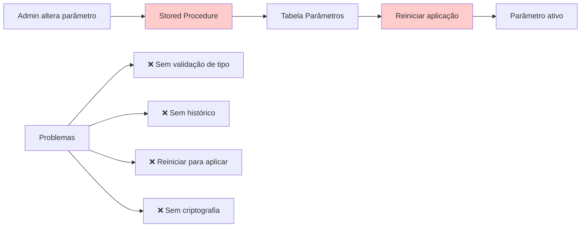

**Moderno (Modernizado):**
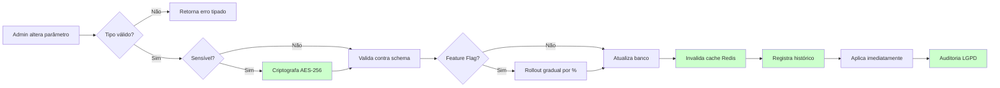

#### Descrição do Processo

O processo de gestão de parâmetros permite configurar comportamentos críticos do sistema de forma dinâmica, sem necessidade de deploy. Suporta feature flags com rollout gradual (canary release), criptografia de dados sensíveis, validação tipada e histórico completo de alterações.

**Diferencial Moderno:**
- Aplicação imediata via invalidação de cache Redis
- Criptografia AES-256 para dados sensíveis (chaves API, senhas SMTP)
- Feature flags com controle de percentual de usuários (0%-100%)
- Validação tipada (String, Integer, Decimal, Boolean, Date, JSON)
- Limites de uso por Fornecedor (ex: max 1000 usuários)
- Histórico versionado com rollback 1-click

#### Atores

- **Ator Principal:** Administrador de Sistema (acesso total aos parâmetros)
- **Atores Secundários:**
  - Gestor de Fornecedor (acesso aos parâmetros de seu fornecedor)
  - Sistema de Cache (Redis)
  - Sistema de Auditoria
- **Sistemas Externos:** Nenhum

#### Fluxo Principal

1. **Admin acessa painel de parâmetros**
   - Lista todos os parâmetros configuráveis
   - Filtra por categoria, tipo ou fornecedor

2. **Admin seleciona parâmetro para alterar**
   - Visualiza valor atual, tipo, descrição
   - Visualiza histórico de alterações anteriores

3. **Sistema valida o novo valor**
   - Valida contra o tipo definido (String, Integer, etc.)
   - Valida contra regras específicas (ex: range numérico)
   - Valida schema JSON se aplicável

4. **Sistema verifica se parâmetro é sensível**
   - Se sensível: criptografa com AES-256 antes de persistir
   - Se não sensível: persiste em texto claro

5. **Sistema verifica se é feature flag**
   - Se sim: permite configurar percentual de rollout (0%-100%)
   - Se não: aplica para 100% dos usuários

6. **Sistema persiste alteração**
   - Salva no banco de dados
   - Registra no histórico (versão anterior + nova)
   - Invalida cache Redis

7. **Sistema aplica imediatamente**
   - Cache atualizado força uso do novo valor
   - Sem necessidade de reiniciar aplicação

8. **Sistema registra auditoria**
   - Quem alterou, quando, valor anterior e novo
   - IP de origem, correlation ID
   - Snapshot completo para compliance

#### Automações

- ✅ **Validação tipada automática:** Sistema valida tipo de dado antes de persistir
- ✅ **Criptografia automática:** Parâmetros marcados como sensíveis são criptografados automaticamente
- ✅ **Invalidação de cache:** Redis é automaticamente atualizado após alteração
- ✅ **Rollout gradual:** Feature flags aplicados progressivamente conforme % configurado
- ✅ **Histórico automático:** Toda alteração gera entrada de histórico sem intervenção manual
- ✅ **Auditoria automática:** Registro completo gerado automaticamente para compliance

#### Integrações

- **Redis Cache:** Invalidação automática de cache após alteração de parâmetros
- **Sistema de Auditoria:** Registro imutável de todas as alterações (RF004)
- **Sistema de Criptografia:** AES-256 para dados sensíveis

#### Regras de Negócio Principais

- **RN-001-01:** Todo parâmetro deve ter tipo definido (String, Integer, Decimal, Boolean, Date, JSON)
- **RN-001-02:** Parâmetros sensíveis devem ser criptografados com AES-256
- **RN-001-03:** Feature flags suportam rollout gradual de 0% a 100%
- **RN-001-04:** Alterações devem ser aplicadas imediatamente via invalidação de cache
- **RN-001-05:** Histórico completo deve ser mantido para auditoria
- **RN-001-06:** Limites de uso por Fornecedor devem ser validados antes da persistência
- **RN-001-07:** Rollback 1-click deve estar disponível para versões anteriores

**[Ver regras completas em RF001.md]**

#### Referência ao Legado

**Como funcionava no legado:**
- ❌ Stored procedures alteravam diretamente tabela de parâmetros
- ❌ Sem validação de tipo (tudo armazenado como VARCHAR)
- ❌ Sem criptografia de dados sensíveis (chaves API expostas)
- ❌ Necessário reiniciar aplicação para aplicar mudanças
- ❌ Sem histórico de alterações (impossível rastrear mudanças)
- ❌ Sem feature flags (features ativadas para 100% ou 0%)
- ❌ Sem cache (consultas repetitivas ao banco)

**Melhorias no moderno:**
- ✅ Validação tipada via DTOs e FluentValidation
- ✅ Criptografia AES-256 automática para dados sensíveis
- ✅ Aplicação imediata via invalidação de cache Redis
- ✅ Histórico versionado completo (data, usuário, valor anterior/novo)
- ✅ Feature flags com rollout gradual (canary release)
- ✅ Cache Redis com TTL configurável
- ✅ Rollback 1-click para versões anteriores
- ✅ Auditoria LGPD completa

---

### 3.2 Processo: Configurações Gerais

**Código:** PRO-INF-002
**RFs Envolvidos:** RF002
**Área:** Infraestrutura e Configuração
**Criticidade:** Alta

#### Diagrama BPMN: Comparação Legado vs Moderno

**Legado (AS-IS):**
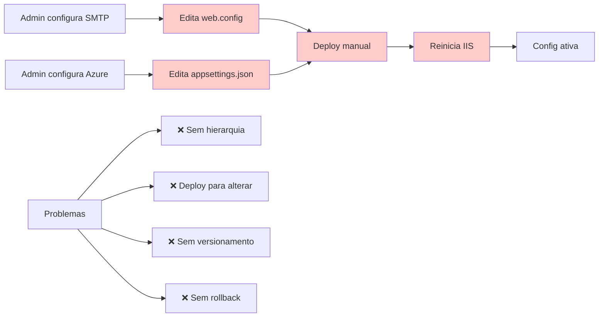

**Moderno (Modernizado):**
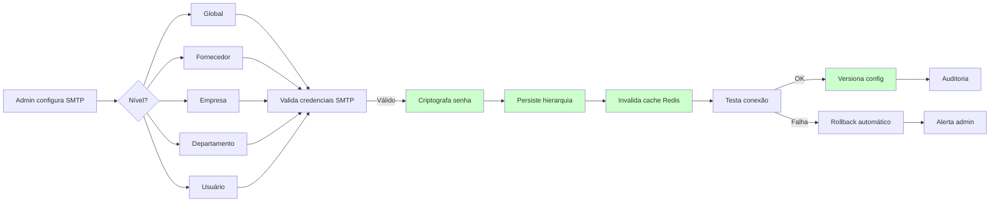

#### Descrição do Processo

O processo de configurações gerais gerencia integrações infraestruturais críticas do sistema (SMTP, Azure Storage, AWS S3, ERPs) com suporte a hierarquia multi-tenant, versionamento, rollback e feature flags progressivos.

**Diferencial Moderno:**
- Hierarquia de configurações em 5 níveis (Global → Fornecedor → Empresa → Depto → Usuário)
- Cache Redis com hot-reload (sem reiniciar aplicação)
- Versionamento completo com rollback 1-click
- Feature flags com canary release (ativação progressiva)
- Teste de conectividade antes de aplicar
- Export/Import para migração entre ambientes

#### Atores

- **Ator Principal:** Administrador de Sistema
- **Atores Secundários:**
  - Gestor de Fornecedor (configs de seu fornecedor)
  - Gestor de Empresa (configs de sua empresa)
  - Sistema de Cache (Redis)
  - Sistema de Versionamento
- **Sistemas Externos:**
  - Servidores SMTP (Outlook, Gmail, SendGrid)
  - Azure Storage
  - AWS S3
  - ERPs (SAP, TOTVS, Oracle)

#### Fluxo Principal

1. **Admin acessa painel de configurações gerais**
   - Visualiza configurações em árvore hierárquica
   - Filtra por tipo (SMTP, Azure, AWS, ERP)

2. **Admin seleciona tipo de configuração**
   - SMTP: servidor, porta, usuário, senha, TLS
   - Azure: connection string, container, SAS token
   - AWS: access key, secret key, bucket, region
   - ERP: endpoint, credenciais, timeout

3. **Admin define nível hierárquico**
   - Global: aplica para todos os clientes
   - Fornecedor: sobrescreve global para fornecedor específico
   - Empresa: sobrescreve fornecedor para empresa específica
   - Departamento: sobrescreve empresa para departamento específico
   - Usuário: sobrescreve departamento para usuário específico

4. **Sistema valida credenciais**
   - SMTP: tenta enviar email de teste
   - Azure/AWS: tenta listar containers/buckets
   - ERP: tenta autenticar no endpoint

5. **Se validação OK: Sistema persiste configuração**
   - Criptografa campos sensíveis (senhas, tokens) com AES-256
   - Salva no banco respeitando hierarquia
   - Cria snapshot da versão anterior
   - Invalida cache Redis

6. **Se validação FALHA: Sistema faz rollback automático**
   - Restaura versão anterior
   - Alerta administrador via notificação
   - Registra erro no log estruturado

7. **Sistema aplica feature flag (se configurado)**
   - Ativa config para percentual de usuários (0%-100%)
   - Permite canary release gradual

8. **Sistema registra auditoria**
   - Snapshot antes/depois
   - Quem alterou, quando, IP de origem
   - Resultado do teste de conectividade

#### Automações

- ✅ **Validação de credenciais:** Sistema testa conectividade antes de aplicar
- ✅ **Criptografia automática:** Senhas e tokens criptografados com AES-256
- ✅ **Rollback automático:** Se validação falha, versão anterior é restaurada
- ✅ **Invalidação de cache:** Redis atualizado automaticamente
- ✅ **Versionamento automático:** Toda alteração gera nova versão
- ✅ **Notificação de erro:** Admin alertado automaticamente se teste falhar
- ✅ **Hot-reload:** Configurações aplicadas sem reiniciar aplicação

#### Integrações

- **Redis Cache:** Hot-reload de configurações via invalidação de cache
- **SMTP (Outlook, Gmail, SendGrid):** Teste de envio de email
- **Azure Storage:** Validação de connection string e SAS token
- **AWS S3:** Validação de access key e listagem de buckets
- **ERPs (SAP, TOTVS, Oracle):** Teste de autenticação e conectividade
- **Sistema de Auditoria (RF004):** Registro imutável de alterações

#### Regras de Negócio Principais

- **RN-002-01:** Hierarquia de configurações: Global → Fornecedor → Empresa → Depto → Usuário
- **RN-002-02:** Configurações de nível inferior sobrescrevem níveis superiores
- **RN-002-03:** Validação obrigatória de credenciais antes de persistir
- **RN-002-04:** Rollback automático se validação falhar
- **RN-002-05:** Campos sensíveis devem ser criptografados com AES-256
- **RN-002-06:** Cache Redis deve ser invalidado após alteração
- **RN-002-07:** Versionamento completo para rollback 1-click
- **RN-002-08:** Feature flags suportam ativação progressiva (0%-100%)

**[Ver regras completas em RF002.md]**

#### Referência ao Legado

**Como funcionava no legado:**
- ❌ Configurações em arquivos XML (web.config, appsettings.json)
- ❌ Deploy manual necessário para alterar configurações
- ❌ Reiniciar IIS/aplicação para aplicar mudanças
- ❌ Sem hierarquia multi-tenant (config única para todos)
- ❌ Sem versionamento (impossível voltar versão anterior)
- ❌ Sem teste de conectividade (configs inválidas quebravam sistema)
- ❌ Senhas em texto claro ou Base64 fraco
- ❌ Sem feature flags (mudanças para 100% dos usuários imediatamente)

**Melhorias no moderno:**
- ✅ Configurações persistidas em banco com hierarquia 5 níveis
- ✅ Hot-reload via cache Redis (sem reiniciar aplicação)
- ✅ Teste automático de conectividade antes de aplicar
- ✅ Rollback automático se teste falhar
- ✅ Criptografia AES-256 para dados sensíveis
- ✅ Versionamento completo com snapshot antes/depois
- ✅ Feature flags com canary release
- ✅ Export/Import para migração entre ambientes (HOM → PRD)
- ✅ Auditoria completa LGPD/SOX

---

### 3.3 Processo: Logs e Monitoramento

**Código:** PRO-INF-003
**RFs Envolvidos:** RF003
**Área:** Infraestrutura e Configuração
**Criticidade:** Alta

#### Diagrama BPMN: Comparação Legado vs Moderno

**Legado (AS-IS):**
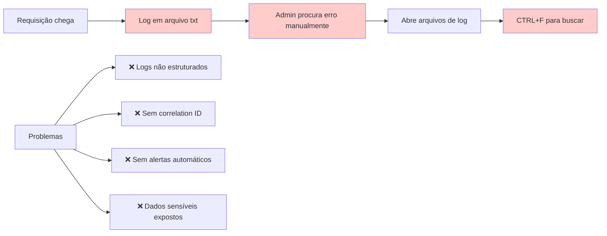

**Moderno (Modernizado):**
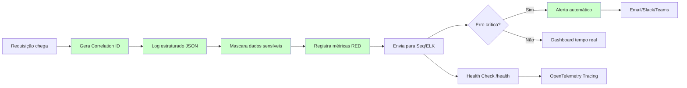

#### Descrição do Processo

O processo de logs e monitoramento captura, estrutura e analisa eventos do sistema em tempo real, permitindo observabilidade completa, detecção proativa de problemas e rastreamento distribuído de requisições.

**Diferencial Moderno:**
- Logs estruturados em formato JSON
- Correlation IDs para rastreamento end-to-end
- Mascaramento automático de dados sensíveis (CPF, senhas, tokens)
- Métricas RED (Rate, Errors, Duration)
- Health checks via endpoint /health
- Alertas automáticos para erros críticos
- Tracing distribuído com OpenTelemetry

#### Atores

- **Ator Principal:** Sistema de Logging (Serilog)
- **Atores Secundários:**
  - Administrador de Sistema (consulta logs)
  - Sistema de Alertas
  - DevOps (monitoramento)
- **Sistemas Externos:**
  - Seq (agregador de logs)
  - ELK Stack (Elasticsearch, Logstash, Kibana)
  - Azure Application Insights
  - Slack/Teams (notificações)

#### Fluxo Principal

1. **Requisição HTTP chega ao sistema**
   - Middleware intercepta e gera Correlation ID único (UUID)
   - Correlation ID adicionado ao contexto da requisição

2. **Sistema registra log estruturado**
   - Formato JSON com campos padronizados:
     - Timestamp (ISO 8601)
     - Level (Debug, Info, Warning, Error, Fatal)
     - Message
     - CorrelationId
     - UserId, ClienteId (multi-tenancy)
     - RequestPath, Method, StatusCode
     - Duration (ms)

3. **Sistema mascara dados sensíveis automaticamente**
   - CPF: 123.456.789-00 → 123.***.***-00
   - Senha: "senha123" → "***"
   - Token: "Bearer abc123..." → "Bearer ***"
   - Cartão: 1234 5678 9012 3456 → 1234 **** **** 3456

4. **Sistema registra métricas RED**
   - **Rate:** Requisições por segundo (RPS)
   - **Errors:** Taxa de erro (% de 5xx)
   - **Duration:** Latência (p50, p95, p99)

5. **Sistema envia logs para agregadores**
   - Seq (desenvolvimento/HOM)
   - Azure Application Insights (PRD)
   - ELK Stack (análises históricas)

6. **Sistema verifica severidade do evento**
   - Se Error/Fatal: dispara alerta automático
   - Se Warning: registra para análise posterior
   - Se Info/Debug: apenas persiste no agregador

7. **Sistema dispara alertas (se aplicável)**
   - Email para equipe de plantão
   - Notificação Slack/Teams
   - Cria incident no PagerDuty (erros críticos)

8. **Health check /health responde**
   - Status: Healthy | Degraded | Unhealthy
   - Dependências: Database, Redis, Azure Storage, SMTP
   - Uptime, memória, CPU

#### Automações

- ✅ **Geração automática de Correlation ID:** Todo request recebe UUID único
- ✅ **Log estruturado JSON:** Formato padronizado automaticamente
- ✅ **Mascaramento de dados sensíveis:** Regex automático para CPF, senhas, tokens
- ✅ **Coleta de métricas RED:** Rate, Errors, Duration registrados automaticamente
- ✅ **Envio para agregadores:** Logs enviados para Seq/ELK/Application Insights
- ✅ **Alertas automáticos:** Erros críticos disparam notificações
- ✅ **Health checks:** Endpoint /health responde status de dependências
- ✅ **Tracing distribuído:** OpenTelemetry rastreia requisições entre serviços

#### Integrações

- **Seq:** Agregador de logs estruturados (desenvolvimento/HOM)
- **Azure Application Insights:** Monitoramento e telemetria (PRD)
- **ELK Stack:** Análise histórica e dashboards customizados
- **Slack/Teams:** Notificações de alertas críticos
- **PagerDuty:** Gestão de incidents para erros críticos
- **OpenTelemetry:** Tracing distribuído entre microsserviços

#### Regras de Negócio Principais

- **RN-003-01:** Todo request deve ter Correlation ID único (UUID)
- **RN-003-02:** Logs devem ser estruturados em formato JSON
- **RN-003-03:** Dados sensíveis devem ser mascarados automaticamente
- **RN-003-04:** Métricas RED devem ser coletadas (Rate, Errors, Duration)
- **RN-003-05:** Erros críticos devem disparar alertas automáticos
- **RN-003-06:** Health check deve validar dependências (DB, Redis, Azure)
- **RN-003-07:** Logs devem ser enviados para agregadores em tempo real
- **RN-003-08:** Tracing distribuído deve rastrear requisições end-to-end

**[Ver regras completas em RF003.md]**

#### Referência ao Legado

**Como funcionava no legado:**
- ❌ Logs em arquivos .txt não estruturados
- ❌ Busca manual via CTRL+F em múltiplos arquivos
- ❌ Sem correlation ID (impossível rastrear requisição completa)
- ❌ Dados sensíveis expostos em logs (CPF, senhas)
- ❌ Sem alertas automáticos (descoberta reativa de erros)
- ❌ Sem métricas estruturadas (impossível calcular SLA)
- ❌ Sem health checks (infraestrutura descobria falhas tarde)
- ❌ Logs rotacionados manualmente (perda de dados)

**Melhorias no moderno:**
- ✅ Logs estruturados JSON com campos padronizados
- ✅ Correlation IDs para rastreamento end-to-end
- ✅ Mascaramento automático de dados sensíveis (LGPD)
- ✅ Métricas RED automatizadas (SLA calculável)
- ✅ Alertas automáticos via Slack/Teams/PagerDuty
- ✅ Health checks validando dependências críticas
- ✅ Agregadores centralizados (Seq, Application Insights, ELK)
- ✅ Tracing distribuído com OpenTelemetry
- ✅ Dashboards em tempo real
- ✅ Retenção configurável (7 dias dev, 90 dias PRD)

---

### 3.4 Processo: Auditoria de Operações

**Código:** PRO-INF-004
**RFs Envolvidos:** RF004
**Área:** Infraestrutura e Configuração
**Criticidade:** Alta

#### Diagrama BPMN: Comparação Legado vs Moderno

**Legado (AS-IS):**
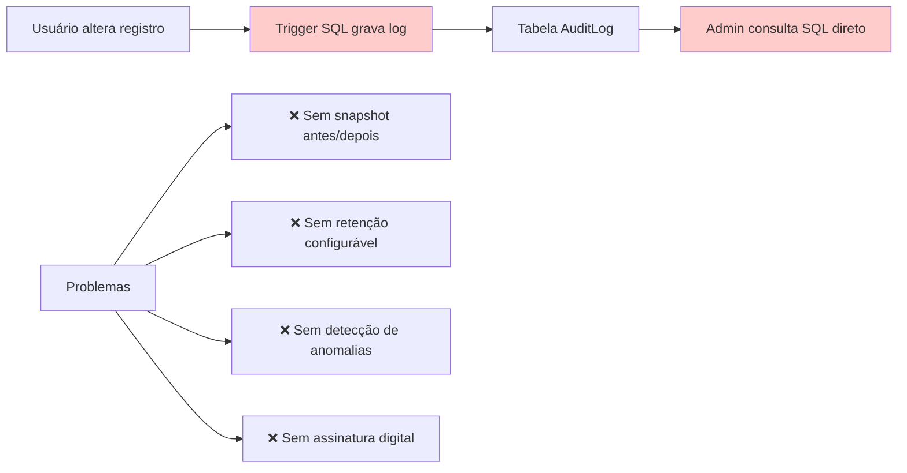

**Moderno (Modernizado):**
```mermaid
graph LR
    A[Usuário altera registro] --> B[Captura snapshot antes]
    B --> C[Executa operação]
    C --> D[Captura snapshot depois]
    D --> E[Calcula diff JSON]
    E --> F[Gera assinatura SHA-256]
    F --> G[Persiste registro imutável]
    G --> H{Operação sensível?}
    H -->|Sim| I[Detecção de anomalias]
    I -->|Suspeito| J[Alerta automático]
    H -->|Não| K[Registro auditoria LGPD]
    J --> K
    K --> L{Retenção > 7 anos?}
    L -->|Sim| M[Cold storage Azure]
    L -->|Não| N[Hot storage SQL]

    style E fill:#ccffcc
    style F fill:#ccffcc
    style G fill:#ccffcc
    style I fill:#ccffcc
```

#### Descrição do Processo

O processo de auditoria registra de forma imutável todas as operações realizadas por usuários no sistema, capturando snapshots antes/depois, assinatura digital, detecção de anomalias e arquivamento automático para compliance.

**Diferencial Moderno:**
- Registro imutável de operações de usuários
- Snapshot antes/depois com diff JSON
- Retenção configurável (7 anos para compliance SOX/LGPD)
- Detecção de anomalias (horário atípico, volume anormal)
- Auditoria LGPD específica (acesso a dados pessoais)
- Assinatura digital SHA-256 para não repúdio
- Arquivamento automático em cold storage

#### Atores

- **Ator Principal:** Sistema de Auditoria
- **Atores Secundários:**
  - Usuários (geram eventos auditados)
  - Administrador (consulta auditoria)
  - Auditor Externo (compliance)
  - Sistema de Detecção de Anomalias
- **Sistemas Externos:**
  - Azure Blob Storage (cold storage)
  - Sistema de Machine Learning (detecção de anomalias)

#### Fluxo Principal

1. **Usuário inicia operação auditável**
   - CREATE, UPDATE, DELETE em tabelas sensíveis
   - Acesso a dados pessoais (LGPD)
   - Exportação de relatórios
   - Alteração de permissões

2. **Sistema captura snapshot ANTES da operação**
   - Serializa estado atual do registro em JSON
   - Captura timestamp, usuário, IP, correlation ID

3. **Sistema executa operação**
   - Operação é realizada no banco de dados
   - Transaction garantindo atomicidade

4. **Sistema captura snapshot DEPOIS da operação**
   - Serializa novo estado do registro em JSON

5. **Sistema calcula diff JSON**
   - Compara snapshot antes vs depois
   - Identifica exatamente quais campos mudaram
   - Formato: `{"campo": {"old": "valor_antigo", "new": "valor_novo"}}`

6. **Sistema gera assinatura digital SHA-256**
   - Hash do payload completo (antes + depois + metadata)
   - Garante não repúdio e integridade

7. **Sistema persiste registro imutável**
   - INSERT-only (nunca UPDATE ou DELETE)
   - Tabela AuditLog com campos:
     - Id, Timestamp, UserId, ClienteId
     - Entity, Action (CREATE/UPDATE/DELETE)
     - SnapshotBefore, SnapshotAfter, Diff
     - IP, CorrelationId, Signature

8. **Sistema verifica se operação é sensível**
   - Acesso a dados pessoais (CPF, email, telefone)
   - Alteração de permissões
   - Exportação de dados em massa

9. **Se sensível: Sistema executa detecção de anomalias**
   - Horário atípico (ex: 3h da manhã)
   - Volume anormal (ex: 1000 exclusões em 1 minuto)
   - IP de país não autorizado
   - Padrão suspeito via Machine Learning

10. **Se anomalia detectada: Sistema dispara alerta**
    - Email para gestor de segurança
    - Notificação Slack/Teams
    - Bloqueia operações subsequentes (se configurado)

11. **Sistema registra auditoria LGPD (se aplicável)**
    - Tabela específica para compliance LGPD
    - Campos: Titular, TipoDado, Finalidade, BaseLegal

12. **Sistema verifica retenção**
    - Se registro > 7 anos e cold storage habilitado:
      - Move para Azure Blob Storage (cold tier)
      - Comprime com GZIP
      - Mantém índice no SQL (para consulta rápida)

#### Automações

- ✅ **Captura automática de snapshots:** Antes e depois de toda operação auditável
- ✅ **Cálculo automático de diff:** Sistema identifica exatamente o que mudou
- ✅ **Assinatura digital SHA-256:** Gerada automaticamente para não repúdio
- ✅ **Detecção de anomalias:** Machine Learning identifica padrões suspeitos
- ✅ **Alertas automáticos:** Notificações para operações suspeitas
- ✅ **Arquivamento automático:** Registros antigos movidos para cold storage
- ✅ **Auditoria LGPD:** Registro específico para acesso a dados pessoais

#### Integrações

- **Azure Blob Storage:** Arquivamento de auditoria em cold storage
- **Sistema de Machine Learning:** Detecção de anomalias via Azure ML
- **Slack/Teams:** Notificações de alertas de segurança
- **Sistema de Logs (RF003):** Integração com logs estruturados

#### Regras de Negócio Principais

- **RN-004-01:** Toda operação auditável deve gerar registro imutável
- **RN-004-02:** Snapshots antes/depois devem ser capturados
- **RN-004-03:** Diff JSON deve identificar exatamente o que mudou
- **RN-004-04:** Assinatura digital SHA-256 obrigatória para não repúdio
- **RN-004-05:** Retenção mínima de 7 anos para compliance SOX/LGPD
- **RN-004-06:** Detecção de anomalias para operações sensíveis
- **RN-004-07:** Registros nunca podem ser alterados ou deletados (INSERT-only)
- **RN-004-08:** Auditoria LGPD específica para acesso a dados pessoais
- **RN-004-09:** Arquivamento automático em cold storage após período configurável

**[Ver regras completas em RF004.md]**

#### Referência ao Legado

**Como funcionava no legado:**
- ❌ Triggers SQL simples gravando tabela AuditLog
- ❌ Sem snapshot antes/depois (apenas "o que" mudou, não "de onde para onde")
- ❌ Sem assinatura digital (possível alteração de registros)
- ❌ Sem detecção de anomalias (descoberta reativa de fraudes)
- ❌ Sem auditoria LGPD específica
- ❌ Sem arquivamento automático (banco crescia indefinidamente)
- ❌ Retenção manual (DBA excluía registros antigos manualmente)
- ❌ Consulta via SQL direto (sem interface amigável)

**Melhorias no moderno:**
- ✅ Snapshots antes/depois com diff JSON detalhado
- ✅ Assinatura digital SHA-256 para não repúdio
- ✅ Detecção proativa de anomalias via Machine Learning
- ✅ Auditoria LGPD específica (compliance ANPD)
- ✅ Arquivamento automático em cold storage (Azure Blob)
- ✅ Retenção configurável (7 anos padrão, extensível)
- ✅ Interface web para consulta de auditoria
- ✅ Exportação para auditor externo (CSV, Excel, PDF)
- ✅ Registro imutável (INSERT-only, nunca UPDATE/DELETE)
- ✅ Alertas automáticos para operações suspeitas

---

### 3.5 Processo: Internacionalização (i18n)

**Código:** PRO-INF-005
**RFs Envolvidos:** RF005
**Área:** Infraestrutura e Configuração
**Criticidade:** Média

#### Diagrama BPMN: Comparação Legado vs Moderno

**Legado (AS-IS):**
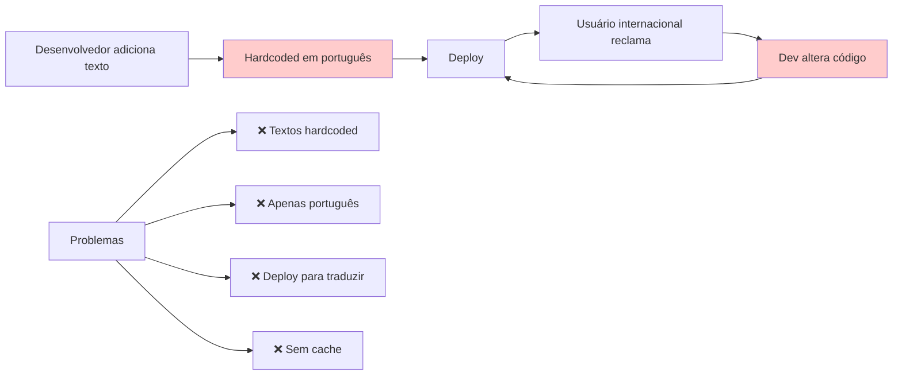

**Moderno (Modernizado):**
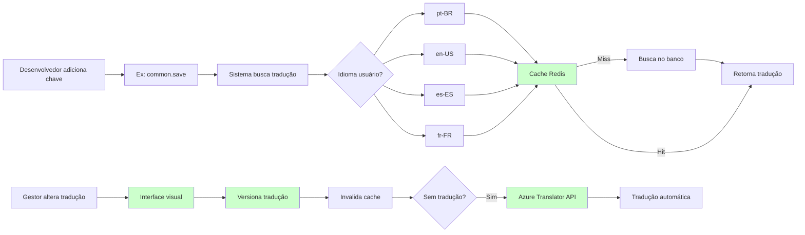

#### Descrição do Processo

O processo de internacionalização permite gestão multi-idioma do sistema com tradução automática, versionamento, rollback e cache Redis para performance.

**Diferencial Moderno:**
- Motor de tradução multi-idioma (pt-BR, en-US, es-ES, fr-FR)
- Gestão visual de traduções (sem acesso ao código)
- Versionamento e rollback
- Tradução automática via Azure Translator API
- Formatação regional (datas, moedas, números)
- Cache Redis para performance
- Lazy loading de traduções

#### Atores

- **Ator Principal:** Gestor de Traduções
- **Atores Secundários:**
  - Desenvolvedor (adiciona chaves de tradução)
  - Usuário Final (consome traduções)
  - Tradutor Profissional (revisão de traduções)
- **Sistemas Externos:**
  - Azure Translator API
  - Redis Cache

#### Fluxo Principal

1. **Desenvolvedor adiciona nova chave de tradução**
   - Formato: `namespace.chave` (ex: `common.save`, `errors.validation.required`)
   - Adiciona chave no código: `{{ 'common.save' | translate }}`

2. **Sistema verifica se tradução existe**
   - Busca no cache Redis primeiro (TTL 24h)
   - Se não existir: busca no banco de dados
   - Se não existir: retorna chave como fallback

3. **Gestor acessa interface visual de traduções**
   - Lista todas as chaves do sistema
   - Filtra por namespace, idioma, status
   - Visualiza traduções faltantes (missing translations)

4. **Gestor adiciona/edita tradução**
   - Seleciona chave e idioma
   - Insere texto traduzido
   - Sistema valida interpolações `{{variable}}`

5. **Sistema oferece tradução automática**
   - Se tradução não existe para idioma secundário
   - Azure Translator API traduz automaticamente
   - Gestor revisa e aprova/edita tradução sugerida

6. **Sistema versiona tradução**
   - Cria snapshot da versão anterior
   - Persiste nova versão no banco
   - Permite rollback 1-click

7. **Sistema invalida cache Redis**
   - Remove tradução do cache
   - Próxima requisição recarrega do banco

8. **Sistema aplica formatação regional**
   - Datas: pt-BR (dd/MM/yyyy), en-US (MM/dd/yyyy)
   - Moedas: pt-BR (R$ 1.234,56), en-US ($1,234.56)
   - Números: pt-BR (1.234,56), en-US (1,234.56)

9. **Sistema faz lazy loading**
   - Carrega apenas traduções do namespace usado
   - Reduz payload inicial da aplicação

#### Automações

- ✅ **Cache automático Redis:** Traduções cacheadas por 24h
- ✅ **Tradução automática:** Azure Translator API traduz chaves faltantes
- ✅ **Invalidação de cache:** Redis atualizado automaticamente após alteração
- ✅ **Detecção de chaves faltantes:** Sistema identifica traduções missing
- ✅ **Lazy loading:** Carrega traduções sob demanda
- ✅ **Formatação regional:** Datas, moedas e números formatados automaticamente
- ✅ **Versionamento automático:** Toda alteração gera nova versão

#### Integrações

- **Redis Cache:** Cache de traduções com TTL 24h
- **Azure Translator API:** Tradução automática de chaves faltantes
- **Sistema de Versionamento:** Rollback 1-click de traduções

#### Regras de Negócio Principais

- **RN-005-01:** Chaves de tradução devem seguir formato `namespace.chave`
- **RN-005-02:** Idiomas suportados: pt-BR, en-US, es-ES, fr-FR
- **RN-005-03:** Traduções devem ser cacheadas no Redis (TTL 24h)
- **RN-005-04:** Tradução automática via Azure Translator para chaves faltantes
- **RN-005-05:** Versionamento completo com rollback 1-click
- **RN-005-06:** Formatação regional automática (datas, moedas, números)
- **RN-005-07:** Lazy loading de traduções por namespace
- **RN-005-08:** Fallback para chave se tradução não existir

**[Ver regras completas em RF005.md]**

#### Referência ao Legado

**Como funcionava no legado:**
- ❌ Textos hardcoded em português no código
- ❌ Sem suporte a múltiplos idiomas
- ❌ Deploy necessário para alterar textos
- ❌ Sem cache (consultas repetitivas ao banco)
- ❌ Sem tradução automática (tradução 100% manual)
- ❌ Sem versionamento (impossível voltar texto anterior)
- ❌ Formatação regional inconsistente
- ❌ Desenvolvedor precisava alterar código para novos textos

**Melhorias no moderno:**
- ✅ Sistema de chaves de tradução (`namespace.chave`)
- ✅ 4 idiomas suportados (pt-BR, en-US, es-ES, fr-FR)
- ✅ Interface visual para gestão de traduções (sem código)
- ✅ Cache Redis com TTL 24h
- ✅ Tradução automática via Azure Translator API
- ✅ Versionamento completo com rollback 1-click
- ✅ Formatação regional automática
- ✅ Lazy loading (performance otimizada)
- ✅ Detecção automática de traduções faltantes
- ✅ Export/Import de traduções (Excel, JSON)

---

### 3.6 Processo: Gestão de Clientes (Multi-Tenancy)

**Código:** PRO-INF-006
**RFs Envolvidos:** RF006
**Área:** Infraestrutura e Configuração
**Criticidade:** Alta

#### Diagrama BPMN: Comparação Legado vs Moderno

**Legado (AS-IS):**
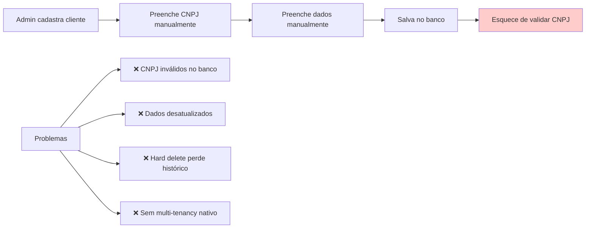

**Moderno (Modernizado):**
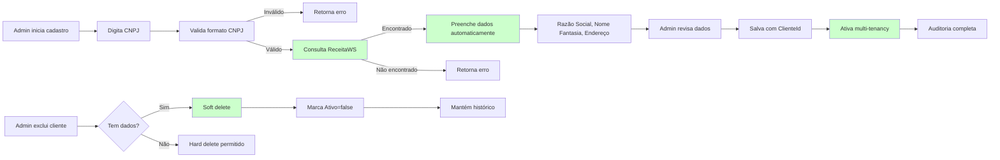

#### Descrição do Processo

O processo de gestão de clientes implementa multi-tenancy nativo com isolamento de dados por ClienteId, integração com ReceitaWS para consulta automática de CNPJ e soft delete para preservação de histórico.

**Diferencial Moderno:**
- Multi-tenancy nativo (ClienteId obrigatório em todas as tabelas)
- Integração ReceitaWS (consulta CNPJ automática)
- Soft delete em cascata (preserva histórico)
- Validação CNPJ/CPF com dígitos verificadores
- Auditoria completa 7 anos
- Isolamento de dados por tenant

#### Atores

- **Ator Principal:** Administrador de Sistema
- **Atores Secundários:**
  - Gestor de Fornecedor (gerencia seus clientes)
  - Sistema de Auditoria
- **Sistemas Externos:**
  - ReceitaWS (consulta CNPJ)
  - VIACEP (consulta CEP)

#### Fluxo Principal

1. **Admin acessa cadastro de clientes**
   - Interface lista clientes ativos
   - Filtra por CNPJ, razão social, status

2. **Admin inicia novo cadastro**
   - Digita CNPJ (formato: 00.000.000/0000-00)

3. **Sistema valida formato CNPJ**
   - Valida dígitos verificadores
   - Se inválido: retorna erro imediatamente

4. **Sistema consulta ReceitaWS**
   - Busca dados da empresa por CNPJ
   - Timeout: 5 segundos

5. **Sistema preenche dados automaticamente**
   - Razão Social
   - Nome Fantasia
   - Endereço completo (logradouro, número, bairro, cidade, UF, CEP)
   - Situação cadastral
   - Data de abertura

6. **Admin revisa dados preenchidos**
   - Pode editar campos se necessário
   - Adiciona dados específicos:
     - Email de contato
     - Telefone
     - Responsável
     - Observações

7. **Sistema gera ClienteId único**
   - UUID v4
   - Usado como discriminador multi-tenancy

8. **Sistema salva cliente**
   - Persiste no banco com ClienteId
   - Ativa multi-tenancy para esse cliente
   - Todas as operações subsequentes filtram por ClienteId

9. **Sistema registra auditoria**
   - Snapshot completo
   - Quem cadastrou, quando, IP
   - Dados retornados da ReceitaWS (rastreabilidade)

**Fluxo de Exclusão (Soft Delete):**

1. **Admin solicita exclusão de cliente**

2. **Sistema verifica se cliente tem dados associados**
   - Verifica tabelas relacionadas (Usuários, Contratos, Faturas, etc.)

3. **Se tem dados: Sistema faz soft delete**
   - Marca campo `Ativo = false`
   - Mantém registro no banco
   - Preserva histórico completo
   - Cliente não aparece mais em listagens
   - Auditoria registra exclusão lógica

4. **Se não tem dados: Sistema permite hard delete**
   - Remove fisicamente do banco
   - Apenas se nenhum registro relacionado existir

#### Automações

- ✅ **Consulta automática ReceitaWS:** Dados preenchidos automaticamente via CNPJ
- ✅ **Validação de CNPJ:** Dígitos verificadores validados automaticamente
- ✅ **Geração de ClienteId:** UUID único gerado automaticamente
- ✅ **Soft delete em cascata:** Exclusões lógicas preservam histórico
- ✅ **Isolamento multi-tenancy:** Todas as queries filtram por ClienteId automaticamente
- ✅ **Auditoria automática:** Registro completo de CREATE, UPDATE, DELETE
- ✅ **Consulta CEP:** Via VIACEP se endereço não vier da ReceitaWS

#### Integrações

- **ReceitaWS:** Consulta dados de CNPJ automaticamente
- **VIACEP:** Consulta endereço via CEP
- **Sistema de Auditoria (RF004):** Registro imutável de operações
- **Sistema de Validação:** FluentValidation para CNPJ/CPF

#### Regras de Negócio Principais

- **RN-006-01:** ClienteId (UUID) obrigatório em todas as tabelas do sistema
- **RN-006-02:** CNPJ deve ser validado com dígitos verificadores
- **RN-006-03:** Consulta ReceitaWS obrigatória ao cadastrar CNPJ
- **RN-006-04:** Soft delete obrigatório para clientes com dados associados
- **RN-006-05:** Hard delete permitido apenas se nenhum dado associado existir
- **RN-006-06:** Todas as queries devem filtrar por ClienteId (multi-tenancy)
- **RN-006-07:** Auditoria completa deve ser mantida por 7 anos
- **RN-006-08:** ClienteId não pode ser alterado após criação

**[Ver regras completas em RF006.md]**

#### Referência ao Legado

**Como funcionava no legado:**
- ❌ Sem multi-tenancy nativo (filtros manuais por cliente)
- ❌ CNPJ digitado manualmente (erros de digitação comuns)
- ❌ Sem validação de dígitos verificadores
- ❌ Sem consulta ReceitaWS (dados desatualizados)
- ❌ Hard delete (perdia histórico completo)
- ❌ Sem auditoria de alterações
- ❌ Dados duplicados (mesmo CNPJ cadastrado múltiplas vezes)
- ❌ Filtros por cliente esquecidos (vazamento de dados entre clientes)

**Melhorias no moderno:**
- ✅ Multi-tenancy nativo com ClienteId em todas as tabelas
- ✅ Consulta automática ReceitaWS via CNPJ
- ✅ Validação de dígitos verificadores CNPJ/CPF
- ✅ Soft delete preservando histórico completo
- ✅ Auditoria completa por 7 anos
- ✅ Impossível cadastrar CNPJ duplicado
- ✅ Filtros por ClienteId automáticos (sem vazamento de dados)
- ✅ Isolamento de dados garantido por arquitetura
- ✅ Compliance LGPD (rastreabilidade de dados de clientes)

---

### 3.7 Processo: Login e Autenticação

**Código:** PRO-INF-007
**RFs Envolvidos:** RF007
**Área:** Infraestrutura e Configuração
**Criticidade:** Alta

#### Diagrama BPMN: Comparação Legado vs Moderno

**Legado (AS-IS):**
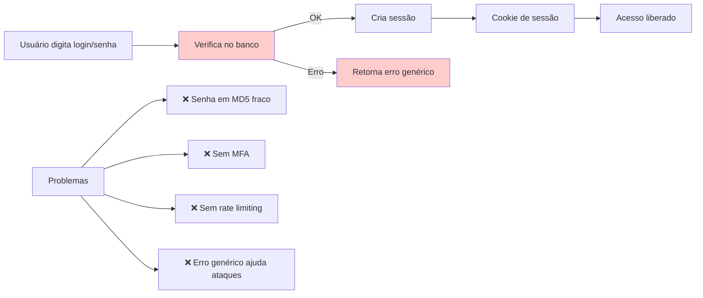

**Moderno (Modernizado):**
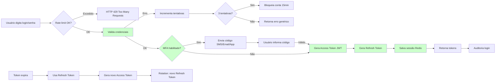

#### Descrição do Processo

O processo de login e autenticação implementa OAuth 2.0 + OpenID Connect com Multi-Factor Authentication (MFA), refresh token rotation, session management, rate limiting e audit log completo.

**Diferencial Moderno:**
- OAuth 2.0 + OpenID Connect
- Multi-Factor Authentication (SMS, Email, Authenticator App)
- Refresh token rotation (segurança contra roubo de token)
- Session management com Redis
- Rate limiting (proteção contra brute force)
- Audit log de acesso
- Password hashing com BCrypt (salt automático)

#### Atores

- **Ator Principal:** Usuário Final
- **Atores Secundários:**
  - Sistema de Autenticação
  - Sistema de Sessão (Redis)
  - Sistema de Auditoria
  - Provedor MFA (SMS, Email, App)
- **Sistemas Externos:**
  - Provedor SMS (Twilio, AWS SNS)
  - Provedor Email (SendGrid)
  - Authenticator Apps (Google Authenticator, Authy)

#### Fluxo Principal

1. **Usuário acessa tela de login**
   - Digita email/login
   - Digita senha

2. **Sistema verifica rate limiting**
   - Máximo 5 tentativas por 15 minutos por IP
   - Se excedido: retorna HTTP 429 Too Many Requests

3. **Sistema valida credenciais**
   - Busca usuário por email/login
   - Compara senha com hash BCrypt armazenado
   - Se inválido: incrementa contador de tentativas
   - Se 3 tentativas falhadas: bloqueia conta por 15 minutos

4. **Sistema verifica se MFA está habilitado**
   - Se habilitado: prossegue para fluxo MFA
   - Se não habilitado: pula para geração de tokens

5. **Fluxo MFA (se habilitado)**
   - Sistema gera código de 6 dígitos
   - Envia via SMS, Email ou Authenticator App (conforme preferência usuário)
   - Código válido por 5 minutos
   - Usuário informa código
   - Sistema valida código
   - Se inválido: retorna erro (máximo 3 tentativas)

6. **Sistema gera Access Token JWT**
   - Payload: UserId, ClienteId, Roles, Permissions
   - Algoritmo: RS256 (chave assimétrica)
   - Validade: 15 minutos

7. **Sistema gera Refresh Token**
   - Token opaco (UUID v4)
   - Validade: 7 dias
   - Armazenado no Redis com TTL

8. **Sistema cria sessão no Redis**
   - Chave: `session:{UserId}:{RefreshToken}`
   - Valor: {AccessToken, RefreshToken, IP, UserAgent, CreatedAt}
   - TTL: 7 dias

9. **Sistema retorna tokens**
   - Access Token (Bearer Token para autenticar requisições)
   - Refresh Token (para renovar Access Token)

10. **Sistema registra auditoria de login**
    - Timestamp, UserId, IP, UserAgent
    - Sucesso ou falha
    - Método de autenticação (senha, MFA)

**Fluxo de Renovação de Token:**

1. **Access Token expira (após 15 minutos)**

2. **Cliente envia Refresh Token para endpoint `/auth/refresh`**

3. **Sistema valida Refresh Token**
   - Verifica se existe no Redis
   - Verifica se não está revogado
   - Verifica se não expirou (7 dias)

4. **Sistema gera novo Access Token**
   - Mesmo payload do token anterior
   - Nova validade de 15 minutos

5. **Sistema faz rotation do Refresh Token**
   - Gera novo Refresh Token
   - Revoga Refresh Token antigo
   - Atualiza sessão no Redis
   - Segurança: se token antigo for roubado, atacante não consegue renovar

6. **Sistema retorna novos tokens**
   - Novo Access Token
   - Novo Refresh Token

#### Automações

- ✅ **Rate limiting automático:** Proteção contra brute force (5 tentativas/15min)
- ✅ **Bloqueio temporário:** Conta bloqueada por 15min após 3 tentativas falhadas
- ✅ **Geração automática de tokens:** JWT Access Token + Refresh Token
- ✅ **Envio automático de MFA:** Código enviado via SMS/Email/App
- ✅ **Refresh token rotation:** Token renovado automaticamente para segurança
- ✅ **Sessão Redis:** Sessões armazenadas com TTL automático
- ✅ **Auditoria automática:** Registro completo de logins (sucesso e falha)
- ✅ **Limpeza de sessões:** Redis expira sessões antigas automaticamente

#### Integrações

- **Redis:** Gerenciamento de sessões e rate limiting
- **Twilio/AWS SNS:** Envio de SMS para MFA
- **SendGrid:** Envio de email para MFA
- **Google Authenticator/Authy:** MFA via Authenticator App
- **Sistema de Auditoria (RF004):** Registro imutável de logins

#### Regras de Negócio Principais

- **RN-007-01:** Senhas devem ser hasheadas com BCrypt (salt automático)
- **RN-007-02:** Access Token JWT válido por 15 minutos
- **RN-007-03:** Refresh Token válido por 7 dias
- **RN-007-04:** Rate limiting: máximo 5 tentativas por 15 minutos por IP
- **RN-007-05:** Bloqueio temporário de 15 minutos após 3 tentativas falhadas
- **RN-007-06:** MFA obrigatório para usuários com permissões administrativas
- **RN-007-07:** Refresh token rotation obrigatória para segurança
- **RN-007-08:** Sessões devem ser armazenadas no Redis com TTL
- **RN-007-09:** Auditoria completa de logins (sucesso e falha)
- **RN-007-10:** Logout deve revogar sessão do Redis

**[Ver regras completas em RF007.md]**

#### Referência ao Legado

**Como funcionava no legado:**
- ❌ Senhas em MD5 (algoritmo fraco, sem salt)
- ❌ Sem MFA (autenticação apenas por senha)
- ❌ Sessões em memória (perdidas ao reiniciar aplicação)
- ❌ Sem rate limiting (vulnerável a brute force)
- ❌ Sem refresh token (usuário reautenticava frequentemente)
- ❌ Erro detalhado expondo se usuário existe ("senha incorreta" vs "usuário não encontrado")
- ❌ Sem auditoria de tentativas falhadas
- ❌ Token JWT válido por 24 horas (janela de ataque maior)

**Melhorias no moderno:**
- ✅ BCrypt com salt automático (OWASP recomendado)
- ✅ MFA via SMS, Email ou Authenticator App
- ✅ Sessões persistidas no Redis (sobrevivem a reinicializações)
- ✅ Rate limiting com bloqueio temporário (5 tentativas/15min)
- ✅ Refresh token rotation (segurança contra roubo)
- ✅ Erro genérico (não expõe se usuário existe)
- ✅ Auditoria completa de logins (sucesso e falha)
- ✅ Access Token curto (15min) + Refresh Token (7 dias)
- ✅ OAuth 2.0 + OpenID Connect (padrão de mercado)
- ✅ Logout revoga sessão do Redis

---

### 3.8 Processo: Configurações do Usuário

**Código:** PRO-INF-008
**RFs Envolvidos:** RF014
**Área:** Infraestrutura e Configuração
**Criticidade:** Média

#### Diagrama BPMN: Comparação Legado vs Moderno

**Legado (AS-IS):**
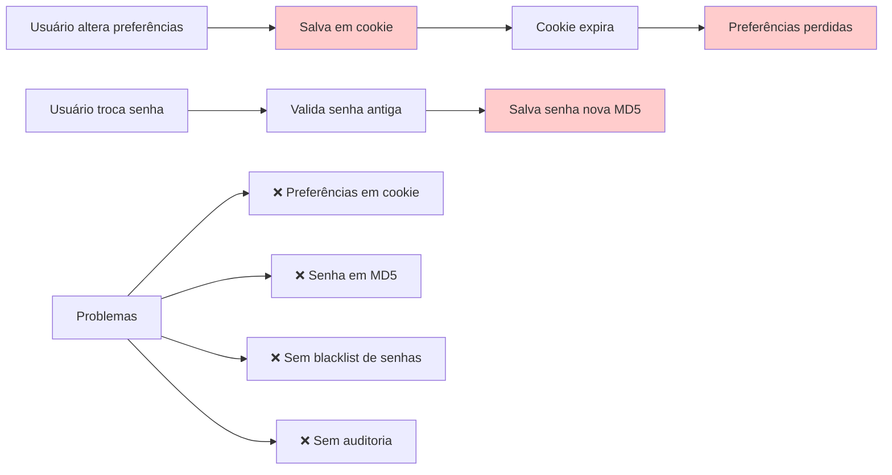

**Moderno (Modernizado):**
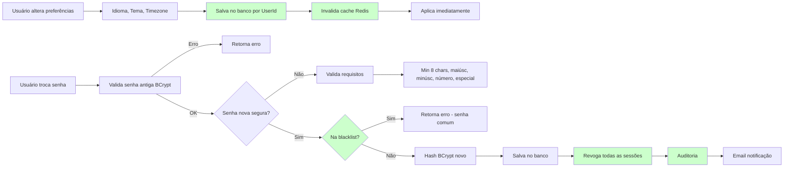

#### Descrição do Processo

O processo de configurações do usuário permite personalização de preferências pessoais (idioma, tema, timezone) e alteração segura de senha com validações robustas, blacklist de senhas comuns e auditoria completa.

**Diferencial Moderno:**
- Preferências pessoais persistidas no banco
- Alteração de senha com validações OWASP
- Blacklist de senhas comuns (top 10.000 senhas mais usadas)
- Auditoria de alterações de senha
- Revogação de sessões ao trocar senha
- Notificação por email de alterações sensíveis

#### Atores

- **Ator Principal:** Usuário Final
- **Atores Secundários:**
  - Sistema de Preferências
  - Sistema de Segurança (validação de senhas)
  - Sistema de Sessão (Redis)
  - Sistema de Auditoria
  - Sistema de Notificação (Email)
- **Sistemas Externos:**
  - Redis Cache
  - SendGrid (Email)

#### Fluxo Principal (Preferências)

1. **Usuário acessa configurações pessoais**
   - Visualiza preferências atuais
   - Idioma (pt-BR, en-US, es-ES, fr-FR)
   - Tema (Claro, Escuro, Auto)
   - Timezone (America/Sao_Paulo, UTC, etc.)
   - Notificações (Email, Push, SMS)

2. **Usuário altera preferências**
   - Seleciona novo idioma
   - Seleciona novo tema
   - Seleciona novo timezone

3. **Sistema valida preferências**
   - Idioma: deve estar na lista suportada
   - Tema: Claro, Escuro ou Auto
   - Timezone: deve ser válido (IANA timezone)

4. **Sistema salva preferências no banco**
   - Tabela: `UserPreferences`
   - Chaves: UserId, ClienteId, Idioma, Tema, Timezone, Notifications

5. **Sistema invalida cache Redis**
   - Remove preferências antigas do cache
   - Próxima requisição carrega novas preferências

6. **Sistema aplica preferências imediatamente**
   - Frontend recarrega traduções se idioma mudou
   - Frontend aplica novo tema
   - Backend usa novo timezone para formatação de datas

**Fluxo Principal (Alteração de Senha)

1. **Usuário acessa "Alterar Senha"**
   - Digita senha atual
   - Digita nova senha
   - Confirma nova senha

2. **Sistema valida senha atual**
   - Compara com hash BCrypt armazenado
   - Se inválido: retorna erro "Senha atual incorreta"

3. **Sistema valida nova senha**
   - Mínimo 8 caracteres
   - Ao menos 1 letra maiúscula
   - Ao menos 1 letra minúscula
   - Ao menos 1 número
   - Ao menos 1 caractere especial (!@#$%^&*)
   - Não pode ser igual à senha atual

4. **Sistema verifica blacklist de senhas**
   - Consulta lista de top 10.000 senhas mais usadas
   - Exemplos: "12345678", "password", "qwerty"
   - Se encontrada: retorna erro "Senha muito comum"

5. **Sistema verifica confirmação de senha**
   - Nova senha == Confirmação
   - Se diferente: retorna erro "Senhas não conferem"

6. **Sistema hasheia nova senha com BCrypt**
   - Salt automático
   - Cost factor: 12 (segurança vs performance)

7. **Sistema salva nova senha**
   - Atualiza campo `PasswordHash` na tabela `Users`
   - Atualiza campo `PasswordChangedAt` com timestamp atual

8. **Sistema revoga todas as sessões ativas**
   - Remove sessões do Redis
   - Força reautenticação em todos os dispositivos
   - Segurança: se senha foi comprometida, atacante perde acesso

9. **Sistema registra auditoria**
   - Timestamp, UserId, IP, UserAgent
   - Ação: "Alteração de senha"
   - Snapshot: não armazena senha (apenas evento)

10. **Sistema envia notificação por email**
    - Assunto: "Sua senha foi alterada"
    - Corpo: "Se não foi você, acesse o link para reportar"
    - Link: "/security/report-unauthorized-change"

#### Automações

- ✅ **Persistência automática:** Preferências salvas no banco automaticamente
- ✅ **Invalidação de cache:** Redis atualizado após alteração
- ✅ **Validação de senha:** Requisitos OWASP validados automaticamente
- ✅ **Blacklist de senhas:** Consulta automática a lista de senhas comuns
- ✅ **Revogação de sessões:** Todas as sessões revogadas ao trocar senha
- ✅ **Auditoria automática:** Registro completo de alterações de senha
- ✅ **Notificação automática:** Email enviado ao trocar senha

#### Integrações

- **Redis Cache:** Cache de preferências do usuário
- **Sistema de Auditoria (RF004):** Registro imutável de alterações de senha
- **SendGrid:** Notificação por email de alterações sensíveis
- **Sistema de Sessão (RF007):** Revogação de sessões ao trocar senha

#### Regras de Negócio Principais

- **RN-014-01:** Preferências devem ser persistidas no banco por UserId
- **RN-014-02:** Idiomas suportados: pt-BR, en-US, es-ES, fr-FR
- **RN-014-03:** Temas suportados: Claro, Escuro, Auto
- **RN-014-04:** Timezone deve ser válido (IANA timezone)
- **RN-014-05:** Senha nova deve ter mínimo 8 caracteres
- **RN-014-06:** Senha nova deve ter maiúscula, minúscula, número e especial
- **RN-014-07:** Senha nova não pode estar na blacklist de senhas comuns
- **RN-014-08:** Trocar senha revoga todas as sessões ativas
- **RN-014-09:** Notificação por email obrigatória ao trocar senha
- **RN-014-10:** Auditoria completa de alterações de senha

**[Ver regras completas em RF014.md]**

#### Referência ao Legado

**Como funcionava no legado:**
- ❌ Preferências em cookies (perdidas ao expirar)
- ❌ Sem persistência no banco (preferências não sincronizavam entre dispositivos)
- ❌ Senha em MD5 (algoritmo fraco)
- ❌ Sem validação de complexidade de senha
- ❌ Sem blacklist de senhas comuns
- ❌ Sem revogação de sessões ao trocar senha (vulnerável)
- ❌ Sem auditoria de alterações de senha
- ❌ Sem notificação de alterações sensíveis

**Melhorias no moderno:**
- ✅ Preferências persistidas no banco por UserId
- ✅ Sincronização entre dispositivos (mesmo login em múltiplos lugares)
- ✅ BCrypt com salt automático (OWASP recomendado)
- ✅ Validação de complexidade (8+ chars, maiúsc, minúsc, número, especial)
- ✅ Blacklist de top 10.000 senhas comuns
- ✅ Revogação automática de sessões ao trocar senha
- ✅ Auditoria completa de alterações de senha
- ✅ Notificação por email de alterações sensíveis
- ✅ Cache Redis para performance
- ✅ Timezone correto para formatação de datas

---

## 4. Referências Cruzadas

### 4.1 Dependências entre Processos

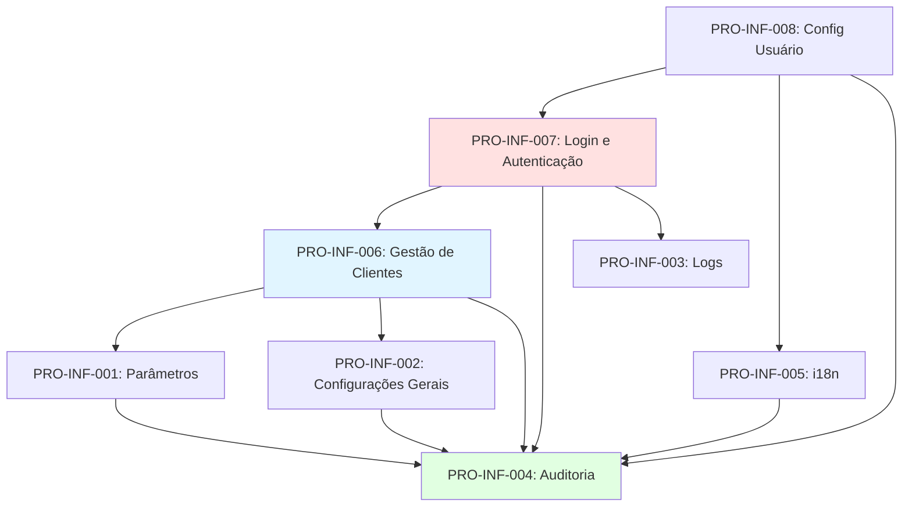

### 4.2 Documentação Relacionada

- **ARCHITECTURE.md:** Stack tecnológico e padrões arquiteturais
- **CONVENTIONS.md:** Nomenclatura e padrões de código
- **COMPLIANCE.md:** Regras de validação e conformidade
- **COMMANDS.md:** Comandos de desenvolvimento e validação

### 4.3 RFs da Jornada

- **RF001:** Parâmetros e Configurações
- **RF002:** Configurações Gerais
- **RF003:** Logs e Monitoramento
- **RF004:** Auditoria de Operações
- **RF005:** Internacionalização (i18n)
- **RF006:** Gestão de Clientes (Multi-Tenancy)
- **RF007:** Login e Autenticação
- **RF014:** Configurações do Usuário

---

## 5. Glossário de Termos Técnicos

| Termo | Descrição |
|-------|-----------|
| **Multi-Tenancy** | Arquitetura onde múltiplos clientes (tenants) compartilham a mesma infraestrutura, mas têm dados isolados por ClienteId |
| **Correlation ID** | UUID único que rastreia uma requisição end-to-end através de múltiplos serviços |
| **Feature Flag** | Configuração que permite ativar/desativar funcionalidades dinamicamente sem deploy |
| **Canary Release** | Estratégia de rollout gradual onde nova funcionalidade é ativada progressivamente (ex: 10% → 50% → 100%) |
| **Hot-Reload** | Aplicação de configurações sem necessidade de reiniciar aplicação |
| **Soft Delete** | Exclusão lógica onde registro é marcado como inativo mas mantido no banco (preserva histórico) |
| **Hard Delete** | Exclusão física onde registro é removido permanentemente do banco |
| **Rate Limiting** | Limitação de requisições por período de tempo (ex: 5 requisições por 15 minutos) |
| **Refresh Token Rotation** | Estratégia de segurança onde refresh token é renovado a cada uso (token antigo é revogado) |
| **OAuth 2.0** | Padrão de mercado para autenticação e autorização |
| **OpenID Connect** | Camada de identidade sobre OAuth 2.0 |
| **MFA (Multi-Factor Authentication)** | Autenticação em múltiplos fatores (senha + código SMS/Email/App) |
| **BCrypt** | Algoritmo de hash de senha com salt automático (OWASP recomendado) |
| **AES-256** | Algoritmo de criptografia simétrica de dados sensíveis |
| **JWT (JSON Web Token)** | Token de acesso contendo claims (UserId, Roles, Permissions) |
| **Métricas RED** | Rate (requisições/s), Errors (taxa de erro), Duration (latência) |
| **Health Check** | Endpoint para verificar status de dependências (DB, Redis, Azure) |
| **Tracing Distribuído** | Rastreamento de requisições através de múltiplos serviços (OpenTelemetry) |
| **Cold Storage** | Armazenamento de longo prazo para dados raramente acessados (Azure Blob Storage) |
| **Hot Storage** | Armazenamento de acesso rápido para dados frequentemente acessados (SQL Server) |

---

## 6. Changelog

| Versão | Data | Autor | Alterações |
|--------|------|-------|------------|
| 1.0 | 2026-01-12 | ALC | Versão inicial - Jornada 1 completa (8 processos) |

---

**Mantido por:** Time de Arquitetura IControlIT
**Última Atualização:** 2026-01-12
**Versão:** 1.0
