# Jornada 2: Workflows e Importação

**Versão:** 1.0
**Data:** 2026-01-12
**Autor:** ALC (alc.dev.br)
**Status:** Vigente

---

## Sumário

- [1. Introdução](#1-introdução)
- [2. Visão Geral da Jornada](#2-visão-geral-da-jornada)
- [3. Processos da Jornada](#3-processos-da-jornada)
  - [3.1 PRO-WKF-001: Motor de Templates](#31-pro-wkf-001-motor-de-templates)
  - [3.2 PRO-WKF-002: Templates de E-mail](#32-pro-wkf-002-templates-de-e-mail)
  - [3.3 PRO-WKF-003: Templates de Relatórios](#33-pro-wkf-003-templates-de-relatórios)
  - [3.4 PRO-WKF-004: Notificações e Alertas](#34-pro-wkf-004-notificações-e-alertas)
  - [3.5 PRO-WKF-005: Central de E-mails](#35-pro-wkf-005-central-de-e-mails)
  - [3.6 PRO-WKF-006: Upload/Importação de Arquivos](#36-pro-wkf-006-uploadimportação-de-arquivos)
  - [3.7 PRO-WKF-007: Importação de Dados](#37-pro-wkf-007-importação-de-dados)
  - [3.8 PRO-WKF-008: Carga/Importação Massiva](#38-pro-wkf-008-cargaimportação-massiva)
  - [3.9 PRO-WKF-009: Aprovações e Workflows](#39-pro-wkf-009-aprovações-e-workflows)
- [4. Matriz de Processos](#4-matriz-de-processos)
- [5. Glossário](#5-glossário)
- [6. Referências Cruzadas](#6-referências-cruzadas)

---

## 1. Introdução

Este documento detalha os **9 processos de negócio** da **Jornada 2: Workflows e Importação** do sistema IControlIT modernizado.

### Escopo

A Jornada 2 abrange os processos de automação, comunicação e importação de dados:

- **Motor de Templates:** Sistema de renderização dinâmica de conteúdo
- **Templates de E-mail:** Comunicação transacional automatizada
- **Templates de Relatórios:** Geração de documentos e relatórios
- **Notificações e Alertas:** Comunicação multi-canal em tempo real
- **Central de E-mails:** Gestão de filas de envio
- **Upload/Importação de Arquivos:** Gestão de uploads seguros
- **Importação de Dados:** Processamento em lote
- **Carga/Importação Massiva:** Importações de alto volume
- **Aprovações e Workflows:** Fluxos de aprovação configuráveis

### Organização do Documento

Cada processo é documentado com:

- **Código único** (PRO-WKF-XXX)
- **RFs associados**
- **Diagramas BPMN** (Legado vs Moderno)
- **Descrição narrativa**
- **Atores envolvidos**
- **Fluxo principal**
- **Automações implementadas**
- **Integrações**
- **Regras de negócio**
- **Comparação com legado**

---

## 2. Visão Geral da Jornada

### Objetivos da Jornada

1. **Automatizar comunicações:** Templates reutilizáveis para e-mails, relatórios e notificações
2. **Centralizar envios:** Fila unificada de e-mails com retry e auditoria
3. **Facilitar importações:** Uploads seguros e validações automáticas
4. **Escalar importações:** Processamento massivo otimizado
5. **Orquestrar aprovações:** Workflows configuráveis com SLA

### Arquitetura da Jornada

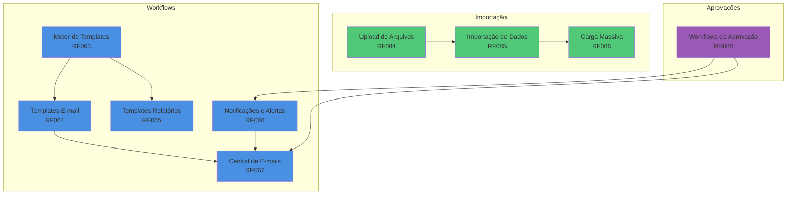

### Stack Tecnológico

- **Backend:** ASP.NET Core 8, MediatR (CQRS), Hangfire (jobs assíncronos)
- **Storage:** Azure Blob Storage (arquivos), SQL Server (metadados)
- **Renderização:** RazorLight (templates), iText7 (PDF), ClosedXML (Excel)
- **Mensageria:** SendGrid/SMTP (e-mail), Twilio (SMS), SignalR (push)
- **Validação:** FluentValidation, AntiVirus (ClamAV)
- **Observabilidade:** Application Insights, Serilog

---

## 3. Processos da Jornada

### 3.1 PRO-WKF-001: Motor de Templates

**Código:** PRO-WKF-001
**RFs Envolvidos:** RF063
**Área:** Workflows
**Criticidade:** Alta

#### Diagrama BPMN: Comparação Legado vs Moderno

**Legado (AS-IS):**

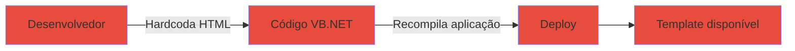

**Moderno (Modernizado):**

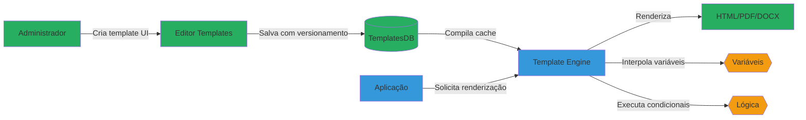

#### Descrição do Processo

O Motor de Templates é o núcleo de geração de conteúdo dinâmico do IControlIT. Utiliza a sintaxe `{{variavel}}` para interpolação de dados, suporta condicionais (`{{#if}}`) e loops (`{{#each}}`), e compila templates para melhor performance. Permite versionamento (histórico de alterações) e renderização em múltiplos formatos (HTML, PDF, DOCX).

#### Atores

- **Administrador de Sistema:** Cria e gerencia templates
- **Aplicação:** Solicita renderização de templates
- **Motor de Templates:** Processa e renderiza conteúdo

#### Fluxo Principal

1. Administrador acessa interface de templates no Admin Portal
2. Cria novo template ou edita existente (editor Monaco com syntax highlighting)
3. Define variáveis disponíveis e tipo de output (HTML/PDF/DOCX)
4. Testa renderização com dados de exemplo
5. Salva template (cria nova versão no histórico)
6. Motor compila template para cache otimizado
7. Aplicação solicita renderização via `RenderTemplateCommand`
8. Motor injeta variáveis e executa lógica condicional
9. Retorna conteúdo renderizado

#### Automações

- ✅ Compilação automática de templates para cache
- ✅ Validação de sintaxe ao salvar
- ✅ Versionamento automático com histórico
- ✅ Preview em tempo real no editor
- ✅ Rollback para versões anteriores

#### Integrações

- **RazorLight:** Engine de renderização de templates Razor
- **iText7:** Conversão HTML → PDF
- **ClosedXML:** Geração de Excel
- **DocumentFormat.OpenXml:** Geração de DOCX
- **Azure Blob Storage:** Armazenamento de templates compilados

#### Regras de Negócio Principais

- **RN-063-01:** Templates devem ter nome único por tenant
- **RN-063-02:** Versionamento obrigatório (imutabilidade)
- **RN-063-03:** Variáveis não utilizadas geram warning (não bloqueiam)
- **RN-063-04:** Templates inativos não podem ser renderizados
- **RN-063-05:** Máximo 100 variáveis por template
- **RN-063-06:** Timeout de renderização: 30 segundos
- **RN-063-07:** Cache de templates compilados: 1 hora

#### Referência ao Legado

**Como funcionava no legado:**

- ❌ Templates hardcoded em código VB.NET (sem reutilização)
- ❌ Alteração requer recompilação e deploy
- ❌ Sem versionamento ou histórico
- ❌ Apenas HTML (sem PDF/DOCX)
- ❌ Sem validação de sintaxe

**Melhorias no moderno:**

- ✅ Templates gerenciados via UI sem código
- ✅ Alterações instantâneas (sem deploy)
- ✅ Histórico completo de versões
- ✅ Multi-formato (HTML, PDF, DOCX, Excel)
- ✅ Editor com validação e preview em tempo real
- ✅ Performance otimizada com cache compilado

---

### 3.2 PRO-WKF-002: Templates de E-mail

**Código:** PRO-WKF-002
**RFs Envolvidos:** RF064
**Área:** Workflows
**Criticidade:** Alta

#### Diagrama BPMN: Comparação Legado vs Moderno

**Legado (AS-IS):**

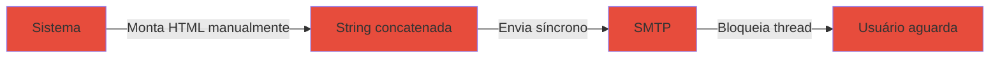

**Moderno (Modernizado):**

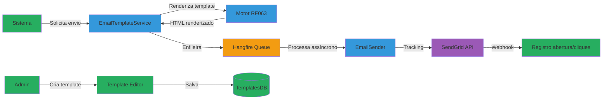

#### Descrição do Processo

Gestão de templates transacionais de e-mail (boas-vindas, redefinição de senha, notificações de sistema, relatórios agendados). Utiliza Motor de Templates (RF063) para renderização, suporta personalização por tenant (logo, cores, rodapé), testes de envio antes de ativar, e tracking de abertura/cliques via SendGrid webhooks.

#### Atores

- **Administrador de Sistema:** Gerencia biblioteca de templates
- **Sistema:** Dispara e-mails transacionais
- **EmailTemplateService:** Orquestra renderização e envio
- **Central de E-mails (RF067):** Processa fila de envio

#### Fluxo Principal

1. Administrador cria template de e-mail na biblioteca
2. Define assunto, remetente e HTML body com variáveis
3. Configura personalização por tenant (opcional)
4. Testa envio para e-mail de validação
5. Ativa template
6. Sistema dispara evento que requer e-mail (ex: novo usuário)
7. `SendEmailCommand` solicita template específico
8. EmailTemplateService renderiza HTML via Motor (RF063)
9. Enfileira na Central de E-mails (RF067)
10. E-mail enviado assíncronamente
11. Webhooks registram abertura/cliques

#### Automações

- ✅ Envio assíncrono via Hangfire (não bloqueia aplicação)
- ✅ Personalização automática por tenant (logo, cores)
- ✅ Tracking automático de abertura e cliques
- ✅ Retry automático em falhas (3 tentativas)
- ✅ Fallback para template padrão se personalizado indisponível

#### Integrações

- **Motor de Templates (RF063):** Renderização de HTML
- **Central de E-mails (RF067):** Fila de envio
- **SendGrid API:** Envio e tracking
- **Hangfire:** Jobs assíncronos
- **Azure Blob Storage:** Armazenamento de anexos

#### Regras de Negócio Principais

- **RN-064-01:** E-mail deve ter assunto e corpo não vazios
- **RN-064-02:** Remetente deve ser e-mail válido do domínio
- **RN-064-03:** Templates inativos não podem ser enviados
- **RN-064-04:** Teste de envio obrigatório antes de ativar template
- **RN-064-05:** Máximo 5 anexos por e-mail (10MB total)
- **RN-064-06:** Variáveis obrigatórias devem estar presentes
- **RN-064-07:** Tracking habilitado por padrão (pode desabilitar)

#### Referência ao Legado

**Como funcionava no legado:**

- ❌ HTML concatenado manualmente em código VB.NET
- ❌ Envio síncrono bloqueava thread (usuário aguardava)
- ❌ Sem tracking de abertura/cliques
- ❌ Sem personalização por tenant
- ❌ Anexos salvos em pasta local (não escalável)
- ❌ Sem retry em falhas

**Melhorias no moderno:**

- ✅ Templates reutilizáveis via biblioteca
- ✅ Envio assíncrono (não bloqueia usuário)
- ✅ Tracking completo de engajamento
- ✅ Personalização automática por tenant
- ✅ Anexos em Azure Blob (escalável)
- ✅ Retry automático e auditoria completa

---

### 3.3 PRO-WKF-003: Templates de Relatórios

**Código:** PRO-WKF-003
**RFs Envolvidos:** RF065
**Área:** Workflows
**Criticidade:** Média

#### Diagrama BPMN: Comparação Legado vs Moderno

**Legado (AS-IS):**

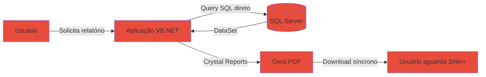

**Moderno (Modernizado):**

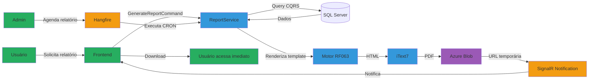

#### Descrição do Processo

Geração de relatórios parametrizados com export em múltiplos formatos (PDF, Excel, CSV). Suporta agendamento via CRON, cache de relatórios pesados (evita reprocessamento), assinatura digital (PDF/A), e processamento assíncrono com notificação via SignalR.

#### Atores

- **Usuário:** Solicita geração de relatórios
- **Administrador:** Configura templates e agendamentos
- **ReportService:** Orquestra geração de relatórios
- **Hangfire:** Executa relatórios agendados

#### Fluxo Principal

1. Usuário acessa módulo de relatórios
2. Seleciona template (ex: "Custo Mensal por Departamento")
3. Define parâmetros (período, departamento, formato)
4. Sistema valida parâmetros
5. `GenerateReportCommand` enfileira job assíncrono
6. Backend consulta dados via CQRS query
7. Motor de Templates (RF063) renderiza HTML
8. iText7 converte para PDF (ou ClosedXML para Excel)
9. Arquivo salvo em Azure Blob com URL temporária (24h)
10. SignalR notifica usuário que relatório está pronto
11. Usuário faz download via link temporário

**Fluxo Alternativo: Relatório Agendado**

1. Administrador configura agendamento (ex: "Todo dia 1 às 8h")
2. Hangfire executa job no horário definido
3. Sistema gera relatório com parâmetros salvos
4. Envia relatório por e-mail via RF064
5. Arquiva cópia em Azure Blob

#### Automações

- ✅ Geração assíncrona (não bloqueia UI)
- ✅ Cache de relatórios idênticos (1 hora)
- ✅ Notificação automática via SignalR
- ✅ Agendamento CRON via Hangfire
- ✅ Limpeza automática de arquivos temporários (24h)
- ✅ Compressão automática de relatórios grandes (>10MB)

#### Integrações

- **Motor de Templates (RF063):** Renderização de layout
- **iText7:** Geração de PDF com assinatura digital
- **ClosedXML:** Geração de Excel
- **Azure Blob Storage:** Armazenamento de arquivos
- **SignalR:** Notificação em tempo real
- **Hangfire:** Agendamento de relatórios

#### Regras de Negócio Principais

- **RN-065-01:** Relatórios grandes (>1000 linhas) devem ser assíncronos
- **RN-065-02:** Cache válido por 1 hora para mesmos parâmetros
- **RN-065-03:** URLs temporárias expiram em 24 horas
- **RN-065-04:** Máximo 50.000 linhas por relatório Excel
- **RN-065-05:** PDF/A obrigatório para relatórios financeiros
- **RN-065-06:** Assinatura digital opcional (via certificado A1)
- **RN-065-07:** Timeout de geração: 5 minutos

#### Referência ao Legado

**Como funcionava no legado:**

- ❌ Crystal Reports (geração síncrona bloqueava aplicação)
- ❌ Timeout frequente em relatórios grandes
- ❌ Sem cache (reprocessamento constante)
- ❌ Apenas PDF (sem Excel/CSV)
- ❌ Arquivos salvos em pasta local (não escalável)
- ❌ Sem agendamento automatizado

**Melhorias no moderno:**

- ✅ Geração assíncrona com notificação
- ✅ Timeout estendido (5 minutos) com retry
- ✅ Cache inteligente (evita reprocessamento)
- ✅ Multi-formato (PDF, Excel, CSV)
- ✅ Azure Blob (escalável e distribuído)
- ✅ Agendamento CRON via Hangfire
- ✅ Assinatura digital integrada

---

### 3.4 PRO-WKF-004: Notificações e Alertas

**Código:** PRO-WKF-004
**RFs Envolvidos:** RF066
**Área:** Workflows
**Criticidade:** Alta

#### Diagrama BPMN: Comparação Legado vs Moderno

**Legado (AS-IS):**

**Moderno (Modernizado):**

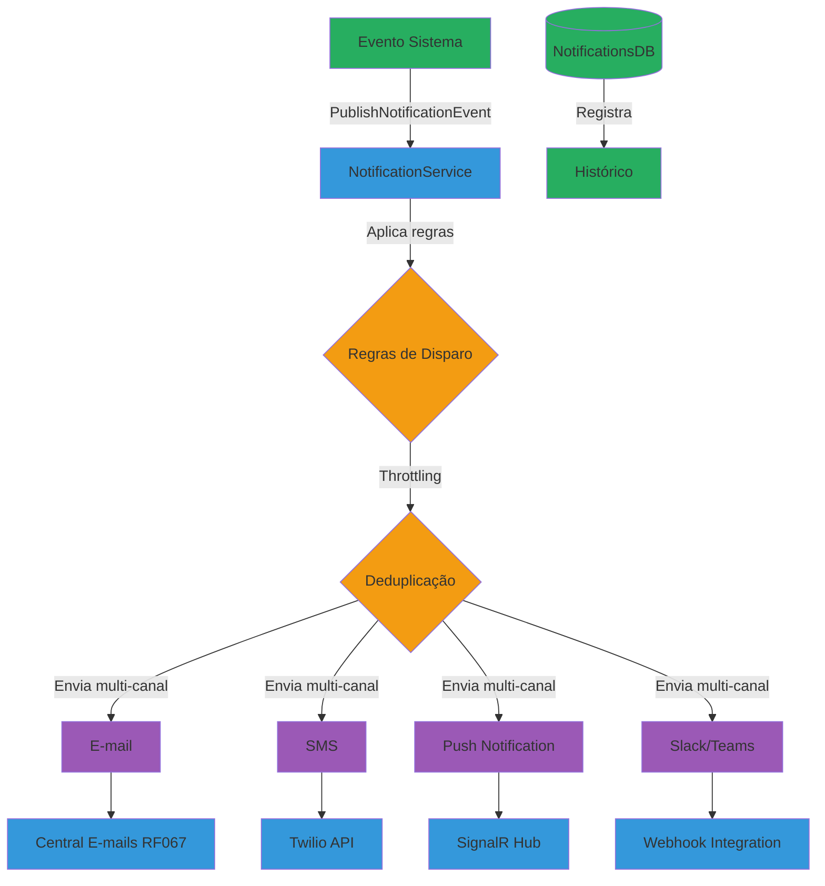

#### Descrição do Processo

Motor unificado de notificações com suporte a múltiplos canais (e-mail, SMS, push notification, Slack, Microsoft Teams). Implementa regras de disparo configuráveis (ex: "notificar se gasto >R$10k"), throttling (limita notificações por período), deduplicação (evita duplicatas em janela de tempo), e histórico completo de envios.

#### Atores

- **Sistema:** Publica eventos de notificação
- **NotificationService:** Orquestra envio multi-canal
- **Administrador:** Configura regras de disparo
- **Usuário:** Recebe notificações

#### Fluxo Principal

1. Sistema publica evento (ex: `GastoAcimaLimiteEvent`)
2. NotificationService captura evento via handler
3. Consulta regras de disparo configuradas para o tipo de evento
4. Valida se condições são atendidas (ex: valor > R$10.000)
5. Aplica throttling (verifica se última notificação foi há menos de 1h)
6. Aplica deduplicação (verifica se notificação idêntica já foi enviada)
7. Consulta preferências de canal do usuário
8. Renderiza mensagem via template
9. Envia para canais habilitados:
   - **E-mail:** Enfileira em RF067
   - **SMS:** Dispara via Twilio API
   - **Push:** Envia via SignalR para frontend
   - **Slack/Teams:** POST para webhook configurado
10. Registra envio no histórico
11. Tracking de leitura (para push notifications)

#### Automações

- ✅ Disparo automático baseado em eventos
- ✅ Throttling automático (evita spam)
- ✅ Deduplicação em janela de 1 hora
- ✅ Fallback de canal (se SMS falhar, tenta e-mail)
- ✅ Retry automático (3 tentativas)
- ✅ Agrupamento de notificações (digest diário)

#### Integrações

- **Central de E-mails (RF067):** Envio de e-mails
- **Twilio API:** Envio de SMS
- **SignalR Hub:** Push notifications em tempo real
- **Slack Incoming Webhooks:** Notificações Slack
- **Microsoft Teams Webhooks:** Notificações Teams
- **Application Insights:** Tracking de envios

#### Regras de Negócio Principais

- **RN-066-01:** Usuário pode desabilitar canais individualmente
- **RN-066-02:** Throttling padrão: máximo 5 notificações/hora por tipo
- **RN-066-03:** Deduplicação em janela de 1 hora
- **RN-066-04:** Notificações críticas ignoram throttling
- **RN-066-05:** SMS apenas para eventos críticos (custo)
- **RN-066-06:** Push notifications expiram em 24 horas
- **RN-066-07:** Histórico mantido por 90 dias

#### Referência ao Legado

**Como funcionava no legado:**

- ❌ Apenas e-mail (canal único)
- ❌ Sem throttling (spam de notificações)
- ❌ Sem deduplicação (notificações duplicadas)
- ❌ Sem histórico ou tracking
- ❌ Regras hardcoded em código
- ❌ Sem preferências de usuário

**Melhorias no moderno:**

- ✅ Multi-canal (e-mail, SMS, push, Slack, Teams)
- ✅ Throttling inteligente (evita spam)
- ✅ Deduplicação automática
- ✅ Histórico completo com tracking
- ✅ Regras configuráveis via UI
- ✅ Preferências de canal por usuário
- ✅ Fallback automático entre canais

---

### 3.5 PRO-WKF-005: Central de E-mails

**Código:** PRO-WKF-005
**RFs Envolvidos:** RF067
**Área:** Workflows
**Criticidade:** Alta

#### Diagrama BPMN: Comparação Legado vs Moderno

**Legado (AS-IS):**

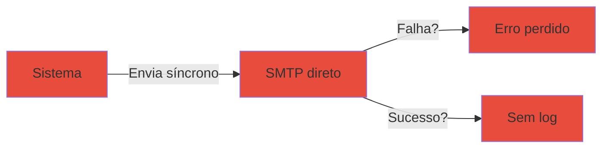

**Moderno (Modernizado):**

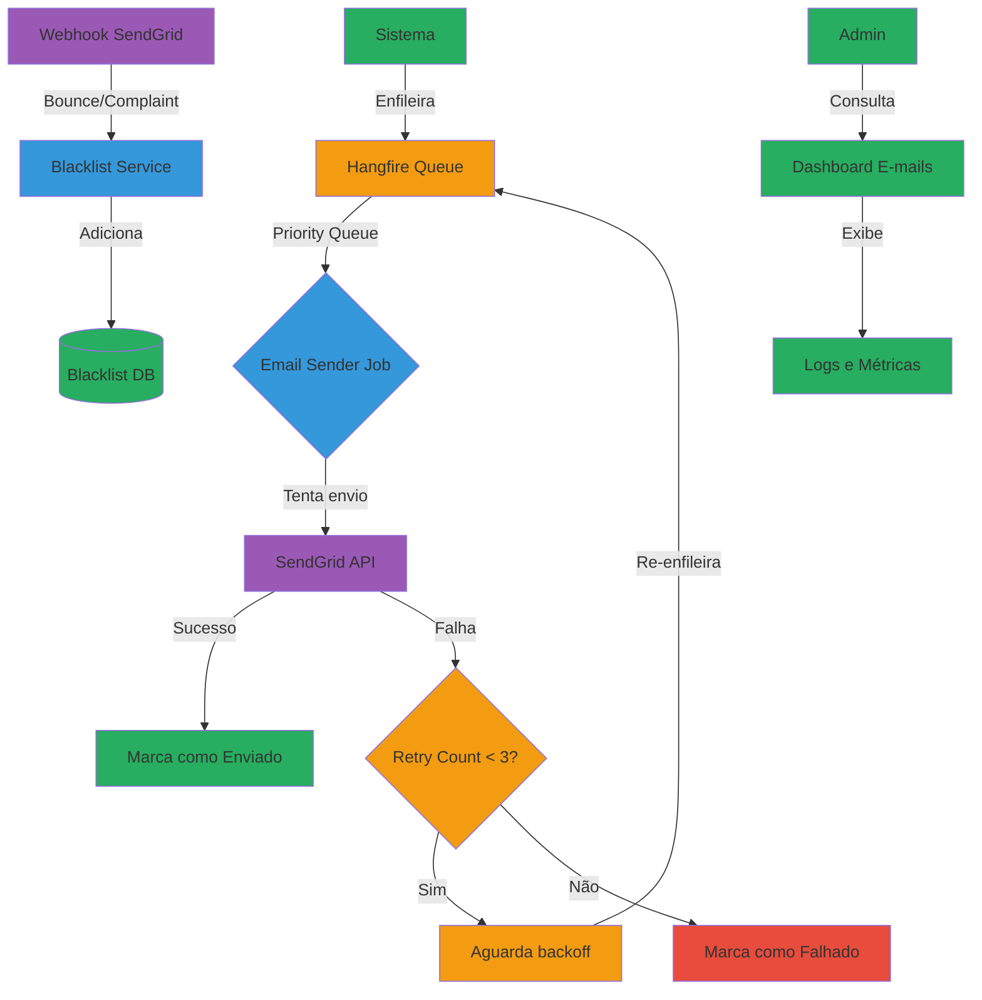

#### Descrição do Processo

Fila unificada de envio de e-mails com processamento assíncrono via Hangfire. Implementa retry automático com backoff exponencial (1min, 5min, 15min), registra logs completos de envio, processa bounces e complaints via webhooks do SendGrid, e mantém blacklist automática de e-mails inválidos.

#### Atores

- **Sistema:** Enfileira e-mails para envio
- **Hangfire:** Processa fila de envio
- **EmailSender Job:** Executa envio via SendGrid
- **SendGrid Webhooks:** Reporta bounces e complaints
- **Administrador:** Monitora dashboard de e-mails

#### Fluxo Principal

1. Sistema solicita envio de e-mail via `SendEmailCommand`
2. E-mail validado e enfileirado no Hangfire
3. Job `EmailSenderJob` processa fila (ordem de prioridade)
4. Verifica se destinatário não está em blacklist
5. Tenta envio via SendGrid API
6. **Cenário sucesso:**
   - Marca e-mail como `Sent`
   - Registra log de envio
   - Aguarda webhooks de tracking
7. **Cenário falha:**
   - Incrementa contador de retry
   - Se retry < 3: Re-enfileira com backoff (1min, 5min, 15min)
   - Se retry = 3: Marca como `Failed` e notifica administrador
8. Webhooks do SendGrid reportam eventos:
   - **Bounce:** Adiciona e-mail à blacklist
   - **Complaint (spam):** Adiciona e-mail à blacklist
   - **Open/Click:** Registra engajamento

#### Automações

- ✅ Retry automático com backoff exponencial (1min, 5min, 15min)
- ✅ Blacklist automática em bounces e complaints
- ✅ Limpeza automática de e-mails enviados após 90 dias
- ✅ Alertas automáticos para taxa de falha > 5%
- ✅ Priorização automática (e-mails críticos primeiro)

#### Integrações

- **Hangfire:** Fila de jobs assíncronos
- **SendGrid API:** Envio de e-mails
- **SendGrid Webhooks:** Eventos de bounce, complaint, open, click
- **Azure Blob Storage:** Armazenamento de anexos
- **Application Insights:** Métricas de envio

#### Regras de Negócio Principais

- **RN-067-01:** Máximo 3 tentativas de envio
- **RN-067-02:** Backoff exponencial: 1min, 5min, 15min
- **RN-067-03:** E-mails em blacklist não são enviados
- **RN-067-04:** Bounce hard adiciona à blacklist permanente
- **RN-067-05:** Bounce soft permite retry (caixa cheia)
- **RN-067-06:** Complaints (spam) adicionam à blacklist
- **RN-067-07:** Logs mantidos por 90 dias
- **RN-067-08:** Prioridade: Crítico > Normal > Baixa

#### Referência ao Legado

**Como funcionava no legado:**

- ❌ Envio síncrono (bloqueava aplicação)
- ❌ Sem retry em falhas
- ❌ Erros perdidos (sem log)
- ❌ Sem blacklist (enviava para e-mails inválidos)
- ❌ Sem tracking de bounces/complaints
- ❌ Sem priorização

**Melhorias no moderno:**

- ✅ Envio assíncrono via fila (não bloqueia)
- ✅ Retry automático com backoff inteligente
- ✅ Logs completos de todos os envios
- ✅ Blacklist automática (economiza recursos)
- ✅ Tracking completo via webhooks
- ✅ Priorização de e-mails críticos
- ✅ Dashboard de monitoramento em tempo real

---

### 3.6 PRO-WKF-006: Upload/Importação de Arquivos

**Código:** PRO-WKF-006
**RFs Envolvidos:** RF084
**Área:** Importação
**Criticidade:** Alta

#### Diagrama BPMN: Comparação Legado vs Moderno

**Legado (AS-IS):**

**Moderno (Modernizado):**

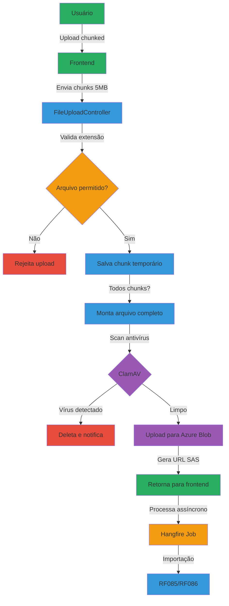

#### Descrição do Processo

Sistema de upload seguro de arquivos com suporte a uploads grandes via chunking (divide arquivo em partes de 5MB), validação de extensão e tamanho, scan de antivírus via ClamAV, armazenamento em Azure Blob Storage, e processamento assíncrono via Hangfire.

#### Atores

- **Usuário:** Faz upload de arquivos
- **Frontend:** Gerencia chunking e progress bar
- **FileUploadController:** Recebe e valida chunks
- **ClamAV:** Escaneia arquivos por vírus
- **Azure Blob Storage:** Armazena arquivos

#### Fluxo Principal

1. Usuário seleciona arquivo (ex: CSV de 50MB)
2. Frontend divide arquivo em chunks de 5MB
3. Envia chunks sequencialmente via HTTP POST
4. Backend valida cada chunk:
   - Extensão permitida (.csv, .xlsx, .txt, .pdf, .zip)
   - Tamanho individual < 5MB
   - Tamanho total acumulado < 500MB
5. Salva chunks em storage temporário
6. Quando último chunk recebido:
   - Monta arquivo completo
   - Calcula hash SHA256
   - Executa scan ClamAV
7. **Cenário vírus detectado:**
   - Deleta arquivo
   - Notifica usuário via SignalR
   - Registra tentativa em log de segurança
8. **Cenário arquivo limpo:**
   - Upload para Azure Blob Storage
   - Gera URL SAS (validade 24 horas)
   - Retorna URL para frontend
9. Frontend notifica usuário: "Upload concluído"
10. Sistema enfileira job de processamento (RF085/RF086)

#### Automações

- ✅ Chunking automático de arquivos grandes
- ✅ Scan antivírus obrigatório
- ✅ Upload paralelo para Azure Blob
- ✅ Limpeza automática de chunks temporários
- ✅ Notificação em tempo real via SignalR
- ✅ Geração automática de URL SAS

#### Integrações

- **Azure Blob Storage:** Armazenamento de arquivos
- **ClamAV:** Antivírus
- **Hangfire:** Processamento assíncrono
- **SignalR:** Notificações em tempo real
- **Application Insights:** Métricas de upload

#### Regras de Negócio Principais

- **RN-084-01:** Extensões permitidas: .csv, .xlsx, .txt, .pdf, .zip, .xml
- **RN-084-02:** Tamanho máximo por arquivo: 500MB
- **RN-084-03:** Chunk size: 5MB
- **RN-084-04:** Scan antivírus obrigatório
- **RN-084-05:** Arquivos com vírus são deletados imediatamente
- **RN-084-06:** URL SAS expira em 24 horas
- **RN-084-07:** Chunks temporários deletados após 1 hora
- **RN-084-08:** Timeout de upload: 30 minutos

#### Referência ao Legado

**Como funcionava no legado:**

- ❌ Limite de 2MB (IIS)
- ❌ Arquivos salvos em pasta local (não escalável)
- ❌ Sem scan de antivírus
- ❌ Sem validação de extensão
- ❌ Upload síncrono (bloqueava aplicação)
- ❌ Sem progress bar

**Melhorias no moderno:**

- ✅ Suporte a arquivos de até 500MB via chunking
- ✅ Azure Blob Storage (escalável e distribuído)
- ✅ Scan antivírus obrigatório (ClamAV)
- ✅ Validação rigorosa de extensão e tamanho
- ✅ Upload assíncrono com retry
- ✅ Progress bar em tempo real via SignalR

---

### 3.7 PRO-WKF-007: Importação de Dados

**Código:** PRO-WKF-007
**RFs Envolvidos:** RF085
**Área:** Importação
**Criticidade:** Alta

#### Diagrama BPMN: Comparação Legado vs Moderno

**Legado (AS-IS):**

**Moderno (Modernizado):**

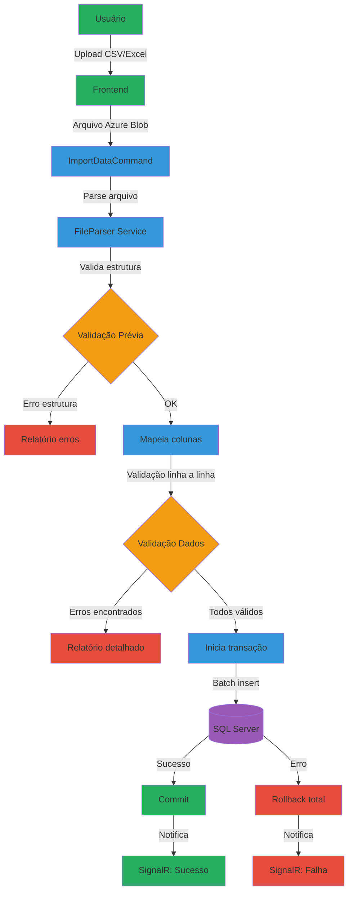

#### Descrição do Processo

Importação estruturada de dados em lote (CSV, Excel) com validação pré-importação (estrutura e dados), mapeamento flexível de colunas (permite renomear colunas na UI), transação atômica (rollback total em caso de erro), e relatório detalhado de importação com linhas processadas/erros.

#### Atores

- **Usuário:** Realiza importação de dados
- **ImportDataCommand:** Orquestra importação
- **FileParserService:** Parseia CSV/Excel
- **ValidationService:** Valida dados
- **BatchRepository:** Executa insert em lote

#### Fluxo Principal

1. Usuário faz upload de arquivo CSV/Excel (via RF084)
2. Seleciona tipo de importação (ex: "Usuários", "Centros de Custo")
3. Sistema exibe preview das primeiras 10 linhas
4. Usuário mapeia colunas (arrasta/solta para corresponder campos)
5. Clica em "Iniciar Importação"
6. `ImportDataCommand` enfileira job assíncrono
7. **Validação Prévia:**
   - Valida estrutura do arquivo (colunas obrigatórias presentes?)
   - Valida tipos de dados (texto, número, data)
   - Se erros: retorna relatório e PARA importação
8. **Validação Linha a Linha:**
   - Aplica FluentValidation em cada registro
   - Valida regras de negócio (ex: e-mail único)
   - Acumula erros
9. **Cenário com erros:**
   - Gera relatório Excel com linhas inválidas e motivos
   - Notifica usuário via SignalR
   - PARA importação (não insere nada)
10. **Cenário sem erros:**
    - Inicia transação SQL
    - Executa batch insert (1000 registros por vez)
    - Commit
    - Notifica usuário: "1500 registros importados com sucesso"

#### Automações

- ✅ Detecção automática de encoding (UTF-8, ISO-8859-1)
- ✅ Detecção automática de delimitador (vírgula, ponto-vírgula, tab)
- ✅ Sugestão automática de mapeamento de colunas
- ✅ Validação assíncrona (não bloqueia UI)
- ✅ Rollback automático em caso de erro
- ✅ Geração automática de relatório de erros

#### Integrações

- **RF084:** Upload de arquivos
- **ClosedXML:** Parse de Excel
- **CsvHelper:** Parse de CSV
- **FluentValidation:** Validação de dados
- **EF Core:** Batch insert otimizado
- **SignalR:** Notificação de progresso

#### Regras de Negócio Principais

- **RN-085-01:** Importação é transacional (all-or-nothing)
- **RN-085-02:** Validação prévia obrigatória
- **RN-085-03:** Máximo 10.000 linhas por importação padrão
- **RN-085-04:** Erros param importação (não insere parcialmente)
- **RN-085-05:** Relatório de erros gerado automaticamente
- **RN-085-06:** Mapeamento de colunas obrigatório
- **RN-085-07:** Timeout de importação: 10 minutos

#### Referência ao Legado

**Como funcionava no legado:**

- ❌ Copiar/colar manual (propenso a erros)
- ❌ INSERT linha por linha (lento)
- ❌ Sem validação prévia (erros só no banco)
- ❌ Importações parciais (inconsistência)
- ❌ Sem relatório de erros
- ❌ Timeout frequente

**Melhorias no moderno:**

- ✅ Upload estruturado de arquivos
- ✅ Batch insert otimizado (50x mais rápido)
- ✅ Validação prévia antes de inserir
- ✅ Transação atômica (rollback total)
- ✅ Relatório detalhado de erros
- ✅ Mapeamento flexível de colunas
- ✅ Processamento assíncrono sem timeout

---

### 3.8 PRO-WKF-008: Carga/Importação Massiva

**Código:** PRO-WKF-008
**RFs Envolvidos:** RF086
**Área:** Importação
**Criticidade:** Média

#### Diagrama BPMN: Comparação Legado vs Moderno

**Legado (AS-IS):**

**Moderno (Modernizado):**

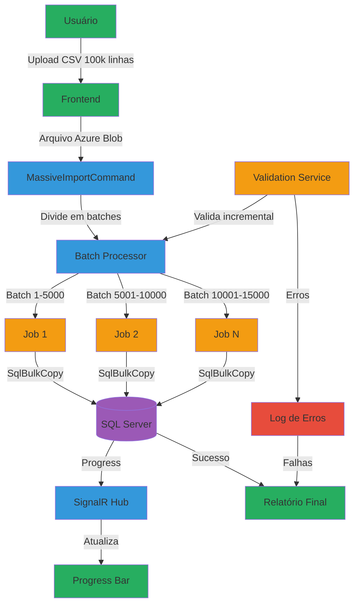

#### Descrição do Processo

Importação de alto volume (até 100.000 linhas) com processamento batch otimizado via SqlBulkCopy, divisão em jobs paralelos (5000 linhas por batch), validação incremental (não carrega tudo em memória), progress bar em tempo real via SignalR, e log detalhado de erros sem parar importação.

#### Atores

- **Usuário:** Solicita importação massiva
- **MassiveImportCommand:** Orquestra importação
- **BatchProcessor:** Divide e processa batches
- **SqlBulkCopy:** Executa insert massivo otimizado
- **SignalR Hub:** Reporta progresso em tempo real

#### Fluxo Principal

1. Usuário faz upload de arquivo grande (ex: 50.000 linhas)
2. Sistema detecta que é importação massiva (>10.000 linhas)
3. Exibe alerta: "Importação massiva detectada. Processamento pode levar alguns minutos."
4. `MassiveImportCommand` enfileira job Hangfire
5. Job divide arquivo em batches de 5000 linhas
6. Cria jobs paralelos (máximo 3 simultâneos)
7. **Processamento de cada batch:**
   - Lê 5000 linhas do arquivo
   - Valida linha a linha
   - Linhas válidas: adiciona a DataTable
   - Linhas inválidas: registra em log de erros
   - Executa SqlBulkCopy para inserir batch
   - Reporta progresso via SignalR: "15000/50000 (30%)"
8. Quando todos batches concluídos:
   - Gera relatório final:
     - Total processado: 50.000
     - Inseridos: 48.500
     - Erros: 1.500
   - Anexa log de erros (Excel com linhas inválidas)
   - Notifica usuário via SignalR

#### Automações

- ✅ Detecção automática de importação massiva (>10k linhas)
- ✅ Divisão automática em batches otimizados
- ✅ Processamento paralelo (3 jobs simultâneos)
- ✅ Progress bar em tempo real
- ✅ SqlBulkCopy para performance máxima
- ✅ Validação incremental (não carrega tudo em memória)
- ✅ Geração automática de relatório de erros

#### Integrações

- **RF084:** Upload de arquivos grandes
- **SqlBulkCopy:** Insert massivo otimizado
- **Hangfire:** Processamento assíncrono
- **SignalR:** Progress bar em tempo real
- **ClosedXML:** Geração de relatório de erros
- **Azure Blob Storage:** Armazenamento de logs

#### Regras de Negócio Principais

- **RN-086-01:** Importação massiva: >10.000 linhas
- **RN-086-02:** Batch size: 5000 linhas
- **RN-086-03:** Máximo 3 batches paralelos
- **RN-086-04:** Validação incremental (não bloqueia memória)
- **RN-086-05:** Erros não param importação (modo best-effort)
- **RN-086-06:** Log de erros gerado automaticamente
- **RN-086-07:** Máximo 100.000 linhas por importação
- **RN-086-08:** Timeout de batch: 5 minutos

#### Referência ao Legado

**Como funcionava no legado:**

- ❌ INSERT linha por linha (extremamente lento)
- ❌ Timeout garantido em >10k linhas
- ❌ Sem progress bar (usuário sem feedback)
- ❌ Carrega tudo em memória (crash)
- ❌ Erro em uma linha para tudo (rollback total)
- ❌ Sem relatório de erros

**Melhorias no moderno:**

- ✅ SqlBulkCopy (100x mais rápido)
- ✅ Sem timeout (processamento assíncrono)
- ✅ Progress bar em tempo real
- ✅ Validação incremental (memória controlada)
- ✅ Modo best-effort (erros não param importação)
- ✅ Relatório detalhado de erros
- ✅ Suporte até 100k linhas

---

### 3.9 PRO-WKF-009: Aprovações e Workflows

**Código:** PRO-WKF-009
**RFs Envolvidos:** RF088
**Área:** Workflows
**Criticidade:** Alta

#### Diagrama BPMN: Comparação Legado vs Moderno

**Legado (AS-IS):**

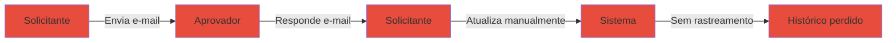

**Moderno (Modernizado):**

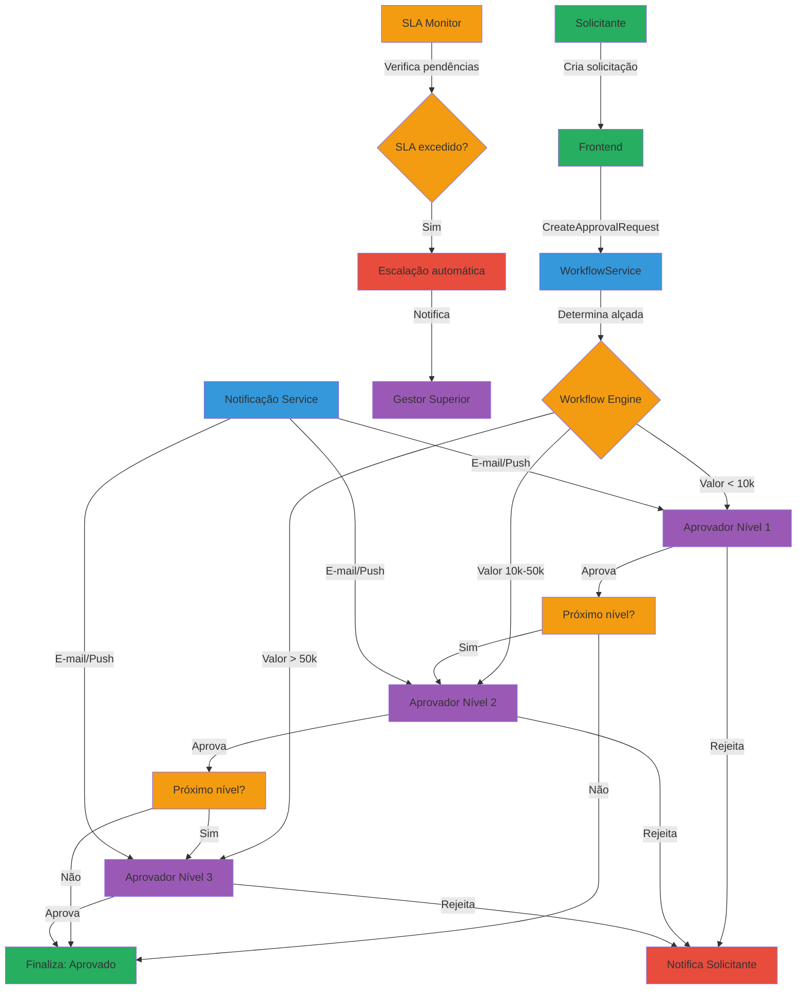

#### Descrição do Processo

Sistema configurável de aprovações com state machine (Pending → Approved/Rejected/Escalated), alçadas automáticas por valor, delegação de aprovadores (férias/ausência), SLA de aprovação (ex: 48 horas) com escalação automática, e notificações multi-canal (e-mail, push, Slack).

#### Atores

- **Solicitante:** Cria solicitação de aprovação
- **Aprovador(es):** Aprovam ou rejeitam solicitações
- **WorkflowService:** Orquestra fluxo de aprovação
- **SLA Monitor:** Monitora prazos e escala pendências
- **NotificationService (RF066):** Notifica participantes

#### Fluxo Principal

1. Solicitante cria solicitação (ex: "Compra de Licenças - R$25.000")
2. `CreateApprovalRequestCommand` processa solicitação
3. WorkflowService determina alçada baseada em regras:
   - Valor < R$10.000: Nível 1 (Coordenador)
   - Valor R$10.000 - R$50.000: Nível 2 (Gerente)
   - Valor > R$50.000: Nível 3 (Diretor)
4. Sistema identifica aprovadores:
   - Consulta hierarquia organizacional
   - Verifica delegações ativas (aprovador de férias?)
   - Seleciona aprovador disponível
5. Notifica aprovador via RF066 (e-mail + push)
6. Aprovador acessa painel "Minhas Aprovações"
7. Visualiza detalhes da solicitação (anexos, justificativa)
8. **Cenário 1: Aprovação**
   - Clica em "Aprovar"
   - Adiciona comentário (opcional)
   - Sistema verifica se há próximo nível
   - Se sim: notifica próximo aprovador
   - Se não: finaliza como "Aprovado"
9. **Cenário 2: Rejeição**
   - Clica em "Rejeitar"
   - Adiciona justificativa (obrigatória)
   - Sistema finaliza como "Rejeitado"
   - Notifica solicitante
10. **Cenário 3: SLA Excedido**
    - SLA Monitor detecta pendência > 48h
    - Executa escalação automática
    - Notifica gestor superior
    - Gestor pode assumir aprovação ou pressionar aprovador

#### Automações

- ✅ Determinação automática de alçada por regras
- ✅ Identificação automática de aprovadores via hierarquia
- ✅ Delegação automática (aprovador ausente → substituto)
- ✅ Notificações automáticas multi-canal
- ✅ Escalação automática por SLA
- ✅ Lembretes diários para pendências
- ✅ Auditoria completa de todas ações

#### Integrações

- **NotificationService (RF066):** Notificações multi-canal
- **Central de E-mails (RF067):** Envio de e-mails de aprovação
- **Hangfire:** Jobs de SLA monitor
- **SignalR:** Atualização em tempo real do painel
- **Azure AD:** Hierarquia organizacional

#### Regras de Negócio Principais

- **RN-088-01:** Alçadas configuráveis por tipo de solicitação
- **RN-088-02:** Delegação obrigatória ao sair de férias
- **RN-088-03:** SLA padrão: 48 horas úteis
- **RN-088-04:** Escalação automática após SLA excedido
- **RN-088-05:** Justificativa obrigatória em rejeições
- **RN-088-06:** Aprovador não pode aprovar própria solicitação
- **RN-088-07:** Histórico de aprovações imutável (auditoria)
- **RN-088-08:** Notificações diárias de pendências (9h AM)

#### Referência ao Legado

**Como funcionava no legado:**

- ❌ Aprovações via e-mail (sem rastreamento)
- ❌ Sem alçadas automáticas (sempre manual)
- ❌ Sem delegação (aprovações travavam em férias)
- ❌ Sem SLA ou escalação
- ❌ Histórico perdido (e-mails deletados)
- ❌ Sem auditoria

**Melhorias no moderno:**

- ✅ Aprovações rastreadas em sistema
- ✅ Alçadas automáticas por regras configuráveis
- ✅ Delegação automática (substituto assume)
- ✅ SLA com escalação automática
- ✅ Histórico completo e imutável
- ✅ Auditoria completa (quem, quando, o quê)
- ✅ Dashboard de aprovações em tempo real

---

## 4. Matriz de Processos

| Código | Processo | RF | Criticidade | Automação | Integrações |
|--------|----------|----|-----------|-----------| ------------|
| **PRO-WKF-001** | Motor de Templates | RF063 | Alta | ✅ Compilação cache, versionamento | RazorLight, iText7, ClosedXML |
| **PRO-WKF-002** | Templates de E-mail | RF064 | Alta | ✅ Envio assíncrono, tracking | RF063, RF067, SendGrid |
| **PRO-WKF-003** | Templates de Relatórios | RF065 | Média | ✅ Cache, agendamento CRON | RF063, iText7, Hangfire |
| **PRO-WKF-004** | Notificações e Alertas | RF066 | Alta | ✅ Throttling, deduplicação | RF067, Twilio, SignalR, Slack |
| **PRO-WKF-005** | Central de E-mails | RF067 | Alta | ✅ Retry, blacklist, webhooks | SendGrid, Hangfire |
| **PRO-WKF-006** | Upload/Importação de Arquivos | RF084 | Alta | ✅ Chunking, antivírus, SAS | Azure Blob, ClamAV, SignalR |
| **PRO-WKF-007** | Importação de Dados | RF085 | Alta | ✅ Validação prévia, rollback | RF084, FluentValidation, EF Core |
| **PRO-WKF-008** | Carga/Importação Massiva | RF086 | Média | ✅ Batch paralelo, SqlBulkCopy | RF084, Hangfire, SignalR |
| **PRO-WKF-009** | Aprovações e Workflows | RF088 | Alta | ✅ Alçadas, SLA, escalação | RF066, RF067, Hangfire |

---

## 5. Glossário

| Termo | Definição |
|-------|-----------|
| **Alçada** | Limite de valor/escopo que determina nível de aprovação necessário |
| **Batch Insert** | Inserção de múltiplos registros em uma única operação SQL |
| **Blacklist** | Lista de e-mails bloqueados por bounces ou complaints |
| **Bounce** | E-mail retornado por caixa inexistente (hard) ou temporariamente indisponível (soft) |
| **Chunking** | Divisão de arquivo grande em partes menores para upload |
| **Complaint** | Marcação de e-mail como spam pelo destinatário |
| **CQRS** | Command Query Responsibility Segregation (separação comando/consulta) |
| **Delegação** | Transferência temporária de responsabilidade de aprovação |
| **Deduplicação** | Eliminação de notificações duplicadas em janela de tempo |
| **Escalação** | Transferência de aprovação para nível superior por SLA excedido |
| **Interpolação** | Substituição de variáveis `{{nome}}` por valores reais |
| **SAS (Shared Access Signature)** | URL temporária com permissões para acesso a recurso Azure |
| **SLA (Service Level Agreement)** | Prazo máximo para conclusão de tarefa |
| **SqlBulkCopy** | API .NET para inserção massiva otimizada no SQL Server |
| **State Machine** | Máquina de estados que controla transições de workflow |
| **Template** | Modelo reutilizável com variáveis para geração de conteúdo |
| **Throttling** | Limitação de taxa de envio para evitar spam |
| **Tracking** | Rastreamento de abertura e cliques em e-mails |
| **Webhook** | Callback HTTP para notificação de eventos externos |

---

## 6. Referências Cruzadas

### Jornadas Relacionadas

- **Jornada 1:** Gestão de Clientes e Organizações (PRO-CLI-001 a PRO-CLI-011)
- **Jornada 3:** Gestão de Usuários e Permissões (a documentar)
- **Jornada 4:** Gestão de Ativos e Inventário (a documentar)

### Documentos de Governança

| Documento | Caminho | Relevância |
|-----------|---------|-----------|
| **ARCHITECTURE.md** | `D:\IC2_Governanca\governanca\ARCHITECTURE.md` | Stack tecnológico, padrões arquiteturais |
| **CONVENTIONS.md** | `D:\IC2_Governanca\governanca\CONVENTIONS.md` | Nomenclatura de handlers, repositories |
| **COMPLIANCE.md** | `D:\IC2_Governanca\governanca\COMPLIANCE.md` | Regras de validação e auditoria |
| **COMMANDS.md** | `D:\IC2_Governanca\governanca\COMMANDS.md` | Comandos de desenvolvimento e validação |

### RFs Relacionados

| RF | Título | Status |
|----|--------|--------|
| **RF063** | Motor de Templates | ✅ Implementado |
| **RF064** | Templates de E-mail | ✅ Implementado |
| **RF065** | Templates de Relatórios | ✅ Implementado |
| **RF066** | Notificações e Alertas | ✅ Implementado |
| **RF067** | Central de E-mails | ✅ Implementado |
| **RF084** | Upload/Importação de Arquivos | ✅ Implementado |
| **RF085** | Importação de Dados | ✅ Implementado |
| **RF086** | Carga/Importação Massiva | ✅ Implementado |
| **RF088** | Aprovações e Workflows | ✅ Implementado |

### Contratos de Execução

Para implementar ou manter processos desta jornada, consulte:

- **Backend:** `D:\IC2_Governanca\governanca\contracts\desenvolvimento\execucao\backend-criacao.md`
- **Frontend:** `D:\IC2_Governanca\governanca\contracts\desenvolvimento\execucao\frontend-criacao.md`
- **Manutenção:** `D:\IC2_Governanca\governanca\contracts\desenvolvimento\execucao\manutencao\CONTRATO-MANUTENCAO-CORRECAO-CONTROLADA.md`
- **Auditoria:** `D:\IC2_Governanca\governanca\contracts\auditoria\conformidade.md`

---

## Controle de Versão

| Versão | Data | Autor | Alterações |
|--------|------|-------|------------|
| 1.0 | 2026-01-12 | ALC | Criação inicial com 9 processos da Jornada 2 |

---

**Mantido por:** Time de Arquitetura IControlIT
**Última Atualização:** 2026-01-12
**Versão:** 1.0
