# Jornada 3: Financeiro Completo

**Versão:** 1.0
**Data:** 2026-01-12
**Autor:** ALC (alc.dev.br)
**Status:** Vigente

---

## Sumário

- [1. Introdução](#1-introdução)
- [2. Visão Geral da Jornada](#2-visão-geral-da-jornada)
- [3. Processos da Jornada](#3-processos-da-jornada)
  - [PARTE 1: CONTRATOS E FATURAMENTO](#parte-1-contratos-e-faturamento)
  - [PARTE 2: ATIVOS E CUSTOS](#parte-2-ativos-e-custos)
- [4. Matriz de Processos](#4-matriz-de-processos)
- [5. Glossário](#5-glossário)
- [6. Referências Cruzadas](#6-referências-cruzadas)

---

## 1. Introdução

Este documento detalha os **12 processos de negócio** da **Jornada 3: Financeiro Completo** do sistema IControlIT modernizado.

### Escopo

A Jornada 3 abrange dois domínios financeiros críticos:

**PARTE 1: Contratos e Faturamento (7 processos PRO-FCT)**
- Gestão de Faturas
- Parâmetros de Faturamento
- Plano de Contas
- Notas Fiscais/Faturas (NF-e)
- Conciliação de Faturas
- Medição/Faturamento de Contratos
- Auditoria de Faturas

**PARTE 2: Ativos e Custos (5 processos PRO-FAC)**
- Gestão de Ativos
- Custos Fixos
- Custos por Ativo (TCO)
- Notas Fiscais de Estoque
- Rateio Multi-dimensional

### Organização do Documento

Cada processo é documentado com:

- **Código único** (PRO-FCT-XXX ou PRO-FAC-XXX)
- **RFs associados**
- **Diagramas BPMN** (Legado vs Moderno)
- **Descrição narrativa**
- **Atores envolvidos**
- **Fluxo principal**
- **Automações implementadas**
- **Integrações**
- **Regras de negócio**
- **Comparação com legado**

---

## 2. Visão Geral da Jornada

### Objetivos da Jornada

1. **Automatizar faturamento:** Geração, conciliação e baixa automática de faturas
2. **Integrar SEFAZ:** Emissão de NF-e via WebService oficial
3. **Calcular TCO:** Total Cost of Ownership automático por ativo
4. **Ratear custos:** Alocação multi-dimensional em tempo real
5. **Auditar financeiro:** Validação preventiva de não-conformidades

### Arquitetura da Jornada

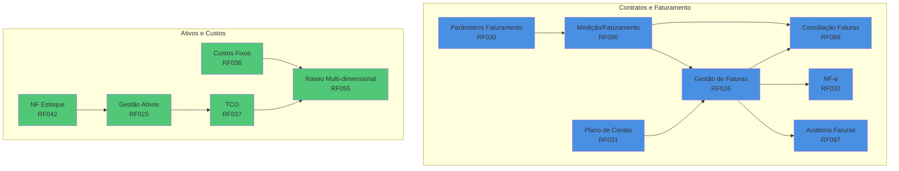

### Stack Tecnológico

- **Backend:** ASP.NET Core 8, MediatR (CQRS), Hangfire (jobs)
- **Financeiro:** WebService SEFAZ (NF-e), OFX Parser (conciliação bancária)
- **Cálculos:** Motor de rateio customizado, depreciação automática
- **Storage:** SQL Server (transacional), Azure Blob (XMLs NF-e)
- **Integrações:** TOTVS, SAP, ERP legado via API REST
- **Observabilidade:** Application Insights, Serilog

---

## 3. Processos da Jornada

## PARTE 1: CONTRATOS E FATURAMENTO

### 3.1 PRO-FCT-001: Gestão de Faturas

**Código:** PRO-FCT-001
**RFs Envolvidos:** RF026
**Área:** Contratos e Faturamento
**Criticidade:** Alta

#### Diagrama BPMN: Comparação Legado vs Moderno

**Legado (AS-IS):**

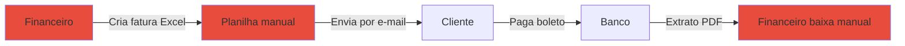

**Moderno (Modernizado):**

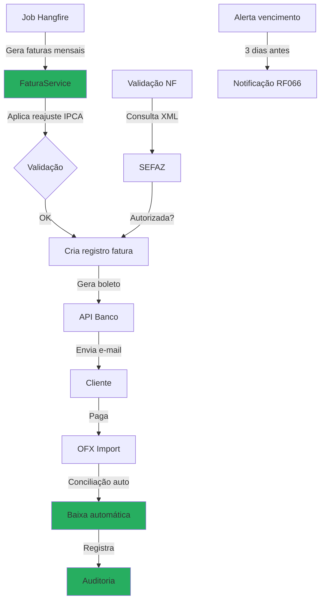

#### Descrição do Processo

Ciclo completo de gestão de faturas desde criação automática mensal, validação de Notas Fiscais via SEFAZ, geração de boletos bancários, envio automático ao cliente, conciliação com extratos OFX, até baixa automática e auditoria. Inclui alertas proativos de vencimento e histórico completo de pagamentos.

#### Atores

- **Sistema de Faturamento:** Gera faturas automaticamente
- **Financeiro:** Monitora e intervém em exceções
- **Cliente:** Recebe e paga faturas
- **Banco:** Processa pagamentos
- **SEFAZ:** Valida Notas Fiscais

#### Fluxo Principal

1. Job Hangfire executa no dia 1 de cada mês (00:00)
2. Sistema busca contratos ativos com faturamento mensal
3. Para cada contrato:
   - Calcula valor base + reajustes (IPCA, IGP-M)
   - Aplica impostos (PIS, COFINS, ISSQN)
   - Cria registro de fatura (status: Pendente)
4. Valida se existe NF-e autorizada
5. Se NF-e não existe: dispara geração via RF032
6. Gera boleto via API do banco
7. Envia e-mail ao cliente com:
   - PDF da fatura
   - XML da NF-e
   - Link para boleto
8. Sistema agenda alertas:
   - 3 dias antes do vencimento
   - No dia do vencimento
   - 1 dia após vencimento
9. Importação OFX bancária identifica pagamento
10. Sistema faz conciliação automática (valor + nosso número)
11. Se match: baixa fatura automaticamente
12. Registra histórico completo na auditoria

**Fluxo Alternativo: Fatura Vencida**

1. Job diário verifica faturas não pagas após vencimento
2. Calcula multa (2%) + juros diários (0,033%)
3. Atualiza valor da fatura
4. Notifica cliente via e-mail/SMS
5. Após 30 dias: marca para cobrança jurídica

#### Automações

- ✅ Geração automática mensal via Hangfire
- ✅ Cálculo automático de reajustes (IPCA, IGP-M)
- ✅ Validação automática de NF-e via SEFAZ
- ✅ Geração automática de boletos
- ✅ Envio automático por e-mail
- ✅ Alertas proativos de vencimento
- ✅ Conciliação automática com OFX
- ✅ Baixa automática de faturas
- ✅ Cálculo automático de multa e juros

#### Integrações

- **RF032 (NF-e):** Geração de Nota Fiscal Eletrônica
- **WebService SEFAZ:** Validação de autorização de NF-e
- **API Banco (Itaú/Bradesco):** Geração de boletos
- **OFX Parser:** Importação de extratos bancários
- **RF089 (Conciliação):** Matching automático fatura vs pagamento
- **RF066 (Notificações):** Alertas multi-canal
- **RF004 (Auditoria):** Registro imutável de operações

#### Regras de Negócio Principais

- **RN-026-01:** Faturas geradas automaticamente no dia 1 de cada mês
- **RN-026-02:** Vencimento padrão: dia 10 do mês seguinte (configurável)
- **RN-026-03:** Reajustes aplicados conforme índice contratual (IPCA, IGP-M, IPC)
- **RN-026-04:** Multa de 2% após vencimento
- **RN-026-05:** Juros de 1% ao mês (0,033% ao dia)
- **RN-026-06:** Conciliação automática por nosso número + valor
- **RN-026-07:** Fatura sem NF-e autorizada não pode ser enviada
- **RN-026-08:** Alertas enviados 3 dias antes do vencimento

#### Referência ao Legado

**Como funcionava no legado:**

- ❌ Faturas criadas manualmente em Excel
- ❌ Envio manual por e-mail (esquecimentos frequentes)
- ❌ Conciliação manual com extrato PDF (demorado)
- ❌ Baixa manual (atrasos e erros)
- ❌ Sem alertas automáticos de vencimento
- ❌ Sem cálculo automático de multa e juros
- ❌ Sem histórico de pagamentos estruturado
- ❌ Validação NF-e manual

**Melhorias no moderno:**

- ✅ Geração automática mensal (Hangfire)
- ✅ Envio automático por e-mail
- ✅ Conciliação automática via OFX
- ✅ Baixa automática de faturas
- ✅ Alertas proativos multi-canal
- ✅ Cálculo automático de encargos
- ✅ Histórico completo auditável
- ✅ Integração nativa com SEFAZ

---

### 3.2 PRO-FCT-002: Parâmetros de Faturamento

**Código:** PRO-FCT-002
**RFs Envolvidos:** RF030
**Área:** Contratos e Faturamento
**Criticidade:** Alta

#### Diagrama BPMN: Comparação Legado vs Moderno

**Legado (AS-IS):**

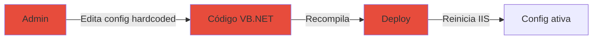

**Moderno (Modernizado):**

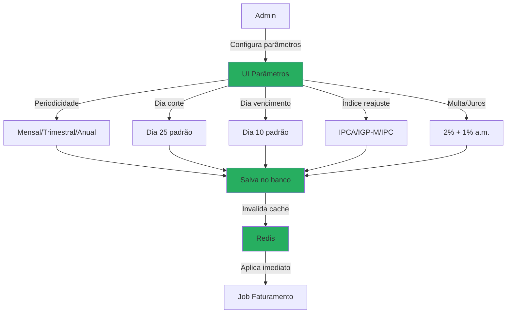

#### Descrição do Processo

Configuração centralizada de regras de faturamento: periodicidade (mensal, trimestral, anual), dia de corte para medição, dia de vencimento, índices de reajuste automático (IPCA, IGP-M, IPC), percentuais de multa e juros. Suporta configuração global e por cliente (multi-tenancy).

#### Atores

- **Administrador de Sistema:** Configura parâmetros globais
- **Gestor Financeiro:** Configura parâmetros por cliente
- **Sistema de Faturamento:** Consome parâmetros

#### Fluxo Principal

1. Admin acessa módulo "Parâmetros de Faturamento"
2. Seleciona nível de configuração:
   - Global: aplica para todos os clientes
   - Cliente específico: sobrescreve global
3. Define periodicidade:
   - Mensal: fatura todo mês
   - Trimestral: fatura a cada 3 meses
   - Anual: fatura uma vez por ano
4. Define dia de corte (padrão: 25):
   - Medição de consumo até este dia
   - Valor apurado entra na próxima fatura
5. Define dia de vencimento (padrão: 10):
   - Dia do mês para vencimento da fatura
6. Seleciona índice de reajuste:
   - IPCA: Índice de Preços ao Consumidor Amplo
   - IGP-M: Índice Geral de Preços do Mercado
   - IPC: Índice de Preços ao Consumidor
7. Define percentuais de encargos:
   - Multa: 2% (padrão)
   - Juros: 1% ao mês (padrão)
8. Sistema valida configurações
9. Salva no banco de dados
10. Invalida cache Redis
11. Jobs de faturamento passam a usar novos parâmetros

#### Automações

- ✅ Aplicação imediata via invalidação de cache
- ✅ Consulta automática de índices (IBGE API)
- ✅ Cálculo automático de reajustes
- ✅ Validação de conflitos de configuração
- ✅ Histórico de alterações (auditoria)

#### Integrações

- **IBGE API:** Consulta de índices IPCA, IGP-M, IPC
- **Redis Cache:** Hot-reload de parâmetros
- **RF026 (Faturas):** Consumo de parâmetros
- **RF090 (Medição):** Uso de dia de corte
- **RF004 (Auditoria):** Registro de alterações

#### Regras de Negócio Principais

- **RN-030-01:** Periodicidade: Mensal, Trimestral ou Anual
- **RN-030-02:** Dia de corte entre 1 e 28
- **RN-030-03:** Dia de vencimento entre 1 e 28
- **RN-030-04:** Índices de reajuste atualizados mensalmente via IBGE API
- **RN-030-05:** Multa padrão: 2% (configurável)
- **RN-030-06:** Juros padrão: 1% ao mês (configurável)
- **RN-030-07:** Configuração por cliente sobrescreve global
- **RN-030-08:** Alterações aplicadas imediatamente (sem deploy)

#### Referência ao Legado

**Como funcionava no legado:**

- ❌ Parâmetros hardcoded em código
- ❌ Deploy necessário para alterar
- ❌ Sem configuração por cliente
- ❌ Sem consulta automática de índices
- ❌ Sem histórico de alterações
- ❌ Reajustes calculados manualmente

**Melhorias no moderno:**

- ✅ Configuração via UI sem código
- ✅ Alteração imediata sem deploy
- ✅ Suporte multi-tenancy (global + cliente)
- ✅ Consulta automática de índices via API
- ✅ Histórico completo de alterações
- ✅ Reajustes automáticos

---

### 3.3 PRO-FCT-003: Plano de Contas

**Código:** PRO-FCT-003
**RFs Envolvidos:** RF031
**Área:** Contratos e Faturamento
**Criticidade:** Alta

#### Diagrama BPMN: Comparação Legado vs Moderno

**Legado (AS-IS):**

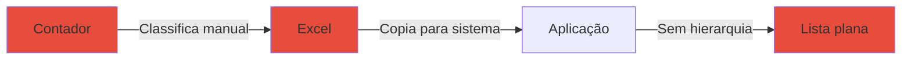

**Moderno (Modernizado):**

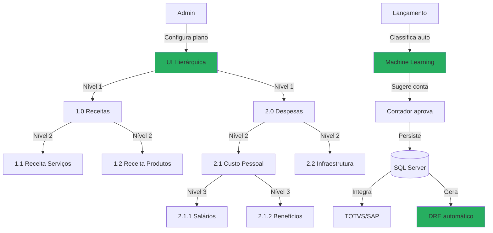

#### Descrição do Processo

Estrutura hierárquica de contas contábeis com até 5 níveis de profundidade, classificação automática de lançamentos via Machine Learning, integração bidirecional com ERPs (TOTVS, SAP, Oracle), associação com centros de custo, e geração automática de DRE (Demonstração do Resultado do Exercício).

#### Atores

- **Contador:** Configura plano de contas
- **Sistema de Classificação:** Sugere contas via ML
- **Financeiro:** Lança receitas e despesas
- **ERP Externo:** Recebe/envia lançamentos

#### Fluxo Principal

1. Contador acessa módulo "Plano de Contas"
2. Cria estrutura hierárquica:
   - **Nível 1:** 1.0 Receitas, 2.0 Despesas, 3.0 Ativos
   - **Nível 2:** 1.1 Receita Serviços, 1.2 Receita Produtos
   - **Nível 3:** 1.1.1 Consultoria, 1.1.2 Manutenção
   - **Nível 4:** Detalha por projeto/cliente
   - **Nível 5:** Refinamento máximo
3. Associa cada conta a:
   - Centro de custo
   - Natureza contábil (débito/crédito)
   - Grupo DRE
4. Sistema persiste estrutura no banco
5. **Fluxo de Lançamento:**
   - Usuário lança receita/despesa
   - Sistema analisa histórico via ML
   - Sugere conta contábil (85% de acurácia)
   - Contador aprova ou corrige
   - Sistema aprende com correção
6. Lançamento classificado é persistido
7. Sistema sincroniza com ERP externo (TOTVS/SAP)
8. Job noturno recalcula DRE

#### Automações

- ✅ Classificação automática via Machine Learning
- ✅ Sincronização bidirecional com ERP
- ✅ Geração automática de DRE
- ✅ Validação de natureza contábil (débito/crédito)
- ✅ Alertas de contas não utilizadas
- ✅ Sugestão de consolidação de contas

#### Integrações

- **TOTVS Protheus:** API REST para sincronização
- **SAP Business One:** RFC/BAPI para integração
- **Oracle ERP:** WebService SOAP
- **Azure ML:** Classificação automática de lançamentos
- **RF026 (Faturas):** Associação de fatura a conta contábil
- **RF055 (Rateio):** Distribuição por centro de custo

#### Regras de Negócio Principais

- **RN-031-01:** Hierarquia com até 5 níveis
- **RN-031-02:** Código da conta único (ex: 1.1.2.3.1)
- **RN-031-03:** Conta com lançamentos não pode ser excluída (soft delete)
- **RN-031-04:** Classificação automática aprende com correções
- **RN-031-05:** Sincronização com ERP a cada 1 hora
- **RN-031-06:** DRE recalculado diariamente às 23h
- **RN-031-07:** Centro de custo obrigatório
- **RN-031-08:** Natureza contábil validada (débito/crédito)

#### Referência ao Legado

**Como funcionava no legado:**

- ❌ Lista plana de contas (sem hierarquia)
- ❌ Classificação 100% manual
- ❌ Sem integração com ERP
- ❌ DRE gerado manualmente em Excel
- ❌ Sem centro de custo
- ❌ Sem validação de natureza contábil

**Melhorias no moderno:**

- ✅ Hierarquia de até 5 níveis
- ✅ Classificação automática via ML
- ✅ Integração bidirecional com ERP
- ✅ DRE automático diário
- ✅ Centro de custo obrigatório
- ✅ Validação automática de lançamentos

---

### 3.4 PRO-FCT-004: Notas Fiscais/Faturas (NF-e)

**Código:** PRO-FCT-004
**RFs Envolvidos:** RF032
**Área:** Contratos e Faturamento
**Criticidade:** Alta

#### Diagrama BPMN: Comparação Legado vs Moderno

**Legado (AS-IS):**

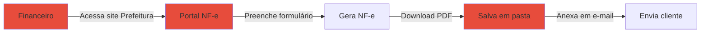

**Moderno (Modernizado):**

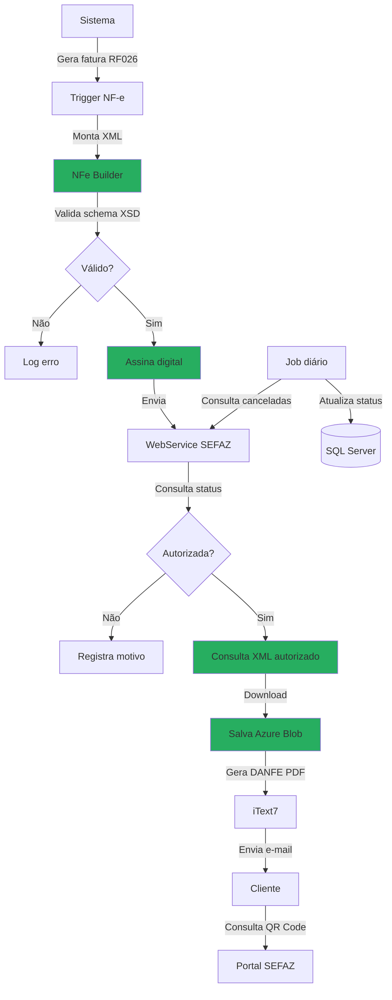

#### Descrição do Processo

Geração automática de NF-e (Nota Fiscal Eletrônica de Serviços) via WebService oficial da SEFAZ, com validação de schema XML, assinatura digital, consulta de status (autorizada/cancelada/denegada), armazenamento seguro de XMLs em Azure Blob, geração de DANFE (PDF), e envio automático ao cliente.

#### Atores

- **Sistema de Faturamento:** Dispara geração de NF-e
- **SEFAZ:** Autoriza/Cancela NF-e
- **Azure Blob Storage:** Armazena XMLs
- **Cliente:** Recebe e valida NF-e

#### Fluxo Principal

1. Sistema cria fatura (RF026)
2. Trigger dispara geração de NF-e
3. `NFe Builder` monta XML conforme layout SEFAZ:
   - Dados emitente (CNPJ, IE, endereço)
   - Dados tomador (cliente)
   - Discriminação dos serviços
   - Valores (base cálculo, alíquotas, impostos)
   - Retenções (PIS, COFINS, ISSQN)
4. Sistema valida XML contra schema XSD oficial
5. Se inválido: registra erro e PARA
6. Se válido: assina digitalmente com certificado A1
7. Envia XML assinado para WebService SEFAZ
8. SEFAZ processa e retorna protocolo
9. Sistema consulta status do protocolo:
   - **Autorizada:** NF-e emitida com sucesso
   - **Denegada:** Erro no CNPJ/IE (bloqueia)
   - **Rejeitada:** Erro no XML (corrige e reenvia)
10. Se autorizada:
    - Consulta XML autorizado (com nº e chave)
    - Salva XML em Azure Blob
    - Gera DANFE (PDF) via iText7
    - Salva PDF em Azure Blob
    - Envia e-mail ao cliente (XML + PDF)
    - Atualiza fatura com nº NF-e
11. Job diário consulta cancelamentos/inutilizações

**Fluxo de Cancelamento:**

1. Financeiro solicita cancelamento de NF-e
2. Sistema valida prazo (24h para serviços, conforme legislação)
3. Monta XML de cancelamento
4. Assina digitalmente
5. Envia para SEFAZ
6. SEFAZ cancela e retorna protocolo
7. Sistema atualiza status da NF-e

#### Automações

- ✅ Geração automática ao criar fatura
- ✅ Validação automática de schema XSD
- ✅ Assinatura digital automática
- ✅ Envio automático para SEFAZ
- ✅ Consulta automática de status
- ✅ Download automático de XML autorizado
- ✅ Geração automática de DANFE (PDF)
- ✅ Envio automático por e-mail
- ✅ Monitoramento diário de cancelamentos

#### Integrações

- **WebService SEFAZ:** Autorização, consulta, cancelamento
- **Certificado Digital A1:** Assinatura de XMLs
- **Azure Blob Storage:** Armazenamento de XMLs e PDFs
- **iText7:** Geração de DANFE em PDF
- **RF026 (Faturas):** Vinculação NF-e → Fatura
- **RF067 (Central E-mails):** Envio de NF-e ao cliente

#### Regras de Negócio Principais

- **RN-032-01:** NF-e gerada automaticamente ao criar fatura
- **RN-032-02:** XML deve ser validado contra schema XSD oficial
- **RN-032-03:** Assinatura digital obrigatória (certificado A1)
- **RN-032-04:** XMLs armazenados por 7 anos (compliance)
- **RN-032-05:** Cancelamento permitido em até 24h (serviços)
- **RN-032-06:** DANFE gerado automaticamente
- **RN-032-07:** Job diário sincroniza status com SEFAZ
- **RN-032-08:** Cliente recebe XML + PDF por e-mail

#### Referência ao Legado

**Como funcionava no legado:**

- ❌ Geração manual no portal da Prefeitura
- ❌ Preenchimento formulário web (demorado)
- ❌ Download manual de PDF
- ❌ Envio manual por e-mail
- ❌ XMLs salvos em pasta local (perda de dados)
- ❌ Sem monitoramento de cancelamentos
- ❌ Sem integração com sistema de faturamento

**Melhorias no moderno:**

- ✅ Geração automática via WebService
- ✅ Validação automática de schema
- ✅ Assinatura digital integrada
- ✅ Envio automático por e-mail
- ✅ XMLs em Azure Blob (7 anos)
- ✅ Monitoramento automático de status
- ✅ Integração nativa com faturamento

---

### 3.5 PRO-FCT-005: Conciliação de Faturas

**Código:** PRO-FCT-005
**RFs Envolvidos:** RF089
**Área:** Contratos e Faturamento
**Criticidade:** Alta

#### Diagrama BPMN: Comparação Legado vs Moderno

**Legado (AS-IS):**

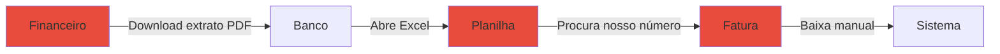

**Moderno (Modernizado):**

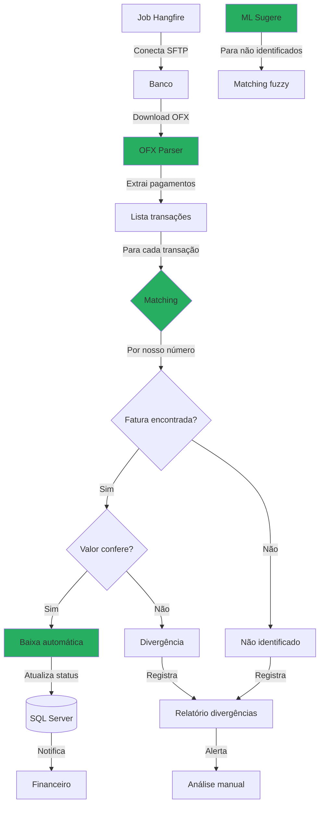

#### Descrição do Processo

Conciliação automática de faturas com pagamentos bancários via importação de arquivos OFX, matching automático por nosso número do boleto e valor, detecção de divergências (valor diferente, data divergente), relatório de pendências, e sugestão de matching via Machine Learning para pagamentos não identificados.

#### Atores

- **Sistema de Conciliação:** Processa OFX automaticamente
- **Banco:** Fornece extratos OFX via SFTP
- **Financeiro:** Analisa divergências
- **Machine Learning:** Sugere matchings fuzzy

#### Fluxo Principal

1. Job Hangfire executa diariamente às 8h
2. Conecta via SFTP no servidor do banco
3. Lista arquivos OFX novos (não processados)
4. Faz download dos arquivos
5. `OFX Parser` extrai transações:
   - Data
   - Valor
   - Nosso número (identificador do boleto)
   - Tipo (crédito/débito)
6. Para cada transação de crédito:
   - **Busca fatura por nosso número**
   - Se encontrada:
     - Compara valor transação vs valor fatura
     - Se iguais: baixa automática (status: Paga)
     - Se diferentes: registra divergência
   - Se não encontrada:
     - Tenta matching fuzzy via ML:
       - Valor aproximado (±5%)
       - Data próxima (±3 dias)
       - Cliente identificado no histórico
     - Se ML sugere match (>80% confiança): apresenta para aprovação
     - Se ML não sugere: marca como "Não Identificado"
7. Atualiza status das faturas baixadas
8. Gera relatório de conciliação:
   - Total baixado: R$ 150.000
   - Total divergências: R$ 5.000
   - Total não identificado: R$ 2.000
9. Envia relatório por e-mail ao financeiro
10. Notifica divergências para análise manual

**Fluxo de Análise Manual:**

1. Financeiro acessa "Pendências de Conciliação"
2. Visualiza lista de divergências:
   - Valor diferente (pagamento parcial ou com desconto)
   - Nosso número não encontrado
3. Para cada pendência:
   - Visualiza sugestões do ML
   - Busca fatura manualmente
   - Confirma matching
   - Sistema baixa fatura

#### Automações

- ✅ Download automático de OFX via SFTP
- ✅ Parsing automático de transações
- ✅ Matching automático por nosso número
- ✅ Baixa automática de faturas
- ✅ Detecção automática de divergências
- ✅ Matching fuzzy via Machine Learning
- ✅ Geração automática de relatório
- ✅ Notificação de divergências

#### Integrações

- **Banco (SFTP):** Download de arquivos OFX
- **OFX Parser:** Extração de transações
- **RF026 (Faturas):** Baixa de faturas
- **Azure ML:** Matching fuzzy de pagamentos
- **RF066 (Notificações):** Alertas de divergências
- **RF004 (Auditoria):** Registro de conciliações

#### Regras de Negócio Principais

- **RN-089-01:** Conciliação automática por nosso número + valor
- **RN-089-02:** Divergência de valor >1% registra pendência
- **RN-089-03:** Pagamentos não identificados aguardam análise manual
- **RN-089-04:** ML sugere matchings com confiança >80%
- **RN-089-05:** Job diário executa às 8h
- **RN-089-06:** Relatório enviado ao financeiro às 9h
- **RN-089-07:** Arquivos OFX mantidos por 7 anos
- **RN-089-08:** Baixa manual requer justificativa

#### Referência ao Legado

**Como funcionava no legado:**

- ❌ Download manual de extrato PDF
- ❌ Busca manual de fatura em Excel
- ❌ Baixa manual no sistema (demorada)
- ❌ Sem detecção de divergências
- ❌ Sem relatório de pendências
- ❌ Erros frequentes (baixa errada)

**Melhorias no moderno:**

- ✅ Download automático de OFX
- ✅ Matching automático por nosso número
- ✅ Baixa automática de faturas
- ✅ Detecção automática de divergências
- ✅ Relatório diário de pendências
- ✅ ML sugere matchings não óbvios
- ✅ Auditoria completa de conciliações

---

### 3.6 PRO-FCT-006: Medição/Faturamento de Contratos

**Código:** PRO-FCT-006
**RFs Envolvidos:** RF090
**Área:** Contratos e Faturamento
**Criticidade:** Alta

#### Diagrama BPMN: Comparação Legado vs Moderno

**Legado (AS-IS):**

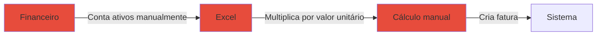

**Moderno (Modernizado):**

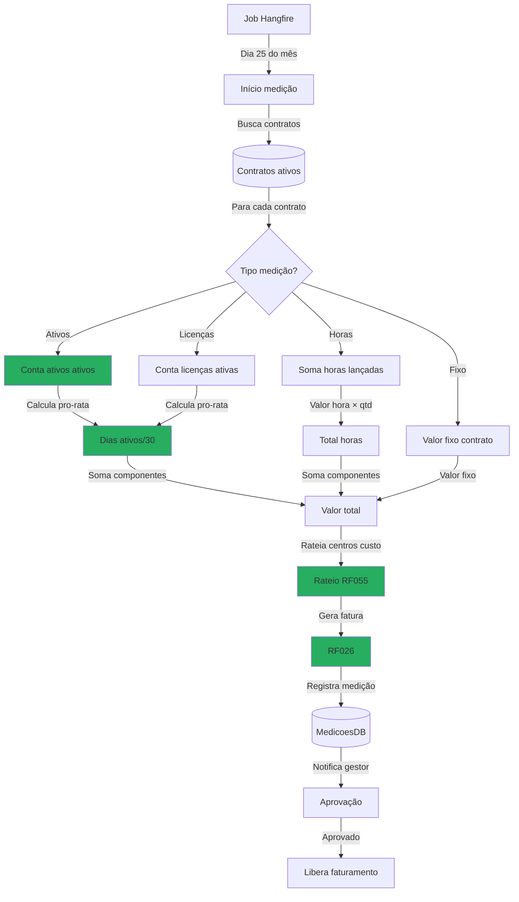

#### Descrição do Processo

Medição periódica de consumo (ativos, licenças, horas) para faturamento de contratos, com cálculo pro-rata para ativações/desativações durante o mês, rateio proporcional entre centros de custo, geração automática de faturas baseada na medição, e workflow de aprovação antes do faturamento.

#### Atores

- **Sistema de Medição:** Executa medição automática
- **Gestor de Contrato:** Aprova medições
- **Financeiro:** Monitora faturamento
- **Sistema de Rateio (RF055):** Distribui custos

#### Fluxo Principal

1. Job Hangfire executa no dia 25 de cada mês
2. Busca contratos ativos com tipo "Medição"
3. Para cada contrato identifica tipo de medição:

**Tipo 1: Medição por Ativos**
- Consulta ativos ativos vinculados ao contrato
- Para cada ativo calcula dias ativos no mês
- Exemplo: Ativo ativado dia 15 → 15 dias ativos
- Calcula pro-rata: (15/30) × valor unitário
- Soma valores pro-rata de todos os ativos

**Tipo 2: Medição por Licenças**
- Consulta licenças ativas
- Calcula pro-rata por data de ativação
- Exemplo: Licença ativada dia 10 → (20/30) × valor
- Soma valores pro-rata

**Tipo 3: Medição por Horas**
- Consulta horas lançadas no período
- Multiplica por valor/hora contratado
- Exemplo: 120 horas × R$ 150/hora = R$ 18.000
- Soma valores

**Tipo 4: Valor Fixo**
- Não há medição (valor fixo mensal)
- Usa valor do contrato

4. Sistema calcula valor total da medição
5. Rateia entre centros de custo (RF055):
   - Proporcional por departamento
   - Por área (m²)
   - Por headcount
6. Cria registro de medição (status: Pendente Aprovação)
7. Notifica gestor do contrato via RF066
8. Gestor acessa painel "Minhas Medições"
9. Visualiza detalhamento:
   - Total medido: R$ 45.000
   - Breakdown por item
   - Comparativo com mês anterior
10. **Gestor aprova:**
    - Sistema marca medição como Aprovada
    - Dispara geração de fatura (RF026)
    - Fatura vinculada à medição
11. **Gestor rejeita:**
    - Sistema marca como Rejeitada
    - Notifica financeiro para análise

#### Automações

- ✅ Medição automática no dia 25
- ✅ Cálculo automático pro-rata
- ✅ Rateio automático por centro de custo
- ✅ Geração automática de fatura pós-aprovação
- ✅ Notificação automática ao gestor
- ✅ Comparativo automático mês anterior
- ✅ Detecção de variações >20% (alerta)

#### Integrações

- **RF026 (Faturas):** Geração de fatura baseada em medição
- **RF055 (Rateio):** Distribuição por centro de custo
- **RF025 (Ativos):** Consulta ativos ativos
- **RF066 (Notificações):** Alertas de aprovação
- **RF088 (Workflows):** Fluxo de aprovação

#### Regras de Negócio Principais

- **RN-090-01:** Medição executada automaticamente dia 25
- **RN-090-02:** Cálculo pro-rata por dia (ativação/desativação)
- **RN-090-03:** Aprovação obrigatória antes de faturar
- **RN-090-04:** Variação >20% gera alerta ao gestor
- **RN-090-05:** Rateio proporcional por centro de custo
- **RN-090-06:** Fatura vinculada à medição (rastreabilidade)
- **RN-090-07:** Histórico de medições mantido por 7 anos
- **RN-090-08:** Medição rejeitada não gera fatura

#### Referência ao Legado

**Como funcionava no legado:**

- ❌ Contagem manual de ativos
- ❌ Cálculo manual em Excel
- ❌ Sem pro-rata (valor cheio ou zero)
- ❌ Sem rateio por centro de custo
- ❌ Sem workflow de aprovação
- ❌ Erros frequentes de cálculo

**Melhorias no moderno:**

- ✅ Medição automática dia 25
- ✅ Cálculo automático pro-rata
- ✅ Rateio automático multi-dimensional
- ✅ Workflow de aprovação integrado
- ✅ Detecção de variações anormais
- ✅ Rastreabilidade fatura → medição

---

### 3.7 PRO-FCT-007: Auditoria de Faturas

**Código:** PRO-FCT-007
**RFs Envolvidos:** RF097
**Área:** Contratos e Faturamento
**Criticidade:** Alta

#### Diagrama BPMN: Comparação Legado vs Moderno

**Legado (AS-IS):**

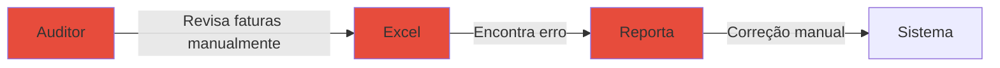

**Moderno (Modernizado):**

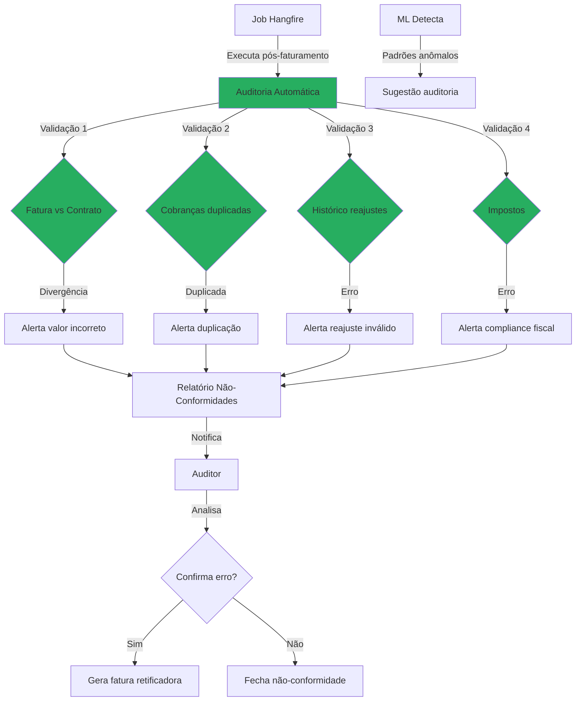

#### Descrição do Processo

Auditoria preventiva automática de faturas com validação cruzada fatura vs contrato, detecção de cobranças duplicadas, auditoria de valores (histórico de reajustes), compliance fiscal (validação de impostos PIS/COFINS/ISSQN), e relatório de não-conformidades com Machine Learning detectando padrões anômalos.

#### Atores

- **Sistema de Auditoria:** Executa validações automáticas
- **Auditor:** Analisa não-conformidades
- **Financeiro:** Corrige erros detectados
- **Machine Learning:** Detecta anomalias

#### Fluxo Principal

1. Job Hangfire executa logo após geração de faturas
2. Para cada fatura gerada, executa 4 validações:

**Validação 1: Fatura vs Contrato**
- Compara valor fatura vs valor contrato
- Verifica se reajustes foram aplicados corretamente
- Valida periodicidade (mensal, trimestral, anual)
- Se divergência: registra não-conformidade

**Validação 2: Cobranças Duplicadas**
- Busca faturas do mesmo cliente no mesmo período
- Verifica se há duplicação de itens
- Exemplo: Mesmo ativo cobrado 2x
- Se duplicado: registra não-conformidade

**Validação 3: Histórico de Reajustes**
- Consulta histórico de reajustes do contrato
- Valida se índice aplicado está correto (IPCA, IGP-M)
- Verifica se percentual aplicado confere com índice oficial
- Se erro: registra não-conformidade

**Validação 4: Compliance Fiscal**
- Valida cálculo de impostos:
  - PIS: 0,65% ou 1,65% (regime)
  - COFINS: 3% ou 7,6% (regime)
  - ISSQN: conforme município (2% a 5%)
- Verifica se retenções estão corretas
- Se erro: registra não-conformidade

3. Sistema agrega não-conformidades
4. Gera relatório:
   - Total faturas auditadas: 150
   - Não-conformidades: 8 (5,3%)
   - Breakdown por tipo
5. ML analisa padrões:
   - Identifica erros recorrentes
   - Sugere revisão de regras
6. Notifica auditor via RF066
7. Auditor acessa painel "Não-Conformidades"
8. Para cada não-conformidade:
   - Visualiza detalhes
   - Compara fatura vs contrato
   - **Se confirma erro:**
     - Cancela fatura original
     - Gera fatura retificadora
     - Notifica cliente
   - **Se é falso positivo:**
     - Fecha não-conformidade
     - ML aprende com correção

#### Automações

- ✅ Auditoria automática pós-faturamento
- ✅ Validação cruzada fatura vs contrato
- ✅ Detecção automática de duplicações
- ✅ Validação automática de reajustes
- ✅ Validação automática de impostos
- ✅ ML detecta padrões anômalos
- ✅ Geração automática de relatório
- ✅ Notificação de não-conformidades

#### Integrações

- **RF026 (Faturas):** Validação de faturas geradas
- **RF030 (Parâmetros):** Consulta índices de reajuste
- **IBGE API:** Valida índices IPCA/IGP-M
- **Azure ML:** Detecção de anomalias
- **RF066 (Notificações):** Alertas ao auditor
- **RF004 (Auditoria):** Registro de não-conformidades

#### Regras de Negócio Principais

- **RN-097-01:** Auditoria executada automaticamente pós-faturamento
- **RN-097-02:** 4 validações obrigatórias (contrato, duplicação, reajuste, impostos)
- **RN-097-03:** Não-conformidades notificadas em até 1 hora
- **RN-097-04:** ML aprende com falsos positivos
- **RN-097-05:** Fatura com erro gera retificadora
- **RN-097-06:** Relatório mensal consolidado
- **RN-097-07:** Histórico de auditorias mantido por 7 anos
- **RN-097-08:** Taxa de não-conformidade >5% gera alerta crítico

#### Referência ao Legado

**Como funcionava no legado:**

- ❌ Auditoria manual e reativa
- ❌ Erros descobertos pelo cliente (reclamação)
- ❌ Sem validação de reajustes
- ❌ Sem detecção de duplicações
- ❌ Compliance fiscal manual
- ❌ Sem histórico de auditoria

**Melhorias no moderno:**

- ✅ Auditoria automática e preventiva
- ✅ Erros detectados antes do cliente
- ✅ Validação automática de reajustes
- ✅ Detecção automática de duplicações
- ✅ Compliance fiscal automático
- ✅ Histórico completo de auditorias
- ✅ ML detecta padrões anômalos

---

## PARTE 2: ATIVOS E CUSTOS

### 3.8 PRO-FAC-001: Gestão de Ativos

**Código:** PRO-FAC-001
**RFs Envolvidos:** RF025
**Área:** Ativos e Custos
**Criticidade:** Alta

#### Diagrama BPMN: Comparação Legado vs Moderno

**Legado (AS-IS):**

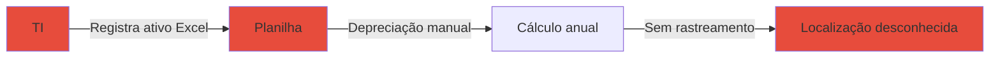

**Moderno (Modernizado):**

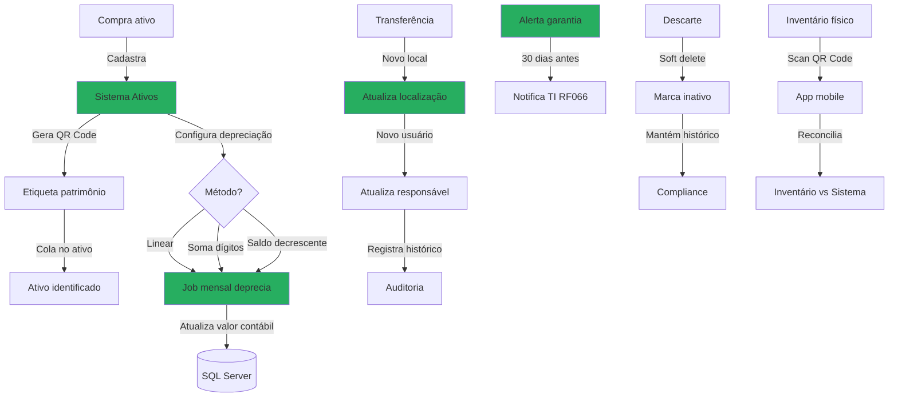

#### Descrição do Processo

Ciclo de vida completo de ativos (aquisição → utilização → descarte) com depreciação automática (linear, soma de dígitos, saldo decrescente), inventário físico vs lógico via QR Code, transferência entre locais/usuários com histórico, e alertas de fim de garantia.

#### Atores

- **TI:** Gerencia ativos
- **Financeiro:** Monitora depreciação
- **Usuário:** Utiliza ativos
- **Sistema de Inventário:** Reconcilia físico vs lógico

#### Fluxo Principal

**Fase 1: Aquisição**
1. TI cadastra novo ativo:
   - Tipo (desktop, notebook, servidor, licença)
   - Fabricante, modelo, número série
   - Valor de aquisição
   - Data de compra
   - Fornecedor
   - Garantia (meses)
2. Sistema gera QR Code único
3. TI imprime etiqueta de patrimônio
4. Cola etiqueta no ativo físico
5. Sistema configura depreciação:
   - Método: Linear, Soma de Dígitos, Saldo Decrescente
   - Vida útil: 5 anos (padrão computadores)
   - Valor residual: 10% (opcional)
6. Job Hangfire inicia depreciação mensal

**Fase 2: Utilização**
1. TI aloca ativo para usuário/departamento
2. Sistema registra:
   - Local físico (sala, andar, prédio)
   - Usuário responsável
   - Data de alocação
3. Job mensal calcula depreciação:
   - **Linear:** Valor / Vida útil / 12 meses
   - **Soma de Dígitos:** (N - período) / Soma × Valor
   - **Saldo Decrescente:** Saldo × Taxa × (1/12)
4. Atualiza valor contábil do ativo
5. Sistema monitora fim de garantia:
   - 30 dias antes: alerta TI (RF066)
   - No vencimento: marca garantia expirada

**Fase 3: Transferência**
1. TI solicita transferência de ativo
2. Sistema registra:
   - Novo local
   - Novo usuário responsável
   - Data da transferência
   - Justificativa
3. Atualiza localização
4. Notifica novo responsável
5. Registra no histórico (audit trail)

**Fase 4: Descarte**
1. TI marca ativo para descarte
2. Sistema valida:
   - Totalmente depreciado? (valor contábil zero)
   - Motivo: Obsoleto, Quebrado, Roubado
3. Faz soft delete:
   - Marca campo `Ativo = false`
   - Mantém registro no banco
   - Preserva histórico completo
4. Registra na auditoria

**Inventário Físico:**
1. TI acessa app mobile
2. Escaneia QR Code dos ativos
3. App registra:
   - Ativo escaneado
   - Localização GPS
   - Timestamp
4. Sistema reconcilia:
   - Compara inventário físico vs lógico
   - Identifica divergências:
     - Ativos não encontrados
     - Ativos em local errado
     - Ativos não cadastrados
5. Gera relatório de divergências

#### Automações

- ✅ Depreciação automática mensal (3 métodos)
- ✅ Geração automática de QR Code
- ✅ Alertas automáticos de fim de garantia
- ✅ Cálculo automático de valor contábil
- ✅ Inventário via app mobile (QR Code)
- ✅ Reconciliação automática físico vs lógico
- ✅ Soft delete preserva histórico

#### Integrações

- **RF037 (TCO):** Cálculo de custo total por ativo
- **RF055 (Rateio):** Alocação de custos por departamento
- **RF066 (Notificações):** Alertas de garantia
- **RF004 (Auditoria):** Histórico de movimentações
- **App Mobile:** Inventário físico via QR Code

#### Regras de Negócio Principais

- **RN-025-01:** Depreciação automática mensal (3 métodos)
- **RN-025-02:** Vida útil padrão: 5 anos (computadores)
- **RN-025-03:** Valor residual padrão: 10%
- **RN-025-04:** QR Code único por ativo
- **RN-025-05:** Alerta de garantia 30 dias antes do vencimento
- **RN-025-06:** Soft delete obrigatório (mantém histórico)
- **RN-025-07:** Inventário físico semestral obrigatório
- **RN-025-08:** Transferência requer justificativa

#### Referência ao Legado

**Como funcionava no legado:**

- ❌ Registro em planilha Excel
- ❌ Depreciação calculada manualmente 1x/ano
- ❌ Sem rastreamento de localização
- ❌ Sem alertas de garantia
- ❌ Inventário físico manual (demorado)
- ❌ Hard delete (perdia histórico)

**Melhorias no moderno:**

- ✅ Sistema integrado com audit trail
- ✅ Depreciação automática mensal (3 métodos)
- ✅ Rastreamento completo de localização
- ✅ Alertas proativos de garantia
- ✅ Inventário físico via QR Code (rápido)
- ✅ Soft delete preserva histórico
- ✅ TCO calculado automaticamente

---

### 3.9 PRO-FAC-002: Custos Fixos

**Código:** PRO-FAC-002
**RFs Envolvidos:** RF036
**Área:** Ativos e Custos
**Criticidade:** Média

#### Diagrama BPMN: Comparação Legado vs Moderno

**Legado (AS-IS):**

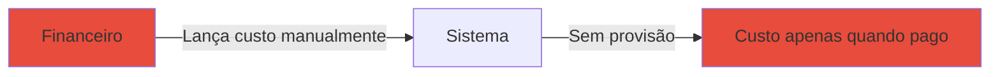

**Moderno (Modernizado):**

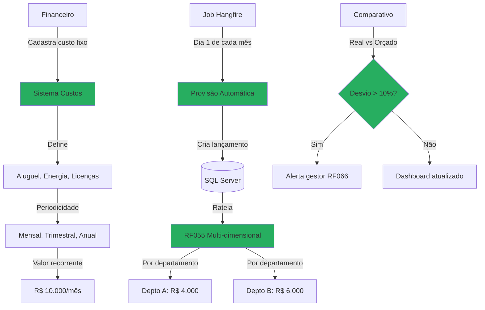

#### Descrição do Processo

Cadastro de custos recorrentes (aluguel, energia, licenças SaaS, internet), provisão automática mensal via job Hangfire, rateio proporcional por centro de custo/departamento, comparativo real vs orçado com alertas de desvio, e dashboard gerencial.

#### Atores

- **Financeiro:** Cadastra custos fixos
- **Sistema de Provisão:** Executa provisões mensais
- **Gestor:** Monitora desvios orçamentários
- **Sistema de Rateio (RF055):** Distribui custos

#### Fluxo Principal

1. Financeiro acessa módulo "Custos Fixos"
2. Cadastra novo custo recorrente:
   - Tipo: Aluguel, Energia, Licença SaaS, Internet, etc.
   - Descrição: "Aluguel Escritório São Paulo"
   - Valor mensal: R$ 10.000
   - Periodicidade: Mensal, Trimestral, Anual
   - Início vigência: 01/2026
   - Fim vigência: (opcional, se contrato temporário)
   - Fornecedor: Imobiliária XYZ
   - Centro de custo: Administrativo
   - Conta contábil: 2.1.5 Aluguéis
3. Define regra de rateio:
   - Departamento A: 40% (R$ 4.000)
   - Departamento B: 60% (R$ 6.000)
4. Define orçamento mensal:
   - Orçado: R$ 10.000
   - Alerta se desvio > 10%
5. Sistema salva configuração
6. Job Hangfire executa no dia 1 de cada mês:
   - Busca custos fixos ativos
   - Para cada custo:
     - Cria lançamento contábil (provisão)
     - Rateia conforme regra configurada
     - Atualiza dashboard
7. Financeiro lança custo real ao pagar:
   - Custo real: R$ 10.500 (aluguel + IPTU)
8. Sistema compara real vs orçado:
   - Desvio: R$ 500 (5%)
   - Se desvio > 10%: alerta gestor via RF066
9. Dashboard atualizado em tempo real:
   - Custo previsto (orçado): R$ 10.000
   - Custo realizado: R$ 10.500
   - Desvio: +5%

**Fluxo de Reajuste:**
1. Sistema monitora vencimento de reajuste anual
2. Notifica financeiro 30 dias antes
3. Financeiro atualiza valor do custo fixo
4. Sistema aplica novo valor a partir da data

#### Automações

- ✅ Provisão automática mensal
- ✅ Rateio automático por centro de custo
- ✅ Comparativo automático real vs orçado
- ✅ Alertas automáticos de desvio >10%
- ✅ Dashboard em tempo real
- ✅ Notificação de reajustes vencidos

#### Integrações

- **RF055 (Rateio):** Distribuição multi-dimensional
- **RF031 (Plano de Contas):** Classificação contábil
- **RF066 (Notificações):** Alertas de desvios
- **RF004 (Auditoria):** Histórico de alterações
- **Hangfire:** Jobs de provisão mensal

#### Regras de Negócio Principais

- **RN-036-01:** Provisão automática no dia 1 de cada mês
- **RN-036-02:** Rateio obrigatório por centro de custo
- **RN-036-03:** Comparativo real vs orçado atualizado diariamente
- **RN-036-04:** Desvio >10% gera alerta automático
- **RN-036-05:** Periodicidade: Mensal, Trimestral ou Anual
- **RN-036-06:** Custo fixo inativo não gera provisão
- **RN-036-07:** Histórico de custos mantido por 7 anos
- **RN-036-08:** Reajuste notificado 30 dias antes

#### Referência ao Legado

**Como funcionava no legado:**

- ❌ Lançamento manual mensal (esquecimentos)
- ❌ Sem provisão automática
- ❌ Sem rateio (custo único)
- ❌ Sem comparativo orçado vs real
- ❌ Sem alertas de desvios
- ❌ Dashboard manual em Excel

**Melhorias no moderno:**

- ✅ Provisão automática mensal
- ✅ Rateio automático multi-dimensional
- ✅ Comparativo automático orçado vs real
- ✅ Alertas proativos de desvios
- ✅ Dashboard em tempo real
- ✅ Notificações de reajustes

---

### 3.10 PRO-FAC-003: Custos por Ativo (TCO)

**Código:** PRO-FAC-003
**RFs Envolvidos:** RF037
**Área:** Ativos e Custos
**Criticidade:** Alta

#### Diagrama BPMN: Comparação Legado vs Moderno

**Legado (AS-IS):**


**Moderno (Modernizado):**

```mermaid
graph TB
    A[Sistema TCO] -->|Cálculo automático| B[Job diário]
    B -->|Para cada ativo| C[Coleta custos]

    C -->|Custo 1| D[Aquisição]
    C -->|Custo 2| E[Manutenção]
    C -->|Custo 3| F[Suporte]
    C -->|Custo 4| G[Energia]
    C -->|Custo 5| H[Licenças]

    D --> I[Soma TCO]
    E --> I
    F --> I
    G --> I
    H --> I

    I -->|Aloca indiretos| J[Overhead 15%]
    J -->|TCO Total| K[Valor por ativo]

    K -->|Compara| L{TCO vs Contrato Serviço}
    L -->|TCO < Contrato| M[Decisão: Manter ativo]
    L -->|TCO > Contrato| N[Decisão: Terceirizar]

    O[Relatório] -->|Ranking ativos| P[Mais caros]
    O -->|ROI| Q[Rentabilidade]

    style B fill:#27AE60
    style I fill:#27AE60
    style K fill:#27AE60
    style L fill:#27AE60
```

#### Descrição do Processo

Cálculo automático de TCO (Total Cost of Ownership) por ativo somando custos diretos (aquisição, manutenção, suporte, energia) e indiretos (overhead administrativo), alocação proporcional de custos compartilhados, comparativo TCO vs Contrato de Serviço (decisão Buy vs Lease), e relatório de rentabilidade por ativo.

#### Atores

- **Sistema TCO:** Calcula custos automaticamente
- **Gestor de TI:** Analisa TCO para decisões
- **Financeiro:** Valida custos
- **Job Diário:** Atualiza TCO

#### Fluxo Principal

1. Job Hangfire executa diariamente às 23h
2. Para cada ativo ativo, coleta custos:

**Custo 1: Aquisição**
- Valor de compra do ativo
- Divide pela vida útil (5 anos)
- Custo mensal: Valor / 60 meses

**Custo 2: Manutenção**
- Soma chamados de manutenção:
  - Peças trocadas
  - Horas técnico × valor/hora
- Custo médio mensal

**Custo 3: Suporte**
- Se ativo tem contrato de suporte:
  - Valor mensal do contrato
- Se não:
  - Horas suporte interno × valor/hora

**Custo 4: Energia**
- Consumo médio do equipamento (TDP)
- Exemplo: Desktop 300W
- Horas uso por dia × dias/mês × kWh × tarifa
- Custo energia mensal

**Custo 5: Licenças**
- Licenças vinculadas ao ativo:
  - Windows: R$ 20/mês
  - Office 365: R$ 30/mês
  - Antivírus: R$ 10/mês
- Soma licenças

3. Sistema soma custos diretos:
   - TCO Direto = Aquisição + Manutenção + Suporte + Energia + Licenças
4. Aloca custos indiretos (overhead):
   - Administrativo: 10%
   - Infraestrutura: 5%
   - TCO Indireto = TCO Direto × 15%
5. Calcula TCO Total:
   - TCO Total = TCO Direto + TCO Indireto
6. Atualiza registro do ativo com TCO
7. **Análise Buy vs Lease:**
   - Compara TCO Total vs Contrato de Serviço equivalente
   - Exemplo:
     - TCO Desktop: R$ 250/mês
     - Contrato DaaS (Desktop as a Service): R$ 200/mês
     - Decisão: Terceirizar (economiza R$ 50/mês)
8. Gera relatório gerencial:
   - Ranking ativos mais caros
   - TCO médio por tipo
   - ROI por ativo
   - Sugestões de terceirização

#### Automações

- ✅ Cálculo automático diário de TCO
- ✅ Coleta automática de custos diretos
- ✅ Alocação automática de custos indiretos
- ✅ Comparativo automático TCO vs Contrato
- ✅ Ranking automático de ativos mais caros
- ✅ Sugestões automáticas de terceirização
- ✅ Relatório gerencial mensal

#### Integrações

- **RF025 (Ativos):** Dados de ativos e manutenções
- **RF036 (Custos Fixos):** Custos de energia e infraestrutura
- **RF055 (Rateio):** Alocação de custos indiretos
- **RF004 (Auditoria):** Histórico de TCO
- **Hangfire:** Job diário de cálculo

#### Regras de Negócio Principais

- **RN-037-01:** TCO calculado diariamente para todos os ativos ativos
- **RN-037-02:** TCO = Custos Diretos + Custos Indiretos (15%)
- **RN-037-03:** Custos diretos: Aquisição, Manutenção, Suporte, Energia, Licenças
- **RN-037-04:** Custos indiretos: Administrativo (10%) + Infraestrutura (5%)
- **RN-037-05:** Comparação automática TCO vs Contrato de Serviço
- **RN-037-06:** Relatório gerencial gerado mensalmente
- **RN-037-07:** Sugestão de terceirização se TCO > Contrato + 20%
- **RN-037-08:** Histórico de TCO mantido por 5 anos

#### Referência ao Legado

**Como funcionava no legado:**

- ❌ TCO não calculado
- ❌ Decisões sem base de custo real
- ❌ Custos ocultos desconhecidos
- ❌ Sem comparativo Buy vs Lease
- ❌ Sem relatório de rentabilidade

**Melhorias no moderno:**

- ✅ TCO calculado automaticamente
- ✅ Decisões baseadas em dados reais
- ✅ Todos os custos rastreados
- ✅ Comparativo automático Buy vs Lease
- ✅ Relatório de rentabilidade por ativo
- ✅ Sugestões de terceirização

---

### 3.11 PRO-FAC-004: Notas Fiscais de Estoque

**Código:** PRO-FAC-004
**RFs Envolvidos:** RF042
**Área:** Ativos e Custos
**Criticidade:** Média

#### Diagrama BPMN: Comparação Legado vs Moderno

**Legado (AS-IS):**

```mermaid
graph LR
    A[Estoque] -->|Recebe NF em papel| B[Digita manualmente]
    B -->|Atualiza estoque| C[Sistema]
    C -->|Sem validação XML| D[Erros de digitação]

    style A fill:#E74C3C
    style B fill:#E74C3C
    style D fill:#E74C3C
```

**Moderno (Modernizado):**

```mermaid
graph TB
    A[Fornecedor] -->|Envia XML NF-e| B[E-mail monitored]
    B -->|Parse XML| C[NF-e Parser]
    C -->|Valida DANFE| D{XML vs PDF}
    D -->|Divergência| E[Alerta compras]
    D -->|OK| F[Extrai dados]

    F -->|CFOP| G[Valida operação]
    F -->|Impostos| H[ICMS, IPI, PIS, COFINS]
    F -->|Itens| I[Produtos/Serviços]

    I -->|Para cada item| J{Existe no cadastro?}
    J -->|Não| K[Cadastra automático]
    J -->|Sim| L[Atualiza estoque]

    L -->|Quantidade| M[Entrada estoque]
    L -->|Valor| N[Contabilização]
    N -->|Lança| O[Plano Contas RF031]

    H -->|Registra| P[Impostos a recuperar]
    P -->|Crédito| Q[Apuração fiscal]

    style C fill:#27AE60
    style F fill:#27AE60
    style K fill:#27AE60
    style M fill:#27AE60
```

#### Descrição do Processo

Entrada automatizada de NF de compra via parse de XML, validação DANFE (XML vs PDF), atualização automática de estoque, contabilização automática, e controle de impostos (ICMS, IPI, PIS, COFINS) com crédito fiscal.

#### Atores

- **Sistema de NF-e:** Monitora e-mail e processa XMLs
- **Compras:** Valida divergências
- **Estoque:** Recebe itens
- **Contabilidade:** Valida impostos

#### Fluxo Principal

1. Sistema monitora caixa de e-mail `nfe@empresa.com`
2. Detecta e-mail com anexo XML de NF-e
3. Faz download do XML e PDF (DANFE)
4. `NF-e Parser` extrai dados do XML:
   - Emitente (CNPJ, IE, razão social)
   - Destinatário (validar se é nossa empresa)
   - Número NF-e, série, data emissão
   - Valor total
   - Itens (produtos/serviços)
   - Impostos (ICMS, IPI, PIS, COFINS)
   - CFOP (código fiscal)
5. Valida XML vs DANFE (PDF):
   - Compara valores totais
   - Compara impostos
   - Se divergência: alerta compras
6. Valida operação (CFOP):
   - 5.102: Venda de mercadoria
   - 1.101: Compra para industrialização
   - Valida se operação é válida
7. Para cada item da NF-e:
   - Busca produto no cadastro por código/descrição
   - **Se não existe:**
     - Cadastra automaticamente
     - Sugere categoria via ML
     - Aguarda aprovação de compras
   - **Se existe:**
     - Atualiza estoque (entrada)
     - Registra movimentação
8. Contabilização automática:
   - Lança no Plano de Contas (RF031)
   - Débito: Estoque (Ativo)
   - Crédito: Fornecedor (Passivo)
9. Registra impostos:
   - ICMS a recuperar
   - IPI a recuperar
   - PIS/COFINS a recuperar
10. Atualiza apuração fiscal mensal
11. Vincula NF-e ao pedido de compra (se houver)

**Fluxo de Validação Manual:**
1. Se XML vs PDF divergem
2. Compras acessa "Validações Pendentes"
3. Visualiza divergência:
   - XML: R$ 10.000
   - PDF: R$ 10.500
4. Contata fornecedor para correção
5. Bloqueia entrada no estoque até resolver

#### Automações

- ✅ Monitoramento automático de e-mail
- ✅ Parse automático de XML
- ✅ Validação automática XML vs DANFE
- ✅ Cadastro automático de produtos novos
- ✅ Atualização automática de estoque
- ✅ Contabilização automática
- ✅ Registro automático de impostos
- ✅ Apuração fiscal automática

#### Integrações

- **E-mail (IMAP):** Monitoramento de NF-e
- **NF-e Parser:** Extração de dados de XML
- **RF031 (Plano de Contas):** Contabilização
- **Azure ML:** Sugestão de categoria de produto
- **RF004 (Auditoria):** Histórico de entradas

#### Regras de Negócio Principais

- **RN-042-01:** Monitoramento automático de e-mail de NF-e
- **RN-042-02:** Validação obrigatória XML vs DANFE
- **RN-042-03:** Divergência XML vs PDF bloqueia entrada
- **RN-042-04:** Produtos novos cadastrados automaticamente (pendente aprovação)
- **RN-042-05:** Estoque atualizado automaticamente
- **RN-042-06:** Contabilização automática no Plano de Contas
- **RN-042-07:** Impostos a recuperar registrados automaticamente
- **RN-042-08:** XMLs armazenados por 7 anos

#### Referência ao Legado

**Como funcionava no legado:**

- ❌ Digitação manual de NF em papel
- ❌ Erros frequentes de digitação
- ❌ Sem validação XML vs PDF
- ❌ Atualização manual de estoque
- ❌ Contabilização manual (demorada)
- ❌ Sem controle de impostos a recuperar

**Melhorias no moderno:**

- ✅ Parse automático de XML
- ✅ Zero digitação (automático)
- ✅ Validação automática XML vs DANFE
- ✅ Atualização automática de estoque
- ✅ Contabilização automática
- ✅ Controle automático de créditos fiscais

---

### 3.12 PRO-FAC-005: Rateio Multi-dimensional

**Código:** PRO-FAC-005
**RFs Envolvidos:** RF055
**Área:** Ativos e Custos
**Criticidade:** Alta

#### Diagrama BPMN: Comparação Legado vs Moderno

**Legado (AS-IS):**

```mermaid
graph LR
    A[Contador] -->|Planilha Excel| B[Rateio manual]
    B -->|2-3 dias trabalho| C[Distribuição custos]
    C -->|Copia para sistema| D[Lançamentos]

    style A fill:#E74C3C
    style B fill:#E74C3C
    style C fill:#E74C3C
```

**Moderno (Modernizado):**

```mermaid
graph TB
    A[Custo compartilhado] -->|Aluguel R$ 50k| B[Motor Rateio]
    B -->|Dimensão 1| C{Empresa}
    C -->|Empresa A| D[40% = R$ 20k]
    C -->|Empresa B| E[60% = R$ 30k]

    B -->|Dimensão 2| F{Departamento}
    F -->|TI| G[30% = R$ 15k]
    F -->|Financeiro| H[20% = R$ 10k]
    F -->|Comercial| I[50% = R$ 25k]

    B -->|Dimensão 3| J{Projeto}
    J -->|Projeto X| K[45% = R$ 22.5k]
    J -->|Projeto Y| L[55% = R$ 27.5k]

    B -->|Dimensão 4| M{Centro Custo}
    M -->|CC 100| N[25% = R$ 12.5k]
    M -->|CC 200| O[75% = R$ 37.5k]

    P[Regras Rateio] -->|Driver| Q{Tipo Driver}
    Q -->|Percentual fixo| R[40% / 60%]
    Q -->|Headcount| S[Por nº funcionários]
    Q -->|Área m²| T[Por metragem]
    Q -->|Consumo| U[Por uso real]

    R --> V[Cálculo tempo real]
    S --> V
    T --> V
    U --> V

    V -->|Lança automático| W[(SQL Server)]
    W -->|Dashboard| X[Relatório gerencial]

    style B fill:#27AE60
    style P fill:#27AE60
    style V fill:#27AE60
    style W fill:#27AE60
```

#### Descrição do Processo

Rateio automático de custos compartilhados por múltiplas dimensões (empresa, departamento, projeto, centro de custo), com drivers de alocação configuráveis (percentual fixo, headcount, área m², consumo real), cálculo em tempo real via triggers ou jobs, e relatórios gerenciais multi-dimensionais.

#### Atores

- **Financeiro:** Configura regras de rateio
- **Motor de Rateio:** Executa cálculos automaticamente
- **Gestor:** Consome relatórios
- **Sistema Contábil:** Recebe lançamentos

#### Fluxo Principal

**Fase 1: Configuração de Regras**

1. Financeiro acessa módulo "Rateio Multi-dimensional"
2. Cadastra custo compartilhado:
   - Tipo: Aluguel, Energia, TI, RH
   - Valor mensal: R$ 50.000
   - Descrição: "Aluguel Escritório SP"
3. Define dimensões de rateio:
   - **Dimensão 1: Empresa**
     - Empresa A: 40%
     - Empresa B: 60%
   - **Dimensão 2: Departamento**
     - TI: 30%
     - Financeiro: 20%
     - Comercial: 50%
   - **Dimensão 3: Projeto**
     - Projeto X: 45%
     - Projeto Y: 55%
   - **Dimensão 4: Centro de Custo**
     - CC 100: 25%
     - CC 200: 75%
4. Seleciona driver de alocação:
   - **Percentual fixo:** 40% / 60%
   - **Headcount:** Proporcional ao nº de funcionários
   - **Área (m²):** Proporcional à metragem ocupada
   - **Consumo:** Proporcional ao uso real (ex: energia)
5. Configura recálculo:
   - Tempo real (trigger)
   - Diário (job Hangfire)
   - Mensal (fechamento)
6. Sistema salva regras

**Fase 2: Execução do Rateio**

1. Trigger/Job inicia processamento
2. Para cada custo compartilhado:
   - Busca valor total
   - Busca regras de rateio
   - Aplica driver de alocação:

**Exemplo: Driver Headcount**
- TI: 30 funcionários
- Financeiro: 20 funcionários
- Comercial: 50 funcionários
- Total: 100 funcionários
- Rateio:
  - TI: (30/100) × R$ 50k = R$ 15k
  - Financeiro: (20/100) × R$ 50k = R$ 10k
  - Comercial: (50/100) × R$ 50k = R$ 25k

**Exemplo: Driver Área (m²)**
- TI: 150 m²
- Financeiro: 100 m²
- Comercial: 250 m²
- Total: 500 m²
- Rateio:
  - TI: (150/500) × R$ 50k = R$ 15k
  - Financeiro: (100/500) × R$ 50k = R$ 10k
  - Comercial: (250/500) × R$ 50k = R$ 25k

3. Sistema cria lançamentos contábeis:
   - Débito: Departamento (custo)
   - Crédito: Custo Compartilhado (clearing)
4. Atualiza dashboard gerencial

**Fase 3: Relatórios Gerenciais**

1. Gestor acessa dashboard
2. Seleciona dimensões para análise:
   - Custo por Empresa
   - Custo por Departamento
   - Custo por Projeto
   - Custo por Centro de Custo
3. Visualiza breakdown:
   - Total: R$ 50.000
   - TI: R$ 15.000 (30%)
   - Financeiro: R$ 10.000 (20%)
   - Comercial: R$ 25.000 (50%)
4. Exporta para Excel/PDF

#### Automações

- ✅ Rateio automático por múltiplas dimensões
- ✅ Cálculo automático por driver (%, headcount, m², consumo)
- ✅ Lançamentos contábeis automáticos
- ✅ Recálculo automático (tempo real ou job)
- ✅ Dashboard em tempo real
- ✅ Alertas de variação >10% mês anterior

#### Integrações

- **RF031 (Plano de Contas):** Lançamentos contábeis
- **RF036 (Custos Fixos):** Custos a ratear
- **RF037 (TCO):** Alocação de custos indiretos
- **Hangfire:** Jobs de rateio periódico
- **Power BI:** Dashboards gerenciais

#### Regras de Negócio Principais

- **RN-055-01:** Rateio multi-dimensional (até 5 dimensões)
- **RN-055-02:** Drivers suportados: Percentual, Headcount, Área, Consumo
- **RN-055-03:** Rateio pode ser tempo real ou periódico
- **RN-055-04:** Soma dos percentuais deve ser 100%
- **RN-055-05:** Lançamentos contábeis automáticos
- **RN-055-06:** Variação >10% gera alerta
- **RN-055-07:** Histórico de rateios mantido por 7 anos
- **RN-055-08:** Dashboard atualizado em tempo real

#### Referência ao Legado

**Como funcionava no legado:**

- ❌ Rateio manual em Excel (2-3 dias de trabalho)
- ❌ Apenas 1 dimensão (departamento)
- ❌ Percentuais fixos (sem drivers dinâmicos)
- ❌ Lançamentos manuais no sistema
- ❌ Sem dashboard gerencial
- ❌ Erros frequentes de cálculo

**Melhorias no moderno:**

- ✅ Rateio automático (segundos)
- ✅ Até 5 dimensões simultâneas
- ✅ 4 drivers dinâmicos (%, headcount, m², consumo)
- ✅ Lançamentos automáticos
- ✅ Dashboard em tempo real
- ✅ Zero erros de cálculo
- ✅ Auditoria completa

---

## 4. Matriz de Processos

| Código | Processo | RF | Criticidade | Automação | Integrações |
|--------|----------|----|-----------|-----------| ------------|
| **PRO-FCT-001** | Gestão de Faturas | RF026 | Alta | ✅ Geração, conciliação, baixa | RF032, OFX, RF089, RF066 |
| **PRO-FCT-002** | Parâmetros Faturamento | RF030 | Alta | ✅ Consulta IBGE, reajustes | IBGE API, RF026, RF090 |
| **PRO-FCT-003** | Plano de Contas | RF031 | Alta | ✅ Classificação ML, DRE | TOTVS, SAP, Azure ML, RF026 |
| **PRO-FCT-004** | NF-e | RF032 | Alta | ✅ Geração, assinatura, SEFAZ | SEFAZ, Azure Blob, iText7, RF026 |
| **PRO-FCT-005** | Conciliação Faturas | RF089 | Alta | ✅ OFX, matching, ML | Banco SFTP, RF026, Azure ML |
| **PRO-FCT-006** | Medição/Faturamento | RF090 | Alta | ✅ Pro-rata, rateio, aprovação | RF026, RF055, RF088 |
| **PRO-FCT-007** | Auditoria Faturas | RF097 | Alta | ✅ Validações, ML anomalias | RF026, RF030, Azure ML |
| **PRO-FAC-001** | Gestão Ativos | RF025 | Alta | ✅ Depreciação, QR Code, alertas | RF037, RF055, RF066 |
| **PRO-FAC-002** | Custos Fixos | RF036 | Média | ✅ Provisão, rateio, alertas | RF055, RF031, Hangfire |
| **PRO-FAC-003** | TCO | RF037 | Alta | ✅ Cálculo diário, Buy vs Lease | RF025, RF036, RF055 |
| **PRO-FAC-004** | NF Estoque | RF042 | Média | ✅ Parse XML, estoque, contabilização | E-mail, RF031, Azure ML |
| **PRO-FAC-005** | Rateio Multi-dimensional | RF055 | Alta | ✅ 4 drivers, tempo real | RF031, RF036, RF037, Power BI |

---

## 5. Glossário

| Termo | Definição |
|-------|-----------|
| **Backoff Exponencial** | Estratégia de retry onde intervalo aumenta progressivamente (1min, 5min, 15min) |
| **COFINS** | Contribuição para Financiamento da Seguridade Social (3% ou 7,6%) |
| **DANFE** | Documento Auxiliar da Nota Fiscal Eletrônica (PDF da NF-e) |
| **DRE** | Demonstração do Resultado do Exercício (relatório contábil) |
| **IGP-M** | Índice Geral de Preços do Mercado (reajuste de contratos) |
| **IPCA** | Índice de Preços ao Consumidor Amplo (inflação oficial) |
| **ISSQN** | Imposto Sobre Serviços de Qualquer Natureza (municipal, 2% a 5%) |
| **Matching Fuzzy** | Correspondência aproximada (valor ±5%, data ±3 dias) |
| **NF-e** | Nota Fiscal Eletrônica (emitida via WebService SEFAZ) |
| **Nosso Número** | Identificador único do boleto bancário |
| **OFX** | Open Financial Exchange (formato de extrato bancário) |
| **PIS** | Programa de Integração Social (0,65% ou 1,65%) |
| **Pro-rata** | Cálculo proporcional (ex: 15 dias/30 dias × valor) |
| **SEFAZ** | Secretaria da Fazenda (autoriza NF-e) |
| **Soft Delete** | Exclusão lógica (marca `Ativo=false`, mantém registro) |
| **SqlBulkCopy** | API .NET para insert massivo otimizado |
| **TCO** | Total Cost of Ownership (custo total de propriedade) |
| **WebService SEFAZ** | API oficial para autorização de NF-e |
| **XSD** | XML Schema Definition (estrutura XML oficial) |

---

## 6. Referências Cruzadas

### Jornadas Relacionadas

- **Jornada 1:** Infraestrutura e Configuração (PRO-INF-001 a PRO-INF-008)
- **Jornada 2:** Workflows e Importação (PRO-WKF-001 a PRO-WKF-009)

### Documentos de Governança

| Documento | Caminho | Relevância |
|-----------|---------|-----------|
| **ARCHITECTURE.md** | `D:\IC2_Governanca\governanca\ARCHITECTURE.md` | Stack tecnológico, padrões arquiteturais |
| **CONVENTIONS.md** | `D:\IC2_Governanca\governanca\CONVENTIONS.md` | Nomenclatura de handlers, repositories |
| **COMPLIANCE.md** | `D:\IC2_Governanca\governanca\COMPLIANCE.md` | Regras de validação e auditoria |
| **COMMANDS.md** | `D:\IC2_Governanca\governanca\COMMANDS.md` | Comandos de desenvolvimento e validação |

### RFs Relacionados

| RF | Título | Status |
|----|--------|--------|
| **RF025** | Gestão de Ativos | ✅ Implementado |
| **RF026** | Gestão de Faturas | ✅ Implementado |
| **RF030** | Parâmetros de Faturamento | ✅ Implementado |
| **RF031** | Plano de Contas | ✅ Implementado |
| **RF032** | Notas Fiscais/Faturas (NF-e) | ✅ Implementado |
| **RF036** | Custos Fixos | ✅ Implementado |
| **RF037** | Custos por Ativo (TCO) | ✅ Implementado |
| **RF042** | Notas Fiscais de Estoque | ✅ Implementado |
| **RF055** | Rateio Multi-dimensional | ✅ Implementado |
| **RF089** | Conciliação de Faturas | ✅ Implementado |
| **RF090** | Medição/Faturamento de Contratos | ✅ Implementado |
| **RF097** | Auditoria de Faturas | ✅ Implementado |

### Contratos de Execução

Para implementar ou manter processos desta jornada, consulte:

- **Backend:** `D:\IC2_Governanca\governanca\contracts\desenvolvimento\execucao\backend-criacao.md`
- **Frontend:** `D:\IC2_Governanca\governanca\contracts\desenvolvimento\execucao\frontend-criacao.md`
- **Manutenção:** `D:\IC2_Governanca\governanca\contracts\desenvolvimento\execucao\manutencao\CONTRATO-MANUTENCAO-CORRECAO-CONTROLADA.md`
- **Auditoria:** `D:\IC2_Governanca\governanca\contracts\auditoria\conformidade.md`

---

## Controle de Versão

| Versão | Data | Autor | Alterações |
|--------|------|-------|------------|
| 1.0 | 2026-01-12 | ALC | Criação inicial com 12 processos da Jornada 3 Financeiro |

---

**Mantido por:** Time de Arquitetura IControlIT
**Última Atualização:** 2026-01-12
**Versão:** 1.0
