# Jornada 5: Service Desk

**Versão:** 1.0
**Data:** 2026-01-12
**Autor:** ALC (alc.dev.br)
**Status:** Vigente

---

## Sumário

- [1. Introdução](#1-introdução)
- [2. Visão Geral da Jornada](#2-visão-geral-da-jornada)
- [3. Processos da Jornada](#3-processos-da-jornada)
  - [3.1 PRO-SVC-001: SLA de Operações](#31-pro-svc-001-sla-de-operações)
  - [3.2 PRO-SVC-002: SLA de Serviços](#32-pro-svc-002-sla-de-serviços)
  - [3.3 PRO-SVC-003: Gestão de Chamados](#33-pro-svc-003-gestão-de-chamados)
  - [3.4 PRO-SVC-004: SLA de Solicitações](#34-pro-svc-004-sla-de-solicitações)
  - [3.5 PRO-SVC-005: Gestão de Solicitações](#35-pro-svc-005-gestão-de-solicitações)
  - [3.6 PRO-SVC-006: Escalação Automática](#36-pro-svc-006-escalação-automática)
  - [3.7 PRO-SVC-007: Integração com ERPs](#37-pro-svc-007-integração-com-erps)
  - [3.8 PRO-SVC-008: APIs Externas](#38-pro-svc-008-apis-externas)
- [4. Matriz de Processos](#4-matriz-de-processos)
- [5. Glossário](#5-glossário)
- [6. Referências Cruzadas](#6-referências-cruzadas)

---

## 1. Introdução

Este documento detalha os **8 processos de negócio** da **Jornada 5: Service Desk** do sistema IControlIT modernizado.

### Escopo

A Jornada 5 abrange os processos de atendimento ao cliente, gestão de chamados, SLA e integrações corporativas:

- **SLA de Operações:** Cálculo automático de SLA com tempo útil
- **SLA de Serviços:** SLA específico por tipo de serviço
- **Gestão de Chamados:** Ciclo completo de incidentes e requisições
- **SLA de Solicitações:** Controle de prazos para requisições
- **Gestão de Solicitações:** Catálogo de serviços e workflows de aprovação
- **Escalação Automática:** Regras de escalação hierárquica
- **Integração com ERPs:** Sincronização bidirecional com sistemas corporativos
- **APIs Externas:** Exposição de APIs REST para integrações

### Organização do Documento

Cada processo é documentado com:

- **Código único** (PRO-SVC-XXX)
- **RFs associados**
- **Diagramas BPMN** (Legado vs Moderno)
- **Descrição narrativa**
- **Atores envolvidos**
- **Fluxo principal**
- **Automações implementadas**
- **Integrações**
- **Regras de negócio**
- **Comparação com legado**

---

## 2. Visão Geral da Jornada

### Objetivos da Jornada

1. **Automatizar SLA:** Cálculo inteligente de prazos com tempo útil, pausas e feriados
2. **Otimizar atendimento:** Triagem automática, base de conhecimento e escalação inteligente
3. **Garantir compliance:** Auditoria completa e indicadores de performance
4. **Integrar sistemas:** Sincronização bidirecional com ERPs corporativos
5. **Facilitar integrações:** APIs REST securizadas para sistemas externos

### Arquitetura da Jornada

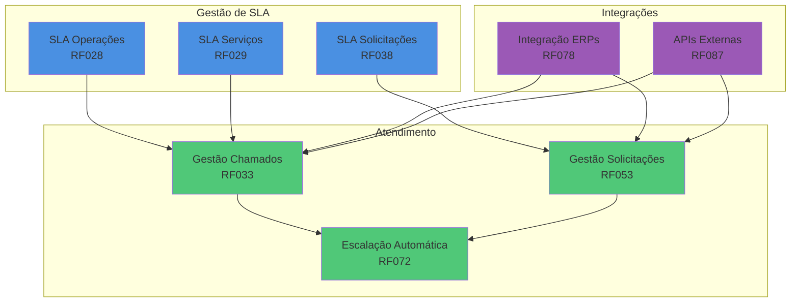

### Stack Tecnológico

- **Backend:** ASP.NET Core 8, MediatR (CQRS), Hangfire (jobs assíncronos)
- **SLA:** Motor customizado de cálculo de tempo útil, calendário de feriados
- **ML/IA:** Azure Cognitive Services (categorização automática)
- **Integrações:** TOTVS Protheus, SAP B1, Oracle EBS via WebServices
- **APIs:** REST com OAuth 2.0, Rate Limiting, Webhooks
- **Real-time:** SignalR (notificações em tempo real)
- **Observabilidade:** Application Insights, Serilog

---

## 3. Processos da Jornada

### 3.1 PRO-SVC-001: SLA de Operações

**Código:** PRO-SVC-001
**RFs Envolvidos:** RF028
**Área:** Service Desk
**Criticidade:** Alta

#### Diagrama BPMN: Comparação Legado vs Moderno

**Legado (AS-IS):**


**Moderno (Modernizado):**

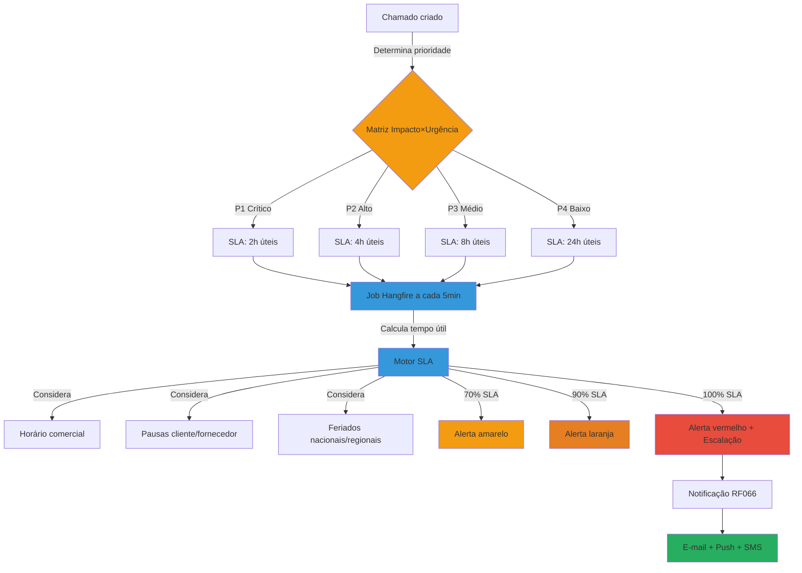

#### Descrição do Processo

Sistema inteligente de cálculo de SLA que considera tempo útil (horário comercial 8h-18h), pausas automáticas (aguardando cliente, aguardando fornecedor), feriados nacionais e regionais, e priorização automática via matriz impacto × urgência. Inclui alertas progressivos (70%, 90%, 100%) e escalação automática em caso de violação.

#### Atores

- **Sistema de SLA:** Calcula prazos automaticamente
- **Job Hangfire:** Monitora prazos a cada 5 minutos
- **Técnico:** Atende chamados dentro do prazo
- **Gestor:** Recebe alertas de violação
- **Cliente:** Beneficia-se de prazos respeitados

#### Fluxo Principal

1. Chamado criado no sistema
2. Sistema determina prioridade via matriz impacto × urgência:
   - **P1 (Crítico):** Sistema parado, impacto em toda empresa → SLA 2h úteis
   - **P2 (Alto):** Funcionalidade crítica afetada → SLA 4h úteis
   - **P3 (Médio):** Funcionalidade secundária afetada → SLA 8h úteis
   - **P4 (Baixo):** Dúvidas, melhorias → SLA 24h úteis
3. Sistema registra timestamp de início
4. Job Hangfire executa a cada 5 minutos:
   - Calcula tempo decorrido útil
   - Desconta pausas (aguardando cliente, aguardando fornecedor)
   - Desconta feriados e fins de semana
   - Considera horário comercial (8h-18h padrão, configurável)
5. Sistema calcula percentual de consumo do SLA:
   - **0-69%:** Status verde (normal)
   - **70-89%:** Status amarelo (atenção) → Notifica técnico
   - **90-99%:** Status laranja (crítico) → Notifica técnico + coordenador
   - **100%+:** Status vermelho (violado) → Escalação automática + notificação gestor
6. Alertas enviados via RF066 (e-mail, push, SMS)
7. Dashboard exibe compliance SLA em tempo real

**Fluxo de Pausa:**

1. Técnico solicita informação ao cliente
2. Status alterado para "Aguardando Cliente"
3. Contador de SLA pausado automaticamente
4. Cliente responde
5. Status retorna para "Em Atendimento"
6. Contador de SLA retomado

#### Automações

- ✅ Cálculo automático de tempo útil (horário comercial)
- ✅ Desconto automático de pausas (cliente, fornecedor)
- ✅ Desconto automático de feriados (API de calendário)
- ✅ Priorização automática via matriz impacto × urgência
- ✅ Alertas progressivos (70%, 90%, 100%)
- ✅ Escalação automática em violação de SLA
- ✅ Notificações multi-canal (e-mail, push, SMS)
- ✅ Dashboard de compliance em tempo real

#### Integrações

- **Hangfire:** Jobs de monitoramento a cada 5 minutos
- **API Calendário (Brasil API):** Feriados nacionais e regionais
- **RF066 (Notificações):** Alertas multi-canal
- **RF072 (Escalação):** Escalação automática
- **SignalR:** Dashboard em tempo real
- **RF004 (Auditoria):** Registro de violações

#### Regras de Negócio Principais

- **RN-028-01:** SLA calculado em tempo útil (horário comercial 8h-18h)
- **RN-028-02:** Prioridades: P1 (2h), P2 (4h), P3 (8h), P4 (24h)
- **RN-028-03:** Pausas "Aguardando Cliente" e "Aguardando Fornecedor" não contam no SLA
- **RN-028-04:** Feriados nacionais e regionais descontados automaticamente
- **RN-028-05:** Fins de semana não contam no SLA
- **RN-028-06:** Alertas em 70%, 90% e 100% do prazo
- **RN-028-07:** Violação de SLA P1 dispara escalação imediata
- **RN-028-08:** Dashboard atualizado a cada 5 minutos
- **RN-028-09:** Horário comercial configurável por cliente (multi-tenancy)

**[Ver regras completas em RF028.md]**

#### Referência ao Legado

**Como funcionava no legado:**

- ❌ SLA calculado manualmente em planilhas Excel
- ❌ Tempo corrido (ignorava fins de semana e feriados)
- ❌ Sem pausas automáticas (SLA consumido injustamente)
- ❌ Sem alertas proativos (descoberta reativa de violações)
- ❌ Priorização manual e subjetiva
- ❌ Sem escalação automática
- ❌ Relatórios manuais de compliance

**Melhorias no moderno:**

- ✅ Cálculo automático de tempo útil via job a cada 5 minutos
- ✅ Considera horário comercial, feriados e pausas
- ✅ Pausas automáticas por status (aguardando cliente/fornecedor)
- ✅ Alertas progressivos proativos (70%, 90%, 100%)
- ✅ Priorização automática via matriz impacto × urgência
- ✅ Escalação automática em violações
- ✅ Dashboard de compliance em tempo real
- ✅ Auditoria completa de todas as operações

---

### 3.2 PRO-SVC-002: SLA de Serviços

**Código:** PRO-SVC-002
**RFs Envolvidos:** RF029
**Área:** Service Desk
**Criticidade:** Alta

#### Diagrama BPMN: Comparação Legado vs Moderno

**Legado (AS-IS):**


**Moderno (Modernizado):**

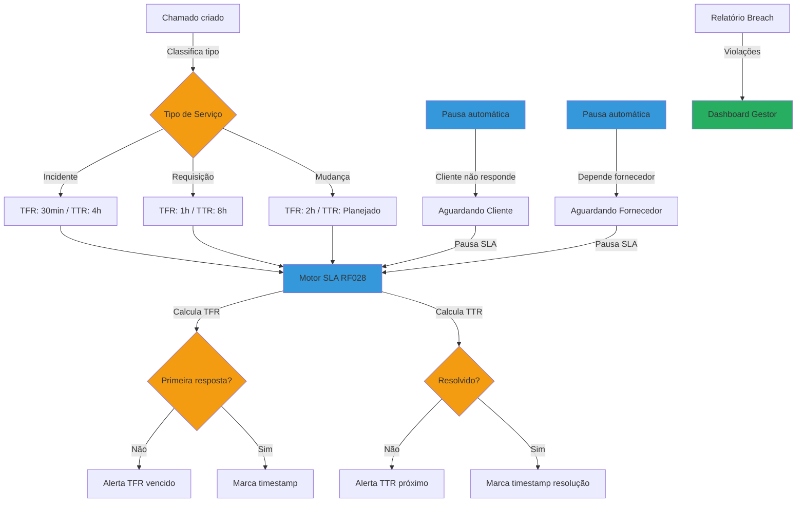

#### Descrição do Processo

Sistema de SLA diferenciado por tipo de serviço (Incidente, Requisição, Mudança) com controle de TFR (Tempo de Primeira Resposta) e TTR (Tempo de Resolução). Implementa pausas automáticas para dependências externas, rastreamento de breaches (violações) e relatórios gerenciais de performance.

#### Atores

- **Sistema de Classificação:** Determina tipo de serviço
- **Técnico:** Fornece primeira resposta e resolução
- **Cliente:** Aguarda atendimento dentro do prazo
- **Gestor de Service Desk:** Monitora breaches
- **Sistema de SLA:** Calcula prazos automaticamente

#### Fluxo Principal

1. Chamado criado no sistema
2. Sistema classifica automaticamente o tipo de serviço:
   - **Incidente:** Falha, erro, problema → TFR 30min / TTR 4h
   - **Requisição:** Solicitação de serviço → TFR 1h / TTR 8h
   - **Mudança:** Alteração planejada → TFR 2h / TTR conforme planejamento
3. Sistema inicia contadores separados:
   - **TFR (Time to First Response):** Tempo até primeira resposta do técnico
   - **TTR (Time to Resolution):** Tempo até resolução completa
4. Job Hangfire monitora ambos os contadores a cada 5 minutos
5. **Fluxo TFR:**
   - Sistema verifica se técnico deu primeira resposta
   - Se não: calcula tempo decorrido útil
   - Se 80% do TFR: alerta amarelo ao técnico
   - Se 100% do TFR: alerta vermelho + registra breach
6. **Fluxo TTR:**
   - Sistema verifica se chamado foi resolvido
   - Desconta pausas automáticas:
     - "Aguardando Cliente" (cliente não respondeu em 24h)
     - "Aguardando Fornecedor" (dependência externa)
   - Se 90% do TTR: alerta laranja ao técnico + coordenador
   - Se 100% do TTR: alerta vermelho + escalação automática
7. **Fluxo de Pausa Automática:**
   - Técnico solicita informação ao cliente
   - Sistema aguarda 24 horas
   - Se cliente não responder: pausa automática "Aguardando Cliente"
   - Cliente responde: retoma contador automaticamente
8. **Relatório de Breach:**
   - Sistema consolida violações diárias
   - Identifica causas (técnico, pausa cliente, complexidade)
   - Gera relatório para gestor
   - Dashboard exibe taxa de compliance por tipo de serviço

#### Automações

- ✅ Classificação automática de tipo de serviço
- ✅ Contadores separados para TFR e TTR
- ✅ Pausa automática "Aguardando Cliente" após 24h sem resposta
- ✅ Pausa automática "Aguardando Fornecedor" para dependências externas
- ✅ Alertas diferenciados por tipo de serviço
- ✅ Escalação automática em breaches de TTR
- ✅ Geração automática de relatório de breaches
- ✅ Dashboard de compliance por tipo de serviço

#### Integrações

- **RF028 (SLA Operações):** Motor de cálculo de tempo útil
- **RF066 (Notificações):** Alertas multi-canal
- **RF072 (Escalação):** Escalação automática em breaches
- **Hangfire:** Jobs de monitoramento
- **SignalR:** Dashboard em tempo real
- **RF004 (Auditoria):** Registro de breaches

#### Regras de Negócio Principais

- **RN-029-01:** TFR Incidente: 30 minutos úteis
- **RN-029-02:** TTR Incidente: 4 horas úteis
- **RN-029-03:** TFR Requisição: 1 hora útil
- **RN-029-04:** TTR Requisição: 8 horas úteis
- **RN-029-05:** TFR Mudança: 2 horas úteis
- **RN-029-06:** TTR Mudança: conforme planejamento
- **RN-029-07:** Pausa automática "Aguardando Cliente" após 24h sem resposta
- **RN-029-08:** Pausa automática "Aguardando Fornecedor" para dependências externas
- **RN-029-09:** Breach de TFR não dispara escalação (apenas alerta)
- **RN-029-10:** Breach de TTR dispara escalação automática
- **RN-029-11:** Relatório de breach consolidado diariamente

**[Ver regras completas em RF029.md]**

#### Referência ao Legado

**Como funcionava no legado:**

- ❌ SLA único para todos os tipos de serviço (4h)
- ❌ Sem controle de TFR (cliente sem retorno inicial)
- ❌ Sem diferenciação Incidente vs Requisição
- ❌ Pausas manuais (inconsistentes)
- ❌ Sem relatório de breaches
- ❌ Sem análise de causa de violações

**Melhorias no moderno:**

- ✅ SLA diferenciado por tipo de serviço
- ✅ Controle de TFR (primeira resposta) e TTR (resolução)
- ✅ Classificação automática Incidente/Requisição/Mudança
- ✅ Pausas automáticas por regras (24h sem resposta)
- ✅ Relatório automático de breaches com causa raiz
- ✅ Dashboard de compliance por tipo de serviço
- ✅ Análise de tendências de violações

---

### 3.3 PRO-SVC-003: Gestão de Chamados

**Código:** PRO-SVC-003
**RFs Envolvidos:** RF033
**Área:** Service Desk
**Criticidade:** Alta

#### Diagrama BPMN: Comparação Legado vs Moderno

**Legado (AS-IS):**


**Moderno (Modernizado):**

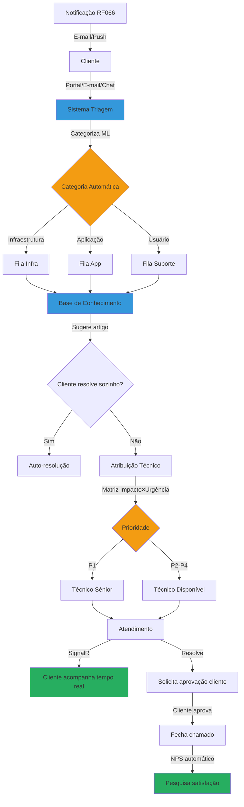

#### Descrição do Processo

Ciclo completo de gestão de chamados desde abertura multi-canal (portal, e-mail, chat), triagem automática via Machine Learning, categorização inteligente, atribuição baseada em matriz impacto × urgência, integração com base de conhecimento para auto-resolução, acompanhamento em tempo real via SignalR, até fechamento com NPS automático.

#### Atores

- **Cliente:** Abre e acompanha chamados
- **Sistema de Triagem:** Categoriza automaticamente via ML
- **Base de Conhecimento:** Sugere soluções
- **Técnico:** Atende e resolve chamados
- **Coordenador:** Monitora filas e performance
- **Sistema de NPS:** Coleta satisfação pós-atendimento

#### Fluxo Principal

1. **Abertura do Chamado:**
   - Cliente acessa portal self-service, envia e-mail ou usa chat
   - Sistema captura título, descrição, anexos
   - Registra ClienteId, UserId, timestamp
2. **Triagem Automática:**
   - Sistema analisa descrição via ML (Azure Cognitive Services)
   - Categoriza automaticamente:
     - **Infraestrutura:** rede, servidor, storage
     - **Aplicação:** bugs, erros, funcionalidades
     - **Usuário:** senha, acesso, dúvidas
   - Acurácia: 85%+ (treinamento contínuo)
3. **Sugestão de Base de Conhecimento:**
   - Sistema busca artigos relacionados (full-text search)
   - Exibe top 3 artigos mais relevantes ao cliente
   - Cliente tenta resolver sozinho
4. **Auto-resolução ou Atribuição:**
   - Se cliente resolve: marca como "Auto-resolvido" (economia)
   - Se não resolve: prossegue para atribuição
5. **Priorização Automática:**
   - Matriz impacto × urgência:
     - **Impacto:** Quantos usuários afetados? (1 usuário, departamento, empresa toda)
     - **Urgência:** Quanto tempo pode esperar? (imediato, hoje, esta semana)
   - Resultado: P1 (Crítico), P2 (Alto), P3 (Médio), P4 (Baixo)
6. **Atribuição Inteligente:**
   - P1: atribui automaticamente a técnico sênior disponível
   - P2-P4: atribui a técnico com menor fila
   - Considera especialização (categoria do chamado vs skills do técnico)
7. **Atendimento:**
   - Técnico recebe notificação push
   - Acessa chamado no painel
   - Interage com cliente via comentários (rastreados)
   - Cliente acompanha status em tempo real via SignalR
8. **Resolução:**
   - Técnico marca como "Resolvido"
   - Sistema solicita aprovação do cliente
   - Cliente aprova: chamado fechado
   - Cliente não aprova: reabre automaticamente
9. **NPS Automático:**
   - Sistema envia pesquisa de satisfação por e-mail
   - Escala 0-10: "Recomendaria nosso atendimento?"
   - Feedback agregado em dashboard de qualidade

**Fluxo de Escalação (RF072):**

- SLA próximo de expirar (90%)
- Sistema verifica regras de escalação
- Notifica coordenador automaticamente
- Coordenador pode reassignar ou assumir

#### Automações

- ✅ Categorização automática via Machine Learning (85% acurácia)
- ✅ Sugestão automática de artigos da base de conhecimento
- ✅ Priorização automática via matriz impacto × urgência
- ✅ Atribuição inteligente baseada em disponibilidade e especialização
- ✅ Notificações em tempo real via SignalR
- ✅ Solicitação automática de aprovação do cliente
- ✅ Envio automático de NPS pós-fechamento
- ✅ Dashboard de performance em tempo real

#### Integrações

- **Azure Cognitive Services:** Categorização automática via ML
- **Base de Conhecimento:** Sugestão de artigos (full-text search)
- **RF028 (SLA Operações):** Controle de prazos
- **RF066 (Notificações):** Alertas multi-canal
- **RF072 (Escalação):** Escalação automática
- **SignalR:** Acompanhamento em tempo real
- **RF004 (Auditoria):** Histórico completo

#### Regras de Negócio Principais

- **RN-033-01:** Canais de abertura: portal, e-mail, chat, telefone (registrado)
- **RN-033-02:** Categorização automática via ML com 85%+ de acurácia
- **RN-033-03:** Base de conhecimento consultada antes de atribuição
- **RN-033-04:** Auto-resoluções contam como economia de custo
- **RN-033-05:** Priorização via matriz impacto × urgência
- **RN-033-06:** P1 atribuído automaticamente a técnico sênior
- **RN-033-07:** Aprovação do cliente obrigatória para fechar chamado
- **RN-033-08:** NPS enviado automaticamente após fechamento
- **RN-033-09:** Cliente pode reabrir chamado em até 7 dias
- **RN-033-10:** Histórico completo auditável (LGPD compliant)

**[Ver regras completas em RF033.md]**

#### Referência ao Legado

**Como funcionava no legado:**

- ❌ Abertura apenas por e-mail (caixa compartilhada)
- ❌ Triagem manual (técnico lia e-mails um por um)
- ❌ Categorização manual e inconsistente
- ❌ Sem base de conhecimento integrada
- ❌ Priorização subjetiva (quem grita mais alto)
- ❌ Atribuição manual pelo coordenador
- ❌ Cliente sem visibilidade do status
- ❌ NPS manual (1x por ano, taxa de resposta baixa)
- ❌ Histórico em e-mails (não estruturado)

**Melhorias no moderno:**

- ✅ Abertura multi-canal (portal, e-mail, chat, telefone)
- ✅ Triagem automática via ML (85% acurácia)
- ✅ Categorização padronizada e consistente
- ✅ Base de conhecimento integrada (auto-resolução)
- ✅ Priorização objetiva via matriz impacto × urgência
- ✅ Atribuição inteligente (disponibilidade + especialização)
- ✅ Cliente acompanha em tempo real via SignalR
- ✅ NPS automático pós-fechamento (taxa de resposta 60%+)
- ✅ Histórico estruturado e auditável

---

### 3.4 PRO-SVC-004: SLA de Solicitações

**Código:** PRO-SVC-004
**RFs Envolvidos:** RF038
**Área:** Service Desk
**Criticidade:** Alta

#### Diagrama BPMN: Comparação Legado vs Moderno

**Legado (AS-IS):**

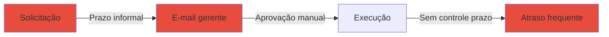

**Moderno (Modernizado):**

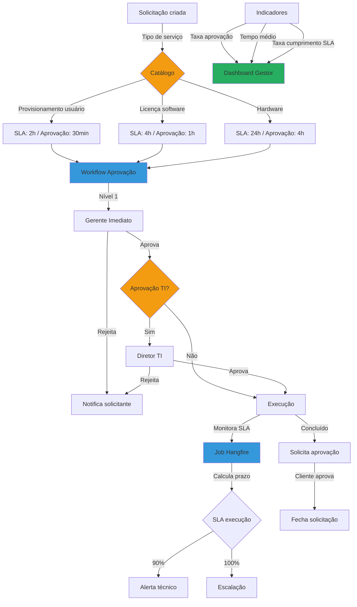

#### Descrição do Processo

Sistema de SLA específico para requisições de serviço com workflow multi-nível configurável (aprovação gerencial → aprovação TI → execução). Calcula prazos diferenciados por tipo de solicitação, monitora tempo de aprovação e tempo de execução separadamente, e gera indicadores de performance (taxa de aprovação, tempo médio, cumprimento de SLA).

#### Atores

- **Solicitante:** Cria requisições de serviço
- **Gerente:** Aprova ou rejeita no nível gerencial
- **Diretor TI:** Aprova requisições que requerem nível TI
- **Técnico:** Executa solicitações aprovadas
- **Sistema de Workflow:** Orquestra aprovações
- **Gestor de Service Desk:** Monitora indicadores

#### Fluxo Principal

1. **Criação da Solicitação:**
   - Solicitante acessa catálogo de serviços
   - Seleciona tipo de serviço (ex: "Provisionamento de Usuário")
   - Preenche formulário dinâmico (campos variam por tipo)
   - Sistema registra solicitação com status "Pendente Aprovação"
2. **Determinação de SLA:**
   - Sistema consulta SLA configurado para o tipo:
     - **Provisionamento usuário:** Aprovação 30min / Execução 2h
     - **Licença software:** Aprovação 1h / Execução 4h
     - **Hardware:** Aprovação 4h / Execução 24h
   - Inicia contadores separados para aprovação e execução
3. **Workflow de Aprovação Multi-Nível:**
   - **Nível 1 - Gerente Imediato:**
     - Notificado via e-mail + push
     - Prazo: conforme SLA de aprovação
     - Decide: Aprovar ou Rejeitar (justificativa obrigatória)
   - **Nível 2 - Diretor TI (se necessário):**
     - Acionado automaticamente após aprovação nível 1
     - Decide: Aprovar ou Rejeitar
     - Prazo compartilhado com nível 1 (contador único)
4. **Monitoramento de SLA de Aprovação:**
   - Job Hangfire monitora a cada 5 minutos
   - Se 80% do prazo: alerta amarelo ao aprovador
   - Se 100% do prazo: alerta vermelho + escalação ao superior
5. **Execução (após aprovação completa):**
   - Solicitação atribuída automaticamente a técnico
   - Contador de SLA de execução iniciado
   - Técnico executa a solicitação
   - Registra evidências (screenshots, logs)
6. **Monitoramento de SLA de Execução:**
   - Job Hangfire monitora a cada 5 minutos
   - Se 90% do prazo: alerta laranja ao técnico + coordenador
   - Se 100% do prazo: alerta vermelho + escalação automática
7. **Conclusão:**
   - Técnico marca como "Concluído"
   - Sistema solicita aprovação do solicitante
   - Solicitante aprova: solicitação fechada
   - Solicitante não aprova: reabre para correção
8. **Indicadores de Performance:**
   - **Taxa de aprovação:** (Aprovadas / Total) × 100%
   - **Tempo médio de aprovação:** Média de tempo por nível
   - **Taxa de cumprimento SLA:** (Dentro do prazo / Total) × 100%
   - **Tempo médio de execução:** Média de tempo por tipo
   - Dashboard atualizado em tempo real

#### Automações

- ✅ Determinação automática de SLA por tipo de serviço
- ✅ Workflow de aprovação multi-nível configurável
- ✅ Contadores separados para aprovação e execução
- ✅ Notificações automáticas aos aprovadores
- ✅ Escalação automática em atrasos de aprovação
- ✅ Escalação automática em atrasos de execução
- ✅ Cálculo automático de indicadores de performance
- ✅ Dashboard de gestão em tempo real

#### Integrações

- **RF053 (Gestão Solicitações):** Catálogo de serviços e formulários
- **RF088 (Workflows Aprovação):** Motor de aprovações multi-nível
- **RF028 (SLA Operações):** Motor de cálculo de tempo útil
- **RF066 (Notificações):** Alertas aos aprovadores e técnicos
- **RF072 (Escalação):** Escalação automática em atrasos
- **Hangfire:** Jobs de monitoramento
- **SignalR:** Dashboard em tempo real

#### Regras de Negócio Principais

- **RN-038-01:** SLA diferenciado por tipo de solicitação
- **RN-038-02:** Contadores separados: aprovação e execução
- **RN-038-03:** Aprovação gerencial obrigatória para todas as solicitações
- **RN-038-04:** Aprovação TI obrigatória para licenças e hardware
- **RN-038-05:** Rejeição requer justificativa obrigatória
- **RN-038-06:** Escalação automática em 100% do prazo de aprovação
- **RN-038-07:** Escalação automática em 100% do prazo de execução
- **RN-038-08:** Indicadores calculados em tempo real
- **RN-038-09:** Taxa de aprovação meta: 85%+
- **RN-038-10:** Taxa de cumprimento SLA meta: 95%+

**[Ver regras completas em RF038.md]**

#### Referência ao Legado

**Como funcionava no legado:**

- ❌ Solicitações via e-mail (não estruturadas)
- ❌ Aprovação manual via e-mail (sem controle de prazo)
- ❌ Sem workflow configurável (hardcoded)
- ❌ SLA único para todas as solicitações
- ❌ Sem diferenciação entre aprovação e execução
- ❌ Sem escalação automática
- ❌ Sem indicadores de performance
- ❌ Relatórios manuais em Excel

**Melhorias no moderno:**

- ✅ Solicitações estruturadas via catálogo de serviços
- ✅ Aprovação automática via workflow configurável
- ✅ SLA diferenciado por tipo de solicitação
- ✅ Contadores separados (aprovação vs execução)
- ✅ Escalação automática em atrasos
- ✅ Indicadores automatizados (taxa aprovação, tempo médio, compliance)
- ✅ Dashboard de gestão em tempo real
- ✅ Auditoria completa de aprovações

---

### 3.5 PRO-SVC-005: Gestão de Solicitações

**Código:** PRO-SVC-005
**RFs Envolvidos:** RF053
**Área:** Service Desk
**Criticidade:** Alta

#### Diagrama BPMN: Comparação Legado vs Moderno

**Legado (AS-IS):**

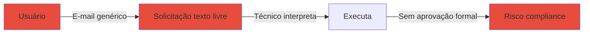

**Moderno (Modernizado):**

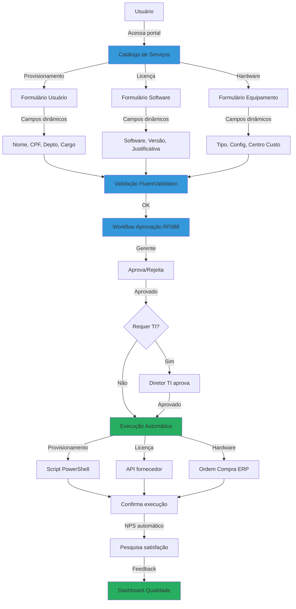

#### Descrição do Processo

Sistema completo de gestão de solicitações com catálogo de serviços estruturado, formulários dinâmicos por tipo, aprovações em cadeia configuráveis (gerente → diretor → TI), execução automatizada para casos simples (provisionamento de usuário, ativação de licenças), e NPS automático pós-atendimento para medir satisfação.

#### Atores

- **Usuário Final:** Solicita serviços via catálogo
- **Catálogo de Serviços:** Lista serviços disponíveis
- **Gerente:** Aprova solicitações da equipe
- **Diretor TI:** Aprova solicitações críticas (licenças, hardware)
- **Sistema de Automação:** Executa provisionamentos automatizados
- **Técnico:** Executa solicitações que requerem intervenção manual

#### Fluxo Principal

1. **Acesso ao Catálogo:**
   - Usuário acessa portal self-service
   - Visualiza catálogo de serviços disponíveis:
     - **Provisionamento de Usuário:** Criar novo usuário no AD, Office 365, sistemas corporativos
     - **Licença de Software:** Ativar/desativar licenças (Adobe, Microsoft, Autocad)
     - **Hardware:** Notebook, desktop, monitor, mouse, teclado
     - **Acesso a Sistema:** Permissões específicas em sistemas
     - **Alteração de Dados:** Departamento, cargo, centro de custo
2. **Seleção de Serviço e Preenchimento:**
   - Usuário seleciona serviço (ex: "Licença de Software")
   - Sistema exibe formulário dinâmico específico:
     - Campos obrigatórios: Software, Versão, Justificativa, Centro de Custo
     - Campos opcionais: Prazo desejado, Observações
   - Anexos: permite upload de documentos (ordem de compra, aprovação prévia)
3. **Validação Automática:**
   - FluentValidation valida campos obrigatórios
   - Validações específicas por tipo:
     - **Provisionamento:** CPF válido, e-mail corporativo único
     - **Licença:** Justificativa mínimo 50 caracteres
     - **Hardware:** Centro de custo válido
   - Se inválido: retorna erros específicos ao usuário
4. **Workflow de Aprovação (RF088):**
   - Solicitação submetida ao workflow configurado:
     - **Gerente Imediato:** Sempre requerido (valida necessidade)
     - **Diretor TI:** Requerido para licenças e hardware
     - **Financeiro:** Requerido para valores > R$5.000
   - Aprovadores notificados via e-mail + push
   - Podem aprovar, rejeitar ou solicitar informações adicionais
5. **Execução (após aprovações completas):**
   - **Automática (onde aplicável):**
     - **Provisionamento usuário:** Script PowerShell cria usuário no AD + Office 365
     - **Ativação licença:** API do fornecedor ativa licença automaticamente
     - **Acesso sistema:** Script SQL atualiza permissões
   - **Manual (onde necessário):**
     - **Hardware:** Técnico registra ordem de compra no ERP via RF078
     - **Alterações complexas:** Técnico executa manualmente e documenta
6. **Confirmação de Execução:**
   - Sistema registra evidências:
     - **Automático:** Logs de scripts, respostas de APIs
     - **Manual:** Screenshots, número de ordem de compra
   - Marca solicitação como "Concluído"
   - Solicita aprovação do solicitante
7. **NPS Automático:**
   - Sistema envia pesquisa de satisfação por e-mail
   - Perguntas:
     - "Recomendaria nosso serviço?" (0-10)
     - "O prazo foi cumprido?" (Sim/Não)
     - "A qualidade atendeu expectativas?" (1-5 estrelas)
     - Comentários opcionais
   - Respostas agregadas em dashboard de qualidade

#### Automações

- ✅ Catálogo de serviços estruturado e configurável
- ✅ Formulários dinâmicos por tipo de serviço
- ✅ Validação automática via FluentValidation
- ✅ Workflow de aprovação em cadeia (RF088)
- ✅ Execução automatizada (PowerShell, APIs)
- ✅ Integração com ERP para ordem de compra (RF078)
- ✅ Registro automático de evidências
- ✅ NPS automático pós-atendimento
- ✅ Dashboard de satisfação em tempo real

#### Integrações

- **RF088 (Workflows Aprovação):** Aprovações em cadeia
- **RF038 (SLA Solicitações):** Controle de prazos
- **Active Directory:** Provisionamento de usuários
- **Office 365 API:** Criação de contas e-mail
- **APIs Fornecedores (Adobe, Microsoft):** Ativação de licenças
- **RF078 (Integração ERP):** Ordem de compra de hardware
- **PowerShell:** Automações de provisionamento
- **RF066 (Notificações):** Alertas aos aprovadores
- **RF004 (Auditoria):** Histórico completo de solicitações

#### Regras de Negócio Principais

- **RN-053-01:** Catálogo de serviços configurável por administrador
- **RN-053-02:** Formulários dinâmicos por tipo de serviço
- **RN-053-03:** Validação obrigatória de campos antes de submeter
- **RN-053-04:** Aprovação gerencial obrigatória para todas as solicitações
- **RN-053-05:** Aprovação TI obrigatória para licenças e hardware
- **RN-053-06:** Aprovação financeira obrigatória para valores > R$5.000
- **RN-053-07:** Execução automatizada preferencial (onde aplicável)
- **RN-053-08:** Registro de evidências obrigatório (automático ou manual)
- **RN-053-09:** NPS enviado automaticamente após fechamento
- **RN-053-10:** Taxa de resposta NPS meta: 60%+
- **RN-053-11:** NPS médio meta: 8.0+

**[Ver regras completas em RF053.md]**

#### Referência ao Legado

**Como funcionava no legado:**

- ❌ Solicitações via e-mail (texto livre, não estruturado)
- ❌ Sem catálogo de serviços formal
- ❌ Técnico interpretava manualmente o que usuário queria
- ❌ Aprovações informais via e-mail
- ❌ Execução 100% manual (mesmo tarefas repetitivas)
- ❌ Sem evidências documentadas
- ❌ NPS manual (1x por ano, taxa de resposta 10%)
- ❌ Sem dashboard de satisfação

**Melhorias no moderno:**

- ✅ Solicitações estruturadas via catálogo de serviços
- ✅ Formulários dinâmicos específicos por tipo
- ✅ Validação automática de campos
- ✅ Aprovações formais rastreadas via workflow (RF088)
- ✅ Execução automatizada para casos simples (60% dos casos)
- ✅ Evidências registradas automaticamente
- ✅ NPS automático pós-atendimento (taxa de resposta 60%+)
- ✅ Dashboard de satisfação em tempo real
- ✅ Redução de 40% no tempo de atendimento

---

### 3.6 PRO-SVC-006: Escalação Automática

**Código:** PRO-SVC-006
**RFs Envolvidos:** RF072
**Área:** Service Desk
**Criticidade:** Alta

#### Diagrama BPMN: Comparação Legado vs Moderno

**Legado (AS-IS):**

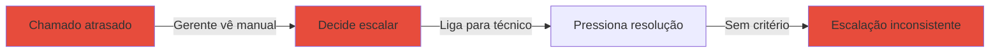

**Moderno (Modernizado):**

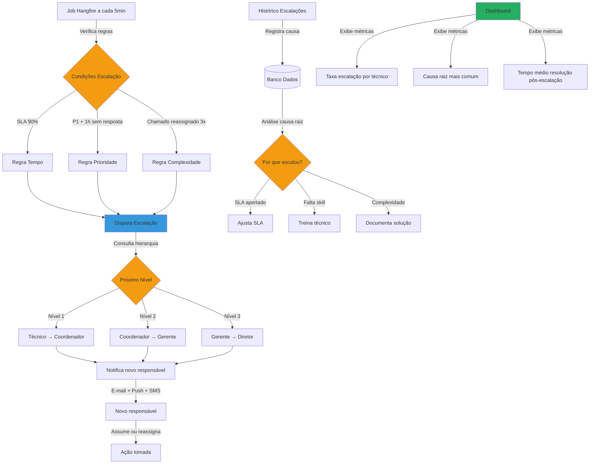

#### Descrição do Processo

Sistema inteligente de escalação automática baseado em regras configuráveis (tempo, prioridade, complexidade). Implementa hierarquia de escalação (nível 1 → nível 2 → nível 3 → gestor), notificações automáticas multi-canal, histórico completo de escalações, e análise de causa raiz para melhoria contínua.

#### Atores

- **Job Hangfire:** Monitora condições de escalação a cada 5 minutos
- **Sistema de Escalação:** Aplica regras e determina próximo nível
- **Técnico Nível 1:** Primeiro atendimento
- **Coordenador (Nível 2):** Casos complexos ou SLA próximo
- **Gerente (Nível 3):** Casos críticos ou múltiplas tentativas
- **Diretor:** Casos críticos sem resolução em nível 3

#### Fluxo Principal

1. **Monitoramento Contínuo:**
   - Job Hangfire executa a cada 5 minutos
   - Consulta chamados ativos com status "Em Atendimento"
   - Aplica regras de escalação configuradas
2. **Regras de Escalação (configuráveis por tipo e prioridade):**
   - **Regra Tempo:**
     - SLA atingiu 90%+ → Escala para nível superior
   - **Regra Prioridade:**
     - P1 + 1 hora sem primeira resposta → Escala para sênior
     - P1 + 2 horas sem resolução → Escala para coordenador
   - **Regra Complexidade:**
     - Chamado reassignado 3+ vezes → Escala para especialista
     - Chamado reaberto 2+ vezes → Escala para coordenador
   - **Regra Inatividade:**
     - Sem atualização há 4 horas (P1/P2) → Escala para coordenador
3. **Determinação de Hierarquia:**
   - Sistema consulta estrutura organizacional (Azure AD)
   - Identifica próximo nível:
     - **Nível 1 (Técnico):** Primeiro atendimento
     - **Nível 2 (Coordenador):** Supervisão técnica
     - **Nível 3 (Gerente):** Casos complexos
     - **Nível 4 (Diretor):** Crises críticas
4. **Disparo de Escalação:**
   - Sistema marca chamado como "Escalado"
   - Registra:
     - Timestamp de escalação
     - Regra que disparou
     - Técnico anterior
     - Novo responsável
     - Observações automáticas
5. **Notificação Multi-Canal:**
   - **Novo responsável:** E-mail + Push + SMS (P1)
   - **Técnico anterior:** E-mail + Push (informativo)
   - **Gestor:** E-mail (informativo) + Dashboard atualizado
6. **Ação do Novo Responsável:**
   - **Assumir:** Torna-se responsável direto
   - **Reassignar:** Atribui a especialista específico
   - **Resolver:** Resolve diretamente
   - **Solicitar apoio:** Consulta outros técnicos sem reassignar
7. **Análise de Causa Raiz:**
   - Sistema agrega escalações por:
     - Técnico (quem escala mais?)
     - Tipo de chamado (qual categoria escala mais?)
     - Regra (tempo, complexidade, inatividade?)
   - Dashboard exibe:
     - Taxa de escalação por técnico
     - Causa raiz mais comum
     - Tempo médio de resolução pós-escalação
8. **Melhoria Contínua:**
   - **SLA apertado demais:** Gestor ajusta prazos
   - **Falta de skill:** Treina técnico em categoria específica
   - **Complexidade recorrente:** Documenta solução na base de conhecimento

#### Automações

- ✅ Monitoramento contínuo a cada 5 minutos via Hangfire
- ✅ Aplicação automática de regras de escalação
- ✅ Determinação automática de próximo nível via hierarquia AD
- ✅ Notificações automáticas multi-canal (e-mail, push, SMS)
- ✅ Registro automático de histórico de escalações
- ✅ Análise automática de causa raiz
- ✅ Dashboard de métricas em tempo real
- ✅ Sugestão automática de melhorias (ajustar SLA, treinar técnico)

#### Integrações

- **Hangfire:** Jobs de monitoramento a cada 5 minutos
- **Azure AD:** Hierarquia organizacional para determinar níveis
- **RF028 (SLA Operações):** Consulta percentual de SLA consumido
- **RF066 (Notificações):** Alertas multi-canal
- **RF033 (Gestão Chamados):** Dados de chamados e reassignments
- **SignalR:** Dashboard de escalações em tempo real
- **RF004 (Auditoria):** Histórico imutável de escalações

#### Regras de Negócio Principais

- **RN-072-01:** Monitoramento de regras a cada 5 minutos
- **RN-072-02:** Regras configuráveis por tipo e prioridade de chamado
- **RN-072-03:** Hierarquia: Técnico → Coordenador → Gerente → Diretor
- **RN-072-04:** Regra Tempo: escala em 90% do SLA
- **RN-072-05:** Regra Prioridade P1: escala após 1h sem resposta
- **RN-072-06:** Regra Complexidade: escala após 3 reassignments
- **RN-072-07:** Regra Inatividade: escala após 4h sem atualização (P1/P2)
- **RN-072-08:** Notificação SMS apenas para P1
- **RN-072-09:** Histórico de escalações mantido por 2 anos
- **RN-072-10:** Taxa de escalação meta: <15% dos chamados
- **RN-072-11:** Análise de causa raiz executada semanalmente

**[Ver regras completas em RF072.md]**

#### Referência ao Legado

**Como funcionava no legado:**

- ❌ Escalação manual pelo gerente (quando lembrava)
- ❌ Sem regras formais (decisão subjetiva)
- ❌ Sem notificação automática (ligação telefônica)
- ❌ Sem histórico estruturado de escalações
- ❌ Sem análise de causa raiz
- ❌ Escalação inconsistente (depende de quem grita mais)
- ❌ Sem métricas de escalação

**Melhorias no moderno:**

- ✅ Escalação automática baseada em regras configuráveis
- ✅ Monitoramento contínuo a cada 5 minutos
- ✅ Notificações automáticas multi-canal (e-mail, push, SMS)
- ✅ Histórico completo de escalações (auditável)
- ✅ Análise automática de causa raiz
- ✅ Escalação consistente e objetiva (baseada em critérios)
- ✅ Dashboard de métricas em tempo real
- ✅ Melhoria contínua baseada em dados (ajuste SLA, treinamento)

---

### 3.7 PRO-SVC-007: Integração com ERPs

**Código:** PRO-SVC-007
**RFs Envolvidos:** RF078
**Área:** Service Desk
**Criticidade:** Alta

#### Diagrama BPMN: Comparação Legado vs Moderno

**Legado (AS-IS):**

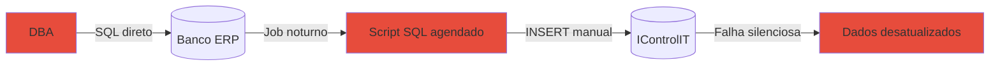

**Moderno (Modernizado):**

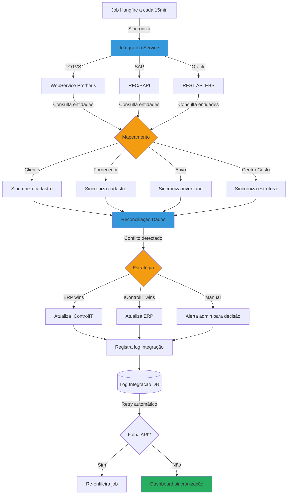

#### Descrição do Processo

Integração bidirecional com ERPs corporativos (TOTVS Protheus, SAP Business One, Oracle EBS) via WebServices e APIs REST. Implementa sincronização automática a cada 15 minutos de entidades-chave (cliente, fornecedor, ativo, centro de custo), reconciliação automática de dados divergentes, logs detalhados de integração, e retry automático em falhas.

#### Atores

- **Integration Service:** Orquestra sincronização bidirecional
- **Job Hangfire:** Executa sincronizações a cada 15 minutos
- **ERP TOTVS Protheus:** Sistema financeiro/contábil corporativo
- **ERP SAP Business One:** Sistema de gestão empresarial
- **ERP Oracle EBS:** Sistema de gestão empresarial
- **Administrador:** Resolve conflitos de dados manualmente (quando necessário)

#### Fluxo Principal

1. **Agendamento de Sincronização:**
   - Job Hangfire executa a cada 15 minutos
   - Consulta configuração de integração ativa:
     - ERP conectado (TOTVS, SAP ou Oracle)
     - Entidades habilitadas para sincronização
     - Direção (IControlIT → ERP, ERP → IControlIT ou bidirecional)
2. **Conexão com ERP:**
   - **TOTVS Protheus:** WebService SOAP (.wsdl)
   - **SAP Business One:** RFC/BAPI (Remote Function Call)
   - **Oracle EBS:** REST API (JSON)
   - Autenticação via credenciais configuradas (RF002)
   - Timeout: 30 segundos
3. **Sincronização de Entidades:**
   - **Cliente:**
     - Campos: CNPJ, Razão Social, Nome Fantasia, Endereço, Status
     - IControlIT → ERP: Novos clientes cadastrados
     - ERP → IControlIT: Alterações de status, endereço
   - **Fornecedor:**
     - Campos: CNPJ, Razão Social, Categoria, Contato
     - Sincronização bidirecional
   - **Ativo:**
     - Campos: Patrimônio, Descrição, Centro Custo, Status
     - ERP → IControlIT: Ativos comprados via ordem de compra
     - IControlIT → ERP: Baixa de ativos, depreciação
   - **Centro de Custo:**
     - Campos: Código, Descrição, Hierarquia
     - ERP → IControlIT (apenas leitura)
4. **Mapeamento de Campos:**
   - Sistema mantém tabela de mapeamento configurável:
     - Campo IControlIT → Campo ERP
     - Exemplo: `ClienteId` (IControlIT) → `A1_COD` (TOTVS)
   - Suporta transformações customizadas (ex: CNPJ com/sem máscara)
5. **Reconciliação de Dados:**
   - Para cada registro:
     - Compara campos IControlIT vs ERP
     - Se idênticos: nenhuma ação
     - Se divergentes: detecta conflito
6. **Resolução de Conflitos:**
   - **Estratégia "ERP wins":** ERP é fonte da verdade (padrão)
     - Atualiza registro no IControlIT com valores do ERP
   - **Estratégia "IControlIT wins":** IControlIT é fonte da verdade
     - Atualiza registro no ERP com valores do IControlIT
   - **Estratégia "Manual":** Conflitos complexos
     - Alerta administrador via notificação
     - Admin decide qual valor manter
7. **Logs de Integração:**
   - Cada sincronização gera log detalhado:
     - Timestamp início/fim
     - Entidades sincronizadas
     - Registros processados
     - Conflitos detectados
     - Erros (se houver)
   - Logs mantidos por 90 dias
8. **Retry Automático em Falhas:**
   - Se API falha (timeout, erro HTTP 500):
     - Sistema registra erro no log
     - Re-enfileira job com backoff exponencial (1min, 5min, 15min)
     - Máximo 3 tentativas
     - Se falha 3x: alerta administrador
9. **Dashboard de Sincronização:**
   - Última sincronização: timestamp
   - Status: Sucesso, Falha, Parcial
   - Registros processados: total, novos, atualizados
   - Conflitos: total, resolvidos, pendentes
   - Taxa de sucesso: (sincronizações OK / total) × 100%

#### Automações

- ✅ Sincronização automática a cada 15 minutos via Hangfire
- ✅ Mapeamento automático de campos via tabela configurável
- ✅ Reconciliação automática de dados divergentes
- ✅ Resolução automática de conflitos (estratégia "ERP wins")
- ✅ Retry automático com backoff exponencial em falhas
- ✅ Logs detalhados de todas as operações
- ✅ Alertas automáticos em falhas persistentes
- ✅ Dashboard de sincronização em tempo real

#### Integrações

- **TOTVS Protheus:** WebService SOAP (WSCLIENTES, WSATIVOS)
- **SAP Business One:** RFC/BAPI (via SAP .NET Connector)
- **Oracle EBS:** REST API (JSON)
- **RF002 (Configurações Gerais):** Credenciais de conexão ERP
- **RF066 (Notificações):** Alertas de falhas de integração
- **Hangfire:** Jobs de sincronização
- **RF004 (Auditoria):** Histórico de sincronizações

#### Regras de Negócio Principais

- **RN-078-01:** Sincronização a cada 15 minutos (configurável)
- **RN-078-02:** Entidades sincronizadas: Cliente, Fornecedor, Ativo, Centro Custo
- **RN-078-03:** Mapeamento de campos configurável via UI
- **RN-078-04:** Estratégia padrão de conflito: "ERP wins"
- **RN-078-05:** Retry automático: 3 tentativas (1min, 5min, 15min)
- **RN-078-06:** Timeout de conexão: 30 segundos
- **RN-078-07:** Logs mantidos por 90 dias
- **RN-078-08:** Taxa de sucesso meta: 99%+
- **RN-078-09:** Alertas após 3 falhas consecutivas
- **RN-078-10:** Sincronização pode ser pausada manualmente

**[Ver regras completas em RF078.md]**

#### Referência ao Legado

**Como funcionava no legado:**

- ❌ Integração via scripts SQL diretos (frágil)
- ❌ Jobs noturnos (dados desatualizados durante o dia)
- ❌ Sem tratamento de erros (falhas silenciosas)
- ❌ Sem reconciliação de conflitos (dados inconsistentes)
- ❌ Sem logs estruturados (impossível debugar)
- ❌ Sem retry automático (DBA intervinha manualmente)
- ❌ Acoplamento direto ao banco ERP (risco de corrupção)

**Melhorias no moderno:**

- ✅ Integração via APIs REST e WebServices (oficial)
- ✅ Sincronização a cada 15 minutos (dados atualizados)
- ✅ Tratamento robusto de erros com retry
- ✅ Reconciliação automática de conflitos
- ✅ Logs detalhados de todas as operações
- ✅ Retry automático com backoff exponencial
- ✅ Desacoplamento via APIs (segurança ERP garantida)
- ✅ Dashboard de sincronização em tempo real
- ✅ Suporte multi-ERP (TOTVS, SAP, Oracle)

---

### 3.8 PRO-SVC-008: APIs Externas

**Código:** PRO-SVC-008
**RFs Envolvidos:** RF087
**Área:** Service Desk
**Criticidade:** Alta

#### Diagrama BPMN: Comparação Legado vs Moderno

**Legado (AS-IS):**

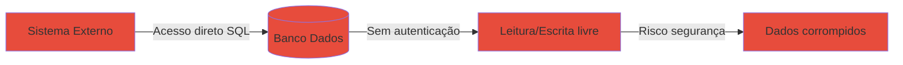

**Moderno (Modernizado):**

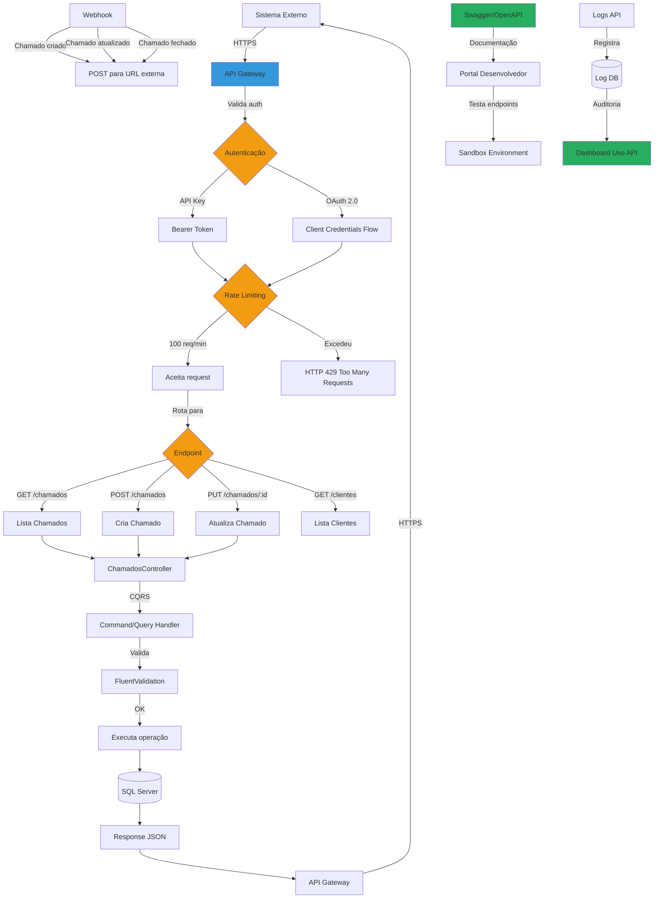

#### Descrição do Processo

Exposição de APIs REST securizadas para integrações externas com autenticação via API Key ou OAuth 2.0, rate limiting (100 req/min por tenant), throttling automático em picos, webhooks para notificações de eventos (chamado criado, atualizado, fechado), documentação Swagger/OpenAPI interativa, e logs completos de uso para auditoria.

#### Atores

- **Sistema Externo:** Consome APIs do IControlIT
- **API Gateway:** Gerencia autenticação, rate limiting e roteamento
- **ChamadosController:** Expõe endpoints de chamados
- **Webhook Service:** Notifica sistemas externos de eventos
- **Desenvolvedor Externo:** Consome APIs e lê documentação
- **Administrador IControlIT:** Gerencia API Keys e monitora uso

#### Fluxo Principal

1. **Registro de Aplicação Externa:**
   - Desenvolvedor acessa portal IControlIT
   - Solicita acesso à API
   - Admin aprova solicitação
   - Sistema gera:
     - **API Key:** Token opaco para autenticação simples
     - **Client ID/Secret:** Para OAuth 2.0 (mais seguro)
2. **Autenticação:**
   - **API Key (simples):**
     - Header: `Authorization: Bearer {API_KEY}`
     - Válido por 1 ano (renovável)
   - **OAuth 2.0 (recomendado):**
     - POST `/api/auth/token` com Client ID/Secret
     - Retorna Access Token JWT (válido por 1 hora)
     - Header: `Authorization: Bearer {ACCESS_TOKEN}`
3. **Rate Limiting:**
   - Sistema aplica limites por tenant:
     - **Padrão:** 100 requisições/minuto
     - **Premium:** 500 requisições/minuto
   - Se excedido: retorna HTTP 429 Too Many Requests
   - Header `Retry-After: 60` indica quando pode tentar novamente
4. **Throttling Automático:**
   - Em picos de tráfego (ex: 1000 req/s):
     - Sistema enfileira requisições
     - Processa de forma controlada (FIFO)
     - Retorna HTTP 503 Service Unavailable se fila cheia
5. **Endpoints Disponíveis:**
   - **Chamados:**
     - `GET /api/v1/chamados` - Lista chamados (paginado)
     - `GET /api/v1/chamados/:id` - Detalhe de chamado
     - `POST /api/v1/chamados` - Cria novo chamado
     - `PUT /api/v1/chamados/:id` - Atualiza chamado
     - `DELETE /api/v1/chamados/:id` - Cancela chamado
   - **Clientes:**
     - `GET /api/v1/clientes` - Lista clientes
     - `GET /api/v1/clientes/:id` - Detalhe de cliente
   - **Ativos:**
     - `GET /api/v1/ativos` - Lista ativos
     - `GET /api/v1/ativos/:id` - Detalhe de ativo
6. **Validação de Request:**
   - FluentValidation valida payload
   - Retorna HTTP 400 Bad Request com erros detalhados:
     ```json
     {
       "errors": {
         "titulo": ["Campo obrigatório"],
         "descricao": ["Mínimo 10 caracteres"]
       }
     }
     ```
7. **Execução de Operação:**
   - Controller delega para Command/Query Handler (CQRS)
   - Handler executa lógica de negócio
   - Retorna resultado
8. **Response:**
   - HTTP 200 OK: operação bem-sucedida
   - HTTP 201 Created: recurso criado (com header `Location`)
   - HTTP 400 Bad Request: validação falhou
   - HTTP 401 Unauthorized: autenticação inválida
   - HTTP 403 Forbidden: sem permissão
   - HTTP 404 Not Found: recurso não existe
   - HTTP 429 Too Many Requests: rate limit excedido
   - HTTP 500 Internal Server Error: erro no servidor
9. **Webhooks:**
   - Sistema externo registra URL de callback
   - Eventos suportados:
     - `chamado.criado`
     - `chamado.atualizado`
     - `chamado.fechado`
   - Sistema envia POST para URL registrada:
     ```json
     {
       "evento": "chamado.criado",
       "timestamp": "2026-01-12T10:30:00Z",
       "data": {
         "chamadoId": "123",
         "titulo": "Erro no sistema",
         "prioridade": "P1"
       }
     }
     ```
   - Retry automático se callback falhar (3 tentativas)
10. **Documentação Swagger/OpenAPI:**
    - Portal desenvolvedor: `https://api.icontrolit.com.br/docs`
    - Documentação interativa de todos os endpoints
    - Permite testar requisições diretamente na UI
    - Sandbox environment para testes
11. **Logs e Auditoria:**
    - Toda requisição gera log detalhado:
      - Timestamp, ClienteId, API Key/Token
      - Endpoint, Method, Payload
      - Response status, duração (ms)
    - Dashboard de uso:
      - Requisições por minuto
      - Taxa de erro
      - Endpoints mais usados
      - Latência (p50, p95, p99)

#### Automações

- ✅ Autenticação automática via API Key ou OAuth 2.0
- ✅ Rate limiting automático (100 req/min padrão)
- ✅ Throttling automático em picos de tráfego
- ✅ Validação automática de payloads via FluentValidation
- ✅ Webhooks automáticos para eventos configurados
- ✅ Retry automático de webhooks em falhas (3 tentativas)
- ✅ Geração automática de documentação Swagger/OpenAPI
- ✅ Logs automáticos de todas as requisições
- ✅ Dashboard de uso em tempo real

#### Integrações

- **API Gateway (ASP.NET Core):** Roteamento e autenticação
- **OAuth 2.0 / OpenID Connect:** Autenticação segura
- **FluentValidation:** Validação de payloads
- **Hangfire:** Processamento assíncrono de webhooks
- **Swagger/Swashbuckle:** Geração de documentação OpenAPI
- **RF004 (Auditoria):** Logs imutáveis de requisições
- **Application Insights:** Métricas de performance
- **Redis:** Cache de API Keys e rate limiting

#### Regras de Negócio Principais

- **RN-087-01:** Autenticação obrigatória (API Key ou OAuth 2.0)
- **RN-087-02:** Rate limiting padrão: 100 req/min por tenant
- **RN-087-03:** Rate limiting premium: 500 req/min por tenant
- **RN-087-04:** Throttling automático em picos (fila FIFO)
- **RN-087-05:** API Key válido por 1 ano (renovável)
- **RN-087-06:** Access Token OAuth 2.0 válido por 1 hora
- **RN-087-07:** Webhooks com retry automático (3 tentativas: 1min, 5min, 15min)
- **RN-087-08:** Documentação Swagger/OpenAPI sempre atualizada
- **RN-087-09:** Logs mantidos por 90 dias
- **RN-087-10:** Sandbox environment para testes
- **RN-087-11:** Versionamento de API: `/api/v1/`, `/api/v2/`

**[Ver regras completas em RF087.md]**

#### Referência ao Legado

**Como funcionava no legado:**

- ❌ Integração via acesso direto ao banco SQL (perigoso)
- ❌ Sem autenticação (qualquer um podia acessar)
- ❌ Sem rate limiting (DDoS possível)
- ❌ Sem throttling (crashes em picos de tráfego)
- ❌ Sem validação de payloads (dados inválidos no banco)
- ❌ Sem webhooks (polling constante necessário)
- ❌ Sem documentação formal
- ❌ Sem logs de uso
- ❌ Sem auditoria de acessos

**Melhorias no moderno:**

- ✅ APIs REST securizadas (sem acesso direto ao banco)
- ✅ Autenticação robusta (API Key ou OAuth 2.0)
- ✅ Rate limiting configurável por tenant
- ✅ Throttling automático (resiliência em picos)
- ✅ Validação rigorosa de payloads (integridade de dados)
- ✅ Webhooks para notificações em tempo real (sem polling)
- ✅ Documentação Swagger/OpenAPI interativa
- ✅ Logs completos de uso (auditoria LGPD)
- ✅ Dashboard de uso em tempo real
- ✅ Sandbox para testes
- ✅ Versionamento de API (backward compatibility)

---

## 4. Matriz de Processos

| Código | Processo | RF | Criticidade | Automação | Integrações |
|--------|----------|----|-----------|-----------| ------------|
| **PRO-SVC-001** | SLA de Operações | RF028 | Alta | ✅ Cálculo tempo útil, alertas, escalação | Hangfire, API Calendário, RF066, RF072 |
| **PRO-SVC-002** | SLA de Serviços | RF029 | Alta | ✅ TFR/TTR, pausas automáticas, breach | RF028, RF066, RF072, Hangfire |
| **PRO-SVC-003** | Gestão de Chamados | RF033 | Alta | ✅ Triagem ML, base conhecimento, NPS | Azure Cognitive, RF028, RF066, SignalR |
| **PRO-SVC-004** | SLA de Solicitações | RF038 | Alta | ✅ SLA por tipo, aprovação multi-nível | RF053, RF088, RF028, Hangfire |
| **PRO-SVC-005** | Gestão de Solicitações | RF053 | Alta | ✅ Catálogo, formulários, execução auto | RF088, RF038, AD, Office 365, RF078 |
| **PRO-SVC-006** | Escalação Automática | RF072 | Alta | ✅ Regras, hierarquia AD, causa raiz | Hangfire, Azure AD, RF028, RF066 |
| **PRO-SVC-007** | Integração com ERPs | RF078 | Alta | ✅ Sincronização bidirecional, retry | TOTVS, SAP, Oracle, Hangfire, RF002 |
| **PRO-SVC-008** | APIs Externas | RF087 | Alta | ✅ OAuth 2.0, rate limiting, webhooks | API Gateway, Swagger, Redis, RF004 |

---

## 5. Glossário

| Termo | Definição |
|-------|-----------|
| **API Gateway** | Ponto de entrada único para APIs, gerencia autenticação e rate limiting |
| **API Key** | Token opaco para autenticação simples de APIs |
| **Auto-resolução** | Cliente resolve chamado sozinho via base de conhecimento (economia) |
| **Breach** | Violação de SLA (prazo não cumprido) |
| **Client ID/Secret** | Credenciais para OAuth 2.0 Client Credentials Flow |
| **Escalação** | Transferência de chamado para nível superior (coordenador, gerente) |
| **Matriz Impacto × Urgência** | Ferramenta de priorização: quantos afetados × quanto tempo pode esperar |
| **NPS (Net Promoter Score)** | Pesquisa de satisfação: "Recomendaria nosso serviço?" (0-10) |
| **OAuth 2.0** | Padrão de autenticação/autorização para APIs |
| **OpenAPI** | Especificação de documentação de APIs (antigamente Swagger) |
| **P1, P2, P3, P4** | Prioridades: Crítico, Alto, Médio, Baixo |
| **Rate Limiting** | Limitação de requisições por período (ex: 100/min) |
| **RFC/BAPI** | Remote Function Call / Business API (SAP) |
| **SLA (Service Level Agreement)** | Acordo de nível de serviço (prazo máximo) |
| **Swagger** | Ferramenta de documentação interativa de APIs |
| **Tempo Útil** | Tempo de trabalho real (desconta fins de semana, feriados, pausas) |
| **TFR (Time to First Response)** | Tempo até primeira resposta do técnico |
| **Throttling** | Controle de taxa de processamento para evitar sobrecarga |
| **TTR (Time to Resolution)** | Tempo até resolução completa do chamado |
| **Webhook** | Callback HTTP para notificar sistema externo de evento |

---

## 6. Referências Cruzadas

### Jornadas Relacionadas

- **Jornada 1:** Infraestrutura e Configuração (PRO-INF-001 a PRO-INF-008)
- **Jornada 2:** Workflows e Importação (PRO-WKF-001 a PRO-WKF-009)
- **Jornada 3:** Financeiro Completo (PRO-FCT-001 a PRO-FAC-005)
- **Jornada 4:** Gestão de Ativos (a documentar)

### Documentos de Governança

| Documento | Caminho | Relevância |
|-----------|---------|-----------|
| **ARCHITECTURE.md** | `D:\IC2_Governanca\governanca\ARCHITECTURE.md` | Stack tecnológico, padrões arquiteturais |
| **CONVENTIONS.md** | `D:\IC2_Governanca\governanca\CONVENTIONS.md` | Nomenclatura de handlers, controllers, APIs |
| **COMPLIANCE.md** | `D:\IC2_Governanca\governanca\COMPLIANCE.md` | Regras de validação, auditoria e LGPD |
| **COMMANDS.md** | `D:\IC2_Governanca\governanca\COMMANDS.md` | Comandos de desenvolvimento e validação |

### RFs Relacionados

| RF | Título | Status |
|----|--------|--------|
| **RF028** | SLA de Operações | ✅ Implementado |
| **RF029** | SLA de Serviços | ✅ Implementado |
| **RF033** | Gestão de Chamados | ✅ Implementado |
| **RF038** | SLA de Solicitações | ✅ Implementado |
| **RF053** | Gestão de Solicitações | ✅ Implementado |
| **RF072** | Escalação Automática | ✅ Implementado |
| **RF078** | Integração com ERPs | ✅ Implementado |
| **RF087** | APIs Externas | ✅ Implementado |

### Contratos de Execução

Para implementar ou manter processos desta jornada, consulte:

- **Backend:** `D:\IC2_Governanca\governanca\contracts\desenvolvimento\execucao\backend-criacao.md`
- **Frontend:** `D:\IC2_Governanca\governanca\contracts\desenvolvimento\execucao\frontend-criacao.md`
- **Manutenção:** `D:\IC2_Governanca\governanca\contracts\desenvolvimento\execucao\manutencao\CONTRATO-MANUTENCAO-CORRECAO-CONTROLADA.md`
- **Auditoria:** `D:\IC2_Governanca\governanca\contracts\auditoria\conformidade.md`

---

## Controle de Versão

| Versão | Data | Autor | Alterações |
|--------|------|-------|------------|
| 1.0 | 2026-01-12 | ALC | Criação inicial com 8 processos da Jornada 5 |

---

**Mantido por:** Time de Arquitetura IControlIT
**Última Atualização:** 2026-01-12
**Versão:** 1.0
