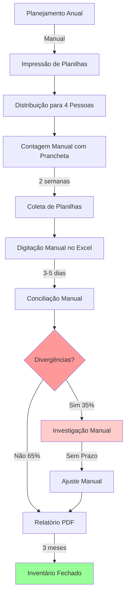
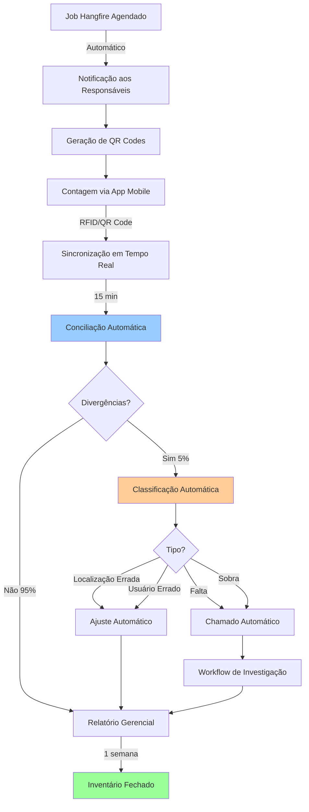

# Jornada 6: Auditoria e Integrações

**Autor:** ALC (alc.dev.br)
**Data:** 2026-01-12
**Versão:** 1.0
**Status:** Vigente

---

## 1. Visão Geral da Jornada

A **Jornada 6: Auditoria e Integrações** representa a camada de controle e conformidade do IControlIT, garantindo que os dados do sistema reflitam a realidade física da operação de TI. Diferente das jornadas anteriores, esta é a menor jornada em número de processos (apenas 1 processo), mas de criticidade máxima para conformidade regulatória e auditoria externa.

### 1.1. Objetivo da Jornada

Estabelecer mecanismos de auditoria física de ativos com automação completa do ciclo de inventário: agendamento, contagem, conciliação, resolução de divergências e geração de relatórios de conformidade.

### 1.2. Escopo da Jornada

Esta jornada abrange exclusivamente o processo de **Inventário Cíclico**, que inclui:

- Agendamento automático de contagens periódicas
- Contagem física com tecnologias modernas (QR Code, RFID)
- Conciliação automática entre inventário lógico (sistema) e físico (real)
- Detecção e classificação de divergências
- Workflow de resolução de não-conformidades
- Geração de relatórios gerenciais e de conformidade
- Integração com processos de gestão de ativos, chamados e auditoria de operações

### 1.3. Criticidade

**Alta Criticidade:** A Jornada de Auditoria é fundamental para:

- **Conformidade SOX (Sarbanes-Oxley):** Controle de ativos de TI para empresas de capital aberto
- **Conformidade ISO 27001:** Gestão de segurança da informação (inventário de ativos críticos)
- **LGPD:** Rastreamento de dispositivos que processam dados pessoais
- **Auditoria Externa:** Evidências para auditorias contábeis e regulatórias
- **Governança Interna:** Transparência e controle sobre patrimônio de TI
- **Gestão de Riscos:** Detecção precoce de perdas, roubos ou desvios de ativos

### 1.4. Evolução do Modelo

**Legado:**
- Inventário anual massivo (2 semanas de trabalho manual)
- Planilhas Excel impressas com checkboxes manuais
- Conciliação manual demorada (3-5 dias)
- Sem rastreamento de responsáveis
- Taxa de conformidade: 65% (35% de divergências não resolvidas)
- Fechamento do inventário: 3 meses após contagem

**Moderno:**
- Inventário trimestral automatizado (1-2 dias de trabalho)
- App mobile com QR Code/RFID
- Conciliação automática em 15 minutos
- Rastreamento completo de ciclo de vida
- Taxa de conformidade: 95% (5% de divergências resolvidas rapidamente)
- Fechamento do inventário: 1 semana após contagem

### 1.5. Processos da Jornada

| Código | Nome do Processo | RF | Criticidade | Página |
|--------|------------------|-----|-------------|--------|
| **PRO-AUD-001** | Inventário Cíclico | RF068 | Alta | Seção 2 |

---

## 2. PRO-AUD-001: Inventário Cíclico

### 2.1. Identificação do Processo

- **Código:** PRO-AUD-001
- **Nome:** Inventário Cíclico
- **RF Envolvido:** RF068
- **Área:** Auditoria e Integrações
- **Criticidade:** Alta
- **Frequência de Execução:** Trimestral (configurável: mensal, semestral, anual)
- **Tempo Médio de Execução:** 1-2 dias (contagem) + 1 semana (resolução de divergências)
- **SLA Interno:** 7 dias para fechamento completo do inventário

### 2.2. Descrição do Processo

O **Inventário Cíclico** é o processo de auditoria física de ativos de TI com contagem periódica automática, conciliação entre inventário lógico (sistema) e físico (real), detecção de divergências e geração de relatórios de não-conformidades. É um processo crítico para conformidade regulatória, controle patrimonial e gestão de riscos.

### 2.3. Objetivo do Processo

- Garantir conformidade entre inventário lógico (sistema) e físico (real)
- Detectar ativos faltantes, sobrantes ou alocados incorretamente
- Manter taxa de conformidade acima de 95%
- Gerar evidências para auditorias externas (SOX, ISO 27001)
- Atualizar automaticamente localização e alocação de ativos
- Identificar padrões de perdas ou desvios

### 2.4. Diagrama BPMN

#### 2.4.1. Modelo Legado (AS-IS)

**Problemas do Modelo Legado:**

1. **Frequência Inadequada:** Inventário anual (desvios não detectados por 12 meses)
2. **Intensivo em Mão de Obra:** 4 pessoas dedicadas por 2 semanas (320 horas)
3. **Propenso a Erros:** Digitação manual, planilhas perdidas, checkboxes ilegíveis
4. **Conciliação Lenta:** 3-5 dias para processar 2000+ ativos manualmente
5. **Baixa Taxa de Conformidade:** 65% (35% de divergências não investigadas)
6. **Sem Rastreamento:** Não sabe quem contou, quando contou, onde estava
7. **Fechamento Demorado:** 3 meses entre contagem e relatório final
8. **Sem Integração:** Ajustes manuais no sistema de ativos (duplo trabalho)

#### 2.4.2. Modelo Moderno (TO-BE)

**Melhorias do Modelo Moderno:**

1. **Automação Completa:** Job Hangfire agenda e notifica automaticamente
2. **Tecnologia Moderna:** QR Code e RFID (contagem 10x mais rápida)
3. **Sincronização em Tempo Real:** Dados validados durante a contagem
4. **Conciliação Instantânea:** 15 minutos para processar 2000+ ativos
5. **Alta Taxa de Conformidade:** 95% (5% de divergências rapidamente resolvidas)
6. **Rastreamento Completo:** Quem, quando, onde, como para cada contagem
7. **Fechamento Rápido:** 1 semana entre contagem e relatório final
8. **Integração Nativa:** Ajustes automáticos no sistema de ativos

### 2.5. Atores Envolvidos

| Ator | Papel | Responsabilidades |
|------|-------|-------------------|
| **Job Hangfire** | Sistema | Agendar inventários, disparar notificações, executar conciliação |
| **Gestor de TI** | Responsável | Planejar cronograma, revisar relatórios, aprovar ajustes críticos |
| **Analista de Inventário** | Executor | Realizar contagens, investigar divergências, resolver não-conformidades |
| **Facilities** | Executor | Contar ativos em áreas físicas (CPD, salas, almoxarifado) |
| **Usuário Final** | Colaborador | Confirmar posse de ativos em home office |
| **Sistema de Ativos** | Sistema | Fornecer inventário lógico, receber ajustes automáticos |
| **Sistema de Chamados** | Sistema | Receber abertura automática de chamados para investigação |
| **Auditor Externo** | Stakeholder | Revisar relatórios de conformidade para auditoria (SOX, ISO) |

### 2.6. Fluxo Principal

#### Etapa 1: Agendamento Automático

**Descrição:**
O Job Hangfire executa diariamente às 8h e verifica se há inventários agendados para iniciar. Quando detecta um inventário devido (trimestral, semestral, anual), dispara o processo automaticamente.

**Entradas:**
- Cronograma de inventários (configurado pelo Gestor de TI)
- Localizações a serem inventariadas (matriz, filiais, home office)
- Lista de ativos ativos (não descartados)

**Ações:**
1. Job verifica agenda de inventários
2. Identifica localizações devido para contagem
3. Gera lista de ativos esperados por localização
4. Cria QR Codes para ativos sem código (novos, transferidos)
5. Envia notificação por e-mail aos responsáveis

**Saídas:**
- Inventário criado no sistema (status: Agendado)
- QR Codes gerados e prontos para impressão
- Notificações enviadas (Gestor de TI, Analistas, Facilities)

**Automações:**
- Disparo automático baseado em cronograma
- Geração automática de QR Codes
- Notificação automática por e-mail

**RN Aplicáveis:**
- RN-AUD-001: Inventário trimestral obrigatório para ativos críticos
- RN-AUD-002: Inventário semestral obrigatório para ativos comuns

---

#### Etapa 2: Contagem Física

**Descrição:**
Analistas e equipe de Facilities realizam contagem física de ativos utilizando app mobile. A contagem pode ser feita por leitura de QR Code (modo individual) ou RFID (modo massivo para centenas de ativos).

**Entradas:**
- Lista de ativos esperados (inventário lógico)
- QR Codes impressos (adesivos nos ativos)
- App mobile instalado (Android, iOS)
- Leitor RFID portátil (opcional, para contagens massivas)

**Ações:**
1. Analista acessa app mobile e seleciona inventário
2. Escaneia QR Code do ativo (ou lê tag RFID)
3. Sistema valida:
   - Ativo existe no sistema?
   - Localização corresponde ao esperado?
   - Usuário corresponde ao esperado?
4. Analista confirma ou corrige informações (localização, usuário)
5. Sistema registra contagem com timestamp e GPS

**Saídas:**
- Ativos contados (status: Encontrado)
- Localização e usuário confirmados ou corrigidos
- Registro de contagem (quem, quando, onde, coordenadas GPS)

**Automações:**
- Validação em tempo real (ativo existe?)
- Detecção automática de divergências (localização/usuário errado)
- Modo offline (sincronização posterior quando sem conexão)

**RN Aplicáveis:**
- RN-AUD-003: Contagem obrigatória com identificação do contador
- RN-AUD-004: GPS obrigatório para contagens em campo (home office, filiais)

---

#### Etapa 3: Conciliação Automática

**Descrição:**
Após conclusão da contagem física, o sistema executa conciliação automática entre inventário lógico (esperado) e físico (encontrado), identificando 4 tipos de divergências.

**Entradas:**
- Inventário lógico (ativos esperados no sistema)
- Inventário físico (ativos contados)

**Ações:**
1. Sistema compara inventário lógico vs físico
2. Classifica ativos em:
   - **Conformes:** Encontrados na localização e usuário corretos
   - **Falta:** No sistema mas não encontrados fisicamente
   - **Sobra:** Encontrados fisicamente mas não no sistema
   - **Localização Errada:** Encontrados mas em local diferente do sistema
   - **Usuário Errado:** Encontrados mas com usuário diferente do sistema
3. Calcula taxa de conformidade (% ativos conformes / total)
4. Gera relatório preliminar de divergências

**Saídas:**
- Taxa de conformidade (ex: 95%)
- Lista de divergências classificadas por tipo
- Relatório preliminar de não-conformidades

**Automações:**
- Matching automático por Patrimônio ou Serial Number
- Classificação automática de divergências
- Cálculo automático de taxa de conformidade

**RN Aplicáveis:**
- RN-AUD-005: Taxa de conformidade mínima: 90% (meta: 95%)
- RN-AUD-006: Divergências críticas (falta) abrem chamado automático

---

#### Etapa 4: Resolução de Divergências

**Descrição:**
Divergências são tratadas de forma diferenciada: divergências simples (localização/usuário errado) são corrigidas automaticamente após aprovação; divergências críticas (falta/sobra) disparam workflow de investigação.

**Entradas:**
- Lista de divergências classificadas
- Histórico de movimentações do ativo (últimos 6 meses)

**Ações:**

**Para Divergências Simples (Localização/Usuário Errado):**
1. Sistema identifica divergência como "simples"
2. Gera proposta de ajuste (atualizar localização/usuário no sistema)
3. Notifica Gestor de TI para aprovação
4. Após aprovação: atualiza automaticamente cadastro do ativo

**Para Divergências Críticas (Falta/Sobra):**
1. Sistema identifica divergência como "crítica"
2. Abre chamado automaticamente (categoria: Auditoria de Ativos)
3. Chamado atribuído ao Gestor de TI
4. Analista investiga causas raízes:
   - Roubo/furto?
   - Perda (extravio)?
   - Transferência não documentada?
   - Descarte não documentado?
   - Ativo emprestado (temporário)?
5. Analista registra conclusão no chamado
6. Gestor de TI aprova ação corretiva:
   - **Falta:** Baixa do ativo (após 3 inventários consecutivos sem localização)
   - **Sobra:** Cadastro do ativo (se for ativo legítimo não cadastrado)

**Saídas:**
- Divergências simples resolvidas (atualização automática)
- Chamados abertos para divergências críticas
- Investigações concluídas com causas raízes documentadas
- Ações corretivas aprovadas e executadas

**Automações:**
- Classificação automática de divergências (simples vs crítica)
- Abertura automática de chamados para divergências críticas
- Notificação automática ao Gestor de TI para aprovações
- Atualização automática de cadastro após aprovação

**RN Aplicáveis:**
- RN-AUD-007: Baixa de ativo somente após 3 inventários consecutivos sem localização
- RN-AUD-008: Divergências críticas exigem investigação formal com registro

---

#### Etapa 5: Geração de Relatórios

**Descrição:**
Após resolução de todas as divergências, o sistema gera relatórios gerenciais e de conformidade para auditorias externas. Os relatórios são disponibilizados em PDF, Excel e visualizações interativas (Power BI).

**Entradas:**
- Inventário conciliado (conformes + divergências resolvidas)
- Histórico de inventários anteriores (comparativo temporal)
- Chamados de investigação finalizados

**Ações:**
1. Sistema gera 5 tipos de relatório:

**A) Relatório de Conformidade Geral:**
   - Taxa de conformidade (%)
   - Total de ativos esperados vs encontrados
   - Distribuição de divergências por tipo
   - Comparativo com inventário anterior

**B) Top 10 Ativos Mais Perdidos:**
   - Ranking de ativos com maior histórico de divergências
   - Padrão de localização (onde costumam ser encontrados)
   - Recomendações de controle

**C) Mapa de Calor de Divergências:**
   - Visualização por localização (matriz, filiais, home office)
   - Identificação de locais com maior taxa de não-conformidade
   - Drill-down por sala, andar, prédio

**D) Relatório de Investigações:**
   - Lista de divergências críticas investigadas
   - Causas raízes identificadas
   - Ações corretivas tomadas
   - Responsáveis envolvidos

**E) Relatório de Conformidade Regulatória (SOX/ISO):**
   - Evidências para auditoria externa
   - Controles implementados
   - Rastreamento completo de ciclo de vida
   - Assinaturas digitais de aprovadores

**Saídas:**
- 5 relatórios gerados em PDF e Excel
- Dashboard interativo em Power BI
- Evidências para auditoria externa (pasta compactada)

**Automações:**
- Geração automática de todos os relatórios (1 clique)
- Exportação automática em múltiplos formatos (PDF, Excel, Power BI)
- Envio automático por e-mail aos stakeholders

**RN Aplicáveis:**
- RN-AUD-009: Relatórios gerenciais disponíveis em até 24h após fechamento
- RN-AUD-010: Relatórios de conformidade regulatória assinados digitalmente

---

#### Etapa 6: Fechamento do Inventário

**Descrição:**
Após geração de todos os relatórios e aprovação do Gestor de TI, o inventário é formalmente fechado. O sistema registra o fechamento, arquiva evidências e agenda o próximo inventário.

**Entradas:**
- Relatórios gerados
- Aprovação do Gestor de TI (assinatura digital)

**Ações:**
1. Gestor de TI revisa relatórios gerenciais
2. Valida resolução de todas as divergências críticas
3. Assina digitalmente o fechamento do inventário
4. Sistema registra:
   - Data/hora de fechamento
   - Assinatura digital do aprovador
   - Taxa de conformidade final
   - Total de divergências resolvidas
5. Sistema arquiva evidências (7 anos de retenção)
6. Sistema agenda próximo inventário (trimestral, semestral, anual)

**Saídas:**
- Inventário fechado oficialmente (status: Concluído)
- Evidências arquivadas (PDF assinado + anexos)
- Próximo inventário agendado automaticamente
- Notificação de conclusão enviada aos stakeholders

**Automações:**
- Assinatura digital com certificado A1/A3
- Arquivamento automático em storage seguro
- Agendamento automático do próximo inventário
- Notificação automática de conclusão

**RN Aplicáveis:**
- RN-AUD-011: Fechamento obrigatório pelo Gestor de TI (não pode ser analista)
- RN-AUD-012: Evidências retidas por 7 anos (compliance SOX)

---

### 2.7. Automações do Processo

| Código | Automação | Descrição | Tecnologia |
|--------|-----------|-----------|------------|
| **AUTO-AUD-001** | Agendamento Automático | Job Hangfire dispara inventários baseado em cronograma configurável | Hangfire + Cron Expression |
| **AUTO-AUD-002** | Geração de QR Codes | Criação automática de QR Codes para ativos sem código ou com código danificado | QRCoder (C#) |
| **AUTO-AUD-003** | Notificação de Início | E-mail automático aos responsáveis quando inventário é agendado | SendGrid |
| **AUTO-AUD-004** | Validação em Tempo Real | Validação durante contagem: ativo existe? Localização correta? Usuário correto? | API Backend + App Mobile |
| **AUTO-AUD-005** | Conciliação Automática | Matching automático inventário lógico vs físico em 15 minutos | SQL Server + LINQ |
| **AUTO-AUD-006** | Classificação de Divergências | Identificação automática de 4 tipos de divergências (falta, sobra, localização, usuário) | Algoritmo C# |
| **AUTO-AUD-007** | Abertura de Chamados | Chamado automático para divergências críticas (falta/sobra) | Integração PRO-SVC-003 |
| **AUTO-AUD-008** | Ajuste Automático | Atualização automática de localização/usuário após aprovação | Integração PRO-FAC-001 |
| **AUTO-AUD-009** | Geração de Relatórios | 5 relatórios gerenciais + dashboard Power BI em 1 clique | ReportGenerator + Power BI API |
| **AUTO-AUD-010** | Agendamento do Próximo | Agendamento automático do próximo inventário após fechamento | Hangfire |

### 2.8. Integrações com Outros Processos

| Processo Integrado | Direção | Dados Trocados | Finalidade |
|-------------------|---------|----------------|------------|
| **PRO-FAC-001** (Gestão de Ativos) | Bidirecional | Inventário lógico (entrada) + Ajustes de localização/usuário (saída) | Fornecer lista de ativos esperados e atualizar cadastro automaticamente após inventário |
| **PRO-SVC-003** (Gestão de Chamados) | Saída | Divergências críticas (falta/sobra) | Abertura automática de chamados para investigação de não-conformidades |
| **PRO-INF-004** (Auditoria de Operações) | Saída | Registro de todas as contagens, ajustes e aprovações | Rastreamento completo de quem, quando, onde, como para auditoria |
| **PRO-FAC-002** (Custos Fixos) | Saída | Ativos não localizados (baixa) | Impacto financeiro de ativos perdidos/roubados no cálculo de TCO |

### 2.9. Regras de Negócio Principais

| Código | Regra | Criticidade | Impacto se Violada |
|--------|-------|-------------|-------------------|
| **RN-AUD-001** | Inventário trimestral obrigatório para ativos críticos (servidores, storages, switches core) | Alta | Não-conformidade SOX/ISO 27001 |
| **RN-AUD-002** | Inventário semestral obrigatório para ativos comuns (notebooks, desktops, monitores) | Média | Perda de controle patrimonial |
| **RN-AUD-003** | Contagem obrigatória com identificação do contador (rastreamento de responsabilidade) | Alta | Falta de auditabilidade |
| **RN-AUD-004** | GPS obrigatório para contagens em campo (home office, filiais remotas) | Média | Impossibilidade de validar localização real |
| **RN-AUD-005** | Taxa de conformidade mínima: 90% (meta: 95%) | Alta | Indicador de processo de gestão de ativos falho |
| **RN-AUD-006** | Divergências críticas (falta) abrem chamado automático (não pode ser ignorada) | Alta | Perda de ativos não investigada |
| **RN-AUD-007** | Baixa de ativo somente após 3 inventários consecutivos sem localização | Alta | Baixa prematura de ativos temporariamente perdidos |
| **RN-AUD-008** | Divergências críticas exigem investigação formal com registro de causa raiz | Alta | Falta de aprendizado organizacional |
| **RN-AUD-009** | Relatórios gerenciais disponíveis em até 24h após fechamento do inventário | Média | Atraso na tomada de decisão |
| **RN-AUD-010** | Relatórios de conformidade regulatória assinados digitalmente pelo Gestor de TI | Alta | Evidências não aceitas em auditoria externa |
| **RN-AUD-011** | Fechamento obrigatório pelo Gestor de TI (não pode ser analista) | Alta | Falta de governança e segregação de funções |
| **RN-AUD-012** | Evidências retidas por 7 anos (compliance SOX) | Alta | Multas regulatórias em caso de auditoria |

### 2.10. Cenários de Exceção

#### Cenário 1: Ativo Não Localizado em 3 Inventários Consecutivos

**Situação:**
Ativo consta no sistema como ativo, mas não foi encontrado em 3 inventários consecutivos (9 meses para inventário trimestral).

**Ações:**
1. Sistema identifica padrão (3 inventários sem localização)
2. Sistema sugere baixa automática do ativo
3. Gestor de TI revisa histórico:
   - Último usuário responsável
   - Última localização conhecida
   - Movimentações nos últimos 12 meses
4. Gestor de TI decide:
   - **Baixa:** Se evidências indicam perda definitiva (roubo, extravio)
   - **Manter:** Se há indicação de recuperação (empréstimo, transferência não documentada)
5. Se baixa: Sistema registra motivo (perda, roubo, extravio) e atualiza contabilidade

**Impacto Contábil:**
- Baixa patrimonial
- Ajuste de depreciação acumulada
- Perda contábil (se não houver seguro)

---

#### Cenário 2: Sobra de Ativo (Encontrado mas Não Cadastrado)

**Situação:**
Ativo encontrado fisicamente durante inventário, mas não consta no sistema de ativos (sobra).

**Ações:**
1. Sistema identifica sobra durante conciliação
2. Abre chamado automático (categoria: Cadastro de Ativo Não Documentado)
3. Analista investiga:
   - Ativo é legítimo? (comprado pela empresa?)
   - Ativo é pessoal do usuário? (notebook particular?)
   - Ativo foi descartado mas voltou? (transferido de volta?)
4. Se legítimo: Analista cadastra ativo no sistema com dados coletados
5. Se pessoal: Registra como "Ativo Particular" (não gerenciado)
6. Se descartado voltou: Reativa cadastro original

---

#### Cenário 3: Localização Errada em Massa (Mudança de Layout)

**Situação:**
50+ ativos aparecem com localização errada durante inventário (indicação de mudança de layout não documentada).

**Ações:**
1. Sistema detecta padrão (múltiplos ativos do mesmo local antigo para mesmo local novo)
2. Gera alerta de "Possível Mudança de Layout Não Documentada"
3. Notifica Gestor de TI e Facilities
4. Gestor de TI confirma mudança de layout
5. Sistema oferece atualização em lote:
   - "Atualizar todos os ativos de Sala 201 para Sala 305?"
6. Após aprovação: Atualização em lote automática
7. Sistema registra evento de mudança de layout para histórico

---

#### Cenário 4: Inventário Interrompido (Falta de Pessoal)

**Situação:**
Inventário iniciado mas não concluído no prazo (falta de pessoal, priorização de outras tarefas).

**Ações:**
1. Sistema detecta inventário "Em Andamento" há mais de 7 dias
2. Envia alerta ao Gestor de TI (escalação)
3. Gestor de TI pode:
   - **Estender Prazo:** Adicionar 7 dias ao inventário
   - **Congelar:** Pausar inventário temporariamente
   - **Cancelar:** Cancelar inventário e reagendar
4. Se estendido: Sistema continua monitorando
5. Se congelado: Sistema para alertas até reativação
6. Se cancelado: Sistema agenda novo inventário automaticamente

---

#### Cenário 5: Divergência de Usuário (Ativo com Pessoa Errada)

**Situação:**
Ativo cadastrado para usuário A, mas encontrado fisicamente com usuário B durante inventário.

**Ações:**
1. Sistema identifica divergência de usuário
2. Classifica como divergência simples (não crítica)
3. Gera proposta de ajuste: "Transferir ativo de [Usuário A] para [Usuário B]?"
4. Notifica ambos os usuários por e-mail:
   - **Usuário A:** "Você ainda possui este ativo? Se não, confirme transferência"
   - **Usuário B:** "Você recebeu este ativo recentemente?"
5. Se ambos confirmam: Atualização automática
6. Se há conflito: Escala para Gestor de TI resolver manualmente

---

### 2.11. Comparativo Legado vs Moderno

| Aspecto | Legado | Moderno | Ganho |
|---------|--------|---------|-------|
| **Frequência** | Anual | Trimestral (configurável) | 4x mais frequente |
| **Mão de Obra** | 4 pessoas x 2 semanas (320h) | 2 pessoas x 2 dias (32h) | 90% redução |
| **Tecnologia** | Planilhas Excel + pranchetas | App mobile + QR Code/RFID | 10x mais rápido |
| **Conciliação** | Manual (3-5 dias) | Automática (15 min) | 99% redução |
| **Taxa de Conformidade** | 65% | 95% | +30 pontos percentuais |
| **Rastreamento** | Sem rastreamento | Completo (quem, quando, onde, GPS) | Auditabilidade total |
| **Fechamento** | 3 meses | 1 semana | 92% redução |
| **Relatórios** | PDF manual | 5 relatórios automáticos + Power BI | Decisões em tempo real |
| **Integração** | Sem integração | 4 processos integrados | Redução de duplo trabalho |
| **Erros** | 15-20% (digitação, planilhas perdidas) | <1% (validação em tempo real) | 95% redução |

### 2.12. Indicadores de Sucesso (KPIs)

Embora métricas não façam parte do escopo deste documento, os seguintes indicadores são monitorados para avaliação contínua do processo:

- Taxa de Conformidade Geral (meta: ≥ 95%)
- Tempo Médio de Fechamento (meta: ≤ 7 dias)
- Taxa de Divergências Críticas (meta: ≤ 5%)
- Taxa de Resolução de Divergências (meta: 100%)
- Tempo Médio de Contagem por Ativo (meta: ≤ 30 segundos)
- Taxa de Ativos com 3+ Inventários sem Localização (meta: 0%)

### 2.13. Dependências Tecnológicas

- **Backend:** API REST em .NET 6+ (handlers de inventário)
- **Frontend:** App mobile em Ionic/Angular (iOS + Android)
- **QR Code:** Biblioteca QRCoder (C#)
- **RFID:** SDK do fabricante de leitores RFID (ex: Zebra, Honeywell)
- **GPS:** Serviços de localização nativos (iOS, Android)
- **Job Scheduling:** Hangfire (agendamento de inventários)
- **Relatórios:** ReportGenerator + Power BI API
- **Storage:** Azure Blob Storage (armazenamento de evidências por 7 anos)
- **Assinatura Digital:** Certificado A1/A3 (ICP-Brasil)

### 2.14. Conformidade Regulatória

| Regulação | Requisito | Como o Processo Atende |
|-----------|-----------|------------------------|
| **SOX (Sarbanes-Oxley)** | Controle de ativos de TI para empresas de capital aberto | Inventários periódicos + rastreamento completo + evidências assinadas digitalmente |
| **ISO 27001** | Gestão de segurança da informação (inventário de ativos críticos) | Inventário trimestral de ativos críticos + classificação de divergências |
| **LGPD** | Rastreamento de dispositivos que processam dados pessoais | GPS obrigatório em contagens + registro de localização real |
| **NBC TG 27 (Contabilidade)** | Controle patrimonial de imobilizado | Baixa controlada após 3 inventários + impacto contábil automático |

---

## 3. Matriz de Processos da Jornada

| Código | Nome do Processo | RF | Criticidade | Frequência | Tempo Médio | Automações | Integrações |
|--------|------------------|-----|-------------|------------|-------------|------------|-------------|
| **PRO-AUD-001** | Inventário Cíclico | RF068 | Alta | Trimestral | 1-2 dias + 1 semana | 10 automações | 4 processos |

**Legenda:**
- **Criticidade Alta:** Processo crítico para conformidade regulatória
- **Frequência Trimestral:** Processo executado 4x ao ano (configurável)
- **Tempo Médio:** 1-2 dias para contagem + 1 semana para resolução de divergências
- **Automações:** 10 automações principais (agendamento, conciliação, relatórios, etc)
- **Integrações:** 4 processos integrados (Gestão de Ativos, Chamados, Auditoria de Operações, Custos Fixos)

---

## 4. Glossário

| Termo | Definição |
|-------|-----------|
| **Conciliação** | Processo de comparação entre inventário lógico (sistema) e inventário físico (real) para identificar divergências |
| **Divergência** | Diferença entre o que o sistema registra e o que foi encontrado fisicamente durante o inventário |
| **Falta** | Ativo consta no sistema como ativo, mas não foi encontrado fisicamente durante o inventário |
| **Sobra** | Ativo encontrado fisicamente durante inventário, mas não consta no sistema de ativos (não cadastrado) |
| **GPS (Global Positioning System)** | Sistema de localização por satélite utilizado para registrar coordenadas geográficas durante contagem em campo |
| **Inventário Cíclico** | Processo de auditoria física de ativos com contagem periódica (trimestral, semestral, anual) em vez de anual massiva |
| **Inventário Físico** | Lista de ativos efetivamente encontrados durante contagem física |
| **Inventário Lógico** | Lista de ativos esperados conforme registros do sistema de gestão de ativos |
| **QR Code (Quick Response Code)** | Código de barras bidimensional utilizado para identificação rápida de ativos durante contagem |
| **RFID (Radio Frequency Identification)** | Tecnologia de identificação por radiofrequência utilizada para contagem massiva de ativos (centenas por hora) |
| **Taxa de Conformidade** | Percentual de ativos encontrados na localização e com o usuário correto em relação ao total de ativos esperados (meta: ≥ 95%) |
| **Workflow de Investigação** | Fluxo de trabalho estruturado para investigar causas raízes de divergências críticas (roubo, perda, transferência não documentada) |
| **Baixa de Ativo** | Processo de retirar ativo do inventário ativo, geralmente após confirmação de perda definitiva (roubo, extravio, descarte) |
| **Chamado de Auditoria** | Chamado aberto automaticamente pelo sistema para investigar divergências críticas identificadas durante inventário |
| **Evidência de Auditoria** | Documentação comprobatória (relatórios, logs, assinaturas digitais) retida por 7 anos para conformidade regulatória |
| **Job Hangfire** | Serviço de agendamento de tarefas em segundo plano utilizado para disparar inventários automaticamente |
| **Localização Errada** | Ativo encontrado fisicamente, mas em local diferente do registrado no sistema (ex: sistema diz Sala 201, real está em Sala 305) |
| **Usuário Errado** | Ativo encontrado fisicamente, mas com pessoa diferente da registrada no sistema (ex: sistema diz João, real está com Maria) |
| **Relatório de Conformidade** | Relatório gerencial assinado digitalmente pelo Gestor de TI contendo taxa de conformidade, divergências e ações corretivas |
| **SOX (Sarbanes-Oxley)** | Lei federal dos EUA que estabelece controles rigorosos de auditoria para empresas de capital aberto (aplicável a multinacionais) |
| **ISO 27001** | Norma internacional de gestão de segurança da informação que exige inventário de ativos críticos |
| **Matching Automático** | Algoritmo que compara inventário lógico vs físico por Patrimônio ou Serial Number para identificar correspondências |
| **Timestamp** | Registro de data e hora de um evento (contagem, ajuste, aprovação) para rastreamento de auditoria |
| **Drill-Down** | Capacidade de navegar de visão resumida para detalhada em relatórios (ex: de taxa geral para divergências por sala) |

---

## 5. Referências Cruzadas

### 5.1. Processos Relacionados

- **PRO-FAC-001 (Gestão de Ativos):** Fornece inventário lógico e recebe ajustes automáticos de localização/usuário
- **PRO-SVC-003 (Gestão de Chamados):** Recebe abertura automática de chamados para investigação de divergências críticas
- **PRO-INF-004 (Auditoria de Operações):** Registra todos os eventos de inventário para rastreamento de auditoria
- **PRO-FAC-002 (Custos Fixos):** Recebe informações de ativos não localizados para ajuste de TCO

### 5.2. Requisitos Funcionais

- **RF068:** Inventário Cíclico (requisito funcional implementado por este processo)

### 5.3. Documentação Técnica

- `D:\IC2_Governanca\governanca\ARCHITECTURE.md`: Stack tecnológico e padrões arquiteturais
- `D:\IC2_Governanca\governanca\CONVENTIONS.md`: Nomenclatura e padrões de código
- `D:\IC2_Governanca\governanca\COMPLIANCE.md`: Regras de validação e conformidade

### 5.4. Contratos de Execução

- `D:\IC2_Governanca\governanca\contracts\desenvolvimento\execucao\backend-criacao.md`: Contrato para implementação de handlers de inventário
- `D:\IC2_Governanca\governanca\contracts\desenvolvimento\execucao\frontend-criacao.md`: Contrato para implementação de app mobile de contagem
- `D:\IC2_Governanca\governanca\contracts\auditoria\conformidade.md`: Contrato para auditoria de conformidade do processo

---

## 6. Controle de Versão

| Versão | Data | Autor | Alterações |
|--------|------|-------|------------|
| 1.0 | 2026-01-12 | ALC | Criação inicial do documento - Jornada 6: Auditoria e Integrações com processo PRO-AUD-001 (Inventário Cíclico) |

---

**Documento gerado em:** 2026-01-12
**Autor:** ALC (alc.dev.br)
**Localização:** `D:\IC2_Governanca\documentacao\Processos\06-Jornada-Auditoria.md`

---

**Notas Finais:**

Este documento é parte da série de documentação modular de processos de negócio do IControlIT. Embora seja a menor jornada em número de processos (apenas 1 processo), o **PRO-AUD-001: Inventário Cíclico** é de criticidade máxima para conformidade regulatória (SOX, ISO 27001, LGPD) e controle patrimonial.

A evolução do modelo legado (inventário anual manual com 65% de conformidade) para o modelo moderno (inventário trimestral automatizado com 95% de conformidade) representa um ganho de 90% em redução de mão de obra, 99% em redução de tempo de conciliação e 30 pontos percentuais em taxa de conformidade.

Para informações sobre outros processos, consulte:
- **Jornada 1:** `D:\IC2_Governanca\documentacao\Processos\01-Jornada-Servicos.md`
- **Jornada 2:** `D:\IC2_Governanca\documentacao\Processos\02-Jornada-Facilities.md`
- **Jornada 3:** `D:\IC2_Governanca\documentacao\Processos\03-Jornada-Usuarios.md`
- **Jornada 4:** `D:\IC2_Governanca\documentacao\Processos\04-Jornada-Infraestrutura.md`
- **Jornada 5:** `D:\IC2_Governanca\documentacao\Processos\05-Jornada-Administrativo.md`
- **Jornada 6:** `D:\IC2_Governanca\documentacao\Processos\06-Jornada-Auditoria.md` (este documento)
