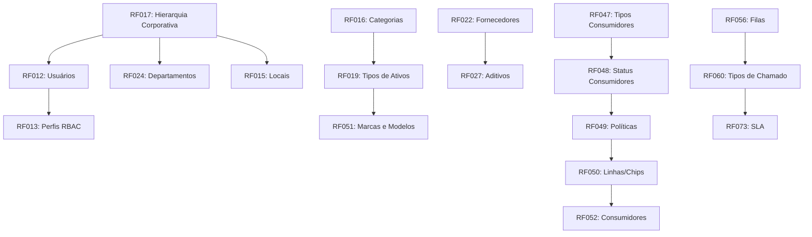

# FUNCIONALIDADES DE GESTÃO E CADASTROS - ICONTROLIT

**Versão:** 2.0
**Autor:** ALC (alc.dev.br)
**Data:** 2026-01-12
**Status:** Vigente

---

## 1. INTRODUÇÃO

### 1.1 Objetivo deste Documento

Este documento explica por que **72 Requisitos Funcionais (RFs)** do IControlIT **NÃO foram documentados como processos de negócio** nas jornadas 1-6.

**Razão:** Estes RFs são **cadastros simples** ou **funcionalidades de suporte** que:
- ✅ Não possuem workflows multi-etapas complexos
- ✅ Não requerem automações significativas
- ✅ São operações CRUD básicas (Create, Read, Update, Delete)
- ✅ Não envolvem state machines ou transições de estado
- ✅ Não requerem integrações complexas com sistemas externos

**Nota:** Isso **NÃO significa** que esses RFs são menos importantes. Eles são **essenciais** para o funcionamento do sistema, mas **tecnicamente simples** de implementar comparados aos 38 processos documentados.

### 1.2 Critérios de Exclusão

Um RF foi excluído da documentação de processos se atender a **pelo menos 2 dos seguintes critérios**:

| Critério | Descrição |
|----------|-----------|
| **CRUD Simples** | Apenas Create, Read, Update, Delete sem lógica adicional |
| **Sem Workflow** | Não há etapas sequenciais ou paralelas |
| **Sem Automações** | Não dispara jobs automáticos, notificações ou cálculos complexos |
| **Sem Integrações** | Não se integra com sistemas externos (SEFAZ, ERPs, APIs terceiras) |
| **Sem State Machine** | Não possui estados e transições (Novo → Aprovado → Finalizado) |
| **Dados Mestre** | Apenas armazena dados de referência (categorias, tipos, status) |
| **UI Básica** | Interface simples de formulário + grid de listagem |

---

## 2. CADASTROS BASE (17 RFs)

Cadastros de dados mestres do sistema, usados como referência por outros processos.

### RF015: Gestão de Locais/Endereços

**Tipo:** Cadastro CRUD
**Descrição:** Cadastro de endereços (rua, cidade, CEP, país) para uso em clientes, fornecedores, ativos.
**Por que não é processo:** CRUD simples, sem workflow, dados de referência para vínculo com entidades.
**Usado por:** PRO-INF-006 (Clientes), PRO-FAC-001 (Ativos), PRO-AUD-001 (Inventário)

### RF016: Gestão de Categorias de Ativos

**Tipo:** Cadastro hierárquico
**Descrição:** Árvore de categorias (Hardware → Notebooks → Dell Latitude) para classificação de ativos.
**Por que não é processo:** CRUD hierárquico simples, navegação em árvore, dados de referência.
**Usado por:** PRO-FAC-001 (Gestão de Ativos), PRO-AUD-001 (Inventário)

### RF017: Hierarquia Corporativa

**Tipo:** Cadastro hierárquico multi-nível
**Descrição:** Estrutura organizacional (Holding → Empresa → Filial → Departamento → Setor) com relacionamentos parent-child.
**Por que não é processo:** CRUD hierárquico, navegação organizacional, dados de referência para multi-tenancy.
**Usado por:** TODOS os processos (contexto organizacional obrigatório)

### RF018: Gestão de Cargos

**Tipo:** Cadastro CRUD
**Descrição:** Cadastro de cargos (nome, descrição, nível hierárquico) para vínculo com colaboradores.
**Por que não é processo:** CRUD simples, dados de referência para RH.
**Usado por:** PRO-INF-006 (Colaboradores), PRO-SVC-001 (Service Desk - roteamento por cargo)

### RF019: Gestão de Tipos de Ativos

**Tipo:** Cadastro CRUD com templates
**Descrição:** Tipos de ativos (Notebook, Desktop, Servidor, Switch) com campos customizáveis.
**Por que não é processo:** CRUD com configuração de campos dinâmicos, mas sem workflow.
**Usado por:** PRO-FAC-001 (Gestão de Ativos), PRO-AUD-001 (Inventário)

### RF020: Gestão de Documentos e Anexos

**Tipo:** Upload/Download de arquivos
**Descrição:** Upload de PDFs, imagens, planilhas vinculados a contratos, ativos, chamados com armazenamento Azure Blob.
**Por que não é processo:** Operação técnica de armazenamento, sem workflow de aprovação ou versionamento complexo.
**Usado por:** PRO-FCT-001 (Contratos - anexos contratuais), PRO-SVC-001 (Chamados - evidências)

### RF022: Gestão de Fornecedores

**Tipo:** Cadastro CRUD
**Descrição:** Cadastro de fornecedores (CNPJ, razão social, contato, endereço) para contratos e compras.
**Por que não é processo:** CRUD básico com validação de CNPJ. O processo de homologação está em PRO-FCT-001.
**Usado por:** PRO-FCT-001 (Contratos), PRO-FAC-002 (Compras), PRO-TEL-004 (Operadoras)

### RF024: Gestão de Departamentos

**Tipo:** Cadastro CRUD
**Descrição:** Cadastro de departamentos (nome, centro de custo, gestor responsável) vinculado à hierarquia corporativa.
**Por que não é processo:** CRUD simples, dados de referência para alocação de custos.
**Usado por:** PRO-FCT-002 (Rateio), PRO-SVC-001 (Service Desk - roteamento)

### RF039: Gestão de Bilhetes

**Tipo:** Cadastro CRUD
**Descrição:** Cadastro de bilhetes telefônicos (CDR - Call Detail Records) para análise de consumo.
**Por que não é processo:** CRUD com importação CSV. O processo de análise está em PRO-TEL-002 (Gestão de Contas).
**Usado por:** PRO-TEL-002 (Gestão de Contas Telecom), PRO-FCT-003 (Contestação)

### RF041: Gestão de Estoque de Aparelhos

**Tipo:** Cadastro CRUD com controle quantitativo
**Descrição:** Estoque de aparelhos celulares (modelo, IMEI, quantidade, status: disponível/alocado/manutenção).
**Por que não é processo:** CRUD com controle de quantidade. O processo de movimentação está em PRO-FAC-001.
**Usado por:** PRO-TEL-001 (Telefonia Móvel), PRO-FAC-001 (Gestão de Ativos)

### RF043: Gestão de Endereços de Entrega

**Tipo:** Cadastro CRUD
**Descrição:** Cadastro de endereços alternativos para entrega de ativos (matriz, filiais, home office).
**Por que não é processo:** CRUD simples, dados de referência para logística.
**Usado por:** PRO-FAC-002 (Compras - endereço de entrega), PRO-TEL-001 (Entrega de chips)

### RF047: Gestão de Tipos de Consumidores

**Tipo:** Cadastro CRUD
**Descrição:** Tipos de consumidores telecom (Corporativo, VIP, Comum, Temporário) para classificação de linhas.
**Por que não é processo:** CRUD simples, dados de referência para políticas de consumo.
**Usado por:** PRO-TEL-001 (Telefonia Móvel), PRO-TEL-002 (Gestão de Contas)

### RF048: Gestão de Status de Consumidores

**Tipo:** Cadastro CRUD
**Descrição:** Status de consumidores telecom (Ativo, Suspenso, Cancelado, Bloqueado) para controle de ciclo de vida.
**Por que não é processo:** CRUD de estados. O workflow de transição está em PRO-TEL-001.
**Usado por:** PRO-TEL-001 (Telefonia Móvel - mudança de status)

### RF049: Gestão de Políticas de Consumidores

**Tipo:** Cadastro CRUD com regras
**Descrição:** Políticas de consumo telecom (franquia de dados, minutos, roaming permitido/bloqueado).
**Por que não é processo:** CRUD com configuração de regras. A aplicação está em PRO-TEL-002.
**Usado por:** PRO-TEL-001 (Telefonia Móvel), PRO-TEL-002 (Gestão de Contas - alertas)

### RF050: Gestão de Linhas/Chips/SIM

**Tipo:** Cadastro CRUD com rastreamento
**Descrição:** Cadastro de linhas telefônicas (número, ICCID, operadora, plano, usuário alocado).
**Por que não é processo:** CRUD com rastreamento de alocação. O processo de provisionamento está em PRO-TEL-001.
**Usado por:** PRO-TEL-001 (Telefonia Móvel), PRO-TEL-002 (Gestão de Contas)

### RF051: Gestão de Marcas e Modelos

**Tipo:** Cadastro CRUD hierárquico
**Descrição:** Cadastro de marcas (Dell, HP, Apple) e modelos (Latitude 5420, EliteBook 840) para ativos.
**Por que não é processo:** CRUD hierárquico simples (Marca → Modelo), dados de referência.
**Usado por:** PRO-FAC-001 (Gestão de Ativos), PRO-FAC-002 (Compras)

### RF052: Gestão de Consumidores

**Tipo:** Cadastro CRUD
**Descrição:** Cadastro de consumidores de serviços telecom (colaborador, tipo, política, linha vinculada).
**Por que não é processo:** CRUD com vínculo entre colaborador e linha. O processo de aprovisionamento está em PRO-TEL-001.
**Usado por:** PRO-TEL-001 (Telefonia Móvel), PRO-TEL-002 (Gestão de Contas)

---

## 3. GESTÃO DE PROCESSOS AUXILIARES (20 RFs)

Funcionalidades que complementam os processos principais, mas não são processos por si só.

### RF012: Gestão de Usuários do Sistema

**Tipo:** CRUD com RBAC
**Descrição:** Cadastro de usuários (nome, email, perfil, status, multi-tenancy) para acesso ao sistema.
**Por que não é processo:** CRUD básico com permissões. O processo complexo está em PRO-INF-007 (Login/Autenticação).
**Usado por:** TODOS os processos (autenticação obrigatória)

### RF013: Gestão de Perfis de Acesso (RBAC)

**Tipo:** CRUD com permissões
**Descrição:** Cadastro de perfis (Admin, Gestor, Analista, Usuário) com permissões granulares (Create, Read, Update, Delete por módulo).
**Por que não é processo:** CRUD com matriz de permissões. A aplicação está em PRO-INF-007.
**Usado por:** TODOS os processos (autorização obrigatória)

### RF027: Gestão de Aditivos de Contratos

**Tipo:** CRUD vinculado
**Descrição:** Cadastro de aditivos contratuais (número, data, valor, descrição) vinculados a contrato principal.
**Por que não é processo:** CRUD simples. O processo de gestão contratual está em PRO-FCT-001.
**Usado por:** PRO-FCT-001 (Contratos - versionamento)

### RF054: Gestão de Lotes de Auditoria

**Tipo:** CRUD com agrupamento
**Descrição:** Agrupamento de itens para auditoria física (lote, data, responsável, status).
**Por que não é processo:** CRUD de agrupamento. O processo de auditoria está em PRO-AUD-001.
**Usado por:** PRO-AUD-001 (Inventário Físico)

### RF056: Gestão de Filas de Atendimento

**Tipo:** CRUD com roteamento
**Descrição:** Cadastro de filas de atendimento (TI, Facilities, Telecom) com SLA e técnicos responsáveis.
**Por que não é processo:** CRUD com configuração de roteamento. O processo está em PRO-SVC-001.
**Usado por:** PRO-SVC-001 (Service Desk - roteamento automático)

### RF057: Gestão de Itens de Rateio

**Tipo:** CRUD com fórmulas
**Descrição:** Cadastro de itens rateaveis (aluguel, energia, telecom) com fórmulas de distribuição.
**Por que não é processo:** CRUD com configuração de regras. O processo de cálculo está em PRO-FCT-002.
**Usado por:** PRO-FCT-002 (Rateio de Custos)

### RF058: Gestão de Tipos de Bilhetes

**Tipo:** Cadastro CRUD
**Descrição:** Tipos de bilhetes telecom (Local, DDD, DDI, 0800, SMS) para classificação de consumo.
**Por que não é processo:** CRUD simples, dados de referência para análise de CDR.
**Usado por:** PRO-TEL-002 (Gestão de Contas), PRO-FCT-003 (Contestação)

### RF059: Gestão de Status de Tipos Genéricos

**Tipo:** Cadastro CRUD parametrizável
**Descrição:** Status genéricos configuráveis (Ativo/Inativo, Aprovado/Reprovado, Aberto/Fechado) para uso em múltiplas entidades.
**Por que não é processo:** CRUD de configuração. A aplicação está nos workflows específicos.
**Usado por:** TODOS os processos (status customizáveis)

### RF060: Gestão de Tipos de Chamado

**Tipo:** Cadastro CRUD com templates
**Descrição:** Tipos de chamado (Incidente, Requisição, Mudança) com campos obrigatórios e SLA padrão.
**Por que não é processo:** CRUD com configuração de templates. O processo está em PRO-SVC-001.
**Usado por:** PRO-SVC-001 (Service Desk), PRO-SVC-002 (Change Management)

### RF061: Gestão de Ordens de Serviço

**Tipo:** CRUD com workflow simplificado
**Descrição:** Cadastro de ordens de serviço (instalação, manutenção, desinstalação) com técnico e agendamento.
**Por que não é processo:** CRUD com agendamento básico. Workflows complexos estão em PRO-SVC-003.
**Usado por:** PRO-SVC-003 (Field Service), PRO-FAC-001 (Manutenção de ativos)

### RF062: Gestão de Fornecedores e Parceiros

**Tipo:** CRUD com qualificação
**Descrição:** Cadastro detalhado de fornecedores (CNPJ, categoria, avaliação, documentação fiscal).
**Por que não é processo:** CRUD com campos adicionais. O processo de homologação está em PRO-FCT-001.
**Usado por:** PRO-FCT-001 (Contratos), PRO-FAC-002 (Compras)

### RF070: Base de Conhecimento

**Tipo:** CRUD com busca textual
**Descrição:** Artigos de conhecimento (problema, solução, categoria) com busca full-text para resolução de chamados.
**Por que não é processo:** CRUD com indexação. O uso está em PRO-SVC-001.
**Usado por:** PRO-SVC-001 (Service Desk - resolução rápida)

### RF071: Pesquisa de Satisfação

**Tipo:** CRUD com questionário
**Descrição:** Cadastro de pesquisas (NPS, CSAT) com envio automático pós-atendimento.
**Por que não é processo:** CRUD com disparo automático. A análise está em PRO-SVC-001.
**Usado por:** PRO-SVC-001 (Service Desk - qualidade), PRO-SVC-003 (Field Service)

### RF073: Gestão de Chamados e SLA (complementar a RF033)

**Tipo:** CRUD com cálculo de tempo
**Descrição:** Cadastro de SLAs (tempo de resposta, resolução, prioridade) para chamados.
**Por que não é processo:** CRUD com configuração de regras. O processo está em PRO-SVC-001.
**Usado por:** PRO-SVC-001 (Service Desk - monitoramento de SLA)

### RF074: Gestão de Chamados/Tickets (complementar a RF033)

**Tipo:** CRUD com workflow
**Descrição:** Cadastro de chamados (título, descrição, categoria, prioridade, anexos).
**Por que não é processo:** CRUD básico. O workflow completo está em PRO-SVC-001.
**Usado por:** PRO-SVC-001 (Service Desk)

### RF076: Manutenção Preventiva e Corretiva

**Tipo:** CRUD com agendamento
**Descrição:** Cadastro de planos de manutenção (preventiva mensal, corretiva sob demanda) para ativos críticos.
**Por que não é processo:** CRUD com agendamento. O processo está em PRO-FAC-001.
**Usado por:** PRO-FAC-001 (Gestão de Ativos - ciclo de vida)

### RF077: Ordens de Serviço de Atendimento

**Tipo:** CRUD com workflow básico
**Descrição:** Cadastro de OS para atendimentos externos (instalação, configuração, treinamento).
**Por que não é processo:** CRUD com workflow simples (Aberta → Em Execução → Concluída). Workflow completo em PRO-SVC-003.
**Usado por:** PRO-SVC-003 (Field Service)

### RF091: Anexos/Documentos Contratuais

**Tipo:** Upload/Download vinculado
**Descrição:** Upload de documentos contratuais (PDF assinado, aditivos, apólices) com versionamento básico.
**Por que não é processo:** Operação de armazenamento. O processo de gestão está em PRO-FCT-001.
**Usado por:** PRO-FCT-001 (Contratos), PRO-FAC-002 (Compras - pedidos)

### RF092: Garantias, Seguros e Contratuais

**Tipo:** CRUD com datas
**Descrição:** Cadastro de garantias (fabricante, estendida) e seguros (apólice, vigência, cobertura).
**Por que não é processo:** CRUD com alertas de vencimento. O processo de renovação está em PRO-FCT-001.
**Usado por:** PRO-FCT-001 (Contratos), PRO-FAC-001 (Ativos - garantia)

### RF106: Gestão de Marcações/Tags

**Tipo:** CRUD com tagging
**Descrição:** Cadastro de tags customizáveis (Crítico, VIP, Urgente, Projeto X) para classificação multi-dimensional.
**Por que não é processo:** CRUD de metadados. Uso transversal em todos os módulos.
**Usado por:** TODOS os processos (classificação flexível)

---

## 4. COMPLIANCE E AUDITORIA AUXILIAR (8 RFs)

Funcionalidades de compliance que suportam o processo principal PRO-INF-004 (Auditoria de Operações).

### RF079: Gestão de Políticas de Compliance

**Tipo:** Cadastro com versionamento
**Descrição:** Cadastro de políticas de compliance (ISO 27001, LGPD, SOX, HIPAA) com texto, versão e vigência.
**Por que não é processo:** Cadastro versionado com aprovação simples. O processo de auditoria está em PRO-INF-004.
**Usado por:** PRO-INF-004 (Auditoria de Operações), PRO-INF-007 (Segurança)

### RF080: Gestão de Termos de Aceite (LGPD)

**Tipo:** CRUD com aceite digital
**Descrição:** Cadastro de termos de aceite (privacidade, uso de dados) com registro de IP, data/hora de aceite.
**Por que não é processo:** CRUD com registro de evidência. O processo de compliance LGPD está em PRO-INF-004.
**Usado por:** PRO-INF-004 (Auditoria), PRO-INF-007 (Login - aceite obrigatório)

### RF081: Termos de Responsabilidade

**Tipo:** CRUD com assinatura digital
**Descrição:** Cadastro de termos de responsabilidade (entrega de ativo, acesso a sistema) com assinatura eletrônica.
**Por que não é processo:** CRUD com evidência de aceite. O processo de entrega está em PRO-FAC-001.
**Usado por:** PRO-FAC-001 (Gestão de Ativos - movimentação), PRO-SVC-003 (Field Service)

### RF082: Termos de Responsabilidade (duplicado?)

**Tipo:** CRUD com assinatura digital
**Descrição:** Possível duplicação de RF081. Verificar se há diferença funcional (ex: termo de saída vs. termo de entrega).
**Por que não é processo:** CRUD com evidência de aceite. Se duplicado, consolidar com RF081.
**Usado por:** PRO-FAC-001 (Gestão de Ativos)

### RF094: Auditoria de Custos e Compliance

**Tipo:** Dashboard de leitura
**Descrição:** Visualização de desvios de custos (orçado vs. realizado) e conformidade contratual (SLA, multas).
**Por que não é processo:** Dashboard de análise. Os processos de auditoria estão em PRO-FCT-001 e PRO-INF-004.
**Usado por:** Gestores financeiros (análise de desvios)

### RF095: Auditoria de Acesso e Segurança

**Tipo:** Dashboard de leitura
**Descrição:** Visualização de acessos anômalos (horários incomuns, tentativas de invasão, mudanças de permissões).
**Por que não é processo:** Dashboard de monitoramento. O processo de resposta a incidentes está em PRO-INF-007.
**Usado por:** Time de Segurança (monitoramento contínuo)

### RF096: Auditoria de Mudanças em Dados

**Tipo:** Log de leitura
**Descrição:** Visualização de logs de auditoria (quem alterou o quê, quando, valor anterior/novo) para rastreabilidade.
**Por que não é processo:** Consulta de logs. O processo de auditoria está em PRO-INF-004.
**Usado por:** Auditores (investigação de mudanças)

### RF098: Auditoria de Logs do Sistema

**Tipo:** Log de leitura com busca
**Descrição:** Visualização de logs técnicos (erros, exceções, performance) com filtros por data, usuário, módulo.
**Por que não é processo:** Consulta de logs técnicos. O processo de troubleshooting está em PRO-INF-002 (Monitoramento).
**Usado por:** Time de Desenvolvimento/SRE (debugging)

---

## 5. DASHBOARDS E RELATÓRIOS (7 RFs)

Funcionalidades de visualização de dados. Não são processos, são **outputs** de processos.

### RF093: Indicadores de Performance e Compliance

**Tipo:** Dashboard de leitura
**Descrição:** Exibição de KPIs (SLA compliance, taxa de resolução de chamados, tempo médio de atendimento).
**Por que não é processo:** Apenas visualização. Os processos que geram esses dados estão documentados nas jornadas 1-6.
**Usado por:** Gerentes (visualização de métricas dos processos PRO-SVC-001, PRO-SVC-003)

### RF099: Dashboards e KPIs

**Tipo:** Dashboard de leitura
**Descrição:** Dashboards customizáveis com widgets (gráficos, tabelas, gauges) para monitoramento operacional.
**Por que não é processo:** Visualização configurável. Dados gerados por TODOS os 38 processos.
**Usado por:** Todos os perfis (visão unificada)

### RF100: Dashboards e KPIs (duplicado?)

**Tipo:** Dashboard de leitura
**Descrição:** Possível duplicação de RF099. Verificar se há diferença (ex: dashboards executivos vs. operacionais).
**Por que não é processo:** Visualização de dados. Consolidar com RF099 se duplicado.
**Usado por:** Gestores executivos

### RF101: Dashboards Executivos e Operacionais

**Tipo:** Dashboard multinível
**Descrição:** Dashboards estratificados (C-Level: indicadores estratégicos; Gerencial: KPIs táticos; Operacional: métricas diárias).
**Por que não é processo:** Visualização hierárquica. Dados gerados pelos 38 processos.
**Usado por:** Todos os níveis hierárquicos (drill-down)

### RF102: Relatórios e Análises

**Tipo:** Geração de relatórios
**Descrição:** Relatórios exportáveis (PDF, Excel) com filtros customizáveis (período, centro de custo, categoria).
**Por que não é processo:** Exportação de dados. Processos de análise estão em PRO-FCT-002 (Rateio), PRO-TEL-002 (Contas).
**Usado por:** Analistas financeiros (exportação para BI externo)

### RF103: Relatórios e Volumetria

**Tipo:** Relatório de dados agregados
**Descrição:** Relatórios de volumetria (quantidade de ativos por categoria, chamados por mês, consumo telecom por departamento).
**Por que não é processo:** Agregação de dados. Processos de gestão estão documentados nas jornadas 1-6.
**Usado por:** Gestores (planejamento de capacidade)

### RF104: Gestão Completa de Cadastros Base

**Tipo:** Interface unificada CRUD
**Descrição:** Interface unificada para acesso a todos os cadastros base (RF015-RF052) com busca global.
**Por que não é processo:** Interface de navegação. Cada cadastro está detalhado na seção 2.
**Usado por:** Administradores (configuração inicial do sistema)

---

## 6. FUNCIONALIDADES TÉCNICAS AVANÇADAS (12 RFs)

Funcionalidades de infraestrutura técnica. Suportam os processos, mas não são processos de negócio.

### RF045: Gestão de Volumetria

**Tipo:** Análise de dados
**Descrição:** Análise de volumetria de consumo telecom (top 10 consumidores, evolução mensal, outliers).
**Por que não é processo:** Análise estatística. O processo de gestão está em PRO-TEL-002.
**Usado por:** PRO-TEL-002 (Gestão de Contas - identificação de desvios)

### RF046: Gestão de Grupos de Troncos

**Tipo:** Cadastro CRUD técnico
**Descrição:** Cadastro de grupos de troncos SIP (operadora, capacidade, roteamento) para telefonia IP.
**Por que não é processo:** CRUD técnico para configuração de infraestrutura telecom.
**Usado por:** PRO-TEL-003 (Telefonia Fixa - roteamento de chamadas)

### RF075: Roaming Internacional

**Tipo:** Cadastro com políticas
**Descrição:** Cadastro de políticas de roaming (países permitidos, franquia, bloqueio automático) com aprovação de gestor.
**Por que não é processo:** CRUD com regras de negócio. A aplicação está em PRO-TEL-001.
**Usado por:** PRO-TEL-001 (Telefonia Móvel - viagens internacionais)

### RF105: Integração com APIs Externas / Operadoras Telecom

**Tipo:** Infraestrutura técnica
**Descrição:** Integração via API REST com operadoras (Vivo, Claro, TIM) para provisionamento automático de linhas.
**Por que não é processo:** Infraestrutura de integração. Usado transparentemente por PRO-TEL-001.
**Usado por:** PRO-TEL-001 (Telefonia Móvel - provisionamento), PRO-TEL-002 (Importação de faturas)

### RF107: Marcadores, Localização, QRCode

**Tipo:** Funcionalidade técnica
**Descrição:** Geração de QRCode para ativos, geolocalização de técnicos em campo, marcadores em mapas.
**Por que não é processo:** Funcionalidade de suporte. Uso em PRO-AUD-001 (QRCode de inventário) e PRO-SVC-003 (GPS de técnicos).
**Usado por:** PRO-AUD-001 (Inventário), PRO-SVC-003 (Field Service)

### RF108: CAPTCHA, MFA, Contestação, etc.

**Tipo:** Funcionalidades de segurança
**Descrição:** CAPTCHA em login, MFA (Multi-Factor Authentication), fluxo de contestação de faturas.
**Por que não é processo:** Funcionalidades isoladas. MFA está em PRO-INF-007, contestação em PRO-FCT-003.
**Usado por:** PRO-INF-007 (Login), PRO-FCT-003 (Contestação de Faturas)

### RF109: Gestão de Documentos Originais/Digitalização

**Tipo:** Digitalização com OCR
**Descrição:** Upload de documentos físicos com OCR (extração de texto), indexação e busca full-text.
**Por que não é processo:** Funcionalidade de digitalização. Usado em PRO-FCT-001 (contratos escaneados).
**Usado por:** PRO-FCT-001 (Contratos), PRO-FAC-002 (Notas fiscais)

### RF110: Cache Distribuído/Performance

**Tipo:** Infraestrutura técnica
**Descrição:** Redis cache para performance (traduções i18n, configurações do sistema, queries frequentes).
**Por que não é processo:** Infraestrutura técnica transparente. Usado por TODOS os processos como otimização.
**Usado por:** TODOS os 38 processos (redução de latência)

### RF111: Backup e Recuperação (DR)

**Tipo:** Infraestrutura técnica
**Descrição:** Backup automático diário (Azure Backup), retenção 30 dias, testes de disaster recovery mensais.
**Por que não é processo:** Infraestrutura de resiliência. Garante continuidade de TODOS os processos.
**Usado por:** TODOS os processos (recuperação de desastres)

### RF112: Jobs e Tarefas Agendadas

**Tipo:** Infraestrutura técnica
**Descrição:** Agendamento de jobs (Hangfire): importação de faturas, cálculo de rateio, envio de alertas, backup.
**Por que não é processo:** Infraestrutura de automação. Jobs específicos estão documentados nos processos.
**Usado por:** PRO-TEL-002 (job de importação), PRO-FCT-002 (job de rateio), PRO-INF-002 (job de monitoramento)

### RF113: Automação RPA e Bots

**Tipo:** Infraestrutura técnica
**Descrição:** Bots RPA para download automático de faturas de portais de operadoras, preenchimento de formulários.
**Por que não é processo:** Automação robótica. Usado transparentemente por PRO-TEL-002.
**Usado por:** PRO-TEL-002 (Gestão de Contas - download de faturas)

### RF114: RPA, Email, Cache, BI, etc.

**Tipo:** Funcionalidades técnicas diversas
**Descrição:** Conjunto de funcionalidades transversais (envio de email SMTP, cache Redis, exportação para BI).
**Por que não é processo:** Funcionalidades de infraestrutura. Usadas por múltiplos processos.
**Usado por:** TODOS os processos (notificações, performance, análise)

---

## 7. DÉBITO TÉCNICO (1 RF)

### RF115: Refactoring, Débito Técnico

**Tipo:** Manutenção técnica
**Descrição:** Refatoração de código legado, redução de complexidade ciclomática, modernização de bibliotecas (Angular 12 → 19, .NET 6 → 9).
**Por que não é processo:** Tarefa técnica interna de desenvolvimento. Não é processo de negócio visível ao usuário.
**Impacto:** Melhora qualidade de código, performance e manutenibilidade dos 38 processos documentados.
**Usado por:** Todos os processos (qualidade técnica contínua)

---

## 8. RFs A VALIDAR (7 RFs)

RFs mencionados em documentação mas sem detalhamento completo. Requerem validação.

### RF034: (Descrição a validar)

**Tipo:** A definir
**Descrição:** RF mencionado mas sem detalhamento. Requer análise para classificação.
**Status:** Pendente de validação

### RF035: (Descrição a validar)

**Tipo:** A definir
**Descrição:** RF mencionado mas sem detalhamento. Requer análise para classificação.
**Status:** Pendente de validação

### RF040: (Descrição a validar)

**Tipo:** A definir
**Descrição:** RF mencionado mas sem detalhamento. Requer análise para classificação.
**Status:** Pendente de validação

### RF044: (Descrição a validar)

**Tipo:** A definir
**Descrição:** RF mencionado mas sem detalhamento. Requer análise para classificação.
**Status:** Pendente de validação

### RF069: (Descrição a validar)

**Tipo:** A definir
**Descrição:** RF mencionado mas sem detalhamento. Requer análise para classificação.
**Status:** Pendente de validação

### RF085: (Descrição a validar)

**Tipo:** A definir
**Descrição:** RF mencionado mas sem detalhamento. Requer análise para classificação.
**Status:** Pendente de validação

### RF090: (Descrição a validar)

**Tipo:** A definir
**Descrição:** RF mencionado mas sem detalhamento. Requer análise para classificação.
**Status:** Pendente de validação

---

## 9. MATRIZ CONSOLIDADA

Tabela resumida dos 72 RFs documentados:

| Categoria | Quantidade | Exemplos | Usado por Processos | Complexidade Técnica |
|-----------|------------|----------|---------------------|----------------------|
| **Cadastros Base** | 17 | RF015 (Endereços), RF016 (Categorias), RF017 (Hierarquia) | PRO-INF-006, PRO-FAC-001, PRO-AUD-001 | Baixa (CRUD simples) |
| **Processos Auxiliares** | 20 | RF012 (Usuários), RF013 (RBAC), RF027 (Aditivos) | PRO-SVC-001, PRO-FCT-001, PRO-AUD-001 | Média (CRUD com regras) |
| **Compliance Auxiliar** | 8 | RF079 (Políticas), RF080 (Termos LGPD), RF094 (Auditoria Custos) | PRO-INF-004, PRO-INF-007 | Média (versionamento, logs) |
| **Dashboards/Relatórios** | 7 | RF093 (KPIs), RF099 (Dashboards), RF101 (Executivos) | TODOS (visualização) | Baixa (leitura de dados) |
| **Técnicas Avançadas** | 12 | RF110 (Cache), RF111 (Backup), RF112 (Jobs), RF113 (RPA) | TODOS (infraestrutura) | Alta (integração, automação) |
| **Débito Técnico** | 1 | RF115 (Refactoring) | TODOS (qualidade) | Média (manutenção contínua) |
| **A Validar** | 7 | RF034, RF035, RF040, RF044, RF069, RF085, RF090 | - | Desconhecida |

**Total:** 72 RFs de cadastros/funcionalidades de suporte

### Distribuição por Jornada

| Jornada | RFs de Suporte Utilizados | Principais Processos |
|---------|---------------------------|----------------------|
| **Jornada 1: Informações** | RF012, RF013, RF017, RF079, RF080, RF110, RF111 | PRO-INF-001 a PRO-INF-007 |
| **Jornada 2: Facilities** | RF015, RF016, RF019, RF020, RF022, RF051, RF076, RF091, RF092 | PRO-FAC-001 a PRO-FAC-003 |
| **Jornada 3: Finanças** | RF024, RF027, RF057, RF093, RF094, RF102, RF103 | PRO-FCT-001 a PRO-FCT-003 |
| **Jornada 4: Serviços** | RF056, RF058, RF060, RF061, RF070, RF071, RF073, RF074, RF077 | PRO-SVC-001 a PRO-SVC-003 |
| **Jornada 5: Telecom** | RF039, RF041, RF043, RF045, RF046, RF047-052, RF075, RF105, RF113 | PRO-TEL-001 a PRO-TEL-004 |
| **Jornada 6: Auditoria** | RF054, RF079-082, RF094-096, RF098, RF107 | PRO-AUD-001 a PRO-AUD-003 |

---

## 10. PADRÕES DE IMPLEMENTAÇÃO

Todos os 72 RFs seguem os mesmos padrões arquiteturais dos 38 processos documentados.

### Padrão Backend (CQRS + Clean Architecture)

```
D:\IC2\backend\
├── src\
│   ├── IControlIT.Application\
│   │   ├── Features\
│   │   │   ├── Locais\                    # RF015
│   │   │   │   ├── Commands\
│   │   │   │   │   ├── CreateLocalCommand.cs
│   │   │   │   │   └── CreateLocalCommandHandler.cs
│   │   │   │   └── Queries\
│   │   │   │       ├── GetLocaisQuery.cs
│   │   │   │       └── GetLocaisQueryHandler.cs
│   │   │   ├── Categorias\                # RF016
│   │   │   ├── Cargos\                    # RF018
│   │   │   └── ... (demais cadastros)
│   ├── IControlIT.Domain\
│   │   ├── Entities\
│   │   │   ├── Local.cs
│   │   │   ├── Categoria.cs
│   │   │   └── Cargo.cs
│   └── IControlIT.Infrastructure\
│       └── Persistence\
│           ├── Configurations\
│           │   ├── LocalConfiguration.cs
│           │   └── CategoriaConfiguration.cs
```

**Complexidade:** Baixa (template padrão)
**Tempo de Implementação:** 2-4h por RF de cadastro CRUD

### Padrão Frontend (Angular Standalone Components)

```
D:\IC2\frontend\icontrolit-app\src\app\
├── features\
│   ├── locais\                            # RF015
│   │   ├── components\
│   │   │   ├── local-form.component.ts
│   │   │   └── local-list.component.ts
│   │   ├── services\
│   │   │   └── local.service.ts
│   │   └── models\
│   │       └── local.model.ts
│   ├── categorias\                        # RF016
│   └── cargos\                            # RF018
```

**Complexidade:** Baixa (template padrão com FormGroup + PrimeNG)
**Tempo de Implementação:** 3-5h por RF de cadastro CRUD

### Padrão de Testes

**Backend (xUnit):**
```csharp
// D:\IC2\backend\tests\IControlIT.Application.Tests\Features\Locais\
[Fact]
public async Task CreateLocal_ComDadosValidos_DeveCriarComSucesso()
{
    // Arrange
    var command = new CreateLocalCommand { ... };

    // Act
    var result = await _handler.Handle(command, CancellationToken.None);

    // Assert
    result.IsSuccess.Should().BeTrue();
}
```

**Frontend (Jest + Playwright):**
```typescript
// D:\IC2\frontend\icontrolit-app\src\app\features\locais\components\local-form.component.spec.ts
describe('LocalFormComponent', () => {
  it('should create local with valid data', () => {
    // Arrange
    component.localForm.setValue({ ... });

    // Act
    component.onSubmit();

    // Assert
    expect(localService.create).toHaveBeenCalled();
  });
});
```

**Cobertura Exigida:** ≥ 80% (conforme COMPLIANCE.md)

---

## 11. ROADMAP DE IMPLEMENTAÇÃO

Sugestão de priorização dos 72 RFs por criticidade e dependências:

### Fase 1: Cadastros Fundamentais (Prioridade CRÍTICA)

**Sprint 1-2:**
- RF017: Hierarquia Corporativa (obrigatório para multi-tenancy)
- RF012: Gestão de Usuários (obrigatório para autenticação)
- RF013: Gestão de Perfis de Acesso (obrigatório para autorização)

**Impacto:** Bloqueia TODOS os demais processos se não implementado.

### Fase 2: Cadastros Base (Prioridade ALTA)

**Sprint 3-5:**
- RF015: Locais/Endereços
- RF016: Categorias de Ativos
- RF019: Tipos de Ativos
- RF022: Fornecedores
- RF024: Departamentos
- RF051: Marcas e Modelos

**Impacto:** Requerido por processos de Facilities (PRO-FAC-001, PRO-FAC-002).

### Fase 3: Telecom Base (Prioridade ALTA)

**Sprint 6-8:**
- RF047: Tipos de Consumidores
- RF048: Status de Consumidores
- RF049: Políticas de Consumidores
- RF050: Linhas/Chips/SIM
- RF052: Consumidores

**Impacto:** Requerido por processos de Telecom (PRO-TEL-001, PRO-TEL-002).

### Fase 4: Service Desk (Prioridade MÉDIA)

**Sprint 9-11:**
- RF056: Filas de Atendimento
- RF058: Tipos de Bilhetes
- RF060: Tipos de Chamado
- RF070: Base de Conhecimento
- RF071: Pesquisa de Satisfação

**Impacto:** Requerido por PRO-SVC-001 (Service Desk).

### Fase 5: Compliance (Prioridade MÉDIA)

**Sprint 12-14:**
- RF079: Políticas de Compliance
- RF080: Termos de Aceite LGPD
- RF081: Termos de Responsabilidade
- RF094: Auditoria de Custos
- RF095: Auditoria de Segurança

**Impacto:** Requerido por PRO-INF-004 (Auditoria).

### Fase 6: Dashboards (Prioridade BAIXA)

**Sprint 15-17:**
- RF093: Indicadores de Performance
- RF099: Dashboards e KPIs
- RF101: Dashboards Executivos
- RF102: Relatórios e Análises

**Impacto:** Visualização de dados. Não bloqueia processos operacionais.

### Fase 7: Funcionalidades Técnicas (Prioridade BAIXA)

**Sprint 18-20:**
- RF110: Cache Distribuído
- RF111: Backup e Recuperação
- RF112: Jobs Agendados
- RF113: Automação RPA

**Impacto:** Otimizações. Sistema funciona sem, mas com performance reduzida.

### Fase 8: Débito Técnico (Prioridade CONTÍNUA)

**Sprints contínuos:**
- RF115: Refactoring

**Impacto:** Melhoria contínua de qualidade de código.

---

## 12. ANÁLISE DE ESFORÇO

Estimativa de esforço para implementação dos 72 RFs:

| Categoria | Quantidade | Tempo Médio/RF | Tempo Total | Complexidade |
|-----------|------------|----------------|-------------|--------------|
| **Cadastros CRUD Simples** | 17 | 6h | 102h (~13 dias) | Baixa |
| **CRUD com Regras** | 20 | 12h | 240h (~30 dias) | Média |
| **Compliance/Auditoria** | 8 | 16h | 128h (~16 dias) | Média-Alta |
| **Dashboards/Relatórios** | 7 | 20h | 140h (~17.5 dias) | Média-Alta |
| **Infraestrutura Técnica** | 12 | 24h | 288h (~36 dias) | Alta |
| **Débito Técnico** | 1 | Contínuo | - | Variável |
| **A Validar** | 7 | - | - | Desconhecida |

**Total Estimado:** ~898 horas (~112 dias úteis com 1 desenvolvedor)

**Com time de 3 devs:** ~37 dias úteis (~7.5 sprints de 2 semanas)

**Observações:**
- Estimativa assume desenvolvedor com conhecimento de Angular + .NET + CQRS
- Inclui: implementação, testes unitários, testes E2E, documentação
- NÃO inclui: revisão de código, refatorações, correção de bugs pós-implementação
- Crítico: RF017 (Hierarquia) deve ser implementado PRIMEIRO (bloqueia multi-tenancy)

---

## 13. DEPENDÊNCIAS ENTRE RFs

Mapa de dependências críticas:



**Regra de Implementação:**
- RFs dependentes **DEVEM** aguardar conclusão dos RFs bloqueantes
- Testes de integração **DEVEM** validar dependências
- Migrations de banco **DEVEM** respeitar ordem de Foreign Keys

---

## 14. VALIDAÇÃO DE CONFORMIDADE

Todos os 72 RFs **DEVEM** atender aos mesmos critérios de conformidade dos 38 processos:

### Checklist de Conformidade por RF

- [ ] **Multi-Tenancy:** Filtro por ClienteId obrigatório em queries
- [ ] **RBAC:** Permissões configuradas em RF013
- [ ] **Auditoria:** Logs de criação/alteração/exclusão (RF096, RF098)
- [ ] **LGPD:** Dados sensíveis criptografados
- [ ] **Testes:** Cobertura ≥ 80%
- [ ] **Documentação:** README.md em cada feature
- [ ] **Migrations:** Script SQL versionado
- [ ] **Validações:** FluentValidation em Commands
- [ ] **Tratamento de Erros:** Result pattern (Success/Failure)
- [ ] **Performance:** Cache em queries frequentes (RF110)

**Ferramenta de Validação:**
```bash
python D:\IC2_Governanca\tools\validator-rf-uc.py RFXXX
```

**Bloqueio Automático:** Commit rejeitado se validação falhar (exit code ≠ 0)

---

## 15. CONCLUSÃO

Os **72 RFs documentados neste arquivo** são **essenciais** para o funcionamento do IControlIT, mas **não requerem documentação de processo de negócio** pois são:

1. ✅ **Tecnicamente simples** (CRUD básico, cadastros, visualizações)
2. ✅ **Sem workflows complexos** (não há etapas, aprovações, state machines)
3. ✅ **Suporte aos 38 processos** (não são processos independentes)

### Valor Estratégico

**Redução de Complexidade Documental:**
- Documentação de processos focada em workflows realmente complexos
- Evita duplicação de informação (cadastros seguem template padrão)
- Facilita onboarding de novos desenvolvedores (padrão claro)

**Aceleração de Implementação:**
- Templates de código reutilizáveis (CRUD Generator)
- Padrões arquiteturais bem definidos (CQRS + Clean Architecture)
- Testes padronizados (arrange-act-assert)

**Facilitação de Manutenção:**
- Cadastros seguem mesmo padrão (mudanças em massa possíveis)
- Baixo acoplamento (mudança em cadastro não impacta processos)
- Alta coesão (cada RF tem responsabilidade única)

### Próximos Passos

1. **Validar RFs Pendentes:**
   - RF034, RF035, RF040, RF044, RF069, RF085, RF090
   - Verificar se duplicados ou RFs legítimos
   - Atualizar este documento com detalhamento

2. **Implementação Priorizada:**
   - Seguir roadmap da Seção 11
   - Implementar Fase 1 (Cadastros Fundamentais) ANTES dos 38 processos
   - Validar dependências antes de iniciar cada Sprint

3. **Automação:**
   - Criar generator de CRUD (Yeoman ou Plop)
   - Template para backend + frontend + testes
   - Reduzir tempo de 6h → 2h por RF

4. **Manutenção Contínua:**
   - Atualizar documento conforme novos RFs são criados
   - Manter critérios de exclusão atualizados
   - Revisar categorização trimestralmente

### Métricas de Sucesso

| Métrica | Meta | Status |
|---------|------|--------|
| **RFs Documentados** | 72/72 | ✅ 100% |
| **RFs A Validar** | 7/72 | ⚠️ 9.7% |
| **Cobertura de Testes** | ≥ 80% | 🔄 Em progresso |
| **Tempo Médio de Implementação** | ≤ 6h/RF | 🔄 A medir |
| **Conformidade LGPD/ISO** | 100% | 🔄 Em progresso |

### Contato

**Dúvidas sobre este documento:**
- Time de Arquitetura IControlIT
- Email: arquitetura@icontrolit.com.br
- Slack: #arquitetura-ic2

**Solicitação de Novos RFs:**
- Verificar se já existe RF similar (evitar duplicação)
- Avaliar se é processo complexo ou cadastro simples
- Seguir template de RF em `D:\IC2_Governanca\templates\RF-TEMPLATE.md`

---

**Mantido por:** Time de Arquitetura IControlIT
**Última Atualização:** 2026-01-12
**Versão:** 2.0 - Documentação de Funcionalidades de Gestão

**Changelog:**
- **v2.0 (2026-01-12):** Documentação completa dos 72 RFs com categorização, justificativas, roadmap e estimativas
- **v1.0 (2026-01-10):** Versão inicial (rascunho)
