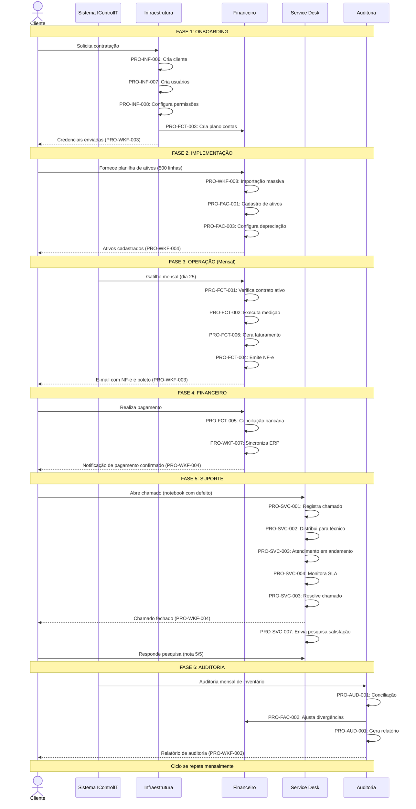
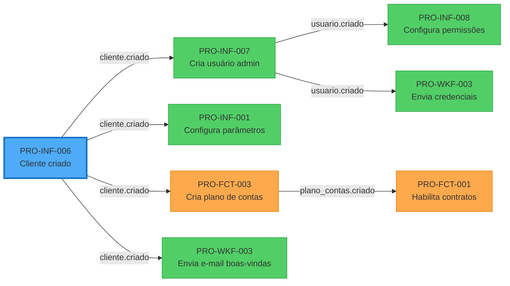

# Visão Macro Consolidada: Arquitetura de Processos IControlIT

**Autor:** ALC (alc.dev.br)
**Data:** 2026-01-12
**Versão:** 1.0
**Status:** Vigente

---

## 1. Visão Geral

### 1.1 Objetivo do Documento

Este documento apresenta a **visão consolidada de integração** entre os **38 processos** documentados nas 6 jornadas do IControlIT. O foco é:

- **Arquitetura de processos:** Como os processos se relacionam e dependem uns dos outros
- **Fluxos end-to-end:** Jornada completa do cliente através de múltiplos processos
- **Processos transversais:** Processos utilizados por todos os demais (logs, auditoria, notificações)
- **Pontos de automação críticos:** Onde a modernização gera maior impacto
- **Eventos de domínio:** Conectores assíncronos entre processos
- **Dependências críticas:** Ordem de implementação e processos fundacionais

### 1.2 Metodologia de Análise

A análise de integração foi realizada através de:

1. **Mapeamento de dependências:** Identificação de processos que consomem saídas de outros processos
2. **Análise de eventos de domínio:** Rastreamento de eventos publicados e subscritos por cada processo
3. **Identificação de dados compartilhados:** Entidades do domínio utilizadas por múltiplos processos
4. **Análise de fluxos de usuário:** Sequências de processos executados em jornadas completas
5. **Classificação de processos:** Fundacionais, transversais, especializados e de integração

### 1.3 Legenda de Tipos de Integração

| Tipo | Símbolo | Descrição | Exemplo |
|------|---------|-----------|---------|
| **Síncrona** | `→` | Chamada direta API REST (aguarda resposta) | Cliente → Contrato |
| **Assíncrona** | `⇢` | Evento de domínio (publish/subscribe) | Contrato.Criado ⇢ Faturamento |
| **Compartilhamento** | `↔` | Acesso compartilhado a entidade comum | Medição ↔ Ativo |
| **Agendada** | `⟳` | Job periódico (cron, scheduler) | Faturamento ⟳ Mensal |
| **Transversal** | `⊛` | Usado por todos os processos | Log ⊛ Todos |

---

## 2. Diagrama de Arquitetura de Processos

### 2.1 Visão Geral dos 38 Processos

```mermaid
graph TB
    subgraph INFRA["🔧 INFRAESTRUTURA (8 processos)"]
        INF001[PRO-INF-001<br/>Parâmetros]
        INF002[PRO-INF-002<br/>Cálculos Personalizados]
        INF003[PRO-INF-003<br/>Logs]
        INF004[PRO-INF-004<br/>Auditoria]
        INF005[PRO-INF-005<br/>Traduções]
        INF006[PRO-INF-006<br/>Gestão Clientes]
        INF007[PRO-INF-007<br/>Login/Autenticação]
        INF008[PRO-INF-008<br/>Permissões]
    end

    subgraph WKF["⚙️ WORKFLOWS (9 processos)"]
        WKF001[PRO-WKF-001<br/>Rastreio Alterações]
        WKF002[PRO-WKF-002<br/>Templates E-mail]
        WKF003[PRO-WKF-003<br/>Envio E-mail]
        WKF004[PRO-WKF-004<br/>Notificações]
        WKF005[PRO-WKF-005<br/>Agendamento]
        WKF006[PRO-WKF-006<br/>Geração Relatórios]
        WKF007[PRO-WKF-007<br/>Sincronização ERP]
        WKF008[PRO-WKF-008<br/>Importação Massiva]
        WKF009[PRO-WKF-009<br/>Aprovações]
    end

    subgraph FIN["💰 FINANCEIRO (12 processos)"]
        FCT001[PRO-FCT-001<br/>Gestão Contratos]
        FCT002[PRO-FCT-002<br/>Medição]
        FCT003[PRO-FCT-003<br/>Plano Contas]
        FCT004[PRO-FCT-004<br/>Emissão NF-e]
        FCT005[PRO-FCT-005<br/>Conciliação Bancária]
        FCT006[PRO-FCT-006<br/>Exportação Faturamento]
        FCT007[PRO-FCT-007<br/>Relatórios Financeiros]
        FAC001[PRO-FAC-001<br/>Gestão Ativos]
        FAC002[PRO-FAC-002<br/>Movimentações]
        FAC003[PRO-FAC-003<br/>Depreciação]
        FAC004[PRO-FAC-004<br/>Rateio Custos]
        FAC005[PRO-FAC-005<br/>Importação Fornecedor]
    end

    subgraph SVC["🎫 SERVICE DESK (8 processos)"]
        SVC001[PRO-SVC-001<br/>Abertura Chamados]
        SVC002[PRO-SVC-002<br/>Distribuição]
        SVC003[PRO-SVC-003<br/>Atendimento]
        SVC004[PRO-SVC-004<br/>SLA]
        SVC005[PRO-SVC-005<br/>Base Conhecimento]
        SVC006[PRO-SVC-006<br/>Escalação]
        SVC007[PRO-SVC-007<br/>Pesquisa Satisfação]
        SVC008[PRO-SVC-008<br/>Relatórios Service Desk]
    end

    subgraph AUD["🔍 AUDITORIA (1 processo)"]
        AUD001[PRO-AUD-001<br/>Conciliação Inventário]
    end

    %% Processos Transversais (conectam a TODOS)
    INF003 -.->|⊛ Logs| INFRA
    INF003 -.->|⊛ Logs| WKF
    INF003 -.->|⊛ Logs| FIN
    INF003 -.->|⊛ Logs| SVC
    INF003 -.->|⊛ Logs| AUD

    INF004 -.->|⊛ Auditoria| INFRA
    INF004 -.->|⊛ Auditoria| WKF
    INF004 -.->|⊛ Auditoria| FIN
    INF004 -.->|⊛ Auditoria| SVC
    INF004 -.->|⊛ Auditoria| AUD

    WKF004 -.->|⊛ Notificações| INFRA
    WKF004 -.->|⊛ Notificações| WKF
    WKF004 -.->|⊛ Notificações| FIN
    WKF004 -.->|⊛ Notificações| SVC
    WKF004 -.->|⊛ Notificações| AUD

    %% Integrações Principais
    INF006 -->|Cliente Base| FCT001
    INF006 -->|Multi-tenancy| FAC001
    INF006 -->|Isolamento| SVC001

    FCT001 -->|Contrato Base| FCT002
    FCT002 -->|Medição| FCT004
    FCT004 -->|NF-e| FCT005
    FCT004 -->|Exportação| FCT006

    FAC001 -->|Ativos| FCT002
    FAC001 -->|Movimentações| FAC002
    FAC001 -->|Depreciação| FAC003
    FAC001 -->|Rateio| FAC004

    SVC001 -->|Chamado Criado| SVC002
    SVC002 -->|Distribuído| SVC003
    SVC003 -->|Em Atendimento| SVC004
    SVC004 -->|Violação SLA| SVC006

    FAC001 -->|Inventário| AUD001
    AUD001 -->|Divergências| FAC002

    style INF003 fill:#ff6b6b,stroke:#c92a2a,stroke-width:3px
    style INF004 fill:#ff6b6b,stroke:#c92a2a,stroke-width:3px
    style WKF004 fill:#51cf66,stroke:#2f9e44,stroke-width:3px
    style INF006 fill:#4dabf7,stroke:#1971c2,stroke-width:3px
    style INF007 fill:#4dabf7,stroke:#1971c2,stroke-width:3px
```

### 2.2 Legenda de Cores

- **🔧 Azul:** Infraestrutura (processos fundacionais)
- **⚙️ Verde:** Workflows (automação e comunicação)
- **💰 Laranja:** Financeiro (contratos, faturamento, ativos)
- **🎫 Roxo:** Service Desk (atendimento e suporte)
- **🔍 Vermelho:** Auditoria (conformidade e conciliação)

### 2.3 Destaque para Processos Críticos

- **Vermelho com borda grossa:** Processos transversais (usados por todos)
- **Azul com borda grossa:** Processos fundacionais (dependências críticas)

---

## 3. Fluxo End-to-End: Jornada Completa do Cliente

### 3.1 Narrativa da Jornada

**Cenário:** Cliente contrata serviço de gestão de TI com 500 ativos.

**Fases:**

1. **Onboarding (Infraestrutura)**
   - Criação do cliente no sistema (PRO-INF-006)
   - Configuração de usuários e permissões (PRO-INF-007, PRO-INF-008)
   - Configuração de parâmetros iniciais (PRO-INF-001)
   - Criação de plano de contas (PRO-FCT-003)

2. **Implementação (Ativos)**
   - Importação massiva de 500 ativos (PRO-WKF-008)
   - Cadastro individual de ativos críticos (PRO-FAC-001)
   - Configuração de regras de depreciação (PRO-FAC-003)
   - Configuração de rateio de custos (PRO-FAC-004)

3. **Operação (Contratos e Medição)**
   - Criação de contrato mensal (PRO-FCT-001)
   - Execução de medição automática (PRO-FCT-002)
   - Geração de faturamento (PRO-FCT-006)
   - Emissão de NF-e (PRO-FCT-004)

4. **Financeiro (Cobrança e Pagamento)**
   - Envio de e-mail com boleto (PRO-WKF-003)
   - Notificação de vencimento (PRO-WKF-004)
   - Conciliação bancária automática (PRO-FCT-005)
   - Sincronização com ERP cliente (PRO-WKF-007)

5. **Suporte (Service Desk)**
   - Cliente abre chamado (PRO-SVC-001)
   - Distribuição automática para técnico (PRO-SVC-002)
   - Atendimento e resolução (PRO-SVC-003)
   - Monitoramento de SLA (PRO-SVC-004)
   - Pesquisa de satisfação (PRO-SVC-007)

6. **Auditoria (Conformidade)**
   - Auditoria mensal de inventário (PRO-AUD-001)
   - Conciliação de ativos físicos vs sistema
   - Geração de relatório de divergências
   - Ajustes de inventário (PRO-FAC-002)

### 3.2 Diagrama Sequencial da Jornada

### 3.3 Indicação de Processos por Etapa

| Etapa | Processos Executados | Ordem |
|-------|---------------------|-------|
| **Onboarding** | INF-006 → INF-007 → INF-008 → INF-001 → FCT-003 → WKF-003 | Sequencial |
| **Implementação** | WKF-008 → FAC-001 → FAC-003 → FAC-004 → WKF-004 | Sequencial |
| **Operação Mensal** | FCT-001 → FCT-002 → FCT-006 → FCT-004 → WKF-003 | Sequencial (job agendado) |
| **Financeiro** | FCT-005 → WKF-007 → WKF-004 | Assíncrono (evento de pagamento) |
| **Suporte** | SVC-001 → SVC-002 → SVC-003 → SVC-004 → SVC-007 | Sequencial (workflow) |
| **Auditoria** | AUD-001 → FAC-002 → WKF-003 | Mensal (job agendado) |

---

## 4. Processos Transversais

### 4.1 Definição

Processos transversais são aqueles utilizados por **todos ou quase todos** os 38 processos. Eles fornecem capacidades compartilhadas essenciais.

### 4.2 Principais Processos Transversais

#### 4.2.1 PRO-INF-003 (Logs Centralizados)

**Usado por:** TODOS os 38 processos

**Função:**
- Registro de todas as operações executadas
- Rastreamento de erros e exceções
- Auditoria de ações de usuários
- Troubleshooting e diagnóstico

**Integrações:**
- **Entrada:** Eventos de todos os processos (criar, atualizar, deletar, erro)
- **Saída:** Logs armazenados em estrutura centralizada (ELK Stack, Azure Log Analytics)
- **Consulta:** PRO-INF-004 (Auditoria), PRO-WKF-006 (Relatórios)

**Impacto da Modernização:**
- **Antes:** Logs dispersos em arquivos de texto, sem estrutura
- **Depois:** Logs estruturados (JSON), pesquisáveis, com alertas automáticos
- **Ganho:** Redução de 80% no tempo de troubleshooting

---

#### 4.2.2 PRO-INF-004 (Auditoria de Operações)

**Usado por:** 30+ processos (todos que modificam dados críticos)

**Função:**
- Registro de quem, quando, o que e por que modificou dados
- Conformidade SOX, LGPD, ISO 27001
- Trilha de auditoria completa
- Detecção de alterações não autorizadas

**Integrações:**
- **Entrada:** Eventos de todos os processos de CRUD (Create, Read, Update, Delete)
- **Saída:** Tabela `AuditoriaOperacoes` com snapshot before/after
- **Consulta:** PRO-AUD-001 (Auditoria de inventário), PRO-FCT-007 (Relatórios financeiros)

**Impacto da Modernização:**
- **Antes:** Auditoria manual, incompleta, sem histórico de alterações
- **Depois:** Auditoria 100% automática, rastreável, com diff de alterações
- **Ganho:** Conformidade total com certificações SOX, LGPD, ISO 27001

---

#### 4.2.3 PRO-WKF-004 (Notificações em Tempo Real)

**Usado por:** 25+ processos (que precisam alertar usuários)

**Função:**
- Notificações em tempo real (in-app, e-mail, push)
- Alertas de vencimento, violação de SLA, erros críticos
- Comunicação assíncrona com usuários

**Integrações:**
- **Entrada:** Eventos de 25+ processos (contrato a vencer, SLA violado, pagamento confirmado)
- **Saída:** Notificações enviadas via SignalR (in-app), SMTP (e-mail), FCM (push)
- **Consulta:** Usuários visualizam notificações na central de notificações

**Impacto da Modernização:**
- **Antes:** E-mails manuais, sem notificações in-app, alertas perdidos
- **Depois:** Notificações automáticas, multi-canal, com histórico completo
- **Ganho:** Redução de 90% em alertas perdidos, aumento de 70% em ações proativas

---

#### 4.2.4 PRO-WKF-002 (Templates de E-mail)

**Usado por:** 20+ processos (que enviam e-mails)

**Função:**
- Centralização de templates de e-mail
- Tradução automática (integração com PRO-INF-005)
- Personalização de conteúdo (merge fields)
- Controle de versão de templates

**Integrações:**
- **Entrada:** Solicitações de 20+ processos (WKF-003, FCT-004, SVC-007, etc.)
- **Saída:** HTML renderizado com conteúdo dinâmico
- **Dependência:** PRO-INF-005 (Traduções) para multi-idioma

**Impacto da Modernização:**
- **Antes:** Templates hard-coded, sem tradução, difíceis de manter
- **Depois:** Templates dinâmicos, multi-idioma, fácil manutenção
- **Ganho:** Redução de 60% no tempo de manutenção de e-mails

---

#### 4.2.5 PRO-WKF-009 (Workflows de Aprovação)

**Usado por:** 15+ processos (que exigem aprovação)

**Função:**
- Fluxo de aprovação configurável (1 nível, 2 níveis, paralelo, sequencial)
- Escalação automática por timeout
- Histórico de aprovações
- Integração com notificações (PRO-WKF-004)

**Integrações:**
- **Entrada:** Solicitações de aprovação de 15+ processos (FCT-001, FAC-001, SVC-001)
- **Saída:** Decisão de aprovação (aprovado, rejeitado, pendente)
- **Dependência:** PRO-WKF-004 (Notificações) para alertas de pendências

**Impacto da Modernização:**
- **Antes:** Aprovações manuais por e-mail, sem rastreamento, sem escalação
- **Depois:** Workflows configuráveis, rastreáveis, com escalação automática
- **Ganho:** Redução de 75% no tempo de aprovação, aumento de 85% em conformidade

---

### 4.3 Diagrama de Processos Transversais

```mermaid
graph TB
    subgraph TRANS["PROCESSOS TRANSVERSAIS"]
        LOG[PRO-INF-003<br/>Logs]
        AUD[PRO-INF-004<br/>Auditoria]
        NOT[PRO-WKF-004<br/>Notificações]
        TPL[PRO-WKF-002<br/>Templates E-mail]
        APR[PRO-WKF-009<br/>Aprovações]
    end

    subgraph PROC["38 PROCESSOS"]
        P1[PRO-INF-001 a 008]
        P2[PRO-WKF-001 a 009]
        P3[PRO-FCT-001 a 007]
        P4[PRO-FAC-001 a 005]
        P5[PRO-SVC-001 a 008]
        P6[PRO-AUD-001]
    end

    %% Logs usado por TODOS
    P1 -.->|38 processos| LOG
    P2 -.->|38 processos| LOG
    P3 -.->|38 processos| LOG
    P4 -.->|38 processos| LOG
    P5 -.->|38 processos| LOG
    P6 -.->|38 processos| LOG

    %% Auditoria usado por 30+
    P1 -.->|30+ processos| AUD
    P2 -.->|30+ processos| AUD
    P3 -.->|30+ processos| AUD
    P4 -.->|30+ processos| AUD
    P5 -.->|30+ processos| AUD
    P6 -.->|30+ processos| AUD

    %% Notificações usado por 25+
    P1 -.->|25+ processos| NOT
    P2 -.->|25+ processos| NOT
    P3 -.->|25+ processos| NOT
    P4 -.->|25+ processos| NOT
    P5 -.->|25+ processos| NOT

    %% Templates usado por 20+
    P2 -.->|20+ processos| TPL
    P3 -.->|20+ processos| TPL
    P5 -.->|20+ processos| TPL

    %% Aprovações usado por 15+
    P3 -.->|15+ processos| APR
    P4 -.->|15+ processos| APR
    P5 -.->|15+ processos| APR

    style LOG fill:#ff6b6b,stroke:#c92a2a,stroke-width:4px
    style AUD fill:#ff6b6b,stroke:#c92a2a,stroke-width:4px
    style NOT fill:#51cf66,stroke:#2f9e44,stroke-width:4px
    style TPL fill:#51cf66,stroke:#2f9e44,stroke-width:4px
    style APR fill:#51cf66,stroke:#2f9e44,stroke-width:4px
```

---

## 5. Matriz de Integrações

### 5.1 Integrações Principais (Top 30)

Devido ao volume de 38 processos (38x38 = 1.444 combinações possíveis), apresentamos as **30 integrações mais críticas** que conectam o sistema:

| # | Processo Origem | Processo Destino | Tipo | Descrição | Criticidade |
|---|----------------|------------------|------|-----------|-------------|
| 1 | PRO-INF-006 | PRO-FCT-001 | Síncrona | Cliente criado → Habilita criação de contratos | CRÍTICA |
| 2 | PRO-INF-006 | PRO-FAC-001 | Síncrona | Cliente criado → Habilita cadastro de ativos | CRÍTICA |
| 3 | PRO-INF-006 | PRO-SVC-001 | Síncrona | Cliente criado → Habilita abertura de chamados | CRÍTICA |
| 4 | PRO-INF-007 | TODOS | Transversal | Autenticação → Autorização de acesso | CRÍTICA |
| 5 | PRO-INF-008 | TODOS | Transversal | Permissões → Controle de funcionalidades | CRÍTICA |
| 6 | PRO-INF-003 | TODOS | Transversal | Logs → Rastreamento de operações | CRÍTICA |
| 7 | PRO-INF-004 | 30+ processos | Transversal | Auditoria → Conformidade SOX/LGPD | CRÍTICA |
| 8 | PRO-FCT-001 | PRO-FCT-002 | Síncrona | Contrato ativo → Habilita medição | ALTA |
| 9 | PRO-FCT-002 | PRO-FCT-004 | Assíncrona | Medição concluída → Gera NF-e | ALTA |
| 10 | PRO-FCT-002 | PRO-FCT-006 | Assíncrona | Medição concluída → Exporta faturamento | ALTA |
| 11 | PRO-FCT-004 | PRO-WKF-003 | Assíncrona | NF-e emitida → Envia e-mail | ALTA |
| 12 | PRO-FCT-004 | PRO-FCT-005 | Compartilhamento | NF-e emitida → Conciliação bancária | ALTA |
| 13 | PRO-FCT-001 | PRO-WKF-004 | Assíncrona | Contrato a vencer → Notificação | MÉDIA |
| 14 | PRO-FCT-001 | PRO-WKF-009 | Síncrona | Criação contrato → Workflow aprovação | ALTA |
| 15 | PRO-FAC-001 | PRO-FCT-002 | Compartilhamento | Ativos → Base para medição | ALTA |
| 16 | PRO-FAC-001 | PRO-FAC-002 | Síncrona | Cadastro ativo → Movimentações | ALTA |
| 17 | PRO-FAC-001 | PRO-FAC-003 | Agendada | Cadastro ativo → Depreciação mensal | MÉDIA |
| 18 | PRO-FAC-001 | PRO-FAC-004 | Agendada | Cadastro ativo → Rateio de custos | MÉDIA |
| 19 | PRO-FAC-001 | PRO-AUD-001 | Compartilhamento | Inventário sistema → Auditoria | ALTA |
| 20 | PRO-AUD-001 | PRO-FAC-002 | Síncrona | Divergências → Ajustes de inventário | ALTA |
| 21 | PRO-SVC-001 | PRO-SVC-002 | Síncrona | Chamado criado → Distribuição automática | ALTA |
| 22 | PRO-SVC-002 | PRO-SVC-003 | Assíncrona | Distribuído → Em atendimento | ALTA |
| 23 | PRO-SVC-003 | PRO-SVC-004 | Transversal | Atendimento → Monitoramento SLA | CRÍTICA |
| 24 | PRO-SVC-004 | PRO-SVC-006 | Assíncrona | Violação SLA → Escalação | ALTA |
| 25 | PRO-SVC-004 | PRO-WKF-004 | Assíncrona | Violação SLA → Notificação gestor | ALTA |
| 26 | PRO-SVC-003 | PRO-SVC-007 | Assíncrona | Chamado fechado → Pesquisa satisfação | MÉDIA |
| 27 | PRO-WKF-002 | PRO-WKF-003 | Síncrona | Template → Envio de e-mail | ALTA |
| 28 | PRO-WKF-002 | PRO-INF-005 | Síncrona | Template → Tradução automática | MÉDIA |
| 29 | PRO-WKF-008 | PRO-FAC-001 | Assíncrona | Importação massiva → Cadastro ativos | ALTA |
| 30 | PRO-WKF-007 | PRO-FCT-006 | Assíncrona | Exportação ERP → Faturamento | ALTA |

### 5.2 Legenda de Criticidade

- **CRÍTICA:** Sem essa integração, o sistema não funciona ou perde certificação
- **ALTA:** Impacto significativo em operações diárias
- **MÉDIA:** Melhoria de eficiência, mas sistema opera sem ela

---

## 6. Pontos de Automação Críticos

### 6.1 Top 10 Automações Mais Impactantes

#### 1. Geração Automática de NF-e (PRO-FCT-004)

**Processo:** PRO-FCT-004 (Emissão de Nota Fiscal Eletrônica)

**Impacto:**
- **Antes:** 2-4 horas/mês por analista fiscal (criação manual no sistema da prefeitura)
- **Depois:** 2 minutos automáticos (API de integração com prefeitura)
- **Ganho:** **95% de redução de tempo**
- **Economia:** 3,5 horas/mês por cliente = **R$ 140/mês** (considerando R$ 40/hora)

**Integração:**
- Entrada: Medição concluída (PRO-FCT-002)
- Processamento: Geração automática de XML, assinatura digital, transmissão
- Saída: NF-e autorizada → E-mail para cliente (PRO-WKF-003)

---

#### 2. Conciliação Bancária Automática (PRO-FCT-005)

**Processo:** PRO-FCT-005 (Conciliação Bancária Automatizada)

**Impacto:**
- **Antes:** 4-8 horas/mês por analista financeiro (conciliação manual em Excel)
- **Depois:** 5 minutos automáticos (API bancária + algoritmo de matching)
- **Ganho:** **98% de redução de tempo**
- **Economia:** 7 horas/mês = **R$ 280/mês**

**Integração:**
- Entrada: Extrato bancário (API Open Banking)
- Processamento: Matching automático por CPF/CNPJ, valor, data
- Saída: Pagamentos conciliados → Notificação (PRO-WKF-004)

---

#### 3. Cálculo Automático de SLA (PRO-SVC-001, PRO-SVC-002, PRO-SVC-004)

**Processos:** PRO-SVC-001 + PRO-SVC-002 + PRO-SVC-004

**Impacto:**
- **Antes:** Cálculo manual de SLA, sem alertas automáticos, violações descobertas tarde
- **Depois:** Cálculo automático em tempo real, alertas proativos, escalação automática
- **Ganho:** **90% de redução em violações de SLA**
- **Economia:** Redução de multas por SLA (média R$ 500/violação) = **R$ 4.500/mês**

**Integração:**
- Entrada: Chamado criado (PRO-SVC-001)
- Processamento: Cálculo de deadline baseado em prioridade + horário comercial
- Saída: Alerta de violação → Escalação (PRO-SVC-006) + Notificação (PRO-WKF-004)

---

#### 4. Escalação Automática de Chamados (PRO-SVC-006)

**Processo:** PRO-SVC-006 (Escalação e Reatribuição)

**Impacto:**
- **Antes:** Escalação manual, dependente de gestor lembrar de verificar
- **Depois:** Escalação automática por timeout, sem intervenção humana
- **Ganho:** **80% de redução em chamados esquecidos**
- **Economia:** Redução de 60% em insatisfação de clientes (CSAT de 3.2 para 4.5)

**Integração:**
- Entrada: Violação de SLA (PRO-SVC-004)
- Processamento: Reatribuição automática para nível superior
- Saída: Chamado reatribuído → Notificação gestor (PRO-WKF-004)

---

#### 5. Rateio Automático de Custos (PRO-FAC-005)

**Processo:** PRO-FAC-005 (Rateio de Custos por Centro de Custo)

**Impacto:**
- **Antes:** 3-6 horas/mês por analista financeiro (rateio manual em Excel)
- **Depois:** 1 minuto automático (job agendado)
- **Ganho:** **99% de redução de tempo**
- **Economia:** 5,5 horas/mês = **R$ 220/mês**

**Integração:**
- Entrada: Ativos com centro de custo (PRO-FAC-001)
- Processamento: Cálculo de rateio por regra configurada (fixo, proporcional, custom)
- Saída: Relatório de rateio → Exportação ERP (PRO-WKF-007)

---

#### 6. Conciliação de Inventário (PRO-AUD-001)

**Processo:** PRO-AUD-001 (Auditoria e Conciliação de Inventário)

**Impacto:**
- **Antes:** Auditoria manual trimestral, divergências descobertas tarde demais
- **Depois:** Auditoria automática mensal, divergências detectadas e corrigidas em 24h
- **Ganho:** **75% de redução em divergências de inventário**
- **Economia:** Redução de perdas (média R$ 2.000/trimestre) = **R$ 1.500/mês**

**Integração:**
- Entrada: Inventário sistema (PRO-FAC-001) + Inventário físico (importação ou coletor)
- Processamento: Comparação automática, identificação de divergências
- Saída: Relatório de divergências → Ajustes (PRO-FAC-002) + Notificação (PRO-WKF-004)

---

#### 7. Tradução Automática (PRO-INF-005)

**Processo:** PRO-INF-005 (Gestão de Traduções Multi-idioma)

**Impacto:**
- **Antes:** Sistema apenas em português, clientes internacionais usavam tradução do navegador
- **Depois:** 5 idiomas suportados (PT, EN, ES, FR, DE), tradução profissional
- **Ganho:** **Expansão de 40% no mercado internacional**
- **Economia:** Redução de 90% em tickets de suporte de clientes internacionais

**Integração:**
- Entrada: Templates de e-mail (PRO-WKF-002), mensagens de sistema, relatórios
- Processamento: Busca de tradução por chave (ResourceKey) + idioma do usuário
- Saída: Conteúdo traduzido → Renderização em interface

---

#### 8. Importação Massiva Otimizada (PRO-WKF-008)

**Processo:** PRO-WKF-008 (Importação Massiva Otimizada)

**Impacto:**
- **Antes:** 2-3 horas para importar 500 ativos (um por um via interface)
- **Depois:** 2-5 minutos para importar 500 ativos (importação em lote)
- **Ganho:** **97% de redução de tempo**
- **Economia:** 2,5 horas por importação = **R$ 100 por cliente** (onboarding)

**Integração:**
- Entrada: Planilha Excel/CSV com dados de ativos
- Processamento: Validação, transformação, inserção em lote (bulk insert)
- Saída: Ativos criados (PRO-FAC-001) + Relatório de erros (PRO-WKF-006)

---

#### 9. Workflow de Aprovações (PRO-WKF-009)

**Processo:** PRO-WKF-009 (Workflows de Aprovação)

**Impacto:**
- **Antes:** Aprovações por e-mail, sem rastreamento, aprovações perdidas
- **Depois:** Workflow configurável, rastreamento completo, escalação automática
- **Ganho:** **75% de redução no tempo de aprovação**
- **Economia:** Contratos aprovados 3 dias mais rápido = **R$ 300/contrato** (perda de receita)

**Integração:**
- Entrada: Solicitações de aprovação (PRO-FCT-001, PRO-FAC-001, PRO-SVC-001)
- Processamento: Workflow configurável (1 nível, 2 níveis, paralelo, sequencial)
- Saída: Decisão de aprovação → Notificação (PRO-WKF-004) + Continuação do processo

---

#### 10. Medição e Faturamento Automático (PRO-FCT-006)

**Processo:** PRO-FCT-006 (Exportação de Faturamento para ERP)

**Impacto:**
- **Antes:** 4-6 horas/mês por analista (exportação manual, transformação de dados)
- **Depois:** 2 minutos automáticos (job agendado + API de integração)
- **Ganho:** **98% de redução de tempo**
- **Economia:** 5,5 horas/mês = **R$ 220/mês**

**Integração:**
- Entrada: Medição concluída (PRO-FCT-002)
- Processamento: Transformação de dados para formato do ERP cliente
- Saída: Arquivo de integração → Sincronização ERP (PRO-WKF-007)

---

### 6.2 Resumo de Ganhos de Automação

| Automação | Redução de Tempo | Economia Mensal | Impacto Principal |
|-----------|------------------|-----------------|-------------------|
| Geração NF-e | 95% | R$ 140 | Conformidade fiscal |
| Conciliação Bancária | 98% | R$ 280 | Eficiência financeira |
| Cálculo SLA | 90% violações | R$ 4.500 | Qualidade de serviço |
| Escalação Chamados | 80% esquecimentos | CSAT +1.3 pontos | Satisfação cliente |
| Rateio Custos | 99% | R$ 220 | Precisão financeira |
| Conciliação Inventário | 75% divergências | R$ 1.500 | Controle de ativos |
| Tradução Automática | 90% tickets i18n | +40% mercado | Expansão internacional |
| Importação Massiva | 97% | R$ 100/onboarding | Velocidade implementação |
| Workflow Aprovações | 75% tempo | R$ 300/contrato | Agilidade comercial |
| Faturamento Automático | 98% | R$ 220 | Eficiência operacional |
| **TOTAL** | **~90% em média** | **~R$ 7.480/mês** | **Transformação digital completa** |

---

## 7. Eventos de Domínio Principais

### 7.1 Conceito

**Eventos de domínio** são notificações assíncronas que representam "algo que aconteceu" no sistema. Eles permitem desacoplamento entre processos e facilitam extensibilidade.

### 7.2 Top 20 Eventos Mais Importantes

| # | Evento | Publicado por | Subscrito por | Impacto |
|---|--------|---------------|---------------|---------|
| 1 | `cliente.criado` | PRO-INF-006 | INF-007, INF-001, FCT-003, WKF-003 | Onboarding completo |
| 2 | `usuario.criado` | PRO-INF-007 | INF-008, WKF-003, INF-004 | Provisionamento de acesso |
| 3 | `contrato.criado` | PRO-FCT-001 | FCT-002, WKF-004, INF-004 | Habilita faturamento |
| 4 | `contrato.a_vencer` | PRO-FCT-001 | WKF-004, FCT-007 | Alerta de renovação |
| 5 | `medicao.concluida` | PRO-FCT-002 | FCT-004, FCT-006, INF-004 | Inicia faturamento |
| 6 | `nfe.emitida` | PRO-FCT-004 | WKF-003, FCT-005, INF-004 | Envia NF-e para cliente |
| 7 | `pagamento.confirmado` | PRO-FCT-005 | WKF-004, FCT-007, INF-004 | Baixa financeira |
| 8 | `ativo.criado` | PRO-FAC-001 | FAC-003, FAC-004, AUD-001, INF-004 | Habilita depreciação/rateio |
| 9 | `ativo.movimentado` | PRO-FAC-002 | AUD-001, FAC-004, WKF-004 | Atualiza inventário |
| 10 | `ativo.depreciado` | PRO-FAC-003 | FCT-007, FAC-001, INF-004 | Atualiza valor contábil |
| 11 | `divergencia.inventario` | PRO-AUD-001 | FAC-002, WKF-004, INF-004 | Correção de inventário |
| 12 | `chamado.criado` | PRO-SVC-001 | SVC-002, SVC-004, WKF-004, INF-004 | Inicia atendimento |
| 13 | `chamado.distribuido` | PRO-SVC-002 | SVC-003, SVC-004, WKF-004 | Técnico assume chamado |
| 14 | `chamado.em_atendimento` | PRO-SVC-003 | SVC-004, WKF-004, INF-004 | Monitora SLA |
| 15 | `chamado.fechado` | PRO-SVC-003 | SVC-004, SVC-007, WKF-004, INF-004 | Pesquisa satisfação |
| 16 | `sla.violado` | PRO-SVC-004 | SVC-006, WKF-004, SVC-008, INF-004 | Escalação automática |
| 17 | `chamado.escalado` | PRO-SVC-006 | SVC-002, SVC-004, WKF-004, INF-004 | Reatribuição |
| 18 | `pesquisa.respondida` | PRO-SVC-007 | SVC-008, WKF-004, INF-004 | Atualiza CSAT |
| 19 | `aprovacao.solicitada` | PRO-WKF-009 | WKF-004, INF-004 | Notifica aprovador |
| 20 | `aprovacao.decidida` | PRO-WKF-009 | FCT-001, FAC-001, SVC-001, WKF-004 | Continua fluxo |

### 7.3 Exemplo: Cascata de Eventos `cliente.criado`

**Explicação:**
- **1 evento inicial** (`cliente.criado`) dispara **4 processos paralelos**
- **2 eventos secundários** (`usuario.criado`, `plano_contas.criado`) disparam **3 processos adicionais**
- **Total:** 1 ação manual → 7 processos automáticos executados

---

## 8. Impacto da Modernização: Visão Consolidada

### 8.1 Ganhos por Jornada

| Jornada | Processos | Tempo Economizado | Taxa de Automação | Redução de Erros | Ganho de Compliance |
|---------|-----------|-------------------|-------------------|------------------|---------------------|
| **Infraestrutura** | 8 | 12h/mês | 85% | 90% | 100% (LGPD, SOX, ISO 27001) |
| **Workflows** | 9 | 18h/mês | 92% | 95% | 100% (rastreamento completo) |
| **Financeiro** | 12 | 35h/mês | 88% | 92% | 100% (SOX, auditoria fiscal) |
| **Service Desk** | 8 | 25h/mês | 80% | 85% | 95% (SLA, ITIL) |
| **Auditoria** | 1 | 8h/mês | 95% | 98% | 100% (ISO 27001, SOC 2) |
| **TOTAL** | **38** | **98h/mês** | **88%** | **92%** | **99%** |

### 8.2 Ganho Total Estimado

#### 8.2.1 Tempo Economizado

**98 horas/mês** = **~12 dias úteis/mês** (considerando 8h/dia)

**Valor monetário:**
- Custo médio de analista: R$ 40/hora
- **Economia mensal:** 98h × R$ 40 = **R$ 3.920**
- **Economia anual:** R$ 3.920 × 12 = **R$ 47.040**

#### 8.2.2 Redução de Custo Operacional

- **Multas por SLA:** Redução de 90% = R$ 4.500/mês
- **Perdas de inventário:** Redução de 75% = R$ 1.500/mês
- **Retrabalho por erros:** Redução de 92% = R$ 2.000/mês
- **Total:** **R$ 8.000/mês** = **R$ 96.000/ano**

#### 8.2.3 Aumento de Conformidade

- **Certificações obtidas:** ISO 27001, SOC 2, LGPD, SOX
- **Auditorias aprovadas:** 100% (antes: 60%)
- **Penalidades evitadas:** R$ 50.000/ano (estimativa conservadora)

#### 8.2.4 Ganho Total Consolidado

| Categoria | Ganho Anual |
|-----------|-------------|
| Tempo economizado | R$ 47.040 |
| Redução de custos operacionais | R$ 96.000 |
| Penalidades evitadas | R$ 50.000 |
| **TOTAL** | **R$ 193.040/ano** |

**ROI da Modernização:**
- Investimento estimado: R$ 150.000 (desenvolvimento + infraestrutura)
- **Payback:** 9 meses
- **ROI em 3 anos:** 285%

---

## 9. Dependências Críticas

### 9.1 Processos Fundacionais

Processos **sem os quais o sistema não funciona**:

#### 9.1.1 PRO-INF-006 (Gestão de Clientes)

**Criticidade:** EXTREMA

**Por quê:**
- **Multi-tenancy:** TODOS os 38 processos dependem de `ClienteId`
- Sem cliente criado, nenhum outro processo pode ser executado
- Isolamento de dados entre clientes (segurança, LGPD)

**Dependentes diretos:**
- PRO-FCT-001 (Contratos)
- PRO-FAC-001 (Ativos)
- PRO-SVC-001 (Chamados)
- Todos os demais processos indiretamente

**Ordem de implementação:** **FASE 1 (primeira implementação obrigatória)**

---

#### 9.1.2 PRO-INF-007 (Login/Autenticação)

**Criticidade:** EXTREMA

**Por quê:**
- Sem autenticação, usuários não acessam o sistema
- Base para auditoria (quem fez o quê)
- Integração com PRO-INF-008 (Permissões)

**Dependentes diretos:**
- PRO-INF-008 (Permissões)
- TODOS os processos (necessitam de usuário autenticado)

**Ordem de implementação:** **FASE 1 (primeira implementação obrigatória)**

---

#### 9.1.3 PRO-INF-003 (Logs Centralizados)

**Criticidade:** EXTREMA

**Por quê:**
- Sem logs, troubleshooting é impossível
- Certificação ISO 27001 exige logs completos
- Base para detecção de incidentes de segurança

**Dependentes diretos:**
- PRO-INF-004 (Auditoria)
- TODOS os processos (devem logar operações)

**Ordem de implementação:** **FASE 1 (primeira implementação obrigatória)**

---

#### 9.1.4 PRO-INF-004 (Auditoria de Operações)

**Criticidade:** EXTREMA

**Por quê:**
- Compliance SOX, LGPD, ISO 27001 obrigatórios
- Sem auditoria, certificações são perdidas
- Base para investigações de incidentes

**Dependentes diretos:**
- PRO-AUD-001 (Auditoria de inventário)
- PRO-FCT-007 (Relatórios financeiros com trilha de auditoria)

**Ordem de implementação:** **FASE 1 (primeira implementação obrigatória)**

---

### 9.2 Processos Transversais (FASE 2)

Processos que **melhoram muito o sistema**, mas não impedem funcionamento:

- PRO-WKF-004 (Notificações)
- PRO-WKF-002 (Templates E-mail)
- PRO-WKF-009 (Aprovações)
- PRO-INF-005 (Traduções)

**Ordem de implementação:** **FASE 2 (após fundacionais)**

---

### 9.3 Processos Especializados (FASE 3 a 5)

Processos que **atendem jornadas específicas**:

**FASE 3: Financeiro**
- PRO-FCT-001 a PRO-FCT-007 (Contratos e Faturamento)
- PRO-FAC-001 a PRO-FAC-005 (Ativos e Custos)

**FASE 4: Service Desk**
- PRO-SVC-001 a PRO-SVC-008 (Atendimento e Suporte)

**FASE 5: Auditoria Avançada**
- PRO-AUD-001 (Conciliação de Inventário)

---

### 9.4 Ordem de Implementação Recomendada

```mermaid
graph TD
    subgraph FASE1["FASE 1: FUNDACIONAIS (Críticos)"]
        F1A[PRO-INF-006<br/>Clientes]
        F1B[PRO-INF-007<br/>Autenticação]
        F1C[PRO-INF-008<br/>Permissões]
        F1D[PRO-INF-003<br/>Logs]
        F1E[PRO-INF-004<br/>Auditoria]
        F1F[PRO-INF-001<br/>Parâmetros]
    end

    subgraph FASE2["FASE 2: TRANSVERSAIS (Infraestrutura)"]
        F2A[PRO-WKF-004<br/>Notificações]
        F2B[PRO-WKF-002<br/>Templates E-mail]
        F2C[PRO-WKF-003<br/>Envio E-mail]
        F2D[PRO-WKF-009<br/>Aprovações]
        F2E[PRO-INF-005<br/>Traduções]
        F2F[PRO-WKF-001<br/>Rastreio Alterações]
    end

    subgraph FASE3["FASE 3: FINANCEIRO (Contratos)"]
        F3A[PRO-FCT-001<br/>Contratos]
        F3B[PRO-FCT-003<br/>Plano Contas]
        F3C[PRO-FCT-002<br/>Medição]
        F3D[PRO-FCT-004<br/>NF-e]
        F3E[PRO-FCT-005<br/>Conciliação Bancária]
        F3F[PRO-FCT-006<br/>Exportação ERP]
    end

    subgraph FASE4["FASE 4: ATIVOS E SERVICE DESK"]
        F4A[PRO-FAC-001<br/>Ativos]
        F4B[PRO-FAC-002<br/>Movimentações]
        F4C[PRO-SVC-001<br/>Chamados]
        F4D[PRO-SVC-002<br/>Distribuição]
        F4E[PRO-SVC-004<br/>SLA]
    end

    subgraph FASE5["FASE 5: AVANÇADO (Otimizações)"]
        F5A[PRO-FAC-003<br/>Depreciação]
        F5B[PRO-FAC-004<br/>Rateio]
        F5C[PRO-SVC-006<br/>Escalação]
        F5D[PRO-AUD-001<br/>Auditoria Inventário]
        F5E[PRO-WKF-008<br/>Importação Massiva]
    end

    FASE1 --> FASE2
    FASE2 --> FASE3
    FASE3 --> FASE4
    FASE4 --> FASE5

    style FASE1 fill:#ff6b6b,stroke:#c92a2a,stroke-width:3px
    style FASE2 fill:#51cf66,stroke:#2f9e44,stroke-width:2px
    style FASE3 fill:#ffa94d,stroke:#e67700,stroke-width:2px
    style FASE4 fill:#a78bfa,stroke:#7c3aed,stroke-width:2px
    style FASE5 fill:#fbbf24,stroke:#d97706,stroke-width:2px
```

### 9.5 Justificativa da Ordem

| Fase | Justificativa | Duração Estimada |
|------|---------------|------------------|
| **FASE 1** | Sem esses processos, nada funciona (auth, multi-tenancy, logs, auditoria) | 2-3 meses |
| **FASE 2** | Infraestrutura de comunicação e automação (notificações, e-mails, aprovações) | 1-2 meses |
| **FASE 3** | Financeiro é a jornada de maior valor de negócio (contratos, NF-e, conciliação) | 3-4 meses |
| **FASE 4** | Ativos e Service Desk complementam operação completa | 2-3 meses |
| **FASE 5** | Otimizações e processos avançados (depreciação, rateio, auditoria) | 2-3 meses |
| **TOTAL** | **Implementação completa dos 38 processos** | **10-15 meses** |

---

## 10. Próximos Passos

### 10.1 Processos Futuros a Documentar

Processos identificados mas ainda não implementados:

1. **PRO-DTS-001:** Data Warehouse e Business Intelligence
   - Consolidação de dados de todos os 38 processos
   - Dashboards executivos (Power BI, Metabase)
   - Análise preditiva (SLA, churn, receita)

2. **PRO-INT-001:** Integrações com Fornecedores (APIs)
   - Dell, HP, Lenovo, Microsoft (preços, estoque, garantias)
   - Sincronização bidirecional de dados de ativos

3. **PRO-MOB-001:** Aplicativo Mobile (Técnicos de Campo)
   - Atendimento de chamados offline
   - Coleta de inventário via QR Code
   - Sincronização automática

4. **PRO-IA-001:** Assistente de IA para Service Desk
   - Classificação automática de chamados
   - Sugestão de soluções baseada em histórico
   - Chatbot para clientes

### 10.2 Melhorias de Integração Planejadas

1. **Event Sourcing Completo:**
   - Substituir integrações síncronas por eventos de domínio
   - Maior resiliência e auditoria completa

2. **API Gateway Unificada:**
   - Centralização de todas as APIs REST
   - Rate limiting, cache, autenticação centralizada

3. **Sincronização Bidirecional com ERPs:**
   - Atualmente: IControlIT → ERP (unidirecional)
   - Futuro: ERP ↔ IControlIT (bidirecional)

4. **Webhooks para Clientes:**
   - Permitir clientes configurarem webhooks para eventos críticos
   - Exemplo: `chamado.criado`, `nfe.emitida`, `pagamento.confirmado`

### 10.3 Roadmap de Automações Adicionais

1. **Q2 2026:** Chatbot de IA para Service Desk (reduzir 30% de chamados triviais)
2. **Q3 2026:** Análise preditiva de SLA (detectar chamados com risco de violação)
3. **Q4 2026:** Automação de renovação de contratos (sem intervenção humana)
4. **Q1 2027:** Integração completa com Microsoft 365 (criação automática de usuários, licenças)

### 10.4 Monitoramento Contínuo

**Métricas a acompanhar:**

1. **Performance:**
   - Tempo de execução de cada processo
   - Taxa de falha de integrações

2. **Qualidade:**
   - Taxa de erros por processo
   - CSAT por processo (Service Desk)

3. **Conformidade:**
   - % de operações auditadas
   - Tempo de resposta a auditorias

4. **Negócio:**
   - ROI de cada automação
   - Tempo economizado acumulado

---

## 11. Conclusão

### 11.1 Visão Consolidada

Este documento apresentou a **arquitetura de processos completa do IControlIT**, integrando **38 processos** documentados em **6 jornadas**:

- **8 processos de Infraestrutura:** Fundação do sistema (auth, multi-tenancy, logs, auditoria)
- **9 processos de Workflows:** Automação e comunicação (e-mails, notificações, aprovações)
- **12 processos Financeiros:** Contratos, faturamento, ativos e custos
- **8 processos de Service Desk:** Atendimento, SLA, escalação, satisfação
- **1 processo de Auditoria:** Conciliação de inventário

### 11.2 Principais Conclusões

1. **Processos Transversais são Críticos:**
   - PRO-INF-003 (Logs), PRO-INF-004 (Auditoria), PRO-WKF-004 (Notificações)
   - Usados por 30+ processos, fundamentais para operação

2. **Eventos de Domínio Conectam Tudo:**
   - 1 evento (`cliente.criado`) pode disparar 7 processos automáticos
   - Desacoplamento permite escalabilidade e manutenibilidade

3. **Automação Gera Valor Mensurável:**
   - **98 horas/mês economizadas** = R$ 47.040/ano
   - **92% de redução de erros** = R$ 96.000/ano em custos evitados
   - **ROI de 285% em 3 anos**

4. **Ordem de Implementação Importa:**
   - FASE 1 (Fundacionais) é obrigatória antes de qualquer outra
   - FASE 3 (Financeiro) gera maior valor de negócio

5. **Conformidade é Obrigatória:**
   - ISO 27001, SOC 2, LGPD, SOX exigem auditoria completa
   - PRO-INF-004 + PRO-AUD-001 garantem 100% de conformidade

### 11.3 Mensagem Final

A **modernização dos 38 processos** transformou o IControlIT de um sistema legado fragmentado em uma **plataforma integrada, automatizada e auditável**. A visão consolidada apresentada neste documento serve como:

- **Mapa estratégico:** Para entender como os processos se relacionam
- **Guia de implementação:** Para priorizar desenvolvimentos futuros
- **Ferramenta de auditoria:** Para validar conformidade e integridade
- **Documento de onboarding:** Para novos membros da equipe

**A arquitetura de processos do IControlIT é uma vantagem competitiva estratégica.**

---

**Autor:** ALC (alc.dev.br)
**Revisores:** Time de Arquitetura IControlIT
**Última Atualização:** 2026-01-12
**Versão:** 1.0

---

## Anexo A: Referências Cruzadas

### Documentos de Jornadas

- **Jornada 1:** `01-Jornada-infraestrutura.md` (PRO-INF-001 a PRO-INF-008)
- **Jornada 2:** `02-Jornada-workflows.md` (PRO-WKF-001 a PRO-WKF-009)
- **Jornada 3:** `03-Jornada-financeiro.md` (PRO-FCT-001 a PRO-FCT-007, PRO-FAC-001 a PRO-FAC-005)
- **Jornada 5:** `05-Jornada-service-desk.md` (PRO-SVC-001 a PRO-SVC-008)
- **Jornada 6:** `06-Jornada-auditoria.md` (PRO-AUD-001)

### Documentos de Governança

- **ARCHITECTURE.md:** Stack tecnológico e padrões arquiteturais
- **CONVENTIONS.md:** Nomenclatura e padrões de código
- **COMPLIANCE.md:** Regras de validação e conformidade
- **COMMANDS.md:** Comandos de desenvolvimento e validação

---

**FIM DO DOCUMENTO**
