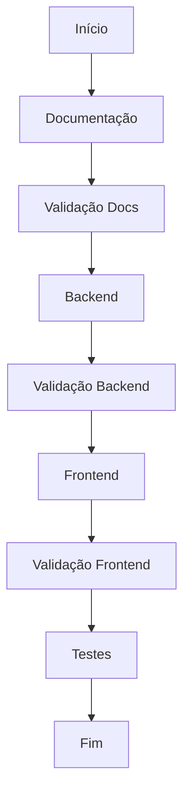
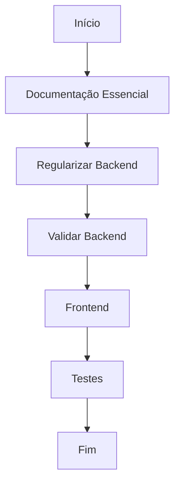
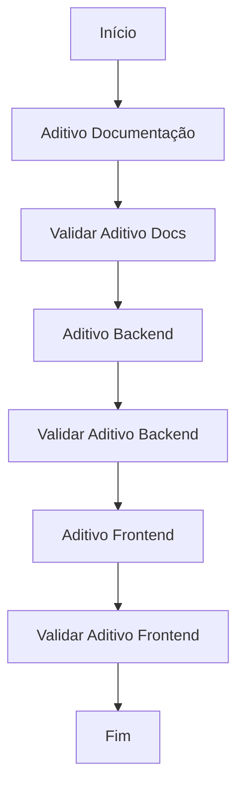
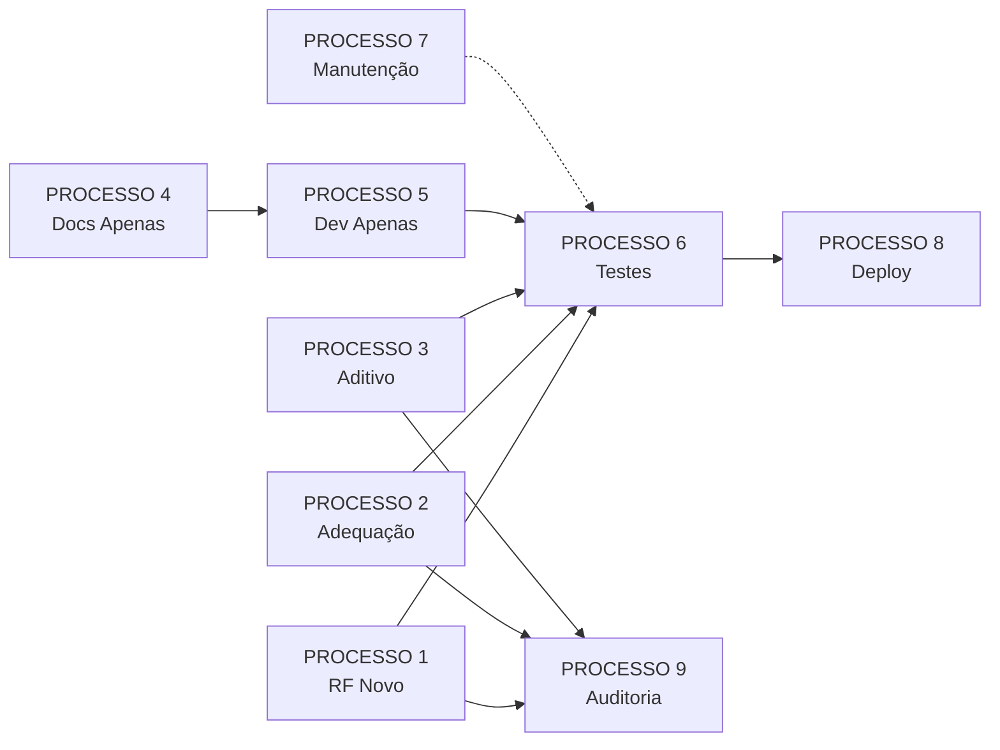

# PROCESSOS - Guia de Fluxos de Trabalho IControlIT

**Versão:** 1.0
**Data:** 2026-01-03
**Propósito:** Mapear todos os processos de desenvolvimento e quais prompts executar em cada cenário

---

## 📋 ÍNDICE DE PROCESSOS

1. [PROCESSO 1: RF Novo Completo (do zero)](#processo-1-rf-novo-completo-do-zero)
2. [PROCESSO 2: RF com Backend Legado (adequação)](#processo-2-rf-com-backend-legado-adequacao)
3. [PROCESSO 3: Aditivo - Adicionar Funcionalidade a RF Existente](#processo-3-aditivo---adicionar-funcionalidade-a-rf-existente)
4. [PROCESSO 4: Documentação Apenas (sem código)](#processo-4-documentacao-apenas-sem-codigo)
5. [PROCESSO 5: Desenvolvimento Apenas (docs prontos)](#processo-5-desenvolvimento-apenas-docs-prontos)
6. [PROCESSO 6: Testes Apenas (código pronto)](#processo-6-testes-apenas-codigo-pronto)
7. [PROCESSO 7: Manutenção e Debug](#processo-7-manutencao-e-debug)
8. [PROCESSO 8: Deploy](#processo-8-deploy)
9. [PROCESSO 9: Auditoria de Conformidade](#processo-9-auditoria-de-conformidade)

---

## PROCESSO 1: RF Novo Completo (do zero)

**Quando usar:** Você está criando um RF completamente novo, sem backend legado.

**Objetivo:** Criar documentação + backend + frontend + testes do zero.

### 📂 Fluxo Completo



### ✅ Sequência de Prompts

| # | Prompt | O que faz | Validador | O que valida |
|---|--------|-----------|-----------|--------------|
| 1 | `documentacao/execucao/rf-criacao.md` | Cria RF.md, RF.yaml (11 seções, ≥10 RNs) | `documentacao/validacao/rf.md` | 15 validações (estrutura, RNs, integrações) |
| 2 | `documentacao/execucao/uc-criacao.md` | Cria UC-RFXXX.md, UC-RFXXX.yaml (casos de uso) | `documentacao/validacao/uc.md` | 12 validações (cobertura RF→UC 100%) |
| 3 | `documentacao/execucao/wf-criacao.md` | Cria WF-RFXXX.md, WF-RFXXX.yaml (wireframes) | `documentacao/validacao/wf-md.md` | Validações de WF |
| 4 | `documentacao/execucao/md-criacao.md` | Cria MD-RFXXX.md, MD-RFXXX.yaml (modelo de dados) | `documentacao/validacao/wf-md.md` | 17 validações (WF: 9, MD: 7, STATUS: 1) |
| 5 | `documentacao/execucao/mt-tc-criacao.md` | Cria MT-RFXXX.yaml, TC-RFXXX.yaml (massas e casos de teste) | `documentacao/validacao/mt-tc-validacao.md` | Validações de MT e TC |
| 6 | `desenvolvimento/execucao/backend-criacao.md` | Implementa backend (.NET 10 + CQRS) | `desenvolvimento/validacao/backend.md` | Valida backend (testes de violação) |
| 7 | `desenvolvimento/execucao/frontend-criacao.md` | Implementa frontend (Angular 19) | `desenvolvimento/validacao/frontend.md` | Valida frontend |
| 8 | `testes/execucao-completa.md` | Executa testes (Backend, Frontend, E2E, Segurança) | - | - |

### 🎯 Resultado Esperado

- ✅ Documentação completa (RF, UC, WF, MD, MT, TC)
- ✅ Backend implementado e testado
- ✅ Frontend implementado
- ✅ Testes executados (100% aprovação)

---

## PROCESSO 2: RF com Backend Legado (adequação)

**Quando usar:** Você tem um backend legado (VB.NET, ASPX, SQL) e precisa adequar aos padrões atuais.

**Objetivo:** Adequar backend legado + criar frontend + testes.

### 📂 Fluxo Completo



### ✅ Sequência de Prompts

| # | Prompt | O que faz | Validador | O que valida |
|---|--------|-----------|-----------|--------------|
| 1 | `documentacao/execucao/rf-criacao.md` | Cria RF.md, RF.yaml | `documentacao/validacao/rf.md` | Validações de RF |
| 2 | `documentacao/execucao/uc-criacao.md` | Cria UC-RFXXX.md, UC-RFXXX.yaml | `documentacao/validacao/uc.md` | Validações de UC |
| 3 | `documentacao/execucao/wf-criacao.md` | Cria WF-RFXXX.md, WF-RFXXX.yaml | `documentacao/validacao/wf-md.md` | Validações de WF |
| 4 | `documentacao/execucao/md-criacao.md` | Cria MD-RFXXX.md, MD-RFXXX.yaml | `documentacao/validacao/wf-md.md` | Validações de MD |
| 5 | `desenvolvimento/execucao/backend-adequacao.md` | Audita e adequa backend legado aos padrões | `desenvolvimento/validacao/backend.md` | Valida backend adequado |
| 6 | `desenvolvimento/execucao/frontend-adequacao.md` | Ajusta/cria frontend | `desenvolvimento/validacao/frontend.md` | Valida frontend |
| 7 | `testes/execucao-completa.md` | Executa testes | - | - |

### 🎯 Resultado Esperado

- ✅ Backend legado adequado aos padrões (Clean Architecture, CQRS, multi-tenancy)
- ✅ Frontend criado/ajustado
- ✅ Testes executados

---

## PROCESSO 3: Aditivo - Adicionar Funcionalidade a RF Existente

**Quando usar:** RF já existe (docs + código), você quer adicionar uma nova funcionalidade.

**Objetivo:** Evolução incremental rastreável em todos os níveis (RF → UC → WF → MD → MT → TC → Backend → Frontend).

### 📂 Fluxo Completo



### ✅ Sequência de Prompts

| # | Prompt | O que faz | Validador | O que valida |
|---|--------|-----------|-----------|--------------|
| 1 | `documentacao/execucao/aditivo.md` | Cria backups `_old` (10 arquivos), adiciona funcionalidade em RF→UC→WF→MD→MT→TC | `documentacao/validacao/aditivo.md` | 15 validações (backups, delta, cobertura 100%, sincronização .md↔.yaml) |
| 2 | `desenvolvimento/execucao/backend-aditivo.md` | Analisa delta, implementa Entities, Migrations, Commands/Queries, Handlers, Endpoints | `desenvolvimento/validacao/backend-aditivo.md` | 10 validações (delta implementado, RNs validadas, build, tests) |
| 3 | `desenvolvimento/execucao/frontend-aditivo.md` | Analisa delta, implementa Services, Components, Routes, Forms, i18n | `desenvolvimento/validacao/frontend-aditivo.md` | 10 validações (delta implementado, permissões, responsividade, build, tests) |

### 🎯 Resultado Esperado

- ✅ Backups `_old` criados (10 arquivos)
- ✅ Nova funcionalidade adicionada em todos os níveis (RF, UC, WF, MD, MT, TC)
- ✅ Delta rastreável (relatórios de mudanças)
- ✅ Backend atualizado (Commands, Queries, Handlers, Endpoints)
- ✅ Frontend atualizado (Services, Components, Routes, Forms, i18n)
- ✅ Todas as validações APROVADAS (100%)

### 💡 Exemplo Prático

**Entrada:**
```
RF028 já existe. Adicionar funcionalidade de "Exportação em PDF".
```

**Execução:**
1. `documentacao/execucao/aditivo.md` → Cria RFXXX_old.*, adiciona 3 RNs, 1 endpoint, 2 UCs, 1 WF, 1 tabela
2. `documentacao/validacao/aditivo.md` → Valida 15/15 PASS
3. `desenvolvimento/execucao/backend-aditivo.md` → Implementa Entity, Migration, Query, Handler, Endpoint
4. `desenvolvimento/validacao/backend-aditivo.md` → Valida 10/10 PASS
5. `desenvolvimento/execucao/frontend-aditivo.md` → Implementa Service, Component, Route, Form, i18n
6. `desenvolvimento/validacao/frontend-aditivo.md` → Valida 10/10 PASS

**Saída:**
- ✅ Funcionalidade de Exportação PDF completa (docs + backend + frontend)

---

## PROCESSO 4: Documentação Apenas (sem código)

**Quando usar:** Você quer criar/atualizar apenas a documentação, sem mexer no código.

**Objetivo:** Gerar documentação completa e validada.

### ✅ Sequência de Prompts (RF Novo)

| # | Prompt | O que faz | Validador |
|---|--------|-----------|-----------|
| 1 | `documentacao/execucao/rf-criacao.md` | Cria RF.md, RF.yaml | `documentacao/validacao/rf.md` |
| 2 | `documentacao/execucao/uc-criacao.md` | Cria UC-RFXXX.md, UC-RFXXX.yaml | `documentacao/validacao/uc.md` |
| 3 | `documentacao/execucao/wf-criacao.md` | Cria WF-RFXXX.md, WF-RFXXX.yaml | - |
| 4 | `documentacao/execucao/md-criacao.md` | Cria MD-RFXXX.md, MD-RFXXX.yaml | `documentacao/validacao/wf-md.md` |
| 5 | `documentacao/execucao/mt-tc-criacao.md` | Cria MT-RFXXX.yaml, TC-RFXXX.yaml | - |

### ✅ Sequência de Prompts (Aditivo - Adicionar Funcionalidade)

| # | Prompt | O que faz | Validador |
|---|--------|-----------|-----------|
| 1 | `documentacao/execucao/aditivo.md` | Adiciona funcionalidade em RF→UC→WF→MD→MT→TC | `documentacao/validacao/aditivo.md` |

---

## PROCESSO 5: Desenvolvimento Apenas (docs prontos)

**Quando usar:** Documentação já está completa e validada, você quer implementar o código.

**Objetivo:** Implementar backend + frontend baseado nos documentos.

### ✅ Sequência de Prompts (RF Novo)

| # | Prompt | O que faz | Validador |
|---|--------|-----------|-----------|
| 1 | `desenvolvimento/execucao/backend-criacao.md` | Implementa backend (.NET 10 + CQRS) | `desenvolvimento/validacao/backend.md` |
| 2 | `desenvolvimento/execucao/frontend-criacao.md` | Implementa frontend (Angular 19) | `desenvolvimento/validacao/frontend.md` |

### ✅ Sequência de Prompts (Aditivo - Implementar Delta)

| # | Prompt | O que faz | Validador |
|---|--------|-----------|-----------|
| 1 | `desenvolvimento/execucao/backend-aditivo.md` | Implementa delta no backend | `desenvolvimento/validacao/backend-aditivo.md` |
| 2 | `desenvolvimento/execucao/frontend-aditivo.md` | Implementa delta no frontend | `desenvolvimento/validacao/frontend-aditivo.md` |

---

## PROCESSO 6: Testes Apenas (código pronto)

**Quando usar:** Backend e frontend já estão implementados, você quer executar testes.

**Objetivo:** Validar qualidade do código através de testes automatizados.

### ✅ Sequência de Prompts

| # | Prompt | O que faz |
|---|--------|-----------|
| 1 | `testes/execucao-completa.md` | Executa bateria completa de testes (3 baterias: Backend, Frontend, Outros) |

---

## PROCESSO 7: Manutenção e Debug

**Quando usar:** Correções, bugs, hotfix, investigação de erros.

**Objetivo:** Investigar, corrigir e validar problemas.

### ✅ Sequência de Prompts

| # | Prompt | O que faz |
|---|--------|-----------|
| 1 | `desenvolvimento/execucao/manutencao-controlada.md` | Correção controlada com validação de alinhamento RF ↔ Correção |

---

## PROCESSO 8: Deploy

**Quando usar:** Você quer fazer deploy para HOM ou PRD.

**Objetivo:** Publicar versão em ambiente.

### ✅ Sequência de Prompts

| # | Prompt | O que faz |
|---|--------|-----------|
| 1 | `deploy/01-deploy-hom.md` | Deploy HOM com validação |
| 2 | `deploy/02-deploy-hom-sem-validacao.md` | Deploy HOM sem validação (EXCEPCIONAL) |
| 3 | `deploy/03-deploy-prd.md` | Deploy PRD |

---

## PROCESSO 9: Auditoria de Conformidade

**Quando usar:** Você quer verificar se implementação (backend + frontend) está conforme especificação (RF, UC, WF, MD).

**Objetivo:** Identificar gaps entre especificação e implementação.

### ✅ Sequência de Prompts

| # | Prompt | O que faz |
|---|--------|-----------|
| 1 | `auditoria/01-auditoria-backend.md` | Auditar backend vs RF/UC/MD |
| 2 | `auditoria/02-auditoria-frontend.md` | Auditar frontend vs RF/UC/WF |
| 3 | `auditoria/03-auditoria-completa.md` | Auditar backend + frontend |

---

## 🗺️ MAPA DE DECISÕES

Use este mapa para decidir qual processo seguir:

```
┌─────────────────────────────────────────────────────────────┐
│ PERGUNTA 1: Você tem documentação?                          │
└─────────────────────────────────────────────────────────────┘
                │
        ┌───────┴───────┐
        │               │
      NÃO              SIM
        │               │
        v               v
┌───────────────┐   ┌───────────────┐
│ PROCESSO 1 ou │   │ PERGUNTA 2:   │
│ PROCESSO 2    │   │ Você tem      │
│ (criar docs)  │   │ código?       │
└───────────────┘   └───────────────┘
                        │
                ┌───────┴───────┐
                │               │
              NÃO              SIM
                │               │
                v               v
        ┌───────────────┐   ┌───────────────┐
        │ PROCESSO 5    │   │ PERGUNTA 3:   │
        │ (implementar) │   │ Quer adicionar│
        └───────────────┘   │ funcionalidade│
                            │ nova?         │
                            └───────────────┘
                                │
                        ┌───────┴───────┐
                        │               │
                      SIM              NÃO
                        │               │
                        v               v
                ┌───────────────┐   ┌───────────────┐
                │ PROCESSO 3    │   │ PERGUNTA 4:   │
                │ (aditivo)     │   │ Quer validar  │
                └───────────────┘   │ ou debugar?   │
                                    └───────────────┘
                                        │
                                ┌───────┴───────┐
                                │               │
                            VALIDAR         DEBUGAR
                                │               │
                                v               v
                        ┌───────────────┐   ┌───────────────┐
                        │ PROCESSO 9    │   │ PROCESSO 7    │
                        │ (auditoria)   │   │ (debug)       │
                        └───────────────┘   └───────────────┘
```

---

## 📊 TABELA DE REFERÊNCIA RÁPIDA

| Você quer... | Processo | Primeiro Prompt | Último Prompt |
|--------------|----------|-----------------|---------------|
| Criar RF novo completo | PROCESSO 1 | `documentacao/execucao/rf-criacao.md` | `testes/execucao-completa.md` |
| Adequar backend legado | PROCESSO 2 | `documentacao/execucao/rf-criacao.md` | `testes/execucao-completa.md` |
| Adicionar funcionalidade a RF | PROCESSO 3 | `documentacao/execucao/aditivo.md` | `desenvolvimento/validacao/frontend-aditivo.md` |
| Criar apenas documentação | PROCESSO 4 | `documentacao/execucao/rf-criacao.md` | `documentacao/execucao/mt-tc-criacao.md` |
| Implementar código (docs prontos) | PROCESSO 5 | `desenvolvimento/execucao/backend-criacao.md` | `desenvolvimento/execucao/frontend-criacao.md` |
| Executar testes | PROCESSO 6 | `testes/execucao-completa.md` | `testes/execucao-completa.md` |
| Corrigir bug | PROCESSO 7 | `desenvolvimento/execucao/manutencao-controlada.md` | `desenvolvimento/execucao/manutencao-controlada.md` |
| Fazer deploy | PROCESSO 8 | `deploy/01-deploy-hom.md` | `deploy/03-deploy-prd.md` |
| Auditar conformidade | PROCESSO 9 | `auditoria/01-auditoria-backend.md` | `auditoria/03-auditoria-completa.md` |

---

## 🔄 DEPENDÊNCIAS ENTRE PROCESSOS



---

## 💡 CENÁRIOS PRÁTICOS

### Cenário 1: "Preciso criar RF028 do zero"

**Processo:** PROCESSO 1 (RF Novo Completo)

**Sequência:**
1. `documentacao/execucao/rf-criacao.md` + `documentacao/validacao/rf.md`
2. `documentacao/execucao/uc-criacao.md` + `documentacao/validacao/uc.md`
3. `documentacao/execucao/wf-criacao.md` + `documentacao/validacao/wf-md.md`
4. `documentacao/execucao/md-criacao.md` + `documentacao/validacao/wf-md.md`
5. `documentacao/execucao/mt-tc-criacao.md` + `documentacao/validacao/mt-tc-validacao.md`
6. `desenvolvimento/execucao/backend-criacao.md` + `desenvolvimento/validacao/backend.md`
7. `desenvolvimento/execucao/frontend-criacao.md` + `desenvolvimento/validacao/frontend.md`
8. `testes/execucao-completa.md`

---

### Cenário 2: "RF028 já existe, quero adicionar exportação PDF"

**Processo:** PROCESSO 3 (Aditivo)

**Sequência:**
1. `documentacao/execucao/aditivo.md` + `documentacao/validacao/aditivo.md`
2. `desenvolvimento/execucao/backend-aditivo.md` + `desenvolvimento/validacao/backend-aditivo.md`
3. `desenvolvimento/execucao/frontend-aditivo.md` + `desenvolvimento/validacao/frontend-aditivo.md`

---

### Cenário 3: "Tenho a documentação RF028 pronta, preciso apenas implementar"

**Processo:** PROCESSO 5 (Desenvolvimento Apenas)

**Sequência:**
1. `desenvolvimento/execucao/backend-criacao.md` + `desenvolvimento/validacao/backend.md`
2. `desenvolvimento/execucao/frontend-criacao.md` + `desenvolvimento/validacao/frontend.md`

---

### Cenário 4: "Preciso validar se RF028 está conforme especificação"

**Processo:** PROCESSO 9 (Auditoria)

**Sequência:**
1. `auditoria/01-auditoria-backend.md`
2. `auditoria/02-auditoria-frontend.md`
3. `auditoria/03-auditoria-completa.md`

---

### Cenário 5: "RF028 está dando erro em produção"

**Processo:** PROCESSO 7 (Manutenção)

**Sequência:**
1. `desenvolvimento/execucao/manutencao-controlada.md` (identificar causa, corrigir e validar)
2. `testes/execucao-completa.md` (validar que correção não quebrou nada)
3. `deploy/01-deploy-hom.md` → `deploy/03-deploy-prd.md` (publicar correção)

---

## 📚 GLOSSÁRIO DE TERMOS

- **RF:** Requisito Funcional
- **UC:** Casos de Uso (Use Cases)
- **WF:** Wireframes (Fluxos de Tela)
- **MD:** Modelo de Dados (Data Model)
- **MT:** Massas de Teste (Test Data)
- **TC:** Casos de Teste (Test Cases)
- **Aditivo:** Evolução incremental de RF (adicionar funcionalidade)
- **Validador:** Prompt que valida se execução foi feita corretamente (modo READ-ONLY)
- **Delta:** Diferença entre versão atual e versão anterior (`_old`)
- **Backups `_old`:** Versões anteriores dos documentos (10 arquivos)

---

## 🔗 REFERÊNCIAS

- **Lista completa de prompts:** [prompts/README.md](README.md)
- **Contratos:** `contracts/`
- **Checklists:** `checklists/`
- **Governança:** [CLAUDE.md](../../CLAUDE.md)
- **Comandos:** [docs/COMMANDS.md](../COMMANDS.md)
- **Arquitetura:** [docs/ARCHITECTURE.md](../ARCHITECTURE.md)

---

## Versionamento

- **Criado em:** 2026-01-03
- **Última atualização:** 2026-01-03
- **Versão:** 1.0

---

**Mantido por:** Time de Arquitetura IControlIT
**Governado por:** D:\IC2\CLAUDE.md
