# Modelo de Dados - RF015

**Versão:** 1.0
**Data:** 2025-12-18
**RF Relacionado:** [RF015 - Gestão de Locais e Endereços](./RF015.md)
**Banco de Dados:** SQL Server (Produção) / SQLite (Desenvolvimento)

---

## 1. Diagrama de Entidades (Mermaid)

```mermaid
erDiagram
    Conglomerado ||--o{ Endereco : "possui"
    Endereco ||--o{ Edificio : "contém"
    Edificio ||--o{ Andar : "possui"
    Andar ||--o{ Sala : "possui"
    Sala ||--o{ Rack : "contém"
    Rack ||--o{ Posicao_Rack : "possui"

    Endereco {
        UNIQUEIDENTIFIER Id PK
        UNIQUEIDENTIFIER ConglomeradoId FK
        VARCHAR CEP
        VARCHAR Logradouro
        VARCHAR Numero
        VARCHAR Complemento
        VARCHAR Bairro
        VARCHAR Cidade
        VARCHAR UF
        VARCHAR Pais
        DECIMAL Latitude
        DECIMAL Longitude
        BIT FlPrincipal
        BIT FlExcluido
        DATETIME DtCriacao
        UNIQUEIDENTIFIER UsuarioCriacao
    }

    Edificio {
        UNIQUEIDENTIFIER Id PK
        UNIQUEIDENTIFIER ConglomeradoId FK
        UNIQUEIDENTIFIER EnderecoId FK
        VARCHAR Codigo
        VARCHAR Nome
        INT QtdAndares
        BIT FlExcluido
        DATETIME DtCriacao
    }

    Andar {
        UNIQUEIDENTIFIER Id PK
        UNIQUEIDENTIFIER ConglomeradoId FK
        UNIQUEIDENTIFIER EdificioId FK
        INT Numero
        VARCHAR Nome
        DECIMAL AreaM2
        BIT FlExcluido
        DATETIME DtCriacao
    }

    Sala {
        UNIQUEIDENTIFIER Id PK
        UNIQUEIDENTIFIER ConglomeradoId FK
        UNIQUEIDENTIFIER AndarId FK
        VARCHAR Codigo
        VARCHAR Nome
        VARCHAR TipoSala
        INT CapacidadePessoas
        DECIMAL TemperaturaIdeal
        BIT FlExcluido
        DATETIME DtCriacao
    }

    Rack {
        UNIQUEIDENTIFIER Id PK
        UNIQUEIDENTIFIER ConglomeradoId FK
        UNIQUEIDENTIFIER SalaId FK
        VARCHAR Codigo
        VARCHAR Nome
        INT AlturaUs
        DECIMAL LarguraPolegadas
        DECIMAL PotenciaMaximaWatts
        DECIMAL PesoMaximoKg
        BIT FlExcluido
        DATETIME DtCriacao
    }

    Posicao_Rack {
        UNIQUEIDENTIFIER Id PK
        UNIQUEIDENTIFIER ConglomeradoId FK
        UNIQUEIDENTIFIER RackId FK
        INT PosicaoInicio
        INT PosicaoFim
        UNIQUEIDENTIFIER AtivoId FK
        BIT FlOcupada
        DATETIME DtCriacao
    }
```



---

## 2. Entidades

### 2.1 Tabela: Endereco

**Descrição:** Armazena endereços físicos das empresas do conglomerado com suporte a geocodificação.

#### Campos

| Campo | Tipo | Nulo | Default | Descrição |
|-------|------|------|---------|-----------|
| Id | UNIQUEIDENTIFIER | NÃO | NEWID() | Chave primária |
| ClienteId | UNIQUEIDENTIFIER | NÃO | - | FK para Cliente (multi-tenancy raiz) (multi-tenancy) |
| CEP | VARCHAR(10) | SIM | NULL | CEP brasileiro (formato: 00000-000) |
| TipoLogradouro | VARCHAR(50) | SIM | NULL | Tipo (Rua, Avenida, Travessa, etc.) |
| Logradouro | VARCHAR(200) | NÃO | - | Nome da rua/avenida |
| Numero | VARCHAR(20) | NÃO | - | Número do imóvel |
| Complemento | VARCHAR(100) | SIM | NULL | Complemento (apto, sala, bloco) |
| Bairro | VARCHAR(100) | NÃO | - | Bairro/Distrito |
| Cidade | VARCHAR(100) | NÃO | - | Cidade |
| UF | CHAR(2) | NÃO | - | Sigla da UF (uppercase) |
| Pais | VARCHAR(100) | NÃO | 'Brasil' | País |
| Latitude | DECIMAL(10,8) | SIM | NULL | Coordenada GPS (geocodificação) |
| Longitude | DECIMAL(11,8) | SIM | NULL | Coordenada GPS (geocodificação) |
| FlPrincipal | BIT | NÃO | 0 | 1=Endereço principal da empresa |
| Ativo | BIT | NÃO | true | Soft delete: false=ativo, true=excluído |
| DtCriacao | DATETIME | NÃO | GETDATE() | Data de criação |
| UsuarioCriacao | UNIQUEIDENTIFIER | NÃO | - | Usuário que criou |
| DtAlteracao | DATETIME | SIM | NULL | Data de alteração |
| UsuarioAlteracao | UNIQUEIDENTIFIER | SIM | NULL | Usuário que alterou |

#### Índices

| Nome | Colunas | Tipo | Descrição |
|------|---------|------|-----------|
| IX_Endereco_Conglomerado | ConglomeradoId, FlExcluido | BTREE | Performance multi-tenant |
| IX_Endereco_CEP | CEP | BTREE | Busca por CEP |
| IX_Endereco_Cidade_UF | Cidade, UF | BTREE | Busca por cidade/estado |
| IX_Endereco_FlPrincipal | ConglomeradoId, FlPrincipal | BTREE | Endereço principal único |

#### Constraints

| Nome | Tipo | Definição | Descrição |
|------|------|-----------|-----------|
| PK_Endereco | PRIMARY KEY | Id | Chave primária |
| FK_Endereco_Conglomerado | FOREIGN KEY | ConglomeradoId REFERENCES Conglomerado(Id) | Multi-tenancy |
| FK_Endereco_UsuarioCriacao | FOREIGN KEY | UsuarioCriacao REFERENCES Usuario(Id) | Auditoria |
| UQ_Endereco_Principal | UNIQUE | (ConglomeradoId, FlPrincipal) WHERE FlPrincipal = 1 | Apenas 1 endereço principal |
| CK_Endereco_UF | CHECK | UF IN ('AC','AL','AM','AP','BA','CE','DF','ES','GO','MA','MG','MS','MT','PA','PB','PE','PI','PR','RJ','RN','RO','RR','RS','SC','SE','SP','TO') | UF válida |

---

### 2.2 Tabela: Edificio

**Descrição:** Edifícios/Prédios dentro de um endereço.

#### Campos

| Campo | Tipo | Nulo | Default | Descrição |
|-------|------|------|---------|-----------|
| Id | UNIQUEIDENTIFIER | NÃO | NEWID() | Chave primária |
| ClienteId | UNIQUEIDENTIFIER | NÃO | - | FK para Cliente (multi-tenancy raiz) |
| EnderecoId | UNIQUEIDENTIFIER | NÃO | - | FK para Endereco |
| Codigo | VARCHAR(50) | NÃO | - | Código único do edifício |
| Nome | VARCHAR(200) | NÃO | - | Nome do edifício |
| Descricao | VARCHAR(500) | SIM | NULL | Descrição |
| QtdAndares | INT | NÃO | 1 | Quantidade de andares |
| Ativo | BIT | NÃO | true | Soft delete: false=ativo, true=excluído |
| DtCriacao | DATETIME | NÃO | GETDATE() | Data de criação |
| UsuarioCriacao | UNIQUEIDENTIFIER | NÃO | - | Usuário que criou |
| DtAlteracao | DATETIME | SIM | NULL | Data de alteração |
| UsuarioAlteracao | UNIQUEIDENTIFIER | SIM | NULL | Usuário que alterou |

#### Índices

| Nome | Colunas | Tipo | Descrição |
|------|---------|------|-----------|
| IX_Edificio_Conglomerado | ConglomeradoId, FlExcluido | BTREE | Performance multi-tenant |
| IX_Edificio_Endereco | EnderecoId | BTREE | Busca por endereço |
| UQ_Edificio_Codigo | ConglomeradoId, Codigo | UNIQUE | Código único |

#### Constraints

| Nome | Tipo | Definição | Descrição |
|------|------|-----------|-----------|
| PK_Edificio | PRIMARY KEY | Id | Chave primária |
| FK_Edificio_Conglomerado | FOREIGN KEY | ConglomeradoId REFERENCES Conglomerado(Id) | Multi-tenancy |
| FK_Edificio_Endereco | FOREIGN KEY | EnderecoId REFERENCES Endereco(Id) | Relacionamento |
| CK_Edificio_QtdAndares | CHECK | QtdAndares >= 1 | Mínimo 1 andar |

---

### 2.3 Tabela: Andar

**Descrição:** Andares/Pavimentos dentro de um edifício.

#### Campos

| Campo | Tipo | Nulo | Default | Descrição |
|-------|------|------|---------|-----------|
| Id | UNIQUEIDENTIFIER | NÃO | NEWID() | Chave primária |
| ClienteId | UNIQUEIDENTIFIER | NÃO | - | FK para Cliente (multi-tenancy raiz) |
| EdificioId | UNIQUEIDENTIFIER | NÃO | - | FK para Edificio |
| Numero | INT | NÃO | - | Número do andar (0=Térreo, -1=Subsolo) |
| Nome | VARCHAR(200) | SIM | NULL | Nome do andar (ex: "1º Andar", "Mezanino") |
| AreaM2 | DECIMAL(10,2) | SIM | NULL | Área em m² |
| Ativo | BIT | NÃO | true | Soft delete: false=ativo, true=excluído |
| DtCriacao | DATETIME | NÃO | GETDATE() | Data de criação |
| UsuarioCriacao | UNIQUEIDENTIFIER | NÃO | - | Usuário que criou |
| DtAlteracao | DATETIME | SIM | NULL | Data de alteração |
| UsuarioAlteracao | UNIQUEIDENTIFIER | SIM | NULL | Usuário que alterou |

#### Índices

| Nome | Colunas | Tipo | Descrição |
|------|---------|------|-----------|
| IX_Andar_Conglomerado | ConglomeradoId, FlExcluido | BTREE | Performance multi-tenant |
| IX_Andar_Edificio | EdificioId, Numero | BTREE | Busca por edifício |
| UQ_Andar_Numero | EdificioId, Numero | UNIQUE | Número único por edifício |

#### Constraints

| Nome | Tipo | Definição | Descrição |
|------|------|-----------|-----------|
| PK_Andar | PRIMARY KEY | Id | Chave primária |
| FK_Andar_Conglomerado | FOREIGN KEY | ConglomeradoId REFERENCES Conglomerado(Id) | Multi-tenancy |
| FK_Andar_Edificio | FOREIGN KEY | EdificioId REFERENCES Edificio(Id) | Relacionamento |

---

### 2.4 Tabela: Sala

**Descrição:** Salas/Ambientes dentro de um andar.

#### Campos

| Campo | Tipo | Nulo | Default | Descrição |
|-------|------|------|---------|-----------|
| Id | UNIQUEIDENTIFIER | NÃO | NEWID() | Chave primária |
| ClienteId | UNIQUEIDENTIFIER | NÃO | - | FK para Cliente (multi-tenancy raiz) |
| AndarId | UNIQUEIDENTIFIER | NÃO | - | FK para Andar |
| Codigo | VARCHAR(50) | NÃO | - | Código único da sala |
| Nome | VARCHAR(200) | NÃO | - | Nome da sala |
| TipoSala | VARCHAR(50) | NÃO | - | Tipo (Datacenter, Sala_Servidores, CPD, Escritorio, Reuniao, Tecnica) |
| CapacidadePessoas | INT | SIM | NULL | Capacidade de pessoas |
| AreaM2 | DECIMAL(10,2) | SIM | NULL | Área em m² |
| TemperaturaIdeal | DECIMAL(5,2) | SIM | NULL | Temperatura ideal em °C |
| Ativo | BIT | NÃO | true | Soft delete: false=ativo, true=excluído |
| DtCriacao | DATETIME | NÃO | GETDATE() | Data de criação |
| UsuarioCriacao | UNIQUEIDENTIFIER | NÃO | - | Usuário que criou |
| DtAlteracao | DATETIME | SIM | NULL | Data de alteração |
| UsuarioAlteracao | UNIQUEIDENTIFIER | SIM | NULL | Usuário que alterou |

#### Índices

| Nome | Colunas | Tipo | Descrição |
|------|---------|------|-----------|
| IX_Sala_Conglomerado | ConglomeradoId, FlExcluido | BTREE | Performance multi-tenant |
| IX_Sala_Andar | AndarId | BTREE | Busca por andar |
| UQ_Sala_Codigo | ConglomeradoId, Codigo | UNIQUE | Código único |

#### Constraints

| Nome | Tipo | Definição | Descrição |
|------|------|-----------|-----------|
| PK_Sala | PRIMARY KEY | Id | Chave primária |
| FK_Sala_Conglomerado | FOREIGN KEY | ConglomeradoId REFERENCES Conglomerado(Id) | Multi-tenancy |
| FK_Sala_Andar | FOREIGN KEY | AndarId REFERENCES Andar(Id) | Relacionamento |
| CK_Sala_TipoSala | CHECK | TipoSala IN ('Datacenter','Sala_Servidores','CPD','Escritorio','Reuniao','Tecnica','Almoxarifado','Outro') | Tipo válido |

---

### 2.5 Tabela: Rack

**Descrição:** Racks de TI dentro de salas técnicas.

#### Campos

| Campo | Tipo | Nulo | Default | Descrição |
|-------|------|------|---------|-----------|
| Id | UNIQUEIDENTIFIER | NÃO | NEWID() | Chave primária |
| ClienteId | UNIQUEIDENTIFIER | NÃO | - | FK para Cliente (multi-tenancy raiz) |
| SalaId | UNIQUEIDENTIFIER | NÃO | - | FK para Sala |
| Codigo | VARCHAR(50) | NÃO | - | Código único do rack (ex: RACK-DC1-01) |
| Nome | VARCHAR(200) | NÃO | - | Nome do rack |
| AlturaUs | INT | NÃO | 42 | Altura em Us (padrão: 42U) |
| LarguraPolegadas | DECIMAL(5,2) | NÃO | 19.00 | Largura em polegadas (19" ou 23") |
| PotenciaMaximaWatts | DECIMAL(10,2) | SIM | NULL | Potência máxima suportada |
| PotenciaUtilizadaWatts | DECIMAL(10,2) | NÃO | 0 | Potência atualmente utilizada |
| PesoMaximoKg | DECIMAL(10,2) | SIM | NULL | Peso máximo suportado |
| PesoAtualKg | DECIMAL(10,2) | NÃO | 0 | Peso atual |
| Ativo | BIT | NÃO | true | Soft delete: false=ativo, true=excluído |
| DtCriacao | DATETIME | NÃO | GETDATE() | Data de criação |
| UsuarioCriacao | UNIQUEIDENTIFIER | NÃO | - | Usuário que criou |
| DtAlteracao | DATETIME | SIM | NULL | Data de alteração |
| UsuarioAlteracao | UNIQUEIDENTIFIER | SIM | NULL | Usuário que alterou |

#### Índices

| Nome | Colunas | Tipo | Descrição |
|------|---------|------|-----------|
| IX_Rack_Conglomerado | ConglomeradoId, FlExcluido | BTREE | Performance multi-tenant |
| IX_Rack_Sala | SalaId | BTREE | Busca por sala |
| UQ_Rack_Codigo | ConglomeradoId, Codigo | UNIQUE | Código único |

#### Constraints

| Nome | Tipo | Definição | Descrição |
|------|------|-----------|-----------|
| PK_Rack | PRIMARY KEY | Id | Chave primária |
| FK_Rack_Conglomerado | FOREIGN KEY | ConglomeradoId REFERENCES Conglomerado(Id) | Multi-tenancy |
| FK_Rack_Sala | FOREIGN KEY | SalaId REFERENCES Sala(Id) | Relacionamento |
| CK_Rack_AlturaUs | CHECK | AlturaUs BETWEEN 1 AND 48 | Altura válida (padrão indústria) |
| CK_Rack_LarguraPolegadas | CHECK | LarguraPolegadas IN (19.00, 23.00) | Largura padrão |
| CK_Rack_Potencia | CHECK | PotenciaUtilizadaWatts <= ISNULL(PotenciaMaximaWatts, PotenciaUtilizadaWatts) | Potência dentro do limite |
| CK_Rack_Peso | CHECK | PesoAtualKg <= ISNULL(PesoMaximoKg, PesoAtualKg) | Peso dentro do limite |

---

### 2.6 Tabela: Posicao_Rack

**Descrição:** Posições ocupadas dentro de racks (Us).

#### Campos

| Campo | Tipo | Nulo | Default | Descrição |
|-------|------|------|---------|-----------|
| Id | UNIQUEIDENTIFIER | NÃO | NEWID() | Chave primária |
| ClienteId | UNIQUEIDENTIFIER | NÃO | - | FK para Cliente (multi-tenancy raiz) |
| RackId | UNIQUEIDENTIFIER | NÃO | - | FK para Rack |
| PosicaoInicio | INT | NÃO | - | U inicial (ex: 10) |
| PosicaoFim | INT | NÃO | - | U final (ex: 12, ocupa 3Us) |
| AtivoId | UNIQUEIDENTIFIER | SIM | NULL | FK para Ativo instalado |
| FlOcupada | BIT | NÃO | 1 | 1=Ocupada, 0=Livre |
| DtCriacao | DATETIME | NÃO | GETDATE() | Data de instalação |
| UsuarioCriacao | UNIQUEIDENTIFIER | NÃO | - | Usuário que instalou |

#### Índices

| Nome | Colunas | Tipo | Descrição |
|------|---------|------|-----------|
| IX_PosicaoRack_Conglomerado | ClienteId | BTREE | Performance multi-tenant |
| IX_PosicaoRack_Rack | RackId, FlOcupada | BTREE | Busca por rack |
| IX_PosicaoRack_Ativo | AtivoId | BTREE | Busca por ativo |

#### Constraints

| Nome | Tipo | Definição | Descrição |
|------|------|-----------|-----------|
| PK_PosicaoRack | PRIMARY KEY | Id | Chave primária |
| FK_PosicaoRack_Conglomerado | FOREIGN KEY | ConglomeradoId REFERENCES Conglomerado(Id) | Multi-tenancy |
| FK_PosicaoRack_Rack | FOREIGN KEY | RackId REFERENCES Rack(Id) | Relacionamento |
| CK_PosicaoRack_Posicoes | CHECK | PosicaoFim >= PosicaoInicio | Fim >= Início |

---

### 2.7 Tabela: Historico_Movimentacao

**Descrição:** Histórico imutável de mudanças de local de ativos (auditoria de movimentações).

#### Campos

| Campo | Tipo | Nulo | Default | Descrição |
|-------|------|------|---------|-----------|
| Id | UNIQUEIDENTIFIER | NÃO | NEWID() | Chave primária |
| ClienteId | UNIQUEIDENTIFIER | NÃO | - | FK para Cliente (multi-tenancy raiz) |
| AtivoId | UNIQUEIDENTIFIER | NÃO | - | FK para Ativo |
| LocalOrigemId | UNIQUEIDENTIFIER | SIM | NULL | FK para Sala origem |
| LocalDestinoId | UNIQUEIDENTIFIER | NÃO | - | FK para Sala destino |
| RackOrigemId | UNIQUEIDENTIFIER | SIM | NULL | FK para Rack origem |
| RackDestinoId | UNIQUEIDENTIFIER | SIM | NULL | FK para Rack destino |
| Motivo | VARCHAR(500) | NÃO | - | Motivo da movimentação |
| NumeroProtocolo | VARCHAR(50) | SIM | NULL | Número do protocolo de mudança |
| DtMovimentacao | DATETIME | NÃO | GETDATE() | Data/hora da movimentação |
| UsuarioMovimentacao | UNIQUEIDENTIFIER | NÃO | - | Usuário que movimentou |

#### Índices

| Nome | Colunas | Tipo | Descrição |
|------|---------|------|-----------|
| IX_HistoricoMov_Conglomerado | ConglomeradoId, DtMovimentacao DESC | BTREE | Performance multi-tenant |
| IX_HistoricoMov_Ativo | AtivoId, DtMovimentacao DESC | BTREE | Histórico por ativo |
| IX_HistoricoMov_LocalDestino | LocalDestinoId | BTREE | Movimentações para local |

#### Constraints

| Nome | Tipo | Definição | Descrição |
|------|------|-----------|-----------|
| PK_HistoricoMov | PRIMARY KEY | Id | Chave primária |
| FK_HistoricoMov_Conglomerado | FOREIGN KEY | ConglomeradoId REFERENCES Conglomerado(Id) | Multi-tenancy |
| FK_HistoricoMov_Ativo | FOREIGN KEY | AtivoId REFERENCES Ativo(Id) | Ativo movimentado |

---

## 3. Relacionamentos

| Tabela Origem | Cardinalidade | Tabela Destino | Descrição |
|---------------|---------------|----------------|-----------|
| Conglomerado | 1:N | Endereco | Conglomerado possui muitos endereços |
| Endereco | 1:N | Edificio | Endereço contém muitos edifícios |
| Edificio | 1:N | Andar | Edifício possui muitos andares |
| Andar | 1:N | Sala | Andar possui muitas salas |
| Sala | 1:N | Rack | Sala contém muitos racks |
| Rack | 1:N | Posicao_Rack | Rack possui muitas posições |
| Ativo | 1:N | Posicao_Rack | Ativo pode ocupar posição em rack |
| Ativo | 1:N | Historico_Movimentacao | Ativo tem histórico de movimentações |

---

## 4. DDL - SQL Server

```sql
-- =============================================
-- RF015 - Gestão de Locais e Endereços
-- Modelo de Dados
-- Data: 2025-12-18
-- =============================================

-- ---------------------------------------------
-- Tabela: Endereco
-- ---------------------------------------------
CREATE TABLE Endereco (
    Id UNIQUEIDENTIFIER PRIMARY KEY DEFAULT NEWID(),
    ClienteId UNIQUEIDENTIFIER NOT NULL,
    CEP VARCHAR(10),
    TipoLogradouro VARCHAR(50),
    Logradouro VARCHAR(200) NOT NULL,
    Numero VARCHAR(20) NOT NULL,
    Complemento VARCHAR(100),
    Bairro VARCHAR(100) NOT NULL,
    Cidade VARCHAR(100) NOT NULL,
    UF CHAR(2) NOT NULL,
    Pais VARCHAR(100) NOT NULL DEFAULT 'Brasil',
    Latitude DECIMAL(10,8),
    Longitude DECIMAL(11,8),
    FlPrincipal BIT NOT NULL DEFAULT 0,
    FlExcluido BIT NOT NULL DEFAULT 0,
    DtCriacao DATETIME NOT NULL DEFAULT GETDATE(),
    UsuarioCriacao UNIQUEIDENTIFIER NOT NULL,
    DtAlteracao DATETIME,
    UsuarioAlteracao UNIQUEIDENTIFIER,

    -- Foreign Keys
    CONSTRAINT FK_Endereco_Conglomerado
        FOREIGN KEY (ClienteId) REFERENCES Cliente(Id),
    CONSTRAINT FK_Endereco_UsuarioCriacao
        FOREIGN KEY (UsuarioCriacao) REFERENCES Usuario(Id),

    -- Unique Constraints
    CONSTRAINT UQ_Endereco_Principal
        UNIQUE (ConglomeradoId, FlPrincipal)
        WHERE FlPrincipal = 1,

    -- Check Constraints
    CONSTRAINT CK_Endereco_UF
        CHECK (UF IN ('AC','AL','AM','AP','BA','CE','DF','ES','GO','MA','MG','MS','MT','PA','PB','PE','PI','PR','RJ','RN','RO','RR','RS','SC','SE','SP','TO'))
);

-- Índices
CREATE INDEX IX_Endereco_Conglomerado
    ON Endereco(ConglomeradoId, Ativo);
CREATE INDEX IX_Endereco_CEP
    ON Endereco(CEP);
CREATE INDEX IX_Endereco_Cidade_UF
    ON Endereco(Cidade, UF);
CREATE INDEX IX_Endereco_FlPrincipal
    ON Endereco(ConglomeradoId, FlPrincipal)
    WHERE FlPrincipal = 1;

-- Comentários
EXEC sp_addextendedproperty 'MS_Description', 'Endereços físicos das empresas', 'SCHEMA', 'dbo', 'TABLE', 'Endereco';
EXEC sp_addextendedproperty 'MS_Description', 'CEP brasileiro (formato: 00000-000)', 'SCHEMA', 'dbo', 'TABLE', 'Endereco', 'COLUMN', 'CEP';
EXEC sp_addextendedproperty 'MS_Description', '1=Endereço principal da empresa', 'SCHEMA', 'dbo', 'TABLE', 'Endereco', 'COLUMN', 'FlPrincipal';

GO

-- ---------------------------------------------
-- Tabela: Edificio
-- ---------------------------------------------
CREATE TABLE Edificio (
    Id UNIQUEIDENTIFIER PRIMARY KEY DEFAULT NEWID(),
    ClienteId UNIQUEIDENTIFIER NOT NULL,
    EnderecoId UNIQUEIDENTIFIER NOT NULL,
    Codigo VARCHAR(50) NOT NULL,
    Nome VARCHAR(200) NOT NULL,
    Descricao VARCHAR(500),
    QtdAndares INT NOT NULL DEFAULT 1,
    FlExcluido BIT NOT NULL DEFAULT 0,
    DtCriacao DATETIME NOT NULL DEFAULT GETDATE(),
    UsuarioCriacao UNIQUEIDENTIFIER NOT NULL,
    DtAlteracao DATETIME,
    UsuarioAlteracao UNIQUEIDENTIFIER,

    -- Foreign Keys
    CONSTRAINT FK_Edificio_Conglomerado
        FOREIGN KEY (ClienteId) REFERENCES Cliente(Id),
    CONSTRAINT FK_Edificio_Endereco
        FOREIGN KEY (EnderecoId) REFERENCES Endereco(Id),

    -- Check Constraints
    CONSTRAINT CK_Edificio_QtdAndares
        CHECK (QtdAndares >= 1)
);

-- Índices
CREATE INDEX IX_Edificio_Conglomerado
    ON Edificio(ConglomeradoId, Ativo);
CREATE INDEX IX_Edificio_Endereco
    ON Edificio(EnderecoId);
CREATE UNIQUE INDEX UQ_Edificio_Codigo
    ON Edificio(ConglomeradoId, Codigo)
    WHERE FlExcluido = 0;

GO

-- ---------------------------------------------
-- Tabela: Andar
-- ---------------------------------------------
CREATE TABLE Andar (
    Id UNIQUEIDENTIFIER PRIMARY KEY DEFAULT NEWID(),
    ClienteId UNIQUEIDENTIFIER NOT NULL,
    EdificioId UNIQUEIDENTIFIER NOT NULL,
    Numero INT NOT NULL,
    Nome VARCHAR(200),
    AreaM2 DECIMAL(10,2),
    FlExcluido BIT NOT NULL DEFAULT 0,
    DtCriacao DATETIME NOT NULL DEFAULT GETDATE(),
    UsuarioCriacao UNIQUEIDENTIFIER NOT NULL,
    DtAlteracao DATETIME,
    UsuarioAlteracao UNIQUEIDENTIFIER,

    -- Foreign Keys
    CONSTRAINT FK_Andar_Conglomerado
        FOREIGN KEY (ClienteId) REFERENCES Cliente(Id),
    CONSTRAINT FK_Andar_Edificio
        FOREIGN KEY (EdificioId) REFERENCES Edificio(Id)
);

-- Índices
CREATE INDEX IX_Andar_Conglomerado
    ON Andar(ConglomeradoId, Ativo);
CREATE INDEX IX_Andar_Edificio
    ON Andar(EdificioId, Numero);
CREATE UNIQUE INDEX UQ_Andar_Numero
    ON Andar(EdificioId, Numero)
    WHERE FlExcluido = 0;

GO

-- ---------------------------------------------
-- Tabela: Sala
-- ---------------------------------------------
CREATE TABLE Sala (
    Id UNIQUEIDENTIFIER PRIMARY KEY DEFAULT NEWID(),
    ClienteId UNIQUEIDENTIFIER NOT NULL,
    AndarId UNIQUEIDENTIFIER NOT NULL,
    Codigo VARCHAR(50) NOT NULL,
    Nome VARCHAR(200) NOT NULL,
    TipoSala VARCHAR(50) NOT NULL,
    CapacidadePessoas INT,
    AreaM2 DECIMAL(10,2),
    TemperaturaIdeal DECIMAL(5,2),
    FlExcluido BIT NOT NULL DEFAULT 0,
    DtCriacao DATETIME NOT NULL DEFAULT GETDATE(),
    UsuarioCriacao UNIQUEIDENTIFIER NOT NULL,
    DtAlteracao DATETIME,
    UsuarioAlteracao UNIQUEIDENTIFIER,

    -- Foreign Keys
    CONSTRAINT FK_Sala_Conglomerado
        FOREIGN KEY (ClienteId) REFERENCES Cliente(Id),
    CONSTRAINT FK_Sala_Andar
        FOREIGN KEY (AndarId) REFERENCES Andar(Id),

    -- Check Constraints
    CONSTRAINT CK_Sala_TipoSala
        CHECK (TipoSala IN ('Datacenter','Sala_Servidores','CPD','Escritorio','Reuniao','Tecnica','Almoxarifado','Outro'))
);

-- Índices
CREATE INDEX IX_Sala_Conglomerado
    ON Sala(ConglomeradoId, Ativo);
CREATE INDEX IX_Sala_Andar
    ON Sala(AndarId);
CREATE UNIQUE INDEX UQ_Sala_Codigo
    ON Sala(ConglomeradoId, Codigo)
    WHERE FlExcluido = 0;

GO

-- ---------------------------------------------
-- Tabela: Rack
-- ---------------------------------------------
CREATE TABLE Rack (
    Id UNIQUEIDENTIFIER PRIMARY KEY DEFAULT NEWID(),
    ClienteId UNIQUEIDENTIFIER NOT NULL,
    SalaId UNIQUEIDENTIFIER NOT NULL,
    Codigo VARCHAR(50) NOT NULL,
    Nome VARCHAR(200) NOT NULL,
    AlturaUs INT NOT NULL DEFAULT 42,
    LarguraPolegadas DECIMAL(5,2) NOT NULL DEFAULT 19.00,
    PotenciaMaximaWatts DECIMAL(10,2),
    PotenciaUtilizadaWatts DECIMAL(10,2) NOT NULL DEFAULT 0,
    PesoMaximoKg DECIMAL(10,2),
    PesoAtualKg DECIMAL(10,2) NOT NULL DEFAULT 0,
    FlExcluido BIT NOT NULL DEFAULT 0,
    DtCriacao DATETIME NOT NULL DEFAULT GETDATE(),
    UsuarioCriacao UNIQUEIDENTIFIER NOT NULL,
    DtAlteracao DATETIME,
    UsuarioAlteracao UNIQUEIDENTIFIER,

    -- Foreign Keys
    CONSTRAINT FK_Rack_Conglomerado
        FOREIGN KEY (ClienteId) REFERENCES Cliente(Id),
    CONSTRAINT FK_Rack_Sala
        FOREIGN KEY (SalaId) REFERENCES Sala(Id),

    -- Check Constraints
    CONSTRAINT CK_Rack_AlturaUs
        CHECK (AlturaUs BETWEEN 1 AND 48),
    CONSTRAINT CK_Rack_LarguraPolegadas
        CHECK (LarguraPolegadas IN (19.00, 23.00)),
    CONSTRAINT CK_Rack_Potencia
        CHECK (PotenciaUtilizadaWatts <= ISNULL(PotenciaMaximaWatts, PotenciaUtilizadaWatts)),
    CONSTRAINT CK_Rack_Peso
        CHECK (PesoAtualKg <= ISNULL(PesoMaximoKg, PesoAtualKg))
);

-- Índices
CREATE INDEX IX_Rack_Conglomerado
    ON Rack(ConglomeradoId, Ativo);
CREATE INDEX IX_Rack_Sala
    ON Rack(SalaId);
CREATE UNIQUE INDEX UQ_Rack_Codigo
    ON Rack(ConglomeradoId, Codigo)
    WHERE FlExcluido = 0;

GO

-- ---------------------------------------------
-- Tabela: Posicao_Rack
-- ---------------------------------------------
CREATE TABLE Posicao_Rack (
    Id UNIQUEIDENTIFIER PRIMARY KEY DEFAULT NEWID(),
    ClienteId UNIQUEIDENTIFIER NOT NULL,
    RackId UNIQUEIDENTIFIER NOT NULL,
    PosicaoInicio INT NOT NULL,
    PosicaoFim INT NOT NULL,
    AtivoId UNIQUEIDENTIFIER,
    FlOcupada BIT NOT NULL DEFAULT 1,
    DtCriacao DATETIME NOT NULL DEFAULT GETDATE(),
    UsuarioCriacao UNIQUEIDENTIFIER NOT NULL,

    -- Foreign Keys
    CONSTRAINT FK_PosicaoRack_Conglomerado
        FOREIGN KEY (ClienteId) REFERENCES Cliente(Id),
    CONSTRAINT FK_PosicaoRack_Rack
        FOREIGN KEY (RackId) REFERENCES Rack(Id),

    -- Check Constraints
    CONSTRAINT CK_PosicaoRack_Posicoes
        CHECK (PosicaoFim >= PosicaoInicio)
);

-- Índices
CREATE INDEX IX_PosicaoRack_Conglomerado
    ON Posicao_Rack(ConglomeradoId);
CREATE INDEX IX_PosicaoRack_Rack
    ON Posicao_Rack(RackId, FlOcupada);
CREATE INDEX IX_PosicaoRack_Ativo
    ON Posicao_Rack(AtivoId)
    WHERE AtivoId IS NOT NULL;

GO

-- ---------------------------------------------
-- Tabela: Historico_Movimentacao
-- ---------------------------------------------
CREATE TABLE Historico_Movimentacao (
    Id UNIQUEIDENTIFIER PRIMARY KEY DEFAULT NEWID(),
    ClienteId UNIQUEIDENTIFIER NOT NULL,
    AtivoId UNIQUEIDENTIFIER NOT NULL,
    LocalOrigemId UNIQUEIDENTIFIER,
    LocalDestinoId UNIQUEIDENTIFIER NOT NULL,
    RackOrigemId UNIQUEIDENTIFIER,
    RackDestinoId UNIQUEIDENTIFIER,
    Motivo VARCHAR(500) NOT NULL,
    NumeroProtocolo VARCHAR(50),
    DtMovimentacao DATETIME NOT NULL DEFAULT GETDATE(),
    UsuarioMovimentacao UNIQUEIDENTIFIER NOT NULL,

    -- Foreign Keys
    CONSTRAINT FK_HistoricoMov_Conglomerado
        FOREIGN KEY (ClienteId) REFERENCES Cliente(Id),
    -- AtivoId FK será criado quando tabela Ativo existir
    CONSTRAINT FK_HistoricoMov_LocalOrigem
        FOREIGN KEY (LocalOrigemId) REFERENCES Sala(Id),
    CONSTRAINT FK_HistoricoMov_LocalDestino
        FOREIGN KEY (LocalDestinoId) REFERENCES Sala(Id),
    CONSTRAINT FK_HistoricoMov_RackOrigem
        FOREIGN KEY (RackOrigemId) REFERENCES Rack(Id),
    CONSTRAINT FK_HistoricoMov_RackDestino
        FOREIGN KEY (RackDestinoId) REFERENCES Rack(Id)
);

-- Índices
CREATE INDEX IX_HistoricoMov_Conglomerado
    ON Historico_Movimentacao(ConglomeradoId, DtMovimentacao DESC);
CREATE INDEX IX_HistoricoMov_Ativo
    ON Historico_Movimentacao(AtivoId, DtMovimentacao DESC);
CREATE INDEX IX_HistoricoMov_LocalDestino
    ON Historico_Movimentacao(LocalDestinoId);

GO
```

---

## 5. Dados Iniciais (Seed)

```sql
-- Não há dados iniciais para este módulo.
-- Os locais são específicos de cada conglomerado/empresa.
```

---

## 6. Observações

### Decisões de Modelagem

1. **Hierarquia Multinível**: Escolheu-se modelar hierarquia completa (Endereço → Edifício → Andar → Sala → Rack → Posição) para máxima flexibilidade e rastreabilidade de ativos.

2. **Soft Delete**: Todas as tabelas utilizam `FlExcluido` para preservar histórico e integridade referencial.

3. **Endereço Principal Único**: Constraint `UQ_Endereco_Principal` garante apenas 1 endereço principal por conglomerado usando filtered index.

4. **Geocodificação Opcional**: Campos `Latitude` e `Longitude` são opcionais para permitir cadastro sem integração com APIs de geocodificação.

5. **Racks Padrão Indústria**: Constraints garantem altura (1-48Us) e largura (19" ou 23") dentro de padrões da indústria.

6. **Histórico Imutável**: Tabela `Historico_Movimentacao` é append-only (sem UPDATE/DELETE) para auditoria confiável.

### Considerações de Performance

- Índices em `ConglomeradoId` + `FlExcluido` para queries multi-tenant eficientes
- Índices em foreign keys para joins performáticos
- Índices filtrados (WHERE FlExcluido = 0) para economizar espaço
- Índices em campos de busca comum (CEP, Cidade/UF, Código)

### Notas sobre Migração de Dados

- Mapear tabelas legado: `Endereco`, `Sala`, `Rack` (se existirem)
- Converter endereços de formato livre para estrutura hierárquica
- Geocodificar endereços existentes em batch (API ViaCEP + Google Maps)
- Validar UFs e convertidamente para uppercase
- Criar histórico inicial de locais dos ativos

---

## Histórico de Alterações

| Versão | Data | Autor | Descrição |
|--------|------|-------|-----------|
| 1.0 | 2025-12-18 | IControlIT Architect Agent | Versão inicial - Modelo completo de Locais e Endereços |
