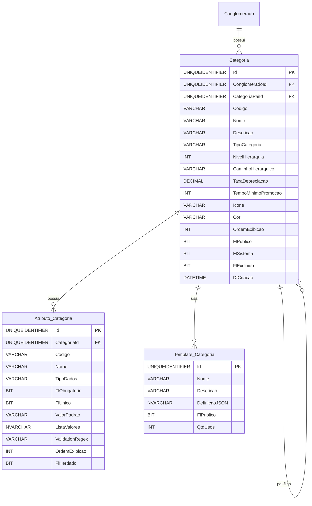

# Modelo de Dados - RF016

**Versão:** 1.0
**Data:** 2025-12-18
**RF Relacionado:** [RF016 - Gestão de Categorias de Ativos](./RF016.md)
**Banco de Dados:** SQL Server (Produção) / SQLite (Desenvolvimento)

---

## 1. Diagrama de Entidades (Mermaid)



---

## 2. Entidades Principais

### 2.1 Tabela: Categoria

**Descrição:** Hierarquia de categorias para classificação de ativos, serviços, chamados e contratos.

#### Campos Principais

| Campo | Tipo | Descrição |
|-------|------|-----------|
| Id | UNIQUEIDENTIFIER | Chave primária |
| ClienteId | UNIQUEIDENTIFIER | FK multi-tenancy (NULL = global) |
| CategoriaPaiId | UNIQUEIDENTIFIER | FK auto-relacionamento (hierarquia) |
| Codigo | VARCHAR(50) | Código único |
| Nome | VARCHAR(200) | Nome da categoria |
| TipoCategoria | VARCHAR(50) | Ativo/Servico/Chamado/Contrato |
| NivelHierarquia | INT | Nível na árvore (1-10) |
| CaminhoHierarquico | VARCHAR(500) | Ex: /Hardware/Computadores/Notebooks |
| TaxaDepreciacao | DECIMAL(5,2) | % depreciação anual (0-100) |
| FlPublico | BIT | 1=Template compartilhado |
| FlSistema | BIT | 1=Categoria protegida |
| FlExcluido | BIT | Soft delete: false=ativo, true=excluído |

#### Constraints Principais

```sql
CONSTRAINT CK_Categoria_NivelHierarquia CHECK (NivelHierarquia BETWEEN 1 AND 10)
CONSTRAINT CK_Categoria_TaxaDepreciacao CHECK (TaxaDepreciacao BETWEEN 0 AND 100)
CONSTRAINT CK_Categoria_TipoCategoria CHECK (TipoCategoria IN ('Ativo','Servico','Chamado','Contrato'))
```

---

### 2.2 Tabela: Atributo_Categoria

**Descrição:** Campos customizados específicos de cada categoria (herdados por subcategorias).

#### Campos Principais

| Campo | Tipo | Descrição |
|-------|------|-----------|
| Id | UNIQUEIDENTIFIER | Chave primária |
| CategoriaId | UNIQUEIDENTIFIER | FK para Categoria |
| Codigo | VARCHAR(50) | Código do atributo (ex: velocidade_cpu) |
| Nome | VARCHAR(100) | Nome exibido (ex: "Velocidade do CPU") |
| TipoDados | VARCHAR(20) | String/Integer/Decimal/Date/Boolean/List/Text |
| FlObrigatorio | BIT | 1=Campo obrigatório |
| FlUnico | BIT | 1=Valor único (não duplicado) |
| FlHerdado | BIT | 1=Herdado de categoria pai |
| ListaValores | NVARCHAR(MAX) | JSON array (se TipoDados=List) |
| ValidationRegex | VARCHAR(500) | Regex para validação |

---

### 2.3 Tabela: Template_Categoria

**Descrição:** Templates pré-configurados de categorias para reuso.

#### Campos Principais

| Campo | Tipo | Descrição |
|-------|------|-----------|
| Id | UNIQUEIDENTIFIER | Chave primária |
| Nome | VARCHAR(200) | Nome do template |
| Descricao | VARCHAR(500) | Descrição |
| DefinicaoJSON | NVARCHAR(MAX) | JSON com estrutura completa |
| FlPublico | BIT | 1=Visível para todos conglomerados |
| QtdUsos | INT | Contador de usos |

---

## 3. DDL Simplificado - SQL Server

```sql
-- Tabela: Categoria
CREATE TABLE Categoria (
    Id UNIQUEIDENTIFIER PRIMARY KEY DEFAULT NEWID(),
    ClienteId UNIQUEIDENTIFIER,
    CategoriaPaiId UNIQUEIDENTIFIER,
    Codigo VARCHAR(50) NOT NULL,
    Nome VARCHAR(200) NOT NULL,
    Descricao VARCHAR(1000),
    TipoCategoria VARCHAR(50) NOT NULL,
    NivelHierarquia INT NOT NULL DEFAULT 1,
    CaminhoHierarquico VARCHAR(500),
    TaxaDepreciacao DECIMAL(5,2),
    TempoMinimoPromocao INT,
    Icone VARCHAR(50),
    Cor VARCHAR(7),
    OrdemExibicao INT NOT NULL DEFAULT 100,
    FlPublico BIT NOT NULL DEFAULT 0,
    FlSistema BIT NOT NULL DEFAULT 0,
    FlExcluido BIT NOT NULL DEFAULT 0,
    DtCriacao DATETIME NOT NULL DEFAULT GETDATE(),
    UsuarioCriacao UNIQUEIDENTIFIER NOT NULL,
    DtAlteracao DATETIME,
    UsuarioAlteracao UNIQUEIDENTIFIER,

    CONSTRAINT FK_Categoria_Conglomerado
        FOREIGN KEY (ClienteId) REFERENCES Cliente(Id),
    CONSTRAINT FK_Categoria_CategoriaPai
        FOREIGN KEY (CategoriaPaiId) REFERENCES Categoria(Id),
    CONSTRAINT CK_Categoria_NivelHierarquia
        CHECK (NivelHierarquia BETWEEN 1 AND 10),
    CONSTRAINT CK_Categoria_TaxaDepreciacao
        CHECK (TaxaDepreciacao IS NULL OR (TaxaDepreciacao BETWEEN 0 AND 100)),
    CONSTRAINT CK_Categoria_TipoCategoria
        CHECK (TipoCategoria IN ('Ativo','Servico','Chamado','Contrato'))
);

CREATE INDEX IX_Categoria_Conglomerado ON Categoria(ConglomeradoId, Ativo);
CREATE INDEX IX_Categoria_CategoriaPai ON Categoria(CategoriaPaiId);
CREATE UNIQUE INDEX UQ_Categoria_Codigo ON Categoria(ISNULL(ConglomeradoId, '00000000-0000-0000-0000-000000000000'), Codigo) WHERE FlExcluido = 0;

GO

-- Tabela: Atributo_Categoria
CREATE TABLE Atributo_Categoria (
    Id UNIQUEIDENTIFIER PRIMARY KEY DEFAULT NEWID(),
    CategoriaId UNIQUEIDENTIFIER NOT NULL,
    Codigo VARCHAR(50) NOT NULL,
    Nome VARCHAR(100) NOT NULL,
    TipoDados VARCHAR(20) NOT NULL,
    FlObrigatorio BIT NOT NULL DEFAULT 0,
    FlUnico BIT NOT NULL DEFAULT 0,
    FlHerdado BIT NOT NULL DEFAULT 0,
    ValorPadrao VARCHAR(500),
    ListaValores NVARCHAR(MAX),
    ValidationRegex VARCHAR(500),
    MensagemValidacao NVARCHAR(200),
    OrdemExibicao INT NOT NULL DEFAULT 100,
    FlExibir_Grid BIT NOT NULL DEFAULT 1,
    FlExcluido BIT NOT NULL DEFAULT 0,
    DtCriacao DATETIME NOT NULL DEFAULT GETDATE(),

    CONSTRAINT FK_AtributoCategoria_Categoria
        FOREIGN KEY (CategoriaId) REFERENCES Categoria(Id) ON DELETE CASCADE,
    CONSTRAINT UQ_AtributoCategoria_Codigo
        UNIQUE (CategoriaId, Codigo),
    CONSTRAINT CK_AtributoCategoria_TipoDados
        CHECK (TipoDados IN ('String','Integer','Decimal','Date','Boolean','List','Text'))
);

CREATE INDEX IX_AtributoCategoria_Categoria ON Atributo_Categoria(CategoriaId, Ativo);

GO

-- Tabela: Template_Categoria
CREATE TABLE Template_Categoria (
    Id UNIQUEIDENTIFIER PRIMARY KEY DEFAULT NEWID(),
    Nome VARCHAR(200) NOT NULL,
    Descricao VARCHAR(500),
    DefinicaoJSON NVARCHAR(MAX) NOT NULL,
    FlPublico BIT NOT NULL DEFAULT 0,
    QtdUsos INT NOT NULL DEFAULT 0,
    DtCriacao DATETIME NOT NULL DEFAULT GETDATE(),
    UsuarioCriacao UNIQUEIDENTIFIER NOT NULL
);

CREATE INDEX IX_TemplateCategoria_FlPublico ON Template_Categoria(FlPublico) WHERE FlPublico = 1;

GO

-- Tabela: Categoria_Auditoria
CREATE TABLE Categoria_Auditoria (
    Id UNIQUEIDENTIFIER PRIMARY KEY DEFAULT NEWID(),
    CategoriaId UNIQUEIDENTIFIER NOT NULL,
    TipoOperacao VARCHAR(20) NOT NULL,
    DtOperacao DATETIME NOT NULL DEFAULT GETDATE(),
    UsuarioId UNIQUEIDENTIFIER,
    NomeUsuario VARCHAR(200),
    DadosAntes NVARCHAR(MAX),
    DadosDepois NVARCHAR(MAX),
    CamposAlterados VARCHAR(1000),

    CONSTRAINT FK_CategoriaAuditoria_Categoria
        FOREIGN KEY (CategoriaId) REFERENCES Categoria(Id),
    CONSTRAINT CK_CategoriaAuditoria_TipoOp
        CHECK (TipoOperacao IN ('INSERT','UPDATE','DELETE','RESTORE'))
);

CREATE INDEX IX_CategoriaAuditoria_Categoria ON Categoria_Auditoria(CategoriaId, DtOperacao DESC);

GO
```

---

## 4. Regras de Negócio Implementadas

### RN-CAD-012-01: Hierarquia Máxima de 10 Níveis
- **Implementação:** Constraint `CK_Categoria_NivelHierarquia CHECK (NivelHierarquia BETWEEN 1 AND 10)`

### RN-CAD-012-02: Validação de Loops na Hierarquia
- **Implementação:** Validação via stored procedure/trigger que verifica recursivamente se CategoriaPaiId não cria ciclo

### RN-CAD-012-03: Taxa de Depreciação Válida
- **Implementação:** Constraint `CK_Categoria_TaxaDepreciacao CHECK (TaxaDepreciacao BETWEEN 0 AND 100)`

### RN-CAD-012-07: Categorias de Sistema Não Editáveis
- **Implementação:** Campo `FlSistema BIT` + validação na aplicação (Commands rejeitam edição/exclusão se FlSistema = 1)

### RN-CAD-012-09: Atributos Herdados
- **Implementação:** Campo `FlHerdado BIT` + trigger/SP que propaga atributos da categoria pai para filhas

---

## 5. Observações

### Decisões de Modelagem

1. **Hierarquia Ilimitada (até 10 níveis)**: Auto-relacionamento `CategoriaPaiId` permite estrutura flexível
2. **Multi-tenancy Opcional**: `ConglomeradoId NULL` permite categorias globais (templates compartilhados)
3. **Herança de Atributos**: Flag `FlHerdado` identifica atributos herdados de categorias pai
4. **Templates Reutilizáveis**: Tabela `Template_Categoria` com JSON para fácil importação/exportação
5. **Auditoria Completa**: Tabela dedicada com before/after em JSON

### Performance

- Índices em foreign keys e campos de busca
- Caminho hierárquico desnormalizado para queries rápidas
- Contador de usos em templates para analytics

### Migração de Dados

- Mapear "Grupo" e "Sub Grupo" legado para hierarquia de categorias
- Converter atributos customizados para tabela `Atributo_Categoria`
- Criar templates para categorias mais usadas

---

## Histórico de Alterações

| Versão | Data | Autor | Descrição |
|--------|------|-------|-----------|
| 1.0 | 2025-12-18 | IControlIT Architect Agent | Versão inicial - Modelo de Categorias |
