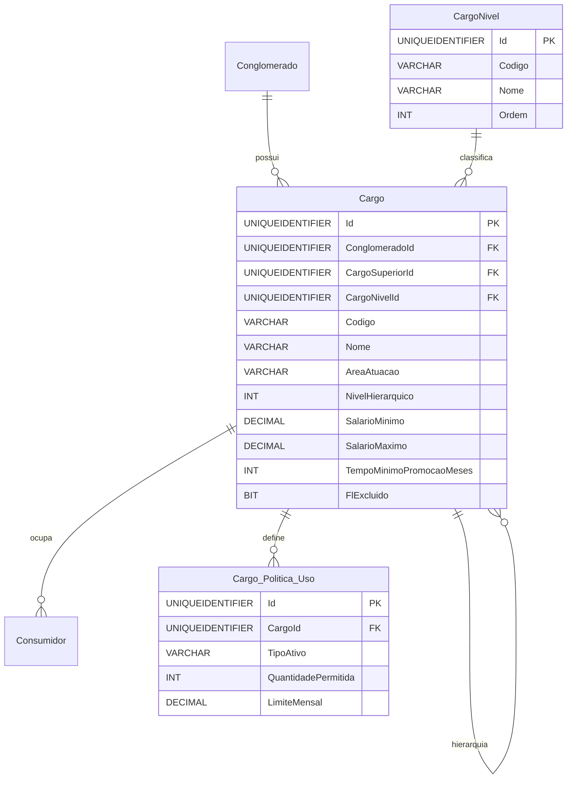

# Modelo de Dados - RF018

**Versão:** 1.0
**Data:** 2025-12-18
**RF Relacionado:** [RF018 - Gestão de Cargos](./RF018.md)
**Banco de Dados:** SQL Server (Produção) / SQLite (Desenvolvimento)

---

## 1. Diagrama de Entidades (Mermaid)



---

## 2. Entidades Principais

### 2.1 Tabela: Cargo

**Descrição:** Cargos/Funções organizacionais da empresa com hierarquia e políticas de uso.

#### Campos

| Campo | Tipo | Nulo | Default | Descrição |
|-------|------|------|---------|-----------|
| Id | UNIQUEIDENTIFIER | NÃO | NEWID() | Chave primária |
| ClienteId | UNIQUEIDENTIFIER | NÃO | - | FK multi-tenancy |
| CargoSuperiorId | UNIQUEIDENTIFIER | SIM | NULL | FK auto-relacionamento (hierarquia) |
| CargoNivelId | UNIQUEIDENTIFIER | SIM | NULL | FK para CargoNivel |
| Codigo | VARCHAR(50) | NÃO | - | Código único (UPPER_SNAKE_CASE) |
| Nome | VARCHAR(120) | NÃO | - | Nome do cargo |
| Descricao | VARCHAR(1000) | SIM | NULL | Descrição/Atribuições |
| AreaAtuacao | VARCHAR(50) | SIM | NULL | TI, RH, Financeiro, Comercial, etc |
| NivelHierarquico | INT | NÃO | 1 | Nível na hierarquia (1=mais alto) |
| CBO | VARCHAR(10) | SIM | NULL | Classificação Brasileira de Ocupações |
| SalarioMinimo | DECIMAL(15,2) | SIM | NULL | Piso salarial (R$) |
| SalarioMaximo | DECIMAL(15,2) | SIM | NULL | Teto salarial (R$) |
| TempoMinimoPromocaoMeses | INT | SIM | NULL | Meses mínimos para promoção |
| Ativo | BIT | NÃO | true | Soft delete: false=ativo, true=excluído |
| DtCriacao | DATETIME | NÃO | GETDATE() | Data criação |
| UsuarioCriacao | UNIQUEIDENTIFIER | NÃO | - | Usuário criação |
| DtAlteracao | DATETIME | SIM | NULL | Data alteração |
| UsuarioAlteracao | UNIQUEIDENTIFIER | SIM | NULL | Usuário alteração |

#### Constraints

```sql
CONSTRAINT UQ_Cargo_Codigo UNIQUE (ConglomeradoId, Codigo)
CONSTRAINT CK_Cargo_FaixaSalarial CHECK (SalarioMinimo IS NULL OR SalarioMaximo IS NULL OR SalarioMinimo <= SalarioMaximo)
CONSTRAINT CK_Cargo_TempoPromocao CHECK (TempoMinimoPromocaoMeses IS NULL OR TempoMinimoPromocaoMeses >= 0)
```

---

### 2.2 Tabela: CargoNivel

**Descrição:** Níveis hierárquicos de cargos (Operacional, Supervisão, Coordenação, Gerência, Diretoria, C-Level).

#### Campos

| Campo | Tipo | Nulo | Default | Descrição |
|-------|------|------|---------|-----------|
| Id | UNIQUEIDENTIFIER | NÃO | NEWID() | Chave primária |
| Codigo | VARCHAR(50) | NÃO | - | Código único |
| Nome | VARCHAR(100) | NÃO | - | Nome do nível |
| Ordem | INT | NÃO | - | Ordem hierárquica (1=mais alto) |
| DtCriacao | DATETIME | NÃO | GETDATE() | Data criação |

#### Dados Iniciais (Seed)

```sql
INSERT INTO CargoNivel (Id, Codigo, Nome, Ordem) VALUES
('10000000-0000-0000-0000-000000000001', 'C_LEVEL', 'C-Level (CEO, CFO, CTO)', 1),
('10000000-0000-0000-0000-000000000002', 'DIRETORIA', 'Diretoria', 2),
('10000000-0000-0000-0000-000000000003', 'GERENCIA', 'Gerência', 3),
('10000000-0000-0000-0000-000000000004', 'COORDENACAO', 'Coordenação', 4),
('10000000-0000-0000-0000-000000000005', 'SUPERVISAO', 'Supervisão', 5),
('10000000-0000-0000-0000-000000000006', 'OPERACIONAL', 'Operacional', 6);
```

---

### 2.3 Tabela: Cargo_Politica_Uso

**Descrição:** Políticas de uso de ativos/serviços por cargo (quantidades permitidas e limites).

#### Campos

| Campo | Tipo | Nulo | Default | Descrição |
|-------|------|------|---------|-----------|
| Id | UNIQUEIDENTIFIER | NÃO | NEWID() | Chave primária |
| CargoId | UNIQUEIDENTIFIER | NÃO | - | FK para Cargo |
| TipoAtivo | VARCHAR(50) | NÃO | - | Tipo (Notebook, Celular, LinhaMovel, etc) |
| QuantidadePermitida | INT | NÃO | 0 | Quantidade máxima |
| LimiteMensal | DECIMAL(15,2) | SIM | NULL | Limite mensal em R$ (para linhas/serviços) |
| DtCriacao | DATETIME | NÃO | GETDATE() | Data criação |
| UsuarioCriacao | UNIQUEIDENTIFIER | NÃO | - | Usuário criação |

#### Constraints

```sql
CONSTRAINT CK_CargoPolitica_Quantidade CHECK (QuantidadePermitida >= 0)
CONSTRAINT CK_CargoPolitica_Limite CHECK (LimiteMensal IS NULL OR LimiteMensal > 0)
```

---

### 2.4 Tabela: Cargo_Historico

**Descrição:** Auditoria de alterações em cargos.

#### Campos

| Campo | Tipo | Nulo | Default | Descrição |
|-------|------|------|---------|-----------|
| Id | UNIQUEIDENTIFIER | NÃO | NEWID() | Chave primária |
| CargoId | UNIQUEIDENTIFIER | NÃO | - | FK para Cargo |
| TipoOperacao | VARCHAR(20) | NÃO | - | INSERT/UPDATE/DELETE |
| DtOperacao | DATETIME | NÃO | GETDATE() | Data/hora operação |
| UsuarioId | UNIQUEIDENTIFIER | SIM | NULL | FK para Usuario |
| DadosAntes | NVARCHAR(MAX) | SIM | NULL | JSON estado anterior |
| DadosDepois | NVARCHAR(MAX) | SIM | NULL | JSON estado posterior |

---

## 3. DDL - SQL Server

```sql
-- Tabela: CargoNivel
CREATE TABLE CargoNivel (
    Id UNIQUEIDENTIFIER PRIMARY KEY DEFAULT NEWID(),
    Codigo VARCHAR(50) NOT NULL UNIQUE,
    Nome VARCHAR(100) NOT NULL,
    Ordem INT NOT NULL UNIQUE,
    DtCriacao DATETIME NOT NULL DEFAULT GETDATE()
);

-- Seed CargoNivel
INSERT INTO CargoNivel (Id, Codigo, Nome, Ordem) VALUES
('10000000-0000-0000-0000-000000000001', 'C_LEVEL', 'C-Level (CEO, CFO, CTO)', 1),
('10000000-0000-0000-0000-000000000002', 'DIRETORIA', 'Diretoria', 2),
('10000000-0000-0000-0000-000000000003', 'GERENCIA', 'Gerência', 3),
('10000000-0000-0000-0000-000000000004', 'COORDENACAO', 'Coordenação', 4),
('10000000-0000-0000-0000-000000000005', 'SUPERVISAO', 'Supervisão', 5),
('10000000-0000-0000-0000-000000000006', 'OPERACIONAL', 'Operacional', 6);

GO

-- Tabela: Cargo
CREATE TABLE Cargo (
    Id UNIQUEIDENTIFIER PRIMARY KEY DEFAULT NEWID(),
    ClienteId UNIQUEIDENTIFIER NOT NULL,
    CargoSuperiorId UNIQUEIDENTIFIER,
    CargoNivelId UNIQUEIDENTIFIER,
    Codigo VARCHAR(50) NOT NULL,
    Nome VARCHAR(120) NOT NULL,
    Descricao VARCHAR(1000),
    AreaAtuacao VARCHAR(50),
    NivelHierarquico INT NOT NULL DEFAULT 1,
    CBO VARCHAR(10),
    SalarioMinimo DECIMAL(15,2),
    SalarioMaximo DECIMAL(15,2),
    TempoMinimoPromocaoMeses INT,
    FlExcluido BIT NOT NULL DEFAULT 0,
    DtCriacao DATETIME NOT NULL DEFAULT GETDATE(),
    UsuarioCriacao UNIQUEIDENTIFIER NOT NULL,
    DtAlteracao DATETIME,
    UsuarioAlteracao UNIQUEIDENTIFIER,

    CONSTRAINT FK_Cargo_Conglomerado
        FOREIGN KEY (ClienteId) REFERENCES Cliente(Id),
    CONSTRAINT FK_Cargo_CargoSuperior
        FOREIGN KEY (CargoSuperiorId) REFERENCES Cargo(Id),
    CONSTRAINT FK_Cargo_CargoNivel
        FOREIGN KEY (CargoNivelId) REFERENCES CargoNivel(Id),
    CONSTRAINT UQ_Cargo_Codigo
        UNIQUE (ConglomeradoId, Codigo),
    CONSTRAINT CK_Cargo_FaixaSalarial
        CHECK (SalarioMinimo IS NULL OR SalarioMaximo IS NULL OR SalarioMinimo <= SalarioMaximo),
    CONSTRAINT CK_Cargo_TempoPromocao
        CHECK (TempoMinimoPromocaoMeses IS NULL OR TempoMinimoPromocaoMeses >= 0)
);

CREATE INDEX IX_Cargo_Conglomerado ON Cargo(ConglomeradoId, Ativo);
CREATE INDEX IX_Cargo_CargoSuperior ON Cargo(CargoSuperiorId);
CREATE INDEX IX_Cargo_CargoNivel ON Cargo(CargoNivelId);
CREATE INDEX IX_Cargo_AreaAtuacao ON Cargo(AreaAtuacao) WHERE AreaAtuacao IS NOT NULL;

GO

-- Tabela: Cargo_Politica_Uso
CREATE TABLE Cargo_Politica_Uso (
    Id UNIQUEIDENTIFIER PRIMARY KEY DEFAULT NEWID(),
    CargoId UNIQUEIDENTIFIER NOT NULL,
    TipoAtivo VARCHAR(50) NOT NULL,
    QuantidadePermitida INT NOT NULL DEFAULT 0,
    LimiteMensal DECIMAL(15,2),
    DtCriacao DATETIME NOT NULL DEFAULT GETDATE(),
    UsuarioCriacao UNIQUEIDENTIFIER NOT NULL,

    CONSTRAINT FK_CargoPolitica_Cargo
        FOREIGN KEY (CargoId) REFERENCES Cargo(Id) ON DELETE CASCADE,
    CONSTRAINT UQ_CargoPolitica_TipoAtivo
        UNIQUE (CargoId, TipoAtivo),
    CONSTRAINT CK_CargoPolitica_Quantidade
        CHECK (QuantidadePermitida >= 0),
    CONSTRAINT CK_CargoPolitica_Limite
        CHECK (LimiteMensal IS NULL OR LimiteMensal > 0)
);

CREATE INDEX IX_CargoPolitica_Cargo ON Cargo_Politica_Uso(CargoId);

GO

-- Tabela: Cargo_Historico
CREATE TABLE Cargo_Historico (
    Id UNIQUEIDENTIFIER PRIMARY KEY DEFAULT NEWID(),
    CargoId UNIQUEIDENTIFIER NOT NULL,
    TipoOperacao VARCHAR(20) NOT NULL,
    DtOperacao DATETIME NOT NULL DEFAULT GETDATE(),
    UsuarioId UNIQUEIDENTIFIER,
    NomeUsuario VARCHAR(200),
    DadosAntes NVARCHAR(MAX),
    DadosDepois NVARCHAR(MAX),

    CONSTRAINT FK_CargoHistorico_Cargo
        FOREIGN KEY (CargoId) REFERENCES Cargo(Id),
    CONSTRAINT CK_CargoHistorico_TipoOp
        CHECK (TipoOperacao IN ('INSERT','UPDATE','DELETE','RESTORE'))
);

CREATE INDEX IX_CargoHistorico_Cargo ON Cargo_Historico(CargoId, DtOperacao DESC);

GO

-- View: vw_Cargo_Hierarquia (hierarquia completa recursiva)
CREATE VIEW vw_Cargo_Hierarquia AS
WITH CargoHierarquia AS (
    -- Anchor: cargos raiz (sem superior)
    SELECT
        Id,
        ConglomeradoId,
        CargoSuperiorId,
        Codigo,
        Nome,
        NivelHierarquico,
        CAST(Nome AS VARCHAR(1000)) AS CaminhoHierarquico,
        1 AS Profundidade
    FROM Cargo
    WHERE CargoSuperiorId IS NULL AND FlExcluido = 0

    UNION ALL

    -- Recursive: cargos subordinados
    SELECT
        c.Id,
        c.ConglomeradoId,
        c.CargoSuperiorId,
        c.Codigo,
        c.Nome,
        c.NivelHierarquico,
        CAST(ch.CaminhoHierarquico + ' > ' + c.Nome AS VARCHAR(1000)),
        ch.Profundidade + 1
    FROM Cargo c
    INNER JOIN CargoHierarquia ch ON c.CargoSuperiorId = ch.Id
    WHERE c.FlExcluido = 0
)
SELECT * FROM CargoHierarquia;

GO
```

---

## 4. Regras de Negócio Implementadas

### RN-CAD-009-01: Código Único por Conglomerado
- **Implementação:** `CONSTRAINT UQ_Cargo_Codigo UNIQUE (ConglomeradoId, Codigo)`

### RN-CAD-009-03: Faixa Salarial Válida
- **Implementação:** `CHECK (SalarioMinimo <= SalarioMaximo)`

### RN-CAD-009-04: Não Criar Ciclo Hierárquico
- **Implementação:** Validação recursiva em stored procedure/application layer

### RN-CAD-009-06: Políticas de Uso Válidas
- **Implementação:** `CHECK (QuantidadePermitida >= 0)` + `CHECK (LimiteMensal > 0)`

### RN-CAD-009-08: Nível Hierárquico Consistente
- **Implementação:** Trigger/SP que calcula NivelHierarquico = (Nível do cargo superior + 1)

---

## 5. Observações

### Decisões de Modelagem

1. **Hierarquia Flexível**: Auto-relacionamento `CargoSuperiorId` permite múltiplos níveis
2. **Níveis Predefinidos**: Tabela `CargoNivel` com 6 níveis padrão (seed data)
3. **Políticas de Uso**: Tabela separada para flexibilidade (múltiplos tipos de ativo por cargo)
4. **CBO Opcional**: Classificação Brasileira de Ocupações para compliance trabalhista
5. **View Hierárquica**: `vw_Cargo_Hierarquia` com CTE recursivo para consultas hierárquicas

### Performance

- Índices em foreign keys e multi-tenancy
- View materializada para hierarquia (considerar se performance for crítica)
- Índice filtrado em `AreaAtuacao` (apenas não-nulos)

### Migração

- Mapear tabela legado `Cargo`
- Classificar cargos existentes em `CargoNivel`
- Reconstruir hierarquia baseada em cargos superiores
- Criar políticas de uso baseadas em regras atuais

---

## Histórico de Alterações

| Versão | Data | Autor | Descrição |
|--------|------|-------|-----------|
| 1.0 | 2025-12-18 | IControlIT Architect Agent | Versão inicial - Gestão de Cargos |
