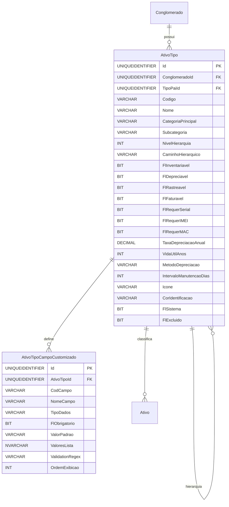

# Modelo de Dados - RF019

**Versão:** 1.0
**Data:** 2025-12-18
**RF Relacionado:** [RF019 - Gestão de Tipos de Ativos](./RF019.md)
**Banco de Dados:** SQL Server (Produção) / SQLite (Desenvolvimento)

---

## 1. Diagrama de Entidades (Mermaid)



---

## 2. Entidades Principais

### 2.1 Tabela: AtivoTipo

**Descrição:** Tipos de ativos (Hardware, Software, Linhas, Serviços) com hierarquia, características e regras de depreciação.

#### Campos

| Campo | Tipo | Nulo | Default | Descrição |
|-------|------|------|---------|-----------|
| Id | UNIQUEIDENTIFIER | NÃO | NEWID() | Chave primária |
| ClienteId | UNIQUEIDENTIFIER | NÃO | - | FK multi-tenancy |
| TipoPaiId | UNIQUEIDENTIFIER | SIM | NULL | FK auto-relacionamento (hierarquia) |
| Codigo | VARCHAR(20) | NÃO | - | Código único (ex: DESK-01, NOTE-01) |
| Nome | VARCHAR(200) | NÃO | - | Nome do tipo (ex: Desktop, Notebook) |
| Descricao | NVARCHAR(1000) | SIM | NULL | Descrição detalhada |
| CategoriaPrincipal | VARCHAR(50) | NÃO | - | Hardware/Software/LinhaMovel/LinhaFixa/Servico/Licenca/Acessorio/Outro |
| Subcategoria | VARCHAR(50) | SIM | NULL | Desktop, Notebook, Servidor, Impressora, etc |
| NivelHierarquia | INT | NÃO | 1 | Nível na árvore (1=raiz, máx 5) |
| CaminhoHierarquico | VARCHAR(500) | SIM | NULL | Ex: /Hardware/Computadores/Notebooks |
| FlInventariavel | BIT | NÃO | 1 | 1=Aparece em inventário físico |
| FlDepreciavel | BIT | NÃO | 1 | 1=Sofre depreciação |
| FlRastreavel | BIT | NÃO | 1 | 1=Requer localização física |
| FlFaturavel | BIT | NÃO | 0 | 1=Gera faturamento recorrente |
| FlRequerSerial | BIT | NÃO | 1 | 1=Número de série obrigatório |
| FlRequerIMEI | BIT | NÃO | 0 | 1=IMEI obrigatório (dispositivos móveis) |
| FlRequerMAC | BIT | NÃO | 0 | 1=MAC Address obrigatório |
| TaxaDepreciacaoAnual | DECIMAL(5,2) | SIM | NULL | % ao ano (0-100) |
| VidaUtilAnos | INT | SIM | NULL | Anos de vida útil estimada |
| MetodoDepreciacao | VARCHAR(50) | SIM | NULL | Linear, DeclinioAcelerado, SomaDigitos |
| IntervaloManutencaoDias | INT | SIM | NULL | Dias entre manutenções preventivas |
| FlRequerCalibracao | BIT | NÃO | 0 | 1=Requer calibração periódica |
| Icone | VARCHAR(50) | SIM | NULL | Classe CSS do ícone (ex: fa-laptop) |
| CorIdentificacao | VARCHAR(7) | SIM | NULL | Hex color (ex: #3498db) |
| TemplateCamposCustom | NVARCHAR(MAX) | SIM | NULL | JSON com definição de campos extras |
| OrdemExibicao | INT | NÃO | 100 | Ordem para listagens |
| FlSistema | BIT | NÃO | 0 | 1=Tipo padrão do sistema (não editável) |
| Ativo | BIT | NÃO | true | Soft delete: false=ativo, true=excluído |
| DtCriacao | DATETIME | NÃO | GETDATE() | Data criação |
| UsuarioCriacao | UNIQUEIDENTIFIER | NÃO | - | Usuário criação |
| DtAlteracao | DATETIME | SIM | NULL | Data alteração |
| UsuarioAlteracao | UNIQUEIDENTIFIER | SIM | NULL | Usuário alteração |

#### Constraints

```sql
CONSTRAINT UQ_AtivoTipo_Codigo UNIQUE (ConglomeradoId, Codigo)
CONSTRAINT CK_AtivoTipo_Categoria CHECK (CategoriaPrincipal IN ('Hardware','Software','LinhaMovel','LinhaFixa','Servico','Licenca','Acessorio','Outro'))
CONSTRAINT CK_AtivoTipo_MetodoDepreciacao CHECK (MetodoDepreciacao IS NULL OR MetodoDepreciacao IN ('Linear','DeclinioAcelerado','SomaDigitos'))
CONSTRAINT CK_AtivoTipo_TaxaDepreciacao CHECK (TaxaDepreciacaoAnual IS NULL OR (TaxaDepreciacaoAnual >= 0 AND TaxaDepreciacaoAnual <= 100))
CONSTRAINT CK_AtivoTipo_NivelHierarquia CHECK (NivelHierarquia BETWEEN 1 AND 5)
```

---

### 2.2 Tabela: AtivoTipoCampoCustomizado

**Descrição:** Campos customizados específicos de cada tipo de ativo (ex: velocidade CPU, RAM, tamanho disco).

#### Campos

| Campo | Tipo | Nulo | Default | Descrição |
|-------|------|------|---------|-----------|
| Id | UNIQUEIDENTIFIER | NÃO | NEWID() | Chave primária |
| AtivoTipoId | UNIQUEIDENTIFIER | NÃO | - | FK para AtivoTipo |
| CodCampo | VARCHAR(50) | NÃO | - | Código do campo (ex: velocidade_cpu) |
| NomeCampo | VARCHAR(100) | NÃO | - | Nome exibido (ex: "Velocidade do CPU") |
| TipoDados | VARCHAR(20) | NÃO | - | String/Integer/Decimal/Date/Boolean/List/Text |
| FlObrigatorio | BIT | NÃO | 0 | 1=Campo obrigatório no cadastro de ativo |
| ValorPadrao | VARCHAR(500) | SIM | NULL | Valor padrão |
| ValoresLista | NVARCHAR(MAX) | SIM | NULL | JSON array para campos tipo List |
| Mascara | VARCHAR(100) | SIM | NULL | Máscara de formatação |
| ValidationRegex | VARCHAR(500) | SIM | NULL | Expressão regular para validação |
| MensagemValidacao | NVARCHAR(200) | SIM | NULL | Mensagem de erro customizada |
| OrdemExibicao | INT | NÃO | 100 | Ordem de exibição |
| FlExibirGrid | BIT | NÃO | 1 | 1=Exibir em grids de listagem |
| Ativo | BIT | NÃO | true | Soft delete: false=ativo, true=excluído |
| DtCriacao | DATETIME | NÃO | GETDATE() | Data criação |

#### Constraints

```sql
CONSTRAINT FK_AtivoTipoCampo_AtivoTipo FOREIGN KEY (AtivoTipoId) REFERENCES AtivoTipo(Id) ON DELETE CASCADE
CONSTRAINT UQ_AtivoTipoCampo_Codigo UNIQUE (AtivoTipoId, CodCampo)
CONSTRAINT CK_AtivoTipoCampo_TipoDados CHECK (TipoDados IN ('String','Integer','Decimal','Date','Boolean','List','Text'))
```

---

### 2.3 Tabela: AtivoTipoAuditoria

**Descrição:** Auditoria de alterações em tipos de ativos.

#### Campos

| Campo | Tipo | Nulo | Default | Descrição |
|-------|------|------|---------|-----------|
| Id | UNIQUEIDENTIFIER | NÃO | NEWID() | Chave primária |
| AtivoTipoId | UNIQUEIDENTIFIER | NÃO | - | FK para AtivoTipo |
| TipoOperacao | VARCHAR(20) | NÃO | - | INSERT/UPDATE/DELETE |
| DtOperacao | DATETIME | NÃO | GETDATE() | Data/hora operação |
| UsuarioId | UNIQUEIDENTIFIER | SIM | NULL | FK para Usuario |
| NomeUsuario | VARCHAR(200) | SIM | NULL | Nome do usuário |
| IPOrigem | VARCHAR(45) | SIM | NULL | IP do usuário |
| DadosAntes | NVARCHAR(MAX) | SIM | NULL | JSON estado anterior |
| DadosDepois | NVARCHAR(MAX) | SIM | NULL | JSON estado posterior |
| CamposAlterados | VARCHAR(1000) | SIM | NULL | Lista de campos alterados |

---

## 3. DDL - SQL Server

```sql
-- Tabela: AtivoTipo
CREATE TABLE AtivoTipo (
    Id UNIQUEIDENTIFIER PRIMARY KEY DEFAULT NEWID(),
    ClienteId UNIQUEIDENTIFIER NOT NULL,
    TipoPaiId UNIQUEIDENTIFIER,
    Codigo VARCHAR(20) NOT NULL,
    Nome VARCHAR(200) NOT NULL,
    Descricao NVARCHAR(1000),
    CategoriaPrincipal VARCHAR(50) NOT NULL,
    Subcategoria VARCHAR(50),
    NivelHierarquia INT NOT NULL DEFAULT 1,
    CaminhoHierarquico VARCHAR(500),
    FlInventariavel BIT NOT NULL DEFAULT 1,
    FlDepreciavel BIT NOT NULL DEFAULT 1,
    FlRastreavel BIT NOT NULL DEFAULT 1,
    FlFaturavel BIT NOT NULL DEFAULT 0,
    FlRequerSerial BIT NOT NULL DEFAULT 1,
    FlRequerIMEI BIT NOT NULL DEFAULT 0,
    FlRequerMAC BIT NOT NULL DEFAULT 0,
    TaxaDepreciacaoAnual DECIMAL(5,2),
    VidaUtilAnos INT,
    MetodoDepreciacao VARCHAR(50),
    IntervaloManutencaoDias INT,
    FlRequerCalibracao BIT NOT NULL DEFAULT 0,
    Icone VARCHAR(50),
    CorIdentificacao VARCHAR(7),
    TemplateCamposCustom NVARCHAR(MAX),
    OrdemExibicao INT NOT NULL DEFAULT 100,
    FlSistema BIT NOT NULL DEFAULT 0,
    FlExcluido BIT NOT NULL DEFAULT 0,
    DtCriacao DATETIME NOT NULL DEFAULT GETDATE(),
    UsuarioCriacao UNIQUEIDENTIFIER NOT NULL,
    DtAlteracao DATETIME,
    UsuarioAlteracao UNIQUEIDENTIFIER,

    CONSTRAINT FK_AtivoTipo_Conglomerado
        FOREIGN KEY (ClienteId) REFERENCES Cliente(Id),
    CONSTRAINT FK_AtivoTipo_TipoPai
        FOREIGN KEY (TipoPaiId) REFERENCES AtivoTipo(Id),
    CONSTRAINT UQ_AtivoTipo_Codigo
        UNIQUE (ConglomeradoId, Codigo),
    CONSTRAINT CK_AtivoTipo_Categoria
        CHECK (CategoriaPrincipal IN ('Hardware','Software','LinhaMovel','LinhaFixa','Servico','Licenca','Acessorio','Outro')),
    CONSTRAINT CK_AtivoTipo_MetodoDepreciacao
        CHECK (MetodoDepreciacao IS NULL OR MetodoDepreciacao IN ('Linear','DeclinioAcelerado','SomaDigitos')),
    CONSTRAINT CK_AtivoTipo_TaxaDepreciacao
        CHECK (TaxaDepreciacaoAnual IS NULL OR (TaxaDepreciacaoAnual >= 0 AND TaxaDepreciacaoAnual <= 100)),
    CONSTRAINT CK_AtivoTipo_NivelHierarquia
        CHECK (NivelHierarquia BETWEEN 1 AND 5)
);

CREATE INDEX IX_AtivoTipo_Conglomerado ON AtivoTipo(ConglomeradoId, Ativo);
CREATE INDEX IX_AtivoTipo_TipoPai ON AtivoTipo(TipoPaiId);
CREATE INDEX IX_AtivoTipo_Categoria ON AtivoTipo(CategoriaPrincipal, Subcategoria);
CREATE INDEX IX_AtivoTipo_OrdemExibicao ON AtivoTipo(OrdemExibicao, Nome);

GO

-- Tabela: AtivoTipoCampoCustomizado
CREATE TABLE AtivoTipoCampoCustomizado (
    Id UNIQUEIDENTIFIER PRIMARY KEY DEFAULT NEWID(),
    AtivoTipoId UNIQUEIDENTIFIER NOT NULL,
    CodCampo VARCHAR(50) NOT NULL,
    NomeCampo VARCHAR(100) NOT NULL,
    TipoDados VARCHAR(20) NOT NULL,
    FlObrigatorio BIT NOT NULL DEFAULT 0,
    ValorPadrao VARCHAR(500),
    ValoresLista NVARCHAR(MAX),
    Mascara VARCHAR(100),
    ValidationRegex VARCHAR(500),
    MensagemValidacao NVARCHAR(200),
    OrdemExibicao INT NOT NULL DEFAULT 100,
    FlExibirGrid BIT NOT NULL DEFAULT 1,
    FlExcluido BIT NOT NULL DEFAULT 0,
    DtCriacao DATETIME NOT NULL DEFAULT GETDATE(),

    CONSTRAINT FK_AtivoTipoCampo_AtivoTipo
        FOREIGN KEY (AtivoTipoId) REFERENCES AtivoTipo(Id) ON DELETE CASCADE,
    CONSTRAINT UQ_AtivoTipoCampo_Codigo
        UNIQUE (AtivoTipoId, CodCampo),
    CONSTRAINT CK_AtivoTipoCampo_TipoDados
        CHECK (TipoDados IN ('String','Integer','Decimal','Date','Boolean','List','Text'))
);

CREATE INDEX IX_AtivoTipoCampo_AtivoTipo ON AtivoTipoCampoCustomizado(AtivoTipoId, Ativo);

GO

-- Tabela: AtivoTipoAuditoria
CREATE TABLE AtivoTipoAuditoria (
    Id UNIQUEIDENTIFIER PRIMARY KEY DEFAULT NEWID(),
    AtivoTipoId UNIQUEIDENTIFIER NOT NULL,
    TipoOperacao VARCHAR(20) NOT NULL,
    DtOperacao DATETIME NOT NULL DEFAULT GETDATE(),
    UsuarioId UNIQUEIDENTIFIER,
    NomeUsuario VARCHAR(200),
    IPOrigem VARCHAR(45),
    DadosAntes NVARCHAR(MAX),
    DadosDepois NVARCHAR(MAX),
    CamposAlterados VARCHAR(1000),

    CONSTRAINT FK_AtivoTipoAuditoria_AtivoTipo
        FOREIGN KEY (AtivoTipoId) REFERENCES AtivoTipo(Id),
    CONSTRAINT CK_AtivoTipoAuditoria_TipoOp
        CHECK (TipoOperacao IN ('INSERT','UPDATE','DELETE','RESTORE'))
);

CREATE INDEX IX_AtivoTipoAuditoria_AtivoTipo ON AtivoTipoAuditoria(AtivoTipoId, DtOperacao DESC);
CREATE INDEX IX_AtivoTipoAuditoria_Usuario ON AtivoTipoAuditoria(UsuarioId, DtOperacao DESC);

GO
```

---

## 4. Dados Iniciais (Seed) - Tipos Padrão de Sistema

```sql
-- Tipos de Sistema (FlSistema = 1, não editáveis/excluíveis)
INSERT INTO AtivoTipo (Id, ConglomeradoId, Codigo, Nome, CategoriaPrincipal, FlSistema, FlDepreciavel, TaxaDepreciacaoAnual, VidaUtilAnos, Icone, UsuarioCriacao) VALUES
-- Hardware
('20000000-0000-0000-0000-000000000001', NULL, 'HW-DESKTOP', 'Desktop', 'Hardware', 1, 1, 20.00, 5, 'fa-desktop', '00000000-0000-0000-0000-000000000001'),
('20000000-0000-0000-0000-000000000002', NULL, 'HW-NOTEBOOK', 'Notebook', 'Hardware', 1, 1, 25.00, 4, 'fa-laptop', '00000000-0000-0000-0000-000000000001'),
('20000000-0000-0000-0000-000000000003', NULL, 'HW-SERVIDOR', 'Servidor', 'Hardware', 1, 1, 20.00, 5, 'fa-server', '00000000-0000-0000-0000-000000000001'),
('20000000-0000-0000-0000-000000000004', NULL, 'HW-IMPRESSORA', 'Impressora', 'Hardware', 1, 1, 20.00, 5, 'fa-print', '00000000-0000-0000-0000-000000000001'),
-- Software
('20000000-0000-0000-0000-000000000011', NULL, 'SW-OFFICE', 'Microsoft Office', 'Software', 1, 1, 33.33, 3, 'fa-file-word', '00000000-0000-0000-0000-000000000001'),
-- Linhas
('20000000-0000-0000-0000-000000000021', NULL, 'LM-VOZ-DADOS', 'Linha Móvel Voz+Dados', 'LinhaMovel', 1, 0, NULL, NULL, 'fa-mobile', '00000000-0000-0000-0000-000000000001'),
('20000000-0000-0000-0000-000000000022', NULL, 'LF-RAMAL', 'Linha Fixa (Ramal)', 'LinhaFixa', 1, 0, NULL, NULL, 'fa-phone', '00000000-0000-0000-0000-000000000001');
```

---

## 5. Regras de Negócio Implementadas

### RN-CAD-015-01: Código Único por Conglomerado
- **Implementação:** `CONSTRAINT UQ_AtivoTipo_Codigo UNIQUE (ConglomeradoId, Codigo)`

### RN-CAD-015-02: Hierarquia Máxima de 5 Níveis
- **Implementação:** `CONSTRAINT CK_AtivoTipo_NivelHierarquia CHECK (NivelHierarquia BETWEEN 1 AND 5)`

### RN-CAD-015-03: Categoria Válida
- **Implementação:** `CHECK (CategoriaPrincipal IN (...))`

### RN-CAD-015-04: Hardware OBRIGATORIAMENTE Depreciável
- **Implementação:** Validação em Application layer (Commands/Validators)

### RN-CAD-015-05: Taxa de Depreciação 0-100%
- **Implementação:** `CHECK (TaxaDepreciacaoAnual BETWEEN 0 AND 100)`

### RN-CAD-015-06: Não Permitir Loops Hierárquicos
- **Implementação:** Validação recursiva em stored procedure/trigger

---

## 6. Observações

### Decisões de Modelagem

1. **Hierarquia de 5 Níveis**: Suficiente para classificação detalhada sem complexidade excessiva
2. **Flags de Características**: Múltiplos flags (FlInventariavel, FlDepreciavel, etc) para flexibilidade
3. **Campos Customizados Separados**: Tabela dedicada para atributos específicos por tipo
4. **Tipos de Sistema**: Flag `FlSistema` protege tipos padrão essenciais
5. **Caminho Hierárquico Desnormalizado**: Performance em consultas hierárquicas

### Performance

- Índices em foreign keys e campos de busca frequente
- Índice composto em categoria/subcategoria
- Soft delete: false=ativo, true=excluído preserva integridade referencial
- Considerar índice filtrado em `FlSistema = 0` se muitos tipos

### Migração de Dados

- Mapear tabela legado `Ativo_Tipo`
- Reconstruir hierarquia baseada em relações pai-filha
- Migrar atributos customizados para `AtivoTipoCampoCustomizado`
- Seed tipos de sistema após migration

---

## Histórico de Alterações

| Versão | Data | Autor | Descrição |
|--------|------|-------|-----------|
| 1.0 | 2025-12-18 | IControlIT Architect Agent | Versão inicial - Gestão de Tipos de Ativos |
