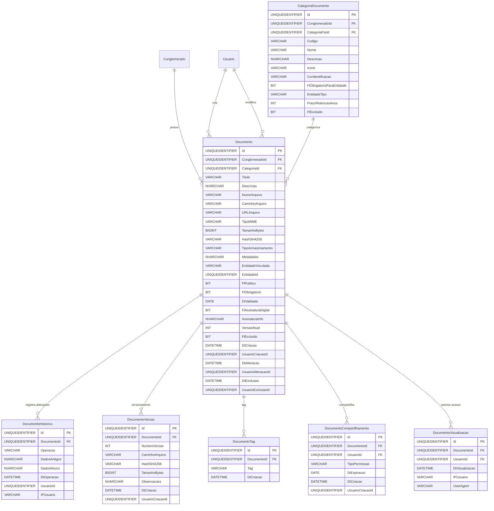

# Modelo de Dados - RF020

**Versão:** 1.0
**Data:** 2025-12-18
**RF Relacionado:** [RF020 - Gestão de Documentos e Anexos](./RF020.md)
**Banco de Dados:** SQL Server (Produção) / SQLite (Desenvolvimento)

---

## 1. Diagrama de Entidades (Mermaid)



---

## 2. Entidades Principais

### 2.1 Tabela: Documento

**Descrição:** Armazena metadados de documentos e anexos do sistema com suporte a versionamento, assinatura digital e controle de acesso.

#### DDL Completo

```sql
CREATE TABLE Documento (
    -- Identificação
    Id UNIQUEIDENTIFIER NOT NULL DEFAULT NEWID(),
    ClienteId UNIQUEIDENTIFIER NOT NULL,
    CategoriaId UNIQUEIDENTIFIER NULL,

    -- Dados do Documento
    Titulo VARCHAR(300) NOT NULL,
    Descricao NVARCHAR(2000) NULL,
    NomeArquivo VARCHAR(500) NOT NULL,
    CaminhoArquivo VARCHAR(1000) NULL,  -- Caminho físico se armazenamento local
    URLArquivo VARCHAR(2000) NULL,      -- URL se armazenamento em cloud (S3, Azure Blob)
    TipoMIME VARCHAR(100) NOT NULL,     -- application/pdf, image/jpeg, etc
    TamanhoBytes BIGINT NOT NULL,
    HashSHA256 VARCHAR(64) NOT NULL,    -- Integridade do arquivo
    TipoArmazenamento VARCHAR(20) NOT NULL DEFAULT 'local', -- local, s3, azure, sharepoint

    -- Metadados Customizados (JSON)
    Metadados NVARCHAR(MAX) NULL,       -- {"autor": "John Doe", "palavras-chave": ["contrato", "urgente"]}

    -- Vínculo com Entidade
    EntidadeVinculada VARCHAR(100) NULL, -- Fornecedor, Contrato, Ativo, Chamado, Usuario
    EntidadeId UNIQUEIDENTIFIER NULL,

    -- Controle de Acesso
    FlPublico BIT NOT NULL DEFAULT 0,   -- 1 = público (todos), 0 = restrito
    FlObrigatorio BIT NOT NULL DEFAULT 0, -- 1 = documento obrigatório para entidade

    -- Validade e Compliance
    DtValidade DATE NULL,               -- Data de expiração do documento
    FlAssinaturaDigital BIT NOT NULL DEFAULT 0,
    AssinaturaInfo NVARCHAR(MAX) NULL,  -- JSON com dados da assinatura (ICP-Brasil, DocuSign, etc)

    -- Versionamento
    VersaoAtual INT NOT NULL DEFAULT 1,

    -- Soft Delete
    FlExcluido BIT NOT NULL DEFAULT 0,

    -- Auditoria
    DtCriacao DATETIME NOT NULL DEFAULT GETDATE(),
    UsuarioCriacaoId UNIQUEIDENTIFIER NOT NULL,
    DtAlteracao DATETIME NULL,
    UsuarioAlteracaoId UNIQUEIDENTIFIER NULL,
    DtExclusao DATETIME NULL,
    UsuarioExclusaoId UNIQUEIDENTIFIER NULL,

    -- Constraints
    CONSTRAINT PK_Documento PRIMARY KEY (Id),
    CONSTRAINT FK_Documento_Conglomerado FOREIGN KEY (ClienteId) REFERENCES Cliente(Id),
    CONSTRAINT FK_Documento_Categoria FOREIGN KEY (CategoriaId) REFERENCES CategoriaDocumento(Id),
    CONSTRAINT FK_Documento_UsuarioCriacao FOREIGN KEY (UsuarioCriacaoId) REFERENCES Usuario(Id),
    CONSTRAINT FK_Documento_UsuarioAlteracao FOREIGN KEY (UsuarioAlteracaoId) REFERENCES Usuario(Id),
    CONSTRAINT FK_Documento_UsuarioExclusao FOREIGN KEY (UsuarioExclusaoId) REFERENCES Usuario(Id),
    CONSTRAINT CK_Documento_TipoArmazenamento CHECK (TipoArmazenamento IN ('local', 's3', 'azure', 'sharepoint', 'google_drive')),
    CONSTRAINT CK_Documento_TamanhoBytes CHECK (TamanhoBytes > 0),
    CONSTRAINT CK_Documento_VersaoAtual CHECK (VersaoAtual > 0)
);

-- Índices
CREATE INDEX IX_Documento_ConglomeradoId ON Documento(ConglomeradoId);
CREATE INDEX IX_Documento_CategoriaId ON Documento(CategoriaId);
CREATE INDEX IX_Documento_EntidadeVinculada ON Documento(EntidadeVinculada, EntidadeId);
CREATE INDEX IX_Documento_DtValidade ON Documento(DtValidade) WHERE DtValidade IS NOT NULL;
CREATE INDEX IX_Documento_FlExcluido ON Documento(FlExcluido);
CREATE INDEX IX_Documento_HashSHA256 ON Documento(HashSHA256);
CREATE INDEX IX_Documento_DtCriacao ON Documento(DtCriacao DESC);

-- Trigger para atualização de data de alteração
CREATE TRIGGER trg_Documento_AtualizarDtAlteracao
ON Documento
AFTER UPDATE
AS
BEGIN
    SET NOCOUNT ON;
    UPDATE Documento
    SET DtAlteracao = GETDATE()
    WHERE Id IN (SELECT Id FROM inserted);
END;
```

### 2.2 Tabela: CategoriaDocumento

**Descrição:** Categorias hierárquicas de documentos (Contratos, Certidões, Notas Fiscais, Manuais, etc).

#### DDL Completo

```sql
CREATE TABLE CategoriaDocumento (
    -- Identificação
    Id UNIQUEIDENTIFIER NOT NULL DEFAULT NEWID(),
    ClienteId UNIQUEIDENTIFIER NOT NULL,
    CategoriaPaiId UNIQUEIDENTIFIER NULL,  -- Hierarquia recursiva

    -- Dados da Categoria
    Codigo VARCHAR(20) NOT NULL,        -- CAT-001, CAT-CONTRATOS, etc
    Nome VARCHAR(200) NOT NULL,
    Descricao NVARCHAR(1000) NULL,
    Icone VARCHAR(50) NULL,             -- fa-file-contract, fa-file-invoice
    CorIdentificacao VARCHAR(7) NULL,   -- #3498db

    -- Regras de Negócio
    FlObrigatorioParaEntidade BIT NOT NULL DEFAULT 0,  -- 1 = obrigatório para tipo de entidade
    EntidadeTipo VARCHAR(100) NULL,     -- Fornecedor, Contrato, Ativo (se obrigatório)
    PrazoRetencaoAnos INT NULL,         -- LGPD compliance (7 anos padrão)

    -- Soft Delete
    FlExcluido BIT NOT NULL DEFAULT 0,

    -- Auditoria
    DtCriacao DATETIME NOT NULL DEFAULT GETDATE(),
    UsuarioCriacaoId UNIQUEIDENTIFIER NOT NULL,

    -- Constraints
    CONSTRAINT PK_CategoriaDocumento PRIMARY KEY (Id),
    CONSTRAINT FK_CategoriaDocumento_Conglomerado FOREIGN KEY (ClienteId) REFERENCES Cliente(Id),
    CONSTRAINT FK_CategoriaDocumento_CategoriaPai FOREIGN KEY (CategoriaPaiId) REFERENCES CategoriaDocumento(Id),
    CONSTRAINT UQ_CategoriaDocumento_Codigo UNIQUE (ConglomeradoId, Codigo),
    CONSTRAINT CK_CategoriaDocumento_PrazoRetencao CHECK (PrazoRetencaoAnos > 0)
);

CREATE INDEX IX_CategoriaDocumento_ConglomeradoId ON CategoriaDocumento(ConglomeradoId);
CREATE INDEX IX_CategoriaDocumento_CategoriaPaiId ON CategoriaDocumento(CategoriaPaiId);
```

### 2.3 Tabela: DocumentoVersao

**Descrição:** Controle de versões de documentos (versionamento completo).

#### DDL Completo

```sql
CREATE TABLE DocumentoVersao (
    -- Identificação
    Id UNIQUEIDENTIFIER NOT NULL DEFAULT NEWID(),
    DocumentoId UNIQUEIDENTIFIER NOT NULL,

    -- Dados da Versão
    NumeroVersao INT NOT NULL,          -- 1, 2, 3...
    CaminhoArquivo VARCHAR(1000) NOT NULL,
    HashSHA256 VARCHAR(64) NOT NULL,
    TamanhoBytes BIGINT NOT NULL,
    Observacoes NVARCHAR(2000) NULL,    -- Motivo da nova versão

    -- Auditoria
    DtCriacao DATETIME NOT NULL DEFAULT GETDATE(),
    UsuarioCriacaoId UNIQUEIDENTIFIER NOT NULL,

    -- Constraints
    CONSTRAINT PK_DocumentoVersao PRIMARY KEY (Id),
    CONSTRAINT FK_DocumentoVersao_Documento FOREIGN KEY (DocumentoId) REFERENCES Documento(Id) ON DELETE CASCADE,
    CONSTRAINT FK_DocumentoVersao_Usuario FOREIGN KEY (UsuarioCriacaoId) REFERENCES Usuario(Id),
    CONSTRAINT UQ_DocumentoVersao_NumeroVersao UNIQUE (DocumentoId, NumeroVersao),
    CONSTRAINT CK_DocumentoVersao_NumeroVersao CHECK (NumeroVersao > 0),
    CONSTRAINT CK_DocumentoVersao_TamanhoBytes CHECK (TamanhoBytes > 0)
);

CREATE INDEX IX_DocumentoVersao_DocumentoId ON DocumentoVersao(DocumentoId);
CREATE INDEX IX_DocumentoVersao_DtCriacao ON DocumentoVersao(DtCriacao DESC);
```

### 2.4 Tabela: DocumentoHistorico

**Descrição:** Auditoria completa de operações em documentos (LGPD compliance).

#### DDL Completo

```sql
CREATE TABLE DocumentoHistorico (
    -- Identificação
    Id UNIQUEIDENTIFIER NOT NULL DEFAULT NEWID(),
    DocumentoId UNIQUEIDENTIFIER NOT NULL,

    -- Dados da Operação
    Operacao VARCHAR(20) NOT NULL,      -- CREATE, UPDATE, DELETE, DOWNLOAD, VIEW, SHARE
    DadosAntigos NVARCHAR(MAX) NULL,    -- JSON com dados antes da alteração
    DadosNovos NVARCHAR(MAX) NULL,      -- JSON com dados após alteração

    -- Auditoria
    DtOperacao DATETIME NOT NULL DEFAULT GETDATE(),
    UsuarioId UNIQUEIDENTIFIER NOT NULL,
    IPUsuario VARCHAR(45) NULL,         -- IPv4 ou IPv6

    -- Constraints
    CONSTRAINT PK_DocumentoHistorico PRIMARY KEY (Id),
    CONSTRAINT FK_DocumentoHistorico_Documento FOREIGN KEY (DocumentoId) REFERENCES Documento(Id),
    CONSTRAINT FK_DocumentoHistorico_Usuario FOREIGN KEY (UsuarioId) REFERENCES Usuario(Id),
    CONSTRAINT CK_DocumentoHistorico_Operacao CHECK (Operacao IN ('CREATE', 'UPDATE', 'DELETE', 'DOWNLOAD', 'VIEW', 'SHARE', 'SIGN'))
);

CREATE INDEX IX_DocumentoHistorico_DocumentoId ON DocumentoHistorico(DocumentoId);
CREATE INDEX IX_DocumentoHistorico_DtOperacao ON DocumentoHistorico(DtOperacao DESC);
CREATE INDEX IX_DocumentoHistorico_UsuarioId ON DocumentoHistorico(UsuarioId);
```

### 2.5 Tabela: DocumentoTag

**Descrição:** Tags para categorização e busca de documentos.

#### DDL Completo

```sql
CREATE TABLE DocumentoTag (
    -- Identificação
    Id UNIQUEIDENTIFIER NOT NULL DEFAULT NEWID(),
    DocumentoId UNIQUEIDENTIFIER NOT NULL,

    -- Dados da Tag
    Tag VARCHAR(50) NOT NULL,

    -- Auditoria
    DtCriacao DATETIME NOT NULL DEFAULT GETDATE(),

    -- Constraints
    CONSTRAINT PK_DocumentoTag PRIMARY KEY (Id),
    CONSTRAINT FK_DocumentoTag_Documento FOREIGN KEY (DocumentoId) REFERENCES Documento(Id) ON DELETE CASCADE,
    CONSTRAINT UQ_DocumentoTag_Tag UNIQUE (DocumentoId, Tag)
);

CREATE INDEX IX_DocumentoTag_DocumentoId ON DocumentoTag(DocumentoId);
CREATE INDEX IX_DocumentoTag_Tag ON DocumentoTag(Tag);
```

### 2.6 Tabela: DocumentoCompartilhamento

**Descrição:** Controle de compartilhamento de documentos entre usuários.

#### DDL Completo

```sql
CREATE TABLE DocumentoCompartilhamento (
    -- Identificação
    Id UNIQUEIDENTIFIER NOT NULL DEFAULT NEWID(),
    DocumentoId UNIQUEIDENTIFIER NOT NULL,
    UsuarioId UNIQUEIDENTIFIER NOT NULL,

    -- Controle de Acesso
    TipoPermissao VARCHAR(20) NOT NULL, -- READ, WRITE, DELETE, DOWNLOAD
    DtExpiracao DATE NULL,              -- Acesso temporário

    -- Auditoria
    DtCriacao DATETIME NOT NULL DEFAULT GETDATE(),
    UsuarioCriacaoId UNIQUEIDENTIFIER NOT NULL,

    -- Constraints
    CONSTRAINT PK_DocumentoCompartilhamento PRIMARY KEY (Id),
    CONSTRAINT FK_DocumentoCompartilhamento_Documento FOREIGN KEY (DocumentoId) REFERENCES Documento(Id) ON DELETE CASCADE,
    CONSTRAINT FK_DocumentoCompartilhamento_Usuario FOREIGN KEY (UsuarioId) REFERENCES Usuario(Id),
    CONSTRAINT FK_DocumentoCompartilhamento_UsuarioCriacao FOREIGN KEY (UsuarioCriacaoId) REFERENCES Usuario(Id),
    CONSTRAINT UQ_DocumentoCompartilhamento_Usuario UNIQUE (DocumentoId, UsuarioId),
    CONSTRAINT CK_DocumentoCompartilhamento_TipoPermissao CHECK (TipoPermissao IN ('READ', 'WRITE', 'DELETE', 'DOWNLOAD'))
);

CREATE INDEX IX_DocumentoCompartilhamento_DocumentoId ON DocumentoCompartilhamento(DocumentoId);
CREATE INDEX IX_DocumentoCompartilhamento_UsuarioId ON DocumentoCompartilhamento(UsuarioId);
CREATE INDEX IX_DocumentoCompartilhamento_DtExpiracao ON DocumentoCompartilhamento(DtExpiracao) WHERE DtExpiracao IS NOT NULL;
```

### 2.7 Tabela: DocumentoVisualizacao

**Descrição:** Rastreamento de acesso e visualização de documentos.

#### DDL Completo

```sql
CREATE TABLE DocumentoVisualizacao (
    -- Identificação
    Id UNIQUEIDENTIFIER NOT NULL DEFAULT NEWID(),
    DocumentoId UNIQUEIDENTIFIER NOT NULL,
    UsuarioId UNIQUEIDENTIFIER NOT NULL,

    -- Dados do Acesso
    DtVisualizacao DATETIME NOT NULL DEFAULT GETDATE(),
    IPUsuario VARCHAR(45) NULL,
    UserAgent VARCHAR(500) NULL,        -- Browser/device info

    -- Constraints
    CONSTRAINT PK_DocumentoVisualizacao PRIMARY KEY (Id),
    CONSTRAINT FK_DocumentoVisualizacao_Documento FOREIGN KEY (DocumentoId) REFERENCES Documento(Id),
    CONSTRAINT FK_DocumentoVisualizacao_Usuario FOREIGN KEY (UsuarioId) REFERENCES Usuario(Id)
);

CREATE INDEX IX_DocumentoVisualizacao_DocumentoId ON DocumentoVisualizacao(DocumentoId);
CREATE INDEX IX_DocumentoVisualizacao_UsuarioId ON DocumentoVisualizacao(UsuarioId);
CREATE INDEX IX_DocumentoVisualizacao_DtVisualizacao ON DocumentoVisualizacao(DtVisualizacao DESC);
```

---

## 3. Relacionamentos e Constraints

### 3.1 Relacionamentos Principais

- **Documento** N:1 **Conglomerado** (multi-tenancy)
- **Documento** N:1 **CategoriaDocumento** (categorização)
- **Documento** 1:N **DocumentoVersao** (versionamento)
- **Documento** 1:N **DocumentoHistorico** (auditoria)
- **Documento** 1:N **DocumentoTag** (tags)
- **Documento** 1:N **DocumentoCompartilhamento** (compartilhamento)
- **Documento** 1:N **DocumentoVisualizacao** (rastreamento de acesso)
- **CategoriaDocumento** auto-relacionamento (hierarquia)

### 3.2 Regras de Integridade

1. **Multi-tenancy:** Todos os documentos DEVEM ter ConglomeradoId válido
2. **Soft Delete:** Documentos excluídos mantêm FlExcluido = 1 (LGPD compliance de 7 anos)
3. **Versionamento:** Nova versão incrementa VersaoAtual automaticamente via trigger
4. **Auditoria:** TODA operação em documento DEVE gerar registro em DocumentoHistorico
5. **Hash SHA-256:** Garante integridade do arquivo
6. **Expiração:** Documentos com DtValidade vencida DEVEM ser alertados via job Hangfire

---

## 4. Índices para Performance

```sql
-- Índices compostos para consultas frequentes
CREATE INDEX IX_Documento_ConglomeradoId_FlExcluido
ON Documento(ConglomeradoId, Ativo)
INCLUDE (Titulo, DtCriacao);

CREATE INDEX IX_Documento_EntidadeVinculada_EntidadeId
ON Documento(EntidadeVinculada, EntidadeId, Ativo);

-- Full-text search (se suportado pelo banco)
-- CREATE FULLTEXT INDEX ON Documento(Titulo, Descricao);
```

---

## 5. Views Úteis

```sql
-- View: Documentos com Categoria
CREATE VIEW VW_Documento_ComCategoria AS
SELECT
    d.Id,
    d.ConglomeradoId,
    d.Titulo,
    d.NomeArquivo,
    d.TipoMIME,
    d.TamanhoBytes,
    d.VersaoAtual,
    d.DtValidade,
    d.EntidadeVinculada,
    d.EntidadeId,
    c.Nome AS CategoriaNome,
    c.Codigo AS CategoriaCodigo,
    u.Nome AS CriadoPor,
    d.DtCriacao,
    d.FlExcluido
FROM Documento d
LEFT JOIN CategoriaDocumento c ON d.CategoriaId = c.Id
LEFT JOIN Usuario u ON d.UsuarioCriacaoId = u.Id;
```

---

## 6. Migração e Versionamento

### 6.1 Migration Entity Framework Core

```csharp
public class Documento
{
    public Guid Id { get; set; }
    public Guid ConglomeradoId { get; set; }
    public Guid? CategoriaId { get; set; }
    public string Titulo { get; set; } = string.Empty;
    public string? Descricao { get; set; }
    public string NomeArquivo { get; set; } = string.Empty;
    public string? CaminhoArquivo { get; set; }
    public string? URLArquivo { get; set; }
    public string TipoMIME { get; set; } = string.Empty;
    public long TamanhoBytes { get; set; }
    public string HashSHA256 { get; set; } = string.Empty;
    public string TipoArmazenamento { get; set; } = "local";
    public string? Metadados { get; set; }
    public string? EntidadeVinculada { get; set; }
    public Guid? EntidadeId { get; set; }
    public bool FlPublico { get; set; }
    public bool FlObrigatorio { get; set; }
    public DateOnly? DtValidade { get; set; }
    public bool FlAssinaturaDigital { get; set; }
    public string? AssinaturaInfo { get; set; }
    public int VersaoAtual { get; set; } = 1;
    public bool FlExcluido { get; set; }
    public DateTime DtCriacao { get; set; }
    public Guid UsuarioCriacaoId { get; set; }
    public DateTime? DtAlteracao { get; set; }
    public Guid? UsuarioAlteracaoId { get; set; }
    public DateTime? DtExclusao { get; set; }
    public Guid? UsuarioExclusaoId { get; set; }

    // Navegação
    public Conglomerado Conglomerado { get; set; } = null!;
    public CategoriaDocumento? Categoria { get; set; }
    public Usuario UsuarioCriacao { get; set; } = null!;
    public ICollection<DocumentoVersao> Versoes { get; set; } = new List<DocumentoVersao>();
    public ICollection<DocumentoHistorico> Historico { get; set; } = new List<DocumentoHistorico>();
    public ICollection<DocumentoTag> Tags { get; set; } = new List<DocumentoTag>();
}
```

---

## 7. Notas de Implementação

### 7.1 Armazenamento de Arquivos

- **Local:** `CaminhoArquivo` aponta para diretório físico no servidor
- **S3/Azure:** `URLArquivo` contém URL pré-assinada temporária
- **SharePoint/Google Drive:** `URLArquivo` contém link compartilhado

### 7.2 Hash SHA-256

- Calculado no backend ao fazer upload
- Usado para:
  - Detecção de duplicatas
  - Verificação de integridade
  - Auditoria de alterações

### 7.3 LGPD Compliance

- Documentos NUNCA são deletados fisicamente (soft delete)
- Prazo de retenção definido por categoria (padrão 7 anos)
- Job Hangfire diário verifica documentos expirados para arquivamento

---

**Última Atualização:** 2025-12-18
**Responsável:** IControlIT Architect Agent
**Versão do Banco:** SQL Server 2022 / SQLite 3.45
