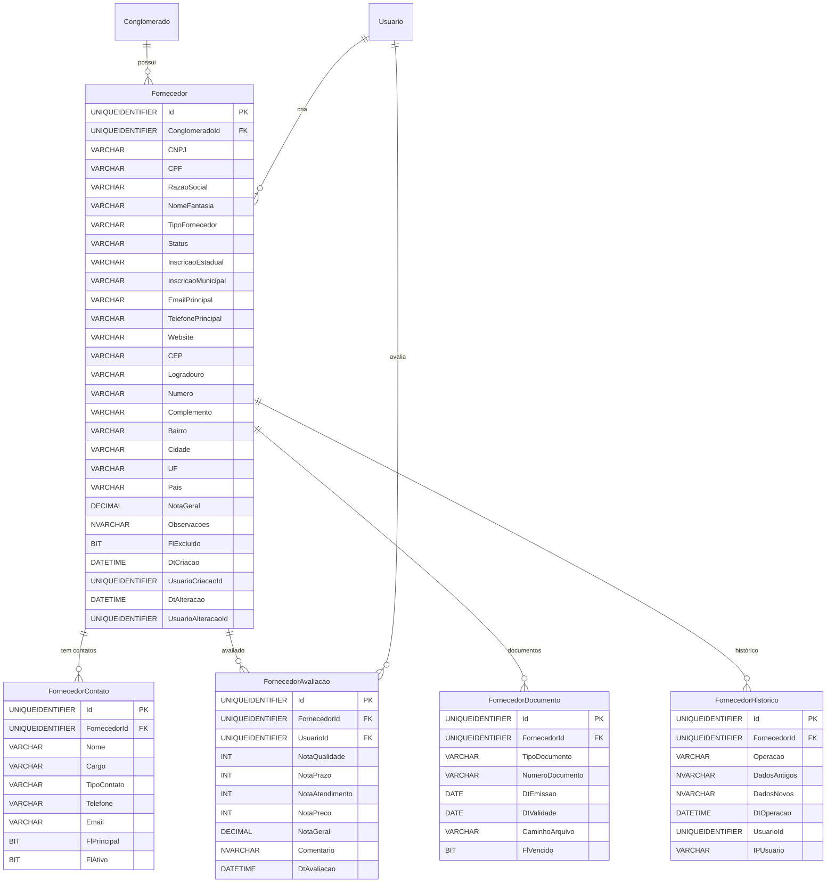

# Modelo de Dados - RF022

**Versão:** 1.0
**Data:** 2025-12-18
**RF Relacionado:** [RF022 - Gestão de Fornecedores](./RF022.md)
**Banco de Dados:** SQL Server (Produção) / SQLite (Desenvolvimento)

---

## 1. Diagrama de Entidades (Mermaid)



---

## 2. Entidades Principais

### 2.1 Tabela: Fornecedor

**Descrição:** Cadastro de fornecedores, prestadores de serviços e empresas contratadas.

#### DDL Completo

```sql
CREATE TABLE Fornecedor (
    -- Identificação
    Id UNIQUEIDENTIFIER NOT NULL DEFAULT NEWID(),
    ClienteId UNIQUEIDENTIFIER NOT NULL,

    -- Dados Fiscais
    CNPJ VARCHAR(18) NULL,              -- Formato: 99.999.999/9999-99
    CPF VARCHAR(14) NULL,               -- Formato: 999.999.999-99
    RazaoSocial VARCHAR(200) NOT NULL,
    NomeFantasia VARCHAR(150) NULL,

    -- Classificação
    TipoFornecedor VARCHAR(30) NOT NULL,
    -- OPERADORA_TELECOM, FORNECEDOR_TI, PRESTADOR_SERVICOS, DISTRIBUIDOR, FABRICANTE, OUTROS

    Status VARCHAR(30) NOT NULL DEFAULT 'ATIVO',
    -- ATIVO, INATIVO, PENDENTE_APROVACAO, BLOQUEADO, PENDENTE_DOCUMENTACAO

    -- Dados Complementares
    InscricaoEstadual VARCHAR(20) NULL,
    InscricaoMunicipal VARCHAR(20) NULL,
    EmailPrincipal VARCHAR(200) NULL,
    TelefonePrincipal VARCHAR(20) NULL,
    Website VARCHAR(500) NULL,

    -- Endereço
    CEP VARCHAR(9) NULL,                -- Formato: 99999-999
    Logradouro VARCHAR(300) NULL,
    Numero VARCHAR(10) NULL,
    Complemento VARCHAR(100) NULL,
    Bairro VARCHAR(100) NULL,
    Cidade VARCHAR(100) NULL,
    UF VARCHAR(2) NULL,
    Pais VARCHAR(100) NULL DEFAULT 'Brasil',

    -- Avaliação
    NotaGeral DECIMAL(3,2) NULL,        -- Média das avaliações (0.00 a 5.00)

    -- Observações
    Observacoes NVARCHAR(2000) NULL,

    -- Soft Delete
    FlExcluido BIT NOT NULL DEFAULT 0,

    -- Auditoria
    DtCriacao DATETIME NOT NULL DEFAULT GETDATE(),
    UsuarioCriacaoId UNIQUEIDENTIFIER NOT NULL,
    DtAlteracao DATETIME NULL,
    UsuarioAlteracaoId UNIQUEIDENTIFIER NULL,
    DtExclusao DATETIME NULL,
    UsuarioExclusaoId UNIQUEIDENTIFIER NULL,

    -- Constraints
    CONSTRAINT PK_Fornecedor PRIMARY KEY (Id),
    CONSTRAINT FK_Fornecedor_Conglomerado FOREIGN KEY (ClienteId) REFERENCES Cliente(Id),
    CONSTRAINT FK_Fornecedor_UsuarioCriacao FOREIGN KEY (UsuarioCriacaoId) REFERENCES Usuario(Id),
    CONSTRAINT FK_Fornecedor_UsuarioAlteracao FOREIGN KEY (UsuarioAlteracaoId) REFERENCES Usuario(Id),
    CONSTRAINT UQ_Fornecedor_CNPJ UNIQUE (ConglomeradoId, CNPJ),
    CONSTRAINT UQ_Fornecedor_CPF UNIQUE (ConglomeradoId, CPF),
    CONSTRAINT CK_Fornecedor_TipoFornecedor CHECK (TipoFornecedor IN ('OPERADORA_TELECOM', 'FORNECEDOR_TI', 'PRESTADOR_SERVICOS', 'DISTRIBUIDOR', 'FABRICANTE', 'OUTROS')),
    CONSTRAINT CK_Fornecedor_Status CHECK (Status IN ('ATIVO', 'INATIVO', 'PENDENTE_APROVACAO', 'BLOQUEADO', 'PENDENTE_DOCUMENTACAO')),
    CONSTRAINT CK_Fornecedor_NotaGeral CHECK (NotaGeral >= 0 AND NotaGeral <= 5),
    CONSTRAINT CK_Fornecedor_CNPJ_CPF CHECK (CNPJ IS NOT NULL OR CPF IS NOT NULL)
);

-- Índices
CREATE INDEX IX_Fornecedor_ConglomeradoId ON Fornecedor(ConglomeradoId);
CREATE INDEX IX_Fornecedor_CNPJ ON Fornecedor(CNPJ) WHERE CNPJ IS NOT NULL;
CREATE INDEX IX_Fornecedor_CPF ON Fornecedor(CPF) WHERE CPF IS NOT NULL;
CREATE INDEX IX_Fornecedor_RazaoSocial ON Fornecedor(RazaoSocial);
CREATE INDEX IX_Fornecedor_TipoFornecedor ON Fornecedor(TipoFornecedor);
CREATE INDEX IX_Fornecedor_Status ON Fornecedor(Status, Ativo);
CREATE INDEX IX_Fornecedor_NotaGeral ON Fornecedor(NotaGeral DESC);
```

### 2.2 Tabela: FornecedorContato

**Descrição:** Contatos de fornecedores (comercial, técnico, financeiro, jurídico).

#### DDL Completo

```sql
CREATE TABLE FornecedorContato (
    -- Identificação
    Id UNIQUEIDENTIFIER NOT NULL DEFAULT NEWID(),
    FornecedorId UNIQUEIDENTIFIER NOT NULL,

    -- Dados do Contato
    Nome VARCHAR(200) NOT NULL,
    Cargo VARCHAR(100) NULL,
    TipoContato VARCHAR(30) NOT NULL,
    -- COMERCIAL, TECNICO, FINANCEIRO, JURIDICO, DIRETORIA

    Telefone VARCHAR(20) NULL,
    Email VARCHAR(200) NULL,

    -- Controle
    FlPrincipal BIT NOT NULL DEFAULT 0, -- 1 = contato principal do tipo
    FlFlExcluido BIT NOT NULL DEFAULT 0,

    -- Auditoria
    DtCriacao DATETIME NOT NULL DEFAULT GETDATE(),
    UsuarioCriacaoId UNIQUEIDENTIFIER NOT NULL,

    -- Constraints
    CONSTRAINT PK_FornecedorContato PRIMARY KEY (Id),
    CONSTRAINT FK_FornecedorContato_Fornecedor FOREIGN KEY (FornecedorId) REFERENCES Fornecedor(Id) ON DELETE CASCADE,
    CONSTRAINT FK_FornecedorContato_Usuario FOREIGN KEY (UsuarioCriacaoId) REFERENCES Usuario(Id),
    CONSTRAINT CK_FornecedorContato_TipoContato CHECK (TipoContato IN ('COMERCIAL', 'TECNICO', 'FINANCEIRO', 'JURIDICO', 'DIRETORIA'))
);

CREATE INDEX IX_FornecedorContato_FornecedorId ON FornecedorContato(FornecedorId);
CREATE INDEX IX_FornecedorContato_TipoContato ON FornecedorContato(TipoContato);
CREATE INDEX IX_FornecedorContato_FlPrincipal ON FornecedorContato(FlPrincipal) WHERE FlPrincipal = 1;
```

### 2.3 Tabela: FornecedorAvaliacao

**Descrição:** Avaliações de fornecedores com critérios de qualidade, prazo, atendimento e preço.

#### DDL Completo

```sql
CREATE TABLE FornecedorAvaliacao (
    -- Identificação
    Id UNIQUEIDENTIFIER NOT NULL DEFAULT NEWID(),
    FornecedorId UNIQUEIDENTIFIER NOT NULL,
    UsuarioId UNIQUEIDENTIFIER NOT NULL,

    -- Notas (1-5)
    NotaQualidade INT NOT NULL,
    NotaPrazo INT NOT NULL,
    NotaAtendimento INT NOT NULL,
    NotaPreco INT NOT NULL,
    NotaGeral DECIMAL(3,2) NOT NULL,    -- Média ponderada

    -- Comentário
    Comentario NVARCHAR(2000) NULL,

    -- Auditoria
    DtAvaliacao DATETIME NOT NULL DEFAULT GETDATE(),

    -- Constraints
    CONSTRAINT PK_FornecedorAvaliacao PRIMARY KEY (Id),
    CONSTRAINT FK_FornecedorAvaliacao_Fornecedor FOREIGN KEY (FornecedorId) REFERENCES Fornecedor(Id) ON DELETE CASCADE,
    CONSTRAINT FK_FornecedorAvaliacao_Usuario FOREIGN KEY (UsuarioId) REFERENCES Usuario(Id),
    CONSTRAINT CK_FornecedorAvaliacao_NotaQualidade CHECK (NotaQualidade BETWEEN 1 AND 5),
    CONSTRAINT CK_FornecedorAvaliacao_NotaPrazo CHECK (NotaPrazo BETWEEN 1 AND 5),
    CONSTRAINT CK_FornecedorAvaliacao_NotaAtendimento CHECK (NotaAtendimento BETWEEN 1 AND 5),
    CONSTRAINT CK_FornecedorAvaliacao_NotaPreco CHECK (NotaPreco BETWEEN 1 AND 5),
    CONSTRAINT CK_FornecedorAvaliacao_NotaGeral CHECK (NotaGeral >= 0 AND NotaGeral <= 5)
);

CREATE INDEX IX_FornecedorAvaliacao_FornecedorId ON FornecedorAvaliacao(FornecedorId);
CREATE INDEX IX_FornecedorAvaliacao_UsuarioId ON FornecedorAvaliacao(UsuarioId);
CREATE INDEX IX_FornecedorAvaliacao_DtAvaliacao ON FornecedorAvaliacao(DtAvaliacao DESC);
```

### 2.4 Tabela: FornecedorDocumento

**Descrição:** Documentos de compliance do fornecedor (contrato social, certidões, certificações).

#### DDL Completo

```sql
CREATE TABLE FornecedorDocumento (
    -- Identificação
    Id UNIQUEIDENTIFIER NOT NULL DEFAULT NEWID(),
    FornecedorId UNIQUEIDENTIFIER NOT NULL,

    -- Tipo de Documento
    TipoDocumento VARCHAR(50) NOT NULL,
    -- CONTRATO_SOCIAL, CERTIDAO_NEGATIVA, ALVARA, ISO_9001, ISO_27001

    NumeroDocumento VARCHAR(100) NULL,
    DtEmissao DATE NULL,
    DtValidade DATE NULL,
    CaminhoArquivo VARCHAR(1000) NULL,

    -- Status
    FlVencido BIT NOT NULL DEFAULT 0,

    -- Auditoria
    DtCriacao DATETIME NOT NULL DEFAULT GETDATE(),
    UsuarioCriacaoId UNIQUEIDENTIFIER NOT NULL,

    -- Constraints
    CONSTRAINT PK_FornecedorDocumento PRIMARY KEY (Id),
    CONSTRAINT FK_FornecedorDocumento_Fornecedor FOREIGN KEY (FornecedorId) REFERENCES Fornecedor(Id) ON DELETE CASCADE,
    CONSTRAINT FK_FornecedorDocumento_Usuario FOREIGN KEY (UsuarioCriacaoId) REFERENCES Usuario(Id)
);

CREATE INDEX IX_FornecedorDocumento_FornecedorId ON FornecedorDocumento(FornecedorId);
CREATE INDEX IX_FornecedorDocumento_DtValidade ON FornecedorDocumento(DtValidade) WHERE DtValidade IS NOT NULL;
CREATE INDEX IX_FornecedorDocumento_FlVencido ON FornecedorDocumento(FlVencido);
```

### 2.5 Tabela: FornecedorHistorico

**Descrição:** Auditoria completa de operações em fornecedores.

#### DDL Completo

```sql
CREATE TABLE FornecedorHistorico (
    -- Identificação
    Id UNIQUEIDENTIFIER NOT NULL DEFAULT NEWID(),
    FornecedorId UNIQUEIDENTIFIER NOT NULL,

    -- Operação
    Operacao VARCHAR(20) NOT NULL,      -- CREATE, UPDATE, DELETE, AVALIAR, BLOQUEAR
    DadosAntigos NVARCHAR(MAX) NULL,    -- JSON
    DadosNovos NVARCHAR(MAX) NULL,      -- JSON

    -- Auditoria
    DtOperacao DATETIME NOT NULL DEFAULT GETDATE(),
    UsuarioId UNIQUEIDENTIFIER NOT NULL,
    IPUsuario VARCHAR(45) NULL,

    -- Constraints
    CONSTRAINT PK_FornecedorHistorico PRIMARY KEY (Id),
    CONSTRAINT FK_FornecedorHistorico_Fornecedor FOREIGN KEY (FornecedorId) REFERENCES Fornecedor(Id),
    CONSTRAINT FK_FornecedorHistorico_Usuario FOREIGN KEY (UsuarioId) REFERENCES Usuario(Id),
    CONSTRAINT CK_FornecedorHistorico_Operacao CHECK (Operacao IN ('CREATE', 'UPDATE', 'DELETE', 'AVALIAR', 'BLOQUEAR', 'DESBLOQUEAR'))
);

CREATE INDEX IX_FornecedorHistorico_FornecedorId ON FornecedorHistorico(FornecedorId);
CREATE INDEX IX_FornecedorHistorico_DtOperacao ON FornecedorHistorico(DtOperacao DESC);
```

---

## 3. Triggers para Automação

### 3.1 Trigger: Calcular Nota Geral

```sql
CREATE TRIGGER trg_FornecedorAvaliacao_CalcularNotaGeral
ON FornecedorAvaliacao
AFTER INSERT, UPDATE
AS
BEGIN
    SET NOCOUNT ON;

    -- Calcula média ponderada (Qualidade 40%, Prazo 30%, Atendimento 20%, Preço 10%)
    UPDATE fa
    SET NotaGeral = (
        (fa.NotaQualidade * 0.4) +
        (fa.NotaPrazo * 0.3) +
        (fa.NotaAtendimento * 0.2) +
        (fa.NotaPreco * 0.1)
    )
    FROM FornecedorAvaliacao fa
    INNER JOIN inserted i ON fa.Id = i.Id;

    -- Atualiza nota geral do fornecedor
    UPDATE f
    SET NotaGeral = (
        SELECT AVG(NotaGeral)
        FROM FornecedorAvaliacao
        WHERE FornecedorId = f.Id
    )
    FROM Fornecedor f
    INNER JOIN inserted i ON f.Id = i.FornecedorId;
END;
```

### 3.2 Trigger: Validar Apenas Um Contato Principal por Tipo

```sql
CREATE TRIGGER trg_FornecedorContato_ValidarPrincipal
ON FornecedorContato
AFTER INSERT, UPDATE
AS
BEGIN
    SET NOCOUNT ON;

    -- Remove FlPrincipal de outros contatos do mesmo tipo
    UPDATE fc
    SET FlPrincipal = 0
    FROM FornecedorContato fc
    INNER JOIN inserted i ON fc.FornecedorId = i.FornecedorId AND fc.TipoContato = i.TipoContato
    WHERE fc.Id <> i.Id AND i.FlPrincipal = 1;
END;
```

---

## 4. Views Úteis

```sql
CREATE VIEW VW_Fornecedor_Completo AS
SELECT
    f.Id,
    f.ConglomeradoId,
    f.CNPJ,
    f.CPF,
    f.RazaoSocial,
    f.NomeFantasia,
    f.TipoFornecedor,
    f.Status,
    f.NotaGeral,
    f.EmailPrincipal,
    f.TelefonePrincipal,
    f.Cidade,
    f.UF,
    COUNT(DISTINCT c.Id) AS TotalContratos,
    COUNT(DISTINCT a.Id) AS TotalAvaliacoes,
    u.Nome AS CriadoPor,
    f.DtCriacao,
    f.FlExcluido
FROM Fornecedor f
LEFT JOIN Contrato c ON f.Id = c.FornecedorId AND c.FlExcluido = 0
LEFT JOIN FornecedorAvaliacao a ON f.Id = a.FornecedorId
LEFT JOIN Usuario u ON f.UsuarioCriacaoId = u.Id
GROUP BY
    f.Id, f.ConglomeradoId, f.CNPJ, f.CPF, f.RazaoSocial, f.NomeFantasia,
    f.TipoFornecedor, f.Status, f.NotaGeral, f.EmailPrincipal, f.TelefonePrincipal,
    f.Cidade, f.UF, u.Nome, f.DtCriacao, f.FlExcluido;
```

---

## 5. Notas de Implementação

### 5.1 Validação de CNPJ/CPF

- Backend valida dígitos verificadores antes de salvar
- API Receita Federal para preenchimento automático de dados

### 5.2 Sistema de Avaliação

- Média ponderada: Qualidade (40%), Prazo (30%), Atendimento (20%), Preço (10%)
- Job Hangfire diário recalcula nota geral de todos os fornecedores

### 5.3 Alertas de Documentos Vencidos

- Job Hangfire diário verifica DtValidade de documentos
- Notificações enviadas 30, 60 e 90 dias antes do vencimento

---

**Última Atualização:** 2025-12-18
**Responsável:** IControlIT Architect Agent
**Versão do Banco:** SQL Server 2022 / SQLite 3.45
