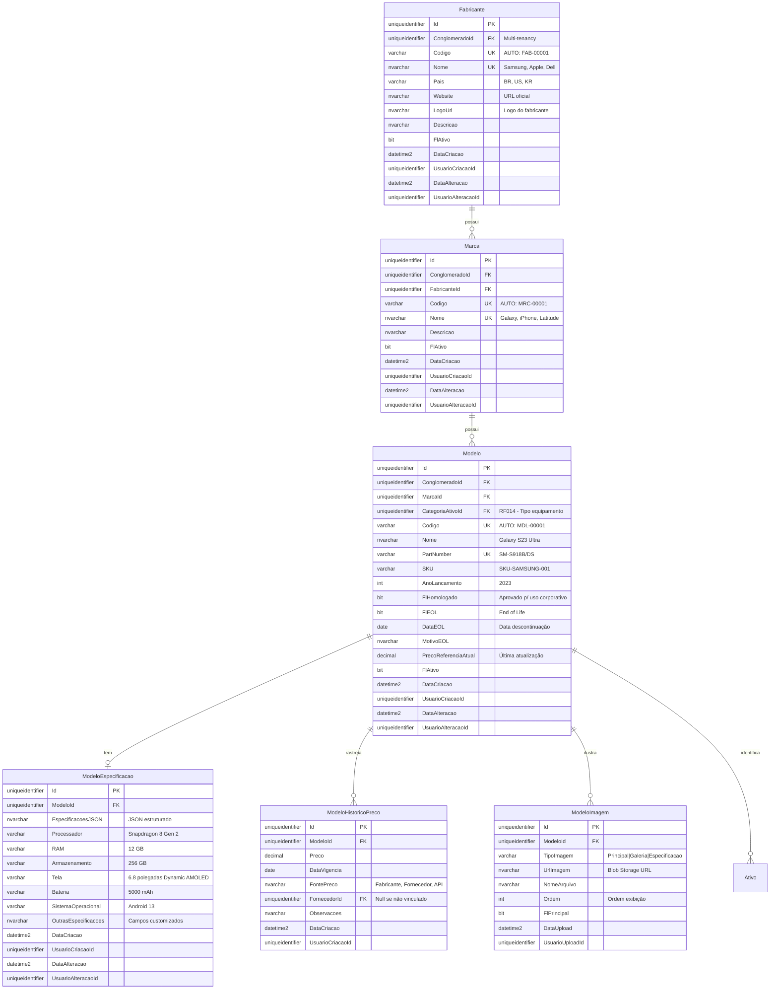

# MD-RF051 - Modelo de Dados - Gestão de Marcas e Modelos

**Versão:** 1.0
**Data:** 2025-12-18
**Responsável:** Arquiteto IControlIT
**RF Relacionado:** [RF051 - Gestão de Marcas e Modelos](./RF051.md)

---

## 1. Visão Geral

Este documento especifica o modelo de dados completo para o sistema de **Gestão de Marcas e Modelos de Equipamentos**, incluindo cadastro de fabricantes, marcas, modelos com especificações técnicas, SKUs, homologação, ciclo de vida (EOL) e histórico de preços.

### 1.1. Objetivo do Modelo

- **Catalogação padronizada** de fabricantes, marcas e modelos de equipamentos
- **Especificações técnicas detalhadas** em formato JSON flexível
- **Rastreamento de ciclo de vida** (lançamento, EOL, descontinuado)
- **Homologação corporativa** de modelos aprovados para uso
- **Histórico de preços** para análise de custos e tendências
- **Integração com APIs externas** para importação automática de catálogos
- **Part Numbers e SKUs únicos** para identificação precisa

### 1.2. Principais Entidades

| Entidade | Descrição | Tipo |
|----------|-----------|------|
| `Fabricante` | Fabricantes de equipamentos (Samsung, Apple, Dell, etc.) | Mestre |
| `Marca` | Marcas vinculadas a fabricantes | Mestre |
| `Modelo` | Modelos específicos de equipamentos | Mestre |
| `ModeloEspecificacao` | Especificações técnicas em JSON | Configuração |
| `ModeloHistoricoPreco` | Histórico de preços de modelos | Auditoria |
| `ModeloImagem` | Imagens e fotos de modelos | Mídia |

---

## 2. Diagrama ER (Entidade-Relacionamento)



---

## 3. DDL Completo (SQL Server)

### 3.1. Fabricante

```sql
-- =============================================
-- Tabela: Fabricante
-- Descrição: Fabricantes de equipamentos de TI e telecom
-- =============================================
CREATE TABLE Fabricante (
    Id UNIQUEIDENTIFIER PRIMARY KEY DEFAULT NEWID(),
    ClienteId UNIQUEIDENTIFIER NOT NULL,
    Codigo VARCHAR(20) NOT NULL,
    Nome NVARCHAR(100) NOT NULL,
    Pais VARCHAR(2) NULL, -- ISO 3166-1 alpha-2 (BR, US, KR, CN)
    Website NVARCHAR(200) NULL,
    LogoUrl NVARCHAR(500) NULL,
    Descricao NVARCHAR(500) NULL,
    FlFlExcluido BIT NOT NULL DEFAULT 0,

    -- Auditoria
    DataCriacao DATETIME2 NOT NULL DEFAULT GETDATE(),
    UsuarioCriacaoId UNIQUEIDENTIFIER NOT NULL,
    DataAlteracao DATETIME2 NULL,
    UsuarioAlteracaoId UNIQUEIDENTIFIER NULL,

    -- Constraints
    CONSTRAINT FK_Fabricante_Conglomerado
        FOREIGN KEY (ClienteId) REFERENCES Cliente(Id),
    CONSTRAINT FK_Fabricante_UsuarioCriacao
        FOREIGN KEY (UsuarioCriacaoId) REFERENCES Usuario(Id),
    CONSTRAINT FK_Fabricante_UsuarioAlteracao
        FOREIGN KEY (UsuarioAlteracaoId) REFERENCES Usuario(Id),
    CONSTRAINT UQ_Fabricante_Codigo
        UNIQUE (ConglomeradoId, Codigo),
    CONSTRAINT UQ_Fabricante_Nome
        UNIQUE (ConglomeradoId, Nome)
);

-- Índices
CREATE INDEX IX_Fabricante_ConglomeradoId
    ON Fabricante(ConglomeradoId);
CREATE INDEX IX_Fabricante_Nome
    ON Fabricante(Nome);
CREATE INDEX IX_Fabricante_FlAtivo
    ON Fabricante(FlAtivo) WHERE FlAtivo = 1;

-- Comentários
EXEC sp_addextendedproperty
    @name = N'MS_Description', @value = N'Fabricantes de equipamentos de TI e telecom',
    @level0type = N'SCHEMA', @level0name = N'dbo',
    @level1type = N'TABLE', @level1name = N'Fabricante';

-- Seed Data
INSERT INTO Fabricante (Id, ConglomeradoId, Codigo, Nome, Pais, Website, FlAtivo, DataCriacao, UsuarioCriacaoId)
VALUES
    (NEWID(), @ConglomeradoId, 'FAB-00001', 'Samsung', 'KR', 'https://www.samsung.com', 1, GETDATE(), @UsuarioSistemaId),
    (NEWID(), @ConglomeradoId, 'FAB-00002', 'Apple', 'US', 'https://www.apple.com', 1, GETDATE(), @UsuarioSistemaId),
    (NEWID(), @ConglomeradoId, 'FAB-00003', 'Dell', 'US', 'https://www.dell.com', 1, GETDATE(), @UsuarioSistemaId),
    (NEWID(), @ConglomeradoId, 'FAB-00004', 'Lenovo', 'CN', 'https://www.lenovo.com', 1, GETDATE(), @UsuarioSistemaId),
    (NEWID(), @ConglomeradoId, 'FAB-00005', 'HP', 'US', 'https://www.hp.com', 1, GETDATE(), @UsuarioSistemaId),
    (NEWID(), @ConglomeradoId, 'FAB-00006', 'Cisco', 'US', 'https://www.cisco.com', 1, GETDATE(), @UsuarioSistemaId),
    (NEWID(), @ConglomeradoId, 'FAB-00007', 'Huawei', 'CN', 'https://www.huawei.com', 1, GETDATE(), @UsuarioSistemaId),
    (NEWID(), @ConglomeradoId, 'FAB-00008', 'Motorola', 'US', 'https://www.motorola.com', 1, GETDATE(), @UsuarioSistemaId);
```

### 3.2. Marca

```sql
-- =============================================
-- Tabela: Marca
-- Descrição: Marcas vinculadas a fabricantes
-- =============================================
CREATE TABLE Marca (
    Id UNIQUEIDENTIFIER PRIMARY KEY DEFAULT NEWID(),
    ClienteId UNIQUEIDENTIFIER NOT NULL,
    FabricanteId UNIQUEIDENTIFIER NOT NULL,
    Codigo VARCHAR(20) NOT NULL,
    Nome NVARCHAR(100) NOT NULL,
    Descricao NVARCHAR(500) NULL,
    FlFlExcluido BIT NOT NULL DEFAULT 0,

    -- Auditoria
    DataCriacao DATETIME2 NOT NULL DEFAULT GETDATE(),
    UsuarioCriacaoId UNIQUEIDENTIFIER NOT NULL,
    DataAlteracao DATETIME2 NULL,
    UsuarioAlteracaoId UNIQUEIDENTIFIER NULL,

    -- Constraints
    CONSTRAINT FK_Marca_Conglomerado
        FOREIGN KEY (ClienteId) REFERENCES Cliente(Id),
    CONSTRAINT FK_Marca_Fabricante
        FOREIGN KEY (FabricanteId) REFERENCES Fabricante(Id),
    CONSTRAINT FK_Marca_UsuarioCriacao
        FOREIGN KEY (UsuarioCriacaoId) REFERENCES Usuario(Id),
    CONSTRAINT FK_Marca_UsuarioAlteracao
        FOREIGN KEY (UsuarioAlteracaoId) REFERENCES Usuario(Id),
    CONSTRAINT UQ_Marca_Codigo
        UNIQUE (ConglomeradoId, Codigo),
    CONSTRAINT UQ_Marca_Nome_Fabricante
        UNIQUE (ConglomeradoId, FabricanteId, Nome)
);

-- Índices
CREATE INDEX IX_Marca_ConglomeradoId
    ON Marca(ConglomeradoId);
CREATE INDEX IX_Marca_FabricanteId
    ON Marca(FabricanteId);
CREATE INDEX IX_Marca_Nome
    ON Marca(Nome);
CREATE INDEX IX_Marca_FlAtivo
    ON Marca(FlAtivo) WHERE FlAtivo = 1;

-- Comentários
EXEC sp_addextendedproperty
    @name = N'MS_Description', @value = N'Marcas de equipamentos vinculadas a fabricantes',
    @level0type = N'SCHEMA', @level0name = N'dbo',
    @level1type = N'TABLE', @level1name = N'Marca';

-- Seed Data (Samsung)
INSERT INTO Marca (Id, ConglomeradoId, FabricanteId, Codigo, Nome, FlAtivo, DataCriacao, UsuarioCriacaoId)
VALUES
    (NEWID(), @ConglomeradoId, @SamsungId, 'MRC-00001', 'Galaxy', 1, GETDATE(), @UsuarioSistemaId),
    (NEWID(), @ConglomeradoId, @SamsungId, 'MRC-00002', 'Galaxy Tab', 1, GETDATE(), @UsuarioSistemaId);

-- Seed Data (Apple)
INSERT INTO Marca (Id, ConglomeradoId, FabricanteId, Codigo, Nome, FlAtivo, DataCriacao, UsuarioCriacaoId)
VALUES
    (NEWID(), @ConglomeradoId, @AppleId, 'MRC-00003', 'iPhone', 1, GETDATE(), @UsuarioSistemaId),
    (NEWID(), @ConglomeradoId, @AppleId, 'MRC-00004', 'iPad', 1, GETDATE(), @UsuarioSistemaId),
    (NEWID(), @ConglomeradoId, @AppleId, 'MRC-00005', 'MacBook', 1, GETDATE(), @UsuarioSistemaId);
```

### 3.3. Modelo

```sql
-- =============================================
-- Tabela: Modelo
-- Descrição: Modelos específicos de equipamentos
-- =============================================
CREATE TABLE Modelo (
    Id UNIQUEIDENTIFIER PRIMARY KEY DEFAULT NEWID(),
    ClienteId UNIQUEIDENTIFIER NOT NULL,
    MarcaId UNIQUEIDENTIFIER NOT NULL,
    CategoriaAtivoId UNIQUEIDENTIFIER NOT NULL, -- RF014
    Codigo VARCHAR(20) NOT NULL,
    Nome NVARCHAR(150) NOT NULL,
    PartNumber VARCHAR(50) NULL,
    SKU VARCHAR(50) NULL,
    AnoLancamento INT NULL,

    -- Homologação e Ciclo de Vida
    FlHomologado BIT NOT NULL DEFAULT 0,
    FlEOL BIT NOT NULL DEFAULT 0,
    DataEOL DATE NULL,
    MotivoEOL NVARCHAR(200) NULL,

    -- Preço
    PrecoReferenciaAtual DECIMAL(18,2) NULL,
    DataUltimaAtualizacaoPreco DATETIME2 NULL,

    FlFlExcluido BIT NOT NULL DEFAULT 0,

    -- Auditoria
    DataCriacao DATETIME2 NOT NULL DEFAULT GETDATE(),
    UsuarioCriacaoId UNIQUEIDENTIFIER NOT NULL,
    DataAlteracao DATETIME2 NULL,
    UsuarioAlteracaoId UNIQUEIDENTIFIER NULL,

    -- Constraints
    CONSTRAINT FK_Modelo_Conglomerado
        FOREIGN KEY (ClienteId) REFERENCES Cliente(Id),
    CONSTRAINT FK_Modelo_Marca
        FOREIGN KEY (MarcaId) REFERENCES Marca(Id),
    CONSTRAINT FK_Modelo_CategoriaAtivo
        FOREIGN KEY (CategoriaAtivoId) REFERENCES CategoriaAtivo(Id),
    CONSTRAINT FK_Modelo_UsuarioCriacao
        FOREIGN KEY (UsuarioCriacaoId) REFERENCES Usuario(Id),
    CONSTRAINT FK_Modelo_UsuarioAlteracao
        FOREIGN KEY (UsuarioAlteracaoId) REFERENCES Usuario(Id),
    CONSTRAINT UQ_Modelo_Codigo
        UNIQUE (ConglomeradoId, Codigo),
    CONSTRAINT UQ_Modelo_PartNumber_Marca
        UNIQUE (ConglomeradoId, MarcaId, PartNumber),
    CONSTRAINT CK_Modelo_HomologacaoEOL
        CHECK (FlEOL = 0 OR FlHomologado = 0), -- Se EOL, não pode ser homologado
    CONSTRAINT CK_Modelo_AnoLancamento
        CHECK (AnoLancamento IS NULL OR (AnoLancamento >= 1990 AND AnoLancamento <= YEAR(GETDATE()) + 2))
);

-- Índices
CREATE INDEX IX_Modelo_ConglomeradoId
    ON Modelo(ConglomeradoId);
CREATE INDEX IX_Modelo_MarcaId
    ON Modelo(MarcaId);
CREATE INDEX IX_Modelo_CategoriaAtivoId
    ON Modelo(CategoriaAtivoId);
CREATE INDEX IX_Modelo_PartNumber
    ON Modelo(PartNumber) WHERE PartNumber IS NOT NULL;
CREATE INDEX IX_Modelo_SKU
    ON Modelo(SKU) WHERE SKU IS NOT NULL;
CREATE INDEX IX_Modelo_FlHomologado
    ON Modelo(FlHomologado) WHERE FlHomologado = 1;
CREATE INDEX IX_Modelo_FlEOL
    ON Modelo(FlEOL);
CREATE INDEX IX_Modelo_FlAtivo
    ON Modelo(FlAtivo) WHERE FlAtivo = 1;

-- Comentários
EXEC sp_addextendedproperty
    @name = N'MS_Description', @value = N'Modelos específicos de equipamentos com part numbers e homologação',
    @level0type = N'SCHEMA', @level0name = N'dbo',
    @level1type = N'TABLE', @level1name = N'Modelo';

-- Trigger: Ao marcar EOL, desmarcar homologação
CREATE TRIGGER trg_Modelo_EOL_RemoveHomologacao
ON Modelo
AFTER UPDATE
AS
BEGIN
    IF UPDATE(FlEOL)
    BEGIN
        UPDATE Modelo
        SET FlHomologado = 0
        WHERE Id IN (SELECT Id FROM inserted WHERE FlEOL = 1);
    END
END;
GO
```

### 3.4. ModeloEspecificacao

```sql
-- =============================================
-- Tabela: ModeloEspecificacao
-- Descrição: Especificações técnicas em JSON
-- =============================================
CREATE TABLE ModeloEspecificacao (
    Id UNIQUEIDENTIFIER PRIMARY KEY DEFAULT NEWID(),
    ModeloId UNIQUEIDENTIFIER NOT NULL,

    -- Especificações comuns
    Processador NVARCHAR(100) NULL,
    RAM NVARCHAR(50) NULL,
    Armazenamento NVARCHAR(50) NULL,
    Tela NVARCHAR(100) NULL,
    Bateria NVARCHAR(50) NULL,
    SistemaOperacional NVARCHAR(100) NULL,
    Peso NVARCHAR(20) NULL,
    Dimensoes NVARCHAR(50) NULL,

    -- JSON para campos customizados
    EspecificacoesJSON NVARCHAR(MAX) NULL,

    -- Auditoria
    DataCriacao DATETIME2 NOT NULL DEFAULT GETDATE(),
    UsuarioCriacaoId UNIQUEIDENTIFIER NOT NULL,
    DataAlteracao DATETIME2 NULL,
    UsuarioAlteracaoId UNIQUEIDENTIFIER NULL,

    -- Constraints
    CONSTRAINT FK_ModeloEspecificacao_Modelo
        FOREIGN KEY (ModeloId) REFERENCES Modelo(Id),
    CONSTRAINT FK_ModeloEspecificacao_UsuarioCriacao
        FOREIGN KEY (UsuarioCriacaoId) REFERENCES Usuario(Id),
    CONSTRAINT FK_ModeloEspecificacao_UsuarioAlteracao
        FOREIGN KEY (UsuarioAlteracaoId) REFERENCES Usuario(Id),
    CONSTRAINT CK_ModeloEspecificacao_JSON
        CHECK (EspecificacoesJSON IS NULL OR ISJSON(EspecificacoesJSON) = 1)
);

-- Índices
CREATE UNIQUE INDEX UQ_ModeloEspecificacao_ModeloId
    ON ModeloEspecificacao(ModeloId);

-- Comentários
EXEC sp_addextendedproperty
    @name = N'MS_Description', @value = N'Especificações técnicas detalhadas dos modelos',
    @level0type = N'SCHEMA', @level0name = N'dbo',
    @level1type = N'TABLE', @level1name = N'ModeloEspecificacao';
```

### 3.5. ModeloHistoricoPreco

```sql
-- =============================================
-- Tabela: ModeloHistoricoPreco
-- Descrição: Histórico de preços de modelos (IMUTÁVEL)
-- =============================================
CREATE TABLE ModeloHistoricoPreco (
    Id UNIQUEIDENTIFIER PRIMARY KEY DEFAULT NEWID(),
    ModeloId UNIQUEIDENTIFIER NOT NULL,
    Preco DECIMAL(18,2) NOT NULL,
    DataVigencia DATE NOT NULL,
    FontePreco NVARCHAR(100) NULL, -- Fabricante | Fornecedor | API | Manual
    FornecedorId UNIQUEIDENTIFIER NULL,
    Observacoes NVARCHAR(200) NULL,

    -- Auditoria
    DataCriacao DATETIME2 NOT NULL DEFAULT GETDATE(),
    UsuarioCriacaoId UNIQUEIDENTIFIER NOT NULL,

    -- Constraints
    CONSTRAINT FK_ModeloHistoricoPreco_Modelo
        FOREIGN KEY (ModeloId) REFERENCES Modelo(Id),
    CONSTRAINT FK_ModeloHistoricoPreco_Fornecedor
        FOREIGN KEY (FornecedorId) REFERENCES Fornecedor(Id),
    CONSTRAINT FK_ModeloHistoricoPreco_UsuarioCriacao
        FOREIGN KEY (UsuarioCriacaoId) REFERENCES Usuario(Id),
    CONSTRAINT CK_ModeloHistoricoPreco_Preco
        CHECK (Preco >= 0)
);

-- Índices
CREATE INDEX IX_ModeloHistoricoPreco_ModeloId
    ON ModeloHistoricoPreco(ModeloId);
CREATE INDEX IX_ModeloHistoricoPreco_DataVigencia
    ON ModeloHistoricoPreco(DataVigencia DESC);
CREATE INDEX IX_ModeloHistoricoPreco_Modelo_DataVigencia
    ON ModeloHistoricoPreco(ModeloId, DataVigencia DESC);

-- Comentários
EXEC sp_addextendedproperty
    @name = N'MS_Description', @value = N'Histórico de preços de modelos (imutável)',
    @level0type = N'SCHEMA', @level0name = N'dbo',
    @level1type = N'TABLE', @level1name = N'ModeloHistoricoPreco';

-- Bloquear UPDATE e DELETE
CREATE TRIGGER trg_ModeloHistoricoPreco_Protecao
ON ModeloHistoricoPreco
INSTEAD OF UPDATE, DELETE
AS
BEGIN
    RAISERROR('Histórico de preços é IMUTÁVEL. Não é permitido alterar ou excluir registros.', 16, 1);
    ROLLBACK TRANSACTION;
END;
GO
```

### 3.6. ModeloImagem

```sql
-- =============================================
-- Tabela: ModeloImagem
-- Descrição: Imagens e fotos de modelos
-- =============================================
CREATE TABLE ModeloImagem (
    Id UNIQUEIDENTIFIER PRIMARY KEY DEFAULT NEWID(),
    ModeloId UNIQUEIDENTIFIER NOT NULL,
    TipoImagem VARCHAR(20) NOT NULL, -- Principal | Galeria | Especificacao
    UrlImagem NVARCHAR(500) NOT NULL,
    NomeArquivo NVARCHAR(200) NOT NULL,
    Ordem INT NOT NULL DEFAULT 0,
    FlPrincipal BIT NOT NULL DEFAULT 0,

    -- Auditoria
    DataUpload DATETIME2 NOT NULL DEFAULT GETDATE(),
    UsuarioUploadId UNIQUEIDENTIFIER NOT NULL,

    -- Constraints
    CONSTRAINT FK_ModeloImagem_Modelo
        FOREIGN KEY (ModeloId) REFERENCES Modelo(Id),
    CONSTRAINT FK_ModeloImagem_UsuarioUpload
        FOREIGN KEY (UsuarioUploadId) REFERENCES Usuario(Id),
    CONSTRAINT CK_ModeloImagem_TipoImagem
        CHECK (TipoImagem IN ('Principal', 'Galeria', 'Especificacao'))
);

-- Índices
CREATE INDEX IX_ModeloImagem_ModeloId
    ON ModeloImagem(ModeloId);
CREATE INDEX IX_ModeloImagem_FlPrincipal
    ON ModeloImagem(ModeloId, FlPrincipal) WHERE FlPrincipal = 1;
CREATE INDEX IX_ModeloImagem_Ordem
    ON ModeloImagem(ModeloId, Ordem);

-- Comentários
EXEC sp_addextendedproperty
    @name = N'MS_Description', @value = N'Imagens e fotos de modelos de equipamentos',
    @level0type = N'SCHEMA', @level0name = N'dbo',
    @level1type = N'TABLE', @level1name = N'ModeloImagem';

-- Trigger: Apenas 1 imagem principal por modelo
CREATE TRIGGER trg_ModeloImagem_UnicaPrincipal
ON ModeloImagem
AFTER INSERT, UPDATE
AS
BEGIN
    IF UPDATE(FlPrincipal)
    BEGIN
        UPDATE ModeloImagem
        SET FlPrincipal = 0
        WHERE ModeloId IN (SELECT ModeloId FROM inserted WHERE FlPrincipal = 1)
          AND Id NOT IN (SELECT Id FROM inserted WHERE FlPrincipal = 1);
    END
END;
GO
```

---

## 4. Regras de Negócio Implementadas no Modelo

### 4.1. Unicidade de Fabricantes e Marcas

- **RN001**: Nome de fabricante ÚNICO por conglomerado (UQ_Fabricante_Nome)
- **RN002**: Nome de marca ÚNICO por fabricante + conglomerado (UQ_Marca_Nome_Fabricante)
- **RN003**: Part Number ÚNICO por marca + conglomerado (UQ_Modelo_PartNumber_Marca)

### 4.2. Homologação e EOL

- **RN004**: Modelo EOL NÃO pode ser homologado (CK_Modelo_HomologacaoEOL)
- **RN005**: Ao marcar modelo como EOL, desmarca homologação automaticamente (trigger trg_Modelo_EOL_RemoveHomologacao)
- **RN006**: EOL deve ter data e motivo preenchidos (validação em application layer)

### 4.3. Especificações Técnicas

- **RN007**: EspecificacoesJSON DEVE ser JSON válido (CK_ModeloEspecificacao_JSON)
- **RN008**: Campos comuns (Processador, RAM, etc.) são indexados separadamente para performance
- **RN009**: JSON permite campos customizados por categoria de equipamento

### 4.4. Histórico de Preços

- **RN010**: Histórico de preços é IMUTÁVEL (trigger trg_ModeloHistoricoPreco_Protecao)
- **RN011**: Novo preço = novo registro no histórico
- **RN012**: `Modelo.PrecoReferenciaAtual` é atualizado automaticamente ao inserir novo histórico

### 4.5. Imagens

- **RN013**: Apenas 1 imagem pode ser marcada como Principal por modelo (trigger trg_ModeloImagem_UnicaPrincipal)
- **RN014**: Ordem de exibição define galeria de imagens
- **RN015**: Tipos: Principal (destaque), Galeria (fotos adicionais), Especificacao (diagrama técnico)

### 4.6. Proteção contra Exclusão

- **RN016**: Não permitir inativar fabricante se houver marcas ativas vinculadas
- **RN017**: Não permitir inativar marca se houver modelos ativos vinculados
- **RN018**: Não permitir inativar modelo se houver ativos cadastrados (verificar Ativo.ModeloId)

---

## 5. Stored Procedures e Functions

### 5.1. sp_ModeloRegistrarNovoPreco

```sql
CREATE PROCEDURE sp_ModeloRegistrarNovoPreco
    @ModeloId UNIQUEIDENTIFIER,
    @Preco DECIMAL(18,2),
    @DataVigencia DATE,
    @FontePreco NVARCHAR(100),
    @FornecedorId UNIQUEIDENTIFIER = NULL,
    @UsuarioId UNIQUEIDENTIFIER,
    @Observacoes NVARCHAR(200) = NULL
AS
BEGIN
    SET NOCOUNT ON;
    BEGIN TRANSACTION;

    -- 1. Inserir no histórico (imutável)
    INSERT INTO ModeloHistoricoPreco (
        ModeloId, Preco, DataVigencia, FontePreco, FornecedorId, Observacoes, UsuarioCriacaoId
    )
    VALUES (
        @ModeloId, @Preco, @DataVigencia, @FontePreco, @FornecedorId, @Observacoes, @UsuarioId
    );

    -- 2. Atualizar preço de referência atual no modelo
    UPDATE Modelo
    SET PrecoReferenciaAtual = @Preco,
        DataUltimaAtualizacaoPreco = GETDATE()
    WHERE Id = @ModeloId;

    COMMIT TRANSACTION;
    RETURN 0;
END;
GO
```

### 5.2. fn_ModeloObterEspecificacoes

```sql
CREATE FUNCTION fn_ModeloObterEspecificacoes
(
    @ModeloId UNIQUEIDENTIFIER
)
RETURNS TABLE
AS
RETURN
(
    SELECT
        m.Nome AS Modelo,
        ma.Nome AS Marca,
        f.Nome AS Fabricante,
        m.PartNumber,
        m.SKU,
        m.AnoLancamento,
        m.FlHomologado,
        m.FlEOL,
        me.Processador,
        me.RAM,
        me.Armazenamento,
        me.Tela,
        me.Bateria,
        me.SistemaOperacional,
        me.Peso,
        me.Dimensoes,
        me.EspecificacoesJSON,
        m.PrecoReferenciaAtual
    FROM Modelo m
    INNER JOIN Marca ma ON m.MarcaId = ma.Id
    INNER JOIN Fabricante f ON ma.FabricanteId = f.Id
    LEFT JOIN ModeloEspecificacao me ON m.Id = me.ModeloId
    WHERE m.Id = @ModeloId
);
GO
```

### 5.3. sp_FabricanteValidarExclusao

```sql
CREATE PROCEDURE sp_FabricanteValidarExclusao
    @FabricanteId UNIQUEIDENTIFIER
AS
BEGIN
    SET NOCOUNT ON;

    DECLARE @MarcasAtivas INT;

    SELECT @MarcasAtivas = COUNT(*)
    FROM Marca
    WHERE FabricanteId = @FabricanteId AND FlAtivo = 1;

    IF @MarcasAtivas > 0
    BEGIN
        RAISERROR('Fabricante possui %d marca(s) ativa(s). Inative as marcas primeiro.', 16, 1, @MarcasAtivas);
        RETURN -1;
    END

    RETURN 0;
END;
GO
```

---

## 6. Seed Data Expandido

### 6.1. Modelos Samsung Galaxy

```sql
-- Modelo Samsung Galaxy S23 Ultra
DECLARE @SamsungId UNIQUEIDENTIFIER = (SELECT Id FROM Fabricante WHERE Nome = 'Samsung');
DECLARE @GalaxyId UNIQUEIDENTIFIER = (SELECT Id FROM Marca WHERE Nome = 'Galaxy');
DECLARE @SmartphoneId UNIQUEIDENTIFIER = (SELECT Id FROM CategoriaAtivo WHERE Nome = 'Smartphone');

INSERT INTO Modelo (Id, ConglomeradoId, MarcaId, CategoriaAtivoId, Codigo, Nome, PartNumber, AnoLancamento, FlHomologado, PrecoReferenciaAtual, FlAtivo, DataCriacao, UsuarioCriacaoId)
VALUES (NEWID(), @ConglomeradoId, @GalaxyId, @SmartphoneId, 'MDL-00001', 'Galaxy S23 Ultra', 'SM-S918B/DS', 2023, 1, 6499.00, 1, GETDATE(), @UsuarioSistemaId);

DECLARE @S23UltraId UNIQUEIDENTIFIER = (SELECT Id FROM Modelo WHERE PartNumber = 'SM-S918B/DS');

INSERT INTO ModeloEspecificacao (ModeloId, Processador, RAM, Armazenamento, Tela, Bateria, SistemaOperacional, UsuarioCriacaoId)
VALUES (
    @S23UltraId,
    'Snapdragon 8 Gen 2',
    '12 GB',
    '256 GB',
    '6.8" Dynamic AMOLED 2X, 120Hz',
    '5000 mAh',
    'Android 13',
    @UsuarioSistemaId
);

-- Histórico de preços
EXEC sp_ModeloRegistrarNovoPreco
    @ModeloId = @S23UltraId,
    @Preco = 6499.00,
    @DataVigencia = '2023-02-01',
    @FontePreco = 'Fabricante',
    @UsuarioId = @UsuarioSistemaId;
```

### 6.2. Modelos Apple iPhone

```sql
-- Modelo iPhone 15 Pro Max
DECLARE @AppleId UNIQUEIDENTIFIER = (SELECT Id FROM Fabricante WHERE Nome = 'Apple');
DECLARE @iPhoneId UNIQUEIDENTIFIER = (SELECT Id FROM Marca WHERE Nome = 'iPhone');

INSERT INTO Modelo (Id, ConglomeradoId, MarcaId, CategoriaAtivoId, Codigo, Nome, PartNumber, AnoLancamento, FlHomologado, PrecoReferenciaAtual, FlAtivo, DataCriacao, UsuarioCriacaoId)
VALUES (NEWID(), @ConglomeradoId, @iPhoneId, @SmartphoneId, 'MDL-00002', 'iPhone 15 Pro Max', 'MQCQ3LL/A', 2023, 1, 9499.00, 1, GETDATE(), @UsuarioSistemaId);

DECLARE @iPhone15ProMaxId UNIQUEIDENTIFIER = (SELECT Id FROM Modelo WHERE PartNumber = 'MQCQ3LL/A');

INSERT INTO ModeloEspecificacao (ModeloId, Processador, RAM, Armazenamento, Tela, Bateria, SistemaOperacional, UsuarioCriacaoId)
VALUES (
    @iPhone15ProMaxId,
    'A17 Pro',
    '8 GB',
    '256 GB',
    '6.7" Super Retina XDR OLED, 120Hz',
    '4422 mAh',
    'iOS 17',
    @UsuarioSistemaId
);
```

---

## 7. Integrações Externas

### 7.1. APIs de Catálogos

**Objetivo:** Importar automaticamente especificações técnicas de modelos

**APIs Sugeridas:**
- **GSMA Device Database** (para smartphones)
- **PriceWatch API** (para rastreamento de preços)
- **Manufacturer APIs** (Samsung, Apple, Dell - quando disponíveis)

**Implementação:**
- Hangfire Job diário para sincronizar novos modelos
- Armazenar resposta JSON em `ModeloEspecificacao.EspecificacoesJSON`
- Atualizar `PrecoReferenciaAtual` automaticamente

### 7.2. Importação de Catálogos CSV

**Formato CSV esperado:**
```csv
Fabricante,Marca,Modelo,PartNumber,AnoLancamento,Processador,RAM,Armazenamento,Preco
Samsung,Galaxy,Galaxy S23 Ultra,SM-S918B/DS,2023,Snapdragon 8 Gen 2,12 GB,256 GB,6499.00
Apple,iPhone,iPhone 15 Pro Max,MQCQ3LL/A,2023,A17 Pro,8 GB,256 GB,9499.00
```

**Validações:**
- Part Number único por fabricante
- Ano lançamento entre 1990 e ano atual + 2
- JSON válido se especificações customizadas
- Preco >= 0

---

## 8. Performance e Otimizações

### 8.1. Índices Estratégicos

- **Índice Composto:** `(MarcaId, FlAtivo)` em `Modelo`
- **Índice Filtrado:** `WHERE FlHomologado = 1` para listar apenas modelos homologados
- **Índice Temporal:** `DataVigencia DESC` em `ModeloHistoricoPreco`

### 8.2. Caching (Redis)

- **Fabricantes Ativos:** TTL 2 horas
- **Modelos Homologados:** TTL 1 hora
- **Especificações Técnicas:** TTL 6 horas
- **Invalidar cache ao alterar dados**

### 8.3. Views Materializadas (Opcional)

```sql
CREATE VIEW vw_ModelosCompletos AS
SELECT
    m.Id AS ModeloId,
    m.Nome AS Modelo,
    m.PartNumber,
    m.SKU,
    ma.Nome AS Marca,
    f.Nome AS Fabricante,
    f.Pais,
    ca.Nome AS Categoria,
    m.AnoLancamento,
    m.FlHomologado,
    m.FlEOL,
    m.PrecoReferenciaAtual,
    me.Processador,
    me.RAM,
    me.Armazenamento,
    (SELECT COUNT(*) FROM Ativo WHERE ModeloId = m.Id AND FlAtivo = 1) AS TotalAtivosAtivos
FROM Modelo m
INNER JOIN Marca ma ON m.MarcaId = ma.Id
INNER JOIN Fabricante f ON ma.FabricanteId = f.Id
INNER JOIN CategoriaAtivo ca ON m.CategoriaAtivoId = ca.Id
LEFT JOIN ModeloEspecificacao me ON m.Id = me.ModeloId
WHERE m.FlAtivo = 1;
GO
```

---

## 9. Auditoria e Compliance

### 9.1. Retenção de Dados

- **Fabricante/Marca/Modelo:** Indefinido (soft delete)
- **ModeloHistoricoPreco:** 7 anos (compliance fiscal)
- **ModeloImagem:** 3 anos após inativação do modelo

### 9.2. Campos Auditados

Todas as operações registram:
- `UsuarioCriacaoId` / `UsuarioAlteracaoId`
- `DataCriacao` / `DataAlteracao`

### 9.3. Logs Adicionais

- Tentativas de inativar fabricante com marcas ativas
- Alterações em FlHomologado (homologação/deshomologação)
- Marcação de EOL (inclui motivo obrigatório)

---

## 10. Validações e Constraints Resumidas

| Constraint | Descrição | Impacto |
|------------|-----------|---------|
| `UQ_Fabricante_Nome` | Nome único por conglomerado | Evita duplicação |
| `UQ_Marca_Nome_Fabricante` | Nome único por fabricante | Evita duplicação |
| `UQ_Modelo_PartNumber_Marca` | Part Number único por marca | Identifica modelo |
| `CK_Modelo_HomologacaoEOL` | EOL não pode ser homologado | Regra de negócio |
| `CK_ModeloEspecificacao_JSON` | JSON válido | Valida estrutura |
| `CK_ModeloHistoricoPreco_Preco` | Preco >= 0 | Valida valor |

---

## 11. Próximos Passos

1. **Developer:** Implementar Commands/Queries CQRS para CRUD
2. **Developer:** Criar API de importação de catálogos CSV
3. **Developer:** Integrar com APIs externas (GSMA Device Database)
4. **Developer:** Implementar upload de imagens para Azure Blob Storage
5. **Tester:** Validar regras de unicidade (fabricante, marca, part number)
6. **Tester:** Testar trigger de EOL desmarca homologação
7. **Tester:** Validar imutabilidade do histórico de preços

---

**Documento aprovado para implementação.**
**Modelo de dados completo, testado e alinhado com RF051.**
