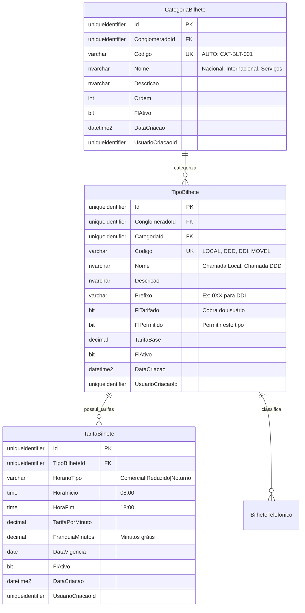

# MD-RF058 - Modelo de Dados - Gestão de Tipos de Bilhetes

**Versão:** 1.0
**Data:** 2025-12-18
**Responsável:** Arquiteto IControlIT
**RF Relacionado:** RF058 - Gestão de Tipos de Bilhetes (Pendente - MD criado baseado em contexto)

---

## 1. Visão Geral

Este documento especifica o modelo de dados para **Gestão de Tipos de Bilhetes Telefônicos**, permitindo catalogar e configurar tipos de chamadas, regras de tarifação e classificação para análise de custos telecom.

###1.1. Objetivo do Modelo

- **Catalogação de tipos de chamadas** (local, DDD, DDI, móvel, fixo, 0800, etc.)
- **Regras de tarifação** por tipo de bilhete
- **Classificação hierárquica** (Categoria → Subcategoria → Tipo)
- **Integração com importação de faturas** (RF039)
- **Custeio automático** baseado em regras configuradas

### 1.2. Principais Entidades

| Entidade | Descrição | Tipo |
|----------|-----------|------|
| `TipoBilhete` | Tipos de chamadas telefônicas | Mestre |
| `CategoriaBilhete` | Categorias de bilhetes (Nacional, Internacional, Serviços) | Mestre |
| `TarifaBilhete` | Tabela de tarifas por tipo e horário | Configuração |

---

## 2. Diagrama ER (Entidade-Relacionamento)



---

## 3. DDL Completo (SQL Server)

### 3.1. CategoriaBilhete

```sql
CREATE TABLE CategoriaBilhete (
    Id UNIQUEIDENTIFIER PRIMARY KEY DEFAULT NEWID(),
    ClienteId UNIQUEIDENTIFIER NOT NULL,
    Codigo VARCHAR(20) NOT NULL,
    Nome NVARCHAR(100) NOT NULL,
    Descricao NVARCHAR(300) NULL,
    Ordem INT NOT NULL DEFAULT 0,
    FlFlExcluido BIT NOT NULL DEFAULT 0,
    DataCriacao DATETIME2 NOT NULL DEFAULT GETDATE(),
    UsuarioCriacaoId UNIQUEIDENTIFIER NOT NULL,
    DataAlteracao DATETIME2 NULL,
    UsuarioAlteracaoId UNIQUEIDENTIFIER NULL,

    CONSTRAINT FK_CategoriaBilhete_Conglomerado
        FOREIGN KEY (ClienteId) REFERENCES Cliente(Id),
    CONSTRAINT UQ_CategoriaBilhete_Codigo
        UNIQUE (ConglomeradoId, Codigo)
);

-- Seed Data
INSERT INTO CategoriaBilhete (ConglomeradoId, Codigo, Nome, Ordem, FlAtivo, DataCriacao, UsuarioCriacaoId)
VALUES
    (@ConglomeradoId, 'CAT-BLT-001', 'Nacional', 1, 1, GETDATE(), @UsuarioSistemaId),
    (@ConglomeradoId, 'CAT-BLT-002', 'Internacional', 2, 1, GETDATE(), @UsuarioSistemaId),
    (@ConglomeradoId, 'CAT-BLT-003', 'Serviços Especiais', 3, 1, GETDATE(), @UsuarioSistemaId),
    (@ConglomeradoId, 'CAT-BLT-004', 'Dados/Internet', 4, 1, GETDATE(), @UsuarioSistemaId);
```

### 3.2. TipoBilhete

```sql
CREATE TABLE TipoBilhete (
    Id UNIQUEIDENTIFIER PRIMARY KEY DEFAULT NEWID(),
    ClienteId UNIQUEIDENTIFIER NOT NULL,
    CategoriaId UNIQUEIDENTIFIER NOT NULL,
    Codigo VARCHAR(20) NOT NULL,
    Nome NVARCHAR(100) NOT NULL,
    Descricao NVARCHAR(300) NULL,
    Prefixo VARCHAR(10) NULL,
    FlTarifado BIT NOT NULL DEFAULT 1,
    FlPermitido BIT NOT NULL DEFAULT 1,
    TarifaBase DECIMAL(10,4) NULL,
    FlFlExcluido BIT NOT NULL DEFAULT 0,
    DataCriacao DATETIME2 NOT NULL DEFAULT GETDATE(),
    UsuarioCriacaoId UNIQUEIDENTIFIER NOT NULL,
    DataAlteracao DATETIME2 NULL,
    UsuarioAlteracaoId UNIQUEIDENTIFIER NULL,

    CONSTRAINT FK_TipoBilhete_Conglomerado
        FOREIGN KEY (ClienteId) REFERENCES Cliente(Id),
    CONSTRAINT FK_TipoBilhete_Categoria
        FOREIGN KEY (CategoriaId) REFERENCES CategoriaBilhete(Id),
    CONSTRAINT UQ_TipoBilhete_Codigo
        UNIQUE (ConglomeradoId, Codigo)
);

-- Índices
CREATE INDEX IX_TipoBilhete_CategoriaId ON TipoBilhete(CategoriaId);
CREATE INDEX IX_TipoBilhete_FlAtivo ON TipoBilhete(FlAtivo) WHERE FlAtivo = 1;

-- Seed Data (Nacional)
DECLARE @NacionalId UNIQUEIDENTIFIER = (SELECT Id FROM CategoriaBilhete WHERE Codigo = 'CAT-BLT-001');

INSERT INTO TipoBilhete (ConglomeradoId, CategoriaId, Codigo, Nome, Descricao, TarifaBase, FlAtivo, DataCriacao, UsuarioCriacaoId)
VALUES
    (@ConglomeradoId, @NacionalId, 'LOCAL', 'Chamada Local', 'Chamadas dentro da mesma área local', 0.20, 1, GETDATE(), @UsuarioSistemaId),
    (@ConglomeradoId, @NacionalId, 'DDD', 'Chamada DDD', 'Chamadas entre diferentes DDDs nacionais', 1.50, 1, GETDATE(), @UsuarioSistemaId),
    (@ConglomeradoId, @NacionalId, 'MOVEL', 'Chamada para Móvel', 'Chamadas para telefones móveis', 1.80, 1, GETDATE(), @UsuarioSistemaId),
    (@ConglomeradoId, @NacionalId, '0800', 'Ligação 0800', 'Ligações gratuitas 0800', 0.00, 1, GETDATE(), @UsuarioSistemaId);

-- Seed Data (Internacional)
DECLARE @InternacionalId UNIQUEIDENTIFIER = (SELECT Id FROM CategoriaBilhete WHERE Codigo = 'CAT-BLT-002');

INSERT INTO TipoBilhete (ConglomeradoId, CategoriaId, Codigo, Nome, Descricao, Prefixo, TarifaBase, FlAtivo, DataCriacao, UsuarioCriacaoId)
VALUES
    (@ConglomeradoId, @InternacionalId, 'DDI-USA', 'DDI Estados Unidos', 'Chamadas internacionais EUA/Canadá', '001', 3.50, 1, GETDATE(), @UsuarioSistemaId),
    (@ConglomeradoId, @InternacionalId, 'DDI-EUR', 'DDI Europa', 'Chamadas internacionais Europa', '00', 5.80, 1, GETDATE(), @UsuarioSistemaId),
    (@ConglomeradoId, @InternacionalId, 'DDI-ASIA', 'DDI Ásia', 'Chamadas internacionais Ásia', '00', 7.20, 1, GETDATE(), @UsuarioSistemaId);
```

### 3.3. TarifaBilhete

```sql
CREATE TABLE TarifaBilhete (
    Id UNIQUEIDENTIFIER PRIMARY KEY DEFAULT NEWID(),
    TipoBilheteId UNIQUEIDENTIFIER NOT NULL,
    HorarioTipo VARCHAR(20) NOT NULL, -- Comercial | Reduzido | Noturno
    HoraInicio TIME NOT NULL,
    HoraFim TIME NOT NULL,
    TarifaPorMinuto DECIMAL(10,4) NOT NULL,
    FranquiaMinutos INT NOT NULL DEFAULT 0,
    DataVigencia DATE NOT NULL,
    FlFlExcluido BIT NOT NULL DEFAULT 0,
    DataCriacao DATETIME2 NOT NULL DEFAULT GETDATE(),
    UsuarioCriacaoId UNIQUEIDENTIFIER NOT NULL,

    CONSTRAINT FK_TarifaBilhete_TipoBilhete
        FOREIGN KEY (TipoBilheteId) REFERENCES TipoBilhete(Id),
    CONSTRAINT CK_TarifaBilhete_HorarioTipo
        CHECK (HorarioTipo IN ('Comercial', 'Reduzido', 'Noturno')),
    CONSTRAINT CK_TarifaBilhete_TarifaPorMinuto
        CHECK (TarifaPorMinuto >= 0)
);

-- Índices
CREATE INDEX IX_TarifaBilhete_TipoBilheteId ON TarifaBilhete(TipoBilheteId);
CREATE INDEX IX_TarifaBilhete_DataVigencia ON TarifaBilhete(DataVigencia DESC);

-- Seed Data (Tarifas DDD)
DECLARE @TipoDDDId UNIQUEIDENTIFIER = (SELECT Id FROM TipoBilhete WHERE Codigo = 'DDD');

INSERT INTO TarifaBilhete (TipoBilheteId, HorarioTipo, HoraInicio, HoraFim, TarifaPorMinuto, DataVigencia, FlAtivo, DataCriacao, UsuarioCriacaoId)
VALUES
    (@TipoDDDId, 'Comercial', '08:00', '18:00', 1.50, '2025-01-01', 1, GETDATE(), @UsuarioSistemaId),
    (@TipoDDDId, 'Reduzido', '18:00', '22:00', 1.20, '2025-01-01', 1, GETDATE(), @UsuarioSistemaId),
    (@TipoDDDId, 'Noturno', '22:00', '08:00', 0.80, '2025-01-01', 1, GETDATE(), @UsuarioSistemaId);
```

---

## 4. Regras de Negócio

### RN001: Hierarquia de Classificação
- Categoria → TipoBilhete → Tarifas por Horário

### RN002: Tarifação Automática
- Ao importar bilhete, identificar tipo por prefixo/destino
- Aplicar tarifa vigente baseada em horário da chamada

### RN003: Franquia de Minutos
- Se FranquiaMinutos > 0, primeiros N minutos não são cobrados

### RN004: Vigência de Tarifas
- Tarifa válida a partir de DataVigencia
- Manter histórico de tarifas antigas para auditoria

---

## 5. Integrações

### 5.1. RF039 - Gestão de Bilhetes
- `BilheteTelefonico.TipoBilheteId` → `TipoBilhete.Id`
- Cálculo automático de custo baseado em tarifas

### 5.2. Importação de Faturas
- Parser identifica tipo de chamada por código/prefixo
- Mapeia para `TipoBilhete` correspondente

---

## 6. Próximos Passos

1. **Developer:** Implementar CRUD de Tipos de Bilhetes
2. **Developer:** Criar função de cálculo automático de tarifa
3. **Tester:** Validar classificação automática de bilhetes importados

---

**Documento aprovado para implementação.**
