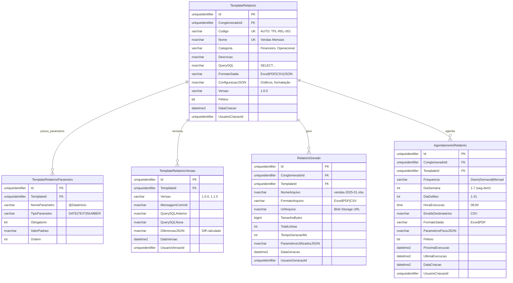

# MD-RF065 - Modelo de Dados - Templates de Relatórios (Excel/PDF)

**Versão:** 1.0
**Data:** 2025-12-18
**Responsável:** Arquiteto IControlIT
**RF Relacionado:** [RF065 - Templates de Relatórios Excel/PDF](./RF065.md)

---

## 1. Visão Geral

Este documento especifica o modelo de dados para **Templates de Relatórios**, permitindo criar, configurar e gerar relatórios customizáveis em Excel, PDF e CSV com queries SQL dinâmicas, gráficos, formatação condicional e agendamento automático.

### 1.1. Objetivo do Modelo

- **Templates reutilizáveis** com queries SQL parametrizadas
- **Geração multi-formato** (Excel, PDF, CSV, JSON)
- **Gráficos dinâmicos** (Chart.js integrado)
- **Formatação condicional** (semáforos, cores)
- **Agendamento automático** via Hangfire
- **Versionamento** de templates com diff
- **Histórico de gerações** para auditoria

### 1.2. Principais Entidades

| Entidade | Descrição | Tipo |
|----------|-----------|------|
| `TemplateRelatorio` | Templates de relatórios configuráveis | Mestre |
| `TemplateRelatorioParametro` | Parâmetros dinâmicos da query SQL | Configuração |
| `TemplateRelatorioVersao` | Histórico de versões do template | Auditoria |
| `RelatorioGerado` | Histórico de relatórios gerados | Auditoria |
| `AgendamentoRelatorio` | Agendamentos para geração automática | Configuração |

---

## 2. Diagrama ER (Entidade-Relacionamento)



---

## 3. DDL Completo (SQL Server)

### 3.1. TemplateRelatorio

```sql
CREATE TABLE TemplateRelatorio (
    Id UNIQUEIDENTIFIER PRIMARY KEY DEFAULT NEWID(),
    ClienteId UNIQUEIDENTIFIER NOT NULL,
    Codigo VARCHAR(20) NOT NULL,
    Nome NVARCHAR(150) NOT NULL,
    Categoria VARCHAR(50) NULL, -- Financeiro, Operacional, Gerencial
    Descricao NVARCHAR(500) NULL,
    QuerySQL NVARCHAR(MAX) NOT NULL,
    FormatoSaida VARCHAR(20) NOT NULL DEFAULT 'Excel', -- Excel | PDF | CSV | JSON
    ConfiguracaoJSON NVARCHAR(MAX) NULL, -- Gráficos, formatação condicional, layout
    Versao VARCHAR(20) NOT NULL DEFAULT '1.0.0',
    FlFlExcluido BIT NOT NULL DEFAULT 0,

    -- Auditoria
    DataCriacao DATETIME2 NOT NULL DEFAULT GETDATE(),
    UsuarioCriacaoId UNIQUEIDENTIFIER NOT NULL,
    DataAlteracao DATETIME2 NULL,
    UsuarioAlteracaoId UNIQUEIDENTIFIER NULL,

    -- Constraints
    CONSTRAINT FK_TemplateRelatorio_Conglomerado
        FOREIGN KEY (ClienteId) REFERENCES Cliente(Id),
    CONSTRAINT UQ_TemplateRelatorio_Codigo
        UNIQUE (ConglomeradoId, Codigo),
    CONSTRAINT UQ_TemplateRelatorio_Nome
        UNIQUE (ConglomeradoId, Nome),
    CONSTRAINT CK_TemplateRelatorio_FormatoSaida
        CHECK (FormatoSaida IN ('Excel', 'PDF', 'CSV', 'JSON')),
    CONSTRAINT CK_TemplateRelatorio_QuerySQL
        CHECK (QuerySQL LIKE 'SELECT%'), -- Apenas SELECT permitido
    CONSTRAINT CK_TemplateRelatorio_ConfiguracaoJSON
        CHECK (ConfiguracaoJSON IS NULL OR ISJSON(ConfiguracaoJSON) = 1)
);

-- Índices
CREATE INDEX IX_TemplateRelatorio_ConglomeradoId ON TemplateRelatorio(ConglomeradoId);
CREATE INDEX IX_TemplateRelatorio_Categoria ON TemplateRelatorio(Categoria);
CREATE INDEX IX_TemplateRelatorio_FlAtivo ON TemplateRelatorio(FlAtivo) WHERE FlAtivo = 1;
```

### 3.2. TemplateRelatorioParametro

```sql
CREATE TABLE TemplateRelatorioParametro (
    Id UNIQUEIDENTIFIER PRIMARY KEY DEFAULT NEWID(),
    TemplateId UNIQUEIDENTIFIER NOT NULL,
    NomeParametro VARCHAR(50) NOT NULL, -- @DataInicio, @CentroCustoId
    TipoParametro VARCHAR(20) NOT NULL, -- DATE | TEXT | NUMBER | SELECT | BOOLEAN
    Obrigatorio BIT NOT NULL DEFAULT 0,
    ValorPadrao NVARCHAR(100) NULL,
    OpcoesSelectJSON NVARCHAR(MAX) NULL, -- Para tipo SELECT: lista de opções
    Ordem INT NOT NULL DEFAULT 0,

    -- Constraints
    CONSTRAINT FK_TemplateRelatorioParametro_Template
        FOREIGN KEY (TemplateId) REFERENCES TemplateRelatorio(Id) ON DELETE CASCADE,
    CONSTRAINT CK_TemplateRelatorioParametro_TipoParametro
        CHECK (TipoParametro IN ('DATE', 'TEXT', 'NUMBER', 'SELECT', 'BOOLEAN')),
    CONSTRAINT CK_TemplateRelatorioParametro_OpcoesSelectJSON
        CHECK (OpcoesSelectJSON IS NULL OR ISJSON(OpcoesSelectJSON) = 1)
);

-- Índices
CREATE INDEX IX_TemplateRelatorioParametro_TemplateId ON TemplateRelatorioParametro(TemplateId);
CREATE INDEX IX_TemplateRelatorioParametro_Ordem ON TemplateRelatorioParametro(TemplateId, Ordem);
```

### 3.3. TemplateRelatorioVersao

```sql
CREATE TABLE TemplateRelatorioVersao (
    Id UNIQUEIDENTIFIER PRIMARY KEY DEFAULT NEWID(),
    TemplateId UNIQUEIDENTIFIER NOT NULL,
    Versao VARCHAR(20) NOT NULL, -- 1.0.0, 1.1.0, 2.0.0
    MensagemCommit NVARCHAR(500) NOT NULL,
    QuerySQLAnterior NVARCHAR(MAX) NULL,
    QuerySQLNova NVARCHAR(MAX) NOT NULL,
    ConfiguracaoJSONAnterior NVARCHAR(MAX) NULL,
    ConfiguracaoJSONNova NVARCHAR(MAX) NULL,
    DiferencasJSON NVARCHAR(MAX) NULL, -- Diff gerado automaticamente
    DataVersao DATETIME2 NOT NULL DEFAULT GETDATE(),
    UsuarioVersaoId UNIQUEIDENTIFIER NOT NULL,

    -- Constraints
    CONSTRAINT FK_TemplateRelatorioVersao_Template
        FOREIGN KEY (TemplateId) REFERENCES TemplateRelatorio(Id) ON DELETE CASCADE,
    CONSTRAINT FK_TemplateRelatorioVersao_Usuario
        FOREIGN KEY (UsuarioVersaoId) REFERENCES Usuario(Id),
    CONSTRAINT UQ_TemplateRelatorioVersao_Versao
        UNIQUE (TemplateId, Versao)
);

-- Índices
CREATE INDEX IX_TemplateRelatorioVersao_TemplateId ON TemplateRelatorioVersao(TemplateId);
CREATE INDEX IX_TemplateRelatorioVersao_DataVersao ON TemplateRelatorioVersao(DataVersao DESC);
```

### 3.4. RelatorioGerado

```sql
CREATE TABLE RelatorioGerado (
    Id UNIQUEIDENTIFIER PRIMARY KEY DEFAULT NEWID(),
    ClienteId UNIQUEIDENTIFIER NOT NULL,
    TemplateId UNIQUEIDENTIFIER NOT NULL,
    NomeArquivo NVARCHAR(200) NOT NULL,
    FormatoArquivo VARCHAR(20) NOT NULL,
    UrlArquivo NVARCHAR(500) NULL, -- Azure Blob Storage URL
    TamanhoBytes BIGINT NULL,
    TotalLinhas INT NULL,
    TempoGeracaoMs INT NULL,
    ParametrosUtilizadosJSON NVARCHAR(MAX) NULL,
    DataGeracao DATETIME2 NOT NULL DEFAULT GETDATE(),
    UsuarioGeracaoId UNIQUEIDENTIFIER NULL, -- NULL se automático (agendamento)

    -- Constraints
    CONSTRAINT FK_RelatorioGerado_Conglomerado
        FOREIGN KEY (ClienteId) REFERENCES Cliente(Id),
    CONSTRAINT FK_RelatorioGerado_Template
        FOREIGN KEY (TemplateId) REFERENCES TemplateRelatorio(Id),
    CONSTRAINT FK_RelatorioGerado_Usuario
        FOREIGN KEY (UsuarioGeracaoId) REFERENCES Usuario(Id),
    CONSTRAINT CK_RelatorioGerado_FormatoArquivo
        CHECK (FormatoArquivo IN ('Excel', 'PDF', 'CSV', 'JSON'))
);

-- Índices
CREATE INDEX IX_RelatorioGerado_ConglomeradoId ON RelatorioGerado(ConglomeradoId);
CREATE INDEX IX_RelatorioGerado_TemplateId ON RelatorioGerado(TemplateId);
CREATE INDEX IX_RelatorioGerado_DataGeracao ON RelatorioGerado(DataGeracao DESC);
CREATE INDEX IX_RelatorioGerado_UsuarioGeracaoId ON RelatorioGerado(UsuarioGeracaoId) WHERE UsuarioGeracaoId IS NOT NULL;
```

### 3.5. AgendamentoRelatorio

```sql
CREATE TABLE AgendamentoRelatorio (
    Id UNIQUEIDENTIFIER PRIMARY KEY DEFAULT NEWID(),
    ClienteId UNIQUEIDENTIFIER NOT NULL,
    TemplateId UNIQUEIDENTIFIER NOT NULL,
    Frequencia VARCHAR(20) NOT NULL, -- Diario | Semanal | Mensal
    DiaSemana INT NULL, -- 1-7 (seg-dom) se Semanal
    DiaDoMes INT NULL, -- 1-31 se Mensal
    HoraExecucao TIME NOT NULL,
    EmailsDestinatarios NVARCHAR(MAX) NOT NULL, -- CSV: email1@empresa.com,email2@empresa.com
    FormatoSaida VARCHAR(20) NOT NULL DEFAULT 'Excel',
    ParametrosFixosJSON NVARCHAR(MAX) NULL, -- Parâmetros pré-definidos
    FlFlExcluido BIT NOT NULL DEFAULT 0,
    ProximaExecucao DATETIME2 NULL,
    UltimaExecucao DATETIME2 NULL,

    -- Auditoria
    DataCriacao DATETIME2 NOT NULL DEFAULT GETDATE(),
    UsuarioCriacaoId UNIQUEIDENTIFIER NOT NULL,
    DataAlteracao DATETIME2 NULL,
    UsuarioAlteracaoId UNIQUEIDENTIFIER NULL,

    -- Constraints
    CONSTRAINT FK_AgendamentoRelatorio_Conglomerado
        FOREIGN KEY (ClienteId) REFERENCES Cliente(Id),
    CONSTRAINT FK_AgendamentoRelatorio_Template
        FOREIGN KEY (TemplateId) REFERENCES TemplateRelatorio(Id),
    CONSTRAINT CK_AgendamentoRelatorio_Frequencia
        CHECK (Frequencia IN ('Diario', 'Semanal', 'Mensal')),
    CONSTRAINT CK_AgendamentoRelatorio_DiaSemana
        CHECK (DiaSemana IS NULL OR (DiaSemana BETWEEN 1 AND 7)),
    CONSTRAINT CK_AgendamentoRelatorio_DiaDoMes
        CHECK (DiaDoMes IS NULL OR (DiaDoMes BETWEEN 1 AND 31)),
    CONSTRAINT CK_AgendamentoRelatorio_FormatoSaida
        CHECK (FormatoSaida IN ('Excel', 'PDF', 'CSV'))
);

-- Índices
CREATE INDEX IX_AgendamentoRelatorio_ConglomeradoId ON AgendamentoRelatorio(ConglomeradoId);
CREATE INDEX IX_AgendamentoRelatorio_TemplateId ON AgendamentoRelatorio(TemplateId);
CREATE INDEX IX_AgendamentoRelatorio_ProximaExecucao ON AgendamentoRelatorio(ProximaExecucao) WHERE FlAtivo = 1;
CREATE INDEX IX_AgendamentoRelatorio_FlAtivo ON AgendamentoRelatorio(FlAtivo) WHERE FlAtivo = 1;
```

---

## 4. Regras de Negócio Implementadas

### RN001: Query SQL Validada
- **Descrição:** Apenas queries SELECT são permitidas (constraint)
- **Validação:** Application layer valida sintaxe SQL antes de salvar

### RN002: Versionamento Automático
- **Descrição:** Toda alteração em QuerySQL ou ConfiguracaoJSON gera nova versão
- **Implementação:** Trigger ou Command Handler calcula diff e insere em TemplateRelatorioVersao

### RN003: Agendamento com Hangfire
- **Descrição:** Job recorrente verifica AgendamentoRelatorio.ProximaExecucao
- **Frequência:** A cada 15 minutos
- **Ação:** Gera relatório e envia por email

### RN004: Formatos Suportados
- **Excel:** EPPlus (formatação rica, gráficos, múltiplas abas)
- **PDF:** QuestPDF (cabeçalho, rodapé, marca d'água)
- **CSV:** Simples, sem formatação
- **JSON:** Para integração com APIs

### RN005: ConfiguracaoJSON Estrutura
```json
{
  "graficos": [
    {
      "tipo": "Bar",
      "eixoX": "Mes",
      "eixoY": "TotalVendas",
      "titulo": "Vendas Mensais 2025",
      "cores": ["#4CAF50", "#2196F3"]
    }
  ],
  "formatacaoCondicional": [
    {
      "coluna": "Status",
      "regra": "equals",
      "valor": "Atrasado",
      "corFundo": "#FF0000",
      "corTexto": "#FFFFFF"
    }
  ],
  "layout": {
    "cabecalho": "Relatório Confidencial - {{empresa}}",
    "rodape": "Página {{pagina}} de {{totalPaginas}}",
    "marcaDagua": "CONFIDENCIAL"
  }
}
```

---

## 5. Stored Procedures

### 5.1. sp_TemplateRelatorioGerarVersao

```sql
CREATE PROCEDURE sp_TemplateRelatorioGerarVersao
    @TemplateId UNIQUEIDENTIFIER,
    @QuerySQLNova NVARCHAR(MAX),
    @ConfiguracaoJSONNova NVARCHAR(MAX),
    @MensagemCommit NVARCHAR(500),
    @UsuarioId UNIQUEIDENTIFIER
AS
BEGIN
    DECLARE @VersaoAtual VARCHAR(20);
    DECLARE @NovaVersao VARCHAR(20);
    DECLARE @QuerySQLAnterior NVARCHAR(MAX);
    DECLARE @ConfiguracaoJSONAnterior NVARCHAR(MAX);

    -- Obter versão atual
    SELECT @VersaoAtual = Versao,
           @QuerySQLAnterior = QuerySQL,
           @ConfiguracaoJSONAnterior = ConfiguracaoJSON
    FROM TemplateRelatorio
    WHERE Id = @TemplateId;

    -- Incrementar versão (simplificado: 1.0.0 → 1.1.0)
    SET @NovaVersao = CONCAT(
        SUBSTRING(@VersaoAtual, 1, CHARINDEX('.', @VersaoAtual) - 1),
        '.',
        CAST(CAST(SUBSTRING(@VersaoAtual, CHARINDEX('.', @VersaoAtual) + 1, 1) AS INT) + 1 AS VARCHAR),
        '.0'
    );

    -- Inserir versão
    INSERT INTO TemplateRelatorioVersao (
        TemplateId, Versao, MensagemCommit,
        QuerySQLAnterior, QuerySQLNova,
        ConfiguracaoJSONAnterior, ConfiguracaoJSONNova,
        UsuarioVersaoId
    )
    VALUES (
        @TemplateId, @NovaVersao, @MensagemCommit,
        @QuerySQLAnterior, @QuerySQLNova,
        @ConfiguracaoJSONAnterior, @ConfiguracaoJSONNova,
        @UsuarioId
    );

    -- Atualizar template
    UPDATE TemplateRelatorio
    SET QuerySQL = @QuerySQLNova,
        ConfiguracaoJSON = @ConfiguracaoJSONNova,
        Versao = @NovaVersao,
        DataAlteracao = GETDATE(),
        UsuarioAlteracaoId = @UsuarioId
    WHERE Id = @TemplateId;

    RETURN 0;
END;
GO
```

---

## 6. Jobs Automatizados (Hangfire)

### 6.1. ProcessarAgendamentosRelatorio

```csharp
[RecurringJob("*/15 * * * *")] // A cada 15 minutos
public async Task ProcessarAgendamentosRelatorio()
{
    var agora = DateTime.Now;

    var agendamentos = await _context.AgendamentoRelatorio
        .Where(x => x.FlAtivo && x.ProximaExecucao <= agora)
        .Include(x => x.Template)
        .ToListAsync();

    foreach (var agendamento in agendamentos)
    {
        try
        {
            // Gerar relatório
            var parametros = JsonSerializer.Deserialize<Dictionary<string, object>>(agendamento.ParametrosFixosJSON);
            var relatorio = await _relatorioService.GerarRelatorio(
                agendamento.TemplateId,
                agendamento.FormatoSaida,
                parametros
            );

            // Enviar por email
            await _emailService.EnviarRelatorio(
                agendamento.EmailsDestinatarios.Split(','),
                agendamento.Template.Nome,
                relatorio
            );

            // Atualizar próxima execução
            agendamento.UltimaExecucao = agora;
            agendamento.ProximaExecucao = CalcularProximaExecucao(agendamento);
            await _context.SaveChangesAsync();
        }
        catch (Exception ex)
        {
            _logger.LogError(ex, "Erro ao processar agendamento {Id}", agendamento.Id);
        }
    }
}
```

---

## 7. Integrações

### 7.1. Azure Blob Storage
- **Objetivo:** Armazenar arquivos Excel/PDF gerados
- **Naming:** `relatorios/{conglomeradoId}/{ano}/{mes}/{nomeArquivo}.xlsx`
- **Retention:** 90 dias (configurável)

### 7.2. EPPlus (Excel)
- Geração de planilhas com formatação rica
- Gráficos Chart.js embarcados
- Múltiplas abas
- Proteção de planilha

### 7.3. QuestPDF (PDF)
- Cabeçalho e rodapé customizados
- Marca d'água
- Assinatura digital (opcional)
- Paginação automática

---

## 8. Próximos Passos

1. **Developer:** Implementar Commands/Queries CQRS
2. **Developer:** Integrar EPPlus e QuestPDF
3. **Developer:** Criar Hangfire Job de agendamento
4. **Tester:** Validar geração de Excel com 100k linhas (<30s)
5. **Tester:** Testar versionamento e diff de templates

---

**Documento aprovado para implementação.**
