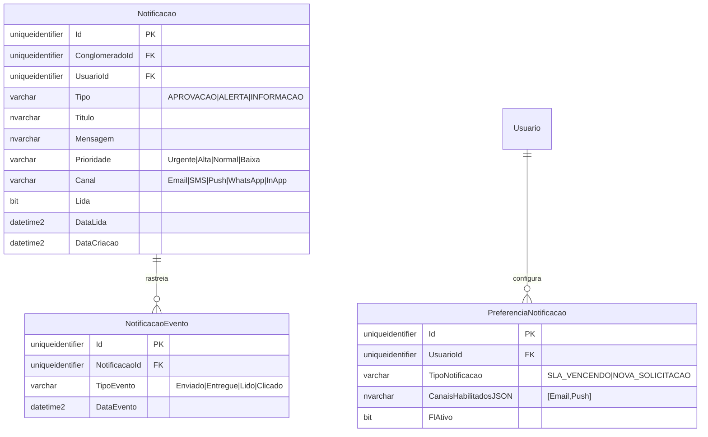

# MD-RF066 - Modelo de Dados - Notificações e Alertas

**Versão:** 1.0
**Data:** 2025-12-18
**Responsável:** Arquiteto IControlIT
**RF Relacionado:** [RF066 - Notificações e Alertas](./RF066.md)

---

## 1. Visão Geral

Modelo de dados para **Sistema Centralizado de Notificações Multi-Canal** (Email, SMS, Push, WhatsApp, In-App) com preferências de usuário, priorização, agrupamento inteligente e histórico completo.

### 1.1. Principais Entidades

| Entidade | Descrição |
|----------|-----------|
| `Notificacao` | Notificações enviadas aos usuários |
| `PreferenciaNotificacao` | Preferências do usuário por tipo e canal |
| `NotificacaoEvento` | Histórico de eventos (enviado, lido, clicado) |

---

## 2. Diagrama ER



---

## 3. DDL Completo

### 3.1. Notificacao

```sql
CREATE TABLE Notificacao (
    Id UNIQUEIDENTIFIER PRIMARY KEY DEFAULT NEWID(),
    ClienteId UNIQUEIDENTIFIER NOT NULL,
    UsuarioId UNIQUEIDENTIFIER NOT NULL,
    Tipo VARCHAR(30) NOT NULL,
    Titulo NVARCHAR(200) NOT NULL,
    Mensagem NVARCHAR(MAX) NOT NULL,
    Prioridade VARCHAR(20) NOT NULL DEFAULT 'Normal',
    Canal VARCHAR(20) NOT NULL,
    Lida BIT NOT NULL DEFAULT 0,
    DataLida DATETIME2 NULL,
    DataCriacao DATETIME2 NOT NULL DEFAULT GETDATE(),

    CONSTRAINT FK_Notificacao_Usuario FOREIGN KEY (UsuarioId) REFERENCES Usuario(Id),
    CONSTRAINT CK_Notificacao_Prioridade CHECK (Prioridade IN ('Urgente', 'Alta', 'Normal', 'Baixa')),
    CONSTRAINT CK_Notificacao_Canal CHECK (Canal IN ('Email', 'SMS', 'Push', 'WhatsApp', 'InApp'))
);

CREATE INDEX IX_Notificacao_UsuarioId ON Notificacao(UsuarioId);
CREATE INDEX IX_Notificacao_Lida ON Notificacao(Lida) WHERE Lida = 0;
```

### 3.2. PreferenciaNotificacao

```sql
CREATE TABLE PreferenciaNotificacao (
    Id UNIQUEIDENTIFIER PRIMARY KEY DEFAULT NEWID(),
    UsuarioId UNIQUEIDENTIFIER NOT NULL,
    TipoNotificacao VARCHAR(50) NOT NULL,
    CanaisHabilitadosJSON NVARCHAR(MAX) NOT NULL DEFAULT '["Email"]',
    FlFlExcluido BIT NOT NULL DEFAULT 0,

    CONSTRAINT FK_PreferenciaNotificacao_Usuario FOREIGN KEY (UsuarioId) REFERENCES Usuario(Id),
    CONSTRAINT UQ_PreferenciaNotificacao UNIQUE (UsuarioId, TipoNotificacao),
    CONSTRAINT CK_PreferenciaNotificacao_JSON CHECK (ISJSON(CanaisHabilitadosJSON) = 1)
);
```

### 3.3. NotificacaoEvento

```sql
CREATE TABLE NotificacaoEvento (
    Id UNIQUEIDENTIFIER PRIMARY KEY DEFAULT NEWID(),
    NotificacaoId UNIQUEIDENTIFIER NOT NULL,
    TipoEvento VARCHAR(20) NOT NULL,
    DataEvento DATETIME2 NOT NULL DEFAULT GETDATE(),

    CONSTRAINT FK_NotificacaoEvento_Notificacao FOREIGN KEY (NotificacaoId) REFERENCES Notificacao(Id) ON DELETE CASCADE,
    CONSTRAINT CK_NotificacaoEvento_TipoEvento CHECK (TipoEvento IN ('Enviado', 'Entregue', 'Lido', 'Clicado'))
);

CREATE INDEX IX_NotificacaoEvento_NotificacaoId ON NotificacaoEvento(NotificacaoId);
```

---

## 4. Regras de Negócio

**RN001:** Quiet Hours - Notificações não urgentes não enviadas entre 22h-8h
**RN002:** Agrupamento - Mais de 5 notificações do mesmo tipo em 30min são agrupadas
**RN003:** Preferência Padrão - Se usuário não configurou, usar apenas Email

---

**Documento aprovado para implementação.**
