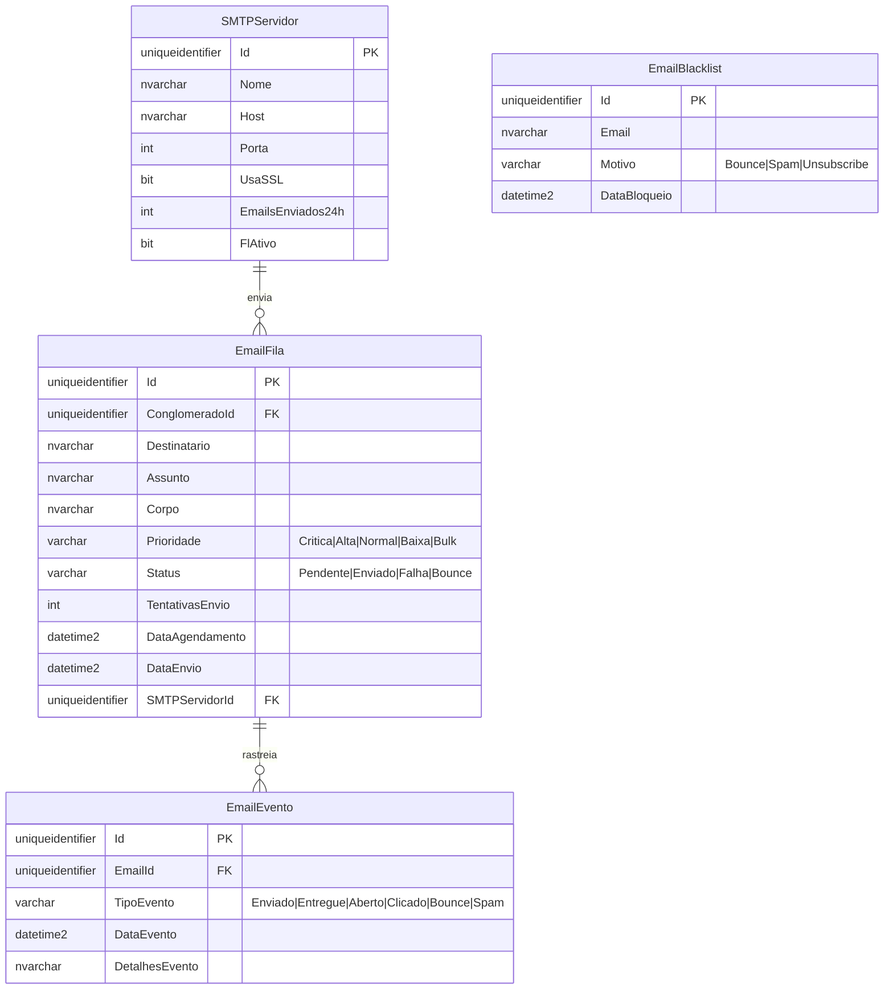

# MD-RF067 - Modelo de Dados - Central de Emails

**Versão:** 1.0
**Data:** 2025-12-18
**Responsável:** Arquiteto IControlIT
**RF Relacionado:** [RF067 - Central de Emails](./RF067.md)

---

## 1. Visão Geral

Modelo de dados para **Central de Gestão de Emails** com filas de prioridade, retry automático, rastreamento completo (entrega, abertura, cliques, bounces), SMTP pools e compliance LGPD.

### 1.1. Principais Entidades

| Entidade | Descrição |
|----------|-----------|
| `EmailFila` | Fila de emails a serem enviados |
| `EmailEvento` | Histórico de eventos do email |
| `SMTPServidor` | Servidores SMTP disponíveis |
| `EmailBlacklist` | Emails bloqueados (bounces, spam) |

---

## 2. Diagrama ER



---

## 3. DDL Completo

### 3.1. EmailFila

```sql
CREATE TABLE EmailFila (
    Id UNIQUEIDENTIFIER PRIMARY KEY DEFAULT NEWID(),
    ClienteId UNIQUEIDENTIFIER NOT NULL,
    Destinatario NVARCHAR(200) NOT NULL,
    Assunto NVARCHAR(300) NOT NULL,
    Corpo NVARCHAR(MAX) NOT NULL,
    Prioridade VARCHAR(20) NOT NULL DEFAULT 'Normal',
    Status VARCHAR(20) NOT NULL DEFAULT 'Pendente',
    TentativasEnvio INT NOT NULL DEFAULT 0,
    DataAgendamento DATETIME2 NOT NULL DEFAULT GETDATE(),
    DataEnvio DATETIME2 NULL,
    SMTPServidorId UNIQUEIDENTIFIER NULL,

    CONSTRAINT FK_EmailFila_SMTPServidor FOREIGN KEY (SMTPServidorId) REFERENCES SMTPServidor(Id),
    CONSTRAINT CK_EmailFila_Prioridade CHECK (Prioridade IN ('Critica', 'Alta', 'Normal', 'Baixa', 'Bulk')),
    CONSTRAINT CK_EmailFila_Status CHECK (Status IN ('Pendente', 'Enviado', 'Falha', 'Bounce'))
);

CREATE INDEX IX_EmailFila_Status ON EmailFila(Status) WHERE Status = 'Pendente';
CREATE INDEX IX_EmailFila_Prioridade ON EmailFila(Prioridade, DataAgendamento);
```

### 3.2. EmailEvento

```sql
CREATE TABLE EmailEvento (
    Id UNIQUEIDENTIFIER PRIMARY KEY DEFAULT NEWID(),
    EmailId UNIQUEIDENTIFIER NOT NULL,
    TipoEvento VARCHAR(20) NOT NULL,
    DataEvento DATETIME2 NOT NULL DEFAULT GETDATE(),
    DetalhesEvento NVARCHAR(500) NULL,

    CONSTRAINT FK_EmailEvento_EmailFila FOREIGN KEY (EmailId) REFERENCES EmailFila(Id) ON DELETE CASCADE,
    CONSTRAINT CK_EmailEvento_TipoEvento CHECK (TipoEvento IN ('Enviado', 'Entregue', 'Aberto', 'Clicado', 'Bounce', 'Spam', 'Unsubscribe'))
);

CREATE INDEX IX_EmailEvento_EmailId ON EmailEvento(EmailId);
```

### 3.3. SMTPServidor

```sql
CREATE TABLE SMTPServidor (
    Id UNIQUEIDENTIFIER PRIMARY KEY DEFAULT NEWID(),
    Nome NVARCHAR(100) NOT NULL,
    Host NVARCHAR(200) NOT NULL,
    Porta INT NOT NULL DEFAULT 587,
    Usuario NVARCHAR(100) NULL,
    Senha NVARCHAR(200) NULL, -- Encrypted
    UsaSSL BIT NOT NULL DEFAULT 1,
    EmailsEnviados24h INT NOT NULL DEFAULT 0,
    LimiteEnvios24h INT NOT NULL DEFAULT 10000,
    FlFlExcluido BIT NOT NULL DEFAULT 0,
    DataCriacao DATETIME2 NOT NULL DEFAULT GETDATE()
);

CREATE INDEX IX_SMTPServidor_FlAtivo ON SMTPServidor(FlAtivo) WHERE FlAtivo = 1;
```

### 3.4. EmailBlacklist

```sql
CREATE TABLE EmailBlacklist (
    Id UNIQUEIDENTIFIER PRIMARY KEY DEFAULT NEWID(),
    Email NVARCHAR(200) NOT NULL UNIQUE,
    Motivo VARCHAR(20) NOT NULL,
    DataBloqueio DATETIME2 NOT NULL DEFAULT GETDATE(),

    CONSTRAINT CK_EmailBlacklist_Motivo CHECK (Motivo IN ('Bounce', 'Spam', 'Unsubscribe'))
);

CREATE UNIQUE INDEX UQ_EmailBlacklist_Email ON EmailBlacklist(Email);
```

---

## 4. Regras de Negócio

**RN001:** Retry Automático - Até 5 tentativas com backoff exponencial (2, 4, 8, 16, 32 min)
**RN002:** SMTP Pool - Selecionar servidor com menor uso (EmailsEnviados24h)
**RN003:** Blacklist Automática - Email com 3 bounces consecutivos vai para blacklist
**RN004:** Retenção - Histórico de 7 anos (compliance LGPD)

---

**Documento aprovado para implementação.**
