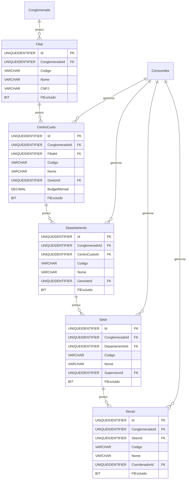

# Modelo de Dados - RF017

**Versão:** 1.0
**Data:** 2025-12-18
**RF Relacionado:** [RF017 - Hierarquia Corporativa](./RF017.md)
**Banco de Dados:** SQL Server (Produção) / SQLite (Desenvolvimento)

---

## 1. Diagrama de Entidades (Mermaid)



---

## 2. Entidades Principais

### 2.1 Tabela: Filial

**Descrição:** Filiais/Unidades de negócio do conglomerado.

#### Campos

| Campo | Tipo | Nulo | Default | Descrição |
|-------|------|------|---------|-----------|
| Id | UNIQUEIDENTIFIER | NÃO | NEWID() | Chave primária |
| ClienteId | UNIQUEIDENTIFIER | NÃO | - | FK multi-tenancy |
| Codigo | VARCHAR(50) | NÃO | - | Código único |
| Nome | VARCHAR(200) | NÃO | - | Razão social/Nome fantasia |
| CNPJ | VARCHAR(18) | SIM | NULL | CNPJ (formato: 00.000.000/0000-00) |
| InscricaoEstadual | VARCHAR(20) | SIM | NULL | IE |
| FlMatriz | BIT | NÃO | 0 | 1=Matriz, 0=Filial |
| Ativo | BIT | NÃO | true | Soft delete: false=ativo, true=excluído |
| DtCriacao | DATETIME | NÃO | GETDATE() | Data criação |
| UsuarioCriacao | UNIQUEIDENTIFIER | NÃO | - | Usuário criação |

---

### 2.2 Tabela: CentroCusto

**Descrição:** Centros de custo para alocação de despesas.

#### Campos

| Campo | Tipo | Nulo | Default | Descrição |
|-------|------|------|---------|-----------|
| Id | UNIQUEIDENTIFIER | NÃO | NEWID() | Chave primária |
| ClienteId | UNIQUEIDENTIFIER | NÃO | - | FK multi-tenancy |
| FilialId | UNIQUEIDENTIFIER | NÃO | - | FK para Filial |
| Codigo | VARCHAR(50) | NÃO | - | Código único (UPPER_SNAKE_CASE) |
| Nome | VARCHAR(120) | NÃO | - | Nome do centro de custo |
| Descricao | VARCHAR(500) | SIM | NULL | Descrição |
| GestorId | UNIQUEIDENTIFIER | SIM | NULL | FK para Consumidor (gestor) |
| BudgetMensal | DECIMAL(15,2) | SIM | NULL | Budget mensal (R$) |
| Ativo | BIT | NÃO | true | Soft delete: false=ativo, true=excluído |
| DtCriacao | DATETIME | NÃO | GETDATE() | Data criação |
| UsuarioCriacao | UNIQUEIDENTIFIER | NÃO | - | Usuário criação |
| DtAlteracao | DATETIME | SIM | NULL | Data alteração |
| UsuarioAlteracao | UNIQUEIDENTIFIER | SIM | NULL | Usuário alteração |

#### Constraints

```sql
CONSTRAINT UQ_CentroCusto_Codigo UNIQUE (ConglomeradoId, Codigo)
CONSTRAINT CK_CentroCusto_BudgetMensal CHECK (BudgetMensal IS NULL OR BudgetMensal > 0)
```

---

### 2.3 Tabela: Departamento

**Descrição:** Departamentos dentro de centros de custo.

#### Campos

| Campo | Tipo | Nulo | Default | Descrição |
|-------|------|------|---------|-----------|
| Id | UNIQUEIDENTIFIER | NÃO | NEWID() | Chave primária |
| ClienteId | UNIQUEIDENTIFIER | NÃO | - | FK multi-tenancy |
| CentroCustoId | UNIQUEIDENTIFIER | NÃO | - | FK para CentroCusto |
| Codigo | VARCHAR(50) | NÃO | - | Código único (UPPER_SNAKE_CASE) |
| Nome | VARCHAR(120) | NÃO | - | Nome do departamento |
| GerenteId | UNIQUEIDENTIFIER | SIM | NULL | FK para Consumidor (gerente) |
| Ativo | BIT | NÃO | true | Soft delete: false=ativo, true=excluído |
| DtCriacao | DATETIME | NÃO | GETDATE() | Data criação |
| UsuarioCriacao | UNIQUEIDENTIFIER | NÃO | - | Usuário criação |

#### Constraints

```sql
CONSTRAINT UQ_Departamento_Codigo UNIQUE (ConglomeradoId, Codigo)
```

---

### 2.4 Tabela: Setor

**Descrição:** Setores dentro de departamentos.

#### Campos

| Campo | Tipo | Nulo | Default | Descrição |
|-------|------|------|---------|-----------|
| Id | UNIQUEIDENTIFIER | NÃO | NEWID() | Chave primária |
| ClienteId | UNIQUEIDENTIFIER | NÃO | - | FK multi-tenancy |
| DepartamentoId | UNIQUEIDENTIFIER | NÃO | - | FK para Departamento |
| Codigo | VARCHAR(50) | NÃO | - | Código único |
| Nome | VARCHAR(120) | NÃO | - | Nome do setor |
| SupervisorId | UNIQUEIDENTIFIER | SIM | NULL | FK para Consumidor |
| Ativo | BIT | NÃO | true | Soft delete: false=ativo, true=excluído |
| DtCriacao | DATETIME | NÃO | GETDATE() | Data criação |
| UsuarioCriacao | UNIQUEIDENTIFIER | NÃO | - | Usuário criação |

---

### 2.5 Tabela: Secao

**Descrição:** Seções dentro de setores (nível mais granular).

#### Campos

| Campo | Tipo | Nulo | Default | Descrição |
|-------|------|------|---------|-----------|
| Id | UNIQUEIDENTIFIER | NÃO | NEWID() | Chave primária |
| ClienteId | UNIQUEIDENTIFIER | NÃO | - | FK multi-tenancy |
| SetorId | UNIQUEIDENTIFIER | NÃO | - | FK para Setor |
| Codigo | VARCHAR(50) | NÃO | - | Código único |
| Nome | VARCHAR(120) | NÃO | - | Nome da seção |
| CoordenadorId | UNIQUEIDENTIFIER | SIM | NULL | FK para Consumidor |
| Ativo | BIT | NÃO | true | Soft delete: false=ativo, true=excluído |
| DtCriacao | DATETIME | NÃO | GETDATE() | Data criação |
| UsuarioCriacao | UNIQUEIDENTIFIER | NÃO | - | Usuário criação |

---

## 3. DDL - SQL Server

```sql
-- Tabela: Filial
CREATE TABLE Filial (
    Id UNIQUEIDENTIFIER PRIMARY KEY DEFAULT NEWID(),
    ClienteId UNIQUEIDENTIFIER NOT NULL,
    Codigo VARCHAR(50) NOT NULL,
    Nome VARCHAR(200) NOT NULL,
    CNPJ VARCHAR(18),
    InscricaoEstadual VARCHAR(20),
    FlMatriz BIT NOT NULL DEFAULT 0,
    FlExcluido BIT NOT NULL DEFAULT 0,
    DtCriacao DATETIME NOT NULL DEFAULT GETDATE(),
    UsuarioCriacao UNIQUEIDENTIFIER NOT NULL,
    DtAlteracao DATETIME,
    UsuarioAlteracao UNIQUEIDENTIFIER,

    CONSTRAINT FK_Filial_Conglomerado
        FOREIGN KEY (ClienteId) REFERENCES Cliente(Id),
    CONSTRAINT UQ_Filial_Codigo
        UNIQUE (ConglomeradoId, Codigo)
);

CREATE INDEX IX_Filial_Conglomerado ON Filial(ConglomeradoId, Ativo);

GO

-- Tabela: CentroCusto
CREATE TABLE CentroCusto (
    Id UNIQUEIDENTIFIER PRIMARY KEY DEFAULT NEWID(),
    ClienteId UNIQUEIDENTIFIER NOT NULL,
    FilialId UNIQUEIDENTIFIER NOT NULL,
    Codigo VARCHAR(50) NOT NULL,
    Nome VARCHAR(120) NOT NULL,
    Descricao VARCHAR(500),
    GestorId UNIQUEIDENTIFIER,
    BudgetMensal DECIMAL(15,2),
    FlExcluido BIT NOT NULL DEFAULT 0,
    DtCriacao DATETIME NOT NULL DEFAULT GETDATE(),
    UsuarioCriacao UNIQUEIDENTIFIER NOT NULL,
    DtAlteracao DATETIME,
    UsuarioAlteracao UNIQUEIDENTIFIER,

    CONSTRAINT FK_CentroCusto_Conglomerado
        FOREIGN KEY (ClienteId) REFERENCES Cliente(Id),
    CONSTRAINT FK_CentroCusto_Filial
        FOREIGN KEY (FilialId) REFERENCES Filial(Id),
    CONSTRAINT UQ_CentroCusto_Codigo
        UNIQUE (ConglomeradoId, Codigo),
    CONSTRAINT CK_CentroCusto_BudgetMensal
        CHECK (BudgetMensal IS NULL OR BudgetMensal > 0)
);

CREATE INDEX IX_CentroCusto_Conglomerado ON CentroCusto(ConglomeradoId, Ativo);
CREATE INDEX IX_CentroCusto_Filial ON CentroCusto(FilialId);

GO

-- Tabela: Departamento
CREATE TABLE Departamento (
    Id UNIQUEIDENTIFIER PRIMARY KEY DEFAULT NEWID(),
    ClienteId UNIQUEIDENTIFIER NOT NULL,
    CentroCustoId UNIQUEIDENTIFIER NOT NULL,
    Codigo VARCHAR(50) NOT NULL,
    Nome VARCHAR(120) NOT NULL,
    GerenteId UNIQUEIDENTIFIER,
    FlExcluido BIT NOT NULL DEFAULT 0,
    DtCriacao DATETIME NOT NULL DEFAULT GETDATE(),
    UsuarioCriacao UNIQUEIDENTIFIER NOT NULL,
    DtAlteracao DATETIME,
    UsuarioAlteracao UNIQUEIDENTIFIER,

    CONSTRAINT FK_Departamento_Conglomerado
        FOREIGN KEY (ClienteId) REFERENCES Cliente(Id),
    CONSTRAINT FK_Departamento_CentroCusto
        FOREIGN KEY (CentroCustoId) REFERENCES CentroCusto(Id),
    CONSTRAINT UQ_Departamento_Codigo
        UNIQUE (ConglomeradoId, Codigo)
);

CREATE INDEX IX_Departamento_Conglomerado ON Departamento(ConglomeradoId, Ativo);
CREATE INDEX IX_Departamento_CentroCusto ON Departamento(CentroCustoId);

GO

-- Tabela: Setor
CREATE TABLE Setor (
    Id UNIQUEIDENTIFIER PRIMARY KEY DEFAULT NEWID(),
    ClienteId UNIQUEIDENTIFIER NOT NULL,
    DepartamentoId UNIQUEIDENTIFIER NOT NULL,
    Codigo VARCHAR(50) NOT NULL,
    Nome VARCHAR(120) NOT NULL,
    SupervisorId UNIQUEIDENTIFIER,
    FlExcluido BIT NOT NULL DEFAULT 0,
    DtCriacao DATETIME NOT NULL DEFAULT GETDATE(),
    UsuarioCriacao UNIQUEIDENTIFIER NOT NULL,
    DtAlteracao DATETIME,
    UsuarioAlteracao UNIQUEIDENTIFIER,

    CONSTRAINT FK_Setor_Conglomerado
        FOREIGN KEY (ClienteId) REFERENCES Cliente(Id),
    CONSTRAINT FK_Setor_Departamento
        FOREIGN KEY (DepartamentoId) REFERENCES Departamento(Id),
    CONSTRAINT UQ_Setor_Codigo
        UNIQUE (ConglomeradoId, Codigo)
);

CREATE INDEX IX_Setor_Conglomerado ON Setor(ConglomeradoId, Ativo);
CREATE INDEX IX_Setor_Departamento ON Setor(DepartamentoId);

GO

-- Tabela: Secao
CREATE TABLE Secao (
    Id UNIQUEIDENTIFIER PRIMARY KEY DEFAULT NEWID(),
    ClienteId UNIQUEIDENTIFIER NOT NULL,
    SetorId UNIQUEIDENTIFIER NOT NULL,
    Codigo VARCHAR(50) NOT NULL,
    Nome VARCHAR(120) NOT NULL,
    CoordenadorId UNIQUEIDENTIFIER,
    FlExcluido BIT NOT NULL DEFAULT 0,
    DtCriacao DATETIME NOT NULL DEFAULT GETDATE(),
    UsuarioCriacao UNIQUEIDENTIFIER NOT NULL,
    DtAlteracao DATETIME,
    UsuarioAlteracao UNIQUEIDENTIFIER,

    CONSTRAINT FK_Secao_Conglomerado
        FOREIGN KEY (ClienteId) REFERENCES Cliente(Id),
    CONSTRAINT FK_Secao_Setor
        FOREIGN KEY (SetorId) REFERENCES Setor(Id),
    CONSTRAINT UQ_Secao_Codigo
        UNIQUE (ConglomeradoId, Codigo)
);

CREATE INDEX IX_Secao_Conglomerado ON Secao(ConglomeradoId, Ativo);
CREATE INDEX IX_Secao_Setor ON Secao(SetorId);

GO

-- Tabelas de Auditoria/Histórico
CREATE TABLE CentroCusto_Historico (
    Id UNIQUEIDENTIFIER PRIMARY KEY DEFAULT NEWID(),
    CentroCustoId UNIQUEIDENTIFIER NOT NULL,
    TipoOperacao VARCHAR(20) NOT NULL,
    DtOperacao DATETIME NOT NULL DEFAULT GETDATE(),
    UsuarioId UNIQUEIDENTIFIER,
    DadosAntes NVARCHAR(MAX),
    DadosDepois NVARCHAR(MAX),

    CONSTRAINT FK_CentroCustoHistorico_CentroCusto
        FOREIGN KEY (CentroCustoId) REFERENCES CentroCusto(Id)
);

-- Repetir estrutura similar para Departamento_Historico, Setor_Historico, Secao_Historico

GO
```

---

## 4. Regras de Negócio Implementadas

### RN-CAD-008-01: Código Único por Conglomerado
- **Implementação:** Constraints `UQ_*_Codigo` em todas as tabelas

### RN-CAD-008-02: Hierarquia Obrigatória em Cascata
- **Implementação:** Foreign keys NOT NULL garantem hierarquia completa

### RN-CAD-008-05: Budget Mensal Positivo
- **Implementação:** `CHECK (BudgetMensal IS NULL OR BudgetMensal > 0)`

### RN-CAD-008-09: Isolamento por Conglomerado
- **Implementação:** Índices `IX_*_Conglomerado` + validação aplicação

### RN-CAD-008-12: Inativação em Cascata Opcional
- **Implementação:** Stored procedures para inativação controlada

---

## 5. Observações

### Decisões de Modelagem

1. **Hierarquia Rígida (5 níveis)**: Filial → CC → Depto → Setor → Seção
2. **Código UPPER_SNAKE_CASE**: Padrão para facilitar integração com ERP
3. **Budget em Centro de Custo**: Controle financeiro no nível CC
4. **Gestores como FK**: Referência a Consumidor (colaboradores)
5. **Tabelas de Histórico Separadas**: Auditoria completa de alterações

### Performance

- Índices compostos para queries hierárquicas
- Índices em foreign keys para joins
- Soft delete: false=ativo, true=excluído preserva integridade referencial

### Migração

- Mapear estrutura legado Centro_Custo, Departamento, Setor, Secao
- Validar códigos únicos e converter para UPPER_SNAKE_CASE
- Criar histórico inicial

---

## Histórico de Alterações

| Versão | Data | Autor | Descrição |
|--------|------|-------|-----------|
| 1.0 | 2025-12-18 | IControlIT Architect Agent | Versão inicial - Hierarquia Corporativa |
