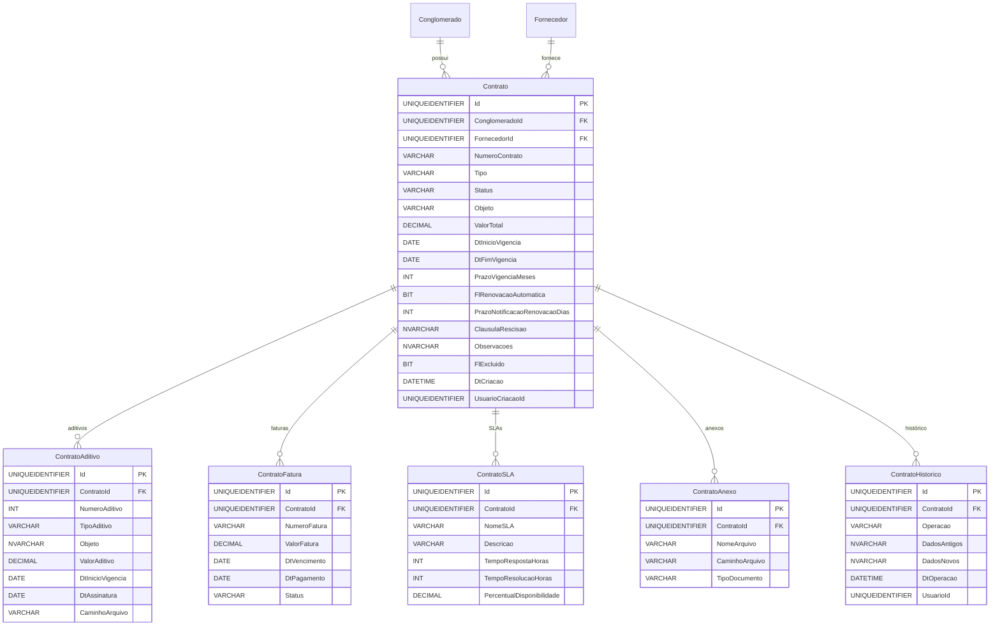

# Modelo de Dados - RF023

**Versão:** 1.0
**Data:** 2025-12-18
**RF Relacionado:** [RF023 - Gestão de Contratos](./RF023.md)
**Banco de Dados:** SQL Server (Produção) / SQLite (Desenvolvimento)

---

## 1. Diagrama de Entidades (Mermaid)



---

## 2. Entidades Principais

### 2.1 Tabela: Contrato

```sql
CREATE TABLE Contrato (
    Id UNIQUEIDENTIFIER NOT NULL DEFAULT NEWID(),
    ClienteId UNIQUEIDENTIFIER NOT NULL,
    FornecedorId UNIQUEIDENTIFIER NOT NULL,
    NumeroContrato VARCHAR(50) NOT NULL,
    Tipo VARCHAR(30) NOT NULL,          -- FORNECIMENTO, SERVICO, TELECOM, TI, FACILITIES
    Status VARCHAR(30) NOT NULL DEFAULT 'ATIVO',
    Objeto NVARCHAR(2000) NOT NULL,
    ValorTotal DECIMAL(15,2) NOT NULL,
    DtInicioVigencia DATE NOT NULL,
    DtFimVigencia DATE NOT NULL,
    PrazoVigenciaMeses INT NOT NULL,
    FlRenovacaoAutomatica BIT NOT NULL DEFAULT 0,
    PrazoNotificacaoRenovacaoDias INT NULL DEFAULT 90,
    ClausulaRescisao NVARCHAR(2000) NULL,
    Observacoes NVARCHAR(MAX) NULL,
    FlExcluido BIT NOT NULL DEFAULT 0,
    DtCriacao DATETIME NOT NULL DEFAULT GETDATE(),
    UsuarioCriacaoId UNIQUEIDENTIFIER NOT NULL,
    DtAlteracao DATETIME NULL,
    UsuarioAlteracaoId UNIQUEIDENTIFIER NULL,

    CONSTRAINT PK_Contrato PRIMARY KEY (Id),
    CONSTRAINT FK_Contrato_Conglomerado FOREIGN KEY (ClienteId) REFERENCES Cliente(Id),
    CONSTRAINT FK_Contrato_Fornecedor FOREIGN KEY (FornecedorId) REFERENCES Fornecedor(Id),
    CONSTRAINT UQ_Contrato_NumeroContrato UNIQUE (ConglomeradoId, NumeroContrato),
    CONSTRAINT CK_Contrato_Status CHECK (Status IN ('ATIVO', 'INATIVO', 'VENCIDO', 'RESCINDIDO', 'EM_RENOVACAO')),
    CONSTRAINT CK_Contrato_ValorTotal CHECK (ValorTotal >= 0),
    CONSTRAINT CK_Contrato_PrazoVigenciaMeses CHECK (PrazoVigenciaMeses > 0)
);

CREATE INDEX IX_Contrato_ConglomeradoId ON Contrato(ConglomeradoId);
CREATE INDEX IX_Contrato_FornecedorId ON Contrato(FornecedorId);
CREATE INDEX IX_Contrato_DtFimVigencia ON Contrato(DtFimVigencia);
CREATE INDEX IX_Contrato_Status ON Contrato(Status, Ativo);
```

### 2.2 Tabela: ContratoAditivo

```sql
CREATE TABLE ContratoAditivo (
    Id UNIQUEIDENTIFIER NOT NULL DEFAULT NEWID(),
    ContratoId UNIQUEIDENTIFIER NOT NULL,
    NumeroAditivo INT NOT NULL,
    TipoAditivo VARCHAR(50) NOT NULL,   -- PRAZO, VALOR, ESCOPO, OUTROS
    Objeto NVARCHAR(2000) NOT NULL,
    ValorAditivo DECIMAL(15,2) NULL DEFAULT 0,
    DtInicioVigencia DATE NOT NULL,
    DtAssinatura DATE NOT NULL,
    CaminhoArquivo VARCHAR(1000) NULL,
    DtCriacao DATETIME NOT NULL DEFAULT GETDATE(),
    UsuarioCriacaoId UNIQUEIDENTIFIER NOT NULL,

    CONSTRAINT PK_ContratoAditivo PRIMARY KEY (Id),
    CONSTRAINT FK_ContratoAditivo_Contrato FOREIGN KEY (ContratoId) REFERENCES Contrato(Id) ON DELETE CASCADE,
    CONSTRAINT UQ_ContratoAditivo_NumeroAditivo UNIQUE (ContratoId, NumeroAditivo),
    CONSTRAINT CK_ContratoAditivo_TipoAditivo CHECK (TipoAditivo IN ('PRAZO', 'VALOR', 'ESCOPO', 'OUTROS'))
);

CREATE INDEX IX_ContratoAditivo_ContratoId ON ContratoAditivo(ContratoId);
```

### 2.3 Tabela: ContratoFatura

```sql
CREATE TABLE ContratoFatura (
    Id UNIQUEIDENTIFIER NOT NULL DEFAULT NEWID(),
    ContratoId UNIQUEIDENTIFIER NOT NULL,
    NumeroFatura VARCHAR(50) NOT NULL,
    ValorFatura DECIMAL(15,2) NOT NULL,
    DtVencimento DATE NOT NULL,
    DtPagamento DATE NULL,
    Status VARCHAR(20) NOT NULL DEFAULT 'PENDENTE',
    DtCriacao DATETIME NOT NULL DEFAULT GETDATE(),

    CONSTRAINT PK_ContratoFatura PRIMARY KEY (Id),
    CONSTRAINT FK_ContratoFatura_Contrato FOREIGN KEY (ContratoId) REFERENCES Contrato(Id) ON DELETE CASCADE,
    CONSTRAINT CK_ContratoFatura_Status CHECK (Status IN ('PENDENTE', 'PAGO', 'VENCIDO', 'CANCELADO')),
    CONSTRAINT CK_ContratoFatura_ValorFatura CHECK (ValorFatura > 0)
);

CREATE INDEX IX_ContratoFatura_ContratoId ON ContratoFatura(ContratoId);
CREATE INDEX IX_ContratoFatura_DtVencimento ON ContratoFatura(DtVencimento);
CREATE INDEX IX_ContratoFatura_Status ON ContratoFatura(Status);
```

### 2.4 Tabela: ContratoSLA

```sql
CREATE TABLE ContratoSLA (
    Id UNIQUEIDENTIFIER NOT NULL DEFAULT NEWID(),
    ContratoId UNIQUEIDENTIFIER NOT NULL,
    NomeSLA VARCHAR(200) NOT NULL,
    Descricao NVARCHAR(1000) NULL,
    TempoRespostaHoras INT NOT NULL,
    TempoResolucaoHoras INT NOT NULL,
    PercentualDisponibilidade DECIMAL(5,2) NULL,

    CONSTRAINT PK_ContratoSLA PRIMARY KEY (Id),
    CONSTRAINT FK_ContratoSLA_Contrato FOREIGN KEY (ContratoId) REFERENCES Contrato(Id) ON DELETE CASCADE,
    CONSTRAINT CK_ContratoSLA_TempoRespostaHoras CHECK (TempoRespostaHoras > 0),
    CONSTRAINT CK_ContratoSLA_TempoResolucaoHoras CHECK (TempoResolucaoHoras > 0),
    CONSTRAINT CK_ContratoSLA_PercentualDisponibilidade CHECK (PercentualDisponibilidade >= 0 AND PercentualDisponibilidade <= 100)
);

CREATE INDEX IX_ContratoSLA_ContratoId ON ContratoSLA(ContratoId);
```

---

## 3. Triggers

### 3.1 Atualizar Status de Contrato Vencido

```sql
CREATE PROCEDURE sp_AtualizarContratosVencidos
AS
BEGIN
    UPDATE Contrato
    SET Status = 'VENCIDO'
    WHERE DtFimVigencia < CAST(GETDATE() AS DATE)
      AND Status = 'ATIVO'
      AND FlExcluido = 0;
END;
```

---

**Última Atualização:** 2025-12-18
