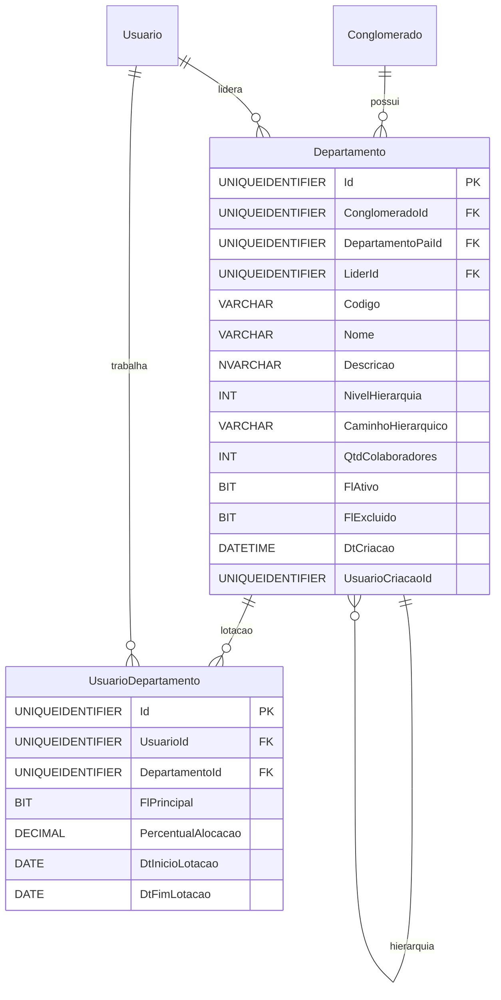

# Modelo de Dados - RF024

**Versão:** 1.0
**Data:** 2025-12-18
**RF Relacionado:** [RF024 - Gestão de Departamentos](./RF024.md)
**Banco de Dados:** SQL Server (Produção) / SQLite (Desenvolvimento)

---

## 1. Diagrama de Entidades (Mermaid)



---

## 2. Entidades Principais

### 2.1 Tabela: Departamento

```sql
CREATE TABLE Departamento (
    Id UNIQUEIDENTIFIER NOT NULL DEFAULT NEWID(),
    ClienteId UNIQUEIDENTIFIER NOT NULL,
    DepartamentoPaiId UNIQUEIDENTIFIER NULL,    -- Hierarquia recursiva
    LiderId UNIQUEIDENTIFIER NULL,              -- Gestor do departamento
    Codigo VARCHAR(20) NOT NULL,                -- DIR-TI, GER-DEV, COORD-BACKEND
    Nome VARCHAR(200) NOT NULL,
    Descricao NVARCHAR(1000) NULL,
    NivelHierarquia INT NOT NULL DEFAULT 1,
    CaminhoHierarquico VARCHAR(500) NULL,       -- /Diretoria/Gerencia/Coordenacao
    QtdColaboradores INT NOT NULL DEFAULT 0,    -- Atualizado via trigger
    FlFlExcluido BIT NOT NULL DEFAULT 0,
    FlExcluido BIT NOT NULL DEFAULT 0,
    DtCriacao DATETIME NOT NULL DEFAULT GETDATE(),
    UsuarioCriacaoId UNIQUEIDENTIFIER NOT NULL,
    DtAlteracao DATETIME NULL,
    UsuarioAlteracaoId UNIQUEIDENTIFIER NULL,

    CONSTRAINT PK_Departamento PRIMARY KEY (Id),
    CONSTRAINT FK_Departamento_Conglomerado FOREIGN KEY (ClienteId) REFERENCES Cliente(Id),
    CONSTRAINT FK_Departamento_DepartamentoPai FOREIGN KEY (DepartamentoPaiId) REFERENCES Departamento(Id),
    CONSTRAINT FK_Departamento_Lider FOREIGN KEY (LiderId) REFERENCES Usuario(Id),
    CONSTRAINT UQ_Departamento_Codigo UNIQUE (ConglomeradoId, Codigo),
    CONSTRAINT CK_Departamento_NivelHierarquia CHECK (NivelHierarquia > 0 AND NivelHierarquia <= 10)
);

CREATE INDEX IX_Departamento_ConglomeradoId ON Departamento(ConglomeradoId);
CREATE INDEX IX_Departamento_DepartamentoPaiId ON Departamento(DepartamentoPaiId);
CREATE INDEX IX_Departamento_LiderId ON Departamento(LiderId);
CREATE INDEX IX_Departamento_FlAtivo ON Departamento(FlAtivo, Ativo);
```

### 2.2 Tabela: UsuarioDepartamento

```sql
CREATE TABLE UsuarioDepartamento (
    Id UNIQUEIDENTIFIER NOT NULL DEFAULT NEWID(),
    UsuarioId UNIQUEIDENTIFIER NOT NULL,
    DepartamentoId UNIQUEIDENTIFIER NOT NULL,
    FlPrincipal BIT NOT NULL DEFAULT 1,         -- Lotação principal
    PercentualAlocacao DECIMAL(5,2) NOT NULL DEFAULT 100.00,
    DtInicioLotacao DATE NOT NULL DEFAULT CAST(GETDATE() AS DATE),
    DtFimLotacao DATE NULL,
    DtCriacao DATETIME NOT NULL DEFAULT GETDATE(),

    CONSTRAINT PK_UsuarioDepartamento PRIMARY KEY (Id),
    CONSTRAINT FK_UsuarioDepartamento_Usuario FOREIGN KEY (UsuarioId) REFERENCES Usuario(Id),
    CONSTRAINT FK_UsuarioDepartamento_Departamento FOREIGN KEY (DepartamentoId) REFERENCES Departamento(Id),
    CONSTRAINT CK_UsuarioDepartamento_PercentualAlocacao CHECK (PercentualAlocacao > 0 AND PercentualAlocacao <= 100)
);

CREATE INDEX IX_UsuarioDepartamento_UsuarioId ON UsuarioDepartamento(UsuarioId);
CREATE INDEX IX_UsuarioDepartamento_DepartamentoId ON UsuarioDepartamento(DepartamentoId);
CREATE INDEX IX_UsuarioDepartamento_FlPrincipal ON UsuarioDepartamento(FlPrincipal) WHERE FlPrincipal = 1;
```

---

## 3. Triggers

### 3.1 Atualizar Quantidade de Colaboradores

```sql
CREATE TRIGGER trg_UsuarioDepartamento_AtualizarQtdColaboradores
ON UsuarioDepartamento
AFTER INSERT, UPDATE, DELETE
AS
BEGIN
    SET NOCOUNT ON;

    -- Atualiza departamentos afetados por INSERT/UPDATE
    UPDATE d
    SET QtdColaboradores = (
        SELECT COUNT(DISTINCT UsuarioId)
        FROM UsuarioDepartamento
        WHERE DepartamentoId = d.Id
          AND (DtFimLotacao IS NULL OR DtFimLotacao >= CAST(GETDATE() AS DATE))
    )
    FROM Departamento d
    WHERE d.Id IN (
        SELECT DISTINCT DepartamentoId FROM inserted
        UNION
        SELECT DISTINCT DepartamentoId FROM deleted
    );
END;
```

### 3.2 Calcular Nível Hierárquico e Caminho

```sql
CREATE TRIGGER trg_Departamento_CalcularHierarquia
ON Departamento
AFTER INSERT, UPDATE
AS
BEGIN
    SET NOCOUNT ON;

    ;WITH CTE_Hierarquia AS (
        SELECT
            d.Id,
            d.DepartamentoPaiId,
            1 AS NivelHierarquia,
            '/' + d.Codigo AS CaminhoHierarquico
        FROM Departamento d
        WHERE d.DepartamentoPaiId IS NULL

        UNION ALL

        SELECT
            d.Id,
            d.DepartamentoPaiId,
            h.NivelHierarquia + 1,
            h.CaminhoHierarquico + '/' + d.Codigo
        FROM Departamento d
        INNER JOIN CTE_Hierarquia h ON d.DepartamentoPaiId = h.Id
    )
    UPDATE d
    SET
        NivelHierarquia = h.NivelHierarquia,
        CaminhoHierarquico = h.CaminhoHierarquico
    FROM Departamento d
    INNER JOIN CTE_Hierarquia h ON d.Id = h.Id
    WHERE d.Id IN (SELECT Id FROM inserted);
END;
```

---

**Última Atualização:** 2025-12-18
