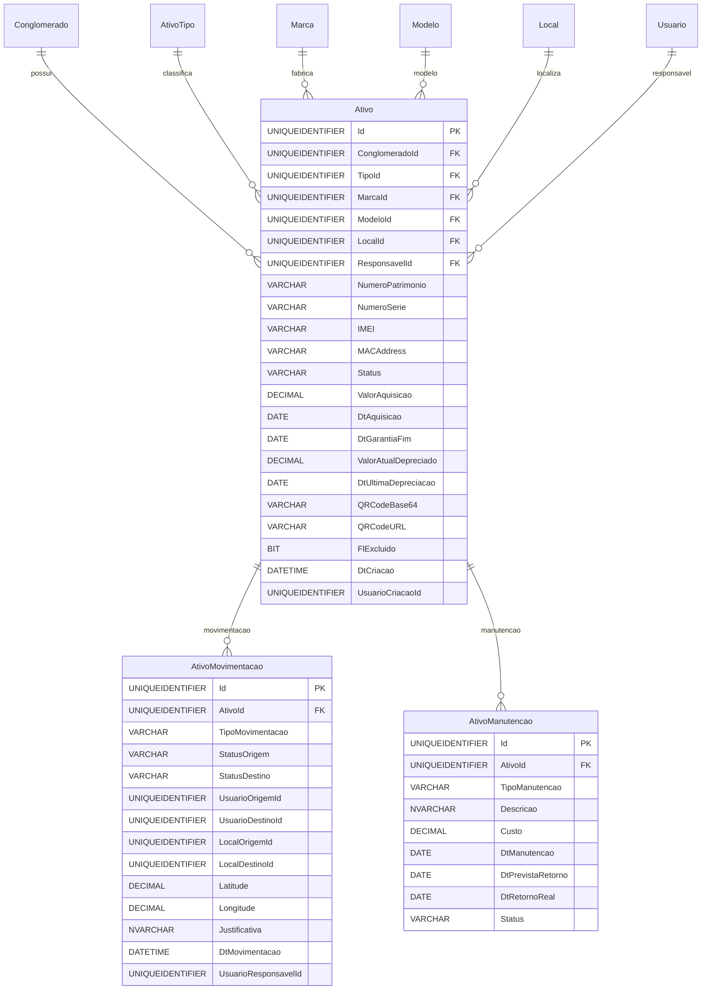

# Modelo de Dados - RF025

**Versão:** 1.0
**Data:** 2025-12-18
**RF Relacionado:** [RF025 - Gestão de Ativos](./RF025.md)
**Banco de Dados:** SQL Server (Produção) / SQLite (Desenvolvimento)

---

## 1. Diagrama de Entidades (Mermaid)



---

## 2. Entidades Principais

### 2.1 Tabela: Ativo

```sql
CREATE TABLE Ativo (
    -- Identificação
    Id UNIQUEIDENTIFIER NOT NULL DEFAULT NEWID(),
    ClienteId UNIQUEIDENTIFIER NOT NULL,
    TipoId UNIQUEIDENTIFIER NOT NULL,
    MarcaId UNIQUEIDENTIFIER NULL,
    ModeloId UNIQUEIDENTIFIER NULL,
    LocalId UNIQUEIDENTIFIER NULL,
    ResponsavelId UNIQUEIDENTIFIER NULL,

    -- Identificadores Únicos
    NumeroPatrimonio VARCHAR(30) NOT NULL,      -- PAT-NB-2025-0001 (gerado automaticamente)
    NumeroSerie VARCHAR(100) NULL,
    IMEI VARCHAR(20) NULL,
    MACAddress VARCHAR(17) NULL,

    -- Status
    Status VARCHAR(30) NOT NULL DEFAULT 'DISPONIVEL',
    -- DISPONIVEL, ALOCADO, MANUTENCAO, BAIXADO, PERDIDO, RESERVADO

    -- Financeiro
    ValorAquisicao DECIMAL(15,2) NULL,
    DtAquisicao DATE NULL,
    DtGarantiaFim DATE NULL,
    ValorAtualDepreciado DECIMAL(15,2) NULL,
    DtUltimaDepreciacao DATE NULL,

    -- QR Code
    QRCodeBase64 NVARCHAR(MAX) NULL,            -- Base64 para impressão offline
    QRCodeURL VARCHAR(500) NULL,                 -- https://api.icontrolit.com.br/ativos/qr/{Id}

    -- Soft Delete
    FlExcluido BIT NOT NULL DEFAULT 0,

    -- Auditoria
    DtCriacao DATETIME NOT NULL DEFAULT GETDATE(),
    UsuarioCriacaoId UNIQUEIDENTIFIER NOT NULL,
    DtAlteracao DATETIME NULL,
    UsuarioAlteracaoId UNIQUEIDENTIFIER NULL,

    -- Constraints
    CONSTRAINT PK_Ativo PRIMARY KEY (Id),
    CONSTRAINT FK_Ativo_Conglomerado FOREIGN KEY (ClienteId) REFERENCES Cliente(Id),
    CONSTRAINT FK_Ativo_Tipo FOREIGN KEY (TipoId) REFERENCES AtivoTipo(Id),
    CONSTRAINT FK_Ativo_Marca FOREIGN KEY (MarcaId) REFERENCES Marca(Id),
    CONSTRAINT FK_Ativo_Modelo FOREIGN KEY (ModeloId) REFERENCES Modelo(Id),
    CONSTRAINT FK_Ativo_Local FOREIGN KEY (LocalId) REFERENCES Local(Id),
    CONSTRAINT FK_Ativo_Responsavel FOREIGN KEY (ResponsavelId) REFERENCES Usuario(Id),
    CONSTRAINT UQ_Ativo_NumeroPatrimonio UNIQUE (NumeroPatrimonio),
    CONSTRAINT UQ_Ativo_NumeroSerie UNIQUE (ConglomeradoId, NumeroSerie),
    CONSTRAINT UQ_Ativo_IMEI UNIQUE (ConglomeradoId, IMEI),
    CONSTRAINT CK_Ativo_Status CHECK (Status IN ('DISPONIVEL', 'ALOCADO', 'MANUTENCAO', 'BAIXADO', 'PERDIDO', 'RESERVADO')),
    CONSTRAINT CK_Ativo_ValorAquisicao CHECK (ValorAquisicao >= 0),
    CONSTRAINT CK_Ativo_ValorAtualDepreciado CHECK (ValorAtualDepreciado >= 0)
);

-- Índices
CREATE INDEX IX_Ativo_ConglomeradoId ON Ativo(ConglomeradoId);
CREATE INDEX IX_Ativo_TipoId ON Ativo(TipoId);
CREATE INDEX IX_Ativo_Status ON Ativo(Status, Ativo);
CREATE INDEX IX_Ativo_ResponsavelId ON Ativo(ResponsavelId);
CREATE INDEX IX_Ativo_LocalId ON Ativo(LocalId);
CREATE INDEX IX_Ativo_NumeroSerie ON Ativo(NumeroSerie) WHERE NumeroSerie IS NOT NULL;
CREATE INDEX IX_Ativo_IMEI ON Ativo(IMEI) WHERE IMEI IS NOT NULL;
CREATE INDEX IX_Ativo_DtGarantiaFim ON Ativo(DtGarantiaFim) WHERE DtGarantiaFim IS NOT NULL;
```

### 2.2 Tabela: AtivoMovimentacao

```sql
CREATE TABLE AtivoMovimentacao (
    -- Identificação
    Id UNIQUEIDENTIFIER NOT NULL DEFAULT NEWID(),
    AtivoId UNIQUEIDENTIFIER NOT NULL,

    -- Tipo de Movimentação
    TipoMovimentacao VARCHAR(30) NOT NULL,
    -- ALOCACAO, TRANSFERENCIA, DEVOLUCAO, MANUTENCAO, BAIXA

    -- Status
    StatusOrigem VARCHAR(30) NULL,
    StatusDestino VARCHAR(30) NOT NULL,

    -- Usuários
    UsuarioOrigemId UNIQUEIDENTIFIER NULL,
    UsuarioDestinoId UNIQUEIDENTIFIER NULL,

    -- Locais
    LocalOrigemId UNIQUEIDENTIFIER NULL,
    LocalDestinoId UNIQUEIDENTIFIER NULL,

    -- Geolocalização
    Latitude DECIMAL(10,7) NULL,
    Longitude DECIMAL(10,7) NULL,

    -- Observações
    Justificativa NVARCHAR(2000) NULL,

    -- Auditoria
    DtMovimentacao DATETIME NOT NULL DEFAULT GETDATE(),
    UsuarioResponsavelId UNIQUEIDENTIFIER NOT NULL,

    -- Constraints
    CONSTRAINT PK_AtivoMovimentacao PRIMARY KEY (Id),
    CONSTRAINT FK_AtivoMovimentacao_Ativo FOREIGN KEY (AtivoId) REFERENCES Ativo(Id),
    CONSTRAINT FK_AtivoMovimentacao_UsuarioOrigem FOREIGN KEY (UsuarioOrigemId) REFERENCES Usuario(Id),
    CONSTRAINT FK_AtivoMovimentacao_UsuarioDestino FOREIGN KEY (UsuarioDestinoId) REFERENCES Usuario(Id),
    CONSTRAINT FK_AtivoMovimentacao_LocalOrigem FOREIGN KEY (LocalOrigemId) REFERENCES Local(Id),
    CONSTRAINT FK_AtivoMovimentacao_LocalDestino FOREIGN KEY (LocalDestinoId) REFERENCES Local(Id),
    CONSTRAINT FK_AtivoMovimentacao_UsuarioResponsavel FOREIGN KEY (UsuarioResponsavelId) REFERENCES Usuario(Id),
    CONSTRAINT CK_AtivoMovimentacao_TipoMovimentacao CHECK (TipoMovimentacao IN ('ALOCACAO', 'TRANSFERENCIA', 'DEVOLUCAO', 'MANUTENCAO', 'BAIXA'))
);

CREATE INDEX IX_AtivoMovimentacao_AtivoId ON AtivoMovimentacao(AtivoId);
CREATE INDEX IX_AtivoMovimentacao_DtMovimentacao ON AtivoMovimentacao(DtMovimentacao DESC);
```

### 2.3 Tabela: AtivoManutencao

```sql
CREATE TABLE AtivoManutencao (
    -- Identificação
    Id UNIQUEIDENTIFIER NOT NULL DEFAULT NEWID(),
    AtivoId UNIQUEIDENTIFIER NOT NULL,

    -- Tipo de Manutenção
    TipoManutencao VARCHAR(30) NOT NULL,        -- PREVENTIVA, CORRETIVA, PREDITIVA

    -- Detalhes
    Descricao NVARCHAR(2000) NOT NULL,
    Custo DECIMAL(15,2) NULL,

    -- Datas
    DtManutencao DATE NOT NULL,
    DtPrevistaRetorno DATE NULL,
    DtRetornoReal DATE NULL,

    -- Status
    Status VARCHAR(30) NOT NULL DEFAULT 'EM_ANDAMENTO',
    -- EM_ANDAMENTO, CONCLUIDA, CANCELADA

    -- Auditoria
    DtCriacao DATETIME NOT NULL DEFAULT GETDATE(),
    UsuarioCriacaoId UNIQUEIDENTIFIER NOT NULL,

    -- Constraints
    CONSTRAINT PK_AtivoManutencao PRIMARY KEY (Id),
    CONSTRAINT FK_AtivoManutencao_Ativo FOREIGN KEY (AtivoId) REFERENCES Ativo(Id),
    CONSTRAINT FK_AtivoManutencao_Usuario FOREIGN KEY (UsuarioCriacaoId) REFERENCES Usuario(Id),
    CONSTRAINT CK_AtivoManutencao_TipoManutencao CHECK (TipoManutencao IN ('PREVENTIVA', 'CORRETIVA', 'PREDITIVA')),
    CONSTRAINT CK_AtivoManutencao_Status CHECK (Status IN ('EM_ANDAMENTO', 'CONCLUIDA', 'CANCELADA')),
    CONSTRAINT CK_AtivoManutencao_Custo CHECK (Custo >= 0)
);

CREATE INDEX IX_AtivoManutencao_AtivoId ON AtivoManutencao(AtivoId);
CREATE INDEX IX_AtivoManutencao_Status ON AtivoManutencao(Status);
CREATE INDEX IX_AtivoManutencao_DtManutencao ON AtivoManutencao(DtManutencao DESC);
```

---

## 3. Triggers

### 3.1 Gerar Número de Patrimônio

```sql
CREATE TRIGGER trg_Ativo_GerarNumeroPatrimonio
ON Ativo
AFTER INSERT
AS
BEGIN
    SET NOCOUNT ON;

    DECLARE @TipoAbrev VARCHAR(5);
    DECLARE @Ano INT = YEAR(GETDATE());
    DECLARE @Sequencial INT;

    SELECT @TipoAbrev = at.Codigo
    FROM inserted i
    INNER JOIN AtivoTipo at ON i.TipoId = at.Id;

    SELECT @Sequencial = ISNULL(MAX(CAST(RIGHT(NumeroPatrimonio, 4) AS INT)), 0) + 1
    FROM Ativo
    WHERE NumeroPatrimonio LIKE 'PAT-' + @TipoAbrev + '-' + CAST(@Ano AS VARCHAR(4)) + '-%';

    UPDATE Ativo
    SET NumeroPatrimonio = 'PAT-' + @TipoAbrev + '-' + CAST(@Ano AS VARCHAR(4)) + '-' + RIGHT('0000' + CAST(@Sequencial AS VARCHAR(4)), 4)
    WHERE Id IN (SELECT Id FROM inserted) AND NumeroPatrimonio IS NULL;
END;
```

### 3.2 Registrar Movimentação Automática

```sql
CREATE TRIGGER trg_Ativo_RegistrarMudancaStatus
ON Ativo
AFTER UPDATE
AS
BEGIN
    SET NOCOUNT ON;

    INSERT INTO AtivoMovimentacao (AtivoId, TipoMovimentacao, StatusOrigem, StatusDestino, UsuarioResponsavelId)
    SELECT
        i.Id,
        CASE
            WHEN i.Status = 'ALOCADO' THEN 'ALOCACAO'
            WHEN i.Status = 'DISPONIVEL' AND d.Status = 'ALOCADO' THEN 'DEVOLUCAO'
            WHEN i.Status = 'MANUTENCAO' THEN 'MANUTENCAO'
            WHEN i.Status = 'BAIXADO' THEN 'BAIXA'
            ELSE 'TRANSFERENCIA'
        END,
        d.Status,
        i.Status,
        i.UsuarioAlteracaoId
    FROM inserted i
    INNER JOIN deleted d ON i.Id = d.Id
    WHERE i.Status <> d.Status;
END;
```

---

## 4. Views Úteis

```sql
CREATE VIEW VW_Ativo_Completo AS
SELECT
    a.Id,
    a.NumeroPatrimonio,
    a.NumeroSerie,
    a.Status,
    at.Nome AS TipoNome,
    m.Nome AS MarcaNome,
    mo.Nome AS ModeloNome,
    l.Nome AS LocalNome,
    u.Nome AS ResponsavelNome,
    a.ValorAquisicao,
    a.ValorAtualDepreciado,
    a.DtAquisicao,
    a.DtGarantiaFim,
    CASE
        WHEN a.DtGarantiaFim < CAST(GETDATE() AS DATE) THEN 1
        ELSE 0
    END AS FlGarantiaVencida,
    DATEDIFF(DAY, GETDATE(), a.DtGarantiaFim) AS DiasRestantesGarantia,
    a.FlExcluido
FROM Ativo a
INNER JOIN AtivoTipo at ON a.TipoId = at.Id
LEFT JOIN Marca m ON a.MarcaId = m.Id
LEFT JOIN Modelo mo ON a.ModeloId = mo.Id
LEFT JOIN Local l ON a.LocalId = l.Id
LEFT JOIN Usuario u ON a.ResponsavelId = u.Id;
```

---

**Última Atualização:** 2025-12-18
**Responsável:** IControlIT Architect Agent
**Versão do Banco:** SQL Server 2022 / SQLite 3.45
