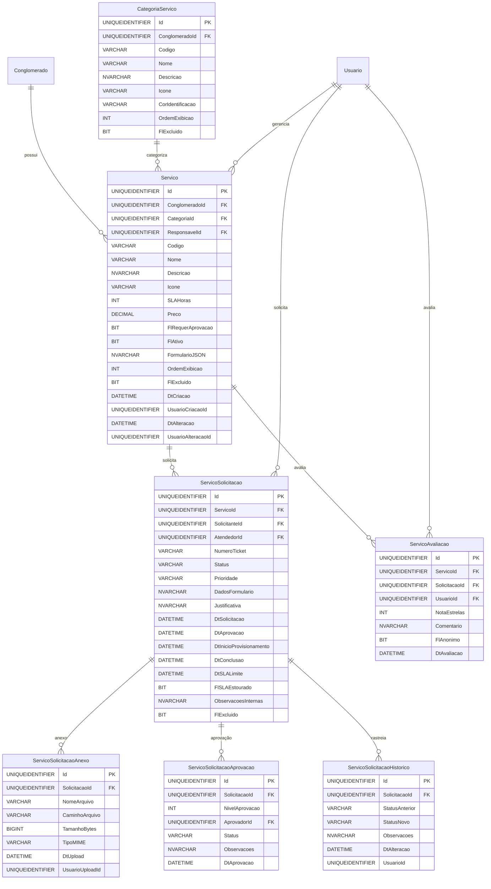

# Modelo de Dados - RF021

**Versão:** 1.0
**Data:** 2025-12-18
**RF Relacionado:** [RF021 - Catálogo de Serviços](./RF021.md)
**Banco de Dados:** SQL Server (Produção) / SQLite (Desenvolvimento)

---

## 1. Diagrama de Entidades (Mermaid)



---

## 2. Entidades Principais

### 2.1 Tabela: Servico

**Descrição:** Catálogo de serviços disponíveis para solicitação (TI, RH, Facilities, etc).

#### DDL Completo

```sql
CREATE TABLE Servico (
    -- Identificação
    Id UNIQUEIDENTIFIER NOT NULL DEFAULT NEWID(),
    ClienteId UNIQUEIDENTIFIER NOT NULL,
    CategoriaId UNIQUEIDENTIFIER NULL,
    ResponsavelId UNIQUEIDENTIFIER NULL,  -- Service Manager padrão

    -- Dados do Serviço
    Codigo VARCHAR(20) NOT NULL,        -- SRV-001, SRV-TI-NOTEBOOK
    Nome VARCHAR(200) NOT NULL,
    Descricao NVARCHAR(2000) NULL,
    Icone VARCHAR(50) NULL,             -- fa-laptop, fa-phone, fa-tools
    SLAHoras INT NOT NULL DEFAULT 24,   -- SLA em horas
    Preco DECIMAL(10,2) NOT NULL DEFAULT 0.00,

    -- Workflow
    FlRequerAprovacao BIT NOT NULL DEFAULT 0, -- 1 = requer aprovação antes de provisionar
    FlFlExcluido BIT NOT NULL DEFAULT 0,     -- 1 = disponível no catálogo

    -- Formulário Dinâmico (JSON Schema)
    FormularioJSON NVARCHAR(MAX) NULL,  -- Campos customizados do formulário de solicitação

    -- Ordenação
    OrdemExibicao INT NOT NULL DEFAULT 100,

    -- Soft Delete
    FlExcluido BIT NOT NULL DEFAULT 0,

    -- Auditoria
    DtCriacao DATETIME NOT NULL DEFAULT GETDATE(),
    UsuarioCriacaoId UNIQUEIDENTIFIER NOT NULL,
    DtAlteracao DATETIME NULL,
    UsuarioAlteracaoId UNIQUEIDENTIFIER NULL,

    -- Constraints
    CONSTRAINT PK_Servico PRIMARY KEY (Id),
    CONSTRAINT FK_Servico_Conglomerado FOREIGN KEY (ClienteId) REFERENCES Cliente(Id),
    CONSTRAINT FK_Servico_Categoria FOREIGN KEY (CategoriaId) REFERENCES CategoriaServico(Id),
    CONSTRAINT FK_Servico_Responsavel FOREIGN KEY (ResponsavelId) REFERENCES Usuario(Id),
    CONSTRAINT UQ_Servico_Codigo UNIQUE (ConglomeradoId, Codigo),
    CONSTRAINT CK_Servico_SLAHoras CHECK (SLAHoras > 0),
    CONSTRAINT CK_Servico_Preco CHECK (Preco >= 0)
);

-- Índices
CREATE INDEX IX_Servico_ConglomeradoId ON Servico(ConglomeradoId);
CREATE INDEX IX_Servico_CategoriaId ON Servico(CategoriaId);
CREATE INDEX IX_Servico_FlAtivo ON Servico(FlAtivo, Ativo);
CREATE INDEX IX_Servico_OrdemExibicao ON Servico(OrdemExibicao);
```

### 2.2 Tabela: CategoriaServico

**Descrição:** Categorias de serviços (TI, RH, Facilities, Financeiro, etc).

#### DDL Completo

```sql
CREATE TABLE CategoriaServico (
    -- Identificação
    Id UNIQUEIDENTIFIER NOT NULL DEFAULT NEWID(),
    ClienteId UNIQUEIDENTIFIER NOT NULL,

    -- Dados da Categoria
    Codigo VARCHAR(20) NOT NULL,        -- CAT-TI, CAT-RH
    Nome VARCHAR(200) NOT NULL,
    Descricao NVARCHAR(1000) NULL,
    Icone VARCHAR(50) NULL,             -- fa-laptop, fa-users
    CorIdentificacao VARCHAR(7) NULL,   -- #3498db
    OrdemExibicao INT NOT NULL DEFAULT 100,

    -- Soft Delete
    FlExcluido BIT NOT NULL DEFAULT 0,

    -- Auditoria
    DtCriacao DATETIME NOT NULL DEFAULT GETDATE(),
    UsuarioCriacaoId UNIQUEIDENTIFIER NOT NULL,

    -- Constraints
    CONSTRAINT PK_CategoriaServico PRIMARY KEY (Id),
    CONSTRAINT FK_CategoriaServico_Conglomerado FOREIGN KEY (ClienteId) REFERENCES Cliente(Id),
    CONSTRAINT UQ_CategoriaServico_Codigo UNIQUE (ConglomeradoId, Codigo)
);

CREATE INDEX IX_CategoriaServico_ConglomeradoId ON CategoriaServico(ConglomeradoId);
```

### 2.3 Tabela: ServicoSolicitacao

**Descrição:** Solicitações de serviços (tickets) com workflow completo.

#### DDL Completo

```sql
CREATE TABLE ServicoSolicitacao (
    -- Identificação
    Id UNIQUEIDENTIFIER NOT NULL DEFAULT NEWID(),
    ServicoId UNIQUEIDENTIFIER NOT NULL,
    SolicitanteId UNIQUEIDENTIFIER NOT NULL,
    AtendedorId UNIQUEIDENTIFIER NULL,  -- Service Provider responsável

    -- Ticket
    NumeroTicket VARCHAR(20) NOT NULL,  -- TICK-2025-00001 (gerado automaticamente)

    -- Status
    Status VARCHAR(30) NOT NULL DEFAULT 'Aguardando_Aprovacao',
    -- Aguardando_Aprovacao, Aprovada, Rejeitada, Em_Provisionamento, Provisionada, Cancelada, Concluida

    Prioridade VARCHAR(20) NOT NULL DEFAULT 'Media',
    -- Baixa, Media, Alta, Urgente

    -- Dados da Solicitação
    DadosFormulario NVARCHAR(MAX) NULL, -- JSON com respostas do formulário customizado
    Justificativa NVARCHAR(2000) NULL,  -- Justificativa do solicitante

    -- Datas de Rastreamento
    DtSolicitacao DATETIME NOT NULL DEFAULT GETDATE(),
    DtAprovacao DATETIME NULL,
    DtInicioProvisionamento DATETIME NULL,
    DtConclusao DATETIME NULL,
    DtSLALimite DATETIME NULL,          -- Data/hora limite do SLA
    FlSLAEstourado BIT NOT NULL DEFAULT 0,

    -- Observações
    ObservacoesInternas NVARCHAR(MAX) NULL, -- Anotações do service provider

    -- Soft Delete
    FlExcluido BIT NOT NULL DEFAULT 0,

    -- Constraints
    CONSTRAINT PK_ServicoSolicitacao PRIMARY KEY (Id),
    CONSTRAINT FK_ServicoSolicitacao_Servico FOREIGN KEY (ServicoId) REFERENCES Servico(Id),
    CONSTRAINT FK_ServicoSolicitacao_Solicitante FOREIGN KEY (SolicitanteId) REFERENCES Usuario(Id),
    CONSTRAINT FK_ServicoSolicitacao_Atendedor FOREIGN KEY (AtendedorId) REFERENCES Usuario(Id),
    CONSTRAINT UQ_ServicoSolicitacao_NumeroTicket UNIQUE (NumeroTicket),
    CONSTRAINT CK_ServicoSolicitacao_Status CHECK (Status IN ('Aguardando_Aprovacao', 'Aprovada', 'Rejeitada', 'Em_Provisionamento', 'Provisionada', 'Cancelada', 'Concluida')),
    CONSTRAINT CK_ServicoSolicitacao_Prioridade CHECK (Prioridade IN ('Baixa', 'Media', 'Alta', 'Urgente'))
);

-- Índices
CREATE INDEX IX_ServicoSolicitacao_ServicoId ON ServicoSolicitacao(ServicoId);
CREATE INDEX IX_ServicoSolicitacao_SolicitanteId ON ServicoSolicitacao(SolicitanteId);
CREATE INDEX IX_ServicoSolicitacao_AtendedorId ON ServicoSolicitacao(AtendedorId);
CREATE INDEX IX_ServicoSolicitacao_Status ON ServicoSolicitacao(Status, Ativo);
CREATE INDEX IX_ServicoSolicitacao_DtSolicitacao ON ServicoSolicitacao(DtSolicitacao DESC);
CREATE INDEX IX_ServicoSolicitacao_DtSLALimite ON ServicoSolicitacao(DtSLALimite) WHERE FlSLAEstourado = 0;
CREATE INDEX IX_ServicoSolicitacao_NumeroTicket ON ServicoSolicitacao(NumeroTicket);
```

### 2.4 Tabela: ServicoSolicitacaoAnexo

**Descrição:** Anexos de evidências em solicitações.

#### DDL Completo

```sql
CREATE TABLE ServicoSolicitacaoAnexo (
    -- Identificação
    Id UNIQUEIDENTIFIER NOT NULL DEFAULT NEWID(),
    SolicitacaoId UNIQUEIDENTIFIER NOT NULL,

    -- Dados do Arquivo
    NomeArquivo VARCHAR(500) NOT NULL,
    CaminhoArquivo VARCHAR(1000) NOT NULL,
    TamanhoBytes BIGINT NOT NULL,
    TipoMIME VARCHAR(100) NOT NULL,

    -- Auditoria
    DtUpload DATETIME NOT NULL DEFAULT GETDATE(),
    UsuarioUploadId UNIQUEIDENTIFIER NOT NULL,

    -- Constraints
    CONSTRAINT PK_ServicoSolicitacaoAnexo PRIMARY KEY (Id),
    CONSTRAINT FK_ServicoSolicitacaoAnexo_Solicitacao FOREIGN KEY (SolicitacaoId) REFERENCES ServicoSolicitacao(Id) ON DELETE CASCADE,
    CONSTRAINT FK_ServicoSolicitacaoAnexo_Usuario FOREIGN KEY (UsuarioUploadId) REFERENCES Usuario(Id),
    CONSTRAINT CK_ServicoSolicitacaoAnexo_TamanhoBytes CHECK (TamanhoBytes > 0)
);

CREATE INDEX IX_ServicoSolicitacaoAnexo_SolicitacaoId ON ServicoSolicitacaoAnexo(SolicitacaoId);
```

### 2.5 Tabela: ServicoSolicitacaoAprovacao

**Descrição:** Workflow de aprovação multi-nível para solicitações.

#### DDL Completo

```sql
CREATE TABLE ServicoSolicitacaoAprovacao (
    -- Identificação
    Id UNIQUEIDENTIFIER NOT NULL DEFAULT NEWID(),
    SolicitacaoId UNIQUEIDENTIFIER NOT NULL,

    -- Workflow
    NivelAprovacao INT NOT NULL,        -- 1, 2, 3 (hierarquia de aprovação)
    AprovadorId UNIQUEIDENTIFIER NOT NULL,

    -- Status da Aprovação
    Status VARCHAR(20) NOT NULL DEFAULT 'Pendente',
    -- Pendente, Aprovada, Rejeitada

    Observacoes NVARCHAR(2000) NULL,
    DtAprovacao DATETIME NULL,

    -- Constraints
    CONSTRAINT PK_ServicoSolicitacaoAprovacao PRIMARY KEY (Id),
    CONSTRAINT FK_ServicoSolicitacaoAprovacao_Solicitacao FOREIGN KEY (SolicitacaoId) REFERENCES ServicoSolicitacao(Id) ON DELETE CASCADE,
    CONSTRAINT FK_ServicoSolicitacaoAprovacao_Aprovador FOREIGN KEY (AprovadorId) REFERENCES Usuario(Id),
    CONSTRAINT UQ_ServicoSolicitacaoAprovacao_Nivel UNIQUE (SolicitacaoId, NivelAprovacao),
    CONSTRAINT CK_ServicoSolicitacaoAprovacao_Status CHECK (Status IN ('Pendente', 'Aprovada', 'Rejeitada')),
    CONSTRAINT CK_ServicoSolicitacaoAprovacao_NivelAprovacao CHECK (NivelAprovacao > 0)
);

CREATE INDEX IX_ServicoSolicitacaoAprovacao_SolicitacaoId ON ServicoSolicitacaoAprovacao(SolicitacaoId);
CREATE INDEX IX_ServicoSolicitacaoAprovacao_AprovadorId ON ServicoSolicitacaoAprovacao(AprovadorId);
CREATE INDEX IX_ServicoSolicitacaoAprovacao_Status ON ServicoSolicitacaoAprovacao(Status);
```

### 2.6 Tabela: ServicoSolicitacaoHistorico

**Descrição:** Rastreamento de mudanças de status (chain of custody).

#### DDL Completo

```sql
CREATE TABLE ServicoSolicitacaoHistorico (
    -- Identificação
    Id UNIQUEIDENTIFIER NOT NULL DEFAULT NEWID(),
    SolicitacaoId UNIQUEIDENTIFIER NOT NULL,

    -- Dados da Mudança
    StatusAnterior VARCHAR(30) NULL,
    StatusNovo VARCHAR(30) NOT NULL,
    Observacoes NVARCHAR(2000) NULL,

    -- Auditoria
    DtAlteracao DATETIME NOT NULL DEFAULT GETDATE(),
    UsuarioId UNIQUEIDENTIFIER NOT NULL,

    -- Constraints
    CONSTRAINT PK_ServicoSolicitacaoHistorico PRIMARY KEY (Id),
    CONSTRAINT FK_ServicoSolicitacaoHistorico_Solicitacao FOREIGN KEY (SolicitacaoId) REFERENCES ServicoSolicitacao(Id),
    CONSTRAINT FK_ServicoSolicitacaoHistorico_Usuario FOREIGN KEY (UsuarioId) REFERENCES Usuario(Id)
);

CREATE INDEX IX_ServicoSolicitacaoHistorico_SolicitacaoId ON ServicoSolicitacaoHistorico(SolicitacaoId);
CREATE INDEX IX_ServicoSolicitacaoHistorico_DtAlteracao ON ServicoSolicitacaoHistorico(DtAlteracao DESC);
```

### 2.7 Tabela: ServicoAvaliacao

**Descrição:** Avaliações de serviços prestados (NPS).

#### DDL Completo

```sql
CREATE TABLE ServicoAvaliacao (
    -- Identificação
    Id UNIQUEIDENTIFIER NOT NULL DEFAULT NEWID(),
    ServicoId UNIQUEIDENTIFIER NOT NULL,
    SolicitacaoId UNIQUEIDENTIFIER NULL, -- Avaliação vinculada a solicitação específica
    UsuarioId UNIQUEIDENTIFIER NOT NULL,

    -- Avaliação
    NotaEstrelas INT NOT NULL,          -- 1 a 5 estrelas
    Comentario NVARCHAR(2000) NULL,
    FlAnonimo BIT NOT NULL DEFAULT 0,   -- 1 = avaliação anônima

    -- Auditoria
    DtAvaliacao DATETIME NOT NULL DEFAULT GETDATE(),

    -- Constraints
    CONSTRAINT PK_ServicoAvaliacao PRIMARY KEY (Id),
    CONSTRAINT FK_ServicoAvaliacao_Servico FOREIGN KEY (ServicoId) REFERENCES Servico(Id),
    CONSTRAINT FK_ServicoAvaliacao_Solicitacao FOREIGN KEY (SolicitacaoId) REFERENCES ServicoSolicitacao(Id),
    CONSTRAINT FK_ServicoAvaliacao_Usuario FOREIGN KEY (UsuarioId) REFERENCES Usuario(Id),
    CONSTRAINT CK_ServicoAvaliacao_NotaEstrelas CHECK (NotaEstrelas BETWEEN 1 AND 5)
);

CREATE INDEX IX_ServicoAvaliacao_ServicoId ON ServicoAvaliacao(ServicoId);
CREATE INDEX IX_ServicoAvaliacao_SolicitacaoId ON ServicoAvaliacao(SolicitacaoId);
CREATE INDEX IX_ServicoAvaliacao_DtAvaliacao ON ServicoAvaliacao(DtAvaliacao DESC);
```

---

## 3. Relacionamentos e Constraints

### 3.1 Relacionamentos Principais

- **Servico** N:1 **Conglomerado** (multi-tenancy)
- **Servico** N:1 **CategoriaServico** (categorização)
- **Servico** 1:N **ServicoSolicitacao** (solicitações)
- **Servico** 1:N **ServicoAvaliacao** (avaliações)
- **ServicoSolicitacao** 1:N **ServicoSolicitacaoAnexo** (anexos)
- **ServicoSolicitacao** 1:N **ServicoSolicitacaoAprovacao** (aprovações)
- **ServicoSolicitacao** 1:N **ServicoSolicitacaoHistorico** (histórico)

### 3.2 Regras de Integridade

1. **Geração de Ticket:** NumeroTicket gerado automaticamente no formato TICK-{Ano}-{Sequencial}
2. **SLA:** DtSLALimite calculado automaticamente: DtSolicitacao + SLAHoras do serviço
3. **Workflow:** Status deve seguir ordem lógica (validação via trigger)
4. **Aprovação:** Se FlRequerAprovacao=1, solicitação inicia em status "Aguardando_Aprovacao"
5. **Avaliação:** Apenas solicitante pode avaliar serviço após conclusão

---

## 4. Triggers para Automação

### 4.1 Trigger: Calcular SLA Automático

```sql
CREATE TRIGGER trg_ServicoSolicitacao_CalcularSLA
ON ServicoSolicitacao
AFTER INSERT
AS
BEGIN
    SET NOCOUNT ON;

    UPDATE ss
    SET DtSLALimite = DATEADD(HOUR, s.SLAHoras, ss.DtSolicitacao)
    FROM ServicoSolicitacao ss
    INNER JOIN inserted i ON ss.Id = i.Id
    INNER JOIN Servico s ON ss.ServicoId = s.Id;
END;
```

### 4.2 Trigger: Gerar Número de Ticket

```sql
CREATE TRIGGER trg_ServicoSolicitacao_GerarNumeroTicket
ON ServicoSolicitacao
AFTER INSERT
AS
BEGIN
    SET NOCOUNT ON;

    DECLARE @Ano INT = YEAR(GETDATE());
    DECLARE @Sequencial INT;

    SELECT @Sequencial = ISNULL(MAX(CAST(RIGHT(NumeroTicket, 5) AS INT)), 0) + 1
    FROM ServicoSolicitacao
    WHERE NumeroTicket LIKE 'TICK-' + CAST(@Ano AS VARCHAR(4)) + '-%';

    UPDATE ServicoSolicitacao
    SET NumeroTicket = 'TICK-' + CAST(@Ano AS VARCHAR(4)) + '-' + RIGHT('00000' + CAST(@Sequencial AS VARCHAR(5)), 5)
    WHERE Id IN (SELECT Id FROM inserted);
END;
```

### 4.3 Trigger: Registrar Mudança de Status

```sql
CREATE TRIGGER trg_ServicoSolicitacao_RegistrarMudancaStatus
ON ServicoSolicitacao
AFTER UPDATE
AS
BEGIN
    SET NOCOUNT ON;

    INSERT INTO ServicoSolicitacaoHistorico (SolicitacaoId, StatusAnterior, StatusNovo, UsuarioId)
    SELECT
        i.Id,
        d.Status,
        i.Status,
        i.UsuarioAlteracaoId
    FROM inserted i
    INNER JOIN deleted d ON i.Id = d.Id
    WHERE i.Status <> d.Status;
END;
```

---

## 5. Views Úteis

### 5.1 View: Solicitações com Informações Completas

```sql
CREATE VIEW VW_ServicoSolicitacao_Completa AS
SELECT
    ss.Id,
    ss.NumeroTicket,
    s.Nome AS ServicoNome,
    c.Nome AS CategoriaNome,
    u_sol.Nome AS SolicitanteNome,
    u_sol.Email AS SolicitanteEmail,
    u_ate.Nome AS AtendedorNome,
    ss.Status,
    ss.Prioridade,
    ss.DtSolicitacao,
    ss.DtSLALimite,
    CASE
        WHEN ss.DtSLALimite < GETDATE() AND ss.Status NOT IN ('Concluida', 'Cancelada') THEN 1
        ELSE 0
    END AS FlSLAEstouradoAtual,
    DATEDIFF(HOUR, GETDATE(), ss.DtSLALimite) AS HorasRestantesSLA,
    ss.FlExcluido
FROM ServicoSolicitacao ss
INNER JOIN Servico s ON ss.ServicoId = s.Id
LEFT JOIN CategoriaServico c ON s.CategoriaId = c.Id
INNER JOIN Usuario u_sol ON ss.SolicitanteId = u_sol.Id
LEFT JOIN Usuario u_ate ON ss.AtendedorId = u_ate.Id;
```

### 5.2 View: Média de Avaliações por Serviço

```sql
CREATE VIEW VW_Servico_AvaliacaoMedia AS
SELECT
    s.Id AS ServicoId,
    s.Nome AS ServicoNome,
    COUNT(sa.Id) AS TotalAvaliacoes,
    AVG(CAST(sa.NotaEstrelas AS FLOAT)) AS MediaEstrelas,
    SUM(CASE WHEN sa.NotaEstrelas >= 4 THEN 1 ELSE 0 END) AS AvaliacoesPositivas,
    SUM(CASE WHEN sa.NotaEstrelas <= 2 THEN 1 ELSE 0 END) AS AvaliacoesNegativas
FROM Servico s
LEFT JOIN ServicoAvaliacao sa ON s.Id = sa.ServicoId
GROUP BY s.Id, s.Nome;
```

---

## 6. Migração Entity Framework Core

```csharp
public class Servico
{
    public Guid Id { get; set; }
    public Guid ConglomeradoId { get; set; }
    public Guid? CategoriaId { get; set; }
    public Guid? ResponsavelId { get; set; }
    public string Codigo { get; set; } = string.Empty;
    public string Nome { get; set; } = string.Empty;
    public string? Descricao { get; set; }
    public string? Icone { get; set; }
    public int SLAHoras { get; set; } = 24;
    public decimal Preco { get; set; }
    public bool FlRequerAprovacao { get; set; }
    public bool FlAtivo { get; set; } = true;
    public string? FormularioJSON { get; set; }
    public int OrdemExibicao { get; set; } = 100;
    public bool FlExcluido { get; set; }
    public DateTime DtCriacao { get; set; }
    public Guid UsuarioCriacaoId { get; set; }
    public DateTime? DtAlteracao { get; set; }
    public Guid? UsuarioAlteracaoId { get; set; }

    // Navegação
    public Conglomerado Conglomerado { get; set; } = null!;
    public CategoriaServico? Categoria { get; set; }
    public Usuario? Responsavel { get; set; }
    public ICollection<ServicoSolicitacao> Solicitacoes { get; set; } = new List<ServicoSolicitacao>();
    public ICollection<ServicoAvaliacao> Avaliacoes { get; set; } = new List<ServicoAvaliacao>();
}
```

---

## 7. Notas de Implementação

### 7.1 Formulário Dinâmico (JSON Schema)

Exemplo de FormularioJSON:
```json
{
  "fields": [
    {
      "id": "tipo_equipamento",
      "label": "Tipo de Equipamento",
      "type": "select",
      "required": true,
      "options": ["Notebook", "Desktop", "Monitor"]
    },
    {
      "id": "justificativa",
      "label": "Justificativa",
      "type": "textarea",
      "required": true,
      "maxLength": 500
    },
    {
      "id": "data_necessaria",
      "label": "Data Necessária",
      "type": "date",
      "required": false
    }
  ]
}
```

### 7.2 Workflow de Aprovação

- **Nível 1:** Gerente imediato
- **Nível 2:** Diretor da área
- **Nível 3:** Diretoria executiva (valores > R$ 10.000)

### 7.3 SLA e Alertas

- Job Hangfire verifica SLAs a cada 30 minutos
- Notificações enviadas:
  - 80% do SLA: Alerta amarelo
  - 100% do SLA: Alerta vermelho + escala para supervisor

---

**Última Atualização:** 2025-12-18
**Responsável:** IControlIT Architect Agent
**Versão do Banco:** SQL Server 2022 / SQLite 3.45
