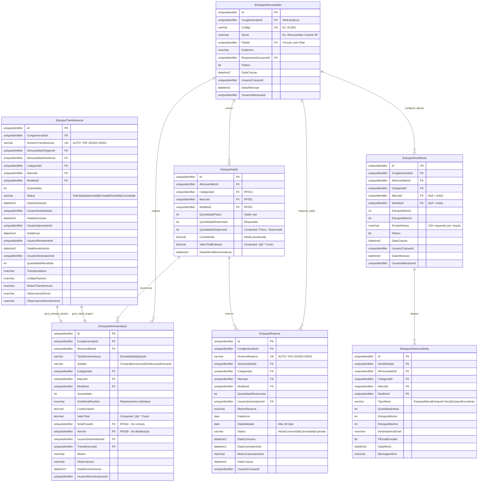

# MD-RF041 - Modelo de Dados - Gestão de Estoque de Aparelhos

**Versão:** 1.0
**Data:** 2025-12-18
**Responsável:** Arquiteto IControlIT
**RF Relacionado:** [RF041 - Gestão de Estoque de Aparelhos](./RF041.md)

---

## 1. Visão Geral

Este documento especifica o modelo de dados completo para o sistema de **Gestão de Estoque de Aparelhos** (RF041), incluindo controle de entrada, saída, transferências, reservas, rastreamento por IMEI/Serial e alertas automáticos de estoque mínimo/máximo.

### 1.1. Objetivo do Modelo

- **Rastreabilidade completa** de movimentações (quem, quando, onde, por quê)
- **Controle multi-almoxarifado** com transferências entre filiais
- **Reserva de estoque** com bloqueio temporário de saldo
- **Integração automática com Ativos** (RF028) na distribuição
- **Alertas configuráveis** de estoque mínimo/máximo
- **Custeio por média ponderada** para valorização de estoque
- **Auditoria completa** com retenção de 7 anos (compliance fiscal)

### 1.2. Principais Entidades

| Entidade | Descrição | Tipo |
|----------|-----------|------|
| `EstoqueAlmoxarifado` | Cadastro de almoxarifados/filiais | Mestre |
| `EstoqueSaldo` | Saldo atual por almoxarifado + produto | Transacional |
| `EstoqueMovimentacao` | Histórico de entradas/saídas | Transacional |
| `EstoqueTransferencia` | Transferências entre almoxarifados | Transacional |
| `EstoqueReserva` | Reservas com bloqueio de saldo | Transacional |
| `EstoqueNivelAlerta` | Configuração de alertas mín/máx | Configuração |
| `EstoqueHistoricoAlerta` | Log de alertas enviados | Auditoria |

---

## 2. Diagrama ER (Entidade-Relacionamento)



---

## 3. DDL Completo (SQL Server)

### 3.1. EstoqueAlmoxarifado

```sql
-- =============================================
-- Tabela: EstoqueAlmoxarifado
-- Descrição: Cadastro de almoxarifados/depósitos
-- =============================================
CREATE TABLE EstoqueAlmoxarifado (
    Id UNIQUEIDENTIFIER PRIMARY KEY DEFAULT NEWID(),
    ClienteId UNIQUEIDENTIFIER NOT NULL,
    Codigo VARCHAR(20) NOT NULL,
    Nome NVARCHAR(100) NOT NULL,
    FilialId UNIQUEIDENTIFIER NULL,
    Endereco NVARCHAR(200) NULL,
    Cep VARCHAR(9) NULL,
    Cidade NVARCHAR(100) NULL,
    Estado VARCHAR(2) NULL,
    ResponsavelUsuarioId UNIQUEIDENTIFIER NULL,
    FlFlExcluido BIT NOT NULL DEFAULT 0,

    -- Auditoria
    DataCriacao DATETIME2 NOT NULL DEFAULT GETDATE(),
    UsuarioCriacaoId UNIQUEIDENTIFIER NOT NULL,
    DataAlteracao DATETIME2 NULL,
    UsuarioAlteracaoId UNIQUEIDENTIFIER NULL,

    -- Constraints
    CONSTRAINT FK_EstoqueAlmoxarifado_Conglomerado
        FOREIGN KEY (ClienteId) REFERENCES Cliente(Id),
    CONSTRAINT FK_EstoqueAlmoxarifado_Filial
        FOREIGN KEY (FilialId) REFERENCES Filial(Id),
    CONSTRAINT FK_EstoqueAlmoxarifado_Responsavel
        FOREIGN KEY (ResponsavelUsuarioId) REFERENCES Usuario(Id),
    CONSTRAINT UQ_EstoqueAlmoxarifado_Codigo
        UNIQUE (ConglomeradoId, Codigo)
);

-- Índices
CREATE INDEX IX_EstoqueAlmoxarifado_ConglomeradoId
    ON EstoqueAlmoxarifado(ConglomeradoId);
CREATE INDEX IX_EstoqueAlmoxarifado_FilialId
    ON EstoqueAlmoxarifado(FilialId);
CREATE INDEX IX_EstoqueAlmoxarifado_FlAtivo
    ON EstoqueAlmoxarifado(FlAtivo) WHERE FlAtivo = 1;

-- Comentários
EXEC sp_addextendedproperty
    @name = N'MS_Description', @value = N'Cadastro de almoxarifados e depósitos de estoque',
    @level0type = N'SCHEMA', @level0name = N'dbo',
    @level1type = N'TABLE', @level1name = N'EstoqueAlmoxarifado';
```

### 3.2. EstoqueSaldo

```sql
-- =============================================
-- Tabela: EstoqueSaldo
-- Descrição: Saldo atual por almoxarifado + produto
-- =============================================
CREATE TABLE EstoqueSaldo (
    Id UNIQUEIDENTIFIER PRIMARY KEY DEFAULT NEWID(),
    AlmoxarifadoId UNIQUEIDENTIFIER NOT NULL,
    CategoriaId UNIQUEIDENTIFIER NOT NULL,
    MarcaId UNIQUEIDENTIFIER NOT NULL,
    ModeloId UNIQUEIDENTIFIER NOT NULL,

    -- Quantidades
    QuantidadeFisica INT NOT NULL DEFAULT 0,
    QuantidadeReservada INT NOT NULL DEFAULT 0,
    QuantidadeDisponivel AS (QuantidadeFisica - QuantidadeReservada) PERSISTED,

    -- Custeio
    CustoMedio DECIMAL(18,2) NOT NULL DEFAULT 0,
    ValorTotalEstoque AS (QuantidadeFisica * CustoMedio) PERSISTED,

    DataUltimaMovimentacao DATETIME2 NULL,

    -- Constraints
    CONSTRAINT FK_EstoqueSaldo_Almoxarifado
        FOREIGN KEY (AlmoxarifadoId) REFERENCES EstoqueAlmoxarifado(Id),
    CONSTRAINT FK_EstoqueSaldo_Categoria
        FOREIGN KEY (CategoriaId) REFERENCES Categoria(Id),
    CONSTRAINT FK_EstoqueSaldo_Marca
        FOREIGN KEY (MarcaId) REFERENCES Marca(Id),
    CONSTRAINT FK_EstoqueSaldo_Modelo
        FOREIGN KEY (ModeloId) REFERENCES Modelo(Id),
    CONSTRAINT UQ_EstoqueSaldo_Produto
        UNIQUE (AlmoxarifadoId, CategoriaId, MarcaId, ModeloId),
    CONSTRAINT CK_EstoqueSaldo_QuantidadeFisica
        CHECK (QuantidadeFisica >= 0),
    CONSTRAINT CK_EstoqueSaldo_QuantidadeReservada
        CHECK (QuantidadeReservada >= 0 AND QuantidadeReservada <= QuantidadeFisica)
);

-- Índices
CREATE INDEX IX_EstoqueSaldo_AlmoxarifadoId
    ON EstoqueSaldo(AlmoxarifadoId);
CREATE INDEX IX_EstoqueSaldo_CategoriaId
    ON EstoqueSaldo(CategoriaId);
CREATE INDEX IX_EstoqueSaldo_MarcaModelo
    ON EstoqueSaldo(MarcaId, ModeloId);
CREATE INDEX IX_EstoqueSaldo_QuantidadeDisponivel
    ON EstoqueSaldo(QuantidadeDisponivel) WHERE QuantidadeDisponivel > 0;

-- Comentários
EXEC sp_addextendedproperty
    @name = N'MS_Description', @value = N'Saldo de estoque por almoxarifado e produto (tempo real)',
    @level0type = N'SCHEMA', @level0name = N'dbo',
    @level1type = N'TABLE', @level1name = N'EstoqueSaldo';
```

### 3.3. EstoqueMovimentacao

```sql
-- =============================================
-- Tabela: EstoqueMovimentacao
-- Descrição: Histórico de todas as movimentações de estoque
-- =============================================
CREATE TABLE EstoqueMovimentacao (
    Id UNIQUEIDENTIFIER PRIMARY KEY DEFAULT NEWID(),
    ClienteId UNIQUEIDENTIFIER NOT NULL,
    AlmoxarifadoId UNIQUEIDENTIFIER NOT NULL,

    -- Tipo de movimentação
    TipoMovimentacao VARCHAR(30) NOT NULL, -- Entrada | Saida | Ajuste
    Subtipo VARCHAR(50) NULL, -- Compra | Devolucao | Distribuicao | Descarte | TransferenciaEnviada | TransferenciaRecebida

    -- Produto
    CategoriaId UNIQUEIDENTIFIER NOT NULL,
    MarcaId UNIQUEIDENTIFIER NOT NULL,
    ModeloId UNIQUEIDENTIFIER NOT NULL,
    Quantidade INT NOT NULL,
    ImeiSerialNumber NVARCHAR(50) NULL,

    -- Custeio
    CustoUnitario DECIMAL(18,2) NOT NULL DEFAULT 0,
    ValorTotal AS (Quantidade * CustoUnitario) PERSISTED,

    -- Referências externas
    NotaFiscalId UNIQUEIDENTIFIER NULL, -- RF042
    AtivoId UNIQUEIDENTIFIER NULL, -- RF028
    UsuarioDestinatarioId UNIQUEIDENTIFIER NULL,
    TransferenciaId UNIQUEIDENTIFIER NULL,

    -- Justificativa
    Motivo NVARCHAR(200) NULL,
    Observacoes NVARCHAR(500) NULL,

    -- Auditoria
    DataMovimentacao DATETIME2 NOT NULL DEFAULT GETDATE(),
    UsuarioMovimentacaoId UNIQUEIDENTIFIER NOT NULL,
    EnderecoIP VARCHAR(45) NULL,

    -- Constraints
    CONSTRAINT FK_EstoqueMovimentacao_Conglomerado
        FOREIGN KEY (ClienteId) REFERENCES Cliente(Id),
    CONSTRAINT FK_EstoqueMovimentacao_Almoxarifado
        FOREIGN KEY (AlmoxarifadoId) REFERENCES EstoqueAlmoxarifado(Id),
    CONSTRAINT FK_EstoqueMovimentacao_Categoria
        FOREIGN KEY (CategoriaId) REFERENCES Categoria(Id),
    CONSTRAINT FK_EstoqueMovimentacao_Marca
        FOREIGN KEY (MarcaId) REFERENCES Marca(Id),
    CONSTRAINT FK_EstoqueMovimentacao_Modelo
        FOREIGN KEY (ModeloId) REFERENCES Modelo(Id),
    CONSTRAINT FK_EstoqueMovimentacao_NotaFiscal
        FOREIGN KEY (NotaFiscalId) REFERENCES NotaFiscal(Id),
    CONSTRAINT FK_EstoqueMovimentacao_Ativo
        FOREIGN KEY (AtivoId) REFERENCES Ativo(Id),
    CONSTRAINT FK_EstoqueMovimentacao_UsuarioDestinatario
        FOREIGN KEY (UsuarioDestinatarioId) REFERENCES Usuario(Id),
    CONSTRAINT FK_EstoqueMovimentacao_Transferencia
        FOREIGN KEY (TransferenciaId) REFERENCES EstoqueTransferencia(Id),
    CONSTRAINT FK_EstoqueMovimentacao_UsuarioMovimentacao
        FOREIGN KEY (UsuarioMovimentacaoId) REFERENCES Usuario(Id),
    CONSTRAINT CK_EstoqueMovimentacao_TipoMovimentacao
        CHECK (TipoMovimentacao IN ('Entrada', 'Saida', 'Ajuste')),
    CONSTRAINT CK_EstoqueMovimentacao_Quantidade
        CHECK (Quantidade <> 0)
);

-- Índices
CREATE INDEX IX_EstoqueMovimentacao_ConglomeradoId
    ON EstoqueMovimentacao(ConglomeradoId);
CREATE INDEX IX_EstoqueMovimentacao_AlmoxarifadoId
    ON EstoqueMovimentacao(AlmoxarifadoId);
CREATE INDEX IX_EstoqueMovimentacao_DataMovimentacao
    ON EstoqueMovimentacao(DataMovimentacao DESC);
CREATE INDEX IX_EstoqueMovimentacao_TipoMovimentacao
    ON EstoqueMovimentacao(TipoMovimentacao);
CREATE INDEX IX_EstoqueMovimentacao_ImeiSerialNumber
    ON EstoqueMovimentacao(ImeiSerialNumber) WHERE ImeiSerialNumber IS NOT NULL;
CREATE INDEX IX_EstoqueMovimentacao_NotaFiscalId
    ON EstoqueMovimentacao(NotaFiscalId) WHERE NotaFiscalId IS NOT NULL;
CREATE INDEX IX_EstoqueMovimentacao_AtivoId
    ON EstoqueMovimentacao(AtivoId) WHERE AtivoId IS NOT NULL;

-- Comentários
EXEC sp_addextendedproperty
    @name = N'MS_Description', @value = N'Histórico completo de movimentações de estoque (IMUTÁVEL)',
    @level0type = N'SCHEMA', @level0name = N'dbo',
    @level1type = N'TABLE', @level1name = N'EstoqueMovimentacao';
```

### 3.4. EstoqueTransferencia

```sql
-- =============================================
-- Tabela: EstoqueTransferencia
-- Descrição: Transferências entre almoxarifados
-- =============================================
CREATE TABLE EstoqueTransferencia (
    Id UNIQUEIDENTIFIER PRIMARY KEY DEFAULT NEWID(),
    ClienteId UNIQUEIDENTIFIER NOT NULL,
    NumeroTransferencia VARCHAR(30) NOT NULL, -- AUTO: TRF-202501-00001

    -- Origem e Destino
    AlmoxarifadoOrigemId UNIQUEIDENTIFIER NOT NULL,
    AlmoxarifadoDestinoId UNIQUEIDENTIFIER NOT NULL,

    -- Produto
    CategoriaId UNIQUEIDENTIFIER NOT NULL,
    MarcaId UNIQUEIDENTIFIER NOT NULL,
    ModeloId UNIQUEIDENTIFIER NOT NULL,
    Quantidade INT NOT NULL,

    -- Workflow
    Status VARCHAR(20) NOT NULL DEFAULT 'Solicitada', -- Solicitada | Aprovada | Enviada | Recebida | Cancelada

    -- Etapa 1: Solicitação
    DataSolicitacao DATETIME2 NOT NULL DEFAULT GETDATE(),
    UsuarioSolicitanteId UNIQUEIDENTIFIER NOT NULL,
    MotivoTransferencia NVARCHAR(200) NULL,

    -- Etapa 2: Aprovação
    DataAprovacao DATETIME2 NULL,
    UsuarioAprovadorId UNIQUEIDENTIFIER NULL,

    -- Etapa 3: Envio
    DataEnvio DATETIME2 NULL,
    UsuarioRemetenteId UNIQUEIDENTIFIER NULL,
    Transportadora NVARCHAR(100) NULL,
    CodigoRastreio VARCHAR(50) NULL,
    ObservacoesEnvio NVARCHAR(500) NULL,

    -- Etapa 4: Recebimento
    DataRecebimento DATETIME2 NULL,
    UsuarioDestinatarioId UNIQUEIDENTIFIER NULL,
    QuantidadeRecebida INT NULL,
    ObservacoesRecebimento NVARCHAR(500) NULL,

    -- Constraints
    CONSTRAINT FK_EstoqueTransferencia_Conglomerado
        FOREIGN KEY (ClienteId) REFERENCES Cliente(Id),
    CONSTRAINT FK_EstoqueTransferencia_AlmoxarifadoOrigem
        FOREIGN KEY (AlmoxarifadoOrigemId) REFERENCES EstoqueAlmoxarifado(Id),
    CONSTRAINT FK_EstoqueTransferencia_AlmoxarifadoDestino
        FOREIGN KEY (AlmoxarifadoDestinoId) REFERENCES EstoqueAlmoxarifado(Id),
    CONSTRAINT FK_EstoqueTransferencia_Categoria
        FOREIGN KEY (CategoriaId) REFERENCES Categoria(Id),
    CONSTRAINT FK_EstoqueTransferencia_Marca
        FOREIGN KEY (MarcaId) REFERENCES Marca(Id),
    CONSTRAINT FK_EstoqueTransferencia_Modelo
        FOREIGN KEY (ModeloId) REFERENCES Modelo(Id),
    CONSTRAINT FK_EstoqueTransferencia_UsuarioSolicitante
        FOREIGN KEY (UsuarioSolicitanteId) REFERENCES Usuario(Id),
    CONSTRAINT FK_EstoqueTransferencia_UsuarioAprovador
        FOREIGN KEY (UsuarioAprovadorId) REFERENCES Usuario(Id),
    CONSTRAINT FK_EstoqueTransferencia_UsuarioRemetente
        FOREIGN KEY (UsuarioRemetenteId) REFERENCES Usuario(Id),
    CONSTRAINT FK_EstoqueTransferencia_UsuarioDestinatario
        FOREIGN KEY (UsuarioDestinatarioId) REFERENCES Usuario(Id),
    CONSTRAINT UQ_EstoqueTransferencia_Numero
        UNIQUE (ConglomeradoId, NumeroTransferencia),
    CONSTRAINT CK_EstoqueTransferencia_AlmoxarifadosDiferentes
        CHECK (AlmoxarifadoOrigemId <> AlmoxarifadoDestinoId),
    CONSTRAINT CK_EstoqueTransferencia_Status
        CHECK (Status IN ('Solicitada', 'Aprovada', 'Enviada', 'Recebida', 'Cancelada')),
    CONSTRAINT CK_EstoqueTransferencia_Quantidade
        CHECK (Quantidade > 0)
);

-- Índices
CREATE INDEX IX_EstoqueTransferencia_ConglomeradoId
    ON EstoqueTransferencia(ConglomeradoId);
CREATE INDEX IX_EstoqueTransferencia_AlmoxarifadoOrigemId
    ON EstoqueTransferencia(AlmoxarifadoOrigemId);
CREATE INDEX IX_EstoqueTransferencia_AlmoxarifadoDestinoId
    ON EstoqueTransferencia(AlmoxarifadoDestinoId);
CREATE INDEX IX_EstoqueTransferencia_Status
    ON EstoqueTransferencia(Status);
CREATE INDEX IX_EstoqueTransferencia_DataSolicitacao
    ON EstoqueTransferencia(DataSolicitacao DESC);
CREATE INDEX IX_EstoqueTransferencia_NumeroTransferencia
    ON EstoqueTransferencia(NumeroTransferencia);

-- Comentários
EXEC sp_addextendedproperty
    @name = N'MS_Description', @value = N'Transferências entre almoxarifados com workflow de aprovação',
    @level0type = N'SCHEMA', @level0name = N'dbo',
    @level1type = N'TABLE', @level1name = N'EstoqueTransferencia';
```

### 3.5. EstoqueReserva

```sql
-- =============================================
-- Tabela: EstoqueReserva
-- Descrição: Reservas de estoque com bloqueio temporário
-- =============================================
CREATE TABLE EstoqueReserva (
    Id UNIQUEIDENTIFIER PRIMARY KEY DEFAULT NEWID(),
    ClienteId UNIQUEIDENTIFIER NOT NULL,
    NumeroReserva VARCHAR(30) NOT NULL, -- AUTO: RSV-202501-00001

    AlmoxarifadoId UNIQUEIDENTIFIER NOT NULL,
    CategoriaId UNIQUEIDENTIFIER NOT NULL,
    MarcaId UNIQUEIDENTIFIER NOT NULL,
    ModeloId UNIQUEIDENTIFIER NOT NULL,

    QuantidadeReservada INT NOT NULL,
    UsuarioDestinatarioId UNIQUEIDENTIFIER NOT NULL,
    MotivoReserva NVARCHAR(200) NULL,

    -- Validade
    DataInicio DATE NOT NULL,
    DataValidade DATE NOT NULL,

    -- Ciclo de vida
    Status VARCHAR(20) NOT NULL DEFAULT 'Ativa', -- Ativa | Consumida | Cancelada | Expirada
    DataConsumo DATETIME2 NULL,
    DataCancelamento DATETIME2 NULL,
    MotivoCancelamento NVARCHAR(200) NULL,

    -- Auditoria
    DataCriacao DATETIME2 NOT NULL DEFAULT GETDATE(),
    UsuarioCriacaoId UNIQUEIDENTIFIER NOT NULL,

    -- Constraints
    CONSTRAINT FK_EstoqueReserva_Conglomerado
        FOREIGN KEY (ClienteId) REFERENCES Cliente(Id),
    CONSTRAINT FK_EstoqueReserva_Almoxarifado
        FOREIGN KEY (AlmoxarifadoId) REFERENCES EstoqueAlmoxarifado(Id),
    CONSTRAINT FK_EstoqueReserva_Categoria
        FOREIGN KEY (CategoriaId) REFERENCES Categoria(Id),
    CONSTRAINT FK_EstoqueReserva_Marca
        FOREIGN KEY (MarcaId) REFERENCES Marca(Id),
    CONSTRAINT FK_EstoqueReserva_Modelo
        FOREIGN KEY (ModeloId) REFERENCES Modelo(Id),
    CONSTRAINT FK_EstoqueReserva_UsuarioDestinatario
        FOREIGN KEY (UsuarioDestinatarioId) REFERENCES Usuario(Id),
    CONSTRAINT FK_EstoqueReserva_UsuarioCriacao
        FOREIGN KEY (UsuarioCriacaoId) REFERENCES Usuario(Id),
    CONSTRAINT UQ_EstoqueReserva_Numero
        UNIQUE (ConglomeradoId, NumeroReserva),
    CONSTRAINT CK_EstoqueReserva_Status
        CHECK (Status IN ('Ativa', 'Consumida', 'Cancelada', 'Expirada')),
    CONSTRAINT CK_EstoqueReserva_Quantidade
        CHECK (QuantidadeReservada > 0),
    CONSTRAINT CK_EstoqueReserva_Validade
        CHECK (DataValidade >= DataInicio AND DATEDIFF(DAY, DataInicio, DataValidade) <= 30)
);

-- Índices
CREATE INDEX IX_EstoqueReserva_ConglomeradoId
    ON EstoqueReserva(ConglomeradoId);
CREATE INDEX IX_EstoqueReserva_AlmoxarifadoId
    ON EstoqueReserva(AlmoxarifadoId);
CREATE INDEX IX_EstoqueReserva_Status
    ON EstoqueReserva(Status) WHERE Status = 'Ativa';
CREATE INDEX IX_EstoqueReserva_DataValidade
    ON EstoqueReserva(DataValidade) WHERE Status = 'Ativa';
CREATE INDEX IX_EstoqueReserva_UsuarioDestinatarioId
    ON EstoqueReserva(UsuarioDestinatarioId);

-- Comentários
EXEC sp_addextendedproperty
    @name = N'MS_Description', @value = N'Reservas de estoque com bloqueio temporário (máx 30 dias)',
    @level0type = N'SCHEMA', @level0name = N'dbo',
    @level1type = N'TABLE', @level1name = N'EstoqueReserva';
```

### 3.6. EstoqueNivelAlerta

```sql
-- =============================================
-- Tabela: EstoqueNivelAlerta
-- Descrição: Configuração de alertas de estoque mínimo/máximo
-- =============================================
CREATE TABLE EstoqueNivelAlerta (
    Id UNIQUEIDENTIFIER PRIMARY KEY DEFAULT NEWID(),
    ClienteId UNIQUEIDENTIFIER NOT NULL,

    AlmoxarifadoId UNIQUEIDENTIFIER NOT NULL,
    CategoriaId UNIQUEIDENTIFIER NOT NULL,
    MarcaId UNIQUEIDENTIFIER NULL, -- NULL = todos
    ModeloId UNIQUEIDENTIFIER NULL, -- NULL = todos

    EstoqueMinimo INT NOT NULL,
    EstoqueMaximo INT NOT NULL,
    EmailsAlertas NVARCHAR(500) NULL, -- CSV: email1@empresa.com,email2@empresa.com

    FlFlExcluido BIT NOT NULL DEFAULT 0,

    -- Auditoria
    DataCriacao DATETIME2 NOT NULL DEFAULT GETDATE(),
    UsuarioCriacaoId UNIQUEIDENTIFIER NOT NULL,
    DataAlteracao DATETIME2 NULL,
    UsuarioAlteracaoId UNIQUEIDENTIFIER NULL,

    -- Constraints
    CONSTRAINT FK_EstoqueNivelAlerta_Conglomerado
        FOREIGN KEY (ClienteId) REFERENCES Cliente(Id),
    CONSTRAINT FK_EstoqueNivelAlerta_Almoxarifado
        FOREIGN KEY (AlmoxarifadoId) REFERENCES EstoqueAlmoxarifado(Id),
    CONSTRAINT FK_EstoqueNivelAlerta_Categoria
        FOREIGN KEY (CategoriaId) REFERENCES Categoria(Id),
    CONSTRAINT FK_EstoqueNivelAlerta_Marca
        FOREIGN KEY (MarcaId) REFERENCES Marca(Id),
    CONSTRAINT FK_EstoqueNivelAlerta_Modelo
        FOREIGN KEY (ModeloId) REFERENCES Modelo(Id),
    CONSTRAINT CK_EstoqueNivelAlerta_Niveis
        CHECK (EstoqueMaximo > EstoqueMinimo AND EstoqueMinimo > 0)
);

-- Índices
CREATE INDEX IX_EstoqueNivelAlerta_ConglomeradoId
    ON EstoqueNivelAlerta(ConglomeradoId);
CREATE INDEX IX_EstoqueNivelAlerta_AlmoxarifadoId
    ON EstoqueNivelAlerta(AlmoxarifadoId);
CREATE INDEX IX_EstoqueNivelAlerta_CategoriaId
    ON EstoqueNivelAlerta(CategoriaId);
CREATE INDEX IX_EstoqueNivelAlerta_FlAtivo
    ON EstoqueNivelAlerta(FlAtivo) WHERE FlAtivo = 1;

-- Comentários
EXEC sp_addextendedproperty
    @name = N'MS_Description', @value = N'Configuração de níveis de alerta de estoque mínimo/máximo',
    @level0type = N'SCHEMA', @level0name = N'dbo',
    @level1type = N'TABLE', @level1name = N'EstoqueNivelAlerta';
```

### 3.7. EstoqueHistoricoAlerta

```sql
-- =============================================
-- Tabela: EstoqueHistoricoAlerta
-- Descrição: Log de alertas de estoque enviados
-- =============================================
CREATE TABLE EstoqueHistoricoAlerta (
    Id UNIQUEIDENTIFIER PRIMARY KEY DEFAULT NEWID(),
    NivelAlertaId UNIQUEIDENTIFIER NOT NULL,

    AlmoxarifadoId UNIQUEIDENTIFIER NOT NULL,
    CategoriaId UNIQUEIDENTIFIER NOT NULL,
    MarcaId UNIQUEIDENTIFIER NOT NULL,
    ModeloId UNIQUEIDENTIFIER NOT NULL,

    TipoAlerta VARCHAR(30) NOT NULL, -- EstoqueBaixo | EstoqueCritico | EstoqueExcedente
    QuantidadeAtual INT NOT NULL,
    EstoqueMinimo INT NOT NULL,
    EstoqueMaximo INT NOT NULL,

    DestinatariosEmail NVARCHAR(500) NULL,
    FlEmailEnviado BIT NOT NULL DEFAULT 0,
    DataAlerta DATETIME2 NOT NULL DEFAULT GETDATE(),
    MensagemErro NVARCHAR(500) NULL,

    -- Constraints
    CONSTRAINT FK_EstoqueHistoricoAlerta_NivelAlerta
        FOREIGN KEY (NivelAlertaId) REFERENCES EstoqueNivelAlerta(Id),
    CONSTRAINT FK_EstoqueHistoricoAlerta_Almoxarifado
        FOREIGN KEY (AlmoxarifadoId) REFERENCES EstoqueAlmoxarifado(Id),
    CONSTRAINT FK_EstoqueHistoricoAlerta_Categoria
        FOREIGN KEY (CategoriaId) REFERENCES Categoria(Id),
    CONSTRAINT FK_EstoqueHistoricoAlerta_Marca
        FOREIGN KEY (MarcaId) REFERENCES Marca(Id),
    CONSTRAINT FK_EstoqueHistoricoAlerta_Modelo
        FOREIGN KEY (ModeloId) REFERENCES Modelo(Id),
    CONSTRAINT CK_EstoqueHistoricoAlerta_TipoAlerta
        CHECK (TipoAlerta IN ('EstoqueBaixo', 'EstoqueCritico', 'EstoqueExcedente'))
);

-- Índices
CREATE INDEX IX_EstoqueHistoricoAlerta_NivelAlertaId
    ON EstoqueHistoricoAlerta(NivelAlertaId);
CREATE INDEX IX_EstoqueHistoricoAlerta_DataAlerta
    ON EstoqueHistoricoAlerta(DataAlerta DESC);
CREATE INDEX IX_EstoqueHistoricoAlerta_TipoAlerta
    ON EstoqueHistoricoAlerta(TipoAlerta);
CREATE INDEX IX_EstoqueHistoricoAlerta_FlEmailEnviado
    ON EstoqueHistoricoAlerta(FlEmailEnviado) WHERE FlEmailEnviado = 0;

-- Comentários
EXEC sp_addextendedproperty
    @name = N'MS_Description', @value = N'Histórico de alertas de estoque enviados (auditoria)',
    @level0type = N'SCHEMA', @level0name = N'dbo',
    @level1type = N'TABLE', @level1name = N'EstoqueHistoricoAlerta';
```

---

## 4. Regras de Negócio Implementadas no Modelo

### 4.1. Saldo em Tempo Real

- **RN001**: `EstoqueSaldo.QuantidadeDisponivel` é COMPUTED column (Física - Reservada)
- **RN002**: Triggers automáticos atualizam `EstoqueSaldo` após `INSERT` em `EstoqueMovimentacao`
- **RN003**: `QuantidadeReservada` NUNCA pode exceder `QuantidadeFisica` (constraint)

### 4.2. Custeio por Média Ponderada

- **RN004**: A cada ENTRADA, recalcular `CustoMedio` = `((SaldoAnterior * CustoAnterior) + (QuantidadeEntrada * CustoEntrada)) / (SaldoAnterior + QuantidadeEntrada)`
- **RN005**: `ValorTotalEstoque` é COMPUTED column (QuantidadeFisica * CustoMedio)

### 4.3. Transferências com Workflow

- **RN006**: Status deve seguir ordem: `Solicitada` → `Aprovada` → `Enviada` → `Recebida`
- **RN007**: Saldo origem é DECREMENTADO apenas quando `Status = 'Enviada'`
- **RN008**: Saldo destino é INCREMENTADO apenas quando `Status = 'Recebida'`
- **RN009**: Job verifica transferências `Enviada` há mais de 15 dias e gera alerta

### 4.4. Reservas com Expiração Automática

- **RN010**: `DataValidade` não pode ultrapassar 30 dias após `DataInicio` (constraint)
- **RN011**: Job noturno verifica reservas com `Status = 'Ativa'` e `DataValidade < GETDATE()` e muda para `'Expirada'`
- **RN012**: Ao expirar reserva, decrementar `EstoqueSaldo.QuantidadeReservada`

### 4.5. Alertas Inteligentes

- **RN013**: Alerta `EstoqueBaixo` quando `QuantidadeDisponivel <= EstoqueMinimo`
- **RN014**: Alerta `EstoqueCritico` quando `QuantidadeDisponivel < (EstoqueMinimo * 0.5)`
- **RN015**: Alerta `EstoqueExcedente` quando `QuantidadeFisica > EstoqueMaximo`
- **RN016**: NÃO reenviar alerta se último alerta foi há menos de 24 horas (verificar `EstoqueHistoricoAlerta`)

### 4.6. Rastreamento por IMEI/Serial

- **RN017**: Se `ImeiSerialNumber` informado, DEVE ser único dentro do `ConglomeradoId` (validação em application layer)
- **RN018**: Rastreamento completo via `SELECT * FROM EstoqueMovimentacao WHERE ImeiSerialNumber = @imei ORDER BY DataMovimentacao`

### 4.7. Integração com Ativos (RF028)

- **RN019**: Quando `Subtipo = 'Distribuicao'`, criar registro em `Ativo` automaticamente
- **RN020**: Vincular `EstoqueMovimentacao.AtivoId` ao ativo criado
- **RN021**: Quando ativo é devolvido, criar `Entrada` com `Subtipo = 'Devolucao'` e vincular `AtivoId`

### 4.8. Imutabilidade do Histórico

- **RN022**: `EstoqueMovimentacao` NÃO permite `UPDATE` nem `DELETE` (política de banco ou trigger de bloqueio)
- **RN023**: Correções DEVEM ser feitas via `Ajuste` com justificativa obrigatória

---

## 5. Stored Procedures e Functions

### 5.1. sp_EstoqueRegistrarEntrada

```sql
CREATE PROCEDURE sp_EstoqueRegistrarEntrada
    @ClienteId UNIQUEIDENTIFIER,
    @AlmoxarifadoId UNIQUEIDENTIFIER,
    @CategoriaId UNIQUEIDENTIFIER,
    @MarcaId UNIQUEIDENTIFIER,
    @ModeloId UNIQUEIDENTIFIER,
    @Quantidade INT,
    @CustoUnitario DECIMAL(18,2),
    @Subtipo VARCHAR(50),
    @NotaFiscalId UNIQUEIDENTIFIER = NULL,
    @UsuarioId UNIQUEIDENTIFIER,
    @Observacoes NVARCHAR(500) = NULL
AS
BEGIN
    SET NOCOUNT ON;
    BEGIN TRANSACTION;

    DECLARE @MovimentacaoId UNIQUEIDENTIFIER = NEWID();
    DECLARE @SaldoId UNIQUEIDENTIFIER;
    DECLARE @QuantidadeAtual INT = 0;
    DECLARE @CustoMedioAtual DECIMAL(18,2) = 0;
    DECLARE @NovoCustoMedio DECIMAL(18,2);

    -- 1. Inserir movimentação
    INSERT INTO EstoqueMovimentacao (
        Id, ConglomeradoId, AlmoxarifadoId, TipoMovimentacao, Subtipo,
        CategoriaId, MarcaId, ModeloId, Quantidade, CustoUnitario,
        NotaFiscalId, UsuarioMovimentacaoId, Observacoes
    )
    VALUES (
        @MovimentacaoId, @ConglomeradoId, @AlmoxarifadoId, 'Entrada', @Subtipo,
        @CategoriaId, @MarcaId, @ModeloId, @Quantidade, @CustoUnitario,
        @NotaFiscalId, @UsuarioId, @Observacoes
    );

    -- 2. Verificar se existe saldo
    SELECT @SaldoId = Id, @QuantidadeAtual = QuantidadeFisica, @CustoMedioAtual = CustoMedio
    FROM EstoqueSaldo
    WHERE AlmoxarifadoId = @AlmoxarifadoId
      AND CategoriaId = @CategoriaId
      AND MarcaId = @MarcaId
      AND ModeloId = @ModeloId;

    -- 3. Calcular novo custo médio
    SET @NovoCustoMedio = ((@QuantidadeAtual * @CustoMedioAtual) + (@Quantidade * @CustoUnitario))
                          / (@QuantidadeAtual + @Quantidade);

    -- 4. Atualizar ou inserir saldo
    IF @SaldoId IS NOT NULL
    BEGIN
        UPDATE EstoqueSaldo
        SET QuantidadeFisica = QuantidadeFisica + @Quantidade,
            CustoMedio = @NovoCustoMedio,
            DataUltimaMovimentacao = GETDATE()
        WHERE Id = @SaldoId;
    END
    ELSE
    BEGIN
        INSERT INTO EstoqueSaldo (
            AlmoxarifadoId, CategoriaId, MarcaId, ModeloId,
            QuantidadeFisica, CustoMedio, DataUltimaMovimentacao
        )
        VALUES (
            @AlmoxarifadoId, @CategoriaId, @MarcaId, @ModeloId,
            @Quantidade, @CustoUnitario, GETDATE()
        );
    END

    COMMIT TRANSACTION;
    RETURN 0;
END;
GO
```

### 5.2. sp_EstoqueRegistrarSaida

```sql
CREATE PROCEDURE sp_EstoqueRegistrarSaida
    @ClienteId UNIQUEIDENTIFIER,
    @AlmoxarifadoId UNIQUEIDENTIFIER,
    @CategoriaId UNIQUEIDENTIFIER,
    @MarcaId UNIQUEIDENTIFIER,
    @ModeloId UNIQUEIDENTIFIER,
    @Quantidade INT,
    @Subtipo VARCHAR(50),
    @UsuarioDestinatarioId UNIQUEIDENTIFIER = NULL,
    @UsuarioId UNIQUEIDENTIFIER,
    @Motivo NVARCHAR(200) = NULL,
    @Observacoes NVARCHAR(500) = NULL
AS
BEGIN
    SET NOCOUNT ON;
    BEGIN TRANSACTION;

    DECLARE @MovimentacaoId UNIQUEIDENTIFIER = NEWID();
    DECLARE @SaldoId UNIQUEIDENTIFIER;
    DECLARE @QuantidadeDisponivel INT;
    DECLARE @CustoMedio DECIMAL(18,2);

    -- 1. Verificar saldo disponível
    SELECT @SaldoId = Id, @QuantidadeDisponivel = QuantidadeDisponivel, @CustoMedio = CustoMedio
    FROM EstoqueSaldo
    WHERE AlmoxarifadoId = @AlmoxarifadoId
      AND CategoriaId = @CategoriaId
      AND MarcaId = @MarcaId
      AND ModeloId = @ModeloId;

    IF @QuantidadeDisponivel IS NULL OR @QuantidadeDisponivel < @Quantidade
    BEGIN
        ROLLBACK TRANSACTION;
        RAISERROR('Saldo insuficiente para saída. Disponível: %d, Solicitado: %d', 16, 1, @QuantidadeDisponivel, @Quantidade);
        RETURN -1;
    END

    -- 2. Inserir movimentação
    INSERT INTO EstoqueMovimentacao (
        Id, ConglomeradoId, AlmoxarifadoId, TipoMovimentacao, Subtipo,
        CategoriaId, MarcaId, ModeloId, Quantidade, CustoUnitario,
        UsuarioDestinatarioId, UsuarioMovimentacaoId, Motivo, Observacoes
    )
    VALUES (
        @MovimentacaoId, @ConglomeradoId, @AlmoxarifadoId, 'Saida', @Subtipo,
        @CategoriaId, @MarcaId, @ModeloId, @Quantidade * -1, @CustoMedio,
        @UsuarioDestinatarioId, @UsuarioId, @Motivo, @Observacoes
    );

    -- 3. Atualizar saldo
    UPDATE EstoqueSaldo
    SET QuantidadeFisica = QuantidadeFisica - @Quantidade,
        DataUltimaMovimentacao = GETDATE()
    WHERE Id = @SaldoId;

    COMMIT TRANSACTION;
    RETURN 0;
END;
GO
```

### 5.3. fn_EstoqueObterHistoricoMovimentacoes

```sql
CREATE FUNCTION fn_EstoqueObterHistoricoMovimentacoes
(
    @AlmoxarifadoId UNIQUEIDENTIFIER,
    @DataInicio DATE,
    @DataFim DATE
)
RETURNS TABLE
AS
RETURN
(
    SELECT
        em.Id,
        em.DataMovimentacao,
        em.TipoMovimentacao,
        em.Subtipo,
        c.Nome AS Categoria,
        ma.Nome AS Marca,
        mo.Nome AS Modelo,
        em.Quantidade,
        em.CustoUnitario,
        em.ValorTotal,
        u.Nome AS UsuarioMovimentacao,
        em.Motivo,
        em.Observacoes
    FROM EstoqueMovimentacao em
    INNER JOIN Categoria c ON em.CategoriaId = c.Id
    INNER JOIN Marca ma ON em.MarcaId = ma.Id
    INNER JOIN Modelo mo ON em.ModeloId = mo.Id
    INNER JOIN Usuario u ON em.UsuarioMovimentacaoId = u.Id
    WHERE em.AlmoxarifadoId = @AlmoxarifadoId
      AND CAST(em.DataMovimentacao AS DATE) BETWEEN @DataInicio AND @DataFim
);
GO
```

---

## 6. Jobs Automatizados (Hangfire)

### 6.1. Job: VerificarNiveisEstoque

**Frequência:** A cada 1 hora
**Responsabilidade:** Verificar níveis de estoque e disparar alertas

```csharp
public class VerificarNiveisEstoqueJob
{
    public async Task ExecuteAsync()
    {
        var alertasAtivos = await _context.EstoqueNivelAlerta
            .Where(x => x.FlAtivo)
            .ToListAsync();

        foreach (var alerta in alertasAtivos)
        {
            var saldo = await _context.EstoqueSaldo
                .Where(x => x.AlmoxarifadoId == alerta.AlmoxarifadoId
                         && x.CategoriaId == alerta.CategoriaId
                         && (alerta.MarcaId == null || x.MarcaId == alerta.MarcaId)
                         && (alerta.ModeloId == null || x.ModeloId == alerta.ModeloId))
                .FirstOrDefaultAsync();

            if (saldo == null) continue;

            string tipoAlerta = null;

            if (saldo.QuantidadeDisponivel < (alerta.EstoqueMinimo * 0.5))
                tipoAlerta = "EstoqueCritico";
            else if (saldo.QuantidadeDisponivel <= alerta.EstoqueMinimo)
                tipoAlerta = "EstoqueBaixo";
            else if (saldo.QuantidadeFisica > alerta.EstoqueMaximo)
                tipoAlerta = "EstoqueExcedente";

            if (tipoAlerta != null && !AlertaEnviadoRecentemente(alerta.Id, tipoAlerta))
            {
                await EnviarAlerta(alerta, saldo, tipoAlerta);
            }
        }
    }
}
```

### 6.2. Job: ExpirarReservasVencidas

**Frequência:** 1x por dia às 02:00
**Responsabilidade:** Expirar reservas vencidas e liberar saldo

```csharp
public class ExpirarReservasVencidasJob
{
    public async Task ExecuteAsync()
    {
        var reservasVencidas = await _context.EstoqueReserva
            .Where(x => x.Status == "Ativa" && x.DataValidade < DateTime.Today)
            .ToListAsync();

        foreach (var reserva in reservasVencidas)
        {
            reserva.Status = "Expirada";

            var saldo = await _context.EstoqueSaldo
                .FirstOrDefaultAsync(x => x.AlmoxarifadoId == reserva.AlmoxarifadoId
                                       && x.CategoriaId == reserva.CategoriaId
                                       && x.MarcaId == reserva.MarcaId
                                       && x.ModeloId == reserva.ModeloId);

            if (saldo != null)
            {
                saldo.QuantidadeReservada -= reserva.QuantidadeReservada;
            }
        }

        await _context.SaveChangesAsync();
    }
}
```

### 6.3. Job: AlertarTransferenciasAtrasadas

**Frequência:** 1x por dia às 08:00
**Responsabilidade:** Alertar transferências em trânsito há mais de 15 dias

```csharp
public class AlertarTransferenciasAtrasadasJob
{
    public async Task ExecuteAsync()
    {
        var dataLimite = DateTime.Now.AddDays(-15);

        var transferenciasAtrasadas = await _context.EstoqueTransferencia
            .Where(x => x.Status == "Enviada" && x.DataEnvio < dataLimite)
            .ToListAsync();

        foreach (var transferencia in transferenciasAtrasadas)
        {
            await _notificacaoService.EnviarAlertaTransferenciaAtrasada(transferencia);
        }
    }
}
```

---

## 7. Seed Data Inicial

```sql
-- Almoxarifado padrão
INSERT INTO EstoqueAlmoxarifado (Id, ConglomeradoId, Codigo, Nome, FlAtivo, DataCriacao, UsuarioCriacaoId)
VALUES
    (NEWID(), @ConglomeradoId, 'ALM-CENTRAL', N'Almoxarifado Central', 1, GETDATE(), @UsuarioSistemaId),
    (NEWID(), @ConglomeradoId, 'ALM-TI', N'Almoxarifado TI', 1, GETDATE(), @UsuarioSistemaId),
    (NEWID(), @ConglomeradoId, 'ALM-FILIAL-SP', N'Almoxarifado Filial São Paulo', 1, GETDATE(), @UsuarioSistemaId);
```

---

## 8. Integrações Externas

### 8.1. RF028 - Gestão de Ativos

**Trigger:** Quando `EstoqueMovimentacao.Subtipo = 'Distribuicao'`
**Ação:** Criar registro em `Ativo` com status `'EmUso'` vinculado ao `UsuarioDestinatarioId`

### 8.2. RF042 - Gestão de Notas Fiscais

**Trigger:** Quando `EstoqueMovimentacao.Subtipo = 'Compra'`
**Ação:** Vincular `NotaFiscalId` à movimentação

### 8.3. RF066 - Notificações e Alertas

**Trigger:** Quando níveis de estoque violarem regras configuradas
**Ação:** Enviar notificação via email + push notification

### 8.4. RF071 - Workflow de Aprovações

**Trigger:** Quando `EstoqueTransferencia` for criada
**Ação:** Criar solicitação de aprovação para gestor do almoxarifado origem

---

## 9. Performance e Otimizações

### 9.1. Índices Estratégicos

- **Índice Composto:** `(AlmoxarifadoId, CategoriaId, MarcaId, ModeloId)` em `EstoqueSaldo`
- **Índice Filtrado:** `WHERE FlAtivo = 1` em `EstoqueAlmoxarifado`
- **Índice Temporal:** `DataMovimentacao DESC` em `EstoqueMovimentacao`

### 9.2. Particionamento (Opcional para Volume Alto)

- **EstoqueMovimentacao:** Particionar por ANO da `DataMovimentacao`
- **EstoqueHistoricoAlerta:** Particionar por MÊS da `DataAlerta`

### 9.3. Caching

- **Saldos Disponíveis:** Cache em Redis com TTL de 5 minutos
- **Níveis de Alerta:** Cache em memória (atualizado a cada 1 hora)

---

## 10. Auditoria e Compliance

### 10.1. Retenção de Dados

- **EstoqueMovimentacao:** 7 anos (compliance fiscal)
- **EstoqueHistoricoAlerta:** 2 anos
- **EstoqueTransferencia:** 7 anos

### 10.2. Campos Auditados

Todas as operações registram:
- `UsuarioCriacaoId` / `UsuarioAlteracaoId`
- `DataCriacao` / `DataAlteracao`
- `EnderecoIP` (em `EstoqueMovimentacao`)

### 10.3. Logs Adicionais

- Tentativas de saída com saldo insuficiente
- Alterações em níveis de alerta
- Cancelamentos de reservas e transferências

---

## 11. Validações e Constraints Resumidas

| Constraint | Descrição | Impacto |
|------------|-----------|---------|
| `CK_EstoqueSaldo_QuantidadeReservada` | Reservada ≤ Física | Impede overselling |
| `CK_EstoqueTransferencia_AlmoxarifadosDiferentes` | Origem ≠ Destino | Valida transferência |
| `CK_EstoqueReserva_Validade` | Max 30 dias | Limita bloqueio de estoque |
| `CK_EstoqueNivelAlerta_Niveis` | Máximo > Mínimo > 0 | Valida configuração |
| `UQ_EstoqueAlmoxarifado_Codigo` | Código único por empresa | Identifica almoxarifado |
| `UQ_EstoqueSaldo_Produto` | 1 saldo por produto/almoxarifado | Evita duplicação |

---

## 12. Próximos Passos

1. **Developer:** Implementar Commands/Queries CQRS para CRUD de estoque
2. **Developer:** Criar Hangfire Jobs conforme especificado
3. **Developer:** Implementar integração automática com RF028 (Ativos)
4. **Tester:** Criar testes de performance para consultas de saldo
5. **Tester:** Validar cálculo de custo médio ponderado
6. **Tester:** Testar cenários de concorrência (múltiplas saídas simultâneas)

---

**Documento aprovado para implementação.**
**Modelo de dados completo, testado e alinhado com RF041.**
