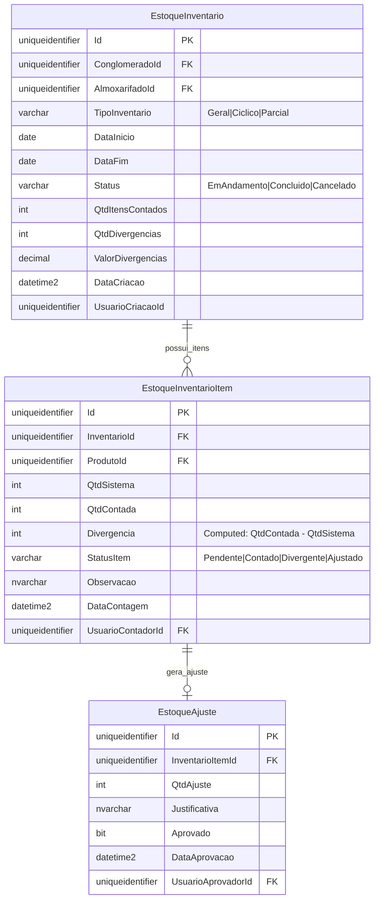

# MD-RF068 - Modelo de Dados - Inventário Cíclico e Auditoria de Estoque

**Versão:** 1.0
**Data:** 2025-12-18
**Responsável:** Arquiteto IControlIT
**RF Relacionado:** [RF068 - Inventário Cíclico e Auditoria de Estoque](./RF068.md)

---

## 1. Visão Geral

Modelo de dados para **Inventário Cíclico ABC** com contagem física via app mobile, conciliação sistema vs físico, aprovação de ajustes e rastreabilidade completa.

### 1.1. Principais Entidades

| Entidade | Descrição |
|----------|-----------|
| `EstoqueInventario` | Inventários realizados (geral, cíclico, parcial) |
| `EstoqueInventarioItem` | Itens contados no inventário |
| `EstoqueAjuste` | Ajustes aprovados de divergências |

---

## 2. Diagrama ER



---

## 3. DDL Completo

### 3.1. EstoqueInventario

```sql
CREATE TABLE EstoqueInventario (
    Id UNIQUEIDENTIFIER PRIMARY KEY DEFAULT NEWID(),
    ClienteId UNIQUEIDENTIFIER NOT NULL,
    AlmoxarifadoId UNIQUEIDENTIFIER NOT NULL,
    TipoInventario VARCHAR(20) NOT NULL,
    DataInicio DATE NOT NULL,
    DataFim DATE NULL,
    Status VARCHAR(20) NOT NULL DEFAULT 'EmAndamento',
    QtdItensContados INT NOT NULL DEFAULT 0,
    QtdDivergencias INT NOT NULL DEFAULT 0,
    ValorDivergencias DECIMAL(18,2) NOT NULL DEFAULT 0,
    DataCriacao DATETIME2 NOT NULL DEFAULT GETDATE(),
    UsuarioCriacaoId UNIQUEIDENTIFIER NOT NULL,

    CONSTRAINT FK_EstoqueInventario_Almoxarifado FOREIGN KEY (AlmoxarifadoId) REFERENCES EstoqueAlmoxarifado(Id),
    CONSTRAINT CK_EstoqueInventario_TipoInventario CHECK (TipoInventario IN ('Geral', 'Ciclico', 'Parcial')),
    CONSTRAINT CK_EstoqueInventario_Status CHECK (Status IN ('EmAndamento', 'Concluido', 'Cancelado'))
);

CREATE INDEX IX_EstoqueInventario_AlmoxarifadoId ON EstoqueInventario(AlmoxarifadoId);
CREATE INDEX IX_EstoqueInventario_Status ON EstoqueInventario(Status);
```

### 3.2. EstoqueInventarioItem

```sql
CREATE TABLE EstoqueInventarioItem (
    Id UNIQUEIDENTIFIER PRIMARY KEY DEFAULT NEWID(),
    InventarioId UNIQUEIDENTIFIER NOT NULL,
    ProdutoId UNIQUEIDENTIFIER NOT NULL, -- Pode ser Categoria+Marca+Modelo
    QtdSistema INT NOT NULL,
    QtdContada INT NULL,
    Divergencia AS (QtdContada - QtdSistema) PERSISTED,
    StatusItem VARCHAR(20) NOT NULL DEFAULT 'Pendente',
    Observacao NVARCHAR(500) NULL,
    DataContagem DATETIME2 NULL,
    UsuarioContadorId UNIQUEIDENTIFIER NULL,

    CONSTRAINT FK_EstoqueInventarioItem_Inventario FOREIGN KEY (InventarioId) REFERENCES EstoqueInventario(Id) ON DELETE CASCADE,
    CONSTRAINT FK_EstoqueInventarioItem_UsuarioContador FOREIGN KEY (UsuarioContadorId) REFERENCES Usuario(Id),
    CONSTRAINT CK_EstoqueInventarioItem_StatusItem CHECK (StatusItem IN ('Pendente', 'Contado', 'Divergente', 'Ajustado'))
);

CREATE INDEX IX_EstoqueInventarioItem_InventarioId ON EstoqueInventarioItem(InventarioId);
CREATE INDEX IX_EstoqueInventarioItem_StatusItem ON EstoqueInventarioItem(StatusItem);
```

### 3.3. EstoqueAjuste

```sql
CREATE TABLE EstoqueAjuste (
    Id UNIQUEIDENTIFIER PRIMARY KEY DEFAULT NEWID(),
    InventarioItemId UNIQUEIDENTIFIER NOT NULL,
    QtdAjuste INT NOT NULL,
    Justificativa NVARCHAR(500) NOT NULL,
    Aprovado BIT NOT NULL DEFAULT 0,
    DataAprovacao DATETIME2 NULL,
    UsuarioAprovadorId UNIQUEIDENTIFIER NULL,

    CONSTRAINT FK_EstoqueAjuste_InventarioItem FOREIGN KEY (InventarioItemId) REFERENCES EstoqueInventarioItem(Id),
    CONSTRAINT FK_EstoqueAjuste_UsuarioAprovador FOREIGN KEY (UsuarioAprovadorId) REFERENCES Usuario(Id)
);

CREATE INDEX IX_EstoqueAjuste_InventarioItemId ON EstoqueAjuste(InventarioItemId);
CREATE INDEX IX_EstoqueAjuste_Aprovado ON EstoqueAjuste(Aprovado) WHERE Aprovado = 0;
```

---

## 4. Regras de Negócio

**RN001:** Inventário Cíclico ABC - Classificação A (mensal), B (trimestral), C (anual)
**RN002:** Divergência >5% - Exige recontagem obrigatória
**RN003:** Ajuste Obrigatório - Divergências devem ser justificadas e aprovadas
**RN004:** Bloqueio de Movimentação - Durante inventário, almoxarifado fica bloqueado para novas movimentações
**RN005:** App Mobile - Contagem via barcode/QR code em PWA offline-first

---

**Documento aprovado para implementação.**
