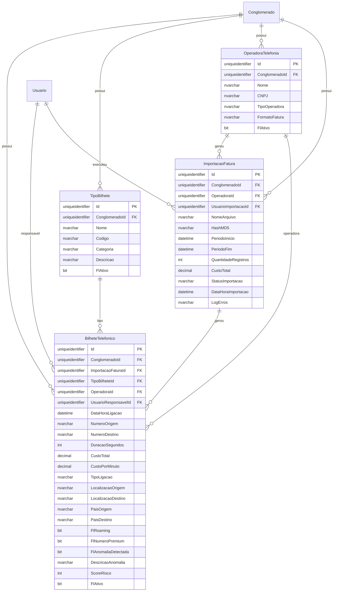

# Modelo de Dados - RF039 - Gestão de Bilhetes

**Versão:** 1.0
**Data:** 2025-12-18
**RF Relacionado:** [RF039 - Gestão de Bilhetes](./RF039.md)
**Banco de Dados:** SQL Server (prod) / SQLite (dev)

---

## 1. Diagrama de Entidades (Mermaid)



---

## 2. Entidades

### 2.1 Tabela: BilheteTelefonico

**Descrição:** Armazena todos os bilhetes telefônicos importados das operadoras com análise de custos e detecção de anomalias.

#### Campos

| Campo | Tipo | Nulo | Default | Descrição |
|-------|------|------|---------|-----------|
| Id | UNIQUEIDENTIFIER | NÃO | NEWID() | Chave primária |
| ClienteId | UNIQUEIDENTIFIER | NÃO | - | Multi-tenancy |
| ImportacaoFaturaId | UNIQUEIDENTIFIER | NÃO | - | Importação origem |
| TipoBilheteId | UNIQUEIDENTIFIER | SIM | NULL | Tipo de ligação |
| OperadoraId | UNIQUEIDENTIFIER | NÃO | - | Operadora telefônica |
| UsuarioResponsavelId | UNIQUEIDENTIFIER | SIM | NULL | Usuário vinculado ao número |
| DataHoraLigacao | DATETIME2 | NÃO | - | Data/hora da ligação |
| NumeroOrigem | NVARCHAR(20) | NÃO | - | Número origem (formato E.164) |
| NumeroDestino | NVARCHAR(20) | NÃO | - | Número destino (formato E.164) |
| DuracaoSegundos | INT | NÃO | 0 | Duração em segundos |
| CustoTotal | DECIMAL(10,2) | NÃO | 0.00 | Custo total da ligação |
| CustoPorMinuto | DECIMAL(10,2) | SIM | NULL | Custo por minuto calculado |
| TipoLigacao | NVARCHAR(50) | SIM | NULL | LOCAL/DDN/DDI/MOVEL/FIXO/SMS/DADOS |
| LocalizacaoOrigem | NVARCHAR(100) | SIM | NULL | Cidade/Estado origem |
| LocalizacaoDestino | NVARCHAR(100) | SIM | NULL | Cidade/Estado destino |
| PaisOrigem | NVARCHAR(3) | SIM | 'BRA' | Código ISO país origem |
| PaisDestino | NVARCHAR(3) | SIM | 'BRA' | Código ISO país destino |
| FlRoaming | BIT | NÃO | 0 | Indica roaming internacional |
| FlNumeroPremium | BIT | NÃO | 0 | Número premium (0900/0300) |
| FlAnomaliaDetectada | BIT | NÃO | 0 | Anomalia detectada via ML |
| DescricaoAnomalia | NVARCHAR(500) | SIM | NULL | Descrição da anomalia |
| ScoreRisco | INT | SIM | NULL | Score 0-100 (ML) |
| FlAtivo | BIT | NÃO | 1 | Soft delete: false=ativo, true=excluído |
| DataCriacao | DATETIME2 | NÃO | GETUTCDATE() | Auditoria |
| UsuarioCriacaoId | UNIQUEIDENTIFIER | NÃO | - | Auditoria |
| DataModificacao | DATETIME2 | SIM | NULL | Auditoria |
| UsuarioModificacaoId | UNIQUEIDENTIFIER | SIM | NULL | Auditoria |

#### Índices

| Nome | Colunas | Tipo | Descrição |
|------|---------|------|-----------|
| IX_BilheteTelefonico_Conglomerado | ClienteId | NONCLUSTERED | Multi-tenancy |
| IX_BilheteTelefonico_DataHora | DataHoraLigacao | NONCLUSTERED | Consultas por período |
| IX_BilheteTelefonico_NumeroOrigem | NumeroOrigem, ConglomeradoId | NONCLUSTERED | Busca por origem |
| IX_BilheteTelefonico_NumeroDestino | NumeroDestino | NONCLUSTERED | Busca por destino |
| IX_BilheteTelefonico_Importacao | ImportacaoFaturaId | NONCLUSTERED | Rastreio de importação |
| IX_BilheteTelefonico_Anomalia | FlAnomaliaDetectada, ScoreRisco | NONCLUSTERED | Alertas |
| IX_BilheteTelefonico_Usuario | UsuarioResponsavelId, DataHoraLigacao | NONCLUSTERED | Relatórios por usuário |

#### Constraints

| Nome | Tipo | Definição | Descrição |
|------|------|-----------|-----------|
| PK_BilheteTelefonico | PRIMARY KEY | Id | Chave primária |
| FK_BilheteTelefonico_Conglomerado | FOREIGN KEY | ConglomeradoId REFERENCES Conglomerado(Id) | Multi-tenancy |
| FK_BilheteTelefonico_Importacao | FOREIGN KEY | ImportacaoFaturaId REFERENCES ImportacaoFatura(Id) | Importação |
| FK_BilheteTelefonico_TipoBilhete | FOREIGN KEY | TipoBilheteId REFERENCES TipoBilhete(Id) | Tipo |
| FK_BilheteTelefonico_Operadora | FOREIGN KEY | OperadoraId REFERENCES OperadoraTelefonia(Id) | Operadora |
| FK_BilheteTelefonico_Usuario | FOREIGN KEY | UsuarioResponsavelId REFERENCES Usuario(Id) | Responsável |
| CK_BilheteTelefonico_Duracao | CHECK | DuracaoSegundos >= 0 | Duração não negativa |
| CK_BilheteTelefonico_Custo | CHECK | CustoTotal >= 0 | Custo não negativo |
| CK_BilheteTelefonico_ScoreRisco | CHECK | ScoreRisco BETWEEN 0 AND 100 | Score válido |

---

### 2.2 Tabela: TipoBilhete

**Descrição:** Tipos de bilhetes telefônicos (Local, DDN, DDI, Móvel, Fixo, SMS, Dados).

#### Campos

| Campo | Tipo | Nulo | Default | Descrição |
|-------|------|------|---------|-----------|
| Id | UNIQUEIDENTIFIER | NÃO | NEWID() | Chave primária |
| ClienteId | UNIQUEIDENTIFIER | NÃO | - | Multi-tenancy |
| Nome | NVARCHAR(100) | NÃO | - | Nome do tipo |
| Codigo | NVARCHAR(20) | NÃO | - | Código único (LOCAL, DDN, DDI, etc.) |
| Categoria | NVARCHAR(50) | NÃO | - | Categoria (VOZ, SMS, DADOS) |
| Descricao | NVARCHAR(500) | SIM | NULL | Descrição detalhada |
| FlAtivo | BIT | NÃO | 1 | Soft delete: false=ativo, true=excluído |
| DataCriacao | DATETIME2 | NÃO | GETUTCDATE() | Auditoria |
| UsuarioCriacaoId | UNIQUEIDENTIFIER | NÃO | - | Auditoria |
| DataModificacao | DATETIME2 | SIM | NULL | Auditoria |
| UsuarioModificacaoId | UNIQUEIDENTIFIER | SIM | NULL | Auditoria |

#### Índices

| Nome | Colunas | Tipo | Descrição |
|------|---------|------|-----------|
| IX_TipoBilhete_Conglomerado | ClienteId | NONCLUSTERED | Multi-tenancy |
| UX_TipoBilhete_Codigo | ConglomeradoId, Codigo | UNIQUE | Código único por tenant |

---

### 2.3 Tabela: OperadoraTelefonia

**Descrição:** Cadastro de operadoras telefônicas (TIM, Vivo, Claro, Oi, etc.).

#### Campos

| Campo | Tipo | Nulo | Default | Descrição |
|-------|------|------|---------|-----------|
| Id | UNIQUEIDENTIFIER | NÃO | NEWID() | Chave primária |
| ClienteId | UNIQUEIDENTIFIER | NÃO | - | Multi-tenancy |
| Nome | NVARCHAR(100) | NÃO | - | Nome da operadora |
| CNPJ | NVARCHAR(18) | SIM | NULL | CNPJ da operadora |
| TipoOperadora | NVARCHAR(50) | NÃO | - | FIXA/MOVEL/AMBAS |
| FormatoFatura | NVARCHAR(50) | SIM | NULL | CSV/XLS/PDF |
| FlAtivo | BIT | NÃO | 1 | Soft delete: false=ativo, true=excluído |
| DataCriacao | DATETIME2 | NÃO | GETUTCDATE() | Auditoria |
| UsuarioCriacaoId | UNIQUEIDENTIFIER | NÃO | - | Auditoria |

#### Índices

| Nome | Colunas | Tipo | Descrição |
|------|---------|------|-----------|
| IX_OperadoraTelefonia_Conglomerado | ClienteId | NONCLUSTERED | Multi-tenancy |
| UX_OperadoraTelefonia_CNPJ | CNPJ | UNIQUE | CNPJ único |

---

### 2.4 Tabela: ImportacaoFatura

**Descrição:** Controle de importações de faturas telefônicas.

#### Campos

| Campo | Tipo | Nulo | Default | Descrição |
|-------|------|------|---------|-----------|
| Id | UNIQUEIDENTIFIER | NÃO | NEWID() | Chave primária |
| ClienteId | UNIQUEIDENTIFIER | NÃO | - | Multi-tenancy |
| OperadoraId | UNIQUEIDENTIFIER | NÃO | - | Operadora origem |
| UsuarioImportacaoId | UNIQUEIDENTIFIER | NÃO | - | Usuário que importou |
| NomeArquivo | NVARCHAR(255) | NÃO | - | Nome do arquivo |
| HashMD5 | NVARCHAR(32) | NÃO | - | Hash para evitar duplicação |
| PeriodoInicio | DATE | NÃO | - | Início do período |
| PeriodoFim | DATE | NÃO | - | Fim do período |
| QuantidadeRegistros | INT | NÃO | 0 | Quantidade de bilhetes |
| CustoTotal | DECIMAL(12,2) | NÃO | 0.00 | Custo total da fatura |
| StatusImportacao | NVARCHAR(50) | NÃO | 'PROCESSANDO' | PROCESSANDO/CONCLUIDO/ERRO |
| DataHoraImportacao | DATETIME2 | NÃO | GETUTCDATE() | Timestamp importação |
| LogErros | NVARCHAR(MAX) | SIM | NULL | Log de erros (JSON) |
| FlAtivo | BIT | NÃO | 1 | Soft delete: false=ativo, true=excluído |

#### Índices

| Nome | Colunas | Tipo | Descrição |
|------|---------|------|-----------|
| IX_ImportacaoFatura_Conglomerado | ClienteId | NONCLUSTERED | Multi-tenancy |
| IX_ImportacaoFatura_Periodo | PeriodoInicio, PeriodoFim | NONCLUSTERED | Consultas por período |
| UX_ImportacaoFatura_Hash | ConglomeradoId, HashMD5 | UNIQUE | Evitar duplicação |

---

## 3. Relacionamentos

| Tabela Origem | Cardinalidade | Tabela Destino | Descrição |
|---------------|---------------|----------------|-----------|
| Conglomerado | 1:N | BilheteTelefonico | Conglomerado possui muitos bilhetes |
| Conglomerado | 1:N | TipoBilhete | Conglomerado possui muitos tipos |
| Conglomerado | 1:N | OperadoraTelefonia | Conglomerado possui muitas operadoras |
| Conglomerado | 1:N | ImportacaoFatura | Conglomerado possui muitas importações |
| OperadoraTelefonia | 1:N | BilheteTelefonico | Operadora gerou muitos bilhetes |
| OperadoraTelefonia | 1:N | ImportacaoFatura | Operadora gerou muitas importações |
| TipoBilhete | 1:N | BilheteTelefonico | Tipo classifica muitos bilhetes |
| ImportacaoFatura | 1:N | BilheteTelefonico | Importação gerou muitos bilhetes |
| Usuario | 1:N | BilheteTelefonico | Usuário responsável por muitos bilhetes |
| Usuario | 1:N | ImportacaoFatura | Usuário executou muitas importações |

---

## 4. DDL - SQL Server

```sql
-- =============================================
-- RF039 - Gestão de Bilhetes Telefônicos
-- Modelo de Dados
-- Data: 2025-12-18
-- =============================================

-- ---------------------------------------------
-- Tabela: TipoBilhete
-- ---------------------------------------------
CREATE TABLE TipoBilhete (
    Id UNIQUEIDENTIFIER PRIMARY KEY DEFAULT NEWID(),
    ClienteId UNIQUEIDENTIFIER NOT NULL,
    Nome NVARCHAR(100) NOT NULL,
    Codigo NVARCHAR(20) NOT NULL,
    Categoria NVARCHAR(50) NOT NULL,
    Descricao NVARCHAR(500),
    FlFlExcluido BIT NOT NULL DEFAULT 0,
    DataCriacao DATETIME2 NOT NULL DEFAULT GETUTCDATE(),
    UsuarioCriacaoId UNIQUEIDENTIFIER NOT NULL,
    DataModificacao DATETIME2,
    UsuarioModificacaoId UNIQUEIDENTIFIER,

    CONSTRAINT FK_TipoBilhete_Conglomerado
        FOREIGN KEY (ClienteId) REFERENCES Cliente(Id),
    CONSTRAINT FK_TipoBilhete_UsuarioCriacao
        FOREIGN KEY (UsuarioCriacaoId) REFERENCES Usuario(Id),
    CONSTRAINT FK_TipoBilhete_UsuarioModificacao
        FOREIGN KEY (UsuarioModificacaoId) REFERENCES Usuario(Id)
);

CREATE NONCLUSTERED INDEX IX_TipoBilhete_Conglomerado
    ON TipoBilhete(ConglomeradoId);
CREATE UNIQUE NONCLUSTERED INDEX UX_TipoBilhete_Codigo
    ON TipoBilhete(ConglomeradoId, Codigo) WHERE FlAtivo = 1;

-- ---------------------------------------------
-- Tabela: OperadoraTelefonia
-- ---------------------------------------------
CREATE TABLE OperadoraTelefonia (
    Id UNIQUEIDENTIFIER PRIMARY KEY DEFAULT NEWID(),
    ClienteId UNIQUEIDENTIFIER NOT NULL,
    Nome NVARCHAR(100) NOT NULL,
    CNPJ NVARCHAR(18),
    TipoOperadora NVARCHAR(50) NOT NULL,
    FormatoFatura NVARCHAR(50),
    FlFlExcluido BIT NOT NULL DEFAULT 0,
    DataCriacao DATETIME2 NOT NULL DEFAULT GETUTCDATE(),
    UsuarioCriacaoId UNIQUEIDENTIFIER NOT NULL,
    DataModificacao DATETIME2,
    UsuarioModificacaoId UNIQUEIDENTIFIER,

    CONSTRAINT FK_OperadoraTelefonia_Conglomerado
        FOREIGN KEY (ClienteId) REFERENCES Cliente(Id),
    CONSTRAINT FK_OperadoraTelefonia_UsuarioCriacao
        FOREIGN KEY (UsuarioCriacaoId) REFERENCES Usuario(Id)
);

CREATE NONCLUSTERED INDEX IX_OperadoraTelefonia_Conglomerado
    ON OperadoraTelefonia(ConglomeradoId);
CREATE UNIQUE NONCLUSTERED INDEX UX_OperadoraTelefonia_CNPJ
    ON OperadoraTelefonia(CNPJ) WHERE CNPJ IS NOT NULL;

-- ---------------------------------------------
-- Tabela: ImportacaoFatura
-- ---------------------------------------------
CREATE TABLE ImportacaoFatura (
    Id UNIQUEIDENTIFIER PRIMARY KEY DEFAULT NEWID(),
    ClienteId UNIQUEIDENTIFIER NOT NULL,
    OperadoraId UNIQUEIDENTIFIER NOT NULL,
    UsuarioImportacaoId UNIQUEIDENTIFIER NOT NULL,
    NomeArquivo NVARCHAR(255) NOT NULL,
    HashMD5 NVARCHAR(32) NOT NULL,
    PeriodoInicio DATE NOT NULL,
    PeriodoFim DATE NOT NULL,
    QuantidadeRegistros INT NOT NULL DEFAULT 0,
    CustoTotal DECIMAL(12,2) NOT NULL DEFAULT 0.00,
    StatusImportacao NVARCHAR(50) NOT NULL DEFAULT 'PROCESSANDO',
    DataHoraImportacao DATETIME2 NOT NULL DEFAULT GETUTCDATE(),
    LogErros NVARCHAR(MAX),
    FlFlExcluido BIT NOT NULL DEFAULT 0,

    CONSTRAINT FK_ImportacaoFatura_Conglomerado
        FOREIGN KEY (ClienteId) REFERENCES Cliente(Id),
    CONSTRAINT FK_ImportacaoFatura_Operadora
        FOREIGN KEY (OperadoraId) REFERENCES OperadoraTelefonia(Id),
    CONSTRAINT FK_ImportacaoFatura_Usuario
        FOREIGN KEY (UsuarioImportacaoId) REFERENCES Usuario(Id),
    CONSTRAINT CK_ImportacaoFatura_Periodo
        CHECK (PeriodoFim >= PeriodoInicio)
);

CREATE NONCLUSTERED INDEX IX_ImportacaoFatura_Conglomerado
    ON ImportacaoFatura(ConglomeradoId);
CREATE NONCLUSTERED INDEX IX_ImportacaoFatura_Periodo
    ON ImportacaoFatura(PeriodoInicio, PeriodoFim);
CREATE UNIQUE NONCLUSTERED INDEX UX_ImportacaoFatura_Hash
    ON ImportacaoFatura(ConglomeradoId, HashMD5);

-- ---------------------------------------------
-- Tabela: BilheteTelefonico
-- ---------------------------------------------
CREATE TABLE BilheteTelefonico (
    Id UNIQUEIDENTIFIER PRIMARY KEY DEFAULT NEWID(),
    ClienteId UNIQUEIDENTIFIER NOT NULL,
    ImportacaoFaturaId UNIQUEIDENTIFIER NOT NULL,
    TipoBilheteId UNIQUEIDENTIFIER,
    OperadoraId UNIQUEIDENTIFIER NOT NULL,
    UsuarioResponsavelId UNIQUEIDENTIFIER,
    DataHoraLigacao DATETIME2 NOT NULL,
    NumeroOrigem NVARCHAR(20) NOT NULL,
    NumeroDestino NVARCHAR(20) NOT NULL,
    DuracaoSegundos INT NOT NULL DEFAULT 0,
    CustoTotal DECIMAL(10,2) NOT NULL DEFAULT 0.00,
    CustoPorMinuto DECIMAL(10,2),
    TipoLigacao NVARCHAR(50),
    LocalizacaoOrigem NVARCHAR(100),
    LocalizacaoDestino NVARCHAR(100),
    PaisOrigem NVARCHAR(3) DEFAULT 'BRA',
    PaisDestino NVARCHAR(3) DEFAULT 'BRA',
    FlRoaming BIT NOT NULL DEFAULT 0,
    FlNumeroPremium BIT NOT NULL DEFAULT 0,
    FlAnomaliaDetectada BIT NOT NULL DEFAULT 0,
    DescricaoAnomalia NVARCHAR(500),
    ScoreRisco INT,
    FlFlExcluido BIT NOT NULL DEFAULT 0,
    DataCriacao DATETIME2 NOT NULL DEFAULT GETUTCDATE(),
    UsuarioCriacaoId UNIQUEIDENTIFIER NOT NULL,
    DataModificacao DATETIME2,
    UsuarioModificacaoId UNIQUEIDENTIFIER,

    CONSTRAINT FK_BilheteTelefonico_Conglomerado
        FOREIGN KEY (ClienteId) REFERENCES Cliente(Id),
    CONSTRAINT FK_BilheteTelefonico_Importacao
        FOREIGN KEY (ImportacaoFaturaId) REFERENCES ImportacaoFatura(Id),
    CONSTRAINT FK_BilheteTelefonico_TipoBilhete
        FOREIGN KEY (TipoBilheteId) REFERENCES TipoBilhete(Id),
    CONSTRAINT FK_BilheteTelefonico_Operadora
        FOREIGN KEY (OperadoraId) REFERENCES OperadoraTelefonia(Id),
    CONSTRAINT FK_BilheteTelefonico_Usuario
        FOREIGN KEY (UsuarioResponsavelId) REFERENCES Usuario(Id),
    CONSTRAINT FK_BilheteTelefonico_UsuarioCriacao
        FOREIGN KEY (UsuarioCriacaoId) REFERENCES Usuario(Id),
    CONSTRAINT CK_BilheteTelefonico_Duracao
        CHECK (DuracaoSegundos >= 0),
    CONSTRAINT CK_BilheteTelefonico_Custo
        CHECK (CustoTotal >= 0),
    CONSTRAINT CK_BilheteTelefonico_ScoreRisco
        CHECK (ScoreRisco IS NULL OR (ScoreRisco BETWEEN 0 AND 100))
);

CREATE NONCLUSTERED INDEX IX_BilheteTelefonico_Conglomerado
    ON BilheteTelefonico(ConglomeradoId);
CREATE NONCLUSTERED INDEX IX_BilheteTelefonico_DataHora
    ON BilheteTelefonico(DataHoraLigacao);
CREATE NONCLUSTERED INDEX IX_BilheteTelefonico_NumeroOrigem
    ON BilheteTelefonico(NumeroOrigem, ConglomeradoId);
CREATE NONCLUSTERED INDEX IX_BilheteTelefonico_NumeroDestino
    ON BilheteTelefonico(NumeroDestino);
CREATE NONCLUSTERED INDEX IX_BilheteTelefonico_Importacao
    ON BilheteTelefonico(ImportacaoFaturaId);
CREATE NONCLUSTERED INDEX IX_BilheteTelefonico_Anomalia
    ON BilheteTelefonico(FlAnomaliaDetectada, ScoreRisco)
    WHERE FlAnomaliaDetectada = 1;
CREATE NONCLUSTERED INDEX IX_BilheteTelefonico_Usuario
    ON BilheteTelefonico(UsuarioResponsavelId, DataHoraLigacao)
    WHERE UsuarioResponsavelId IS NOT NULL;
```

---

## 5. Dados Iniciais (Seed)

```sql
-- Tipos de Bilhete Padrão
INSERT INTO TipoBilhete (ConglomeradoId, Nome, Codigo, Categoria, Descricao, UsuarioCriacaoId)
VALUES
    ('conglomerado-default', 'Local', 'LOCAL', 'VOZ', 'Ligações locais (mesma área)', 'system-user'),
    ('conglomerado-default', 'DDN', 'DDN', 'VOZ', 'Longa distância nacional', 'system-user'),
    ('conglomerado-default', 'DDI', 'DDI', 'VOZ', 'Longa distância internacional', 'system-user'),
    ('conglomerado-default', 'Móvel', 'MOVEL', 'VOZ', 'Ligações para celular', 'system-user'),
    ('conglomerado-default', 'Fixo', 'FIXO', 'VOZ', 'Ligações para telefone fixo', 'system-user'),
    ('conglomerado-default', 'SMS', 'SMS', 'SMS', 'Mensagens de texto', 'system-user'),
    ('conglomerado-default', 'Dados', 'DADOS', 'DADOS', 'Tráfego de dados móveis', 'system-user');

-- Operadoras Principais
INSERT INTO OperadoraTelefonia (ConglomeradoId, Nome, CNPJ, TipoOperadora, FormatoFatura, UsuarioCriacaoId)
VALUES
    ('conglomerado-default', 'Vivo', '02.558.157/0001-62', 'AMBAS', 'CSV', 'system-user'),
    ('conglomerado-default', 'TIM', '02.421.421/0001-11', 'AMBAS', 'CSV', 'system-user'),
    ('conglomerado-default', 'Claro', '40.432.544/0001-47', 'AMBAS', 'CSV', 'system-user'),
    ('conglomerado-default', 'Oi', '76.535.764/0001-43', 'AMBAS', 'PDF', 'system-user');
```

---

## 6. Observações

### Decisões de Modelagem

1. **Número E.164:** Todos os números armazenados em formato internacional (+5511987654321)
2. **Score de Risco:** Calculado via ML para detecção de anomalias (0-100)
3. **Hash MD5:** Evita reimportação de mesma fatura
4. **Soft Delete:** Todas as tabelas usam FlAtivo para preservar histórico

### Considerações de Performance

1. **Particionamento:** Tabela BilheteTelefonico pode ser particionada por DataHoraLigacao (mensal)
2. **Índices Cobrindo:** Índices incluem colunas frequentemente consultadas
3. **Compressão:** Usar PAGE compression em tabelas grandes (>10M registros)
4. **Retenção:** Bilhetes >2 anos podem ser arquivados em tabelas históricas

### Integração com RF040 (Gestão de Troncos)

Bilhetes podem ser correlacionados com troncos telefônicos via número de origem para análise de QoS e custos integrados.

---

## Histórico de Alterações

| Versão | Data | Autor | Descrição |
|--------|------|-------|-----------|
| 1.0 | 2025-12-18 | Architect Agent | Versão inicial completa |
