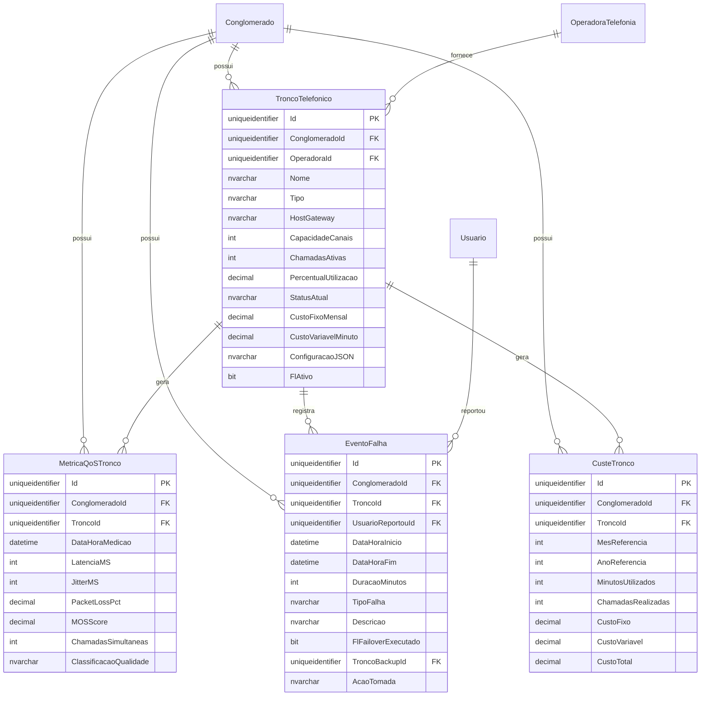

# Modelo de Dados - RF040 - Gestão de Troncos Telefônicos

**Versão:** 1.0
**Data:** 2025-12-18
**RF Relacionado:** [RF040 - Gestão de Troncos Telefônicos](./RF040.md)
**Banco de Dados:** SQL Server (prod) / SQLite (dev)

---

## 1. Diagrama de Entidades (Mermaid)



---

## 2. Entidades

### 2.1 Tabela: TroncoTelefonico

**Descrição:** Cadastro de troncos telefônicos (SIP, E1/R2, analógicos) com monitoramento em tempo real.

#### Campos

| Campo | Tipo | Nulo | Default | Descrição |
|-------|------|------|---------|-----------|
| Id | UNIQUEIDENTIFIER | NÃO | NEWID() | Chave primária |
| ClienteId | UNIQUEIDENTIFIER | NÃO | - | Multi-tenancy |
| OperadoraId | UNIQUEIDENTIFIER | NÃO | - | Operadora fornecedora |
| Nome | NVARCHAR(100) | NÃO | - | Nome identificador do tronco |
| Tipo | NVARCHAR(20) | NÃO | - | SIP/E1/ANALOGICO |
| HostGateway | NVARCHAR(200) | SIM | NULL | Endereço do gateway |
| CapacidadeCanais | INT | NÃO | 30 | Quantidade de canais contratados |
| ChamadasAtivas | INT | NÃO | 0 | Chamadas ativas no momento |
| PercentualUtilizacao | DECIMAL(5,2) | NÃO | 0.00 | % utilização calculado |
| StatusAtual | NVARCHAR(50) | NÃO | 'DISPONIVEL' | DISPONIVEL/OCUPADO/INDISPONIVEL |
| CustoFixoMensal | DECIMAL(10,2) | NÃO | 0.00 | Custo fixo mensal (assinatura) |
| CustoVariavelMinuto | DECIMAL(10,4) | NÃO | 0.00 | Custo por minuto de chamada |
| ConfiguracaoJSON | NVARCHAR(MAX) | SIM | NULL | Configurações técnicas (JSON) |
| FlAtivo | BIT | NÃO | 1 | Soft delete: false=ativo, true=excluído |
| DataCriacao | DATETIME2 | NÃO | GETUTCDATE() | Auditoria |
| UsuarioCriacaoId | UNIQUEIDENTIFIER | NÃO | - | Auditoria |
| DataModificacao | DATETIME2 | SIM | NULL | Auditoria |
| UsuarioModificacaoId | UNIQUEIDENTIFIER | SIM | NULL | Auditoria |

#### Índices

| Nome | Colunas | Tipo | Descrição |
|------|---------|------|-----------|
| IX_TroncoTelefonico_Conglomerado | ClienteId | NONCLUSTERED | Multi-tenancy |
| IX_TroncoTelefonico_Status | StatusAtual, FlAtivo | NONCLUSTERED | Monitoramento |
| IX_TroncoTelefonico_Operadora | OperadoraId | NONCLUSTERED | Consultas por operadora |
| UX_TroncoTelefonico_Nome | ConglomeradoId, Nome | UNIQUE | Nome único por tenant |

#### Constraints

| Nome | Tipo | Definição | Descrição |
|------|------|-----------|-----------|
| PK_TroncoTelefonico | PRIMARY KEY | Id | Chave primária |
| FK_TroncoTelefonico_Conglomerado | FOREIGN KEY | ConglomeradoId REFERENCES Conglomerado(Id) | Multi-tenancy |
| FK_TroncoTelefonico_Operadora | FOREIGN KEY | OperadoraId REFERENCES OperadoraTelefonia(Id) | Operadora |
| CK_TroncoTelefonico_Capacidade | CHECK | CapacidadeCanais > 0 | Capacidade positiva |
| CK_TroncoTelefonico_Utilizacao | CHECK | PercentualUtilizacao BETWEEN 0 AND 100 | % válido |
| CK_TroncoTelefonico_Tipo | CHECK | Tipo IN ('SIP', 'E1', 'ANALOGICO') | Tipo válido |

---

### 2.2 Tabela: MetricaQoSTronco

**Descrição:** Métricas de qualidade de serviço (QoS) coletadas em tempo real.

#### Campos

| Campo | Tipo | Nulo | Default | Descrição |
|-------|------|------|---------|-----------|
| Id | UNIQUEIDENTIFIER | NÃO | NEWID() | Chave primária |
| ClienteId | UNIQUEIDENTIFIER | NÃO | - | Multi-tenancy |
| TroncoId | UNIQUEIDENTIFIER | NÃO | - | Tronco medido |
| DataHoraMedicao | DATETIME2 | NÃO | GETUTCDATE() | Timestamp da medição |
| LatenciaMS | INT | SIM | NULL | Latência em milissegundos |
| JitterMS | INT | SIM | NULL | Jitter em milissegundos |
| PacketLossPct | DECIMAL(5,2) | SIM | NULL | Perda de pacotes (%) |
| MOSScore | DECIMAL(3,2) | SIM | NULL | Mean Opinion Score (1.0-5.0) |
| ChamadasSimultaneas | INT | NÃO | 0 | Chamadas simultâneas no momento |
| ClassificacaoQualidade | NVARCHAR(20) | SIM | NULL | EXCELENTE/BOM/REGULAR/RUIM |
| FlAtivo | BIT | NÃO | 1 | Soft delete: false=ativo, true=excluído |

#### Índices

| Nome | Colunas | Tipo | Descrição |
|------|---------|------|-----------|
| IX_MetricaQoS_Conglomerado | ClienteId | NONCLUSTERED | Multi-tenancy |
| IX_MetricaQoS_Tronco_Data | TroncoId, DataHoraMedicao DESC | NONCLUSTERED | Consultas históricas |
| IX_MetricaQoS_MOS | MOSScore | NONCLUSTERED | Análise de qualidade |

#### Constraints

| Nome | Tipo | Definição | Descrição |
|------|------|-----------|-----------|
| PK_MetricaQoSTronco | PRIMARY KEY | Id | Chave primária |
| FK_MetricaQoS_Conglomerado | FOREIGN KEY | ConglomeradoId REFERENCES Conglomerado(Id) | Multi-tenancy |
| FK_MetricaQoS_Tronco | FOREIGN KEY | TroncoId REFERENCES TroncoTelefonico(Id) | Tronco |
| CK_MetricaQoS_MOS | CHECK | MOSScore IS NULL OR MOSScore BETWEEN 1.0 AND 5.0 | Score válido |
| CK_MetricaQoS_PacketLoss | CHECK | PacketLossPct IS NULL OR PacketLossPct BETWEEN 0 AND 100 | % válido |

---

### 2.3 Tabela: EventoFalha

**Descrição:** Registro de falhas, failovers e eventos críticos em troncos.

#### Campos

| Campo | Tipo | Nulo | Default | Descrição |
|-------|------|------|---------|-----------|
| Id | UNIQUEIDENTIFIER | NÃO | NEWID() | Chave primária |
| ClienteId | UNIQUEIDENTIFIER | NÃO | - | Multi-tenancy |
| TroncoId | UNIQUEIDENTIFIER | NÃO | - | Tronco afetado |
| UsuarioReportouId | UNIQUEIDENTIFIER | SIM | NULL | Usuário que reportou (se manual) |
| DataHoraInicio | DATETIME2 | NÃO | GETUTCDATE() | Início da falha |
| DataHoraFim | DATETIME2 | SIM | NULL | Fim da falha (null se ativa) |
| DuracaoMinutos | INT | SIM | NULL | Duração em minutos |
| TipoFalha | NVARCHAR(50) | NÃO | - | TIMEOUT/DEGRADACAO_QOS/CONGESTIONAMENTO |
| Descricao | NVARCHAR(1000) | SIM | NULL | Descrição detalhada |
| FlFailoverExecutado | BIT | NÃO | 0 | Failover automático executado |
| TroncoBackupId | UNIQUEIDENTIFIER | SIM | NULL | Tronco backup usado |
| AcaoTomada | NVARCHAR(500) | SIM | NULL | Ação corretiva tomada |
| FlAtivo | BIT | NÃO | 1 | Soft delete: false=ativo, true=excluído |

#### Índices

| Nome | Colunas | Tipo | Descrição |
|------|---------|------|-----------|
| IX_EventoFalha_Conglomerado | ClienteId | NONCLUSTERED | Multi-tenancy |
| IX_EventoFalha_Tronco_Data | TroncoId, DataHoraInicio DESC | NONCLUSTERED | Histórico |
| IX_EventoFalha_Ativo | TroncoId, DataHoraFim | NONCLUSTERED | Falhas ativas |

#### Constraints

| Nome | Tipo | Definição | Descrição |
|------|------|-----------|-----------|
| PK_EventoFalha | PRIMARY KEY | Id | Chave primária |
| FK_EventoFalha_Conglomerado | FOREIGN KEY | ConglomeradoId REFERENCES Conglomerado(Id) | Multi-tenancy |
| FK_EventoFalha_Tronco | FOREIGN KEY | TroncoId REFERENCES TroncoTelefonico(Id) | Tronco |
| FK_EventoFalha_TroncoBackup | FOREIGN KEY | TroncoBackupId REFERENCES TroncoTelefonico(Id) | Backup |
| FK_EventoFalha_Usuario | FOREIGN KEY | UsuarioReportouId REFERENCES Usuario(Id) | Reportado por |

---

### 2.4 Tabela: CusteTronco

**Descrição:** Custeio mensal detalhado por tronco com rateio.

#### Campos

| Campo | Tipo | Nulo | Default | Descrição |
|-------|------|------|---------|-----------|
| Id | UNIQUEIDENTIFIER | NÃO | NEWID() | Chave primária |
| ClienteId | UNIQUEIDENTIFIER | NÃO | - | Multi-tenancy |
| TroncoId | UNIQUEIDENTIFIER | NÃO | - | Tronco custeado |
| MesReferencia | INT | NÃO | - | Mês (1-12) |
| AnoReferencia | INT | NÃO | - | Ano (ex: 2025) |
| MinutosUtilizados | INT | NÃO | 0 | Total de minutos utilizados |
| ChamadasRealizadas | INT | NÃO | 0 | Total de chamadas realizadas |
| CustoFixo | DECIMAL(10,2) | NÃO | 0.00 | Custo fixo mensal |
| CustoVariavel | DECIMAL(10,2) | NÃO | 0.00 | Custo variável (minutos) |
| CustoTotal | DECIMAL(10,2) | NÃO | 0.00 | Custo total (fixo + variável) |
| FlAtivo | BIT | NÃO | 1 | Soft delete: false=ativo, true=excluído |
| DataCriacao | DATETIME2 | NÃO | GETUTCDATE() | Auditoria |
| UsuarioCriacaoId | UNIQUEIDENTIFIER | NÃO | - | Auditoria |

#### Índices

| Nome | Colunas | Tipo | Descrição |
|------|---------|------|-----------|
| IX_CusteTronco_Conglomerado | ClienteId | NONCLUSTERED | Multi-tenancy |
| IX_CusteTronco_Periodo | AnoReferencia, MesReferencia | NONCLUSTERED | Consultas por período |
| UX_CusteTronco_Unico | ConglomeradoId, TroncoId, AnoReferencia, MesReferencia | UNIQUE | Um custeio por mês |

#### Constraints

| Nome | Tipo | Definição | Descrição |
|------|------|-----------|-----------|
| PK_CusteTronco | PRIMARY KEY | Id | Chave primária |
| FK_CusteTronco_Conglomerado | FOREIGN KEY | ConglomeradoId REFERENCES Conglomerado(Id) | Multi-tenancy |
| FK_CusteTronco_Tronco | FOREIGN KEY | TroncoId REFERENCES TroncoTelefonico(Id) | Tronco |
| CK_CusteTronco_Mes | CHECK | MesReferencia BETWEEN 1 AND 12 | Mês válido |
| CK_CusteTronco_Ano | CHECK | AnoReferencia >= 2020 | Ano válido |

---

## 3. Relacionamentos

| Tabela Origem | Cardinalidade | Tabela Destino | Descrição |
|---------------|---------------|----------------|-----------|
| Conglomerado | 1:N | TroncoTelefonico | Conglomerado possui muitos troncos |
| Conglomerado | 1:N | MetricaQoSTronco | Conglomerado possui muitas métricas |
| Conglomerado | 1:N | EventoFalha | Conglomerado possui muitas falhas |
| Conglomerado | 1:N | CusteTronco | Conglomerado possui muitos custos |
| OperadoraTelefonia | 1:N | TroncoTelefonico | Operadora fornece muitos troncos |
| TroncoTelefonico | 1:N | MetricaQoSTronco | Tronco gera muitas métricas |
| TroncoTelefonico | 1:N | EventoFalha | Tronco registra muitas falhas |
| TroncoTelefonico | 1:N | CusteTronco | Tronco gera muitos custos |
| Usuario | 1:N | EventoFalha | Usuário reportou muitas falhas |

---

## 4. DDL - SQL Server

```sql
-- =============================================
-- RF040 - Gestão de Troncos Telefônicos
-- Modelo de Dados
-- Data: 2025-12-18
-- =============================================

-- ---------------------------------------------
-- Tabela: TroncoTelefonico
-- ---------------------------------------------
CREATE TABLE TroncoTelefonico (
    Id UNIQUEIDENTIFIER PRIMARY KEY DEFAULT NEWID(),
    ClienteId UNIQUEIDENTIFIER NOT NULL,
    OperadoraId UNIQUEIDENTIFIER NOT NULL,
    Nome NVARCHAR(100) NOT NULL,
    Tipo NVARCHAR(20) NOT NULL,
    HostGateway NVARCHAR(200),
    CapacidadeCanais INT NOT NULL DEFAULT 30,
    ChamadasAtivas INT NOT NULL DEFAULT 0,
    PercentualUtilizacao DECIMAL(5,2) NOT NULL DEFAULT 0.00,
    StatusAtual NVARCHAR(50) NOT NULL DEFAULT 'DISPONIVEL',
    CustoFixoMensal DECIMAL(10,2) NOT NULL DEFAULT 0.00,
    CustoVariavelMinuto DECIMAL(10,4) NOT NULL DEFAULT 0.00,
    ConfiguracaoJSON NVARCHAR(MAX),
    FlFlExcluido BIT NOT NULL DEFAULT 0,
    DataCriacao DATETIME2 NOT NULL DEFAULT GETUTCDATE(),
    UsuarioCriacaoId UNIQUEIDENTIFIER NOT NULL,
    DataModificacao DATETIME2,
    UsuarioModificacaoId UNIQUEIDENTIFIER,

    CONSTRAINT FK_TroncoTelefonico_Conglomerado
        FOREIGN KEY (ClienteId) REFERENCES Cliente(Id),
    CONSTRAINT FK_TroncoTelefonico_Operadora
        FOREIGN KEY (OperadoraId) REFERENCES OperadoraTelefonia(Id),
    CONSTRAINT FK_TroncoTelefonico_UsuarioCriacao
        FOREIGN KEY (UsuarioCriacaoId) REFERENCES Usuario(Id),
    CONSTRAINT CK_TroncoTelefonico_Capacidade
        CHECK (CapacidadeCanais > 0),
    CONSTRAINT CK_TroncoTelefonico_Utilizacao
        CHECK (PercentualUtilizacao BETWEEN 0 AND 100),
    CONSTRAINT CK_TroncoTelefonico_Tipo
        CHECK (Tipo IN ('SIP', 'E1', 'ANALOGICO'))
);

CREATE NONCLUSTERED INDEX IX_TroncoTelefonico_Conglomerado
    ON TroncoTelefonico(ConglomeradoId);
CREATE NONCLUSTERED INDEX IX_TroncoTelefonico_Status
    ON TroncoTelefonico(StatusAtual, FlAtivo);
CREATE NONCLUSTERED INDEX IX_TroncoTelefonico_Operadora
    ON TroncoTelefonico(OperadoraId);
CREATE UNIQUE NONCLUSTERED INDEX UX_TroncoTelefonico_Nome
    ON TroncoTelefonico(ConglomeradoId, Nome) WHERE FlAtivo = 1;

-- ---------------------------------------------
-- Tabela: MetricaQoSTronco
-- ---------------------------------------------
CREATE TABLE MetricaQoSTronco (
    Id UNIQUEIDENTIFIER PRIMARY KEY DEFAULT NEWID(),
    ClienteId UNIQUEIDENTIFIER NOT NULL,
    TroncoId UNIQUEIDENTIFIER NOT NULL,
    DataHoraMedicao DATETIME2 NOT NULL DEFAULT GETUTCDATE(),
    LatenciaMS INT,
    JitterMS INT,
    PacketLossPct DECIMAL(5,2),
    MOSScore DECIMAL(3,2),
    ChamadasSimultaneas INT NOT NULL DEFAULT 0,
    ClassificacaoQualidade NVARCHAR(20),
    FlFlExcluido BIT NOT NULL DEFAULT 0,

    CONSTRAINT FK_MetricaQoS_Conglomerado
        FOREIGN KEY (ClienteId) REFERENCES Cliente(Id),
    CONSTRAINT FK_MetricaQoS_Tronco
        FOREIGN KEY (TroncoId) REFERENCES TroncoTelefonico(Id),
    CONSTRAINT CK_MetricaQoS_MOS
        CHECK (MOSScore IS NULL OR MOSScore BETWEEN 1.0 AND 5.0),
    CONSTRAINT CK_MetricaQoS_PacketLoss
        CHECK (PacketLossPct IS NULL OR PacketLossPct BETWEEN 0 AND 100)
);

CREATE NONCLUSTERED INDEX IX_MetricaQoS_Conglomerado
    ON MetricaQoSTronco(ConglomeradoId);
CREATE NONCLUSTERED INDEX IX_MetricaQoS_Tronco_Data
    ON MetricaQoSTronco(TroncoId, DataHoraMedicao DESC);
CREATE NONCLUSTERED INDEX IX_MetricaQoS_MOS
    ON MetricaQoSTronco(MOSScore) WHERE MOSScore IS NOT NULL;

-- ---------------------------------------------
-- Tabela: EventoFalha
-- ---------------------------------------------
CREATE TABLE EventoFalha (
    Id UNIQUEIDENTIFIER PRIMARY KEY DEFAULT NEWID(),
    ClienteId UNIQUEIDENTIFIER NOT NULL,
    TroncoId UNIQUEIDENTIFIER NOT NULL,
    UsuarioReportouId UNIQUEIDENTIFIER,
    DataHoraInicio DATETIME2 NOT NULL DEFAULT GETUTCDATE(),
    DataHoraFim DATETIME2,
    DuracaoMinutos INT,
    TipoFalha NVARCHAR(50) NOT NULL,
    Descricao NVARCHAR(1000),
    FlFailoverExecutado BIT NOT NULL DEFAULT 0,
    TroncoBackupId UNIQUEIDENTIFIER,
    AcaoTomada NVARCHAR(500),
    FlFlExcluido BIT NOT NULL DEFAULT 0,

    CONSTRAINT FK_EventoFalha_Conglomerado
        FOREIGN KEY (ClienteId) REFERENCES Cliente(Id),
    CONSTRAINT FK_EventoFalha_Tronco
        FOREIGN KEY (TroncoId) REFERENCES TroncoTelefonico(Id),
    CONSTRAINT FK_EventoFalha_TroncoBackup
        FOREIGN KEY (TroncoBackupId) REFERENCES TroncoTelefonico(Id),
    CONSTRAINT FK_EventoFalha_Usuario
        FOREIGN KEY (UsuarioReportouId) REFERENCES Usuario(Id)
);

CREATE NONCLUSTERED INDEX IX_EventoFalha_Conglomerado
    ON EventoFalha(ConglomeradoId);
CREATE NONCLUSTERED INDEX IX_EventoFalha_Tronco_Data
    ON EventoFalha(TroncoId, DataHoraInicio DESC);
CREATE NONCLUSTERED INDEX IX_EventoFalha_Ativo
    ON EventoFalha(TroncoId, DataHoraFim) WHERE DataHoraFim IS NULL;

-- ---------------------------------------------
-- Tabela: CusteTronco
-- ---------------------------------------------
CREATE TABLE CusteTronco (
    Id UNIQUEIDENTIFIER PRIMARY KEY DEFAULT NEWID(),
    ClienteId UNIQUEIDENTIFIER NOT NULL,
    TroncoId UNIQUEIDENTIFIER NOT NULL,
    MesReferencia INT NOT NULL,
    AnoReferencia INT NOT NULL,
    MinutosUtilizados INT NOT NULL DEFAULT 0,
    ChamadasRealizadas INT NOT NULL DEFAULT 0,
    CustoFixo DECIMAL(10,2) NOT NULL DEFAULT 0.00,
    CustoVariavel DECIMAL(10,2) NOT NULL DEFAULT 0.00,
    CustoTotal DECIMAL(10,2) NOT NULL DEFAULT 0.00,
    FlFlExcluido BIT NOT NULL DEFAULT 0,
    DataCriacao DATETIME2 NOT NULL DEFAULT GETUTCDATE(),
    UsuarioCriacaoId UNIQUEIDENTIFIER NOT NULL,

    CONSTRAINT FK_CusteTronco_Conglomerado
        FOREIGN KEY (ClienteId) REFERENCES Cliente(Id),
    CONSTRAINT FK_CusteTronco_Tronco
        FOREIGN KEY (TroncoId) REFERENCES TroncoTelefonico(Id),
    CONSTRAINT FK_CusteTronco_UsuarioCriacao
        FOREIGN KEY (UsuarioCriacaoId) REFERENCES Usuario(Id),
    CONSTRAINT CK_CusteTronco_Mes
        CHECK (MesReferencia BETWEEN 1 AND 12),
    CONSTRAINT CK_CusteTronco_Ano
        CHECK (AnoReferencia >= 2020)
);

CREATE NONCLUSTERED INDEX IX_CusteTronco_Conglomerado
    ON CusteTronco(ConglomeradoId);
CREATE NONCLUSTERED INDEX IX_CusteTronco_Periodo
    ON CusteTronco(AnoReferencia, MesReferencia);
CREATE UNIQUE NONCLUSTERED INDEX UX_CusteTronco_Unico
    ON CusteTronco(ConglomeradoId, TroncoId, AnoReferencia, MesReferencia);
```

---

## 5. Dados Iniciais (Seed)

```sql
-- Nenhum dado inicial necessário
-- Troncos serão cadastrados durante a operação
```

---

## 6. Observações

### Decisões de Modelagem

1. **Polling 30s:** MetricaQoSTronco armazena medições a cada 30 segundos (2.880 registros/dia/tronco)
2. **Particionamento:** Tabela MetricaQoSTronco deve ser particionada por DataHoraMedicao (diário)
3. **MOS Score:** Calculado via algoritmo E-Model (ITU-T G.107) a partir de jitter/latência/packet loss
4. **Retenção:** Métricas >90 dias podem ser agregadas (médias horárias) para economizar espaço

### Considerações de Performance

1. **Particionamento:** MetricaQoSTronco particionada por data (range partition mensal)
2. **Compressão:** PAGE compression em MetricaQoSTronco (alta taxa de compressão)
3. **Índices Filtrados:** Índices com WHERE para dados ativos/recentes
4. **Agregação:** Job diário para agregar métricas antigas em tabela MetricaQoSTroncoAgregada

### Integração com RF039 (Gestão de Bilhetes)

Bilhetes podem referenciar TroncoId para análise integrada de custo vs qualidade.

---

## Histórico de Alterações

| Versão | Data | Autor | Descrição |
|--------|------|-------|-----------|
| 1.0 | 2025-12-18 | Architect Agent | Versão inicial completa |
