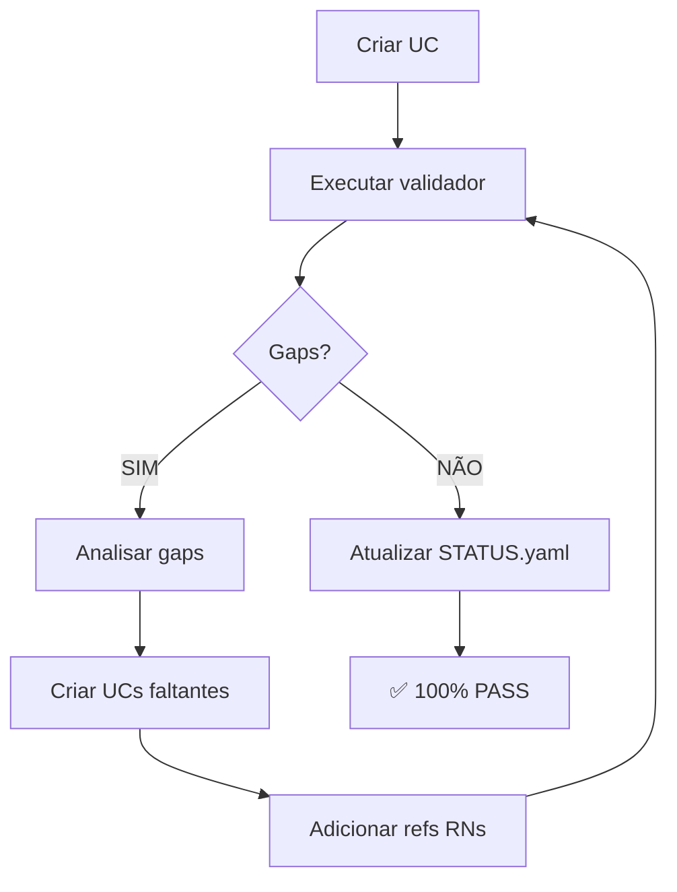

# 📊 Validador de Cobertura RF→UC

**Ferramenta:** `validator-rf-uc-coverage.py`
**Versão:** 1.0
**Data:** 2025-12-31
**Autor:** Agência ALC - alc.dev.br

---

## 🎯 Objetivo

Validar automaticamente se os Casos de Uso (UC) cobrem **100%** das funcionalidades e Regras de Negócio (RN) especificadas no Requisito Funcional (RF).

---

## 🚀 Uso Rápido

```bash
# Validar RF específico
python tools/docs/validator-rf-uc-coverage.py --rf RF001

# Validar todos os RFs
python tools/docs/validator-rf-uc-coverage.py --all

# Validar com saída JSON customizada
python tools/docs/validator-rf-uc-coverage.py --rf RF001 --output meu-relatorio.json
```

---

## 📋 O Que o Validador Detecta

| Gap | Severidade | Descrição |
|-----|------------|-----------|
| **Funcionalidades não cobertas** | 🔴 CRÍTICO | Funcionalidade existe no RF mas nenhum UC a cobre |
| **RNs não referenciadas** | 🟡 IMPORTANTE | Regra de Negócio existe no RF mas não é mencionada em UC |
| **UCs CRUD faltantes** | 🔴 CRÍTICO | RF CRUD sem UC00, UC01, UC02, UC03 ou UC04 |

---

## 📊 Saída do Validador

### Console
```
📊 ANÁLISE DE COBERTURA RF→UC: RF001

📈 MÉTRICAS:
   Funcionalidades: 0/13
   Regras de Negócio: 0/15
   Total de UCs: 5
   Cobertura: 0.0%
   Status: ❌ NÃO CONFORME

⚠️  GAPS IDENTIFICADOS (28):

🔴 CRÍTICOS:
   • Funcionalidade 'FUNC-01' do RF não está coberta por nenhum UC
     ↳ Criar UC que cubra 'FUNC-01' ou adicionar em UC existente

🟡 IMPORTANTES:
   • Regra de Negócio 'RN-SYS-001-01' não está referenciada em nenhum UC
     ↳ Adicionar 'RN-SYS-001-01' na seção 'Regras de Negócio' do UC correspondente
```

### JSON (relatorios/rfXXX/uc/auditoria.json)
```json
{
  "rf_id": "RF001",
  "total_funcionalidades": 13,
  "funcionalidades_cobertas": 0,
  "total_rns": 15,
  "rns_cobertas": 0,
  "total_ucs": 5,
  "gaps": [
    {
      "tipo": "funcionalidade_nao_coberta",
      "item_id": "FUNC-01",
      "descricao": "Funcionalidade 'FUNC-01' do RF não está coberta por nenhum UC",
      "severidade": "CRÍTICO",
      "recomendacao": "Criar UC que cubra 'FUNC-01' ou adicionar em UC existente"
    },
    {
      "tipo": "rn_nao_coberta",
      "item_id": "RN-SYS-001-01",
      "descricao": "Regra de Negócio 'RN-SYS-001-01' não está referenciada em nenhum UC",
      "severidade": "IMPORTANTE",
      "recomendacao": "Adicionar 'RN-SYS-001-01' na seção 'Regras de Negócio' do UC correspondente"
    }
  ],
  "cobertura_percentual": 0.0,
  "conforme": false,
  "timestamp": "2025-12-31T20:30:00.000000"
}
```

---

## ✅ Critério de Aprovação

O validador retorna **exit code 0 (PASS)** apenas se:

- ✅ **Cobertura de funcionalidades = 100%**
- ✅ **Cobertura de RNs = 100%**
- ✅ **UCs CRUD obrigatórios presentes** (quando aplicável)
- ✅ **Nenhum gap identificado**

Caso contrário, retorna **exit code 1 (FAIL)**.

---

## 🔧 Como Funciona

### 1. Extração do RF

#### Funcionalidades
**Fonte primária:** `RF.md` seção "## 2. FUNCIONALIDADES"
- Procura por `### 2.1. Nome da Funcionalidade`
- Gera ID automático: `FUNC-01`, `FUNC-02`, etc.

**Fallback:** `RF.yaml` campo `escopo.incluso`
- Usado se RF.md não tiver seção de funcionalidades
- Cada item do array vira uma funcionalidade

#### Regras de Negócio
**Fonte primária:** `RF.yaml` campo `regras_negocio[]`
- Extrai `id` e `descricao` de cada regra

**Complemento:** `RF.md` padrões de RN
- `RN-SYS-XXX-NN`: Descrição
- `RN-RFXXX-NNN`: Descrição
- `**RN-XXX-NNN**`: Descrição

### 2. Extração dos UCs

#### IDs dos UCs
**Fonte:** `UC.md` + `UC.yaml`
- UC.md: Procura por `## UC00`, `### UC01`, etc.
- UC.yaml: Campo `casos_de_uso[].id`

#### Cobertura de Funcionalidades
**Fonte:** `UC.yaml` campo `casos_de_uso[].covers.rf_items[]`
```yaml
casos_de_uso:
  - id: "UC01"
    covers:
      documentacao_items:
        - "FUNC-01"  # Esta funcionalidade está coberta por UC01
        - "FUNC-02"
```

#### Referências de RNs
**Fonte:** `UC.md` texto completo
- Busca por padrões: `RN-SYS-001-01`, `RN-RFXXX-NNN`, etc.
- Qualquer menção da RN conta como "coberta"

### 3. Análise de Gaps

Compara RF vs UC e identifica:
- **Gap Tipo 1:** Funcionalidade em RF, nenhum UC cobre
- **Gap Tipo 2:** RN em RF, nenhum UC menciona
- **Gap Tipo 3:** RF CRUD sem UC00-UC04

---

## 🔄 Workflow de Correção



**Fluxo textual:**
1. Criar `UC-RFXXX.md` e `UC-RFXXX.yaml`
2. Executar `validator-rf-uc-coverage.py --rf RFXXX`
3. Se gaps identificados:
   - Analisar `auditoria.json`
   - Criar UCs faltantes
   - Adicionar referências de RNs
   - Revalidar (passo 2)
4. Quando 100% PASS:
   - Atualizar `STATUS.yaml`
   - Marcar `validacoes.rf_uc_cobertura_total = true`

---

## 📦 Integração com Contratos

### CONTRATO-GERACAO-DOCS-UC.md

**Fase 4: Validação e Correção Iterativa (OBRIGATÓRIA)**

```markdown
#### 4.1 Executar Validador de Cobertura RF→UC (1ª Rodada)

python tools/docs/validator-rf-uc-coverage.py --rf RFXXX

#### 4.2 Processo de Correção Obrigatória

**Se validador identificar gaps (exit code ≠ 0):**

**OBRIGATÓRIO (Processo Iterativo):**
1. Analisar relatório do validador
2. Criar/Complementar UCs faltantes
3. Revalidar (2ª rodada)
4. Se ainda falhar - Repetir 1-3
5. Apenas após validação passar - Atualizar STATUS.yaml
```

---

## 🧪 Exemplos

### Exemplo 1: RF001 (CRUD) - Gaps Identificados

```bash
$ python validator-rf-uc-coverage.py --rf RF001

📊 ANÁLISE DE COBERTURA RF→UC: RF001

📈 MÉTRICAS:
   Funcionalidades: 0/13
   Regras de Negócio: 0/15
   Total de UCs: 5
   Cobertura: 0.0%
   Status: ❌ NÃO CONFORME

⚠️  GAPS IDENTIFICADOS (28):

🔴 CRÍTICOS:
   • Funcionalidade 'FUNC-01' do RF não está coberta por nenhum UC
   ...

🟡 IMPORTANTES:
   • Regra de Negócio 'RN-SYS-001-01' não está referenciada em nenhum UC
   ...

$ echo $?
1  # Exit code 1 = FAIL
```

### Exemplo 2: Após Correção - 100% PASS

```bash
$ python validator-rf-uc-coverage.py --rf RF003

📊 ANÁLISE DE COBERTURA RF→UC: RF003

📈 MÉTRICAS:
   Funcionalidades: 12/12
   Regras de Negócio: 8/8
   Total de UCs: 7
   Cobertura: 100.0%
   Status: ✅ CONFORME

✅ NENHUM GAP IDENTIFICADO - 100% CONFORME!

$ echo $?
0  # Exit code 0 = PASS
```

### Exemplo 3: Validar Todos os RFs

```bash
$ python validator-rf-uc-coverage.py --all --output relatorio-geral.json

📊 RESUMO GERAL: 93 RFs analisados

   ✅ Conformes: 45/93
   ❌ Não Conformes: 48/93

⚠️  RFs NÃO CONFORMES:

   RF001: 0.0% (28 gaps)
   RF005: 65.0% (7 gaps)
   RF012: 85.0% (3 gaps)
   ...

📄 Relatório consolidado salvo em: relatorio-geral.json

$ echo $?
1  # Exit code 1 = FAIL (porque há não conformes)
```

---

## ⚙️ Configuração Avançada

### Personalizar Padrões de Extração

Editar `validator-rf-uc-coverage.py`:

```python
# Padrão de funcionalidades
pattern_funcionalidades = r'###\s+\d+\.\d+\.?\s+(.+)'  # Linha 113

# Padrões de RNs
patterns = [
    r'\*?\*?RN-[A-Z]{3}-\d{3}-\d{2}\*?\*?:?\s*(.+)',  # Linha 190
    r'\*?\*?RN-RF\d{3}-\d{3}\*?\*?:?\s*(.+)',
    r'\*?\*?RN-[A-Z]+-\d{3}-\d{2}\*?\*?:?\s*(.+)'
]
```

### Ajustar UCs Obrigatórios

Para RFs não-CRUD, modificar linha 296:

```python
# CRUD padrão
ucs_minimos_crud = {'UC00', 'UC01', 'UC02', 'UC03', 'UC04'}

# Personalizado (ex: RF de Logs)
ucs_minimos_logs = {'UC00', 'UC01', 'UC02', 'UC03', 'UC04', 'UC05', 'UC06', 'UC07'}
```

---

## 🐛 Troubleshooting

### Erro: "RF não encontrado"
**Causa:** RF ID inválido ou pasta não existe
**Solução:**
```bash
# Listar RFs disponíveis
ls documentacao/**/RF*

# Executar com RF ID correto
python validator-rf-uc-coverage.py --rf RF001
```

### Erro: "expected alphabetic or numeric character"
**Causa:** Sintaxe YAML inválida em RF.yaml
**Solução:**
```bash
# Validar YAML
python -c "import yaml; yaml.safe_load(open('RF001.yaml'))"

# Corrigir erros de sintaxe
```

### Nenhuma funcionalidade extraída
**Causa:** RF.md sem seção "## 2. FUNCIONALIDADES" ou RF.yaml sem `escopo.incluso`
**Solução:**
- Adicionar seção de funcionalidades em RF.md
- OU adicionar `escopo.incluso` em RF.yaml

### Nenhuma RN extraída
**Causa:** RF.yaml sem `regras_negocio` ou RF.md sem padrões RN-XXX-NNN
**Solução:**
- Adicionar `regras_negocio` em RF.yaml
- OU adicionar RNs em RF.md com padrão correto

---

## 📚 Referências

- [CONTRATO-GERACAO-DOCS-UC.md](../../contracts/documentacao/CONTRATO-GERACAO-DOCS-UC.md) - Contrato de geração de UCs
- [02-UC-GERACAO-GOVERNADA.md](../../prompts/documentacao/02-UC-GERACAO-GOVERNADA.md) - Prompt governado
- [UC.md](../../templates/UC.md) - Template de UC
- [UC.yaml](../../templates/UC.yaml) - Template UC estruturado

---

## 🤝 Contribuindo

Encontrou um bug ou tem sugestão de melhoria?

1. Reporte em: `D:\IC2\docs\tools\docs\ISSUES.md`
2. Ou crie branch: `feature/validador-uc-melhoria-XXXX`

---

**Última Atualização:** 2025-12-31
**Versão:** 1.0
**Autor:** Agência ALC - alc.dev.br
